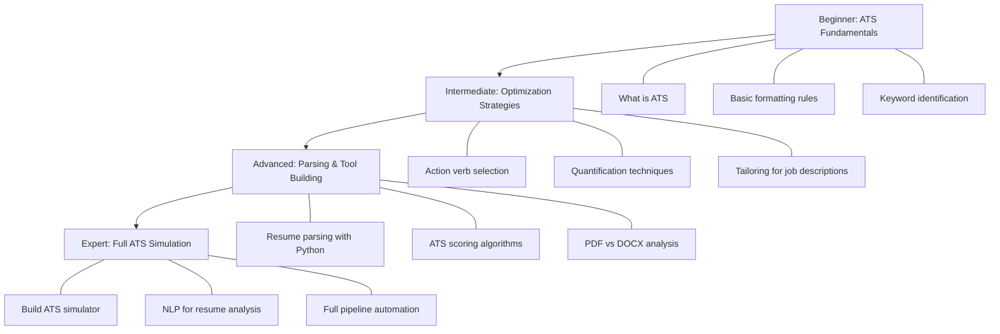
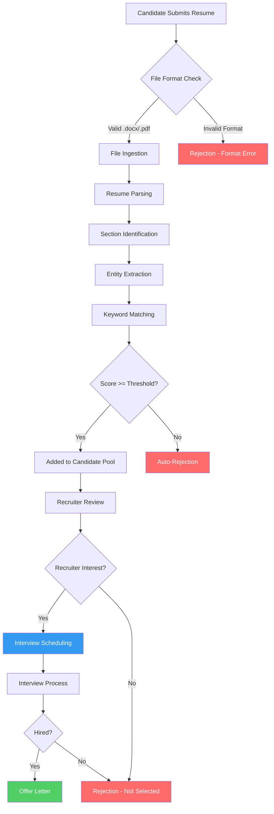
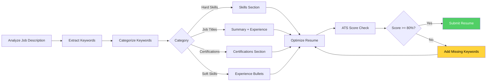
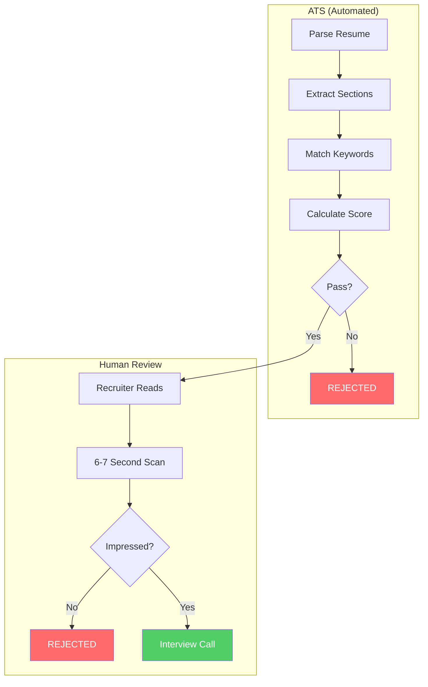

# 01 - Resume & ATS (Applicant Tracking System) Interview Preparation

> **Master the art of crafting resumes that beat the bots and impress recruiters.**

---

## Table of Contents

1. [Introduction](#1-introduction)
2. [Learning Roadmap](#2-learning-roadmap)
3. [Theory Notes](#3-theory-notes)
4. [Key Concepts](#4-key-concepts)
5. [Frequently Asked Interview Questions](#5-frequently-asked-interview-questions)
6. [Hands-on Practice](#6-hands-on-practice)
7. [Before/After Resume Examples](#7-beforeafter-resume-examples)
8. [ATS-Friendly vs Non-ATS-Friendly Resumes](#8-ats-friendly-vs-non-ats-friendly-resumes)
9. [Common Mistakes](#9-common-mistakes)
10. [Best Practices](#10-best-practices)
11. [Cheat Sheet](#11-cheat-sheet)
12. [Flash Cards](#12-flash-cards)
13. [Mind Map](#13-mind-map)
14. [Mermaid Diagrams](#14-mermaid-diagrams)
15. [Code/Template Examples](#15-codetemplate-examples)
16. [Mini Project](#16-mini-project)
17. [Intermediate Project](#17-intermediate-project)
18. [Advanced Project](#18-advanced-project)
19. [Portfolio-Worthy Project Ideas](#19-portfolio-worthy-project-ideas)
20. [Practice Websites](#20-practice-websites)
21. [Books](#21-books)
22. [Documentation Links](#22-documentation-links)
23. [YouTube Channels](#23-youtube-channels)
24. [Blogs](#24-blogs)
25. [Certifications](#25-certifications)
26. [Checklist](#26-checklist)
27. [Revision Notes](#27-revision-notes)
28. [One-Day Revision Plan](#28-one-day-revision-plan)
29. [One-Week Revision Plan](#29-one-week-revision-plan)
30. [Mock Interview](#30-mock-interview)
31. [Difficulty Rating](#31-difficulty-rating)
32. [Summary](#32-summary)
33. [Revision Checklist](#33-revision-checklist)
34. [Practice Tasks](#34-practice-tasks)
35. [Next Topic](#35-next-topic)
36. [References](#36-references)

---

## 1. Introduction

### What is ATS?

An **Applicant Tracking System (ATS)** is software used by employers to manage the recruitment process. It collects, sorts, scans, and ranks resumes submitted for job openings. Over **98% of Fortune 500 companies** use ATS, and an estimated **75% of all resumes** are rejected by ATS before a human ever sees them.

### Why ATS Matters

| Stat | Impact |
|------|--------|
| 98% of Fortune 500 use ATS | Nearly every large company screens digitally |
| 250+ resumes per corporate job | Automation is necessary; humans can't read them all |
| 75% rejected by ATS | Most resumes never reach a recruiter |
| 6-7 seconds average scan time | Even human review is brief |
| $0 - $10,000+ ATS cost | Companies invest heavily in this software |

### How Companies Use ATS

1. **Resume Parsing** - Extracts contact info, work history, education, skills
2. **Keyword Matching** - Compares resume content against job description keywords
3. **Ranking & Scoring** - Assigns a compatibility score to each candidate
4. **Workflow Management** - Tracks candidates through interview stages
5. **Compliance** - Ensures EEO and legal requirements are met

### Common ATS Software

- **Workday** - Used by Amazon, Walmart, Netflix
- **Greenhouse** - Used by Airbnb, Slack, Robinhood
- **Lever** - Used by Dropbox, LinkedIn, Netflix
- **iCIMS** - Used by PepsiCo, Comcast, FedEx
- **Taleo (Oracle)** - Used by Deloitte, TCS, Infosys
- **SmartRecruiters** - Used by LinkedIn, Bosch, Avery Dennison
- **BambooHR** - Popular with SMBs
- **JazzHR** - SMB-focused, used by Twitch, Squarespace

---

## 2. Learning Roadmap



### Beginner (Week 1-2)
- Understand what ATS is and why it exists
- Learn basic ATS-friendly formatting rules
- Identify keywords in job descriptions
- Create your first ATS-compliant resume

### Intermediate (Week 3-4)
- Master action verb selection and quantification
- Learn tailoring techniques for different roles
- Understand keyword density and placement
- Practice converting non-ATS resumes to ATS-friendly format

### Advanced (Week 5-6)
- Build a simple resume parser using Python
- Understand ATS scoring algorithms
- Analyze PDF vs DOCX rendering differences
- Create ATS-optimized templates

### Expert (Week 7-8)
- Build a full ATS simulation tool
- Use NLP for resume analysis
- Develop automated resume scoring pipelines
- Create portfolio projects demonstrating ATS expertise

---

## 3. Theory Notes

### ATS Algorithms

ATS systems use several processing stages:

1. **Ingestion** - File upload, email attachment, or job board application
2. **Parsing** - Breaking the resume into structured data fields
3. **Normalization** - Standardizing dates, education levels, job titles
4. **Keyword Extraction** - Identifying relevant terms and phrases
5. **Scoring** - Matching extracted data against job requirements
6. **Ranking** - Ordering candidates by match score

### Keyword Optimization

Keywords fall into three categories:

- **Hard Skills** - Specific technical abilities (Python, SQL, JavaScript, React)
- **Soft Skills** - Interpersonal abilities (leadership, communication, teamwork)
- **Job-Specific Terms** - Industry jargon, certifications, tools, methodologies

**Placement Priority:**
1. Professional Summary / Headline
2. Skills section (exact match)
3. Job description bullet points
4. Education section
5. Certifications section

### Formatting Rules

| Rule | ATS-Friendly | ATS-Unfriendly |
|------|-------------|-----------------|
| File format | .docx or .pdf | .jpg, .png, .pages |
| Fonts | Arial, Calibri, Times New Roman | Comic Sans, decorative fonts |
| Columns | Single column | Multi-column layout |
| Headers/Footers | Avoid | Information in headers/footers |
| Tables | Avoid | Table-based layout |
| Graphics | No icons or images | Logos, charts, infographics |
| Special characters | Minimal | Arrows, bullets from symbol fonts |
| Dates | MM/YYYY format | Inconsistent formatting |
| File name | firstname_lastname_resume.pdf | resume_final_v3.pdf |

### Section Ordering (Optimal)

```
1. Contact Information (Name, Email, Phone, Location, LinkedIn)
2. Professional Summary / Objective (2-3 lines)
3. Skills (Technical + Soft skills, keywords-rich)
4. Work Experience (Reverse chronological)
5. Education (Degree, Institution, Year)
6. Certifications & Licenses
7. Projects (if relevant)
8. Additional Sections (Languages, Volunteer, Awards)
```

---

## 4. Key Concepts

### Action Verbs

Power words that demonstrate impact. Use different verbs for each bullet point.

| Category | Action Verbs |
|----------|-------------|
| Leadership | Led, Directed, Supervised, Orchestrated, Spearheaded, Championed |
| Achievement | Achieved, Exceeded, Surpassed, Delivered, Earned, Won |
| Creation | Designed, Built, Developed, Launched, Established, Pioneered |
| Improvement | Optimized, Streamlined, Enhanced, Increased, Upgraded, Revamped |
| Analysis | Analyzed, Evaluated, Assessed, Investigated, Researched, Assessed |
| Communication | Presented, Negotiated, Authored, Articulated, Facilitated, Advocated |
| Technical | Engineered, Programmed, Implemented, Configured, Deployed, Automated |

### Quantification Formula

Always include numbers when possible:

```
[Action Verb] + [What You Did] + [Quantifiable Result] = Powerful Bullet

Examples:
- Increased sales revenue by 35% ($2.1M) through implementation of new CRM strategy
- Reduced average customer support ticket resolution time from 48 hours to 12 hours
- Managed a team of 12 engineers across 3 product lines delivering $4.5M in annual revenue
- Automated reporting process saving 20 hours per week across 5 departments
```

### Tailoring Process

1. Read the job description 3 times
2. Highlight all required skills and qualifications
3. Map your experience to each requirement
4. Mirror the exact language used in the job posting
5. Remove irrelevant experience
6. Reorder bullet points by relevance

### Keyword Density

- **Ideal density**: 1-2% of total words
- **Target**: Include job description keywords at least 2-3 times each
- **Natural integration**: Keywords should fit naturally in context
- **Avoid keyword stuffing**: ATS may flag overuse as spam

### ATS-Friendly Formatting Checklist

- Single-column layout
- Standard section headings
- No tables, text boxes, or columns
- Standard fonts (Arial, Calibri, Garamond, Georgia)
- Font size 10-12pt
- No headers/footers with critical info
- Standard bullet points (•, -, *)
- Consistent date formatting
- No images, graphics, or charts
- Saved as .docx or .pdf

---

## 5. Frequently Asked Interview Questions

### Beginner Level

**Q1: What does ATS stand for and what does it do?**
> **A:** ATS stands for Applicant Tracking System. It is software used by employers to collect, sort, scan, and rank job applications. It automates the recruitment workflow by parsing resumes, matching keywords against job descriptions, scoring candidates, and organizing applicants into stages. Common ATS platforms include Workday, Greenhouse, Lever, and iCIMS.

**Q2: Why are so many resumes rejected by ATS?**
> **A:** Resumes are rejected because they contain formatting elements that ATS cannot parse, such as tables, columns, graphics, headers/footers, or non-standard fonts. Additionally, resumes may lack relevant keywords from the job description, use incorrect file formats, or have inconsistent formatting that causes parsing errors. About 75% of resumes are filtered out before reaching a human recruiter.

**Q3: What is the best file format for ATS?**
> **A:** The best format is .docx (Microsoft Word) or .pdf (text-based). Most modern ATS can handle both. Avoid .pages, .jpg, .png, or .rtf formats. When using PDF, ensure it is not a scanned image but a text-based document that preserves selectable text. Always check the job posting for any specific format requirements.

**Q4: What are ATS keywords?**
> **A:** ATS keywords are specific words and phrases that ATS software searches for when scanning resumes. These include job titles, technical skills, certifications, education levels, and industry-specific terminology. Keywords are matched against the job description to determine how well a candidate's qualifications align with the role requirements.

**Q5: Should I include a photo on my resume?**
> **A:** No. ATS cannot read images, so a photo will be ignored or cause parsing errors. Additionally, including a photo can introduce unconscious bias and in many countries (especially the US and UK) it is not recommended. Remove the photo to keep the ATS process clean.

### Intermediate Level

**Q6: How do I optimize my resume for ATS?**
> **A:** Follow these steps: (1) Use standard section headings (Experience, Education, Skills), (2) Avoid tables, columns, and text boxes, (3) Use standard fonts like Arial or Calibri, (4) Include keywords from the job description naturally, (5) Save as .docx or .pdf, (6) Don't put critical info in headers/footers, (7) Use standard bullet points, (8) Quantify achievements with numbers, (9) Use reverse chronological order, (10) Tailor each resume to the specific job.

**Q7: What is the difference between ATS optimization and resume writing?**
> **A:** ATS optimization focuses on ensuring your resume can be properly parsed and scored by software, including formatting, file type, and keyword placement. Resume writing focuses on the content quality, storytelling, impact statements, and appeal to human readers. The best approach combines both: an ATS-friendly format with compelling, quantified content that appeals to both machines and humans.

**Q8: How do I identify the right keywords for my resume?**
> **A:** (1) Analyze the job posting and highlight every skill, tool, and qualification mentioned, (2) Research the company's website and LinkedIn for industry-specific terms, (3) Use job description analysis tools like Jobscan or Resume Worded, (4) Look at similar job postings to find recurring terms, (5) Include both hard skills (Python, SQL) and soft skills (leadership, communication), (6) Use exact phrases from the posting (e.g., "project management" not just "projects").

**Q9: Should I use a resume objective or a professional summary?**
> **A:** A professional summary is preferred for most candidates. It highlights your top achievements and relevant skills in 2-3 lines. A resume objective focuses on what you want rather than what you offer and is generally considered outdated. Use a summary like: "Data engineer with 5+ years of experience building scalable ETL pipelines. Delivered 40% improvement in data processing efficiency. Expert in Python, Spark, and AWS." Only use an objective if you are a career changer or recent graduate.

**Q10: How many bullet points should each job have?**
> **A:** Aim for 3-5 bullet points per position for recent roles (last 2 jobs), 2-3 for older positions, and 1-2 for jobs older than 10 years. Focus on quality over quantity. Each bullet should start with a unique action verb and include quantifiable results. The most recent and relevant experience should have the most bullet points.

### Advanced Level

**Q11: Can ATS detect keyword stuffing?**
> **A:** Modern ATS and recruiters can detect keyword stuffing. While basic ATS may not flag it, recruiters reviewing parsed results will notice unnatural keyword density. Overusing keywords can make your resume read poorly and appear inauthentic. Best practice is to integrate keywords naturally 2-3 times, distributed across the summary, skills section, and experience bullet points. If a keyword appears more than 4-5 times, you may be overdoing it.

**Q12: How does ATS handle PDF vs DOCX files differently?**
> **A:** DOCX files are generally more reliably parsed because they contain structured XML data. PDFs are text-based but can vary depending on how they were created. Scanned PDFs (image-based) are not parseable without OCR. Vector PDFs from Word or Google Docs usually parse well. Some older ATS struggle with complex PDF layouts, text layers, or non-standard encoding. When in doubt, DOCX is the safer choice.

**Q13: What is the "hidden job market" and how does ATS relate to it?**
> **A:** The hidden job market refers to positions that are filled through referrals, internal promotions, or networking before being publicly posted. ATS relates because many companies only post positions on job boards after internal channels are exhausted. Additionally, some roles are "ghost jobs" posted to build candidate pipelines. ATS helps companies manage both visible and hidden pipelines. Networking and referrals can sometimes bypass ATS entirely.

**Q14: How do multi-column resumes perform with ATS?**
> **A:** Multi-column resumes perform poorly with most ATS. The parser reads content linearly (top to bottom, left to right) and may mix content from different columns, creating nonsensical text. For example, a two-column layout might merge a skills section with a work experience section. Single-column layouts ensure ATS reads content in the correct order. Creative layouts should be reserved for a portfolio or personal website, not the ATS-submitted version.

**Q15: What is the relationship between ATS score and interview callback rate?**
> **A:** ATS score directly impacts whether your resume reaches a human. A score below 70-75% (depending on the ATS threshold) typically results in automatic rejection. A score of 80-90% increases the chance of human review. However, ATS score is just the gatekeeper - a high score gets you seen, but a human recruiter makes the interview decision based on content quality, relevance, and fit. ATS score + compelling content = interview callback.

### FAANG Level

**Q16: How would you design an ATS system from scratch?**
> **A:** A full ATS design would include: (1) **Ingestion Layer** - File upload API supporting PDF/DOCX, image-to-text OCR, (2) **Parsing Engine** - NLP-based parser to extract sections, entities, dates, and relationships, (3) **Keyword Extraction** - TF-IDF or BERT-based semantic matching against job descriptions, (4) **Scoring Engine** - Weighted scoring algorithm considering keyword match, experience relevance, education fit, (5) **Ranking System** - Sort candidates by composite score, (6) **Workflow Engine** - State machine for candidate stages (applied, screening, interview, offer, hired), (7) **Search & Filter** - Full-text search with facets for recruiter use, (8) **Compliance Module** - EEO tracking, audit logs, data retention policies, (9) **Integration Layer** - API connectors for job boards, email, calendar, (10) **UI/UX** - Dashboard for recruiters, candidate tracking views.

**Q17: What NLP techniques are used in modern ATS systems?**
> **A:** Modern ATS use several NLP techniques: (1) **Named Entity Recognition (NER)** to extract names, companies, schools, dates, (2) **Part-of-Speech Tagging** to identify action verbs and nouns, (3) **Semantic Similarity** using word embeddings (Word2Vec, BERT) to match resume content with job requirements beyond exact keywords, (4) **Topic Modeling** (LDA) to categorize resume sections, (5) **Sentiment Analysis** to gauge tone, (6) **Dependency Parsing** to understand relationships between skills and context, (7) **Resume Section Segmentation** using sequence labeling (CRF, BiLSTM), (8) **Deduplication** using cosine similarity on resume vectors.

**Q18: How do you handle ATS for non-traditional backgrounds?**
> **A:** For career changers, freelancers, or non-traditional backgrounds: (1) Use a functional or hybrid resume format that emphasizes skills over chronological history, (2) Create a strong professional summary that bridges your past to the target role, (3) Translate your experience into the language of the target industry, (4) Include relevant certifications, courses, or projects that demonstrate capability, (5) Use a skills-based section prominently to match ATS keywords, (6) Consider including a brief cover letter explaining your transition, (7) Network to get referrals that bypass ATS.

**Q19: What metrics should companies track for ATS effectiveness?**
> **A:** Key ATS metrics include: (1) **Time-to-fill** - Days from posting to offer acceptance, (2) **Source effectiveness** - Which job boards/channels bring qualified candidates, (3) **ATS pass-through rate** - Percentage of resumes that pass initial screening, (4) **Quality of hire** - Performance ratings of ATS-sourced hires, (5) **Candidate drop-off rate** - Where candidates abandon the application, (6) **Cost-per-hire** - Total recruitment cost divided by hires, (7) **Diversity metrics** - Demographic breakdown at each pipeline stage, (8) **Recruiter productivity** - Resumes reviewed per hour, interviews scheduled per week.

**Q20: How will AI change ATS in the next 5 years?**
> **A:** AI will transform ATS through: (1) **Semantic matching** - Understanding context and meaning, not just keywords, (2) **Bias reduction** - AI tools that anonymize resumes and focus on skills, (3) **Conversational interfaces** - Chatbot-based initial screening, (4) **Predictive analytics** - Modeling which candidates are most likely to succeed, (5) **Video resume analysis** - NLP and computer vision for video interviews, (6) **Automated scheduling** - AI coordinates interview times, (7) **Personalized job matching** - Proactive matching of passive candidates, (8) **Deepfake detection** - Verifying authenticity of submitted materials, (9) **Multi-language support** - Real-time translation and cross-language matching, (10) **Integration with HRIS** - Seamless handoff from recruiting to onboarding.

---

## 6. Hands-on Practice

### Exercise 1: Keyword Extraction (15 min)
**Task:** Take 3 different job descriptions for the same role. Extract the top 20 keywords from each. Compare which keywords appear in all three vs. role-specific ones.

### Exercise 2: ATS Formatting Audit (20 min)
**Task:** Take your current resume and check every formatting element against the ATS compatibility checklist. Document each issue found and fix it.

### Exercise 3: Quantification Workshop (15 min)
**Task:** Rewrite 10 bullet points from your resume to include specific numbers, percentages, or dollar amounts. If you don't have exact numbers, use reasonable estimates with context.

### Exercise 4: Tailoring Challenge (25 min)
**Task:** Take one job description and create a tailored version of your resume. Change at least 5 bullet points to mirror the language of the posting. Update the professional summary.

### Exercise 5: ATS Simulator Test (20 min)
**Task:** Upload your resume to a free ATS checker (Jobscan, Resume Worded, or SkillSyncer). Compare the match rate. Identify the top 5 missing keywords and add them.

### Exercise 6: Before/After Comparison (30 min)
**Task:** Find a poorly formatted resume online (or create one). Rewrite it following ATS best practices. Document every change made and why.

---

## 7. Before/After Resume Examples

### Before (Non-ATS-Friendly)

```
========================================
        JOHN SMITH
   Senior Software Engineer
   john@email.com | (555) 123-4567
   [LOGO IMAGE HERE]
========================================

PROFESSIONAL SUMMARY
Passionate software engineer with experience in building cool stuff.
Love working with new technologies and solving complex problems.

SKILLS
| Technical Skills | Soft Skills |
| Python, Java | Team Player |
| React, Angular | Good Communicator |
| AWS, Docker | Problem Solver |

EXPERIENCE

>> Senior Developer at TechCorp (2020-Now)
* Built things that helped the team
* Worked on various projects
* Used Python and React daily

>> Developer at StartupXYZ (2017-2020)
* Did web development stuff
* Participated in meetings
* Learned new technologies

EDUCATION
B.S. Computer Science
State University 2017

[GRAPHICS AND CHARTS HERE]
```

### After (ATS-Friendly)

```
JOHN SMITH
Boston, MA | john.smith@email.com | (555) 123-4567 | linkedin.com/in/johnsmith

PROFESSIONAL SUMMARY
Senior Software Engineer with 7+ years of experience designing and deploying
scalable web applications. Led development of microservices architecture
serving 2M+ daily users. Expert in Python, React, and AWS cloud infrastructure.

SKILLS
Programming: Python, JavaScript, TypeScript, Java, SQL, HTML/CSS
Frameworks: React, Node.js, Django, Flask, Express.js
Cloud & DevOps: AWS (EC2, S3, Lambda, RDS), Docker, Kubernetes, CI/CD, Jenkins
Tools: Git, JIRA, Confluence, PostgreSQL, MongoDB, Redis

EXPERIENCE

Senior Software Engineer | TechCorp Inc. | Boston, MA | Jan 2020 - Present
- Designed and implemented microservices architecture using Python and AWS Lambda,
  reducing system downtime by 40% and improving response times by 60%
- Led a team of 5 engineers in migrating legacy monolith to cloud-native
  infrastructure, completing the project 2 weeks ahead of schedule
- Developed RESTful APIs serving 2M+ daily active users with 99.9% uptime
- Implemented CI/CD pipeline using Jenkins and Docker, reducing deployment
  time from 2 hours to 15 minutes across 8 microservices
- Mentored 3 junior developers, conducting weekly code reviews and knowledge
  sharing sessions that improved team code quality by 25%

Software Engineer | StartupXYZ | San Francisco, CA | Jun 2017 - Dec 2019
- Built responsive web applications using React and Node.js serving 500K+ users
- Developed and optimized PostgreSQL queries, reducing average page load time
  from 3.2 seconds to 0.8 seconds
- Collaborated with product team to define technical requirements for 12+
  feature releases, delivering all on time and within budget
- Automated data pipeline using Python and Apache Airflow, processing 500GB
  of daily data and saving 15 hours of manual work per week

EDUCATION
Bachelor of Science in Computer Science | State University | 2017
- GPA: 3.7/4.0 | Dean's List (6 semesters)

CERTIFICATIONS
- AWS Solutions Architect Associate (2022)
- Docker Certified Associate (2021)

PROJECTS
- Open Source Contribution: Contributed 15 merged PRs to React ecosystem,
  including performance improvements adopted by 2000+ projects
```

---

## 8. ATS-Friendly vs Non-ATS-Friendly Resumes

| Feature | ATS-Friendly | Non-ATS-Friendly |
|---------|-------------|------------------|
| Layout | Single column, linear | Multi-column, sidebar |
| File format | .docx, text-based .pdf | .pages, image .pdf, .jpg |
| Fonts | Arial, Calibri, Times New Roman | Custom, decorative, script |
| Contact info | In main body | In header/footer |
| Skills section | Simple list with keywords | Graphs, bars, pie charts |
| Section titles | Standard (Experience, Education) | Creative (My Journey, Where I've Been) |
| Bullet points | Standard (•, -, *) | Custom symbols, arrows, icons |
| Dates | MM/YYYY consistently | Inconsistent, missing |
| Images | None | Photo, logos, infographics |
| Tables | None | Layout tables |
| Columns | None | Two or three columns |
| Special characters | Minimal | Excessive symbols |

### Side-by-Side Example

**ATS-Friendly:**
```
SKILLS
Python, JavaScript, React, Node.js, AWS, Docker, SQL, Git
```

**Non-ATS-Friendly:**
```
[Progress Bars]
Python    ████████████░░ 85%
JavaScript ██████████░░░░ 78%
React     █████████████░ 90%
```

---

## 9. Common Mistakes

1. **Using creative fonts** - ATS cannot read Comic Sans, Papyrus, or custom fonts
2. **Including a photo** - ATS ignores images; may cause parsing errors
3. **Using tables for layout** - Content gets jumbled when parsed linearly
4. **Putting contact info in header/footer** - Many ATS skip these sections
5. **Using acronyms only** - Write both: "Search Engine Optimization (SEO)"
6. **Keyword stuffing** - 5%+ density looks spammy and unnatural
7. **Using "References available upon request"** - Outdated and wastes space
8. **Inconsistent date formats** - Use MM/YYYY consistently throughout
9. **Sending the same resume to every job** - Not tailoring costs interviews
10. **Including irrelevant experience** - Remove jobs older than 10-15 years unless relevant
11. **Using abbreviations without full terms** - "Sr. Eng." may not parse correctly
12. **Creating elaborate visual designs** - Infographic resumes fail ATS completely
13. **Using text boxes or shapes** - ATS cannot read content inside shapes
14. **Forgetting to proofread** - Typos in keywords mean zero matches
15. **Wrong file format** - Always check if .pdf or .docx is preferred

---

## 10. Best Practices

### Formatting
- Use 10-12pt standard fonts
- Maintain 0.5-1 inch margins
- Use bold for job titles and section headers only
- Keep to 1 page (under 10 years experience) or 2 pages max
- Save with a professional filename: `FirstName_LastName_Resume.docx`

### Content
- Start each bullet with a strong action verb
- Include 2-3 quantified achievements per role
- Mirror exact language from the job description
- Include both hard and soft skills
- Use reverse chronological order

### Keywords
- Include keywords from the job description at least 2 times
- Use both spelled-out terms and acronyms
- Place important keywords in the summary and skills section
- Don't exceed 2-3% keyword density

### Submission
- Always follow the employer's submission instructions
- When in doubt, submit .docx
- Remove tracked changes and comments before saving
- Test your resume with an ATS checker tool
- Keep a master resume and create tailored versions for each application

---

## 11. Cheat Sheet

```
╔══════════════════════════════════════════════════════════════╗
║               ATS RESUME CHEAT SHEET                        ║
╠══════════════════════════════════════════════════════════════╣
║                                                              ║
║  FORMATTING                                                  ║
║  ✓ Single column layout                                     ║
║  ✓ Standard fonts (Arial, Calibri, Times New Roman)         ║
║  ✓ 10-12pt font size                                        ║
║  ✓ .docx or .pdf (text-based)                               ║
║  ✓ Standard section headers                                 ║
║  ✓ Standard bullet points (•, -, *)                         ║
║  ✓ No tables, columns, or text boxes                        ║
║  ✓ No images, graphics, or logos                            ║
║  ✓ No info in headers/footers                               ║
║                                                              ║
║  CONTENT                                                     ║
║  ✓ Action verb + Task + Result                              ║
║  ✓ Quantify everything (%, $, #)                            ║
║  ✓ 3-5 bullets per recent role                              ║
║  ✓ Keywords from job description (2-3x each)               ║
║  ✓ Both full terms and acronyms                             ║
║  ✓ Professional summary (not objective)                     ║
║  ✓ Reverse chronological order                              ║
║                                                              ║
║  KEYWORDS                                                    ║
║  ✓ Hard skills (Python, SQL, AWS)                           ║
║  ✓ Soft skills (leadership, communication)                  ║
║  ✓ Job titles (Project Manager, Data Analyst)              ║
║  ✓ Certifications (PMP, AWS, CPA)                          ║
║  ✓ Industry terms (agile, scrum, lean)                      ║
║                                                              ║
║  AVOID                                                       ║
║  ✗ Photos, logos, icons                                      ║
║  ✗ Creative fonts                                           ║
║  ✗ Tables for layout                                        ║
║  ✗ Headers/footers                                          ║
║  ✗ Abbreviations only                                       ║
║  ✗ Keyword stuffing                                         ║
║  ✗ "References upon request"                                ║
║                                                              ║
║  FILE                                                        ║
║  → Name: FirstName_LastName_Role.docx                       ║
║  → Test with ATS checker before sending                     ║
║  → Remove tracked changes and comments                      ║
║                                                              ║
╚══════════════════════════════════════════════════════════════╝
```

---

## 12. Flash Cards

| # | Question | Answer |
|---|----------|--------|
| 1 | What does ATS stand for? | Applicant Tracking System |
| 2 | What % of Fortune 500 companies use ATS? | ~98% |
| 3 | What % of resumes are rejected by ATS? | ~75% |
| 4 | Best file format for ATS? | .docx or text-based .pdf |
| 5 | What is keyword stuffing? | Overusing keywords unnaturally; may flag as spam |
| 6 | Should you include a photo? | No - ATS can't read images |
| 7 | What section goes first after contact info? | Professional Summary |
| 8 | How many bullets per job (recent)? | 3-5 bullet points |
| 9 | What is the ATS scoring threshold? | Typically 70-75% minimum to pass |
| 10 | Should you use tables for layout? | No - ATS reads linearly and will jumble content |
| 11 | What date format is best? | MM/YYYY consistently |
| 12 | Should you put contact info in headers? | No - many ATS skip headers/footers |
| 13 | What is a professional summary? | 2-3 lines highlighting top achievements and skills |
| 14 | How often should keywords appear? | 2-3 times each, naturally integrated |
| 15 | What fonts are ATS-friendly? | Arial, Calibri, Times New Roman, Garamond |
| 16 | What is a ghost job? | A job posting for a position already filled or not real |
| 17 | Name 3 common ATS platforms | Workday, Greenhouse, Lever, iCIMS, Taleo |
| 18 | What does TF-IDF measure in ATS? | Term frequency-inverse document frequency for keyword importance |
| 19 | Why use both acronyms and full terms? | Some ATS search for one, some for the other |
| 20 | Should you customize each resume? | Yes - tailor keywords and bullets to each job description |

---

## 13. Mind Map

```
                        RESUME & ATS
                            |
        ┌───────────┬───────┴───────┬───────────┐
        |           |               |           |
   FORMATTING    CONTENT        KEYWORDS     SUBMISSION
        |           |               |           |
    ┌───┴───┐   ┌───┴───┐     ┌───┴───┐   ┌───┴───┐
    |       |   |       |     |       |   |       |
  File   Layout Summary Bullets Hard  Soft  Job    File
  Type            Skills       Skills      Desc   Format
    |       |       |       |       |       |       |
  .docx  Single  Action  Quant  Python Communi  Match  .pdf
  .pdf   Column  Verb+   ify    AWS   cation  Exact  .docx
         No      Task    $,%    SQL   Leader  Terms  Test
         Table   +Result  #      React ship         Before
                                                    Submit
```

---

## 14. Mermaid Diagrams

### ATS Processing Flow



### Resume Keyword Optimization Flow



### ATS vs Human Review Process



---

## 15. Code/Template Examples

### ATS-Friendly HTML Resume Template

```html
<!DOCTYPE html>
<html lang="en">
<head>
    <meta charset="UTF-8">
    <title>Resume - First Last</title>
    <style>
        body {
            font-family: Arial, sans-serif;
            font-size: 11pt;
            line-height: 1.4;
            max-width: 800px;
            margin: 0 auto;
            padding: 40px;
            color: #333;
        }
        h1 { font-size: 22pt; margin-bottom: 2px; }
        .contact { font-size: 10pt; color: #555; margin-bottom: 20px; }
        .section { margin-bottom: 18px; }
        .section-title {
            font-size: 12pt;
            font-weight: bold;
            text-transform: uppercase;
            border-bottom: 1px solid #333;
            padding-bottom: 3px;
            margin-bottom: 8px;
        }
        .job { margin-bottom: 12px; }
        .job-header { font-weight: bold; }
        .job-date { float: right; color: #555; }
        ul { margin: 4px 0; padding-left: 20px; }
        li { margin-bottom: 3px; }
        .skills-list { columns: 2; column-gap: 20px; }
    </style>
</head>
<body>
    <h1>First Last</h1>
    <div class="contact">
        City, State | first.last@email.com | (555) 123-4567 | linkedin.com/in/firstlast
    </div>

    <div class="section">
        <div class="section-title">Professional Summary</div>
        <p>Experienced professional with X+ years in [industry/role]. Proven track record
        of [key achievement with numbers]. Expert in [top 3-4 skills].</p>
    </div>

    <div class="section">
        <div class="section-title">Skills</div>
        <p><strong>Technical:</strong> Skill1, Skill2, Skill3, Skill4</p>
        <p><strong>Tools:</strong> Tool1, Tool2, Tool3, Tool4</p>
        <p><strong>Soft Skills:</strong> Leadership, Communication, Problem-Solving</p>
    </div>

    <div class="section">
        <div class="section-title">Experience</div>

        <div class="job">
            <div class="job-header">
                Job Title <span class="job-date">MM/YYYY - Present</span>
            </div>
            <div>Company Name | City, State</div>
            <ul>
                <li>Accomplishment with quantified result</li>
                <li>Accomplishment with quantified result</li>
                <li>Accomplishment with quantified result</li>
            </ul>
        </div>
    </div>

    <div class="section">
        <div class="section-title">Education</div>
        <p><strong>Degree</strong> | University Name | Year</p>
    </div>

    <div class="section">
        <div class="section-title">Certifications</div>
        <p>Certification Name - Issuing Organization (Year)</p>
    </div>
</body>
</html>
```

### Python Resume Keyword Extractor

```python
import re
from collections import Counter

def extract_keywords(job_description: str, top_n: int = 20) -> list:
    """Extract top keywords from a job description."""
    stop_words = {
        'the', 'a', 'an', 'is', 'are', 'was', 'were', 'be', 'been',
        'being', 'have', 'has', 'had', 'do', 'does', 'did', 'will',
        'would', 'could', 'should', 'may', 'might', 'shall', 'can',
        'to', 'of', 'in', 'for', 'on', 'with', 'at', 'by', 'from',
        'as', 'into', 'through', 'during', 'before', 'after', 'and',
        'or', 'but', 'not', 'if', 'that', 'this', 'these', 'those',
        'it', 'its', 'we', 'our', 'you', 'your', 'they', 'their',
    }

    words = re.findall(r'\b[a-zA-Z]{3,}\b', job_description.lower())
    filtered = [w for w in words if w not in stop_words]

    bigrams = []
    tokens = job_description.lower().split()
    for i in range(len(tokens) - 1):
        w1, w2 = tokens[i], tokens[i + 1]
        if w1 not in stop_words or w2 not in stop_words:
            bigrams.append(f"{w1} {w2}")

    unigram_counts = Counter(filtered)
    bigram_counts = Counter(bigrams)

    combined = {}
    for word, count in unigram_counts.most_common(top_n * 2):
        combined[word] = count
    for phrase, count in bigram_counts.most_common(top_n):
        if count >= 2:
            combined[phrase] = count

    sorted_keywords = sorted(combined.items(), key=lambda x: x[1], reverse=True)
    return sorted_keywords[:top_n]


def calculate_match_rate(resume_text: str, job_keywords: list) -> float:
    """Calculate what percentage of keywords appear in the resume."""
    resume_lower = resume_text.lower()
    found = sum(1 for kw, _ in job_keywords if kw in resume_lower)
    return (found / len(job_keywords)) * 100 if job_keywords else 0


# Example usage
if __name__ == "__main__":
    job_desc = """
    We are looking for a Senior Software Engineer with experience in Python,
    JavaScript, React, Node.js, AWS, Docker, Kubernetes, and CI/CD pipelines.
    The ideal candidate will have strong communication skills, leadership
    experience, and a track record of delivering scalable web applications.
    Experience with agile methodologies, code reviews, and mentoring junior
    developers is required.
    """

    keywords = extract_keywords(job_desc)
    print("Top Keywords:")
    for kw, count in keywords:
        print(f"  {kw}: {count}")

    sample_resume = """
    Senior Software Engineer with 5+ years experience. Built scalable web apps
    using Python, React, Node.js. Deployed on AWS with Docker and Kubernetes.
    Led team of 4 engineers. Strong communicator. Agile practitioner.
    """

    match_rate = calculate_match_rate(sample_resume, keywords)
    print(f"\nMatch Rate: {match_rate:.1f}%")
```

### Simple ATS Score Calculator

```python
def calculate_ats_score(resume_text, job_description):
    """
    Calculate a basic ATS compatibility score.
    Returns a score from 0-100.
    """
    resume_lower = resume_text.lower()
    job_lower = job_description.lower()
    score = 0

    # 1. Keyword Match (40 points)
    job_words = set(job_lower.split())
    resume_words = set(resume_lower.split())
    overlap = job_words & resume_words
    keyword_ratio = len(overlap) / len(job_words) if job_words else 0
    score += keyword_ratio * 40

    # 2. Contact Info Present (10 points)
    if re.search(r'\b[\w.-]+@[\w.-]+\.\w+\b', resume_text):
        score += 5
    if re.search(r'\(?\d{3}\)?[-.\s]?\d{3}[-.\s]?\d{4}', resume_text):
        score += 5

    # 3. Section Headers (15 points)
    sections = ['experience', 'education', 'skills', 'summary', 'objective']
    for section in sections:
        if section in resume_lower:
            score += 3
    score = min(score, 25)

    # 4. Formatting Quality (15 points)
    if '•' in resume_text or '-' in resume_text:
        score += 5
    if not any(char in resume_text for char in ['|', '=', '~']):
        score += 5
    if len(resume_text.split('\n')) > 20:
        score += 5

    # 5. Quantified Results (10 points)
    numbers = re.findall(r'\d+%|\$\d+|\d{1,3}(?:,\d{3})+|\d+x', resume_text)
    if len(numbers) >= 3:
        score += 10
    elif len(numbers) >= 1:
        score += 5

    # 6. Action Verbs (10 points)
    action_verbs = [
        'led', 'managed', 'developed', 'implemented', 'designed',
        'created', 'improved', 'increased', 'reduced', 'delivered',
        'achieved', 'optimized', 'streamlined', 'automated', 'built'
    ]
    verb_count = sum(1 for v in action_verbs if v in resume_lower)
    score += min(verb_count * 2, 10)

    return min(round(score), 100)


# Example
resume = """
John Smith
john@email.com | (555) 123-4567

Professional Summary
Software Engineer with 5+ years experience developing web applications.

Experience
Senior Developer | TechCorp | 2020-Present
- Developed microservices architecture serving 2M daily users
- Led migration reducing costs by 35%
- Automated deployment pipeline saving 20 hours weekly

Skills
Python, JavaScript, React, Node.js, AWS, Docker, SQL, Git
"""

job_desc = """
Looking for a software engineer with Python, JavaScript, React experience.
Must have AWS and Docker skills. Leadership and automation experience preferred.
"""

ats_score = calculate_ats_score(resume, job_desc)
print(f"ATS Score: {ats_score}/100")
```

---

## 16. Mini Project

### Project: Create an ATS-Optimized Resume Template

**Objective:** Build a clean, ATS-compatible resume template that can be reused and customized.

**Deliverables:**
1. A `.docx` template with proper formatting
2. A `.html` version for web-based viewing
3. A checklist document for review

**Steps:**
1. Create the template following all ATS formatting rules
2. Add placeholder sections with instructions
3. Test with at least 2 ATS checker tools
4. Get feedback from a peer or mentor
5. Iterate based on feedback

**Template Structure:**
```
[Name]
[Location] | [Email] | [Phone] | [LinkedIn]

PROFESSIONAL SUMMARY
[2-3 sentences with keywords and quantified achievements]

SKILLS
[Hard Skills]: [list]
[Soft Skills]: [list]
[Tools]: [list]

EXPERIENCE
[Job Title] | [Company] | [Dates]
- [Action verb] + [task] + [quantified result]
- [Action verb] + [task] + [quantified result]
- [Action verb] + [task] + [quantified result]

EDUCATION
[Degree] | [University] | [Year]

CERTIFICATIONS
[Cert name] - [Organization] (Year)
```

---

## 17. Intermediate Project

### Project: Build a Resume Parser

**Objective:** Create a Python tool that extracts structured data from resume files.

**Features:**
- Parse `.txt`, `.pdf`, and `.docx` files
- Extract: name, email, phone, skills, experience, education
- Output as structured JSON
- Score ATS compatibility

**Tech Stack:**
- Python 3.9+
- `python-docx` for DOCX parsing
- `PyPDF2` for PDF parsing
- `re` for regex-based extraction
- `spacy` for NER (optional, advanced)

**Sample Output:**
```json
{
  "name": "John Smith",
  "email": "john@email.com",
  "phone": "(555) 123-4567",
  "skills": ["Python", "React", "AWS", "Docker"],
  "experience": [
    {
      "title": "Senior Software Engineer",
      "company": "TechCorp",
      "duration": "Jan 2020 - Present",
      "bullets": [
        "Developed microservices serving 2M daily users",
        "Led team of 5 engineers"
      ]
    }
  ],
  "education": [
    {
      "degree": "B.S. Computer Science",
      "school": "State University",
      "year": "2017"
    }
  ],
  "ats_score": 82
}
```

---

## 18. Advanced Project

### Project: Build an ATS Simulation Tool

**Objective:** Create a web-based tool that simulates how ATS processes and scores resumes.

**Features:**
- Upload resume (PDF/DOCX/TXT)
- Paste job description
- Parse resume into sections
- Extract and match keywords
- Calculate ATS compatibility score (0-100)
- Show matched vs. missing keywords
- Provide specific improvement suggestions
- Generate a visual report

**Tech Stack:**
- Backend: Python FastAPI
- Frontend: React or HTML/CSS/JS
- NLP: spaCy, scikit-learn (TF-IDF)
- PDF: PyPDF2, pdfplumber
- DOCX: python-docx

**Architecture:**
```
┌─────────────┐     ┌──────────────┐     ┌─────────────┐
│   Frontend   │────▶│   FastAPI     │────▶│   Parser     │
│   (React)    │     │   Backend     │     │   Engine     │
└─────────────┘     └──────────────┘     └─────────────┘
                           │                     │
                    ┌──────┴──────┐       ┌──────┴──────┐
                    │   Keyword   │       │    Score     │
                    │   Matcher   │       │   Calculator │
                    └─────────────┘       └─────────────┘
```

---

## 19. Portfolio-Worthy Project Ideas

1. **ATS Resume Scanner Web App** - Upload a resume and job description, get an instant compatibility report
2. **Resume Keyword Optimizer** - Tool that suggests keywords to add/remove for better ATS scores
3. **LinkedIn Profile Optimizer** - Analyze and suggest improvements for LinkedIn profiles
4. **Job Description Analyzer** - Parse job postings and extract requirements into structured format
5. **Resume A/B Testing Tool** - Compare two resume versions and predict which performs better
6. **Industry-Specific Resume Templates** - Collection of ATS-optimized templates for different industries
7. **Resume Parser API** - REST API that extracts structured data from resume files
8. **Career Transition Resume Builder** - Tool that helps career changers reframe their experience
9. **ATS Education Platform** - Blog/course teaching job seekers about ATS optimization
10. **Recruiter Analytics Dashboard** - Tool for recruiters to track and analyze ATS performance metrics

---

## 20. Practice Websites

| Website | What It Offers | Free/Paid |
|---------|---------------|-----------|
| [Jobscan](https://jobscan.co) | ATS match rate scoring | Free (limited) / Paid |
| [Resume Worded](https://resumeworded.com) | Resume scoring and feedback | Free (limited) / Paid |
| [SkillSyncer](https://skillsyncer.com) | ATS keyword matching | Free (limited) / Paid |
| [TopResume](https://topresume.com) | Free resume review | Free review / Paid rewrite |
| [Resume.io](https://resume.io) | ATS-friendly templates | Paid |
| [Canva Resume](https://www.canva.com) | Creative resume templates | Free / Paid |
| [Overleaf](https://overleaf.com) | LaTeX resume templates | Free / Paid |
| [Indeed Resume Builder](https://indeed.com) | Build and host resume | Free |
| [NovoResume](https://novoresume.com) | Professional templates | Free / Paid |
| [Zety](https://zety.com) | Resume builder with tips | Paid |

---

## 21. Books

1. **"What Color Is Your Parachute?"** by Richard N. Bolles - Comprehensive job-hunting guide
2. **"The Resume Writing Guide"** by Lisa McGrimmon - Step-by-step resume writing
3. **"Knock 'Em Dead Resumes"** by Martin Yate - Professional resume strategies
4. **"The Complete Idiot's Guide to the Perfect Resume"** by Amy Brown - Beginner-friendly
5. **"Resume Magic"** by Susan Britton Whitcomb - Transformation techniques
6. **"Modernize Your Resume"** by Wendy Enelow & Louise Kursmark - Current best practices
7. **"The Wall Street Journal Guide to Resumes"** byWSJ - Corporate-focused guidance
8. **"Hired!"** by Pat Criscito - ATS-specific optimization
9. **"LinkedIn and Resume Optimization"** by Pam Dixon - Digital presence strategy
10. **"Recruiters on Recruiting"** by Various - Insights from hiring professionals

---

## 22. Documentation Links

- [Indeed Resume Guide](https://www.indeed.com/career-advice/resumes-cover-letters)
- [LinkedIn Resume Tips](https://www.linkedin.com/business/talent/blog/recruiting-tips)
- [Glassdoor Resume Writing](https://www.glassdoor.com/blog/resume-writing-guide/)
- [The Muse Career Advice](https://www.themuse.com/advice/resume)
- [Harvard Business Review - Resume Tips](https://hbr.org/topic/resumes-and-cover-letters)
- [USA.gov Resume Guide](https://www.usajobs.gov/Help/how-to/account/manage/resume/)
- [Jobscan ATS Guide](https://www.jobscan.co/blog/ats-resume/)
- [Zety Resume Guide](https://zety.com/blog/how-to-write-a-resume)
- [ResumeLab ATS Tips](https://www.resumelab.com/resume-help/ats-resume)
- [Coursera Resume Writing Course](https://www.coursera.org/learn/write-winning-resumes-cover-letters)

---

## 23. YouTube Channels

| Channel | Focus | Best For |
|---------|-------|----------|
| [Andrew LaCivita](https://youtube.com/c/andrewlacivita) | Job search & interviews | All levels |
| [The Career Force](https://youtube.com/c/TheCareerForce) | Resume writing | Beginners |
| [Don Georgevich](https://youtube.com/c/DonGeorgevich) | Interview tips | Intermediate |
| [CareerVidz](https://youtube.com/c/CareerVidz) | Job applications | All levels |
| [Self Made Millennial](https://youtube.com/c/SelfMadeMillennial) | Career strategy | Intermediate |
| [Joshua Fluke](https://youtube.com/c/JoshuaFluke) | Tech job hunting | Tech professionals |
- [CareerVidz](https://youtube.com/c/CareerVidz) | Job applications | All levels |

---

## 24. Blogs

- [Ask A Manager](https://www.askamanager.org) - Real-world job advice
- [The Muse](https://www.themuse.com) - Career and workplace advice
- [Harvard Business Review Careers](https://hbr.org/topic/careers) - Professional development
- [Indeed Career Guide](https://www.indeed.com/career-advice) - Resume and job tips
- [LinkedIn Talent Blog](https://www.linkedin.com/business/talent/blog) - Recruiting insights
- [Resume Genius Blog](https://resumegenius.com/blog) - Resume writing tips
- [ZipRecruiter Blog](https://www.ziprecruiter.com/blog) - Job market insights
- [CareerContessa](https://www.careercontessa.com) - Women's career development
- [Penelope Trunk](https://blog.penelopetrunk.com) - Career strategy
- [Monster Career Advice](https://www.monster.com/career-advice) - Comprehensive job guides

---

## 25. Certifications

| Certification | Organization | Focus |
|--------------|-------------|-------|
| SHRM-CP / SHRM-SCP | SHRM | Human Resources Management |
| PHR / SPHR | HRCI | Professional/Senior Professional in HR |
| AIRS Certified Recruiter | AIRS | Recruitment techniques |
| LinkedIn Certified Professional | LinkedIn | Talent acquisition |
| ICF Coaching Certification | ICF | Career coaching |
| CAPM / PMP | PMI | Project management |
| Google Project Management Certificate | Google | Project management basics |
| Certified Career Coach (CCC) | Career Coaching Institute | Career coaching |
| Certified Personnel Consultant (CPC) | ASA | Staffing and recruiting |
| CIPD Certification | CIPD | People development (UK/global) |

---

## 26. Checklist

### Pre-Submission ATS Checklist

- [ ] File format is .docx or text-based .pdf
- [ ] Filename is professional (FirstName_LastName_Resume.docx)
- [ ] No photos, logos, or graphics
- [ ] No tables, columns, or text boxes
- [ ] No information in headers or footers
- [ ] Standard fonts used (Arial, Calibri, Times New Roman)
- [ ] Font size is 10-12pt
- [ ] Standard section headings used
- [ ] Standard bullet points used
- [ ] Contact information is in the main body
- [ ] Professional summary is present (2-3 lines)
- [ ] Keywords from job description are included
- [ ] Both acronyms and full terms are used
- [ ] Action verbs start each bullet point
- [ ] Achievements are quantified with numbers
- [ ] Dates are in consistent format (MM/YYYY)
- [ ] Reverse chronological order is used
- [ ] Resume is tailored to the specific job
- [ ] No spelling or grammar errors
- [ ] All tracked changes are removed
- [ ] ATS score checked with online tool (80%+)

---

## 27. Revision Notes

### Key Formulas to Remember

1. **Bullet Point Formula**: Action Verb + What You Did + Quantified Result
   - "Increased [metric] by [X]% through [action]"

2. **Keyword Density**: 1-2% of total words should be target keywords

3. **Bullet Points Per Job**: 3-5 (recent), 2-3 (older), 1-2 (oldest)

4. **Resume Length**: 1 page (<10 years), 2 pages (10+ years)

5. **ATS Score Threshold**: Minimum 70-75% to pass, 80-90% for interview chances

### Critical Rules
- Never use creative formatting that ATS cannot parse
- Always tailor the resume to each specific job
- Quantify achievements wherever possible
- Test with ATS tools before every submission

---

## 28. One-Day Revision Plan

| Time | Topic | Activity |
|------|-------|----------|
| 9:00 AM | ATS Fundamentals | Review what ATS is and how it works |
| 9:30 AM | Formatting Rules | Go through the formatting checklist |
| 10:00 AM | Keyword Strategy | Practice extracting keywords from 2 job descriptions |
| 10:30 AM | Break | - |
| 11:00 AM | Bullet Points | Rewrite 10 bullets using the formula |
| 11:30 AM | Quantification | Add numbers to 5 experience bullets |
| 12:00 PM | Lunch | - |
| 1:00 PM | Tailoring Practice | Tailor your resume to 1 job description |
| 1:30 PM | ATS Tools | Test resume on Jobscan/Resume Worded |
| 2:00 PM | Common Mistakes | Review the mistakes list, audit your resume |
| 2:30 PM | Flash Cards | Review all 20 flash cards |
| 3:00 PM | Mock Interview | Practice 5 resume-related interview questions |
| 3:30 PM | Final Review | One final pass through your resume |

---

## 29. One-Week Revision Plan

| Day | Topic | Tasks |
|-----|-------|-------|
| Monday | ATS Basics | Read intro, watch 2 YouTube videos, take notes |
| Tuesday | Formatting | Study formatting rules, audit your resume |
| Wednesday | Keywords | Extract keywords from 5 job descriptions |
| Thursday | Content | Rewrite all bullet points with action verbs + numbers |
| Friday | Tailoring | Create 3 tailored versions of your resume |
| Saturday | Projects | Work on mini project (ATS template) |
| Sunday | Review | Flash cards, mock interview, final revision |

---

## 30. Mock Interview

**Q1: Tell me about your experience with ATS systems.**
> *Answer should demonstrate understanding of ATS purpose, how they work, and how you've optimized your resume accordingly.*

**Q2: How do you ensure your resume passes ATS screening?**
> *Answer should cover formatting, keywords, file type, and testing.*

**Q3: Describe your process for tailoring a resume to a specific job.**
> *Answer should include analyzing the JD, mapping experience, and adjusting content.*

**Q4: What metrics do you include on your resume to demonstrate impact?**
> *Answer should provide specific examples of quantified achievements.*

**Q5: How do you balance ATS optimization with appealing to human readers?**
> *Answer should explain that both matter and how to achieve both.*

**Q6: What tools have you used to check your resume's ATS compatibility?**
> *Answer should mention specific tools like Jobscan, Resume Worded.*

**Q7: Describe a time when your resume was not getting callbacks and what you changed.**
> *Answer should show problem-solving and improvement process.*

**Q8: How do you handle career transitions in your resume?**
> *Answer should discuss functional/hybrid format and reframing experience.*

**Q9: What is the biggest mistake you see candidates make with ATS?**
> *Answer should reference common mistakes and how to avoid them.*

**Q10: How has ATS technology evolved and what trends do you see?**
> *Answer should mention NLP, semantic matching, and AI integration.*

---

## 31. Difficulty Rating

| Topic | Difficulty | Time Needed |
|-------|-----------|-------------|
| Understanding ATS | Beginner (2/5) | 30 min |
| Basic Formatting Rules | Beginner (2/5) | 45 min |
| Keyword Extraction | Beginner (3/5) | 60 min |
| Bullet Point Writing | Intermediate (3/5) | 60 min |
| Quantification | Intermediate (3/5) | 45 min |
| Resume Tailoring | Intermediate (4/5) | 90 min |
| ATS Score Optimization | Intermediate (3/5) | 45 min |
| Resume Parser (Python) | Advanced (4/5) | 4 hours |
| ATS Simulator | Advanced (5/5) | 8-12 hours |
| NLP for Resume Analysis | Expert (5/5) | 15+ hours |
| Full ATS Web Application | Expert (5/5) | 20+ hours |

---

## 32. Summary

This module covered everything you need to know about **Resume & ATS optimization** for interview preparation:

- **ATS** is used by 98% of Fortune 500 companies and filters out 75% of resumes
- **Formatting** must be simple: single column, standard fonts, no graphics
- **Keywords** should be extracted from job descriptions and naturally integrated
- **Content** should use the Action Verb + Task + Result formula with quantification
- **Tailoring** each resume to the specific job significantly improves pass rates
- **Testing** with ATS checker tools ensures your resume meets requirements
- **Building tools** (parsers, simulators) demonstrates deep understanding

Master both the **technical** (ATS software) and **human** (recruiter appeal) aspects for maximum impact.

---

## 33. Revision Checklist

- [ ] I understand what ATS is and how it processes resumes
- [ ] I know the correct file format (.docx or .pdf)
- [ ] I can identify ATS-friendly vs non-friendly formatting
- [ ] I know how to extract keywords from job descriptions
- [ ] I can write bullet points using the action verb formula
- [ ] I can quantify my achievements with specific numbers
- [ ] I know how to tailor a resume for different jobs
- [ ] I have tested my resume with an ATS checker tool
- [ ] I can answer all 20 flash card questions correctly
- [ ] I have completed at least one mini project
- [ ] I can explain ATS processing flow
- [ ] I know common ATS platforms (Workday, Greenhouse, etc.)
- [ ] I have practiced the mock interview questions
- [ ] I understand ATS scoring thresholds

---

## 34. Practice Tasks

1. Extract keywords from 5 different job descriptions for your target role
2. Rewrite your resume using the ATS-friendly template
3. Add quantified results to every bullet point on your resume
4. Test your resume on at least 2 ATS checker tools
5. Create 3 different tailored versions of your resume
6. Build the Python resume keyword extractor (Mini Project)
7. Complete the ATS formatting audit checklist
8. Practice all mock interview questions aloud

---

## 35. Next Topic

**Next: [02 - Company Research](../02-Company-Research/README.md)**

Learn how to research companies effectively for interviews, including understanding company culture, recent news, financials, competitors, and how to demonstrate company knowledge during interviews.

---

## 36. References

1. Jobscan ATS Research - https://www.jobscan.co/blog/
2. Resume Worded Blog - https://www.resumeworded.com/blog/
3. Indeed Resume Guide - https://www.indeed.com/career-advice/resumes-cover-letters
4. SHRM - Society for Human Resource Management - https://www.shrm.org
5. HRCI - HR Certification Institute - https://www.hrci.org
6. TopResume Research - https://www.topresume.com
7. LinkedIn Talent Solutions - https://business.linkedin.com/talent-solutions
8. Gartner HR Research - https://www.gartner.com/en/human-resources
9. Deloitte Human Capital Trends - https://www2.deloitte.com/us/en/insights/focus/human-capital-trends.html
10. Harvard Business Review - Careers Section - https://hbr.org/topic/careers

---

> **Last Updated:** July 2026 | **Maintainer:** Interview Prep Repository
