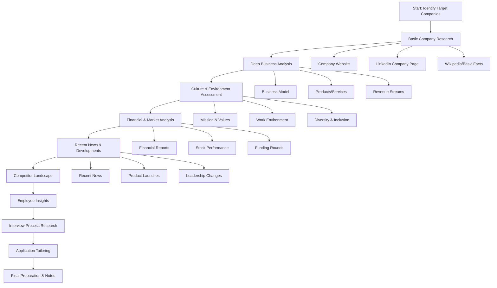
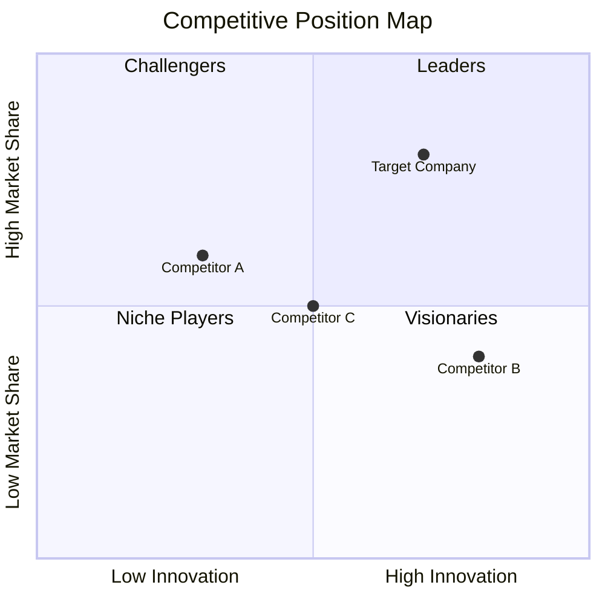
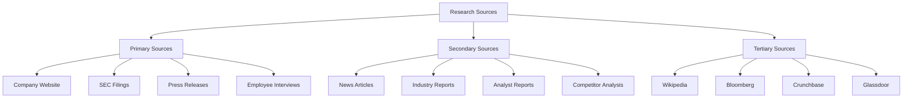
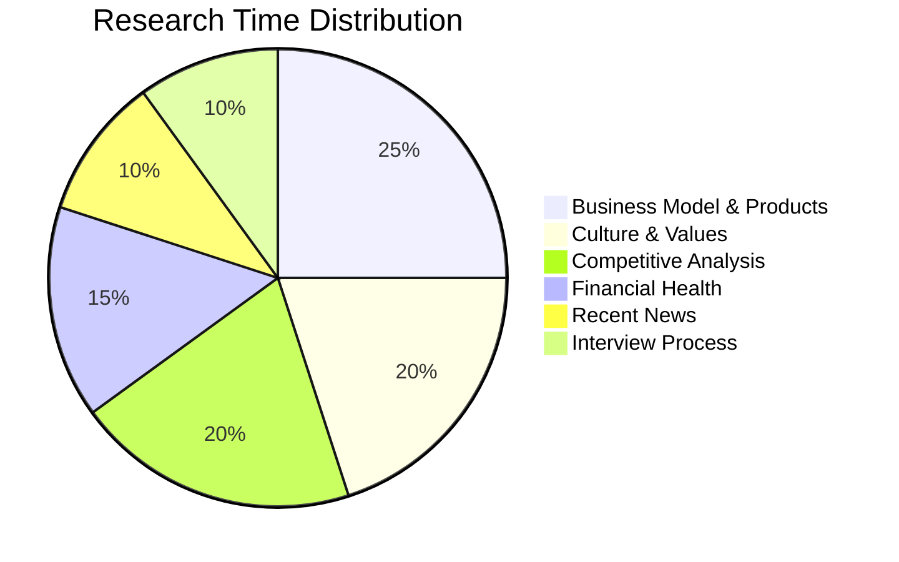

# Company Research for Interview Success

## Introduction

**What is Company Research?**
Company research is the systematic process of gathering, analyzing, and synthesizing information about a target employer before applying for a position or attending an interview. It encompasses understanding the company's business model, culture, financial health, competitive landscape, recent developments, and strategic direction.

**Why Does it Matter for Interviews?**
Interviewers consistently rank "lack of company knowledge" among the top reasons candidates fail. When you demonstrate genuine understanding of a company's challenges, products, and culture, you:
- Show genuine interest beyond just getting a job
- Answer behavioral questions with company-specific context
- Ask insightful questions that impress interviewers
- Negotiate offers from a position of knowledge
- Make informed decisions about whether the company is right for you

**How Companies Evaluate Your Research:**
- Direct questions: "What do you know about our company?"
- Indirect assessment: Quality of your questions during Q&A
- Cultural fit evaluation: Do your values align with theirs?
- Strategic thinking: Can you identify their challenges and propose solutions?

---

## Learning Roadmap

### Mermaid Diagram



### Timeline Table

| Phase | Duration | Activities | Tools |
|-------|----------|------------|-------|
| Week 1 | 2-3 hours | Basic company facts, mission, products | Company website, LinkedIn |
| Week 2 | 3-4 hours | Business model, revenue, competitors | Crunchbase, Glassdoor |
| Week 3 | 2-3 hours | Culture research, employee reviews | Glassdoor, Blind, Comparably |
| Week 4 | 2-3 hours | Recent news, financial performance | Google News, Yahoo Finance |
| Week 5 | 1-2 hours | Interview process, specific team info | Glassdoor, Levels.fyi |
| Week 6 | 1-2 hours | Tailor resume and prepare questions | All sources synthesized |

---

## Theory Notes

### Company Analysis Framework (PESTEL)

**Political Factors:**
- Government regulations affecting the industry
- Political stability in operating regions
- Trade policies and tariffs
- Tax incentives or restrictions

**Economic Factors:**
- Current economic climate affecting the industry
- Company's financial health (revenue, growth rate, profitability)
- Exchange rates for international companies
- Inflation impact on business model

**Social Factors:**
- Consumer behavior trends
- Demographic shifts relevant to target market
- Social responsibility initiatives
- Work-life balance reputation

**Technological Factors:**
- Technology stack and innovation pipeline
- R&D investment levels
- Digital transformation initiatives
- Intellectual property portfolio

**Environmental Factors:**
- Sustainability practices
- Environmental regulations compliance
- Carbon footprint initiatives
- Green technology adoption

**Legal Factors:**
- Pending litigation
- Regulatory compliance history
- Intellectual property protections
- Employment law practices

### SWOT Analysis Template

| Internal | Positive | Negative |
|----------|----------|----------|
| **Strengths** | Market position, talent, technology, brand | |
| **Weaknesses** | | Gaps, challenges, limitations |
| **External** | Positive | Negative |
| **Opportunities** | Market trends, partnerships, growth areas | |
| **Threats** | | Competition, regulation, market shifts |

### Porter's Five Forces Analysis

1. **Threat of New Entrants**: How easy is it for new competitors to enter?
2. **Bargaining Power of Suppliers**: How much leverage do suppliers have?
3. **Bargaining Power of Buyers**: How much leverage do customers have?
4. **Threat of Substitutes**: Are there alternative products/services?
5. **Competitive Rivalry**: How intense is competition in the market?

---

## Key Concepts

| Concept | Definition | Interview Application |
|---------|------------|----------------------|
| Business Model | How the company creates, delivers, and captures value | "How does the company make money?" |
| Value Proposition | Unique benefit the company offers customers | "What makes this company different?" |
| Market Position | Company's standing relative to competitors | "Where does the company fit in the market?" |
| Culture Fit | Alignment between candidate and company values | Behavioral questions, Q&A quality |
| Growth Trajectory | Company's expansion pattern and potential | "Where do you see this company in 5 years?" |
| Competitive Advantage | What makes the company better than rivals | "What are the company's strengths?" |
| Stakeholder Map | Key people and groups influencing the company | Understanding decision-makers |
| Product-Market Fit | How well products meet market needs | Discussing products intelligently |
| Financial Health | Company's monetary stability and performance | Negotiating offers, assessing stability |
| Strategic Direction | Company's future plans and vision | Aligning your goals with theirs |

---

## Frequently Asked Interview Questions

### Beginner Level

1. **Q: Tell me about our company.**
   A: I know [Company] was founded in [year] and has grown to become a leader in [industry]. Your mission is [mission statement], and you're particularly known for [key product/service]. I was impressed by [recent achievement] and how it aligns with [market trend].

2. **Q: What products or services does our company offer?**
   A: Your primary products include [Product A] which serves [target market], [Product B] that addresses [specific need], and your newer offering [Product C] which shows innovation in [area]. I noticed [Product A] has [specific feature] that differentiates it from competitors.

3. **Q: Who are our main competitors?**
   A: Your primary competitors are [Competitor A] who focuses on [their strength], [Competitor B] known for [their niche], and [Competitor C] which has [market position]. What sets [Company] apart is [unique value proposition].

4. **Q: Why do you want to work here?**
   A: Beyond the role itself, I'm drawn to [Company] because [specific reason related to company research]. Your recent [initiative/product] shows commitment to [value], which aligns with my professional goal of [relevant goal].

5. **Q: What do you know about our culture?**
   A: From my research, I understand [Company] values [core values]. I read on Glassdoor that employees particularly appreciate [positive aspect]. Your [specific program] also demonstrates investment in [employee benefit].

### Intermediate Level

6. **Q: What challenges do you think our company faces?**
   A: Based on my research, I see a few key challenges: First, [industry challenge] affects everyone in the space. Second, [specific company challenge] given [market conditions]. Third, [competitive challenge] as [competitor action]. However, [Company]'s [strength] positions well to address these.

7. **Q: How has the company evolved recently?**
   A: I've noticed several significant changes: [Product launch/feature], [Leadership change], [Strategic pivot], and [Funding/expansion]. The [specific change] particularly interests me because [reason related to role].

8. **Q: What trends do you see in our industry?**
   A: Key trends include [trend 1] driven by [factor], [trend 2] as evidenced by [example], and [trend 3] which [Company] is well-positioned to capitalize on through [advantage]. I'm particularly interested in how [Company] is responding to [trend].

9. **Q: How would you improve our product/service?**
   A: Based on user reviews and competitive analysis, I see opportunities in [improvement area]. For instance, [specific suggestion] could address [user pain point]. I also noticed [competitor feature] that users appreciate, which could inspire [innovation idea].

10. **Q: What questions do you have about the company?**
    A: (Prepare 5-7 thoughtful questions covering different aspects: strategy, team, role, growth, challenges, culture, and future direction)

### Advanced Level

11. **Q: If you were our CEO, what would be your top 3 priorities?**
    A: First, [strategic priority] because [market analysis supports this]. Second, [operational priority] to address [specific challenge]. Third, [innovation priority] to capitalize on [opportunity]. These priorities balance [short-term needs] with [long-term vision].

12. **Q: Analyze our competitive position in the market.**
    A: [Company] holds [position] in the market with [strengths]. However, [competitors] are strong in [areas]. The market is moving toward [trend], where [Company]'s [advantage] is significant. Key opportunities include [opportunity 1] and [opportunity 2].

13. **Q: What would you change about our business model?**
    A: Your current model effectively [strengths]. However, [market shift] suggests opportunity to explore [alternative approach]. For example, [specific change] could [benefit], similar to how [other company] succeeded with [their approach].

14. **Q: How do you see our company's role in the industry ecosystem?**
    A: [Company] plays a critical role as [position] in the ecosystem. Your [product/service] enables [ecosystem function], while [partnership/integration] strengthens [industry relationship]. I see potential to expand this role through [strategic initiative].

15. **Q: What metrics would you use to measure success in this role?**
    A: For this role, I'd track [role-specific metrics], [team/department metrics], and [company-level metrics]. Given [Company]'s current focus on [strategic priority], I'd prioritize [specific KPIs] that directly impact [business outcome].

### FAANG Level

16. **Q: How would you handle a situation where our company's values conflict with profitability?**
    A: I believe sustainable success requires balancing both. For example, [Company]'s commitment to [value] builds [long-term benefit]. In the [hypothetical situation], I'd advocate for [approach] that maintains integrity while exploring [alternative revenue approach].

17. **Q: What industry disruption do you foresee in the next 5 years?**
    A: I anticipate [disruption] driven by [technology/trend]. This will impact [Company] through [specific effect]. To prepare, I'd recommend [strategic response] leveraging [Company]'s [strength]. Early movers in [area] will gain significant advantage.

18. **Q: If you had unlimited resources, what would you build for our company?**
    A: I'd invest in [innovation area] because [market analysis supports this]. Specifically, [detailed concept] that addresses [customer need] through [unique approach]. This aligns with [Company]'s mission of [mission] and could [impact metric].

19. **Q: How do you balance short-term results with long-term vision?**
    A: Based on [Company]'s [strategic context], I'd approach this by [framework]. Short-term wins in [area] build momentum for [long-term goal]. For example, [specific approach] delivers immediate value while establishing foundation for [future vision].

20. **Q: What would you do in your first 90 days?**
    A: Days 1-30: [Learning phase] - understand team, processes, and [Company]'s priorities. Days 31-60: [Contribution phase] - apply learning to [specific areas]. Days 61-90: [Impact phase] - deliver results in [metrics] while building relationships for [long-term success].

21. **Q: How would you explain our company to a potential investor?**
    A: [Company] solves [problem] for [market] through [solution]. Our competitive advantage is [differentiation], demonstrated by [traction metrics]. We're positioned to capture [market opportunity] worth [market size]. Our team brings [relevant experience].

---

## Hands-on Practice

### Exercise 1: Company Fact Sheet
Create a one-page fact sheet for your target company including:
- Founded, headquarters, CEO, employee count
- Revenue (last 3 years), growth rate
- Key products/services with descriptions
- Mission, vision, and values statements
- Recent news (last 6 months)
- Top 5 competitors with brief comparison

### Exercise 2: SWOT Analysis
Conduct a detailed SWOT analysis for your target company. Include at least 5 items in each quadrant with supporting evidence from your research.

### Exercise 3: Culture Assessment
Research the company culture using:
- Glassdoor reviews (read 20+ reviews)
- LinkedIn employee posts
- Company blog and social media
- "Best Places to Work" lists
Write a one-page culture assessment highlighting strengths and potential concerns.

### Exercise 4: Competitive Landscape Map
Create a visual competitive landscape map positioning your target company against 4-6 competitors on 2-3 key dimensions (e.g., price vs. quality, innovation vs. tradition).

### Exercise 5: Financial Health Check
Analyze the company's financial health:
- Revenue trends and projections
- Profitability metrics
- Funding history (if private)
- Stock performance (if public)
- Key financial ratios relevant to the industry

### Exercise 6: Interview Process Documentation
Research and document the company's interview process:
- Steps and typical duration
- Types of interviews (phone, technical, behavioral)
- Key interviewers (if known)
- Common questions asked (from Glassdoor)
- Tips from current/former employees

### Exercise 7: Personal Value Proposition
Write a 30-second elevator pitch that connects your skills to the company's needs, demonstrating your research through specific references.

### Exercise 8: Question Preparation
Prepare 10 thoughtful questions for different interview stages:
- 2 for recruiter screen
- 3 for technical interviews
- 3 for behavioral interviews
- 2 for final rounds

---

## Real FAANG Interview Questions

| Company | Question | Difficulty |
|---------|----------|------------|
| Google | How would you improve Google Search for developing markets? | Advanced |
| Amazon | Tell me about a time you disagreed with company policy. How did you handle it? | Intermediate |
| Facebook | What features would you add to Instagram Stories? | Intermediate |
| Apple | How does Apple's ecosystem create customer loyalty? | Beginner |
| Netflix | How would you design a recommendation system for a new market? | Advanced |
| Microsoft | What cloud computing trend will impact Microsoft Azure most? | Intermediate |
| Google | If you could change one thing about Google Maps, what would it be? | Intermediate |
| Amazon | How would you improve the Amazon Prime experience? | Advanced |
| Facebook | What privacy features would you add to WhatsApp? | Advanced |
| Apple | How does Apple maintain premium pricing power? | Intermediate |
| Netflix | How does Netflix compete with YouTube and TikTok? | Advanced |
| Microsoft | What enterprise problem does Microsoft Teams solve better than competitors? | Intermediate |
| Google | How would you measure the success of Google Photos? | Advanced |
| Amazon | What would make you leave Amazon? | Beginner |
| Facebook | How does Meta's pivot to metaverse affect Instagram? | Advanced |
| Apple | What's the biggest challenge for Apple Watch? | Intermediate |
| Netflix | How would you improve content discovery on Netflix? | Advanced |
| Microsoft | How does GitHub benefit from Microsoft's acquisition? | Intermediate |
| Google | What would you build if you joined Google X? | Advanced |
| Amazon | How does Amazon's leadership principle "Customer Obsession" apply to your work? | Intermediate |

---

## Common Mistakes

| Mistake | Why It's Bad | How to Fix |
|---------|--------------|------------|
| Only knowing basic facts | Shows surface-level research | Deep dive into business model and strategy |
| Memorizing Wikipedia facts | Sounds rehearsed and generic | Synthesize information in your own words |
| Ignoring recent news | Shows you're not current | Set up Google Alerts for the company |
| Not researching competitors | Misses market context | Create competitive comparison matrix |
| Overlooking company culture | May misjudge fit | Read employee reviews, watch company videos |
| Not knowing interview process | Shows lack of preparation | Research on Glassdoor, ask recruiter |
| Ignoring financial health | May miss warning signs | Review financial reports or funding news |
| Not tailoring questions | Generic questions show disinterest | Prepare role-specific, insightful questions |
| Focusing only on positives | Misses balanced perspective | Acknowledge challenges alongside strengths |
| Forgetting to research interviewers | Misses personalization opportunity | Look up interviewers on LinkedIn |

---

## Best Practices

1. **Start Early**: Begin research at least 2-3 weeks before interview
2. **Use Multiple Sources**: Cross-reference information from different platforms
3. **Take Structured Notes**: Use templates to organize findings consistently
4. **Focus on Relevance**: Prioritize information directly related to your target role
5. **Stay Current**: Focus on recent developments (last 6-12 months)
6. **Verify Facts**: Double-check important claims from multiple sources
7. **Synthesize, Don't Memorize**: Understand themes rather than memorizing details
8. **Prepare Stories**: Connect your experience to company challenges/values
9. **Update Regularly**: Revisit research before each interview stage
10. **Ask Thoughtful Questions**: Use research to generate genuine curiosity

---

## Cheat Sheet

```
╔══════════════════════════════════════════════════════════════╗
║                  COMPANY RESEARCH CHEAT SHEET               ║
╠══════════════════════════════════════════════════════════════╣
║                                                              ║
║  QUICK FACTS CHECKLIST:                                      ║
║  □ Founded: ________  HQ: ________                           ║
║  □ CEO: ____________  Employees: ________                    ║
║  □ Revenue: $_______  Growth: ______%                        ║
║  □ Industry: ________  Founded: ________                     ║
║                                                              ║
║  BUSINESS MODEL:                                             ║
║  • How they make money: _____________________________        ║
║  • Key products: ______________________________________       ║
║  • Target market: _____________________________________       ║
║  • Value proposition: _________________________________      ║
║                                                              ║
║  COMPETITIVE POSITION:                                       ║
║  • Main competitors: __________________________________      ║
║  • Competitive advantage: _____________________________      ║
║  • Market position: ___________________________________      ║
║                                                              ║
║  CULTURE & VALUES:                                           ║
║  • Core values: ________________________________________      ║
║  • Work environment: _________________________________       ║
║  • Benefits highlights: _______________________________      ║
║                                                              ║
║  RECENT NEWS:                                                ║
║  • Major events: _______________________________________      ║
║  • Strategic moves: ____________________________________      ║
║  • Industry impact: ____________________________________      ║
║                                                              ║
║  MY QUESTIONS (prepare 5-7):                                 ║
║  1. _________________________________________________        ║
║  2. _________________________________________________        ║
║  3. _________________________________________________        ║
║                                                              ║
╚══════════════════════════════════════════════════════════════╝
```

---

## Flash Cards

| # | Question | Answer |
|---|----------|--------|
| 1 | What is PESTEL analysis? | Framework examining Political, Economic, Social, Technological, Environmental, Legal factors |
| 2 | What are Porter's Five Forces? | Threat of new entrants, supplier power, buyer power, substitutes, competitive rivalry |
| 3 | What is a SWOT analysis? | Strengths, Weaknesses, Opportunities, Threats assessment |
| 4 | What is a business model? | How a company creates, delivers, and captures value |
| 5 | What is value proposition? | Unique benefit a company offers to customers |
| 6 | What is competitive advantage? | Factor that gives a company edge over rivals |
| 7 | What is market position? | Company's standing relative to competitors |
| 8 | What is culture fit? | Alignment between candidate values and company values |
| 9 | What is product-market fit? | How well a product satisfies market demand |
| 10 | What is TAM? | Total Addressable Market - total market demand for a product |
| 11 | What is SAM? | Serviceable Addressable Market - portion of TAM you can target |
| 12 | What is SOM? | Serviceable Obtainable Market - realistic market share |
| 13 | What is CAC? | Customer Acquisition Cost - cost to acquire a new customer |
| 14 | What is LTV? | Customer Lifetime Value - total revenue from a customer |
| 15 | What is burn rate? | Rate at which a company spends its capital |
| 16 | What is runway? | Time before a company runs out of money |
| 17 | What is market cap? | Total value of a company's outstanding shares |
| 18 | What is P/E ratio? | Price-to-Earnings ratio - valuation metric |
| 19 | What is YoY growth? | Year-over-year growth rate comparison |
| 20 | What is KPI? | Key Performance Indicator - measurable success metric |

---

## Mind Map

```
Company Research
├── Basic Facts
│   ├── History & Founding
│   ├── Leadership Team
│   ├── Size & Scale
│   └── Headquarters & Locations
├── Business Analysis
│   ├── Revenue Model
│   ├── Products/Services
│   ├── Target Market
│   └── Value Proposition
├── Competitive Landscape
│   ├── Direct Competitors
│   ├── Indirect Competitors
│   ├── Market Share
│   └── Differentiation
├── Culture & Environment
│   ├── Mission & Values
│   ├── Work Environment
│   ├── Benefits & Perks
│   └── Diversity & Inclusion
├── Financial Health
│   ├── Revenue & Growth
│   ├── Profitability
│   ├── Funding Status
│   └── Stock Performance
├── Recent Developments
│   ├── News & Announcements
│   ├── Product Launches
│   ├── Strategic Moves
│   └── Industry Trends
├── Interview Process
│   ├── Steps & Timeline
│   ├── Question Types
│   ├── Interviewers
│   └── Success Tips
└── Application Tailoring
    ├── Resume Customization
    ├── Cover Letter Focus
    ├── Portfolio Alignment
    └── Question Preparation
```

---

## Mermaid Diagrams

### Company Research Workflow

```mermaid
flowchart LR
    A[Identify Target] --> B[Gather Basic Facts]
    B --> C[Analyze Business Model]
    C --> D[Assess Culture]
    D --> E[Review Financials]
    E --> F[Study Competition]
    F --> G[Track Recent News]
    G --> H[Research Interview Process]
    H --> I[Tailor Application]
    I --> J[Prepare Questions]
```



### Competitive Analysis Framework



### Research Source Hierarchy



### Company Analysis Categories



---

## Code Examples

### Python: Company Research Data Organizer

```python
import json
from datetime import datetime
from typing import Dict, List, Optional
from dataclasses import dataclass, field, asdict

@dataclass
class Competitor:
    name: str
    strengths: List[str]
    weaknesses: List[str]
    market_position: str
    differentiators: List[str]

@dataclass
class FinancialData:
    revenue: Optional[float] = None
    growth_rate: Optional[float] = None
    funding_rounds: List[Dict] = field(default_factory=list)
    valuation: Optional[float] = None

@dataclass
class CompanyResearch:
    company_name: str
    founded: Optional[int] = None
    headquarters: Optional[str] = None
    ceo: Optional[str] = None
    employee_count: Optional[int] = None
    mission: Optional[str] = None
    vision: Optional[str] = None
    values: List[str] = field(default_factory=list)
    products: List[Dict] = field(default_factory=list)
    competitors: List[Competitor] = field(default_factory=list)
    financials: FinancialData = field(default_factory=FinancialData)
    culture_notes: List[str] = field(default_factory=list)
    recent_news: List[Dict] = field(default_factory=list)
    interview_process: Dict = field(default_factory=dict)
    questions_to_ask: List[str] = field(default_factory=list)
    research_date: str = field(default_factory=lambda: datetime.now().isoformat())

    def to_json(self) -> str:
        return json.dumps(asdict(self), indent=2)

    def add_competitor(self, competitor: Competitor):
        self.competitors.append(competitor)

    def add_news(self, headline: str, date: str, summary: str):
        self.recent_news.append({
            "headline": headline,
            "date": date,
            "summary": summary
        })

    def generate_swot(self) -> Dict[str, List[str]]:
        """Generate SWOT analysis template"""
        return {
            "strengths": [
                "Market leader in [area]",
                "Strong brand recognition",
                "Innovative product portfolio"
            ],
            "weaknesses": [
                "High dependency on [revenue stream]",
                "Limited presence in [market]",
                "Recent [challenge]"
            ],
            "opportunities": [
                "Growing [market segment]",
                "Potential [partnership/expansion]",
                "Emerging [technology/trend]"
            ],
            "threats": [
                "Intensifying competition from [competitor]",
                "Regulatory changes in [area]",
                "Market shift toward [trend]"
            ]
        }

    def create_research_summary(self) -> str:
        """Create a formatted research summary"""
        summary = f"""
═══════════════════════════════════════════════════════════════
COMPANY RESEARCH SUMMARY: {self.company_name}
═══════════════════════════════════════════════════════════════

BASIC INFORMATION
─────────────────
Founded: {self.founded or 'N/A'}
Headquarters: {self.headquarters or 'N/A'}
CEO: {self.ceo or 'N/A'}
Employees: {self.employee_count or 'N/A'}

MISSION & VALUES
────────────────
Mission: {self.mission or 'N/A'}
Vision: {self.vision or 'N/A'}
Core Values: {', '.join(self.values) if self.values else 'N/A'}

KEY PRODUCTS
────────────"""
        for product in self.products:
            summary += f"\n• {product.get('name', 'N/A')}: {product.get('description', 'N/A')}"
        
        summary += f"\n\nCOMPETITORS ({len(self.competitors)} identified)"
        summary += "\n" + "─" * 40
        for comp in self.competitors:
            summary += f"\n• {comp.name} ({comp.market_position})"
            summary += f"  Strengths: {', '.join(comp.strengths[:2])}"
        
        summary += f"\n\nRECENT NEWS ({len(self.recent_news)} items)"
        summary += "\n" + "─" * 40
        for news in self.recent_news[:5]:
            summary += f"\n• [{news.get('date', 'N/A')}] {news.get('headline', 'N/A')}"
        
        summary += f"\n\nQUESTIONS TO ASK ({len(self.questions_to_ask)})"
        summary += "\n" + "─" * 40
        for i, q in enumerate(self.questions_to_ask, 1):
            summary += f"\n{i}. {q}"
        
        return summary


def create_template(company_name: str) -> CompanyResearch:
    """Create a research template for a new company"""
    research = CompanyResearch(company_name=company_name)
    
    research.questions_to_ask = [
        "What does a typical day look like in this role?",
        "How does the team measure success?",
        "What are the biggest challenges facing the team right now?",
        "How does this role contribute to company goals?",
        "What's the growth path for this position?",
        "How does the company support professional development?",
        "What's the team's approach to work-life balance?",
        "Can you describe the company culture?",
        "What are the company's priorities for the next year?",
        "How has the company evolved since you joined?"
    ]
    
    return research


# Example usage
if __name__ == "__main__":
    # Create a new company research document
    research = create_template("TechCorp Inc")
    
    # Fill in basic information
    research.founded = 2015
    research.headquarters = "San Francisco, CA"
    research.ceo = "Jane Smith"
    research.employee_count = 5000
    research.mission = "To organize the world's information"
    research.values = ["Innovation", "Customer Focus", "Integrity", "Excellence"]
    
    # Add products
    research.products = [
        {"name": "Product A", "description": "Cloud-based SaaS platform"},
        {"name": "Product B", "description": "Mobile application for consumers"},
        {"name": "Product C", "description": "Enterprise solution suite"}
    ]
    
    # Add competitors
    research.add_competitor(Competitor(
        name="CompetitorX",
        strengths=["Strong brand", "Large user base"],
        weaknesses=["Outdated technology", "High pricing"],
        market_position="Market leader",
        differentiators=["First mover advantage", "Global presence"]
    ))
    
    # Add recent news
    research.add_news(
        headline="TechCorp Announces Series C Funding",
        date="2024-01-15",
        summary="Raised $100M to expand into Asian markets"
    )
    
    # Generate and print summary
    print(research.create_research_summary())
    
    # Save to JSON
    with open("techcorp_research.json", "w") as f:
        f.write(research.to_json())
```

### JavaScript: Research Tracker

```javascript
class CompanyResearchTracker {
    constructor() {
        this.researchNotes = new Map();
        this.interviewQuestions = [];
        this.deadlines = [];
    }

    addCompany(companyName, data) {
        this.researchNotes.set(companyName, {
            ...data,
            lastUpdated: new Date().toISOString(),
            completeness: this.calculateCompleteness(data)
        });
    }

    calculateCompleteness(data) {
        const requiredFields = [
            'mission', 'products', 'competitors', 
            'culture', 'recentNews', 'financials'
        ];
        const filledFields = requiredFields.filter(field => data[field]);
        return Math.round((filledFields.length / requiredFields.length) * 100);
    }

    generateInterviewPrep(companyName) {
        const company = this.researchNotes.get(companyName);
        if (!company) return null;

        return {
            talkingPoints: this.extractTalkingPoints(company),
            questionsToAsk: this.generateQuestions(company),
            riskFactors: this.identifyRisks(company),
            valueProposition: this.buildValueProposition(company)
        };
    }

    extractTalkingPoints(company) {
        const points = [];
        
        if (company.recentNews?.length > 0) {
            points.push(`Recent news: ${company.recentNews[0].headline}`);
        }
        
        if (company.products?.length > 0) {
            points.push(`Key product: ${company.products[0].name}`);
        }
        
        if (company.culture) {
            points.push(`Culture highlight: ${company.culture.strengths?.[0]}`);
        }
        
        return points;
    }

    generateQuestions(company) {
        const questions = {
            roleSpecific: [
                "How does this role contribute to the team's goals?",
                "What does success look like in this position?"
            ],
            companySpecific: [
                `How is ${company.name} responding to industry trends?`,
                "What are the company's priorities this year?"
            ],
            cultureSpecific: [
                "How would you describe the team dynamic?",
                "What's the learning culture like?"
            ]
        };
        
        return questions;
    }

    identifyRisks(company) {
        const risks = [];
        
        if (company.recentLayoffs) {
            risks.push("Recent layoffs may indicate instability");
        }
        
        if (company.competitorStrength > 0.7) {
            risks.push("Strong competitive pressure");
        }
        
        return risks;
    }

    buildValueProposition(company) {
        return {
            whyThem: `Your work in ${company.industry} aligns with my experience`,
            whatIBring: `My skills in [relevant area] can help with [their challenge]`,
            mutualBenefit: `I'm excited about [specific initiative] and how I can contribute`
        };
    }

    exportResearch(format = 'json') {
        const data = Array.from(this.researchNotes.entries());
        
        if (format === 'json') {
            return JSON.stringify(Object.fromEntries(data), null, 2);
        }
        
        if (format === 'markdown') {
            return this.toMarkdown(data);
        }
        
        return data;
    }

    toMarkdown(data) {
        let md = '# Company Research Notes\n\n';
        
        for (const [company, info] of data) {
            md += `## ${company}\n\n`;
            md += `**Last Updated:** ${info.lastUpdated}\n`;
            md += `**Completeness:** ${info.completeness}%\n\n`;
            
            if (info.mission) {
                md += `### Mission\n${info.mission}\n\n`;
            }
            
            if (info.products?.length) {
                md += `### Products\n`;
                info.products.forEach(p => {
                    md += `- ${p.name}: ${p.description}\n`;
                });
                md += '\n';
            }
        }
        
        return md;
    }
}

// Usage example
const tracker = new CompanyResearchTracker();

tracker.addCompany('Google', {
    mission: 'To organize the world\'s information and make it universally accessible',
    products: [
        { name: 'Google Search', description: 'Search engine' },
        { name: 'Google Cloud', description: 'Cloud computing platform' }
    ],
    competitors: ['Microsoft', 'Amazon', 'Apple'],
    culture: {
        strengths: ['Innovation-focused', 'Great benefits'],
        weaknesses: ['Bureaucracy in large teams']
    },
    recentNews: [
        { headline: 'AI advancements in Gemini', date: '2024-01' }
    ]
});

const prep = tracker.generateInterviewPrep('Google');
console.log(prep);
```

### SQL: Research Database Schema

```sql
-- Company Research Database Schema

CREATE TABLE companies (
    company_id SERIAL PRIMARY KEY,
    name VARCHAR(255) NOT NULL,
    founded_year INT,
    headquarters VARCHAR(255),
    ceo_name VARCHAR(255),
    employee_count INT,
    website VARCHAR(255),
    industry VARCHAR(100),
    created_at TIMESTAMP DEFAULT CURRENT_TIMESTAMP,
    updated_at TIMESTAMP DEFAULT CURRENT_TIMESTAMP
);

CREATE TABLE company_missions (
    mission_id SERIAL PRIMARY KEY,
    company_id INT REFERENCES companies(company_id),
    mission_text TEXT,
    vision_text TEXT,
    values TEXT[], -- PostgreSQL array
    updated_at TIMESTAMP DEFAULT CURRENT_TIMESTAMP
);

CREATE TABLE products (
    product_id SERIAL PRIMARY KEY,
    company_id INT REFERENCES companies(company_id),
    name VARCHAR(255),
    description TEXT,
    launch_date DATE,
    is_primary BOOLEAN DEFAULT FALSE
);

CREATE TABLE competitors (
    competitor_id SERIAL PRIMARY KEY,
    company_id INT REFERENCES companies(company_id),
    competitor_name VARCHAR(255),
    market_position VARCHAR(100),
    strengths TEXT[],
    weaknesses TEXT[],
    market_share DECIMAL(5,2)
);

CREATE TABLE financial_data (
    financial_id SERIAL PRIMARY KEY,
    company_id INT REFERENCES companies(company_id),
    fiscal_year INT,
    revenue DECIMAL(15,2),
    growth_rate DECIMAL(5,2),
    valuation DECIMAL(15,2),
    funding_round VARCHAR(50),
    funding_amount DECIMAL(15,2)
);

CREATE TABLE recent_news (
    news_id SERIAL PRIMARY KEY,
    company_id INT REFERENCES companies(company_id),
    headline VARCHAR(500),
    summary TEXT,
    source VARCHAR(255),
    news_date DATE,
    relevance_score INT CHECK (relevance_score BETWEEN 1 AND 10)
);

CREATE TABLE culture_notes (
    culture_id SERIAL PRIMARY KEY,
    company_id INT REFERENCES companies(company_id),
    work_environment TEXT,
    benefits_highlights TEXT,
    diversity_initiatives TEXT,
    glassdoor_rating DECIMAL(3,2),
    pros TEXT[],
    cons TEXT[]
);

CREATE TABLE interview_process (
    process_id SERIAL PRIMARY KEY,
    company_id INT REFERENCES companies(company_id),
    round_name VARCHAR(100),
    description TEXT,
    duration_minutes INT,
    tips TEXT[],
    common_questions TEXT[]
);

CREATE TABLE research_notes (
    note_id SERIAL PRIMARY KEY,
    company_id INT REFERENCES companies(company_id),
    category VARCHAR(100),
    note_text TEXT,
    source VARCHAR(255),
    created_at TIMESTAMP DEFAULT CURRENT_TIMESTAMP
);

-- Useful queries

-- Get complete company profile
SELECT 
    c.name,
    c.founded_year,
    c.ceo_name,
    m.mission_text,
    m.values,
    ARRAY_AGG(DISTINCT p.name) as products
FROM companies c
LEFT JOIN company_missions m ON c.company_id = m.company_id
LEFT JOIN products p ON c.company_id = p.company_id
WHERE c.name = 'Google'
GROUP BY c.company_id, m.mission_id;

-- Get companies by completeness of research
SELECT 
    c.name,
    COUNT(DISTINCT n.note_id) as note_count,
    COUNT(DISTINCT p.product_id) as product_count,
    COUNT(DISTINCT comp.competitor_id) as competitor_count
FROM companies c
LEFT JOIN research_notes n ON c.company_id = n.company_id
LEFT JOIN products p ON c.company_id = p.company_id
LEFT JOIN competitors comp ON c.company_id = comp.company_id
GROUP BY c.company_id
ORDER BY (note_count + product_count + competitor_count) DESC;

-- Find companies needing more research
SELECT 
    c.name,
    CASE 
        WHEN n.note_id IS NULL THEN 'Missing notes'
        ELSE 'Has notes'
    END as notes_status,
    CASE 
        WHEN p.product_id IS NULL THEN 'Missing products'
        ELSE 'Has products'
    END as products_status
FROM companies c
LEFT JOIN research_notes n ON c.company_id = n.company_id
LEFT JOIN products p ON c.company_id = p.company_id
WHERE n.note_id IS NULL OR p.product_id IS NULL;
```

---

## Mini Project: Company Research Dashboard

Build a web application that helps you organize and visualize company research:

**Features:**
- Add and manage multiple company profiles
- Track research completeness with progress bars
- Generate interview preparation summaries
- Store and organize interview questions
- Compare companies side-by-side
- Export research as PDF or Markdown

**Tech Stack Options:**
- React + Firebase (real-time updates)
- Vue.js + LocalStorage (simple, no backend)
- Python Flask + SQLite (lightweight backend)
- Next.js + Supabase (modern full-stack)

---

## Intermediate Project: Competitive Intelligence Tool

Build a tool that automatically gathers and organizes competitive intelligence:

**Features:**
- Web scraping for company news and updates
- Social media sentiment analysis
- Financial data aggregation
- Automated SWOT analysis generation
- Competitive positioning dashboard
- Alert system for competitor activities

**Tech Stack:**
- Python (Scrapy/BeautifulSoup for scraping)
- NLP library (spaCy/NLTK for text analysis)
- Pandas for data processing
- Matplotlib/Plotly for visualizations
- Flask/Django for web interface

---

## Advanced Project: AI-Powered Interview Coach

Build an AI system that helps prepare for company-specific interviews:

**Features:**
- Natural language processing for question analysis
- Company-specific answer generation
- Mock interview simulation
- Real-time feedback on responses
- Personalized preparation plans
- Progress tracking and analytics

**Tech Stack:**
- Python (FastAPI backend)
- OpenAI API / Hugging Face models
- React (frontend)
- MongoDB (data storage)
- WebSocket (real-time communication)
- Docker (containerization)

---

## Project Ideas Table

| # | Project | Difficulty | Skills Practiced | Time Estimate |
|---|---------|------------|------------------|---------------|
| 1 | Company Research Template Generator | Beginner | HTML/CSS, basic scripting | 2-3 hours |
| 2 | Research Notes Organizer App | Beginner | JavaScript, UI design | 4-6 hours |
| 3 | Competitive Analysis Dashboard | Intermediate | React, data visualization | 1-2 weeks |
| 4 | News Aggregator for Companies | Intermediate | Web scraping, APIs | 1-2 weeks |
| 5 | Financial Data Analyzer | Intermediate | Python, pandas, charts | 1 week |
| 6 | Culture Assessment Survey Tool | Intermediate | Form design, analytics | 1 week |
| 7 | Interview Question Database | Advanced | Full-stack development | 2-3 weeks |
| 8 | Company Comparison Platform | Advanced | React, backend, database | 3-4 weeks |
| 9 | Automated Research Report Generator | Advanced | NLP, templating, PDF generation | 2-3 weeks |
| 10 | AI Interview Preparation Bot | Expert | ML/NLP, full-stack, AI | 4-6 weeks |

---

## Resources

### Practice Websites

| Website | Purpose | URL |
|---------|---------|-----|
| Glassdoor | Company reviews and interview insights | glassdoor.com |
| Levels.fyi | Compensation data for tech companies | levels.fyi |
| Crunchbase | Company funding and financial data | crunchbase.com |
| LinkedIn | Company pages and employee insights | linkedin.com |
| Indeed | Company reviews and salary data | indeed.com |
| Comparably | Workplace culture data | comparably.com |
| Blind | Anonymous employee discussions | teamblind.com |
| Owler | Company profiles and competitive intel | owler.com |

### Books

| Book | Author | Focus Area |
|------|--------|------------|
| "The Personal MBA" | Josh Kaufman | Business fundamentals |
| "Good to Great" | Jim Collins | Company success factors |
| "The Lean Startup" | Eric Ries | Startup methodology |
| "Competitive Strategy" | Michael Porter | Competitive analysis |
| "Company Culture for Dummies" | Millind L. Apte | Understanding culture |

### Documentation & Guides

| Resource | Description |
|----------|-------------|
| Harvard Business Review | Business strategy articles |
| McKinsey Insights | Industry analysis reports |
| SEC EDGAR | Public company filings |
| Wikipedia | Company history and facts |
| Industry-specific publications | Trade news and trends |

### YouTube Channels

| Channel | Content Type |
|---------|--------------|
| Company Man | Business analysis and case studies |
| ColdFusion | Technology company profiles |
| Wendover Productions | Business model explanations |
| MKBHD | Tech product reviews |
| CNBC | Business news and interviews |

### Blogs & Newsletters

| Source | Focus |
|--------|-------|
| Stratechery | Tech business analysis |
| TechCrunch | Startup and tech news |
| The Information | In-depth tech reporting |
| Benedict Evans | Technology trends |
| a16z Blog | Venture capital insights |

### Certifications

| Certification | Provider | Relevance |
|--------------|----------|-----------|
| Business Analysis Professional (CBAP) | IIBA | Understanding business needs |
| Project Management Professional (PMP) | PMI | Project management context |
| Certified Market Research Analyst | PRC | Market analysis skills |

---

## Checklist

- [ ] Identified 3-5 target companies to research
- [ ] Gathered basic company facts (founded, CEO, size, HQ)
- [ ] Understood company mission, vision, and values
- [ ] Identified key products and services
- [ ] Mapped competitive landscape with 3-5 competitors
- [ ] Researched company culture through employee reviews
- [ ] Reviewed recent news and developments (last 6 months)
- [ ] Analyzed financial health (revenue, growth, funding)
- [ ] Understood interview process and common questions
- [ ] Prepared thoughtful questions for interviewers
- [ ] Tailored resume and cover letter to company needs
- [ ] Practiced explaining why this company specifically
- [ ] Identified potential challenges the company faces
- [ ] Researched your specific team/department if possible
- [ ] Connected with current/former employees on LinkedIn
- [ ] Reviewed company's social media presence
- [ ] Checked "Best Places to Work" rankings
- [ ] Saved relevant articles and insights for reference
- [ ] Created summary document for quick review before interview
- [ ] Updated LinkedIn to reflect interest in the company

---

## Revision Notes

### Key Frameworks to Remember
- **PESTEL**: Political, Economic, Social, Technological, Environmental, Legal
- **SWOT**: Strengths, Weaknesses, Opportunities, Threats
- **Porter's Five Forces**: New entrants, Suppliers, Buyers, Substitutes, Rivalry
- **Business Model Canvas**: Key partners, activities, resources, value propositions, customer relationships, channels, customer segments, cost structure, revenue streams

### Quick Research Checklist
1. Company basics (5 minutes)
2. Mission and values (10 minutes)
3. Products and services (15 minutes)
4. Competitors (15 minutes)
5. Culture and reviews (20 minutes)
6. Recent news (15 minutes)
7. Financial data (15 minutes)
8. Interview process (15 minutes)
9. Specific team/role info (20 minutes)
10. Prepare questions (15 minutes)

### One-Day Review Plan
- Morning (2 hours): Review company facts, mission, products
- Afternoon (2 hours): Review competitors, culture, recent news
- Evening (1 hour): Prepare questions, review financial data

### One-Week Preparation Plan
- Days 1-2: Deep dive into business model and products
- Days 3-4: Analyze competitive landscape and market position
- Days 5-6: Research culture and interview process
- Day 7: Synthesize findings and prepare questions

---

## Mock Interview Questions

### Behavioral Questions with Company Context

1. "Tell me about a time you had to adapt quickly to change. How does that relate to our company's recent pivot to [initiative]?"

2. "Describe a situation where you had to balance competing priorities. How would you handle the competing demands of [Company]'s [value 1] and [value 2]?"

3. "Give an example of when you had to convince others of your idea. How would you approach getting buy-in for [specific company challenge]?"

4. "Tell me about a time you failed. What would you do differently if faced with [Company]'s [specific challenge]?"

5. "Describe a project where you had to learn something new quickly. How would you get up to speed on [Company]'s [technology/process]?"

### Technical Questions with Company Context

6. "How would you design [feature] for [Company]'s product, given [specific constraint]?"

7. "What metrics would you track to measure the success of [Company]'s [product/feature]?"

8. "How would you improve [Company]'s [product] based on user feedback you've seen?"

9. "What technology stack would you recommend for [Company]'s next initiative, and why?"

10. "How would you handle [specific technical challenge] given [Company]'s current architecture?"

---

## Difficulty Rating

| Task | Time Required | Difficulty | Impact |
|------|---------------|------------|--------|
| Basic fact gathering | 30 min | Easy | Low |
| Mission/values research | 1 hour | Easy | Medium |
| Product analysis | 2 hours | Medium | High |
| Competitive landscape | 3 hours | Medium | High |
| Culture assessment | 2 hours | Medium | Medium |
| Financial analysis | 2 hours | Hard | Medium |
| Interview process research | 1 hour | Easy | High |
| Question preparation | 1 hour | Medium | High |
| Full company analysis | 8-10 hours | Hard | Very High |

---

## Summary

Company research is a critical differentiator in the interview process. By investing time in understanding a company's business model, culture, competitive position, and recent developments, you:

1. **Demonstrate genuine interest** beyond just wanting any job
2. **Answer questions more effectively** with company-specific context
3. **Ask insightful questions** that show depth of understanding
4. **Negotiate from strength** with knowledge of company priorities
5. **Make informed decisions** about career moves

Remember: The goal isn't to memorize facts, but to understand the company deeply enough to have meaningful conversations about how you can contribute to their success. Quality research takes time, but the investment pays off in interview performance and career decisions.

**Key Takeaway**: Treat company research as an ongoing process, not a one-time task. Set up Google Alerts, follow the company on LinkedIn, and continuously update your knowledge as you progress through the interview process.
