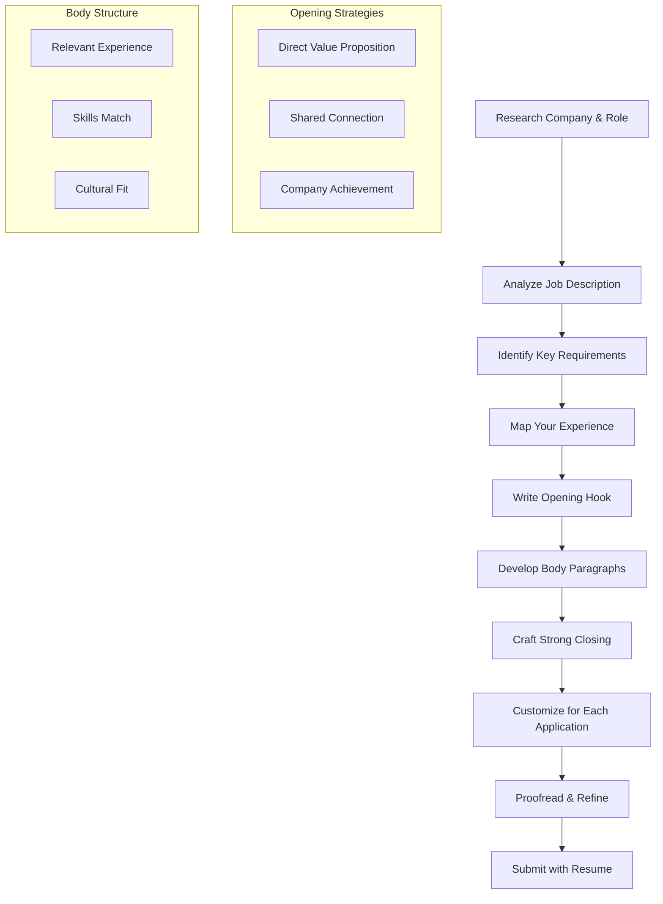
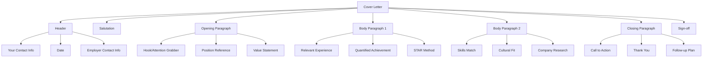
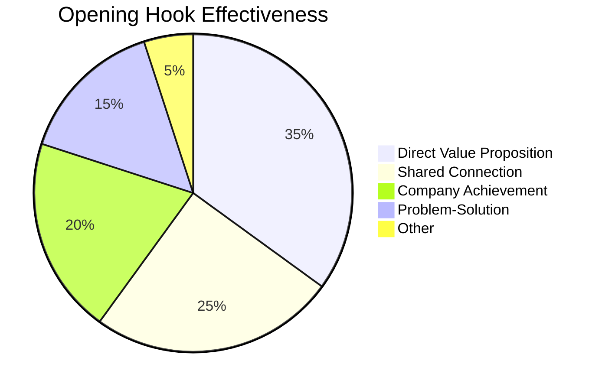
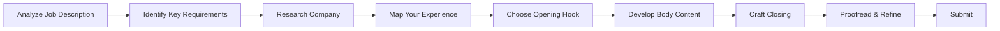
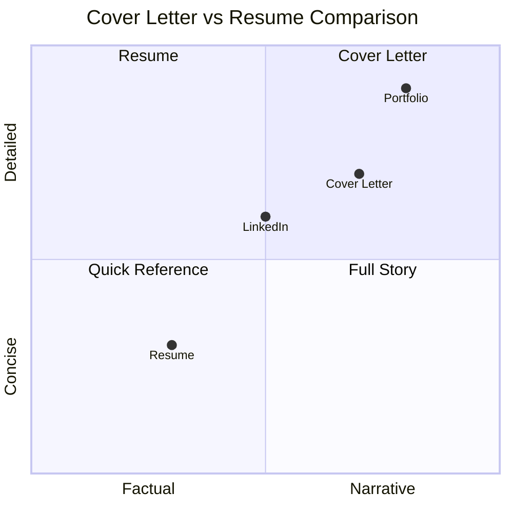

# Writing Effective Cover Letters

## Introduction

**What is a Cover Letter?**
A cover letter is a one-page document that accompanies your resume and provides additional context about your qualifications, motivation, and fit for a specific position. Unlike a resume that lists facts, a cover letter tells a story that connects your experience to the employer's needs and demonstrates genuine interest in the role and company.

**Why Does it Matter for Interviews?**
Cover letters matter because:
- 47% of hiring managers always read cover letters
- They differentiate you from candidates with similar resumes
- They demonstrate communication skills and attention to detail
- They allow you to address potential concerns (gaps, career changes)
- They show genuine interest beyond just applying to any job
- They provide context for achievements listed on your resume
- They can compensate for weaker resumes in some cases

**Cover Letters vs. Resumes:**
| Aspect | Resume | Cover Letter |
|--------|--------|--------------|
| Format | Bullet points, facts | Narrative, storytelling |
| Focus | What you've done | Why you're the right fit |
| Tone | Formal, concise | Professional, conversational |
| Length | 1-2 pages | 250-400 words |
| Purpose | Pass ATS screening | Get human attention |

---

## Learning Roadmap

### Mermaid Diagram



### Cover Letter Timeline

| Phase | Duration | Activities | Deliverable |
|-------|----------|------------|-------------|
| Research | 30 min | Company analysis, role understanding | Notes document |
| Planning | 30 min | Outline structure, identify key points | Outline |
| Drafting | 1-2 hours | Write first draft | Initial draft |
| Revision | 30 min | Refine content, improve flow | Revised draft |
| Proofreading | 30 min | Grammar, spelling, formatting | Final draft |
| Customization | 30 min per company | Tailor for each application | Company-specific versions |

---

## Theory Notes

### Cover Letter Structure

**Standard Structure (250-400 words):**
1. **Header** (3-4 lines): Your contact info, date, employer contact info
2. **Salutation** (1 line): Professional greeting
3. **Opening Paragraph** (3-4 sentences): Hook and position reference
4. **Body Paragraph 1** (4-5 sentences): Relevant experience and achievements
5. **Body Paragraph 2** (4-5 sentences): Skills and cultural fit
6. **Closing Paragraph** (3-4 sentences): Call to action and thank you
7. **Sign-off** (2 lines): Professional closing and signature

### Opening Hook Strategies

**1. Direct Value Proposition:**
"I am excited to apply for the Senior Software Engineer position at [Company], where my 7 years of experience building scalable systems can directly contribute to your mission of [company mission]."

**2. Shared Connection:**
"Your Engineering Manager, [Name], recommended I reach out about the Software Engineer position. Having worked together at [Previous Company], they believed my experience with [specific skill] would be valuable to your team."

**3. Company Achievement:**
"I was impressed by [Company]'s recent [achievement/product launch], and I'm eager to contribute to your continued success as a [Position]. My background in [relevant experience] aligns perfectly with the challenges you're tackling."

**4. Problem-Solution:**
"I noticed [Company] is expanding into [market/technology]. With my experience leading [relevant projects], I can help accelerate this growth while ensuring [specific outcome]."

### Body Paragraph Development

**The STAR Method for Cover Letters:**
- **Situation**: Brief context of the challenge
- **Task**: Your specific role and responsibility
- **Action**: What you did to address it
- **Result**: Measurable outcome and impact

**Connecting Experience to Requirements:**
For each key requirement in the job description:
1. Identify the requirement
2. Find matching experience
3. Quantify the result
4. Explain the relevance

**Showing Cultural Fit:**
- Reference company values and how you embody them
- Describe work style that matches their environment
- Mention specific initiatives or programs that interest you
- Show understanding of their culture through research

### Closing Strategies

**Strong Call to Action:**
"I am enthusiastic about the opportunity to discuss how my skills and experience can contribute to [Company]'s goals. I look forward to speaking with you about how I can add value to your team."

**Value Reiteration:**
"With my track record of [specific achievement] and passion for [industry/technology], I am confident I can help [Company] achieve [specific goal]. I welcome the opportunity to discuss this further."

**Thank You + Follow-up:**
"Thank you for considering my application. I will follow up next week to discuss how I can contribute to [Company]'s success. I am available at your convenience for an interview."

### Common Cover Letter Mistakes

**Content Mistakes:**
1. Generic, non-personalized content
2. Repeating resume verbatim
3. Focusing on what you want, not what you offer
4. Being too vague about qualifications
5. Not addressing specific job requirements

**Writing Mistakes:**
1. Poor grammar and spelling errors
2. Awkward phrasing or jargon
3. Passive voice instead of active
4. Clichés and overused phrases
5. Inconsistent tone

**Formatting Mistakes:**
1. Too long (over 400 words)
2. Poor visual presentation
3. Inconsistent formatting
4. Unprofessional font or layout
5. Missing contact information

---

## Key Concepts

| Concept | Definition | Cover Letter Impact |
|---------|------------|---------------------|
| Opening Hook | Compelling first sentence that captures attention | Determines if letter is read |
| Value Proposition | What you uniquely offer the employer | Differentiates from other candidates |
| STAR Method | Situation, Task, Action, Result framework | Structures achievement stories |
| Customization | Tailoring content for each application | Shows genuine interest |
| Call to Action | Clear next step you're requesting | Drives interview process |
| Cultural Fit | Alignment with company values | Addresses "will they fit?" concern |
| Quantification | Using metrics to demonstrate impact | Makes claims credible |
| Research Integration | References to company knowledge | Shows preparation and interest |
| Professional Tone | Balance of confidence and humility | Creates positive impression |
| Brevity | Concise, focused content | Respects reader's time |

---

## Frequently Asked Interview Questions

### Beginner Level

1. **Q: Do I really need a cover letter?**
   A: Yes. 47% of hiring managers always read cover letters, and they're especially important for career changes, gaps in employment, or when you want to show genuine interest. Even when optional, a strong cover letter can differentiate you from candidates who don't submit one.

2. **Q: How long should a cover letter be?**
   A: Keep it to 250-400 words, or one page maximum. Hiring managers are busy, and a concise letter shows you can communicate effectively. Focus on quality over quantity - every sentence should earn its place.

3. **Q: Should I address it to a specific person?**
   A: Yes, whenever possible. Research the hiring manager's name on LinkedIn or company website. "Dear [Name]" is more personal than "To Whom It May Concern." If you can't find a name, "Dear Hiring Manager" is acceptable.

4. **Q: Can I use the same cover letter for every application?**
   A: No. Generic cover letters are obvious and ineffective. Each letter should be customized for the specific company and role, referencing their values, challenges, and how your skills directly address their needs.

5. **Q: What if the job posting says "cover letter optional"?**
   A: Submit one anyway. "Optional" often means "we won't disqualify you without one, but we prefer candidates who include it." A strong cover letter gives you an advantage over candidates who skip it.

### Intermediate Level

6. **Q: How do I start a cover letter effectively?**
   A: Start with a compelling hook that immediately shows your value. Avoid generic openings like "I am writing to apply for..." Instead, lead with: a specific achievement, a connection to the company, or a direct statement of what you bring to the role.

7. **Q: Should I mention salary expectations in my cover letter?**
   A: Generally, no. Save salary negotiations for later in the process. Focus the cover letter on your qualifications and fit. If the application specifically requires salary information, include it briefly.

8. **Q: How do I address employment gaps?**
   A: Briefly acknowledge the gap and pivot to what you learned or accomplished during that time (freelance work, courses, caregiving, travel). Don't over-explain or apologize - focus on your readiness to contribute now.

9. **Q: What if I'm changing careers?**
   A: Emphasize transferable skills and explain your motivation for the change. Connect your previous experience to the new role's requirements. Show you've researched the industry and understand what it takes to succeed.

10. **Q: How do I follow up after sending a cover letter?**
    A: Wait 1-2 weeks, then send a brief, professional follow-up email referencing your application. Reiterate your interest and ask about next steps. Don't be pushy - one follow-up is sufficient.

### Advanced Level

11. **Q: How do I write a cover letter for a senior position?**
    A: Focus on leadership impact, strategic thinking, and business results. Highlight P&L responsibility, team-building, and executive presence. Show you understand the company's challenges and can contribute at a strategic level.

12. **Q: How do I tailor cover letters for different company sizes?**
    A: **Startups**: Emphasize versatility, entrepreneurial spirit, and comfort with ambiguity. **Mid-size**: Focus on process improvement and cross-functional collaboration. **Enterprise**: Highlight experience with scale, compliance, and stakeholder management.

13. **Q: Should I include portfolio samples or work examples?**
    A: For creative roles, you can mention specific portfolio pieces relevant to the position. For other roles, reference projects or achievements without attaching samples. Keep the focus on the letter itself.

14. **Q: How do I handle confidential job searches?**
    A: Don't mention your current employer by name. Use phrases like "a leading [industry] company" or "my current organization." Focus on your achievements without revealing proprietary information.

15. **Q: What's the difference between cover letters for internal vs. external applications?**
    A: Internal letters can reference specific company knowledge, initiatives, and relationships. They should emphasize growth within the company and understanding of internal challenges. External letters need more company research and context.

### FAANG Level

16. **Q: How do FAANG companies evaluate cover letters?**
    A: FAANG companies often receive thousands of applications. Cover letters help differentiate candidates, show communication skills, and demonstrate cultural alignment. They're particularly valuable for non-traditional candidates or career changers.

17. **Q: Should I reference specific FAANG initiatives or products?**
    A: Yes, but be specific and genuine. Reference recent launches, company announcements, or strategic directions that align with the role. Show you understand their business and how you can contribute.

18. **Q: How do I write a cover letter for multiple roles at the same FAANG company?**
    A: Tailor each letter to the specific role and team. Different teams have different needs and cultures. Customize your examples and value proposition for each position rather than sending a generic letter to all.

19. **Q: What if I have a referral at the company?**
    A: Mention the referral early in your letter. "Your Engineering Manager, [Name], suggested I apply..." This immediately gets attention and credibility. Follow up with how your skills align with the role.

20. **Q: How do I write a cover letter for an internship or entry-level position?**
    A: Focus on potential, learning ability, and relevant coursework or projects. Show enthusiasm and willingness to learn. Highlight any relevant experience, even from academic projects or personal work.

21. **Q: Should I use AI tools to help write my cover letter?**
    A: AI can help with initial drafting and structure, but always personalize and revise the output. Your cover letter should sound like you, not a template. Use AI as a starting point, then add your unique voice and specific details.

---

## Hands-on Practice

### Exercise 1: Opening Hook Practice
Write 5 different opening paragraphs for the same job:
1. Direct value proposition
2. Shared connection approach
3. Company achievement reference
4. Problem-solution approach
5. Passion-driven opening

### Exercise 2: STAR Method Application
Take 3 achievements from your resume and develop them using STAR:
- Situation: Context and challenge
- Task: Your specific role
- Action: What you did
- Result: Measurable outcome

### Exercise 3: Job Description Analysis
Analyze a job description and identify:
1. 5 required qualifications
2. 3 preferred qualifications
3. 2 cultural fit indicators
4. 1 key challenge or need

Map your experience to each identified requirement.

### Exercise 4: Company Research Integration
Research a target company and write a cover letter that references:
- Company mission or values
- Recent achievement or news
- Specific team or initiative
- How your skills address their needs

### Exercise 5: Length Optimization
Take a 500-word cover letter and reduce it to 350 words while maintaining impact:
- Remove unnecessary words
- Combine similar points
- Tighten sentences
- Eliminate redundancy

### Exercise 6: Tone Check
Read your cover letter aloud and evaluate:
- Does it sound like you?
- Is the tone professional but personable?
- Are you confident without being arrogant?
- Does it flow naturally?

### Exercise 7: Peer Review
Exchange cover letters with a peer and provide feedback on:
- Opening hook effectiveness
- Relevance to job requirements
- Clarity of value proposition
- Call to action strength
- Overall impression

### Exercise 8: Industry-Specific Customization
Create 3 versions of your cover letter for different industries:
1. Tech company
2. Finance company
3. Non-profit organization
Adjust tone, examples, and emphasis for each.

### Exercise 9: Format and Design
Create your cover letter in multiple formats:
1. Plain text for email body
2. PDF with professional formatting
3. Word document for ATS compatibility
Ensure consistency across formats.

### Exercise 10: A/B Testing
Send two different versions of your cover letter to similar companies and track:
- Response rates
- Interview invitations
- Feedback received
Iterate based on results.

---

## Real FAANG Interview Questions

| Company | Question | Difficulty |
|---------|----------|------------|
| Google | How would you write a cover letter for a role you're underqualified for? | Advanced |
| Amazon | How do you incorporate Leadership Principles into cover letters? | Intermediate |
| Facebook | Should cover letters be different for technical vs. non-technical roles? | Intermediate |
| Apple | How do you write a cover letter for a creative role at Apple? | Advanced |
| Netflix | How do you convey "high performance" culture fit in a cover letter? | Advanced |
| Microsoft | What's the ideal cover letter length for Microsoft applications? | Beginner |
| Google | How do you tailor a cover letter for different Google teams? | Intermediate |
| Amazon, Facebook | How do you handle cover letters for multiple positions? | Intermediate |
| Apple, Netflix | How do you show passion without sounding cliché? | Advanced |
| Microsoft, Google | Should you mention specific technologies in cover letters? | Beginner |
| All FAANG | How do you write a cover letter when referred by an employee? | Intermediate |
| Google | How do you address "culture fit" in a cover letter? | Advanced |
| Amazon | How do you demonstrate "bias for action" in a cover letter? | Intermediate |
| Facebook | What metrics should you include in a cover letter? | Intermediate |
| Apple, Netflix | How do you write a cover letter for a career change? | Advanced |
| Microsoft | How do you follow up after submitting a cover letter? | Beginner |
| Google, Amazon | How do you handle cover letters for remote positions? | Intermediate |
| Facebook, Apple | How do you write a cover letter for an international role? | Advanced |
| All FAANG | How do you write a cover letter without knowing the hiring manager? | Beginner |
| Google, Netflix | How do you write a cover letter for an unconventional role? | Advanced |

---

## Common Mistakes

| Mistake | Why It's Bad | How to Fix |
|---------|--------------|------------|
| Generic content | Shows lack of interest | Customize for each application |
| Repeating resume | Wastes space, adds no value | Tell stories, provide context |
| Too long | Gets skimmed or ignored | Keep to 250-400 words |
| Focusing on self | Misses employer's perspective | Focus on what you offer them |
| Poor grammar | Signals carelessness | Proofread multiple times |
| Clichés | Sounds unoriginal | Use specific, genuine language |
| No call to action | Misses opportunity to advance | Clear next step request |
| Wrong company name | Shows sloppy application | Triple-check all details |
| Unprofessional tone | Creates negative impression | Balance confidence with humility |
| No research | Lacks personalization | Research company and role |
| Passive voice | Sounds weak | Use active, confident language |
| Missing contact info | Can't be reached | Include all contact details |

---

## Best Practices

1. **Research Thoroughly**: Understand company, role, and culture before writing
2. **Customize Every Letter**: Tailor content for each specific application
3. **Start Strong**: Opening hook determines if letter gets read
4. **Focus on Value**: Show what you offer, not just what you want
5. **Quantify Achievements**: Use metrics to make claims credible
6. **Keep It Concise**: 250-400 words maximum
7. **Tell Stories**: Use STAR method for compelling narratives
8. **Address Requirements**: Match your experience to job needs
9. **Show Cultural Fit**: Reference company values and culture
10. **End with Action**: Clear call to action for next steps
11. **Proofread Religiously**: Zero tolerance for errors
12. **Use Professional Format**: Clean, readable layout
13. **Save in Right Format**: PDF unless otherwise specified
14. **Include Contact Info**: Make it easy to reach you
15. **Follow Up**: Send brief follow-up after 1-2 weeks

---

## Cheat Sheet

```
╔══════════════════════════════════════════════════════════════╗
║                COVER LETTER CHEAT SHEET                     ║
╠══════════════════════════════════════════════════════════════╣
║                                                              ║
║  STRUCTURE (250-400 words):                                  ║
║  1. Header (contact info)                                    ║
║  2. Salutation (professional greeting)                       ║
║  3. Opening (3-4 sentences: hook + position reference)       ║
║  4. Body 1 (4-5 sentences: relevant experience)              ║
║  5. Body 2 (4-5 sentences: skills + cultural fit)            ║
║  6. Closing (3-4 sentences: call to action)                  ║
║  7. Sign-off (professional closing)                          ║
║                                                              ║
║  OPENING HOOK FORMULAS:                                      ║
║  • "I am excited to apply for [Position] at [Company],       ║
║     where my [experience] can contribute to [their goal]."   ║
║  • "[Referral] recommended I reach out about [Position].     ║
║     My experience with [skill] aligns with your needs."      ║
║  • "I was impressed by [Company's achievement], and I'm      ║
║     eager to contribute to your continued success."          ║
║                                                              ║
║  STAR METHOD FOR BODY:                                       ║
║  S: Situation (context)                                      ║
║  T: Task (your role)                                         ║
║  A: Action (what you did)                                    ║
║  R: Result (measurable outcome)                              ║
║                                                              ║
║  COMMON MISTAKES:                                            ║
║  ✗ Generic, non-personalized content                         ║
║  ✗ Repeating resume verbatim                                 ║
║  ✗ Too long (over 400 words)                                 ║
║  ✗ Focusing on yourself, not the employer                    ║
║  ✗ Poor grammar and spelling errors                          ║
║  ✗ No call to action                                         ║
║                                                              ║
║  TAILORING CHECKLIST:                                        ║
║  □ Company name and role correct                             ║
║  □ References specific company values/initiatives             ║
║  □ Addresses key job requirements                            ║
║  □ Includes relevant quantified achievements                 ║
║  □ Shows cultural fit                                        ║
║                                                              ║
╚══════════════════════════════════════════════════════════════╝
```

---

## Flash Cards

| # | Question | Answer |
|---|----------|--------|
| 1 | What is a cover letter? | One-page document accompanying resume, providing context and fit |
| 2 | How long should a cover letter be? | 250-400 words, one page maximum |
| 3 | What is the STAR method? | Situation, Task, Action, Result - achievement storytelling framework |
| 4 | Should cover letters be customized? | Yes, every letter should be tailored for the specific role/company |
| 5 | What percentage of managers read cover letters? | 47% always read them |
| 6 | What is a cover letter opening hook? | Compelling first sentence that captures attention |
| 7 | How do you address employment gaps? | Briefly acknowledge, pivot to what you learned/accomplished |
| 8 | Should you mention salary in cover letter? | Generally no, save for later negotiation |
| 9 | How do you follow up? | Brief email after 1-2 weeks, reference application |
| 10 | What is a call to action? | Clear next step you're requesting (interview, call) |
| 11 | How do you show cultural fit? | Reference company values, culture, initiatives |
| 12 | Should you address it to a specific person? | Yes, whenever possible - research hiring manager |
| 13 | What format should cover letter be saved as? | PDF unless otherwise specified |
| 14 | How do you handle multiple roles at same company? | Tailor each letter to specific role and team |
| 15 | Should you mention referrals? | Yes, mention early for credibility |
| 16 | How do you quantify achievements? | Add metrics: %, $, #, time saved |
| 17 | What tone should cover letter have? | Professional but personable, confident but humble |
| 18 | How do you start without experience? | Focus on potential, learning ability, relevant projects |
| 19 | Should you use AI to write? | Use for drafting, but always personalize and revise |
| 20 | How do you handle "optional" cover letters? | Submit one anyway for advantage |

---

## Mind Map

```
Cover Letter
├── Structure
│   ├── Header
│   │   ├── Your Contact Info
│   │   ├── Date
│   │   └── Employer Contact Info
│   ├── Salutation
│   │   ├── Named Contact
│   │   └── Generic Greeting
│   ├── Opening
│   │   ├── Hook
│   │   ├── Position Reference
│   │   └── Value Statement
│   ├── Body
│   │   ├── Paragraph 1: Experience
│   │   ├── Paragraph 2: Skills/Fit
│   │   └── STAR Method
│   └── Closing
│       ├── Call to Action
│       ├── Thank You
│       └── Sign-off
├── Content
│   ├── Opening Hooks
│   │   ├── Value Proposition
│   │   ├── Shared Connection
│   │   ├── Company Achievement
│   │   └── Problem-Solution
│   ├── Body Development
│   │   ├── STAR Method
│   │   ├── Requirement Matching
│   │   └── Cultural Fit
│   └── Closing Strategies
│       ├── Call to Action
│       ├── Value Reiteration
│       └── Follow-up Plan
├── Customization
│   ├── Company Research
│   ├── Role Analysis
│   ├── Culture Understanding
│   └── Requirement Mapping
├── Common Issues
│   ├── Generic Content
│   ├── Too Long
│   ├── Poor Grammar
│   └── No Call to Action
└── Best Practices
    ├── Research Thoroughly
    ├── Customize Every Letter
    ├── Start Strong
    └── Proofread Religiously
```

---

## Mermaid Diagrams

### Cover Letter Structure



### Opening Hook Types



### Cover Letter Customization Process



### Cover Letter vs Resume



---

## Code Examples

### Python: Cover Letter Generator

```python
from typing import Dict, List, Optional
from dataclasses import dataclass, field

@dataclass
class JobDescription:
    title: str
    company: str
    requirements: List[str]
    preferred_qualifications: List[str]
    company_values: List[str]
    key_challenges: List[str]

@dataclass
class ApplicantProfile:
    name: str
    email: str
    phone: str
    experience_years: int
    key_achievements: List[Dict[str, str]]
    skills: List[str]
    relevant_projects: List[Dict[str, str]]

class CoverLetterGenerator:
    def __init__(self):
        self.templates = {
            'value_proposition': "I am excited to apply for the {position} at {company}, where my {experience} years of experience in {field} can directly contribute to {company_goal}.",
            'shared_connection': "{referral} recommended I reach out about the {position}. My experience with {skill} aligns perfectly with your team's needs.",
            'company_achievement': "I was impressed by {achievement}, and I'm eager to contribute to {company}'s continued success as {position}.",
            'problem_solution': "I noticed {company} is tackling {challenge}. With my background in {experience}, I can help {solution}."
        }
    
    def generate_opening(self, job: JobDescription, applicant: ApplicantProfile, hook_type: str = 'value_proposition') -> str:
        if hook_type == 'value_proposition':
            return self.templates['value_proposition'].format(
                position=job.title,
                company=job.company,
                experience=applicant.experience_years,
                field=job.requirements[0] if job.requirements else "the field",
                company_goal=job.key_challenges[0] if job.key_challenges else "your goals"
            )
        elif hook_type == 'company_achievement':
            return self.templates['company_achievement'].format(
                achievement="your recent achievements in the industry",
                company=job.company,
                position=job.title
            )
        return ""
    
    def generate_body_paragraph(self, job: JobDescription, applicant: ApplicantProfile) -> str:
        paragraphs = []
        
        # First body paragraph - relevant experience
        if applicant.key_achievements:
            achievement = applicant.key_achievements[0]
            paragraphs.append(
                f"In my previous role, I {achievement.get('action', 'led projects')} that resulted in "
                f"{achievement.get('result', 'significant improvements')}. This experience directly "
                f"relates to your need for {job.requirements[0] if job.requirements else 'this role'}."
            )
        
        # Second body paragraph - skills and cultural fit
        relevant_skills = [s for s in applicant.skills 
                          if any(r.lower() in s.lower() for r in job.requirements)]
        
        if relevant_skills:
            paragraphs.append(
                f"My expertise in {', '.join(relevant_skills[:3])} positions me to "
                f"contribute immediately to your team. I'm particularly drawn to {job.company}'s "
                f"commitment to {job.company_values[0] if job.company_values else 'excellence'}."
            )
        
        return '\n\n'.join(paragraphs)
    
    def generate_closing(self, job: JobDescription) -> str:
        return (
            f"I am enthusiastic about the opportunity to discuss how my skills and experience "
            f"can contribute to {job.company}'s goals. I look forward to speaking with you about "
            f"how I can add value to your team. Thank you for considering my application."
        )
    
    def generate_cover_letter(self, job: JobDescription, applicant: ApplicantProfile, 
                             hook_type: str = 'value_proposition') -> str:
        # Header
        letter = f"{applicant.name}\n"
        letter += f"{applicant.email} | {applicant.phone}\n"
        letter += f"\n"
        letter += f"Dear Hiring Manager,\n\n"
        
        # Opening
        letter += self.generate_opening(job, applicant, hook_type) + "\n\n"
        
        # Body
        letter += self.generate_body_paragraph(job, applicant) + "\n\n"
        
        # Closing
        letter += self.generate_closing(job) + "\n\n"
        
        # Sign-off
        letter += "Sincerely,\n"
        letter += applicant.name
        
        return letter
    
    def generate_variations(self, job: JobDescription, applicant: ApplicantProfile) -> Dict[str, str]:
        variations = {}
        
        for hook_type in ['value_proposition', 'company_achievement']:
            variations[hook_type] = self.generate_cover_letter(job, applicant, hook_type)
        
        return variations


# Example usage
if __name__ == "__main__":
    # Create job description
    job = JobDescription(
        title="Senior Software Engineer",
        company="TechCorp",
        requirements=["Python", "AWS", "microservices", "team leadership"],
        preferred_qualifications=["Kubernetes", "CI/CD", "agile"],
        company_values=["innovation", "customer focus", "excellence"],
        key_challenges=["scaling systems", "improving performance"]
    )
    
    # Create applicant profile
    applicant = ApplicantProfile(
        name="Jane Developer",
        email="jane@example.com",
        phone="555-0123",
        experience_years=7,
        key_achievements=[
            {"action": "led team to rebuild platform", "result": "reducing latency by 60%"},
            {"action": "implemented microservices architecture", "result": "handling 10x traffic"}
        ],
        skills=["Python", "AWS", "Docker", "Kubernetes", "microservices", "leadership"],
        relevant_projects=[{"name": "Cloud Migration", "impact": "30% cost reduction"}]
    )
    
    # Generate cover letter
    generator = CoverLetterGenerator()
    cover_letter = generator.generate_cover_letter(job, applicant)
    
    print("=" * 63)
    print("GENERATED COVER LETTER")
    print("=" * 63)
    print(cover_letter)
    
    # Generate variations
    variations = generator.generate_variations(job, applicant)
    for variant_type, letter in variations.items():
        print(f"\n{'=' * 63}")
        print(f"VARIATION: {variant_type.replace('_', ' ').title()}")
        print("=" * 63)
        print(letter)
```

### JavaScript: Cover Letter Analyzer

```javascript
class CoverLetterAnalyzer {
    constructor() {
        this.wordCount = 0;
        this.sentences = [];
        this.paragraphs = [];
        this.issues = [];
        this.suggestions = [];
    }

    analyze(letter) {
        this.wordCount = letter.split(/\s+/).length;
        this.sentences = letter.split(/[.!?]+/).filter(s => s.trim());
        this.paragraphs = letter.split(/\n\n+/).filter(p => p.trim());
        
        this.checkLength();
        this.checkStructure();
        this.checkTone();
        this.checkContent();
        
        return this.generateReport();
    }

    checkLength() {
        if (this.wordCount < 200) {
            this.issues.push('Cover letter too short (under 200 words)');
            this.suggestions.push('Add more details about your experience and qualifications');
        } else if (this.wordCount > 400) {
            this.issues.push('Cover letter too long (over 400 words)');
            this.suggestions.push('Condense content to 250-400 words');
        }
    }

    checkStructure() {
        if (this.paragraphs.length < 4) {
            this.issues.push('Missing standard cover letter sections');
            this.suggestions.push('Include: opening, body paragraphs, closing');
        }
        
        if (this.paragraphs.length > 6) {
            this.suggestions.push('Consider combining paragraphs for better flow');
        }
    }

    checkTone() {
        const letter = this.paragraphs.join(' ');
        
        // Check for passive voice indicators
        const passiveIndicators = ['was', 'were', 'been', 'being', 'is', 'are'];
        const passiveCount = passiveIndicators.filter(word => 
            letter.toLowerCase().includes(word)
        ).length;
        
        if (passiveCount > 3) {
            this.suggestions.push('Consider using more active voice');
        }
        
        // Check for clichés
        const clicheWords = ['team player', 'think outside the box', 'go-getter', 
                            'detail-oriented', 'self-starter', 'hard worker'];
        const foundCliches = clicheWords.filter(cliche => 
            letter.toLowerCase().includes(cliche)
        );
        
        if (foundCliches.length > 0) {
            this.issues.push(`Contains clichés: ${foundCliches.join(', ')}`);
            this.suggestions.push('Replace clichés with specific examples');
        }
    }

    checkContent() {
        const letter = this.paragraphs.join(' ').toLowerCase();
        
        // Check for company name
        if (!letter.includes('company') && !letter.includes('organization')) {
            this.suggestions.push('Include company name for personalization');
        }
        
        // Check for quantified achievements
        const hasNumbers = /\d+/.test(letter);
        if (!hasNumbers) {
            this.suggestions.push('Add quantified achievements for credibility');
        }
        
        // Check for call to action
        const ctaWords = ['contact', 'interview', 'discuss', 'follow up', 'speak'];
        const hasCTA = ctaWords.some(word => letter.includes(word));
        
        if (!hasCTA) {
            this.issues.push('Missing call to action');
            this.suggestions.push('Add clear next step request');
        }
        
        // Check for personal pronouns
        const firstPerson = ['i ', 'my ', "i'm", "i've", "i'll"];
        const hasFirstPerson = firstPerson.some(word => letter.includes(word));
        
        if (!hasFirstPerson) {
            this.suggestions.push('Use first person to sound more personal');
        }
    }

    generateReport() {
        let report = `
═══════════════════════════════════════════════════════════════
                  COVER LETTER ANALYSIS
═══════════════════════════════════════════════════════════════

BASIC METRICS
───────────────────────────────────────────────────────────────
Word Count: ${this.wordCount}
Paragraphs: ${this.paragraphs.length}
Sentences: ${this.sentences.length}
Words per Sentence: ${Math.round(this.wordCount / this.sentences.length)}

`;
        
        if (this.issues.length > 0) {
            report += "ISSUES FOUND\n";
            report += "───────────────────────────────────────────────────────────────\n";
            this.issues.forEach(issue => {
                report += `✗ ${issue}\n`;
            });
            report += "\n";
        }
        
        if (this.suggestions.length > 0) {
            report += "SUGGESTIONS FOR IMPROVEMENT\n";
            report += "───────────────────────────────────────────────────────────────\n";
            this.suggestions.forEach((suggestion, i) => {
                report += `${i + 1}. ${suggestion}\n`;
            });
        }
        
        report += "\n" + "═" * 63;
        return report;
    }
}

// Usage example
const analyzer = new CoverLetterAnalyzer();

const sampleLetter = `
I am excited to apply for the Senior Software Engineer position at TechCorp, 
where my 7 years of experience building scalable systems can directly contribute 
to your mission of organizing the world's information.

In my previous role, I led a team of 8 engineers to rebuild our core platform, 
reducing latency by 60% and handling 10x more traffic. This experience directly 
relates to your need for someone who can architect and scale high-performance systems.

My expertise in Python, AWS, and microservices positions me to contribute 
immediately to your team. I'm particularly drawn to TechCorp's commitment to 
innovation and customer focus.

I am enthusiastic about the opportunity to discuss how my skills and experience 
can contribute to TechCorp's goals. I look forward to speaking with you about 
how I can add value to your team. Thank you for considering my application.

Sincerely,
Jane Developer`;

console.log(analyzer.analyze(sampleLetter));
```

### Python: Cover Letter Template System

```python
from typing import Dict, List, Optional
from dataclasses import dataclass
import json

@dataclass
class CoverLetterTemplate:
    name: str
    industry: str
    role_type: str
    structure: List[str]
    tone: str
    key_elements: List[str]

class CoverLetterTemplateSystem:
    def __init__(self):
        self.templates = self._load_templates()
    
    def _load_templates(self) -> Dict[str, CoverLetterTemplate]:
        return {
            'tech_startup': CoverLetterTemplate(
                name='Tech Startup',
                industry='Technology',
                role_type='Engineering',
                structure=['hook', 'passion', 'skills', 'culture_fit', 'cta'],
                tone='energetic, innovative',
                key_elements=['technical_skills', 'startup_mindset', 'versatility']
            ),
            'enterprise': CoverLetterTemplate(
                name='Enterprise Corporation',
                industry='Various',
                role_type='Management',
                structure=['professional_intro', 'experience', 'leadership', 'results', 'cta'],
                tone='professional, authoritative',
                key_elements=['leadership', 'scale', 'process_improvement']
            ),
            'creative_agency': CoverLetterTemplate(
                name='Creative Agency',
                industry='Creative/Design',
                role_type='Design',
                structure=['creative_hook', 'portfolio_ref', 'process', 'passion', 'cta'],
                tone='creative, personable',
                key_elements=['portfolio', 'creativity', 'collaboration']
            ),
            'non_profit': CoverLetterTemplate(
                name='Non-Profit Organization',
                industry='Non-Profit',
                role_type='Various',
                structure=['mission_alignment', 'experience', 'passion', 'impact', 'cta'],
                tone='passionate, mission-driven',
                key_elements=['mission_alignment', 'impact', 'dedication']
            ),
            'finance': CoverLetterTemplate(
                name='Financial Services',
                industry='Finance',
                role_type='Analyst/Manager',
                structure=['professional_intro', 'analytical_skills', 'results', 'compliance', 'cta'],
                tone='professional, detail-oriented',
                key_elements=['analytical_skills', 'attention_to_detail', 'compliance']
            )
        }
    
    def get_template(self, company_type: str) -> Optional[CoverLetterTemplate]:
        return self.templates.get(company_type)
    
    def generate_structure_guide(self, template: CoverLetterTemplate) -> str:
        guide = f"""
═══════════════════════════════════════════════════════════════
         COVER LETTER TEMPLATE: {template.name.upper()}
═══════════════════════════════════════════════════════════════

Industry: {template.industry}
Role Type: {template.role_type}
Tone: {template.tone}

STRUCTURE:
───────────────────────────────────────────────────────────────"""
        
        for i, section in enumerate(template.structure, 1):
            guide += f"\n{i}. {section.replace('_', ' ').title()}"
        
        guide += "\n\nKEY ELEMENTS TO INCLUDE:"
        guide += "\n" + "─" * 63
        
        for element in template.key_elements:
            guide += f"\n• {element.replace('_', ' ').title()}"
        
        return guide
    
    def generate_customized_letter(self, template: CoverLetterTemplate, 
                                   job_title: str, company_name: str,
                                   applicant_info: Dict) -> str:
        letter = f"{applicant_info['name']}\n"
        letter += f"{applicant_info['email']} | {applicant_info['phone']}\n\n"
        letter += f"Dear Hiring Manager,\n\n"
        
        # Generate based on template structure
        for section in template.structure:
            if section == 'hook' or section == 'professional_intro' or section == 'creative_hook' or section == 'mission_alignment':
                letter += self._generate_hook(template, job_title, company_name) + "\n\n"
            elif section == 'passion' or section == 'portfolio_ref' or section == 'analytical_skills':
                letter += self._generate_body_paragraph1(template, job_title) + "\n\n"
            elif section == 'skills' or section == 'experience' or section == 'process':
                letter += self._generate_body_paragraph2(template, applicant_info) + "\n\n"
            elif section == 'culture_fit' or section == 'leadership' or section == 'results' or section == 'impact':
                letter += self._generate_culture_fit(template, company_name) + "\n\n"
            elif section == 'cta':
                letter += self._generate_closing(template, company_name) + "\n\n"
        
        letter += "Sincerely,\n"
        letter += applicant_info['name']
        
        return letter
    
    def _generate_hook(self, template: CoverLetterTemplate, job_title: str, company_name: str) -> str:
        hooks = {
            'tech_startup': f"I am thrilled to apply for the {job_title} position at {company_name}, where my passion for building innovative solutions can contribute to your mission.",
            'enterprise': f"I am writing to express my interest in the {job_title} position at {company_name}, where my extensive experience in [field] can drive meaningful results.",
            'creative_agency': f"I've been following {company_name}'s impressive work in [area], and I'm excited to apply for the {job_title} position where my creative skills can make an impact.",
            'non_profit': f"I am deeply aligned with {company_name}'s mission to [mission], and I'm eager to contribute as {job_title} to advance this important work.",
            'finance': f"I am writing to apply for the {job_title} position at {company_name}, where my analytical expertise and attention to detail can support your financial objectives."
        }
        
        return hooks.get(template.name.lower().replace(' ', '_'), hooks['tech_startup'])
    
    def _generate_body_paragraph1(self, template: CoverLetterTemplate, job_title: str) -> str:
        return f"In my previous roles, I have consistently delivered results through [specific achievements]. My experience with [relevant skills] aligns directly with the requirements of this {job_title} position."
    
    def _generate_body_paragraph2(self, template: CoverLetterTemplate, applicant_info: Dict) -> str:
        return f"My technical expertise includes {', '.join(applicant_info.get('skills', ['relevant skills'])[:3])}. I am known for my ability to [key strength] and have a track record of [measurable outcome]."
    
    def _generate_culture_fit(self, template: CoverLetterTemplate, company_name: str) -> str:
        return f"I am particularly drawn to {company_name}'s commitment to [company value]. My work style emphasizes [relevant quality], which aligns well with your team's approach."
    
    def _generate_closing(self, template: CoverLetterTemplate, company_name: str) -> str:
        return f"I am enthusiastic about the opportunity to contribute to {company_name}'s continued success. I look forward to discussing how my skills and experience can add value to your team."


# Example usage
if __name__ == "__main__":
    system = CoverLetterTemplateSystem()
    
    # Get template for tech startup
    template = system.get_template('tech_startup')
    if template:
        print(system.generate_structure_guide(template))
    
    # Generate customized letter
    applicant_info = {
        'name': 'Jane Developer',
        'email': 'jane@example.com',
        'phone': '555-0123',
        'skills': ['Python', 'AWS', 'Docker', 'Kubernetes']
    }
    
    letter = system.generate_customized_letter(
        template=template,
        job_title='Senior Software Engineer',
        company_name='TechStartup Inc',
        applicant_info=applicant_info
    )
    
    print("\n" + "=" * 63)
    print("GENERATED COVER LETTER")
    print("=" * 63)
    print(letter)
```

---

## Mini Project: Cover Letter Builder

Build a web application that helps create tailored cover letters:

**Features:**
- Template selection by industry/role
- Job description input and analysis
- Auto-generated draft based on profile
- Customization options
- Export as PDF/Word
- ATS optimization tips

**Tech Stack:**
- React frontend
- Node.js backend
- PDF generation library
- NLP for job description analysis

---

## Intermediate Project: Cover Letter Analytics

Build a tool to track and analyze cover letter effectiveness:

**Features:**
- A/B testing different versions
- Response rate tracking
- Industry-specific benchmarks
- Improvement suggestions
- Template performance metrics

**Tech Stack:**
- React dashboard
- Analytics backend
- Email tracking integration
- Database for historical data

---

## Advanced Project: AI Cover Letter Writer

Build an AI-powered cover letter generator:

**Features:**
- Natural language generation
- Company-specific customization
- Tone and style matching
- Real-time feedback and scoring
- Multi-language support

**Tech Stack:**
- Python (FastAPI)
- OpenAI/GPT API
- React frontend
- PostgreSQL for templates
- NLP pipeline

---

## Project Ideas Table

| # | Project | Difficulty | Skills Practiced | Time Estimate |
|---|---------|------------|------------------|---------------|
| 1 | Cover Letter Template Generator | Beginner | HTML/CSS, templating | 4-6 hours |
| 2 | Job Description Analyzer | Intermediate | NLP, text analysis | 1 week |
| 3 | Cover Letter A/B Testing Tool | Intermediate | Analytics, experimentation | 1-2 weeks |
| 4 | Industry-Specific Templates | Intermediate | Research, content creation | 1 week |
| 5 | ATS Optimizer for Letters | Advanced | NLP, optimization | 2-3 weeks |
| 6 | Cover Letter Tracking System | Advanced | Full-stack, email integration | 3-4 weeks |
| 7 | AI Cover Letter Generator | Expert | NLP, ML, full-stack | 4-6 weeks |
| 8 | Multi-Language Cover Letter Tool | Expert | i18n, NLP, translation | 4-6 weeks |
| 9 | Career Change Letter Helper | Advanced | Content strategy, NLP | 2-3 weeks |
| 10 | Cover Letter Review Platform | Expert | User system, reviews | 6-8 weeks |

---

## Resources

### Practice Websites

| Website | Purpose | URL |
|---------|---------|-----|
| Jobscan | Cover letter optimization | jobscan.co |
| Zety | Cover letter builder | zety.com |
| Resume Genius | Templates and examples | resumegenius.com |
| Indeed | Cover letter examples | indeed.com |
| The Muse | Career advice | themuse.com |

### Books

| Book | Author | Focus |
|------|--------|-------|
| "The Cover Letter Book" | James Innes | Complete cover letter guide |
| "Cover Letters for Dummies" | Joyce Lain Kennedy | Accessible cover letter writing |
| "Knock 'Em Dead Letters" | Martin Yate | Professional correspondence |
| "Modernize Your Resume" | Wendy Enelow | Contemporary job search |

### Templates & Examples

| Type | Best For |
|------|----------|
| Standard Professional | Corporate, enterprise roles |
| Creative | Design, marketing roles |
| Technical | Engineering, IT roles |
| Executive | Leadership positions |
| Career Change | Transitioning industries |

### Online Courses

| Course | Platform | Focus |
|--------|----------|-------|
| Cover Letter Writing | Udemy | Complete guide |
| Business Writing | Coursera | Professional communication |
| Career Coaching | LinkedIn Learning | Job search strategies |

### YouTube Channels

| Channel | Content |
|---------|---------|
| CareerVidz | Cover letter tutorials |
| Andrew LaCivita | Job search strategies |
| The Muse | Career advice |
| Indeed | Resume and cover letter tips |

---

## Checklist

### Content
- [ ] Addressed to specific person (or "Hiring Manager")
- [ ] Opening hook captures attention
- [ ] References specific position and company
- [ ] Includes relevant quantified achievements
- [ ] Shows cultural fit and company knowledge
- [ ] Ends with clear call to action
- [ ] 250-400 words total

### Customization
- [ ] Company name spelled correctly
- [ ] Position title matches job posting
- [ ] References company values/initiatives
- [ ] Addresses key job requirements
- [ ] Highlights relevant skills and experience

### Writing Quality
- [ ] No grammar or spelling errors
- [ ] Professional tone throughout
- [ ] Active voice used
- [ ] Concise and focused sentences
- [ ] Flows logically from paragraph to paragraph

### Format
- [ ] Clean, professional layout
- [ ] Consistent formatting
- [ ] Saved as PDF
- [ ] File name professional (e.g., "CoverLetter_JaneDoe_TechCorp.pdf")
- [ ] Includes all contact information

### Final Review
- [ ] Proofread by another person
- [ ] Read aloud for flow
- [ ] All placeholders removed
- [ ] Matches resume tone and style
- [ ] Ready to submit

---

## Revision Notes

### Cover Letter Structure
1. **Header**: Contact info, date, employer info
2. **Salutation**: Professional greeting
3. **Opening** (3-4 sentences): Hook + position + value
4. **Body 1** (4-5 sentences): Relevant experience + STAR
5. **Body 2** (4-5 sentences): Skills + cultural fit
6. **Closing** (3-4 sentences): CTA + thank you
7. **Sign-off**: Professional closing

### Opening Hook Formulas
- "I am excited to apply for [Position] at [Company], where my [experience] can contribute to [goal]."
- "[Referral] recommended I reach out about [Position]. My experience with [skill] aligns with your needs."
- "I was impressed by [achievement], and I'm eager to contribute to [Company]'s success."

### STAR Method
- **Situation**: Context of the challenge
- **Task**: Your specific role
- **Action**: What you did
- **Result**: Measurable outcome

### Common Mistakes to Avoid
- Generic, non-personalized content
- Repeating resume verbatim
- Too long (over 400 words)
- No call to action
- Poor grammar/spelling

### One-Day Cover Letter Prep
- Morning: Research company and analyze job description (1 hour)
- Afternoon: Write first draft using STAR method (2 hours)
- Evening: Proofread, customize, and finalize (1 hour)

### One-Week Cover Letter Strategy
- Days 1-2: Research target companies
- Days 3-4: Create templates for different industries
- Days 5-6: Customize letters for specific applications
- Day 7: Final review and submission

---

## Mock Interview Questions

### Cover Letter Strategy Questions

1. "Walk me through how you write a cover letter."

2. "How do you customize cover letters for different companies?"

3. "What's your approach to writing a strong opening hook?"

4. "How do you balance confidence with humility in cover letters?"

5. "What metrics do you include in your cover letters?"

### Behavioral Questions About Cover Letters

6. "Tell me about a cover letter that got you an interview."

7. "How do you handle writing cover letters for roles you're underqualified for?"

8. "Describe your process for researching a company before writing a cover letter."

9. "How do you follow up after sending a cover letter?"

10. "What's the most common cover letter mistake you see?"

### Situational Questions

11. "How would you write a cover letter for a career change?"

12. "What if you can't find the hiring manager's name?"

13. "How do you address employment gaps in a cover letter?"

14. "What if the job posting says 'cover letter optional'?"

15. "How do you write a cover letter for an internal transfer?"

---

## Difficulty Rating

| Task | Time Required | Difficulty | Impact |
|------|---------------|------------|--------|
| Basic cover letter | 1-2 hours | Easy | Medium |
| Customized cover letter | 2-3 hours | Medium | High |
| Career change cover letter | 3-4 hours | Hard | High |
| Executive cover letter | 4-6 hours | Hard | Very High |
| Cover letter for multiple roles | 2-3 hours per role | Medium | High |
| A/B testing cover letters | 1-2 weeks | Medium | Medium |
| AI cover letter generator | 4-6 weeks | Very Hard | High |

---

## Summary

Cover letters remain a powerful tool in the job search arsenal, with 47% of hiring managers always reading them. A well-crafted cover letter differentiates you from candidates with similar backgrounds, demonstrates communication skills, and shows genuine interest in specific roles and companies.

**Key Elements of Effective Cover Letters:**
1. **Strong Opening Hook**: Captures attention immediately
2. **Relevant Experience**: Connects your background to their needs
3. **Quantified Achievements**: Makes claims credible with metrics
4. **Cultural Fit**: Shows you understand and align with their values
5. **Clear Call to Action**: Drives the next step in the process

**Remember**: Every cover letter should be customized for the specific role and company. Generic cover letters are obvious and ineffective. Take the time to research, understand their needs, and craft a compelling narrative that shows why you're the right fit.

**Key Takeaway**: A cover letter is your opportunity to tell a story that your resume can't - the story of why you're the perfect candidate for this specific role at this specific company. Invest the time to make it compelling, and it will open doors to interviews.
