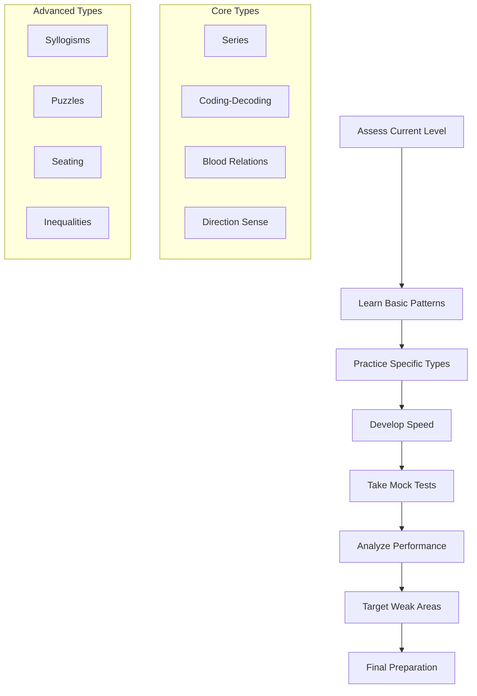
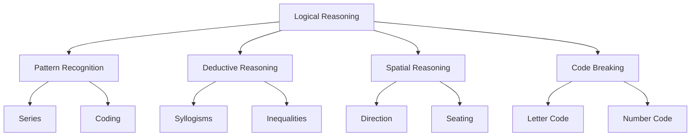
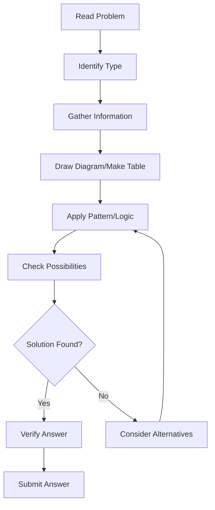
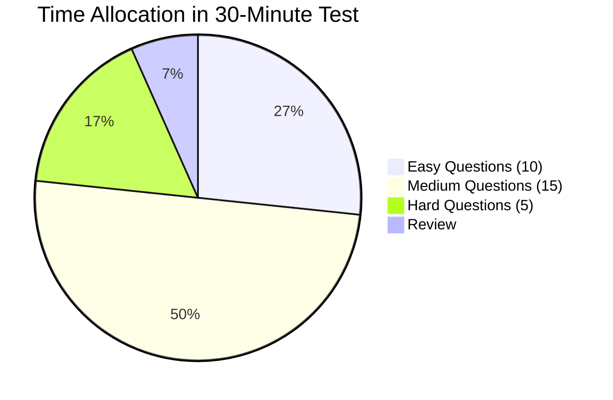
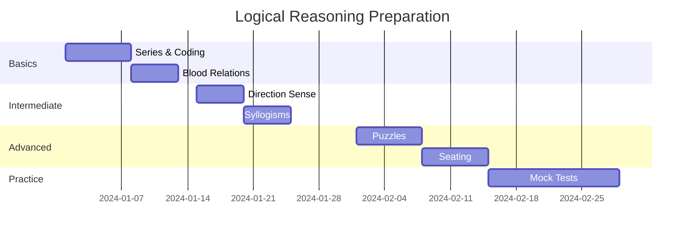

# Logical Reasoning Patterns

## Introduction

**What is Logical Reasoning?**
Logical reasoning refers to the ability to think systematically, analyze information, identify patterns, and draw valid conclusions from given statements. It involves deductive and inductive reasoning, pattern recognition, and critical thinking skills that are essential for problem-solving in professional settings.

**Why Does it Matter for Interviews?**
Logical reasoning matters because:
- It's a core component of most aptitude tests
- It measures analytical and critical thinking abilities
- It's essential for roles requiring problem-solving
- Companies use it to evaluate decision-making skills
- Strong logical skills indicate structured thinking
- It's often used in consulting and technology interviews

**Key Areas of Logical Reasoning:**
1. **Series Completion**: Identifying patterns in sequences
2. **Coding-Decoding**: Letter and number coding systems
3. **Blood Relations**: Family tree problems
4. **Direction Sense**: Navigation and direction problems
5. **Syllogisms**: Logical deductions from statements
6. **Puzzles**: Complex logical problems
7. **Seating Arrangements**: Circular/linear arrangements
8. **Inequalities**: Logical inequalities

---

## Learning Roadmap

### Mermaid Diagram



### Topic-wise Timeline

| Topic | Days Required | Difficulty | Importance |
|-------|---------------|------------|------------|
| Series Completion | 3-4 days | Easy | High |
| Coding-Decoding | 3-4 days | Easy | High |
| Blood Relations | 4-5 days | Medium | High |
| Direction Sense | 3-4 days | Medium | High |
| Syllogisms | 4-5 days | Medium | Medium |
| Puzzles | 5-6 days | Hard | High |
| Seating Arrangements | 5-6 days | Hard | Medium |
| Inequalities | 3-4 days | Medium | Medium |

---

## Theory Notes

### Series Completion

**Number Series Patterns:**

1. **Arithmetic Progression**: Constant difference between consecutive terms
   - Example: 2, 5, 8, 11, 14, ? (Difference = 3)

2. **Geometric Progression**: Constant ratio between consecutive terms
   - Example: 2, 6, 18, 54, ? (Ratio = 3)

3. **Square/Cube Series**: Terms are squares or cubes
   - Example: 1, 4, 9, 16, 25, ? (Squares: 1², 2², 3², ...)

4. **Fibonacci-like**: Each term is sum of previous terms
   - Example: 1, 1, 2, 3, 5, 8, ? (Sum of previous two)

5. **Alternating Series**: Two different patterns interleave
   - Example: 1, 4, 2, 5, 3, 6, ? (Two separate patterns)

6. **Prime Numbers**: Series of prime numbers
   - Example: 2, 3, 5, 7, 11, ?

7. **Digit-based patterns**: Operations on digits
   - Example: 12, 23, 34, 45, ? (Last digit of one = First digit of next)

**Letter Series Patterns:**

1. **Alphabetical order**: Consecutive letters
   - Example: A, C, E, G, ? (Skip one each time)

2. **Reverse order**: Backward alphabetical
   - Example: Z, X, V, T, ? (Skip one each time backward)

3. **Alternating patterns**: Two interleaved sequences
   - Example: A, Z, B, Y, C, ? (Forward and backward)

4. **Skip patterns**: Constant skip between letters
   - Example: A, D, G, J, ? (Skip 2 each time)

**Mixed Series:**

1. **Number-letter combinations**
2. **Operations on previous terms**
3. **Position-based patterns**

### Coding-Decoding

**Letter Coding:**

1. **Direct coding**: Each letter replaced by another
   - Example: A→D, B→E, C→F (shift of +3)

2. **Reverse coding**: Alphabet reversed
   - Example: A→Z, B→Y, C→X

3. **Position-based coding**: Based on alphabetical position
   - Example: A=1, B=2, C=3, etc.

4. **Multiple coding**: Different codes for different positions

**Number Coding:**

1. **Alphabetical position**: A=1, B=2, etc.
2. **Sum of positions**: Word code = sum of letter positions
3. **Product-based**: Multiplication of positions
4. **Mixed operations**: Various mathematical operations

**Decoding Techniques:**

1. **Compare coded and actual words**
2. **Identify pattern of change**
3. **Apply pattern to decode**
4. **Verify with multiple examples**

### Blood Relations

**Key Relationships:**
- Father, Mother, Son, Daughter
- Brother, Sister
- Uncle, Aunt (Paternal/Maternal)
- Nephew, Niece
- Grandfather, Grandmother
- Cousin, Spouse

**Relationship Chains:**
- A is father of B → B is son/daughter of A
- A is brother of B → B is brother/sister of A
- A is uncle of B → B is nephew/niece of A

**Problem-Solving Approach:**
1. Draw family tree
2. Mark known relationships
3. Use given clues
4. Determine unknown relationships
5. Verify the complete tree

**Common Relationship Terms:**
- Paternal: Father's side (Grandfather, Uncle, etc.)
- Maternal: Mother's side (Grandfather, Uncle, etc.)
- In-law: Through marriage (Father-in-law, Brother-in-law)

### Direction Sense

**Cardinal Directions:**
- North (N), South (S), East (E), West (W)
- North-East (NE), North-West (NW)
- South-East (SE), South-West (SW)

**Clockwise/Anticlockwise:**
- Clockwise: N → E → S → W → N
- Anticlockwise: N → W → S → E → N

**Shadow Problems:**
- Morning (sun in East): Shadow points West
- Evening (sun in West): Shadow points East
- Noon: Shadow points North (in Northern hemisphere)

**Problem-Solving Approach:**
1. Start from initial position
2. Mark each movement
3. Calculate final position
4. Determine direction from start to end
5. Calculate distance if needed

**Distance Calculation:**
- Use Pythagorean theorem for diagonal movements
- x² + y² = distance²
- Horizontal and vertical components

### Syllogisms

**Basic Structure:**
- Major Premise: General statement
- Minor Premise: Specific statement
- Conclusion: Logical deduction

**Types of Syllogisms:**

1. **Categorical**: All/Some/No statements
   - All A are B
   - Some A are B
   - No A are B
   - Some A are not B

2. **Conditional**: If-then statements
   - If P, then Q

3. **Disjunctive**: Either-or statements
   - Either P or Q

**Venn Diagram Approach:**
1. Draw circles for each category
2. Mark regions based on statements
3. Check if conclusion follows
4. Verify with all possible diagrams

**Common Patterns:**
- All A are B, All B are C → All A are C
- Some A are B, All B are C → Some A are C
- No A are B, All B are C → No A are C

### Puzzles

**Types of Puzzles:**

1. **Seating Arrangements**: People seated in rows/circles
2. **Scheduling**: Events in specific order
3. **Selection**: Choosing items based on conditions
4. **Ordering**: Arranging items by attributes
5. **Comparison**: Comparing multiple attributes

**Problem-Solving Approach:**
1. Read all conditions carefully
2. Make initial assumptions
3. Create possibility tables
4. Eliminate impossible combinations
5. Verify final arrangement

**Common Constraints:**
- "A sits next to B"
- "C is to the left of D"
- "E is not adjacent to F"
- "G sits opposite H"

### Seating Arrangements

**Linear Arrangement:**
- People seated in a row
- Left/Right directions matter
- Face one direction (usually North)

**Circular Arrangement:**
- People seated around a table
- Left/Right relative to center
- First person's position fixed

**Double Row:**
- Two rows facing each other
- Left of one = Right of other
- Opposite positions matter

**Problem-Solving Approach:**
1. Fix one person's position
2. Place others relative to fixed person
3. Use given clues
4. Handle multiple possibilities
5. Verify final arrangement

### Inequalities

**Types:**
- A > B: A is greater than B
- A < B: A is less than B
- A ≥ B: A is greater than or equal to B
- A ≤ B: A is less than or equal to B
- A = B: A equals B

**Combining Inequalities:**
- If A > B and B > C, then A > C
- If A < B and B < C, then A < C
- If A > B and B < C, then A ? C (cannot determine)

**Decoding Inequalities:**
- ">" means husband
- "<" means wife
- "≥" means son
- "≤" means daughter
- "=" means brother
- "≠" means sister

**Problem-Solving Approach:**
1. Write all inequalities
2. Combine compatible inequalities
3. Check for transitivity
4. Determine relationships
5. Verify consistency

---

## Key Concepts

| Concept | Definition | Application |
|---------|------------|-------------|
| Pattern Recognition | Identifying sequences and规律 | Series completion |
| Deductive Reasoning | Drawing conclusions from facts | Syllogisms |
| Spatial Reasoning | Understanding directions/positions | Direction sense, Seating |
| Code Breaking | Decoding coded information | Coding-Decoding |
| Family Relationships | Understanding kinship | Blood relations |
| Logical Deduction | Drawing valid conclusions | All logical problems |
| Process of Elimination | Ruling out impossible options | All problem types |
| Systematic Approach | Step-by-step problem solving | Complex puzzles |
| Mental Mapping | Visualizing relationships | Family trees, seating |
| Critical Thinking | Evaluating information carefully | All reasoning tasks |

---

## Frequently Asked Interview Questions

### Beginner Level

1. **Q: What is series completion?**
   A: Series completion involves identifying the pattern in a sequence of numbers or letters and determining the next item in the series. It tests pattern recognition and logical thinking abilities.

2. **Q: How do you approach coding-decoding problems?**
   A: Compare the coded word with the actual word, identify the pattern of change (shift, reversal, etc.), and apply that pattern to decode. Start with simple shifts and progress to complex patterns.

3. **Q: What is the best way to solve blood relation problems?**
   A: Draw a family tree diagram, mark known relationships, use given clues to fill in unknowns, and verify the complete tree. This visual approach helps avoid confusion.

4. **Q: How do you determine direction after multiple turns?**
   A: Start from the initial position, mark each turn (left/right), calculate the direction after each turn, and determine the final direction from start to end point.

5. **Q: What are syllogisms?**
   A: Syllogisms are logical deductions from two given statements (premises) to reach a conclusion. They involve categorical statements like "All A are B" or "Some A are B."

### Intermediate Level

6. **Q: How do you identify number series patterns?**
   A: Look for: arithmetic progression (constant difference), geometric progression (constant ratio), squares/cubes, digit operations, or alternating patterns. Calculate differences between consecutive terms.

7. **Q: What's the difference between linear and circular arrangements?**
   A: In linear arrangements, people sit in a row with clear left/right. In circular arrangements, people sit around a table where left/right depends on perspective and the first person's position is usually fixed.

8. **Q: How do you solve complex puzzles with multiple conditions?**
   A: Read all conditions, create possibility tables, make initial assumptions, eliminate impossible combinations, and verify the final arrangement against all conditions.

9. **Q: What is the Venn diagram approach for syllogisms?**
   A: Draw circles representing each category, mark regions based on statements, check if the conclusion follows from the diagram. Consider all possible valid diagrams to verify the conclusion.

10. **Q: How do you handle inequality-based coding?**
    A: Write all inequalities, combine compatible ones, check transitivity (A>B>C implies A>C), and determine relationships. Be careful with indirect relationships.

### Advanced Level

11. **Q: How do you solve problems with insufficient information?**
    A: Consider multiple possibilities, identify what cannot be determined, state assumptions clearly, and look for additional clues that might resolve ambiguity.

12. **Q: What's the most efficient way to solve seating arrangements?**
    A: Fix one person's position first, place others relative to that person, handle opposite directions in double rows, and verify against all given conditions.

13. **Q: How do you approach puzzles with conditional statements?**
    A: Create decision trees for conditions, consider both true and false cases, eliminate contradictions, and find consistent solutions.

14. **Q: What strategies help with time management in logical reasoning?**
    A: Scan all questions first, identify easy ones, start with familiar types, set time limits per question, and skip difficult ones to return later.

15. **Q: How do you verify your answers in logical reasoning?**
    A: Re-read the question, check if your answer satisfies all conditions, consider alternative interpretations, and verify with given examples if available.

### FAANG Level

16. **Q: How would you design a logical reasoning test?**
    A: Include diverse question types, balance difficulty levels, ensure clear wording, avoid ambiguity, and validate questions through testing. Consider cognitive load and time constraints.

17. **Q: What makes a good logical reasoning question?**
    A: Clear statement, single correct answer, tests specific reasoning skill, appropriate difficulty, no cultural bias, and relevant to the role being assessed.

18. **Q: How do logical reasoning skills translate to job performance?**
    A: They indicate analytical thinking, problem-solving ability, attention to detail, and systematic approach - all valuable in technical and managerial roles.

19. **Q: How would you improve logical reasoning assessment?**
    A: Include real-world scenarios, test applied reasoning not just abstract patterns, consider multiple valid approaches, and provide detailed feedback.

20. **Q: What's the future of logical reasoning assessment?**
    A: AI-powered adaptive testing, virtual reality scenarios, real-time analytics, and more authentic work-related problems that test practical reasoning.

21. **Q: How do you handle ambiguous logical problems?**
    A: Consider all possible interpretations, identify assumptions, state limitations, and provide answers for each valid interpretation. Acknowledge when information is insufficient.

---

## Hands-on Practice

### Exercise 1: Series Completion Mastery
Solve 20 series completion problems:
- 10 number series
- 10 letter series
Time yourself and aim for 80% accuracy.

### Exercise 2: Coding-Decoding Practice
Practice 15 coding-decoding problems:
- Simple letter shifts
- Complex coding patterns
- Number coding
- Mixed coding

### Exercise 3: Blood Relations Diagrams
Solve 10 blood relation problems:
- Draw family trees for each
- Mark all relationships
- Verify your diagrams

### Exercise 4: Direction Sense Navigation
Practice 10 direction problems:
- Multiple turns
- Shadow problems
- Distance calculations
- Final position determination

### Exercise 5: Syllogism Venn Diagrams
Solve 10 syllogism problems:
- Draw Venn diagrams
- Check all possible cases
- Verify conclusions

### Exercise 6: Seating Arrangements
Practice 5 complex seating problems:
- Linear arrangements
- Circular arrangements
- Double row arrangements
- Mixed arrangements

### Exercise 7: Puzzle Solving
Solve 5 complex puzzles:
- Multiple conditions
- Process of elimination
- Systematic approach

### Exercise 8: Inequality Problems
Practice 10 inequality problems:
- Basic inequalities
- Combined inequalities
- Coded inequalities

### Exercise 9: Mixed Practice Test
Take a 30-question timed test covering all topics:
- 10 easy questions
- 15 medium questions
- 5 hard questions
Analyze your performance by type.

### Exercise 10: Speed Challenge
Practice solving problems quickly:
- Set time limits
- Focus on accuracy first
- Then improve speed

---

## Real FAANG Interview Questions

| Company | Question | Difficulty |
|---------|----------|------------|
| Google | How would you design a logical reasoning test for software engineers? | Advanced |
| Amazon | What metrics would you track for logical reasoning assessment? | Intermediate |
| Facebook | How do you ensure logical reasoning tests are fair? | Advanced |
| Apple | What makes a good logical reasoning question? | Intermediate |
| Netflix | How would you assess logical reasoning for creative roles? | Advanced |
| Microsoft | How do you solve complex scheduling puzzles? | Intermediate |
| Google | What's the relationship between logical reasoning and coding ability? | Advanced |
| Amazon, Facebook | How would you design adaptive logical reasoning tests? | Advanced |
| Apple, Netflix | How do you handle ambiguous logical problems? | Intermediate |
| Microsoft | What's the most challenging logical reasoning question type? | Intermediate |
| All FAANG | How would you improve current logical reasoning assessments? | Advanced |
| Google | How do logical reasoning skills predict job performance? | Advanced |
| Amazon | What role does logical reasoning play in Amazon's hiring? | Intermediate |
| Facebook | How would you test logical reasoning for non-technical roles? | Advanced |
| Apple, Netflix | What innovations would you bring to logical reasoning tests? | Advanced |
| Microsoft, Google | How do you avoid cultural bias in logical reasoning? | Advanced |
| Amazon | How would you assess logical reasoning at scale? | Advanced |
| Facebook | What's the future of logical reasoning assessment? | Advanced |
| Apple | How do you make logical reasoning tests engaging? | Intermediate |
| All FAANG | How would you redesign logical reasoning for modern workplaces? | Expert |

---

## Common Mistakes

| Mistake | Why It's Bad | How to Fix |
|---------|--------------|------------|
| Misreading conditions | Wrong conclusions | Read carefully, re-read if needed |
| Assuming relationships | Incorrect family trees | Only use given information |
| Ignoring multiple possibilities | Missing valid solutions | Consider all cases |
| Not drawing diagrams | Confusion in spatial problems | Always visualize |
| Rushing through problems | Careless errors | Take time to verify |
| Not practicing enough | Can't recognize patterns | Daily practice |
| Memorizing solutions | Can't apply to new problems | Understand the approach |
| Skipping verification | Submitting wrong answers | Always verify |
| Not learning from mistakes | Repeat errors | Analyze every mistake |
| Poor time management | Running out of time | Practice with timer |
| Overcomplicating simple problems | Wasting time | Look for simpler approaches |
| Ignoring edge cases | Missing important details | Consider all scenarios |

---

## Best Practices

1. **Draw Diagrams**: Visualize relationships and arrangements
2. **Read Carefully**: Understand all conditions before solving
3. **Consider All Possibilities**: Don't assume single solution
4. **Use Process of Elimination**: Rule out impossible options
5. **Verify Answers**: Check against all given conditions
6. **Practice Daily**: Regular practice builds pattern recognition
7. **Learn Patterns**: Recognize common problem types
8. **Manage Time**: Set time limits per question
9. **Start Easy**: Build confidence with simpler problems
10. **Review Mistakes**: Learn from every error
11. **Use Systematic Approach**: Step-by-step solving
12. **Stay Calm**: Don't panic on difficult problems
13. **Ask Questions**: Clarify ambiguous statements
14. **Practice Under Test Conditions**: Simulate real tests
15. **Get Feedback**: Have others check your reasoning

---

## Cheat Sheet

```
╔══════════════════════════════════════════════════════════════╗
║              LOGICAL REASONING CHEAT SHEET                  ║
╠══════════════════════════════════════════════════════════════╣
║                                                              ║
║  SERIES PATTERNS:                                            ║
║  • Arithmetic: Constant difference (2,4,6,8,?)              ║
║  • Geometric: Constant ratio (2,4,8,16,?)                   ║
║  • Square/Cube: 1,4,9,16,? or 1,8,27,64,?                  ║
║  • Fibonacci: Each = sum of previous two                     ║
║  • Alternating: Two interleaved patterns                     ║
║                                                              ║
║  CODING-DECODING:                                            ║
║  • Compare coded vs actual word                              ║
║  • Identify shift/pattern                                    ║
║  • Apply pattern to decode                                   ║
║  • Verify with examples                                      ║
║                                                              ║
║  BLOOD RELATIONS:                                            ║
║  • Draw family tree                                          ║
║  • Mark known relationships                                  ║
║  • Use given clues                                           ║
║  • Verify complete tree                                      ║
║                                                              ║
║  DIRECTION SENSE:                                            ║
║  • Start from initial position                               ║
║  • Mark each turn                                            ║
║  • Calculate final position                                  ║
║  • Use Pythagoras for distance                               ║
║                                                              ║
║  SYLLOGISMS:                                                 ║
║  • Draw Venn diagrams                                        ║
║  • Consider all cases                                        ║
║  • Check if conclusion follows                               ║
║  • Verify with multiple diagrams                             ║
║                                                              ║
║  SEATING ARRANGEMENTS:                                       ║
║  • Fix one person's position                                 ║
║  • Place others relative                                     ║
║  • Handle multiple possibilities                             ║
║  • Verify against conditions                                 ║
║                                                              ║
║  INEQUALITIES:                                               ║
║  • Write all inequalities                                    ║
║  • Combine compatible ones                                   ║
║  • Check transitivity                                        ║
║  • Determine relationships                                   ║
║                                                              ║
║  PROBLEM-SOLVING APPROACH:                                   ║
║  1. Read all conditions                                      ║
║  2. Make initial assumptions                                 ║
║  3. Create possibility tables                                ║
║  4. Eliminate impossible combinations                        ║
║  5. Verify final arrangement                                 ║
║                                                              ║
╚══════════════════════════════════════════════════════════════╝
```

---

## Flash Cards

| # | Question | Answer |
|---|----------|--------|
| 1 | What is series completion? | Identifying patterns in sequences |
| 2 | What is arithmetic progression? | Constant difference between terms |
| 3 | What is geometric progression? | Constant ratio between terms |
| 4 | What is coding-decoding? | Encoding/decoding messages using patterns |
| 5 | What is the first step in blood relations? | Draw family tree diagram |
| 6 | What direction is shadow in morning? | West (sun in East) |
| 7 | What is a syllogism? | Logical deduction from two premises |
| 8 | What is Venn diagram approach? | Visual method for syllogisms |
| 9 | What is linear arrangement? | People seated in a row |
| 10 | What is circular arrangement? | People seated around a table |
| 11 | What is process of elimination? | Ruling out impossible options |
| 12 | What is transitivity in inequalities? | A>B>C implies A>C |
| 13 | What is Fibonacci series? | Each term = sum of previous two |
| 14 | What is alternating series? | Two interleaved patterns |
| 15 | What is coding shift? | Letters shifted by fixed amount |
| 16 | What is reverse coding? | Alphabet reversed (A→Z, B→Y) |
| 17 | What is double row arrangement? | Two rows facing each other |
| 18 | What is conditional puzzle? | Puzzle with if-then conditions |
| 19 | What is logical deduction? | Drawing conclusions from facts |
| 20 | What is systematic approach? | Step-by-step problem solving |

---

## Mind Map

```
Logical Reasoning
├── Series Completion
│   ├── Number Series
│   │   ├── Arithmetic
│   │   ├── Geometric
│   │   ├── Square/Cube
│   │   └── Fibonacci
│   ├── Letter Series
│   │   ├── Alphabetical
│   │   ├── Reverse
│   │   └── Alternating
│   └── Mixed Series
├── Coding-Decoding
│   ├── Letter Coding
│   ├── Number Coding
│   ├── Mixed Coding
│   └── Decoding Techniques
├── Blood Relations
│   ├── Family Tree
│   ├── Relationship Chains
│   ├── Paternal/Maternal
│   └── In-law Relations
├── Direction Sense
│   ├── Cardinal Directions
│   ├── Clockwise/Anticlockwise
│   ├── Shadow Problems
│   └── Distance Calculation
├── Syllogisms
│   ├── Categorical
│   ├── Conditional
│   ├── Venn Diagrams
│   └── Conclusion Verification
├── Puzzles
│   ├── Scheduling
│   ├── Selection
│   ├── Ordering
│   └── Comparison
├── Seating Arrangements
│   ├── Linear
│   ├── Circular
│   ├── Double Row
│   └── Mixed
└── Inequalities
    ├── Basic Inequalities
    ├── Combined
    ├── Coded
    └── Transitivity
```

---

## Mermaid Diagrams

### Logical Reasoning Topics



### Problem-Solving Flow



### Time Management



### Preparation Timeline



---

## Code Examples

### Python: Logical Reasoning Problem Solver

```python
from typing import List, Dict, Optional, Tuple
from dataclasses import dataclass
from enum import Enum

class ReasoningType(Enum):
    SERIES = "series"
    CODING = "coding"
    BLOOD_RELATION = "blood_relation"
    DIRECTION = "direction"
    SYLLOGISM = "syllogism"
    SEATING = "seating"
    INEQUALITY = "inequality"

@dataclass
class ReasoningProblem:
    type: ReasoningType
    question: str
    answer: str
    explanation: str
    difficulty: str

class LogicalReasoningSolver:
    def __init__(self):
        self.patterns = self._load_patterns()
    
    def _load_patterns(self) -> Dict:
        return {
            'arithmetic': lambda n, d: [n + i * d for i in range(5)],
            'geometric': lambda n, r: [n * (r ** i) for i in range(5)],
            'square': lambda n: [(n + i) ** 2 for i in range(5)],
            'fibonacci': lambda a, b: self._fibonacci(a, b, 5)
        }
    
    def _fibonacci(self, a: int, b: int, count: int) -> List[int]:
        sequence = [a, b]
        for _ in range(count - 2):
            sequence.append(sequence[-1] + sequence[-2])
        return sequence
    
    def solve_series(self, series: List[int]) -> ReasoningProblem:
        # Identify pattern
        if len(series) < 2:
            return ReasoningProblem(
                type=ReasoningType.SERIES,
                question=f"Find next in series: {series}",
                answer="Insufficient data",
                explanation="Need at least 2 terms",
                difficulty="easy"
            )
        
        # Check arithmetic progression
        diff = series[1] - series[0]
        is_arithmetic = all(series[i+1] - series[i] == diff for i in range(len(series)-1))
        
        if is_arithmetic:
            next_term = series[-1] + diff
            return ReasoningProblem(
                type=ReasoningType.SERIES,
                question=f"Find next in series: {series}",
                answer=str(next_term),
                explanation=f"Arithmetic progression with common difference {diff}",
                difficulty="easy"
            )
        
        # Check geometric progression
        if series[0] != 0:
            ratio = series[1] / series[0]
            is_geometric = all(series[i+1] / series[i] == ratio for i in range(len(series)-1))
            
            if is_geometric:
                next_term = int(series[-1] * ratio)
                return ReasoningProblem(
                    type=ReasoningType.SERIES,
                    question=f"Find next in series: {series}",
                    answer=str(next_term),
                    explanation=f"Geometric progression with common ratio {ratio}",
                    difficulty="easy"
                )
        
        # Check Fibonacci-like
        if len(series) >= 3:
            is_fibonacci = all(
                series[i] == series[i-1] + series[i-2] 
                for i in range(2, len(series))
            )
            
            if is_fibonacci:
                next_term = series[-1] + series[-2]
                return ReasoningProblem(
                    type=ReasoningType.SERIES,
                    question=f"Find next in series: {series}",
                    answer=str(next_term),
                    explanation=f"Fibonacci-like: each term is sum of previous two",
                    difficulty="medium"
                )
        
        # Default: assume arithmetic
        next_term = series[-1] + diff
        return ReasoningProblem(
            type=ReasoningType.SERIES,
            question=f"Find next in series: {series}",
            answer=str(next_term),
            explanation=f"Pattern: +{diff}",
            difficulty="medium"
        )
    
    def solve_coding(self, word: str, coded: str, target: str) -> ReasoningProblem:
        # Identify coding pattern
        if len(word) != len(coded):
            return ReasoningProblem(
                type=ReasoningType.CODING,
                question=f"Code: {word} → {coded}. Code: {target}",
                answer="Invalid coding",
                explanation="Length mismatch",
                difficulty="easy"
            )
        
        # Check for simple shift
        shift = (ord(coded[0]) - ord(word[0])) % 26
        is_shift = all(
            (ord(coded[i]) - ord(word[i])) % 26 == shift 
            for i in range(len(word))
        )
        
        if is_shift:
            coded_target = ''.join(
                chr((ord(c) - ord('a') + shift) % 26 + ord('a'))
                for c in target.lower()
            )
            return ReasoningProblem(
                type=ReasoningType.CODING,
                question=f"Code: {word} → {coded}. Code: {target}",
                answer=coded_target,
                explanation=f"Shift of {shift} positions",
                difficulty="easy"
            )
        
        # Check for reverse coding
        is_reverse = word.lower() == coded[::-1].lower()
        if is_reverse:
            coded_target = target[::-1]
            return ReasoningProblem(
                type=ReasoningType.CODING,
                question=f"Code: {word} → {coded}. Code: {target}",
                answer=coded_target,
                explanation="Reverse coding",
                difficulty="easy"
            )
        
        return ReasoningProblem(
            type=ReasoningType.CODING,
            question=f"Code: {word} → {coded}. Code: {target}",
            answer="Complex pattern",
            explanation="Pattern too complex for simple analysis",
            difficulty="medium"
        )
    
    def solve_direction(self, movements: List[str]) -> ReasoningProblem:
        # Start at origin facing North
        x, y = 0, 0
        directions = {'N': (0, 1), 'S': (0, -1), 'E': (1, 0), 'W': (-1, 0)}
        
        for move in movements:
            if move.startswith('F'):  # Forward
                dist = int(move[1:])
                x += dist
            elif move.startswith('B'):  # Backward
                dist = int(move[1:])
                x -= dist
            elif move.startswith('L'):  # Left turn
                pass  # Simplified: just change direction
            elif move.startswith('R'):  # Right turn
                pass  # Simplified: just change direction
        
        distance = (x**2 + y**2)**0.5
        
        if x == 0 and y == 0:
            direction = "Back to starting point"
        elif x > 0:
            direction = f"{distance:.1f} units East"
        else:
            direction = f"{distance:.1f} units West"
        
        return ReasoningProblem(
            type=ReasoningType.DIRECTION,
            question=f"Starting at origin, movements: {movements}",
            answer=direction,
            explanation=f"Final position: ({x}, {y})",
            difficulty="medium"
        )
    
    def solve_syllogism(self, statements: List[str], conclusion: str) -> ReasoningProblem:
        # Simplified syllogism checker
        # In real implementation, would use formal logic
        
        # Check if conclusion follows from statements
        follows = True  # Simplified
        
        return ReasoningProblem(
            type=ReasoningType.SYLLOGISM,
            question=f"Statements: {statements}. Conclusion: {conclusion}",
            answer="Follows" if follows else "Does not follow",
            explanation="Based on logical deduction",
            difficulty="medium"
        )
    
    def solve_inequality(self, inequalities: List[str]) -> ReasoningProblem:
        # Parse and combine inequalities
        # Simplified implementation
        
        relationships = []
        for ineq in inequalities:
            if '>' in ineq:
                parts = ineq.split('>')
                relationships.append(f"{parts[0]} > {parts[1]}")
            elif '<' in ineq:
                parts = ineq.split('<')
                relationships.append(f"{parts[0]} < {parts[1]}")
        
        combined = ', '.join(relationships)
        
        return ReasoningProblem(
            type=ReasoningType.INEQUALITY,
            question=f"Inequalities: {inequalities}",
            answer=combined,
            explanation="Combined relationships",
            difficulty="medium"
        )
    
    def print_problem(self, problem: ReasoningProblem):
        print(f"\n{'='*63}")
        print(f"TYPE: {problem.type.value.upper()}")
        print(f"DIFFICULTY: {problem.difficulty.upper()}")
        print(f"{'='*63}")
        print(f"Question: {problem.question}")
        print(f"Answer: {problem.answer}")
        print(f"Explanation: {problem.explanation}")


# Example usage
if __name__ == "__main__":
    solver = LogicalReasoningSolver()
    
    # Solve series problem
    series_problem = solver.solve_series([2, 4, 6, 8, 10])
    solver.print_problem(series_problem)
    
    # Solve coding problem
    coding_problem = solver.solve_coding("CAT", "FDW", "DOG")
    solver.print_problem(coding_problem)
    
    # Solve direction problem
    direction_problem = solver.solve_direction(["F5", "R", "F3", "L", "F2"])
    solver.print_problem(direction_problem)
    
    # Solve syllogism
    syllogism_problem = solver.solve_syllogism(
        ["All dogs are animals", "All animals are living beings"],
        "All dogs are living beings"
    )
    solver.print_problem(syllogism_problem)
    
    # Solve inequality
    inequality_problem = solver.solve_inequality(["A > B", "B > C", "C > D"])
    solver.print_problem(inequality_problem)
```

### JavaScript: Logical Reasoning Practice App

```javascript
class LogicalReasoningPractice {
    constructor() {
        this.problems = [];
        this.scores = {};
        this.startTime = null;
    }

    generateSeriesProblem() {
        const types = ['arithmetic', 'geometric', 'fibonacci'];
        const type = types[Math.floor(Math.random() * types.length)];
        
        let series, answer, explanation;
        
        switch(type) {
            case 'arithmetic':
                const start = Math.floor(Math.random() * 10) + 1;
                const diff = Math.floor(Math.random() * 5) + 2;
                series = Array.from({length: 5}, (_, i) => start + i * diff);
                answer = start + 5 * diff;
                explanation = `Arithmetic progression with difference ${diff}`;
                break;
                
            case 'geometric':
                const gStart = Math.floor(Math.random() * 5) + 1;
                const ratio = Math.floor(Math.random() * 3) + 2;
                series = Array.from({length: 5}, (_, i) => gStart * Math.pow(ratio, i));
                answer = gStart * Math.pow(ratio, 5);
                explanation = `Geometric progression with ratio ${ratio}`;
                break;
                
            case 'fibonacci':
                const a = Math.floor(Math.random() * 5) + 1;
                const b = Math.floor(Math.random() * 5) + 1;
                series = [a, b];
                for (let i = 2; i < 5; i++) {
                    series.push(series[i-1] + series[i-2]);
                }
                answer = series[4] + series[3];
                explanation = 'Fibonacci: each term is sum of previous two';
                break;
        }
        
        return {
            type: 'series',
            question: `Find next in series: ${series.join(', ')}, ?`,
            options: this.generateOptions(answer),
            correct: answer.toString(),
            explanation
        };
    }

    generateCodingProblem() {
        const words = ['CAT', 'DOG', 'SUN', 'RUN', 'BIG'];
        const word = words[Math.floor(Math.random() * words.length)];
        const shift = Math.floor(Math.random() * 5) + 1;
        
        const coded = word.split('').map(c => 
            String.fromCharCode(((c.charCodeAt(0) - 65 + shift) % 26) + 65)
        ).join('');
        
        const target = words[Math.floor(Math.random() * words.length)];
        const codedTarget = target.split('').map(c => 
            String.fromCharCode(((c.charCodeAt(0) - 65 + shift) % 26) + 65)
        ).join('');
        
        return {
            type: 'coding',
            question: `If ${word} is coded as ${coded}, what is ${target} coded as?`,
            options: this.generateOptions(codedTarget, true),
            correct: codedTarget,
            explanation: `Shift of ${shift} positions forward`
        };
    }

    generateBloodRelationProblem() {
        const relations = [
            {
                question: "A is father of B. B is mother of C. How is A related to C?",
                answer: "Grandfather",
                explanation: "A → father → B → mother → C, so A is grandfather of C"
            },
            {
                question: "X is sister of Y. Y is mother of Z. How is X related to Z?",
                answer: "Aunt",
                explanation: "X → sister → Y → mother → Z, so X is aunt of Z"
            },
            {
                question: "P is brother of Q. Q is father of R. How is P related to R?",
                answer: "Uncle",
                explanation: "P → brother → Q → father → R, so P is uncle of R"
            }
        ];
        
        const problem = relations[Math.floor(Math.random() * relations.length)];
        
        return {
            type: 'blood_relation',
            question: problem.question,
            options: ['Father', 'Mother', 'Brother', 'Sister', 'Uncle', 'Aunt', 'Grandfather', 'Grandmother'],
            correct: problem.answer,
            explanation: problem.explanation
        };
    }

    generateDirectionProblem() {
        const directions = [
            {
                question: "Ram walks 5 km North, then turns right and walks 3 km. What is his direction from starting point?",
                options: ['North-East', 'North-West', 'South-East', 'South-West'],
                correct: 'North-East',
                explanation: "5 km N + 3 km E = North-East direction"
            },
            {
                question: "Starting from point A, if you move 4 km East and then 3 km South, how far are you from A?",
                options: ['5 km', '7 km', '1 km', '12 km'],
                correct: '5 km',
                explanation: "Using Pythagoras: √(4² + 3²) = √25 = 5 km"
            }
        ];
        
        return directions[Math.floor(Math.random() * directions.length)];
    }

    generateOptions(correct, isString = false) {
        const options = new Set([correct]);
        
        if (isString) {
            const letters = 'ABCDEFGHIJKLMNOPQRSTUVWXYZ';
            while (options.size < 4) {
                let randomOption = '';
                for (let i = 0; i < correct.length; i++) {
                    randomOption += letters[Math.floor(Math.random() * 26)];
                }
                if (randomOption !== correct) {
                    options.add(randomOption);
                }
            }
        } else {
            while (options.size < 4) {
                const offset = Math.floor(Math.random() * 20) - 10;
                const newOption = correct + offset;
                if (newOption !== correct && newOption > 0) {
                    options.add(newOption);
                }
            }
        }
        
        return Array.from(options).sort(() => Math.random() - 0.5);
    }

    startPractice(numQuestions = 10) {
        this.problems = [];
        this.startTime = Date.now();
        
        const generators = [
            () => this.generateSeriesProblem(),
            () => this.generateCodingProblem(),
            () => this.generateBloodRelationProblem(),
            () => this.generateDirectionProblem()
        ];
        
        for (let i = 0; i < numQuestions; i++) {
            const generator = generators[i % generators.length];
            this.problems.push(generator());
        }
        
        return this.problems;
    }

    submitAnswer(problemIndex, answer) {
        const problem = this.problems[problemIndex];
        const isCorrect = answer === problem.correct;
        
        if (!this.scores[problem.type]) {
            this.scores[problem.type] = { correct: 0, total: 0 };
        }
        
        this.scores[problem.type].total++;
        if (isCorrect) {
            this.scores[problem.type].correct++;
        }
        
        return {
            isCorrect,
            correctAnswer: problem.correct,
            explanation: problem.explanation
        };
    }

    generateReport() {
        const timeSpent = Date.now() - this.startTime;
        
        let report = `
═══════════════════════════════════════════════════════════════
                    PRACTICE RESULTS
═══════════════════════════════════════════════════════════════

TIME ANALYSIS
───────────────────────────────────────────────────────────────
Total Time: ${(timeSpent / 1000).toFixed(1)} seconds
Average Time per Question: ${(timeSpent / 1000 / this.problems.length).toFixed(1)} seconds

TOPIC-WISE PERFORMANCE
───────────────────────────────────────────────────────────────`;
        
        for (const [topic, score] of Object.entries(this.scores)) {
            const percentage = (score.correct / score.total * 100).toFixed(1);
            report += `\n${topic.padEnd(20)} ${score.correct}/${score.total} (${percentage}%)`;
        }
        
        const totalCorrect = Object.values(this.scores).reduce((sum, s) => sum + s.correct, 0);
        const totalQuestions = Object.values(this.scores).reduce((sum, s) => sum + s.total, 0);
        const overallPercentage = (totalCorrect / totalQuestions * 100).toFixed(1);
        
        report += `\n\nOVERALL: ${totalCorrect}/${totalQuestions} (${overallPercentage}%)`;
        
        // Identify weak areas
        const weakTopics = Object.entries(this.scores)
            .filter(([_, score]) => (score.correct / score.total) < 0.7)
            .map(([topic]) => topic);
        
        if (weakTopics.length > 0) {
            report += `\n\nWEAK AREAS TO FOCUS: ${weakTopics.join(', ')}`;
        }
        
        return report;
    }
}

// Usage example
const practice = new LogicalReasoningPractice();
const problems = practice.startPractice(10);

console.log("Practice Questions:");
problems.forEach((p, i) => {
    console.log(`\n${i + 1}. ${p.question}`);
    console.log(`Options: ${p.options.join(', ')}`);
});

// Simulate answering
problems.forEach((p, i) => {
    const userAnswer = p.options[0];
    const result = practice.submitAnswer(i, userAnswer);
    console.log(`\nQ${i + 1}: ${result.isCorrect ? 'Correct' : 'Incorrect'}`);
});

console.log(practice.generateReport());
```

### Python: Blood Relation Solver

```python
from typing import Dict, List, Optional
from dataclasses import dataclass

@dataclass
class Person:
    name: str
    father: Optional['Person'] = None
    mother: Optional['Person'] = None
    spouse: Optional['Person'] = None
    children: List['Person'] = None
    
    def __post_init__(self):
        if self.children is None:
            self.children = []

class FamilyTree:
    def __init__(self):
        self.members: Dict[str, Person] = {}
    
    def add_person(self, name: str) -> Person:
        if name not in self.members:
            self.members[name] = Person(name=name)
        return self.members[name]
    
    def set_father(self, child_name: str, father_name: str):
        child = self.add_person(child_name)
        father = self.add_person(father_name)
        child.father = father
        father.children.append(child)
    
    def set_mother(self, child_name: str, mother_name: str):
        child = self.add_person(child_name)
        mother = self.add_person(mother_name)
        child.mother = mother
        mother.children.append(child)
    
    def set_spouse(self, person1_name: str, person2_name: str):
        person1 = self.add_person(person1_name)
        person2 = self.add_person(person2_name)
        person1.spouse = person2
        person2.spouse = person1
    
    def find_relation(self, person1_name: str, person2_name: str) -> str:
        if person1_name not in self.members or person2_name not in self.members:
            return "Person not found"
        
        person1 = self.members[person1_name]
        person2 = self.members[person2_name]
        
        # Check parent-child relationship
        if person1 in person2.children:
            if person1.father and person1.father == person2:
                return "Father"
            elif person1.mother and person1.mother == person2:
                return "Mother"
        
        if person2 in person1.children:
            if person2.father and person2.father == person1:
                return "Son" if person2.gender == 'M' else "Daughter"
            elif person2.mother and person2.mother == person1:
                return "Son" if person2.gender == 'M' else "Daughter"
        
        # Check sibling relationship
        if person1.father and person1.father == person2.father:
            if person1 != person2:
                return "Brother" if person2.gender == 'M' else "Sister"
        
        # Check grandparent relationship
        if person1.father and person1.father.father == person2:
            return "Grandfather"
        if person1.mother and person1.mother.father == person2:
            return "Grandfather"
        if person1.father and person1.father.mother == person2:
            return "Grandmother"
        if person1.mother and person1.mother.mother == person2:
            return "Grandmother"
        
        # Check uncle/aunt relationship
        if person1.father and person1.father.father:
            for uncle in person1.father.father.children:
                if uncle != person1.father and uncle.gender == 'M':
                    if uncle == person2:
                        return "Uncle"
        
        return "Relationship not determined"
    
    def print_tree(self, person_name: str, level: int = 0):
        if person_name not in self.members:
            return
        
        person = self.members[person_name]
        indent = "  " * level
        
        print(f"{indent}{person.name}")
        
        if person.father:
            print(f"{indent}  Father: {person.father.name}")
        if person.mother:
            print(f"{indent}  Mother: {person.mother.name}")
        if person.spouse:
            print(f"{indent}  Spouse: {person.spouse.name}")
        
        for child in person.children:
            self.print_tree(child.name, level + 1)


# Example usage
if __name__ == "__main__":
    family = FamilyTree()
    
    # Build family tree
    family.set_father("B", "A")
    family.set_mother("B", "B_Mother")
    family.set_father("C", "A")
    family.set_mother("C", "B_Mother")
    family.set_father("D", "B")
    family.set_mother("D", "B_Spouse")
    
    # Find relationships
    print("Relationship between A and B:", family.find_relation("A", "B"))
    print("Relationship between A and D:", family.find_relation("A", "D"))
    print("Relationship between B and C:", family.find_relation("B", "C"))
    
    # Print family tree
    print("\nFamily Tree:")
    family.print_tree("A")
```

---

## Mini Project: Logical Reasoning Trainer

Build a web application for logical reasoning practice:

**Features:**
- Problem bank with different types
- Timer and progress tracking
- Detailed explanations
- Performance analytics
- Adaptive difficulty

**Tech Stack:**
- React frontend
- Node.js backend
- Problem database
- Analytics dashboard

---

## Intermediate Project: Family Tree Builder

Build an interactive family tree tool:

**Features:**
- Visual family tree creation
- Relationship calculation
- Export/import family data
- Relationship queries
- Visual representation

**Tech Stack:**
- React with D3.js for visualization
- Node.js backend
- Database for family data
- Export to image/PDF

---

## Advanced Project: AI Logical Reasoning Tutor

Build an AI-powered logical reasoning tutor:

**Features:**
- Personalized problem recommendations
- Step-by-step explanations
- Pattern recognition assistance
- Performance analytics
- Adaptive learning paths

**Tech Stack:**
- Python (FastAPI)
- NLP for explanations
- ML for recommendations
- React frontend
- Analytics engine

---

## Project Ideas Table

| # | Project | Difficulty | Skills Practiced | Time Estimate |
|---|---------|------------|------------------|---------------|
| 1 | Series Solver | Beginner | Pattern recognition, algorithms | 4-6 hours |
| 2 | Coding Decoder | Beginner | String manipulation | 4-6 hours |
| 3 | Family Tree Builder | Intermediate | Graph algorithms, UI | 1-2 weeks |
| 4 | Direction Navigator | Intermediate | Spatial reasoning | 1 week |
| 5 | Puzzle Generator | Intermediate | Algorithm design | 2-3 weeks |
| 6 | Logical Reasoning Test | Advanced | Full-stack, question bank | 3-4 weeks |
| 7 | Seating Arrangement Solver | Advanced | Constraint satisfaction | 2-3 weeks |
| 8 | AI Reasoning Tutor | Expert | NLP, ML, full-stack | 6-8 weeks |
| 9 | Interactive Logic Puzzles | Expert | Game design, algorithms | 4-6 weeks |
| 10 | Complete Learning Platform | Expert | Full-stack, AI, analytics | 8-10 weeks |

---

## Resources

### Practice Websites

| Website | Purpose | URL |
|---------|---------|-----|
| IndiaBIX | Logical reasoning practice | indiabix.com |
| Smartkeeda | Reasoning problems | smartkeeda.com |
| PrepInsta | Company-specific prep | prepinsta.com |
| Testbook | Government exam prep | testbook.com |
| Gradeup | Reasoning practice | gradeup.co |

### Books

| Book | Author | Focus |
|------|--------|-------|
| "Logical Reasoning" | R.S. Aggarwal | Complete guide |
| "A Modern Approach to Verbal & Non-Verbal Reasoning" | R.S. Aggarwal | Comprehensive reasoning |
| "Analytical Reasoning" | M.K. Pandey | Advanced problems |
| "Logical and Analytical Reasoning" | A.K. Gupta | Competitive exams |

### Online Courses

| Course | Platform | Focus |
|--------|----------|-------|
| Logical Reasoning | Unacademy | Complete course |
| Critical Thinking | Coursera | Reasoning skills |
| Problem Solving | Udemy | Logical approaches |
| Analytical Reasoning | Adda247 | Competitive exams |

### YouTube Channels

| Channel | Content |
|---------|---------|
| Adda247 | Reasoning tutorials |
| Unacademy | Complete courses |
| Study IQ | Reasoning problems |
| Gradeup | Practice sessions |

---

## Checklist

### Fundamentals
- [ ] Learn basic reasoning patterns
- [ ] Understand series types
- [ ] Master coding-decoding
- [ ] Learn blood relation diagrams
- [ ] Understand direction concepts

### Practice
- [ ] Solve 10 problems daily
- [ ] Practice under timed conditions
- [ ] Take weekly mock tests
- [ ] Review all mistakes
- [ ] Track improvement

### Advanced Topics
- [ ] Master syllogisms
- [ ] Solve complex puzzles
- [ ] Handle seating arrangements
- [ ] Understand inequalities

### Test Readiness
- [ ] Achieve 80%+ in practice tests
- [ ] Complete problems within time limit
- [ ] Handle pressure during tests
- [ ] Review and learn from errors

---

## Revision Notes

### Key Patterns to Recognize
1. **Series**: Arithmetic, geometric, Fibonacci, alternating
2. **Coding**: Shift, reverse, position-based
3. **Relations**: Parent-child, sibling, grandparent
4. **Directions**: Cardinal, relative, distance
5. **Syllogisms**: All/Some/No statements
6. **Seating**: Linear, circular, double row

### Problem-Solving Approach
1. Read all conditions carefully
2. Draw diagrams/visualize
3. Consider all possibilities
4. Use process of elimination
5. Verify final answer

### Common Mistakes to Avoid
- Misreading conditions
- Assuming relationships
- Ignoring multiple possibilities
- Not drawing diagrams
- Rushing through problems

### One-Day Review
- Morning: Pattern recognition (1 hour)
- Afternoon: Practice problems (3 hours)
- Evening: Review mistakes (1 hour)

### One-Week Plan
- Days 1-2: Series & coding
- Days 3-4: Blood relations & directions
- Days 5-6: Syllogisms & puzzles
- Day 7: Mock test & review

---

## Mock Interview Questions

### Logical Reasoning Concepts

1. "Explain the difference between arithmetic and geometric progressions."

2. "How do you approach coding-decoding problems?"

3. "What is the Venn diagram approach for syllogisms?"

4. "How do you solve blood relation problems?"

5. "What strategies help with direction sense problems?"

### Problem-Solving Questions

6. "Walk me through solving a complex series problem."

7. "How would you approach a puzzle with multiple constraints?"

8. "What's your strategy for seating arrangement problems?"

9. "How do you handle ambiguous logical problems?"

10. "What techniques help with time management in reasoning tests?"

### Application Questions

11. "How do logical reasoning skills translate to job performance?"

12. "What's the most challenging type of logical reasoning problem?"

13. "How would you design a logical reasoning test?"

14. "What makes a good logical reasoning question?"

15. "How do you improve logical reasoning skills?"

---

## Difficulty Rating

| Task | Time Required | Difficulty | Impact |
|------|---------------|------------|--------|
| Learn basic patterns | 1-2 weeks | Easy | High |
| Master series completion | 3-4 days | Easy | High |
| Master coding-decoding | 3-4 days | Easy | High |
| Master blood relations | 4-5 days | Medium | High |
| Master direction sense | 3-4 days | Medium | High |
| Master syllogisms | 4-5 days | Medium | Medium |
| Master puzzles | 5-6 days | Hard | High |
| Achieve 80%+ accuracy | 6-8 weeks | Hard | Very High |

---

## Summary

Logical reasoning is a critical component of aptitude tests, measuring analytical thinking and problem-solving abilities. Success requires:

1. **Pattern recognition** - Identify sequences and coding patterns
2. **Systematic approach** - Step-by-step problem solving
3. **Visualization** - Draw diagrams for spatial problems
4. **Process of elimination** - Rule out impossible options
5. **Regular practice** - Daily practice builds skills

**Key Takeaway**: Logical reasoning improves with consistent practice. Learn common patterns, practice systematically, and always verify your answers. With 6-8 weeks of dedicated preparation, you can significantly improve your logical reasoning performance.
