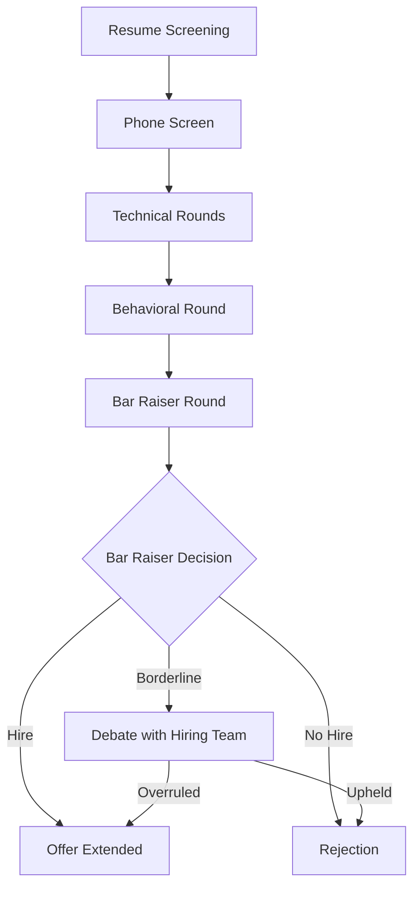
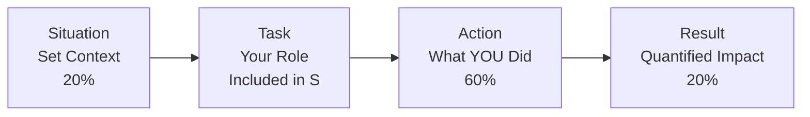
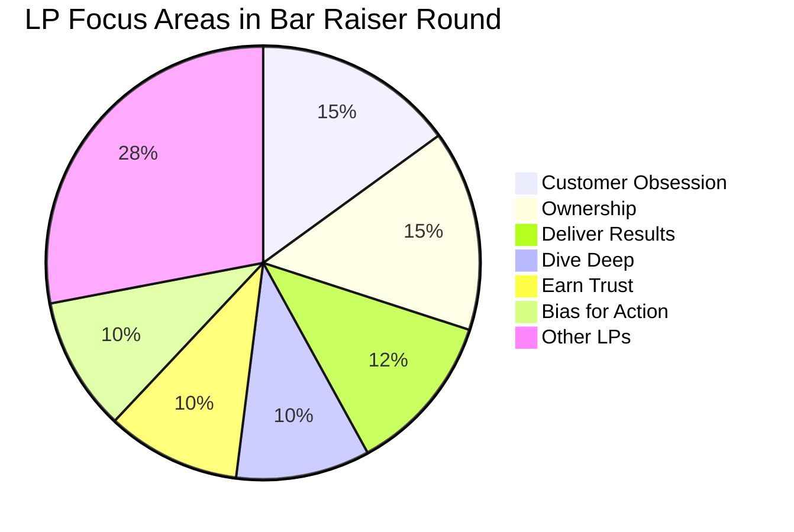

# 100 - Amazon Bar Raiser Round

## Introduction

The Bar Raiser Round is one of the most unique and critical components of the Amazon interview process. Unlike other interview rounds conducted by the hiring team, the Bar Raiser is an experienced interviewer from a completely different team whose sole purpose is to ensure that every person hired raises the overall talent bar at Amazon. This concept was pioneered by Amazon and has since been adopted in various forms by other tech companies. The Bar Raiser holds veto power over hiring decisions, meaning even if the hiring manager wants to extend an offer, a Bar Raiser can block it. Understanding this round thoroughly is essential for anyone interviewing at Amazon or similar companies that employ this practice.

The Bar Raiser Round typically lasts 45-60 minutes and combines behavioral questions with elements of problem-solving, leadership assessment, and culture evaluation. The interviewer is specifically trained to look beyond technical skills and assess whether a candidate will be a net positive for the organization over the long term. This guide provides an exhaustive deep dive into every aspect of the Bar Raiser Round, from understanding the role to mastering the questions and strategies that lead to success.

---

## Learning Roadmap

```
Week 1-2: Understanding the Bar Raiser Role
  ├── Study Amazon Leadership Principles (all 16)
  ├── Read Amazon's leadership principles page thoroughly
  ├── Understand the Bar Raiser selection process
  └── Learn the difference between Bar Raiser and regular interviewer

Week 3-4: Deep Dive into LPs
  ├── Map your experiences to each LP
  ├── Prepare 3 STAR stories per LP
  ├── Practice articulating stories concisely
  └── Identify gaps in your experience coverage

Week 5-6: Practice and Refinement
  ├── Conduct mock Bar Raiser sessions
  ├── Record yourself answering questions
  ├── Get feedback from experienced interviewers
  └── Refine your weakest stories

Week 7-8: Final Preparation
  ├── Full mock Bar Raiser interview
  ├── Review all stories one more time
  ├── Practice time management (2-3 min per answer)
  ├── Prepare questions to ask the Bar Raiser
  └── Mental preparation and confidence building
```

---

## Theory Notes

### What Does a Bar Raiser Actually Do?

A Bar Raiser is an Amazon employee who has been selected and trained to conduct interviews across the organization. Their key responsibilities include:

1. **Maintaining Hiring Standards**: They ensure that every hire meets or exceeds the current talent level of the team
2. **Unbiased Assessment**: Being from a different team, they bring objectivity free from team politics or urgency-driven compromises
3. **Calibration**: They are regularly calibrated with other Bar Raisers to ensure consistency in evaluation
4. **Long-term Thinking**: They assess not just whether the candidate can do the job today, but whether they will grow and contribute over 3-5 years
5. **Veto Power**: They can veto a hiring decision, and their veto is final (though rarely exercised unilaterally)

### The Bar Raiser Selection Process

Not every Amazon employee can become a Bar Raiser. The selection process includes:

- **Nomination**: High-performing employees with strong interviewing skills are nominated
- **Training**: Selected candidates undergo extensive training on behavioral interviewing, bias reduction, and evaluation criteria
- **Shadowing**: New Bar Raisers shadow experienced ones before conducting interviews independently
- **Calibration Sessions**: Regular sessions where Bar Raisers compare evaluations and align standards
- **Performance Tracking**: Bar Raisers are tracked on the quality of their hiring recommendations

### How Bar Raiser Evaluation Differs

| Aspect | Regular Interviewer | Bar Raiser |
|--------|-------------------|------------|
| Team Affiliation | Same team as the role | Different team entirely |
| Focus | Technical/role-specific skills | Overall candidate potential |
| Veto Power | No | Yes |
| Training Level | Standard interviewer training | Extensive specialized training |
| Time Horizon | Can the person do the job now? | Will this person raise the bar long-term? |
| Evaluation Scope | Specific competency areas | Holistic assessment across all LPs |

---

## Key Concepts

### Amazon Leadership Principles - Deep Dive

Amazon's 16 Leadership Principles (LPs) are the foundation of every Bar Raiser evaluation:

#### 1. Customer Obsession
- **Definition**: Leaders start with the customer and work backwards
- **What Bar Raisers Look For**: Examples where you prioritized customer needs over internal convenience, business metrics, or short-term gains
- **Strong Signal**: "I noticed our customers were struggling with X, so I proactively built Y even though it wasn't in my roadmap"

#### 2. Ownership
- **Definition**: Leaders are owners; they think long-term and don't sacrifice long-term value for short-term results
- **What Bar Raisers Look For**: Times you went beyond your job description, took responsibility for outcomes, and acted on behalf of the entire company
- **Red Flag**: Blaming others, waiting to be told what to do, narrow focus only on assigned tasks

#### 3. Invent and Simplify
- **Definition**: Leaders expect and require innovation and invention from their teams
- **What Bar Raisers Look For**: Creative solutions, simplification of complex processes, challenging status quo constructively

#### 4. Are Right, A Lot
- **Definition**: Leaders have strong judgment and good instincts
- **What Bar Raisers Look For**: Decision-making frameworks, learning from wrong decisions, seeking diverse perspectives

#### 5. Learn and Be Curious
- **Definition**: Leaders are never done learning and always seek to improve themselves
- **What Bar Raisers Look For**: Self-driven learning, staying current with industry trends, curiosity about new technologies

#### 6. Hire and Develop the Best
- **Definition**: Leaders raise the performance bar with every hire
- **What Bar Raisers Look For**: Mentoring experiences, helping others grow, holding teams to high standards

#### 7. Insist on the Highest Standards
- **Definition**: Leaders have relentlessly high standards that many may think are unreasonably high
- **What Bar Raisers Look For**: Quality focus, refusal to accept mediocrity, continuous improvement examples

#### 8. Think Big
- **Definition**: Thinking boldly is in leaders' DNA
- **What Bar Raisers Look For**: Visionary thinking, challenging constraints, articulating ambitious goals

#### 9. Bias for Action
- **Definition**: Speed matters in business; many decisions are reversible and don't need extensive study
- **What Bar Raisers Look For**: Calculated risk-taking, making decisions with incomplete information, moving quickly

#### 10. Frugality
- **Definition**: Accomplish more with less; constraints breed resourcefulness
- **What Bar Raisers Look For**: Efficient resource usage, creative problem-solving under constraints

#### 11. Earn Trust
- **Definition**: Leaders listen attentively, speak candidly, and treat others respectfully
- **What Bar Raisers Look For**: Building trust with stakeholders, honest communication, admitting mistakes

#### 12. Dive Deep
- **Definition**: Leaders operate at all levels, stay connected to the details
- **What Bar Raisers Look For**: Hands-on problem solving, understanding root causes, not just surface-level analysis

#### 13. Have Backbone; Disagree and Commit
- **Definition**: Leaders respectfully challenge decisions they disagree with, even when doing so is uncomfortable
- **What Bar Raisers Look For**: Standing up for the right decision, constructive disagreement, committed execution after disagreeing

#### 14. Deliver Results
- **Definition**: Leaders focus on the key inputs for their business and deliver them with the right quality and in a timely fashion
- **What Bar Raisers Look For**: Measurable impact, meeting deadlines, driving business outcomes

#### 15. Strive to be Earth's Best Employer
- **Definition**: Leaders work every day to create a safer, more productive, higher performing workplace
- **What Bar Raisers Look For**: Team building, inclusive leadership, employee development

#### 16. Success and Scale Bring Broad Responsibility
- **Definition**: We started in a garage but are now a global company
- **What Bar Raisers Look For**: Understanding broader impact, ethical decision-making, thinking beyond immediate scope

---

## FAQ (20+ Q&A)

### Q1: What exactly is a Bar Raiser at Amazon?
**A:** A Bar Raiser is an experienced Amazon interviewer from a different team who has veto power over hiring decisions. Their role is to ensure every new hire raises the overall talent bar. They conduct the final round interview focusing on Leadership Principles and overall candidate assessment.

### Q2: Can a Bar Raiser really veto a hiring decision?
**A:** Yes, they have veto power. If a Bar Raiser votes "no hire," the candidate will not be hired regardless of what the hiring team thinks. However, this veto is exercised judiciously and is based on extensive training and calibration.

### Q3: How is a Bar Raiser different from the hiring manager?
**A:** The hiring manager knows the specific role requirements and team needs. The Bar Raiser evaluates the candidate from an organizational-wide perspective, focusing on long-term potential and whether the candidate raises the overall talent bar.

### Q4: How many Leadership Principles does the Bar Raiser assess?
**A:** Typically 3-5 Leadership Principles per interview session, but the Bar Raiser evaluates you holistically across all 16 LPs based on the signals they observe.

### Q5: What is the format of a Bar Raiser interview?
**A:** It's typically a 45-60 minute behavioral interview using the STAR method. The interviewer will ask 4-6 deep behavioral questions, probing your experiences across multiple Leadership Principles.

### Q6: Should I prepare differently for a Bar Raiser round?
**A:** Yes. While technical rounds focus on problem-solving skills, the Bar Raiser round focuses on your leadership behaviors, judgment, and overall potential. Prepare STAR stories for each LP and practice articulating them clearly.

### Q7: What makes a candidate fail the Bar Raiser round?
**A:** Common reasons include: inability to provide concrete examples, stories that don't demonstrate the claimed LP, lack of ownership, blaming others, inability to handle ambiguity, and not showing growth or learning from experiences.

### Q8: Can the Bar Raiser round be conducted virtually?
**A:** Yes, especially since 2020. Many Bar Raiser interviews are conducted via video conferencing. The format and rigor remain the same regardless of whether it's in-person or virtual.

### Q9: How long does a Bar Raiser interview typically last?
**A:** Usually 45-60 minutes. Plan for 4-6 behavioral questions with follow-up probes.

### Q10: What questions should I ask the Bar Raiser?
**A:** Ask about their role, what they look for in candidates, how they see the company evolving, or insights about the interview process. Avoid questions easily answered on the website.

### Q11: Is the Bar Raiser round the last round?
**A:** It's typically one of the final rounds, often conducted after technical interviews. It's usually the deciding factor in the hiring decision.

### Q12: Can I retake the Bar Raiser interview if I fail?
**A:** Yes, but Amazon has a cooling-off period (typically 6-12 months) before you can reapply. Use this time to strengthen your areas of weakness.

### Q13: Do Bar Raisers specialize in certain LPs?
**A:** While all Bar Raisers are trained across all LPs, some may have deeper expertise in certain areas based on their own experience and the calibration sessions they attend.

### Q14: How many stories should I prepare per LP?
**A:** Prepare at least 2-3 stories per Leadership Principle. Have a mix of professional and personal experiences. Each story should be unique and demonstrate different aspects of the LP.

### Q15: What's the biggest mistake candidates make in Bar Raiser interviews?
**A:** The most common mistake is giving hypothetical answers ("I would do X") instead of concrete examples ("I did X, and here's what happened"). Bar Raisers want real stories, not theoretical approaches.

### Q16: Does the Bar Raiser evaluate technical skills?
**A:** No, the Bar Raiser round is focused on behavioral and leadership assessment. Technical skills are evaluated in separate coding and system design rounds.

### Q17: Can I ask the Bar Raiser to repeat a question?
**A:** Absolutely. It's better to ask for clarification than to give an unfocused answer. This shows thoughtfulness and communication skills.

### Q18: How should I structure my STAR responses?
**A:** Keep Situation and Task to about 20% of your response, focus 60% on Action (your specific actions, not team actions), and dedicate 20% to quantifiable Results.

### Q19: What if I don't have a perfect example for a question?
**A:** It's okay to use examples that aren't perfect successes. Amazon values learning from failures. Show self-awareness about what you'd do differently and what you learned.

### Q20: How does the Bar Raiser contribute to the hiring debrief?
**A:** The Bar Raiser provides their assessment independently before hearing others' opinions. During the debrief, they advocate for their position and have equal or greater weight than the hiring manager's recommendation.

### Q21: Are there different types of Bar Raiser interviews?
**A:** Yes, there are standard Bar Raiser rounds and sometimes "Loop" interviews where the Bar Raiser participates alongside other interviewers. Some teams also have Senior Bar Raisers for leadership positions.

### Q22: How many interviews does Amazon conduct for a typical SDE role?
**A:** Usually 5-6 rounds total: 1-2 coding rounds, 1 system design round, 1-2 behavioral rounds, and 1 Bar Raiser round.

---

## Hands-on Practice

### Exercise 1: LP Story Mapping
For each of the 16 Leadership Principles, write down 3 real experiences from your career. Categorize them and identify which LPs you have strong coverage for and which need more stories.

### Exercise 2: STAR Story Development
Take your top 10 stories and write them out using the STAR framework. Time yourself telling each story aloud - aim for 2-3 minutes per story.

### Exercise 3: Peer Practice
Partner with a friend or colleague. Have them ask you random LP-based questions while you practice giving STAR responses. Record yourself and review.

### Exercise 4: Gap Analysis
Review your story inventory against all 16 LPs. For any LP where you have fewer than 2 strong examples, brainstorm additional experiences or find ways to reframe existing experiences.

### Exercise 5: Time Management Drill
Set a timer for 3 minutes. Practice answering a behavioral question completely within that time. Repeat until you can consistently hit the 2-3 minute mark without sacrificing substance.

---

## FAANG Questions

### Amazon-Specific Bar Raiser Questions

1. **Tell me about a time you made a decision based on incomplete information.**
   - Tests: Bias for Action, Judgment

2. **Describe a situation where you had to push back on a decision you disagreed with.**
   - Tests: Have Backbone; Disagree and Commit

3. **Give me an example of when you went above and beyond for a customer.**
   - Tests: Customer Obsession

4. **Tell me about a time you took ownership of something outside your responsibility.**
   - Tests: Ownership

5. **Describe a time when you simplified a complex process.**
   - Tests: Invent and Simplify

6. **Tell me about a time you had to make a trade-off between speed and quality.**
   - Tests: Bias for Action, Insist on the Highest Standards

7. **Give an example of when you built trust with a difficult stakeholder.**
   - Tests: Earn Trust

8. **Describe a time when you dove deep into data to solve a problem.**
   - Tests: Dive Deep

9. **Tell me about a time you hired or mentored someone who went on to be very successful.**
   - Tests: Hire and Develop the Best

10. **Describe a time when you thought bigger than what was asked of you.**
    - Tests: Think Big

### Google/Alphabet Similar Questions
11. **Tell me about a time you used data to make a decision that others disagreed with.**
12. **Describe a situation where you had to work with ambiguous requirements.**

### Meta/Facebook Similar Questions
13. **Give me an example of when you moved fast and broke something. How did you handle it?**
14. **Tell me about a time you had to balance competing priorities from different stakeholders.**

### Apple Similar Questions
15. **Describe a project where you refused to compromise on quality despite pressure.**

### Microsoft Similar Questions
16. **Tell me about a time you helped a team member improve their performance.**

---

## Common Mistakes

### Mistake 1: Using Hypothetical Examples
**Wrong**: "In that situation, I would probably analyze the data and then make a recommendation."
**Right**: "In that situation, I analyzed the data over three days, identified the root cause, and presented my findings to the VP, which led to..."

### Mistake 2: Taking Credit for Team Achievements
**Wrong**: "We built a new system that reduced latency by 50%."
**Right**: "I identified the latency bottleneck, proposed the architecture changes, led the implementation effort, and personally coded the critical path optimization that reduced latency by 50%."

### Mistake 3: Not Quantifying Results
**Wrong**: "The project was successful and the team was happy."
**Right**: "The project launched 2 weeks early, reduced customer complaints by 35%, and saved $200K annually in operational costs."

### Mistake 4: Picking Weak Stories
Using a story that's not compelling enough because you're trying to cover an LP you don't have strong examples for. It's better to acknowledge a weaker area than to use a mediocre story.

### Mistake 5: Rambling Without Structure
Without STAR structure, answers become unfocused. Always start with context, move to your specific actions, and end with results.

### Mistake 6: Not Listening to the Full Question
Jumping into your story before the interviewer finishes asking the question. Wait for the complete question and any follow-up probes.

### Mistake 7: Avoiding the "Why" Questions
When asked "why did you do X?", don't just describe what happened. Explain your reasoning, trade-offs considered, and alternative approaches evaluated.

### Mistake 8: Memorized Scripts
Reciting rehearsed stories verbatim sounds robotic. Know your stories well enough to tell them naturally, but adapt to the specific question asked.

---

## Best Practices

1. **Prepare Stories, Not Scripts**: Know the key points of each story but don't memorize word-for-word
2. **Use Quantifiable Metrics**: Numbers make your impact tangible (revenue, time saved, percentage improvement)
3. **Show Self-Awareness**: Acknowledge areas for growth and what you learned from challenges
4. **Be Authentic**: Real experiences resonate more than polished but hollow stories
5. **Practice Active Listening**: Understand what LP the question is targeting before answering
6. **Diversify Your Stories**: Don't use the same story for multiple LPs
7. **Show Growth**: Demonstrate how you've evolved as a leader over time
8. **Prepare for Deep Follow-ups**: The Bar Raiser will probe deeper - be ready to go into more detail
9. **Maintain Balance**: Cover a range of experiences - successes, failures, collaborations, individual achievements
10. **Research the Role**: While the Bar Raiser assesses broadly, showing you understand the team's mission helps contextualize your answers

---

## Cheat Sheet

```
BAR RAISER INTERVIEW CHEAT SHEET
================================

STAR METHOD:
S - Situation (20%): Set the context briefly
T - Task (included in S): Your specific responsibility
A - Action (60%): What YOU did (most important)
R - Result (20%): Quantifiable outcomes

KEY LPs TO PREPARE:
□ Customer Obsession    □ Ownership
□ Invent & Simplify     □ Are Right, A Lot
□ Learn & Be Curious    □ Hire & Develop Best
□ Insist on Standards   □ Think Big
□ Bias for Action       □ Frugality
□ Earn Trust            □ Dive Deep
□ Disagree & Commit     □ Deliver Results
□ Best Employer         □ Broad Responsibility

GOLDEN RULES:
• Stories > Hypotheticals
• YOUR actions > Team actions
• Quantified results > Vague outcomes
• Specific > General
• 2-3 minutes per story
• 4-6 stories total in the session

RED FLAGS TO AVOID:
✗ Blaming others
✗ No concrete examples
✗ Taking credit for others' work
✗ Not learning from failures
✗ Inability to handle ambiguity
✗ Poor communication

QUESTIONS TO ASK THE BAR RAISER:
• What made you want to become a Bar Raiser?
• What's the most common mistake you see candidates make?
• How do you see this role evolving in the next 2 years?
• What advice would you give someone joining this team?
```

---

## Flash Cards (20)

### Card 1
**Q:** What is the primary role of a Bar Raiser?
**A:** To ensure every new hire raises the overall talent bar at Amazon, with veto power over hiring decisions.

### Card 2
**Q:** How many Leadership Principles does Amazon have?
**A:** 16 Leadership Principles.

### Card 3
**Q:** What percentage of your STAR response should be "Action"?
**A:** Approximately 60% - this is where you describe what YOU specifically did.

### Card 4
**Q:** What is the ideal duration for a STAR response?
**A:** 2-3 minutes per story.

### Card 5
**Q:** Name 3 common reasons candidates fail the Bar Raiser round.
**A:** (1) Hypothetical instead of real examples, (2) Taking credit for team's work, (3) Not quantifying results.

### Card 6
**Q:** Can a Bar Raiser be from the same team as the open role?
**A:** No, Bar Raisers are always from a different team to ensure objectivity.

### Card 7
**Q:** What LP does "Tell me about a time you went beyond your job description" test?
**A:** Ownership.

### Card 8
**Q:** How long is the typical cooling-off period after failing a Bar Raiser round?
**A:** 6-12 months.

### Card 9
**Q:** Does the Bar Raiser evaluate technical skills?
**A:** No, they focus on behavioral and leadership assessment only.

### Card 10
**Q:** What should you do if you don't understand a question?
**A:** Ask for clarification rather than guessing - this shows communication skills.

### Card 11
**Q:** What LP tests whether you can make decisions with incomplete information?
**A:** Bias for Action.

### Card 12
**Q:** How many stories should you prepare per Leadership Principle?
**A:** At least 2-3 stories per LP.

### Card 13
**Q:** What does "Dive Deep" mean in Amazon's LPs?
**A:** Operating at all levels, staying connected to details, and understanding root causes rather than surface analysis.

### Card 14
**Q:** When should you use a failure story?
**A:** When the question specifically asks about failures or when showing learning and growth would strengthen your answer.

### Card 15
**Q:** What is the difference between the hiring manager and the Bar Raiser?
**A:** The hiring manager assesses role-specific fit; the Bar Raiser assesses long-term organizational impact and overall talent bar.

### Card 16
**Q:** What does "Have Backbone; Disagree and Commit" mean?
**A:** Respectfully challenging decisions you disagree with, but committing fully once a decision is made.

### Card 17
**Q:** Can you have the same story for multiple LPs?
**A:** It's better to use unique stories for each LP, but a single story can demonstrate multiple LPs if it naturally covers them.

### Card 18
**Q:** What's the best way to prepare for the Bar Raiser round?
**A:** Map experiences to all 16 LPs, practice STAR responses, time your answers, and do mock interviews.

### Card 19
**Q:** What does "Frugality" mean as an Amazon LP?
**A:** Accomplishing more with less - constraints breed resourcefulness and self-sufficiency.

### Card 20
**Q:** How many rounds does Amazon typically have for SDE roles?
**A:** 5-6 rounds including coding, system design, behavioral, and the Bar Raiser round.

---

## Mind Map

```
                    Amazon Bar Raiser Round
                           |
          ┌────────────────┼────────────────┐
          |                |                |
     BAR RAISER       EVALUATION        CANDIDATE
       ROLE           CRITERIA         PREPARATION
          |                |                |
    ┌─────┴─────┐    ┌────┴────┐     ┌────┴────┐
    |           |    |         |     |         |
  Selected   Trained  LPs    Quality  Stories  Practice
  & Calibrated  &    Focus   Signal   Bank     & Mock
              Veto         Assessment          Interviews
              Power        Framework
```

---

## Mermaid Diagrams

### Bar Raiser Interview Flow


### STAR Method Structure


### LP Assessment Framework


---

## Code Examples

While the Bar Raiser round doesn't involve coding, here's a structured way to organize your STAR stories in code:

```python
# Story Bank Organizer for Bar Raiser Preparation

leadership_principles = {
    "Customer_Obsession": [],
    "Ownership": [],
    "Invent_and_Simplify": [],
    "Are_Right_A_Lot": [],
    "Learn_and_Be_Curious": [],
    "Hire_and_Develop_Best": [],
    "Insist_on_Highest_Standards": [],
    "Think_Big": [],
    "Bias_for_Action": [],
    "Frugality": [],
    "Earn_Trust": [],
    "Dive_Deep": [],
    "Have_Backbone_Disagree_Commit": [],
    "Deliver_Results": [],
    "Strive_Best_Employer": [],
    "Success_Scale_Broad_Responsibility": []
}

def add_story(lp_name, situation, task, action, result, duration_minutes):
    """Add a story to the story bank with STAR components."""
    story = {
        "situation": situation,
        "task": task,
        "action": action,
        "result": result,
        "duration": duration_minutes,
        "tags": identify_lps(story)
    }
    leadership_principles[lp_name].append(story)

def identify_lps(story):
    """Identify which LPs a story might also cover."""
    additional_lps = []
    # Check for common LP overlaps
    if "customer" in story["action"].lower():
        additional_lps.append("Customer_Obsession")
    if "data" in story["action"].lower() or "metrics" in story["action"].lower():
        additional_lps.append("Dive_Deep")
    if "mentor" in story["action"].lower() or "coach" in story["action"].lower():
        additional_lps.append("Hire_and_Develop_Best")
    return additional_lps

def validate_story_bank():
    """Check if you have enough stories for each LP."""
    MIN_STORIES_PER_LP = 2
    gaps = []
    for lp, stories in leadership_principles.items():
        if len(stories) < MIN_STORIES_PER_LP:
            gaps.append(f"{lp}: {len(stories)}/{MIN_STORIES_PER_LP} stories")
    if gaps:
        print("Coverage gaps found:")
        for gap in gaps:
            print(f"  - {gap}")
    else:
        print("All LPs have sufficient coverage!")

def practice_session(num_questions=5):
    """Simulate a Bar Raiser practice session."""
    import random
    selected_lps = random.sample(list(leadership_principles.keys()), num_questions)
    for i, lp in enumerate(selected_lps, 1):
        if leadership_principles[lp]:
            story = random.choice(leadership_principles[lp])
            print(f"\nQ{i}: Tell me about a time you demonstrated {lp.replace('_', ' ')}")
            print(f"  Planned duration: {story['duration']} minutes")
            print(f"  Key action: {story['action'][:100]}...")
        else:
            print(f"\nQ{i}: Tell me about a time you demonstrated {lp.replace('_', ' ')}")
            print("  WARNING: No stories prepared for this LP!")

# Example usage
add_story(
    "Customer_Obsession",
    situation="Our main product had a 15% churn rate in Q3",
    task="As product lead, I needed to identify root causes and reduce churn",
    action="I personally interviewed 50 churned customers, analyzed usage data, identified 3 key pain points, proposed solutions, and led a cross-functional team to implement top 2 fixes within 6 weeks",
    result="Churn rate dropped to 8% in Q4, saving $1.2M in annual revenue",
    duration_minutes=2.5
)

add_story(
    "Ownership",
    situation="A production incident was causing 10% of users to see errors",
    task="I was on-call but the incident wasn't directly related to my service",
    action="I took charge of the incident response, coordinated across 3 teams, identified the root cause in a shared dependency, implemented a fix, and wrote a post-mortem with prevention steps",
    result="Incident resolved in 2 hours instead of the expected 8, and prevention measures eliminated similar incidents for 18 months",
    duration_minutes=2
)

validate_story_bank()
```

---

## Projects

### Project 1: Personal STAR Story Database
Build a simple web app or spreadsheet to organize all your STAR stories:
- Input: LP name, situation, task, action, result, duration
- Output: Filterable view by LP, searchable by keywords
- Features: Coverage tracker, practice timer, self-assessment scores

### Project 2: Mock Interview Recording System
Set up a system to record and review your mock interview practice:
- Record video/audio of practice sessions
- Timestamp key moments for review
- Track improvement over time
- Get peer feedback annotations

---

## Resources

### Books
- "The Amazon Management System" by Ram Charan
- "Working Backwards" by Colin Bryar and Bill Carr
- "The Leadership Code" by Erik Larsson
- "Cracking the PM Interview" (relevant sections on behavioral interviews)

### Online Resources
- [Amazon Leadership Principles Official Page](https://www.amazon.jobs/en/principles)
- [Amazon Jobs Blog](https://www.aboutamazon.com/news/workplace)
- [Exponent - Bar Raiser Prep](https://www.tryexponent.com)
- [Blind - Amazon Interview Insights](https://www.teamblind.com)

### YouTube Channels
- TechLead - Amazon interview strategies
- Seattle Pro Guy - Bar Raiser insights
- Exponent - Behavioral interview tips

---

## Checklist

- [ ] Read and internalized all 16 Amazon Leadership Principles
- [ ] Mapped personal experiences to each LP (min 2 per LP)
- [ ] Written out STAR stories for top 15 LP stories
- [ ] Practiced telling stories in 2-3 minutes each
- [ ] Recorded yourself answering practice questions
- [ ] Completed at least 3 mock Bar Raiser interviews
- [ ] Received feedback and refined stories
- [ ] Prepared questions to ask the Bar Raiser
- [ ] Reviewed common Bar Raiser questions and practiced responses
- [ ] Identified and addressed story coverage gaps
- [ ] Practiced active listening during mock sessions
- [ ] Confident in articulating quantifiable results for each story
- [ ] Reviewed Amazon's recent news and developments
- [ ] Prepared mental framework for handling unexpected questions
- [ ] Good night's sleep and mental readiness before interview day

---

## Revision Plans

### 1-Week Before Interview
- Day 1: Review all 16 LPs, identify weakest 5
- Day 2: Strengthen stories for weakest LPs
- Day 3: Full mock Bar Raiser session
- Day 4: Review and refine based on feedback
- Day 5: Light practice, focus on confidence
- Day 6: Review key stories, rest
- Day 7: Light review, early sleep

### 3-Day Before Interview
- Review your story bank one final time
- Practice 2-3 random stories for timing
- Visualize success
- Prepare logistics (route, outfit, materials)

### Day of Interview
- Light review of key stories (30 min max)
- Exercise or meditation for stress relief
- Arrive early
- Stay confident and authentic

---

## Mock Interviews

### Setting Up Your Own Bar Raiser Mock

**Materials Needed:**
- List of Amazon LPs
- Timer
- Recording device (optional but recommended)
- Partner or mirror for practice

**Structure:**
1. Partner asks 5 random LP-based questions
2. You answer each using STAR method in 2-3 minutes
3. Partner provides feedback on:
   - STAR structure
   - Specificity of examples
   - Time management
   - Communication clarity
   - LP alignment
4. Review recordings if available
5. Identify areas for improvement

### Finding Mock Interview Partners
- **Pramp**: Free peer-to-peer mock interviews
- **Interviewing.io**: Anonymous practice with real engineers
- **Blind/Reddit**: Find partners in interview prep communities
- **Local meetups**: Tech meetup groups often organize mock sessions
- **Friends/colleagues**: Practice with people who know Amazon's process

---

## Difficulty Rating

| Aspect | Rating (1-10) | Notes |
|--------|---------------|-------|
| Preparation Time Required | 8/10 | Needs significant story development |
| Emotional Difficulty | 7/10 | High pressure, subjective evaluation |
| Technical Difficulty | 3/10 | No coding, pure behavioral |
| Unpredictability | 6/10 | Questions vary, but patterns exist |
| Recovery from Mistakes | 5/10 | Some mistakes are recoverable with follow-ups |
| Overall Difficulty | 7/10 | Requires self-awareness and storytelling skills |

---

## Summary

The Amazon Bar Raiser Round is a unique and rigorous evaluation that goes beyond technical skills to assess your long-term potential as a leader at Amazon. Success requires deep preparation across all 16 Leadership Principles, a robust bank of STAR stories, and the ability to communicate your experiences clearly and concisely. Remember that the Bar Raiser's job is to ensure you'll raise the bar - show them you will through concrete examples of impact, ownership, and growth. Start preparing early, practice extensively, and approach the interview with confidence and authenticity.
