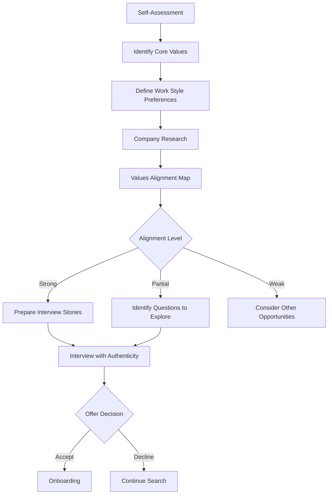
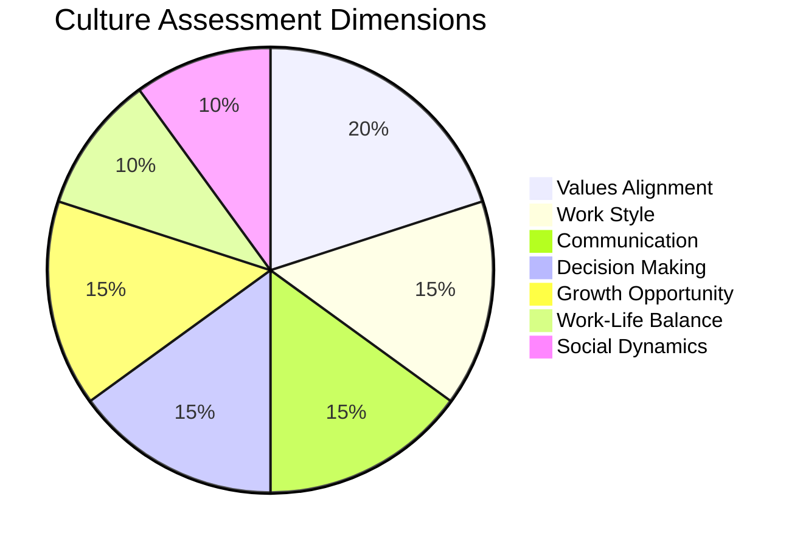

# 101 - Culture Fit

## Introduction

Culture fit is one of the most important yet often misunderstood aspects of the interview process. It refers to how well a candidate's values, behaviors, and work style align with the company's culture and the specific team they'll be joining. While technical skills determine if you *can* do the job, culture fit determines if you'll *thrive* doing it. Companies increasingly recognize that hiring for culture fit leads to better retention, higher engagement, and stronger team performance. This comprehensive guide covers every dimension of culture fit assessment, from researching company culture to demonstrating alignment during interviews, and even evaluating whether a company's culture is right for you.

Culture fit isn't about being a "mini-me" of existing team members - it's about shared values and complementary working styles. A strong culture fit means you'll be energized by the company's mission, comfortable with its communication norms, and aligned with its approach to problem-solving. This guide will help you both demonstrate culture fit in interviews and assess whether a company truly matches what you're looking for.

---

## Learning Roadmap

```
Phase 1: Self-Assessment (Week 1)
  ├── Identify your core values and non-negotiables
  ├── Define your ideal work environment
  ├── Assess your communication and collaboration style
  └── Understand your adaptability spectrum

Phase 2: Company Research (Week 2)
  ├── Study company mission, vision, and values
  ├── Read Glassdoor and Blind reviews
  ├── Analyze company social media and blog
  ├── Connect with current/former employees
  └── Review company culture deck or handbook

Phase 3: Alignment Mapping (Week 3)
  ├── Map your values to company values
  ├── Identify potential friction points
  ├── Prepare examples demonstrating alignment
  └── Develop questions about culture

Phase 4: Interview Preparation (Week 4)
  ├── Practice culture fit answers
  ├── Prepare culture-related questions
  ├── Role-play with peers
  └── Refine based on feedback
```

---

## Theory Notes

### What is Company Culture?

Company culture encompasses the shared values, beliefs, attitudes, and behaviors that shape how people within an organization interact and work together. It includes:

- **Values and Mission**: What the company stands for and believes in
- **Communication Norms**: How information flows (formal vs informal, synchronous vs async)
- **Decision-Making Style**: Top-down, consensus-driven, data-informed, gut-based
- **Work-Life Expectations**: Hours, flexibility, remote-first vs office-first
- **Risk Tolerance**: How much failure is accepted and encouraged
- **Feedback Culture**: How performance feedback is given and received
- **Hierarchy**: Flat vs hierarchical, title-focused vs role-focused
- **Social Dynamics**: Team bonding, social events, personal relationships at work

### Types of Company Culture

#### 1. Adhocracy Culture (Dynamic/Innovative)
- **Characteristics**: Risk-taking, innovation-focused, entrepreneurial
- **Examples**: Startups, innovation labs, R&D divisions
- **Best For**: Creative problem-solvers who thrive in ambiguity
- **Interview Signals**: Questions about past innovations, comfort with failure

#### 2. Market Culture (Competitive/Results-Driven)
- **Characteristics**: Goal-oriented, competitive, achievement-focused
- **Examples**: Sales organizations, trading firms, high-growth tech
- **Best For**: Driven individuals who are motivated by targets
- **Interview Signals**: Questions about targets, metrics, winning

#### 3. Clan Culture (Collaborative/Family-like)
- **Characteristics**: Team-oriented, mentoring, participation-focused
- **Examples**: Non-profits, some startups, consulting firms
- **Best For**: People who value relationships and teamwork
- **Interview Signals**: Questions about teamwork, mentoring, community

#### 4. Hierarchy Culture (Structured/Process-Oriented)
- **Characteristics**: Process-driven, stability-focused, rule-following
- **Examples**: Government agencies, banks, large enterprises
- **Best For**: People who prefer clear structures and processes
- **Interview Signals**: Questions about processes, compliance, consistency

### Culture Fit vs Culture Add

| Aspect | Culture Fit | Culture Add |
|--------|------------|-------------|
| Definition | Matches existing culture | Adds new perspectives while aligning with core values |
| Risk | Can lead to homogeneity | Promotes diversity of thought |
| Focus | Similarity | Complementary differences |
| Interview Goal | Show alignment | Show alignment + unique perspective |
| Best Practice | Demonstrate both | Demonstrate both |

---

## Key Concepts

### The Culture Fit Assessment Framework

Companies typically evaluate culture fit across these dimensions:

#### 1. Values Alignment
- Does the candidate share the company's core values?
- Can they articulate why those values matter to them?
- Do their personal values naturally align or are they forcing it?

#### 2. Work Style Compatibility
- How do they prefer to work (autonomous vs collaborative)?
- How do they handle ambiguity and change?
- What's their communication preference (written vs verbal, formal vs casual)?

#### 3. Team Dynamics
- How do they handle conflict?
- Are they comfortable giving and receiving feedback?
- Do they prefer stable teams or rotating projects?

#### 4. Growth Orientation
- Are they committed to continuous learning?
- Do they seek challenges or prefer comfort?
- How do they respond to stretch assignments?

#### 5. Mission Connection
- Are they genuinely passionate about the company's mission?
- Can they articulate why this mission matters to them personally?
- Will they be motivated by the mission during difficult times?

### Red Flags in Culture Fit Assessment

**From the Candidate Side:**
- Inability to articulate why they want to work at the company specifically
- Negative comments about previous employers' culture
- Inconsistent answers about values
- Resistance to the company's way of working
- Overemphasis on compensation over mission

**From the Company Side (What You Should Watch For):**
- Vague or inconsistent values messaging
- High turnover rates (check Glassdoor)
- "We're like a family" without boundaries
- Pressure to work extreme hours without acknowledgment
- Lack of diversity in leadership

---

## FAQ (20+ Q&A)

### Q1: What exactly is culture fit in an interview?
**A:** Culture fit is the assessment of whether your values, work style, and behaviors align with the company's culture and team dynamics. It's evaluated through behavioral questions, your questions to the interviewer, and how you interact during the process.

### Q2: Is culture fit just an excuse for discrimination?
**A:** Legitimate culture fit assessment focuses on values and work style alignment. When misused as "would I want to have a beer with this person," it can lead to bias. Best-practice companies use structured culture interviews with specific criteria to avoid this.

### Q3: How do I research a company's culture?
**A:** Check their careers page for values, read Glassdoor/Blind reviews, analyze their social media, look at their blog content, talk to current/former employees, and observe how interviewers behave during your process.

### Q4: Should I change my personality to fit a company's culture?
**A:** No. You should demonstrate authentic alignment where it exists. If you have to fundamentally change who you are, it's likely not the right fit. Companies also value culture add - new perspectives that complement existing culture.

### Q5: What questions indicate a company values culture fit?
**A:** Questions like "Tell me about a time you disagreed with your team's approach," "What kind of work environment helps you do your best work," and "How do you handle feedback?"

### Q6: Can I be rejected purely for culture fit?
**A:** Yes, companies do reject candidates who don't align with their culture, even if technically qualified. This is why culture preparation is as important as technical preparation.

### Q7: How do I demonstrate culture fit without being fake?
**A:** Research the company deeply, identify genuine connections between your values and theirs, and share authentic stories that naturally demonstrate alignment. Never fabricate alignment.

### Q8: What's the difference between culture fit and culture add?
**A:** Culture fit is matching existing culture. Culture add is bringing unique perspectives while still aligning with core values. The best companies hire for both.

### Q9: How do I handle culture fit questions when I don't have direct experience?
**A:** Draw from any experience - volunteer work, personal projects, academic teams, community involvement. Culture fit signals exist everywhere, not just in professional settings.

### Q10: What if I'm interviewing at a company whose culture I'm unsure about?
**A:** Use the interview process to learn about their culture. Ask pointed questions. It's as much your interview of them as their interview of you.

### Q11: Do remote companies assess culture fit differently?
**A:** Yes. They focus more on written communication, self-motivation, async collaboration, comfort with isolation, and ability to build relationships remotely.

### Q12: How important is culture fit compared to technical skills?
**A:** It varies by company, but typically 20-40% of the hiring decision. Some companies weight it even higher for leadership roles.

### Q13: What's a culture fit interview round typically like?
**A:** Usually 30-45 minutes of behavioral questions focused on values, work style, conflict resolution, and team collaboration. May include meeting potential team members.

### Q14: Should I ask about culture during interviews?
**A:** Absolutely. Asking thoughtful culture questions shows you care about fit and helps you make an informed decision. It's a positive signal to interviewers.

### Q15: How do startup and enterprise culture differ?
**A:** Startups typically offer more autonomy, faster pace, less structure, and broader responsibilities. Enterprises offer more structure, process, stability, and specialized roles.

### Q16: What if my values conflict with a company's stated values?
**A:** This is important to identify early. If there's a fundamental values misalignment, the role likely won't be satisfying long-term, regardless of compensation.

### Q17: Can culture fit change over time?
**A:** Yes. Both your preferences and company culture evolve. What's a good fit now might not be in 3 years. Regular self-assessment is important.

### Q18: How do I handle culture fit questions when switching industries?
**A:** Focus on universal culture elements: how you work with others, handle pressure, approach problems. Emphasize transferable cultural strengths.

### Q19: Do different roles have different culture fit requirements?
**A:** Yes. Leadership roles require stronger alignment with strategic values. IC roles may focus more on collaboration style. Customer-facing roles need alignment with customer-centric values.

### Q20: What if I'm great technically but keep failing culture fit rounds?
**A:** Seek feedback specifically about culture fit. Consider whether you're authentic in your responses, whether you've researched the company enough, or whether you're targeting companies whose culture genuinely matches yours.

### Q21: How do I demonstrate culture fit in a virtual interview?
**A:** Be punctual, maintain eye contact with the camera, show enthusiasm, have a professional background, dress appropriately for the company's style, and engage actively in conversation.

---

## Hands-on Practice

### Exercise 1: Personal Values Inventory
Write down your top 10 personal values (e.g., autonomy, collaboration, innovation, stability). Rank them. For each value, describe what it looks like in practice at work.

### Exercise 2: Company Culture Audit
Pick 3 companies you're interested in. Research their culture deeply:
- Mission and values statements
- 10 Glassdoor reviews (positive and negative)
- LinkedIn posts from employees
- Blog posts and social media tone
- Interview process descriptions from candidates

### Exercise 3: Values Alignment Map
Create a Venn diagram comparing your values with a target company's values. Identify overlap (alignment), unique to you (potential culture add), and unique to them (potential friction).

### Exercise 4: Culture Questions Bank
Write 10 thoughtful questions about company culture that you'd ask during interviews. Test them on peers to see if they sound natural and insightful.

### Exercise 5: Mock Culture Interview
Practice with a friend who asks culture-focused questions. Record yourself and evaluate:
- Are your answers authentic?
- Do they demonstrate the claimed values?
- Are you specific enough?

---

## FAANG Questions

### Amazon Culture Fit Questions
1. Tell me about a time you had to work with someone whose work style was very different from yours.
2. Describe a situation where you had to adapt to a major change in how your team operated.
3. Give an example of when you had to prioritize between speed and thoroughness.
4. Tell me about a time you received feedback that was hard to hear. How did you respond?

### Google Culture Fit Questions
5. Tell me about a time you challenged the status quo.
6. How do you handle working on projects with ambiguous requirements?
7. Describe a time when you helped create a more inclusive environment.

### Meta Culture Fit Questions
8. Tell me about a time you moved fast and broke something. What did you learn?
9. How do you balance shipping quickly with maintaining code quality?
10. Describe your ideal work environment.

### Apple Culture Fit Questions
11. Tell me about a project where you refused to compromise on quality.
12. How do you approach collaboration with teams that have different priorities?

### Microsoft Culture Fit Questions
13. Describe a time you had to grow through a growth mindset challenge.
14. How do you approach learning a completely new technology?

### Netflix Culture Fit Questions
15. Tell me about a time you made a decision that wasn't popular but was right.
16. How do you handle working with highly talented but difficult colleagues?

### Stripe Culture Fit Questions
17. Describe a time you improved a process that everyone thought was fine.
18. How do you approach writing documentation?

---

## Common Mistakes

### Mistake 1: Being Generic
**Wrong**: "I'm a team player who works hard."
**Right**: "I believe in the power of diverse perspectives. In my last role, I主动ively sought out opinions from engineers, designers, and QA before making architectural decisions, which led to..."

### Mistake 2: Researching Only the Company, Not Yourself
Many candidates research the company but fail to introspect on their own values and preferences. Know yourself first.

### Mistake 3: Pretending to Be Something You're Not
If you're an introvert at a company that values extroversion, pretending will only lead to unhappiness. Authentic assessment benefits both you and the company.

### Mistake 4: Ignoring Negative Signals
If interviewers seem disengaged, if the office feels tense, or if answers about culture seem rehearsed, pay attention. These are data points.

### Mistake 5: Not Asking Culture Questions
Failing to ask about culture signals that you don't care about fit, or that you'll accept anything. It's a missed opportunity for both parties.

### Mistake 6: Focusing Only on Perks
Culture isn't about free snacks and ping pong tables. It's about how decisions are made, how people treat each other, and what's valued.

### Mistake 7: Assuming All Teams Have the Same Culture
Large companies often have vastly different cultures between teams. Ask about the specific team you'd be joining.

### Mistake 8: Not Following Up on Red Flags
If something concerns you during the interview process, ask about it directly. Better to know now than after accepting an offer.

---

## Best Practices

1. **Start With Self-Awareness**: Know your own values before researching companies
2. **Research Deeply**: Go beyond the careers page - read reviews, talk to people, observe
3. **Ask Authentic Questions**: Show genuine curiosity about culture
4. **Prepare Stories**: Have specific examples demonstrating your cultural alignment
5. **Be Honest**: Authenticity is more valuable than pretending
6. **Evaluate Reciprocally**: Use interviews to assess the company's culture too
7. **Consider the Team**: Company culture and team culture can differ significantly
8. **Think Long-Term**: Will this culture still work for you in 2-3 years?
9. **Seek Diverse Perspectives**: Talk to people at different levels and tenures
10. **Trust Your Gut**: If something feels off, investigate further

---

## Cheat Sheet

```
CULTURE FIT CHEAT SHEET
=======================

CULTURE DIMENSIONS TO ASSESS:
□ Values and Mission
□ Communication Style (formal/informal, sync/async)
□ Decision Making (top-down/consensus/data-driven)
□ Risk Tolerance (cautious/aggressive)
□ Feedback Culture (direct/diplomatic)
□ Work-Life Balance
□ Hierarchy (flat/structured)
□ Social Dynamics (reserved/social)
□ Growth Opportunities
□ Diversity & Inclusion

RESEARCH CHECKLIST:
□ Company website (values, mission, blog)
□ Glassdoor reviews (10+ recent)
□ Blind discussions
□ LinkedIn employee posts
□ News articles
□ Current/former employee conversations
□ Interview process observations

RED FLAGS:
⚠ High turnover rates
⚠ Vague or inconsistent values
⚠ "We're a family" without boundaries
⚠ Pressure to work extreme hours
⚠ Lack of diversity in leadership
⚠ Negative Glassdoor consensus
⚠ Interviewers seem unhappy
⚠ No questions about YOUR preferences

GREEN FLAGS:
✅ Consistent values messaging
✅ Employees speak positively
✅ Clear growth paths
✅ Diverse leadership
✅ Work-life balance emphasized
✅ Learning culture
✅ Transparent communication
✅ Interviewers excited about company
```

---

## Flash Cards (20)

### Card 1
**Q:** What are the four types of company culture?
**A:** Adhocracy (innovative), Market (competitive), Clan (collaborative), Hierarchy (structured).

### Card 2
**Q:** What's the difference between culture fit and culture add?
**A:** Culture fit is matching existing culture; culture add is bringing unique perspectives while aligning with core values.

### Card 3
**Q:** Name 3 ways to research a company's culture.
**A:** Glassdoor reviews, employee LinkedIn posts, talking to current/former employees.

### Card 4
**Q:** What's a red flag in company culture assessment?
**A:** High turnover rates, "we're a family" language without boundaries, pressure for extreme hours.

### Card 5
**Q:** How do remote companies assess culture fit differently?
**A:** They focus on written communication, self-motivation, async collaboration, and comfort with remote work.

### Card 6
**Q:** What percentage of hiring decisions typically involves culture fit?
**A:** 20-40%, varies by company and role level.

### Card 7
**Q:** Should you change your personality for culture fit?
**A:** No. Demonstrate authentic alignment. If you must fundamentally change, it's likely not the right fit.

### Card 8
**Q:** What culture question should you always ask in interviews?
**A:** Ask about the specific team's culture, how decisions are made, and what a typical day looks like.

### Card 9
**Q:** How do startup and enterprise cultures differ?
**A:** Startups: more autonomy, faster pace, less structure. Enterprises: more process, stability, specialized roles.

### Card 10
**Q:** What's the most common culture fit interview format?
**A:** 30-45 minute behavioral interview focused on values, work style, and team collaboration.

### Card 11
**Q:** Why is self-assessment important before culture fit interviews?
**A:** You need to know your own values before you can authentically demonstrate alignment with a company's values.

### Card 12
**Q:** What's a green flag in company culture?
**A:** Consistent values messaging, employees speaking positively, diverse leadership, work-life balance emphasized.

### Card 13
**Q:** How should you handle conflicting values during an interview?
**A:** Be honest about the tension and explore it. It's better to identify misalignment early than to hide it.

### Card 14
**Q:** What's the best way to prepare culture fit stories?
**A:** Draw from any experience (work, volunteer, personal) that demonstrates values alignment with the target company.

### Card 15
**Q:** Can culture fit questions appear in technical interviews?
**A:** Yes, through how you collaborate during pair programming, how you explain your thought process, and how you handle feedback.

### Card 16
**Q:** What does "culture add" mean for diversity?
**A:** It means hiring people who bring different perspectives and experiences while still aligning with core values, preventing homogeneity.

### Card 17
**Q:** How do you demonstrate culture fit in a 30-minute interview?
**A:** Through specific examples, genuine enthusiasm, thoughtful questions, and authentic interaction with interviewers.

### Card 18
**Q:** What's the danger of hiring purely for culture fit?
**A:** It can lead to homogeneity, groupthink, and lack of diverse perspectives. Best companies balance fit with add.

### Card 19
**Q:** Should you mention culture concerns during an interview?
**A:** Yes, professionally. Asking about potential concerns shows thoughtfulness and helps you make an informed decision.

### Card 20
**Q:** How often should you reassess your culture preferences?
**A:** At least annually, and before any major career move. Your preferences evolve as you grow.

---

## Mind Map

```
                    CULTURE FIT
                       |
        ┌──────────────┼──────────────┐
        |              |              |
   SELF-ASSESS    COMPANY RESEARCH  INTERVIEW
        |              |              |
   ┌────┴────┐    ┌────┴────┐    ┌────┴────┐
   |         |    |         |    |         |
 Values  Work   Values  Reviews  Stories Questions
 Style  Preferences Mission Glassdoor Examples
                                    Alignment
```

---

## Mermaid Diagrams

### Culture Fit Assessment Process


### Culture Dimensions Wheel


---

## Code Examples

```python
# Culture Fit Assessment Tool

class CompanyCulture:
    def __init__(self, name):
        self.name = name
        self.dimensions = {
            "innovation": 0,      # 1=conservative, 10=innovative
            "structure": 0,       # 1=flat, 10=hierarchical
            "pace": 0,            # 1=stable, 10=fast-moving
            "collaboration": 0,   # 1=individual, 10=team-based
            "risk_tolerance": 0,  # 1=risk-averse, 10=risk-taking
            "feedback_style": 0,  # 1=diplomatic, 10=direct
            "work_life": 0,       # 1=work-first, 10=balanced
            "autonomy": 0         # 1=guided, 10=autonomous
        }
    
    def set_dimensions(self, **kwargs):
        for key, value in kwargs.items():
            if key in self.dimensions:
                self.dimensions[key] = value

class PersonalPreferences:
    def __init__(self):
        self.preferences = {
            "innovation": 5,
            "structure": 5,
            "pace": 5,
            "collaboration": 5,
            "risk_tolerance": 5,
            "feedback_style": 5,
            "work_life": 5,
            "autonomy": 5
        }
    
    def set_preferences(self, **kwargs):
        for key, value in kwargs.items():
            if key in self.preferences:
                self.preferences[key] = value

def calculate_culture_fit(company, person, weights=None):
    """Calculate culture fit score between a person and company."""
    if weights is None:
        weights = {k: 1.0 for k in company.dimensions}
    
    total_score = 0
    total_weight = 0
    details = {}
    
    for dimension in company.dimensions:
        company_val = company.dimensions[dimension]
        person_val = person.preferences[dimension]
        weight = weights.get(dimension, 1.0)
        
        # Calculate alignment (lower difference = better fit)
        difference = abs(company_val - person_val)
        alignment = 10 - difference  # 10 = perfect fit, 0 = worst
        
        details[dimension] = {
            "company": company_val,
            "person": person_val,
            "difference": difference,
            "alignment": alignment
        }
        
        total_score += alignment * weight
        total_weight += weight
    
    overall_score = total_score / total_weight if total_weight > 0 else 0
    return overall_score, details

def generate_culture_report(company_name, company_dims, person_prefs):
    """Generate a comprehensive culture fit report."""
    company = CompanyCulture(company_name)
    company.set_dimensions(**company_dims)
    
    person = PersonalPreferences()
    person.set_preferences(**person_prefs)
    
    score, details = calculate_culture_fit(company, person)
    
    print(f"\n{'='*60}")
    print(f"CULTURE FIT REPORT: {company_name}")
    print(f"{'='*60}")
    print(f"Overall Fit Score: {score:.1f}/10")
    print(f"\n{'Dimension':<20} {'Company':>8} {'You':>8} {'Fit':>8}")
    print(f"{'-'*44}")
    
    strengths = []
    concerns = []
    
    for dim, data in sorted(details.items(), key=lambda x: x[1]['alignment']):
        fit_indicator = "✓" if data['alignment'] >= 7 else ("~" if data['alignment'] >= 4 else "✗")
        print(f"{dim.replace('_', ' ').title():<20} {data['company']:>8} {data['person']:>8} {fit_indicator:>8}")
        
        if data['alignment'] >= 7:
            strengths.append(dim.replace('_', ' ').title())
        elif data['alignment'] <= 3:
            concerns.append(dim.replace('_', ' ').title())
    
    print(f"\nStrengths: {', '.join(strengths) if strengths else 'None identified'}")
    print(f"Concerns: {', '.join(concerns) if concerns else 'None identified'}")
    
    if score >= 8:
        print("\nRecommendation: Strong culture fit. Proceed with confidence.")
    elif score >= 6:
        print("\nRecommendation: Good fit with some areas to discuss. Explore during interviews.")
    elif score >= 4:
        print("\nRecommendation: Moderate fit. Ask detailed questions about concerning areas.")
    else:
        print("\nRecommendation: Potential misalignment. Consider carefully before proceeding.")
    
    return score, details

# Example usage
generate_culture_report(
    "TechCorp",
    company_dims={
        "innovation": 8, "structure": 3, "pace": 9,
        "collaboration": 7, "risk_tolerance": 7, "feedback_style": 8,
        "work_life": 5, "autonomy": 8
    },
    person_prefs={
        "innovation": 7, "structure": 4, "pace": 8,
        "collaboration": 6, "risk_tolerance": 6, "feedback_style": 7,
        "work_life": 6, "autonomy": 9
    }
)
```

---

## Projects

### Project 1: Culture Fit Assessment Dashboard
Build a web application that:
- Stores your personal work preferences
- Allows input of company culture data
- Calculates fit scores across multiple dimensions
- Generates visual reports (radar charts, bar graphs)
- Tracks how your preferences change over time

### Project 2: Company Culture Research Bot
Create a tool that:
- Scrapes Glassdoor reviews for a company
- Analyzes sentiment and themes
- Extracts culture-related keywords
- Generates a culture summary report
- Compares multiple companies side by side

---

## Resources

### Books
- "The Culture Code" by Daniel Coyle
- "Organizational Culture and Leadership" by Edgar Schein
- "Culture Map" by Erin Meyer
- "Drive" by Daniel Pink

### Online Tools
- [Glassdoor](https://www.glassdoor.com) - Company reviews and culture insights
- [Blind](https://www.teamblind.com) - Anonymous employee discussions
- [Comparably](https://www.comparably.com) - Culture ratings and comparisons
- [O*NET](https://www.onetonline.org) - Work value assessments

### Assessment Tools
- Myers-Briggs Type Indicator (MBTI)
- CliftonStrengths Assessment
- Enneagram
- DISC Assessment

---

## Checklist

- [ ] Completed personal values inventory
- [ ] Identified top 5 non-negotiable values
- [ ] Researched target companies' cultures deeply
- [ ] Read 10+ Glassdoor reviews per company
- [ ] Talked to at least 1 current/former employee
- [ ] Created values alignment map
- [ ] Prepared 5+ culture fit stories
- [ ] Developed 10 thoughtful culture questions
- [ ] Practiced culture fit interview with peers
- [ ] Assessed remote/hybrid culture compatibility
- [ ] Identified potential red flags in target companies
- [ ] Prepared questions about team-specific culture
- [ ] Reflected on past culture misalignment experiences
- [ ] Created company culture comparison document
- [ ] Established personal culture evaluation criteria

---

## Revision Plans

### 1-Week Culture Fit Preparation
- **Day 1**: Personal values inventory and ranking
- **Day 2**: Research top 3 target companies
- **Day 3**: Create values alignment maps
- **Day 4**: Prepare culture fit stories (5 minimum)
- **Day 5**: Develop culture questions for interviews
- **Day 6**: Mock culture fit interview with peer
- **Day 7**: Review and refine approach

### Ongoing Culture Assessment
- Monthly: Review if your values have shifted
- Before interviews: Deep research on specific company
- After interviews: Note culture signals observed
- Quarterly: Evaluate current job's culture alignment

---

## Mock Interviews

### Culture Fit Mock Interview Script

**Interviewer Questions (practice with a partner):**

1. "What kind of work environment brings out your best performance?"
2. "Tell me about a time you disagreed with a team decision. What did you do?"
3. "How do you prefer to receive feedback?"
4. "Describe a situation where you had to adapt to a significant change."
5. "What motivates you to do your best work?"
6. "Tell me about a time you helped improve a team's culture or process."
7. "How do you handle working under pressure with tight deadlines?"
8. "What's your approach to work-life balance?"

**Evaluation Criteria:**
- Authenticity of responses
- Specificity of examples
- Alignment with stated company values
- Self-awareness demonstrated
- Quality of questions asked by candidate

---

## Difficulty Rating

| Aspect | Rating (1-10) | Notes |
|--------|---------------|-------|
| Research Required | 6/10 | Moderate depth needed |
| Self-Awareness Needed | 8/10 | Requires genuine introspection |
| Authenticity Challenge | 7/10 | Hard to fake, hard to articulate |
| Preparation Time | 5/10 | Less than technical prep |
| Unpredictability | 6/10 | Can't predict exact questions |
| Overall Difficulty | 6/10 | Requires emotional intelligence |

---

## Summary

Culture fit is a critical component of the interview process that assesses alignment between your values, work style, and behaviors with a company's culture. Success requires deep self-awareness, thorough company research, and authentic storytelling. Remember that culture fit is a two-way evaluation - you're assessing the company as much as they're assessing you. Focus on genuine alignment rather than trying to be what you think they want. The best outcomes happen when both the company and the candidate are honest about their values and expectations. Take the time to understand yourself, research companies deeply, and approach culture fit conversations with authenticity and curiosity.
