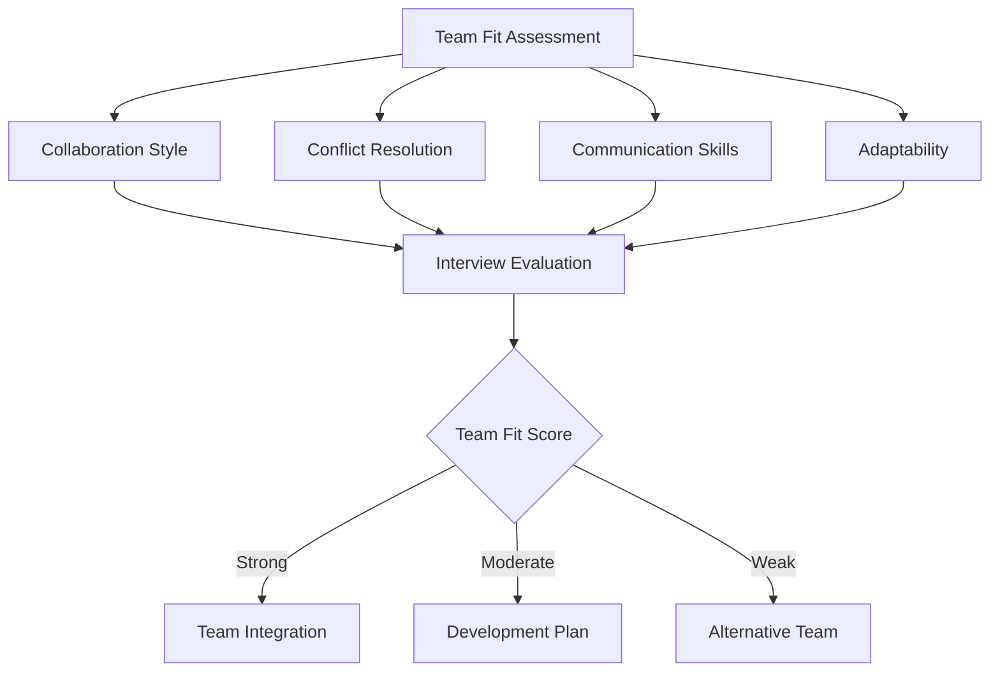
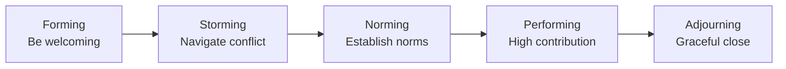

# 102 - Team Fit

## Introduction

Team fit assessment evaluates how well you'll integrate into and contribute to a specific team's dynamics, workflows, and interpersonal relationships. Unlike culture fit, which is organization-wide, team fit is specific to the group you'll be working with daily. A strong team fit means you can collaborate effectively, handle conflicts constructively, complement existing team members' strengths, and contribute to a positive team environment. This guide covers everything from understanding team dynamics to demonstrating your ability to be an effective team member across various scenarios.

The importance of team fit cannot be overstated. Research consistently shows that team composition and dynamics are among the strongest predictors of project success, individual satisfaction, and retention. Companies invest heavily in assessing team fit because a bad hire doesn't just affect one person - it can disrupt an entire team's productivity and morale. This guide provides comprehensive strategies for both demonstrating team fit during interviews and evaluating whether a particular team is the right environment for you.

---

## Learning Roadmap

```
Week 1: Understanding Team Dynamics
  ├── Study team composition theories
  ├── Learn about Belbin team roles
  ├── Understand Tuckman's stages of group development
  └── Assess your own team-working style

Week 2: Self-Assessment
  ├── Identify your collaboration preferences
  ├── Assess conflict resolution style
  ├── Determine your communication patterns
  └── Evaluate your mentoring approach

Week 3: Story Development
  ├── Create STAR stories for team scenarios
  ├── Cover: collaboration, conflict, mentoring, leadership
  ├── Practice articulating your team contributions
  └── Develop examples of cross-functional teamwork

Week 4: Interview Preparation
  ├── Practice team fit questions
  ├── Prepare questions to ask about team dynamics
  ├── Role-play team scenarios
  └── Refine based on feedback
```

---

## Theory Notes

### Team Dynamics Frameworks

#### Tuckman's Stages of Group Development
1. **Forming**: Team members are polite, getting to know each other
2. **Storming**: Conflicts arise as opinions differ and work styles clash
3. **Norming**: Team establishes norms and begins working effectively
4. **Performing**: Team reaches high performance with minimal supervision
5. **Adjourning**: Team dissolves after project completion

Understanding these stages helps you demonstrate awareness of where a team is and how you can contribute at each stage.

#### Belbin Team Roles
- **Plant**: Creative, imaginative, generates ideas
- **Resource Investigator**: Extrovert, enthusiastic, explores opportunities
- **Coordinator**: Mature, confident, clarifies goals
- **Shaper**: Challenging, dynamic, thrives under pressure
- **Monitor Evaluator**: Sober, strategic, discerning
- **Teamworker**: Cooperative, perceptive, diplomatic
- **Implementer**: Disciplined, reliable, efficient
- **Completer Finisher**: Painstaking, conscientious, anxious
- **Specialist**: Knowledgeable, single-minded, self-starting

#### Patrick Lencioni's Five Dysfunctions of a Team
1. **Absence of Trust**: Team members won't be vulnerable with each other
2. **Fear of Conflict**: Team avoids healthy debate
3. **Lack of Commitment**: Team doesn't buy into decisions
4. **Avoidance of Accountability**: Team members don't hold each other accountable
5. **Inattention to Results**: Team focuses on individual status over collective success

### Collaboration Styles

#### Thomas-Kilmann Conflict Mode Instrument
- **Competing**: Assertive and uncooperative (win-lose)
- **Collaborating**: Assertive and cooperative (win-win)
- **Compromising**: Moderate assertiveness and cooperativeness
- **Avoiding**: Unassertive and uncooperative (lose-lose)
- **Accommodating**: Unassertive and cooperative (lose-win)

The best team members can adapt their style based on the situation.

---

## Key Concepts

### Team Contribution Types

#### 1. Technical Contribution
- Writing clean, maintainable code
- Code reviews that improve team standards
- Knowledge sharing through documentation
- Mentoring junior developers
- Leading technical decisions

#### 2. Process Contribution
- Improving team workflows
- Introducing best practices
- Streamlining communication
- Reducing bottlenecks
- Enhancing team productivity

#### 3. Cultural Contribution
- Setting positive tone
- Supporting team members
- Celebrating wins
- Handling setbacks constructively
- Promoting inclusivity

#### 4. Strategic Contribution
- Aligning team work with goals
- Identifying opportunities
- Challenging assumptions constructively
- Bringing outside perspectives
- Driving innovation

### Cross-Functional Teamwork

Working with people from different disciplines requires:
- **Empathy**: Understanding others' perspectives and constraints
- **Translation**: Converting technical concepts for non-technical stakeholders
- **Patience**: Allowing different working styles
- **Flexibility**: Adapting your approach based on the audience
- **Shared Goals**: Finding common ground despite different priorities

### Mentoring and Being Mentored

#### As a Mentor:
- Active listening without immediately offering solutions
- Asking questions that promote self-discovery
- Sharing experiences without being prescriptive
- Setting clear expectations and boundaries
- Providing constructive feedback regularly

#### As a Mentee:
- Coming prepared with specific questions
- Being open to feedback and challenging perspectives
- Following through on commitments
- Respecting the mentor's time
- Building a two-way relationship

---

## FAQ (20+ Q&A)

### Q1: What's the difference between culture fit and team fit?
**A:** Culture fit is about alignment with the entire organization's values. Team fit is about how you'll work with the specific people on your team. You can have good culture fit but poor team fit if your working style clashes with the team's dynamics.

### Q2: How do companies assess team fit?
**A:** Through behavioral questions about collaboration, conflict resolution, and teamwork. Some companies include team lunches, pair programming sessions, or meet-the-team interviews as part of the process.

### Q3: What if I'm an introvert on an extroverted team?
**A:** Introverts bring valuable qualities like deep thinking, careful analysis, and written communication. Show how your introverted style complements the team rather than trying to be someone you're not.

### Q4: How do I demonstrate team fit without working with the team yet?
**A:** Use examples from previous teams, show enthusiasm about the team's work, ask thoughtful questions about team dynamics, and demonstrate adaptability through your interview interactions.

### Q5: Can team fit be more important than technical skills?
**A:** In some cases, yes. A technically strong individual who disrupts team dynamics can be more harmful than a slightly less technical person who elevates the entire team. The best candidates have both.

### Q6: How do I handle conflict in team fit questions?
**A:** Show that you handle conflict constructively: acknowledge the disagreement, describe how you sought to understand all perspectives, explain the resolution approach, and share what you learned.

### Q7: What if I don't know anyone on the team?
**A:** Use questions during the interview to learn about the team. Ask about team composition, communication styles, and recent projects. Show genuine curiosity and adaptability.

### Q8: How do remote teams assess team fit differently?
**A:** They focus on written communication, async collaboration skills, self-motivation, and ability to build relationships without in-person interaction. Virtual team activities may be part of the process.

### Q9: What's the best way to ask about team dynamics in an interview?
**A:** Ask specific questions like "How does the team handle disagreements?", "What's the typical communication style?", or "How are decisions made on the team?"

### Q10: How do I show I can work with different personality types?
**A:** Give examples of successfully collaborating with diverse personalities. Show adaptability and mention what you've learned from working with different styles.

### Q11: What if I prefer working alone?
**A:** Acknowledge this preference while showing you can collaborate effectively when needed. Many roles offer a balance of independent and collaborative work.

### Q12: How important is team chemistry?
**A:** Very important. Teams with good chemistry are more productive, innovative, and enjoyable to work with. However, chemistry can develop over time with the right people.

### Q13: Should I try to match the team's energy level?
**A:** You should be authentic while showing you can adapt. Being yourself is important, but being flexible in your approach shows maturity.

### Q14: How do I handle a team that seems dysfunctional?
**A:** Focus on what you can contribute positively. Ask about team improvements and show how you've helped improve team dynamics in the past.

### Q15: What's the role of emotional intelligence in team fit?
**A:** High emotional intelligence helps you read social cues, manage relationships, handle conflict, and contribute positively to team morale. It's one of the most important team fit indicators.

### Q16: How do I demonstrate leadership on a team?
**A:** Show examples of taking initiative, mentoring others, driving decisions, and leading by example - without needing a formal leadership title.

### Q17: What if I'm joining a team as the most experienced person?
**A:** Show humility while demonstrating how you'll elevate the team. Focus on mentoring, knowledge sharing, and creating an environment where everyone can grow.

### Q18: How do I handle team fit when the team is new/unformed?
**A:** Show comfort with ambiguity and ability to help establish team norms. Give examples of helping form teams or improving team processes.

### Q19: Can poor team fit be fixed?
**A:** Sometimes. Open communication, adjusting working styles, and building relationships can improve team dynamics. But fundamental personality clashes are harder to resolve.

### Q20: How do I show I'm a team player without being a pushover?
**A:** Give examples of standing up for the team's needs, advocating for quality, pushing back constructively, and maintaining your professional boundaries while being collaborative.

### Q21: What questions reveal team health during interviews?
**A:** "How does the team handle failures?", "What's the team's biggest challenge right now?", "How are successes celebrated?", and "How does the team make decisions?"

---

## Hands-on Practice

### Exercise 1: Team Role Assessment
Take a Belbin team role assessment or similar quiz. Identify your natural team role and how you typically contribute to teams.

### Exercise 2: Conflict Resolution Scenarios
Write out 3 conflict scenarios you've experienced. For each, document:
- The situation and parties involved
- Your initial reaction
- How the conflict was resolved
- What you learned about yourself

### Exercise 3: Cross-Functional Example Development
Identify 3 examples of working with people from different disciplines. Articulate:
- What you learned from each experience
- How you adapted your communication
- The outcomes achieved

### Exercise 4: Mentoring Reflection
Document any mentoring relationships (as mentor or mentee). What made them effective? What would you do differently?

### Exercise 5: Team Contribution Story
Write a compelling STAR story about a time you made a significant positive impact on a team. Include how it affected team dynamics, productivity, or morale.

---

## FAANG Questions

### Amazon Team Fit Questions
1. Tell me about a time you had to work with a difficult team member. How did you handle it?
2. Describe a situation where you had to quickly build trust with a new team.
3. Give an example of when you helped a struggling teammate improve their performance.
4. Tell me about a time you had to adapt your working style for a team.

### Google Team Fit Questions
5. How do you handle disagreements with technical decisions made by your team lead?
6. Describe a time when your team had to make a quick decision under pressure. What was your role?
7. Tell me about a time you had to collaborate with a team in a different time zone.

### Meta Team Fit Questions
8. How do you approach code reviews from a team dynamics perspective?
9. Describe a time when you had to balance individual work with team responsibilities.
10. Tell me about your ideal team and why.

### Apple Team Fit Questions
11. How do you handle working with cross-functional teams that have competing priorities?
12. Describe a time when you had to champion a team member's idea.

### Microsoft Team Fit Questions
13. Tell me about a time you helped establish team norms or processes.
14. How do you ensure everyone's voice is heard in team discussions?

---

## Common Mistakes

### Mistake 1: Taking Credit for Team Success
**Wrong**: "I led the project and it was a huge success."
**Right**: "I took the initiative on the architecture design, which allowed the team to..."

### Mistake 2: Blaming Team Members for Failures
**Wrong**: "The project failed because the QA team missed critical bugs."
**Right**: "We missed the deadline because our testing process had gaps. I proposed improvements to catch issues earlier."

### Mistake 3: Being Too Vague About Your Role
**Wrong**: "I worked with the team to deliver the project."
**Right**: "I was responsible for the API design, coordinated with the frontend team on integration, and mentored two junior developers on the team."

### Mistake 4: Not Asking About Team Dynamics
Failing to ask about the team signals you don't care about team fit. Always ask specific questions about how the team works.

### Mistake 5: Overemphasizing Individual Achievements
While individual accomplishments matter, showing how you elevate the team is more important for team fit assessment.

### Mistake 6: Ignoring Soft Skills
Team fit is largely about soft skills. Don't focus so much on technical achievements that you neglect demonstrating emotional intelligence.

### Mistake 7: Being Inflexible
Showing rigid preferences for how you work can signal poor team fit. Demonstrate adaptability.

---

## Best Practices

1. **Show Genuine Interest**: Ask specific questions about the team during interviews
2. **Balance Individual and Team**: Show both what you can do individually and how you contribute to teams
3. **Demonstrate Adaptability**: Give examples of adjusting your style for different teams
4. **Highlight Positive Outcomes**: Focus on team successes you contributed to
5. **Acknowledge Challenges**: Be honest about difficult team situations and what you learned
6. **Show Emotional Intelligence**: Demonstrate awareness of team dynamics and interpersonal skills
7. **Be Specific**: Use concrete examples rather than general claims
8. **Ask Thoughtful Questions**: Show you care about team health and dynamics
9. **Demonstrate Growth**: Show how your team skills have evolved over time
10. **Be Authentic**: Don't pretend to be something you're not - genuine fit matters

---

## Cheat Sheet

```
TEAM FIT CHEAT SHEET
====================

KEY TEAM SKILLS:
□ Collaboration & Communication
□ Conflict Resolution
□ Adaptability to Different Styles
□ Mentoring (giving & receiving)
□ Cross-functional Teamwork
□ Emotional Intelligence
□ Constructive Feedback
□ Initiative & Ownership
□ Active Listening
□ Supporting Others' Success

TUCKMAN'S STAGES:
1. Forming → Help new members feel welcome
2. Storming → Navigate conflicts constructively
3. Norming → Establish positive norms
4. Performing → Contribute to high performance
5. Adjourning → Close projects gracefully

CONFLICT RESOLUTION APPROACHES:
• Collaborating → Win-win (best for important issues)
• Compromising → Give-and-take (good for time pressure)
• Accommodating → Yield (for minor issues)
• Competing → Assert (for urgent/safety matters)
• Avoiding → Delay (for trivial issues)

INTERVIEW QUESTIONS TO ASK:
• How does the team handle disagreements?
• What's the team's communication style?
• How are decisions made on the team?
• What's the biggest challenge the team faces?
• How does the team celebrate successes?
• What does onboarding look like?

RED FLAGS IN TEAM FIT:
⚠ Team members seem unhappy
⚠ High team turnover
⚠ No clear team structure
⚠ Lack of psychological safety
⚠ Dominant personalities that silence others
⚠ No evidence of collaboration
```

---

## Flash Cards (20)

### Card 1
**Q:** What is team fit?
**A:** How well you'll integrate into and contribute to a specific team's dynamics, workflows, and interpersonal relationships.

### Card 2
**Q:** Name Tuckman's 5 stages of group development.
**A:** Forming, Storming, Norming, Performing, Adjourning.

### Card 3
**Q:** What's the difference between team fit and culture fit?
**A:** Team fit is specific to your team; culture fit is about the entire organization.

### Card 4
**Q:** What's the best conflict resolution approach for important issues?
**A:** Collaborating - seeking a win-win solution.

### Card 5
**Q:** Name 3 types of team contributions.
**A:** Technical, Process, and Cultural contributions.

### Card 6
**Q:** What does high emotional intelligence look like in a team setting?
**A:** Reading social cues, managing relationships, handling conflict constructively, contributing to morale.

### Card 7
**Q:** How should you handle team fit questions if you're an introvert?
**A:** Show how your introverted style (deep thinking, careful analysis) complements the team rather than pretending to be extroverted.

### Card 8
**Q:** What's cross-functional teamwork?
**A:** Working with people from different disciplines, requiring empathy, translation, and flexibility.

### Card 9
**Q:** What are Lencioni's 5 dysfunctions of a team?
**A:** Absence of Trust, Fear of Conflict, Lack of Commitment, Avoidance of Accountability, Inattention to Results.

### Card 10
**Q:** How do you demonstrate leadership without a title?
**A:** Taking initiative, mentoring, driving decisions, and leading by example.

### Card 11
**Q:** What makes a good mentor?
**A:** Active listening, asking questions, sharing experiences, providing constructive feedback, and respecting boundaries.

### Card 12
**Q:** How do remote teams assess team fit?
**A:** Through written communication skills, async collaboration, self-motivation, and virtual interactions.

### Card 13
**Q:** What's a red flag in team dynamics?
**A:** Team members seem unhappy, high turnover, or lack of psychological safety.

### Card 14
**Q:** How do you balance individual work with team responsibilities?
**A:** Through clear communication, prioritization, and making time for collaboration while protecting deep work time.

### Card 15
**Q:** What questions reveal team health?
**A:** "How does the team handle failures?" and "How are successes celebrated?"

### Card 16
**Q:** Why is team chemistry important?
**A:** Teams with good chemistry are more productive, innovative, and enjoyable to work with.

### Card 17
**Q:** How do you show you're a team player without being a pushover?
**A:** Stand up for quality, advocate for the team, push back constructively, and maintain professional boundaries.

### Card 18
**Q:** What's the role of Belbin team roles?
**A:** They help understand different ways team members contribute, like Plant (ideas), Coordinator (organization), or Implementer (execution).

### Card 19
**Q:** How do you handle joining a new team?
**A:** Be curious, ask questions, build relationships, learn norms, and contribute positively from day one.

### Card 20
**Q:** Can poor team fit be improved?
**A:** Sometimes through communication and adjustment, but fundamental personality clashes are harder to resolve.

---

## Mind Map

```
                    TEAM FIT
                       |
        ┌──────────────┼──────────────┐
        |              |              |
   DYNAMICS      CONTRIBUTION     RELATIONSHIPS
        |              |              |
   ┌────┴────┐    ┌────┴────┐    ┌────┴────┐
   |         |    |         |    |         |
 Conflict  Comm  Technical Process Mentoring
 Styles    unic.  Skills  Improv.  Collab.
```

---

## Mermaid Diagrams

### Team Fit Assessment Flow


### Tuckman's Stages with Your Role


---

## Code Examples

```python
# Team Fit Assessment Framework

from enum import Enum
from dataclasses import dataclass
from typing import List, Dict

class ConflictStyle(Enum):
    COMPETING = "competing"
    COLLABORATING = "collaborating"
    COMPROMISING = "compromising"
    AVOIDING = "avoiding"
    ACCOMMODATING = "accommodating"

@dataclass
class TeamMember:
    name: str
    role: str
    strengths: List[str]
    working_style: str
    communication_preference: str
    conflict_style: ConflictStyle

@dataclass
class Team:
    name: str
    members: List[TeamMember]
    team_size: int
    meeting_frequency: str
    communication_tools: List[str]
    decision_making_style: str

class TeamFitAssessment:
    def __init__(self, team: Team, candidate_preferences: Dict):
        self.team = team
        self.preferences = candidate_preferences
        self.scores = {}
    
    def assess_communication_fit(self) -> float:
        """Assess alignment with team communication preferences."""
        team_comm = set(self.team.communication_tools)
        candidate_comm = set(self.preferences.get("communication_tools", []))
        
        overlap = len(team_comm & candidate_comm)
        total = len(team_comm | candidate_comm)
        
        return overlap / total if total > 0 else 0.5
    
    def assess_collaboration_fit(self) -> float:
        """Assess collaboration style alignment."""
        team_style = self.team.decision_making_style
        candidate_style = self.preferences.get("decision_making_style", "")
        
        style_compatibility = {
            "consensus": {"consensus": 1.0, "data-driven": 0.7, "top-down": 0.4},
            "data-driven": {"consensus": 0.7, "data-driven": 1.0, "top-down": 0.6},
            "top-down": {"consensus": 0.4, "data-driven": 0.6, "top-down": 1.0}
        }
        
        return style_compatibility.get(team_style, {}).get(candidate_style, 0.5)
    
    def assess_team_size_fit(self) -> float:
        """Assess comfort with team size."""
        team_size = self.team.team_size
        preferred_size = self.preferences.get("team_size_preference", 5)
        
        # Calculate fit based on preference alignment
        if team_size <= 5 and preferred_size <= 5:
            return 0.9
        elif team_size > 10 and preferred_size > 10:
            return 0.9
        elif 5 < team_size <= 10:
            return 0.8
        else:
            return 0.6
    
    def generate_report(self) -> Dict:
        """Generate comprehensive team fit report."""
        comm_score = self.assess_communication_fit()
        collab_score = self.assess_collaboration_fit()
        size_score = self.assess_team_size_fit()
        
        overall_score = (comm_score * 0.35 + collab_score * 0.45 + size_score * 0.20)
        
        report = {
            "overall_score": round(overall_score, 2),
            "communication_fit": round(comm_score, 2),
            "collaboration_fit": round(collab_score, 2),
            "team_size_fit": round(size_score, 2),
            "strengths": [],
            "concerns": [],
            "recommendations": []
        }
        
        # Identify strengths and concerns
        if comm_score >= 0.7:
            report["strengths"].append("Strong communication alignment")
        elif comm_score < 0.5:
            report["concerns"].append("Communication style may need adjustment")
            report["recommendations"].append("Discuss communication preferences with team")
        
        if collab_score >= 0.7:
            report["strengths"].append("Good collaboration style match")
        elif collab_score < 0.5:
            report["concerns"].append("Decision-making style differs significantly")
            report["recommendations"].append("Ask about how decisions are made on the team")
        
        return report

# Example usage
team = Team(
    name="Backend Engineering",
    members=[],
    team_size=8,
    meeting_frequency="daily standup + weekly planning",
    communication_tools=["Slack", "Jira", "GitHub", "Zoom"],
    decision_making_style="data-driven"
)

candidate_prefs = {
    "communication_tools": ["Slack", "GitHub", "Zoom"],
    "decision_making_style": "data-driven",
    "team_size_preference": 6
}

assessment = TeamFitAssessment(team, candidate_prefs)
report = assessment.generate_report()

print(f"Team Fit Assessment: {report['overall_score']}")
print(f"Strengths: {report['strengths']}")
print(f"Concerns: {report['concerns']}")
print(f"Recommendations: {report['recommendations']}")
```

---

## Projects

### Project 1: Team Dynamics Analysis Tool
Build a tool that:
- Profiles team members' working styles
- Identifies potential friction points
- Suggests collaboration strategies
- Tracks team health metrics over time

### Project 2: Conflict Resolution Simulator
Create an interactive simulation where:
- Users face realistic team conflict scenarios
- They choose resolution approaches
- The tool shows outcomes of different choices
- Users learn optimal strategies

---

## Resources

### Books
- "The Five Dysfunctions of a Team" by Patrick Lencioni
- "Team Geek" by Ben Collins-Sussman and Brian Fitzpatrick
- "The Culture Map" by Erin Meyer
- "Crucial Conversations" by Patterson, Grenny, McMillan, Switzler

### Assessments
- Belbin Team Roles
- Thomas-Kilmann Conflict Mode Instrument
- DISC Assessment
- CliftonStrengths

---

## Checklist

- [ ] Identified your natural team role (Belbin or similar)
- [ ] Assessed your conflict resolution style
- [ ] Developed 5+ team fit stories (STAR format)
- [ ] Practiced articulating your team contributions
- [ ] Prepared questions about team dynamics
- [ ] Developed examples of cross-functional teamwork
- [ ] Reflected on past team successes and challenges
- [ ] Practiced mentoring scenarios (both giving and receiving)
- [ ] Prepared to discuss conflict resolution approaches
- [ ] Identified what you look for in team dynamics
- [ ] Practiced team fit interview questions with peers
- [ ] Developed understanding of Tuckman's stages
- [ ] Created examples showing adaptability
- [ ] Prepared questions about team size and structure
- [ ] Practiced showing emotional intelligence in responses

---

## Mock Interviews

### Team Fit Mock Interview Questions

**Partner should ask:**
1. "Tell me about a time you had to collaborate with a difficult team member."
2. "Describe a situation where you had to adapt your working style for a team."
3. "How do you handle disagreements with your team lead's decisions?"
4. "Give an example of when you helped improve team dynamics."
5. "What's your approach to onboarding onto a new team?"

**Evaluation criteria:**
- Specificity of examples
- Adaptability demonstrated
- Conflict resolution skills shown
- Questions asked about the team
- Overall collaborative mindset

---

## Difficulty Rating

| Aspect | Rating (1-10) | Notes |
|--------|---------------|-------|
| Self-Awareness Required | 7/10 | Need to understand your team style |
| Story Development | 6/10 | Moderate preparation needed |
| Authenticity | 8/10 | Hard to fake genuine team skills |
| Research Required | 5/10 | Less than culture fit research |
| Interview Performance | 6/10 | Natural if you're genuinely collaborative |
| Overall Difficulty | 6/10 | Requires emotional intelligence |

---

## Summary

Team fit assessment evaluates how well you'll integrate into and contribute to a specific team. Success requires understanding team dynamics, demonstrating adaptability, and showing genuine interest in how the team works. Focus on concrete examples of collaboration, conflict resolution, and team contribution. Remember that team fit is about how you complement the team, not how you dominate it. Ask thoughtful questions about the team during interviews, show emotional intelligence, and be authentic about your working style. The best teams are diverse in skills and perspectives while aligned in values and goals - show how you contribute to that balance.
