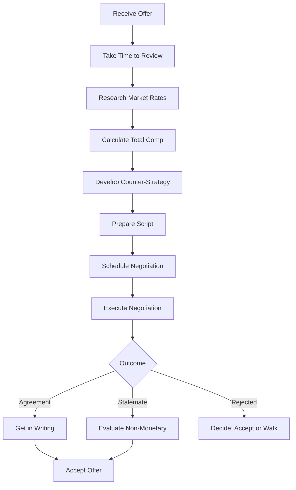
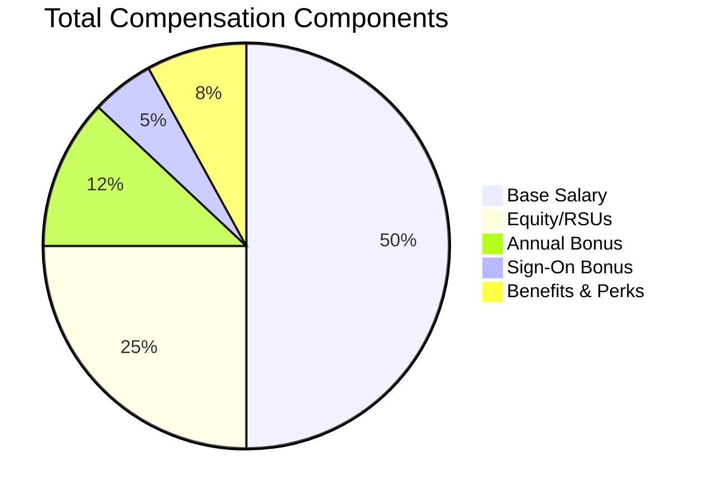

# 103 - Salary Negotiation

## Introduction

Salary negotiation is one of the most impactful skills in your career, yet it's one that most professionals feel uncomfortable with. Research shows that candidates who negotiate their compensation earn significantly more over their careers - potentially hundreds of thousands of dollars over a lifetime. Despite this, studies indicate that fewer than 40% of candidates negotiate their initial offer, and many who do leave money on the table. This comprehensive guide covers every aspect of salary negotiation, from market research and preparation to scripts, strategies, and handling counter-offers.

Effective salary negotiation isn't about being aggressive or greedy - it's about understanding your market value, communicating it clearly, and finding a mutually beneficial agreement. This guide will teach you the frameworks, scripts, and strategies that professional negotiators use, adapted specifically for tech industry compensation. Whether you're negotiating your first job offer or your tenth, the principles and tactics in this guide will help you maximize your total compensation while maintaining positive relationships.

---

## Learning Roadmap

```
Week 1: Research & Self-Assessment
  ├── Research market rates on Levels.fyi, Glassdoor
  ├── Understand total compensation components
  ├── Assess your experience and skills
  └── Determine your minimum acceptable offer

Week 2: Strategy Development
  ├── Choose your negotiation approach
  ├── Develop your BATNA (Best Alternative)
  ├── Prepare your value proposition
  └── Identify your leverage points

Week 3: Practice
  ├── Practice negotiation scripts
  ├── Role-play with friends or mentors
  ├── Record and review your delivery
  └── Prepare for common objections

Week 4: Execution
  ├── Receive and analyze the offer
  ├── Prepare counter-offer strategy
  ├── Schedule the negotiation conversation
  ├── Execute the negotiation
  └── Document the final agreement
```

---

## Theory Notes

### Total Compensation Breakdown

Understanding total compensation is critical for effective negotiation:

#### 1. Base Salary
- Fixed annual income
- Most negotiable component
- Sets the foundation for bonuses and equity
- Varies by location, level, and company

#### 2. Annual Bonus
- Performance-based variable pay
- Typically 10-30% of base salary
- May be guaranteed or performance-contingent
- Often prorated for mid-year starts

#### 3. Equity/Stock
- **RSUs (Restricted Stock Units)**: Vested over time (typically 4 years)
- **Stock Options**: Right to buy company stock at a set price
- **Value depends on**: Company valuation, vesting schedule, strike price
- Can be 20-50%+ of total compensation at senior levels

#### 4. Sign-On Bonus
- One-time payment for joining
- Common to offset lost bonuses at previous job
- Typically $5K-$50K+ depending on level

#### 5. Benefits
- Health insurance (medical, dental, vision)
- Retirement plans (401k match)
- PTO (vacation, sick days, holidays)
- Parental leave
- Education reimbursement

#### 6. Perks
- Remote work flexibility
- Home office stipend
- Wellness benefits
- Food/commute benefits
- Gym membership

### Negotiation Psychology

#### Anchoring Effect
The first number mentioned in a negotiation heavily influences the final outcome. This is why letting the company make the first offer (when possible) or setting a high anchor is strategically important.

#### Loss Aversion
People feel losses more strongly than equivalent gains. Frame your counter-offer as preventing a loss (e.g., "I'd be leaving $X on the table") rather than just seeking more money.

#### Reciprocity
When you give something (concession, flexibility), the other party feels obligated to reciprocate. Use strategic concessions to gain ground on your priorities.

#### Scarcity
If you have competing offers, you become more valuable. Companies move faster and offer more when they perceive scarcity.

---

## Key Concepts

### BATNA (Best Alternative to a Negotiated Agreement)

Your BATNA is your strongest leverage point. It's what you'll do if the negotiation fails. Strong BATNAs include:
- A competing offer from another company
- Your current job with known compensation
- A freelancing/consulting opportunity
- Other career alternatives

**Never negotiate without a BATNA.** If you have no alternative, you have no leverage.

### The Negotiation Range

```
Reservation Point (Walk-away): $150,000
Target Point (Goal): $180,000
Opening Ask: $195,000
Anchoring Point: $200,000+
```

Always open higher than your target to give room for negotiation while still reaching your goal.

### Value Proposition Framework

1. **Market Data**: What others with similar skills earn
2. **Unique Skills**: Specialized expertise that's hard to find
3. **Track Record**: Proven results and achievements
4. **Revenue Impact**: How you'll generate or save money
5. **Opportunity Cost**: What the company loses by not hiring you

### Non-Monetary Negotiation Levers

When salary is maxed out, negotiate:
- Remote work flexibility
- Additional PTO
- Signing bonus
- Stock/equity grants
- Title upgrade
- Review timeline (earlier performance review)
- Professional development budget
- Relocation assistance
- Flexible hours
- Equipment budget

---

## FAQ (20+ Q&A)

### Q1: Should I always negotiate my salary?
**A:** Yes. In most cases, negotiating is expected and not doing so can signal lack of confidence or awareness of your market value. Companies typically have room to negotiate.

### Q2: When should I reveal my salary expectations?
**A:** Try to let the company make the first offer. If pressed, give a range based on market data (e.g., "Based on my research, roles like this typically pay $X-$Y"). Never reveal your current salary in states where it's illegal to ask.

### Q3: How much should I counter-offer?
**A:** A good rule of thumb is 10-20% above their initial offer, depending on how far below market it is. More if the offer is significantly below market rate.

### Q4: What if the offer is already at the top of the range?
**A:** You can still negotiate non-monetary benefits, or try to get a commitment for an early performance review with salary adjustment.

### Q5: How do I negotiate equity/stock?
**A:** Ask about vesting schedule, company valuation, and refresh grants. Negotiate for more shares or faster vesting. Understand the total value over the vesting period.

### Q6: Can negotiating rescind an offer?
**A:** It's extremely rare for a company to rescind a professional, respectful negotiation. However, be reasonable in your requests and maintain positive communication.

### Q7: How do I handle "this is our best offer"?
**A:** Ask if there's flexibility in other areas (signing bonus, equity, review timeline). If truly at their max, consider non-monetary benefits or accept gracefully.

### Q8: Should I share competing offers?
**A:** Yes, if you have legitimate competing offers. This provides leverage and credibility. However, don't bluff - companies often verify.

### Q9: How do I negotiate a counter-offer from my current employer?
**A:** Consider why you were leaving in the first place. If it was only money, staying might work. If there were deeper issues, money rarely fixes them long-term.

### Q10: What's the best negotiation channel (email vs phone vs in-person)?
**A:** Email allows careful crafting of your message. Phone/video allows for relationship building. In-person (if possible) conveys confidence. Choose based on your comfort and the company's communication style.

### Q11: How do I negotiate as a fresh graduate?
**A:** Focus on market rates for your level, unique skills (internships, projects, competitions), and non-monetary benefits. Be humble but confident.

### Q12: What if I don't have competing offers?
**A:** Focus on market data, your unique value proposition, and what you'll bring to the role. You can also negotiate non-monetary benefits.

### Q13: How long should I take to respond to an offer?
**A:** 3-5 business days is standard. Thank them for the offer and say you need time to review it carefully. This also gives you time to negotiate.

### Q14: Should I negotiate via email first?
**A:** Email is good for initial communication because it's documented and allows careful crafting. But be prepared to discuss by phone if they prefer.

### Q15: How do I handle benefits negotiation?
**A:** Research what benefits matter most to you (health insurance, 401k match, PTO). Ask about each and negotiate the ones that are most valuable to your situation.

### Q16: What if the company has a strict salary band?
**A:** Even within bands, there's usually flexibility. Focus on getting placed at the top of the band. Negotiate non-monetary benefits if salary is truly capped.

### Q17: How do I negotiate a remote work arrangement?
**A:** Frame it as a productivity benefit. Show how you've been successful working remotely. Offer a trial period if they're hesitant.

### Q18: Should I get the offer in writing before negotiating?
**A:** Yes. Always get the full offer details in writing (email or official letter) before negotiating. This ensures you're negotiating against the complete picture.

### Q19: How do I negotiate if I'm desperate for the job?
**A:** Never let desperation show. Even if you really need the job, maintain professional confidence. Negotiate respectfully but don't overplay your hand.

### Q20: What if they ask about salary history?
**A:** In many states/countries, this is illegal to ask. Politely decline and redirect to market rates for the role. Say: "I'd prefer to focus on the value I'll bring and market rates for this role."

### Q21: How do I negotiate a relocation package?
**A:** Ask about what's included (moving costs, temporary housing, travel). Negotiate for more comprehensive coverage if needed, especially for international relocations.

---

## Hands-on Practice

### Exercise 1: Market Research
Spend 2 hours researching compensation for your target role and level on:
- Levels.fyi (most detailed for tech)
- Glassdoor
- Blind
- Payscale
- LinkedIn Salary

Document the ranges you find and note how they vary by location and company size.

### Exercise 2: Total Compensation Calculator
Create a spreadsheet that calculates total compensation including:
- Base salary
- Annual bonus (as % of base)
- Equity (annual value based on vesting)
- Sign-on bonus (amortized over 4 years)
- Benefits value

Compare offers using this comprehensive view.

### Exercise 3: Negotiation Script Writing
Write out your complete negotiation script including:
- Thank you for the offer
- Your value proposition
- Market data justification
- Specific counter-request
- Non-monetary alternatives
- Closing language

### Exercise 4: Role-Play Practice
Find a friend or mentor to role-play the negotiation. Have them push back on your requests. Practice staying calm and professional while maintaining your position.

### Exercise 5: Objection Handling
List 10 possible objections the company might raise. For each, prepare a response. Common objections:
- "This is our best and final offer"
- "We can't go higher on base salary"
- "We don't negotiate equity"
- "Other candidates would accept this offer"

---

## FAANG Questions

### FAANG Compensation Negotiation Scenarios

#### Scenario 1: Amazon SDE II Offer
**Initial Offer**: $155,000 base, $50,000/year RSUs, $40,000 sign-on
**Your Research**: Market rate is $170,000-$190,000 total first-year comp
**Strategy**: Negotiate base to $165,000 and additional $20,000 in sign-on

#### Scenario 2: Google L4 Offer
**Initial Offer**: $180,000 base, 250 RSUs, $30,000 bonus target
**Your Research**: L4 at Google typically gets $200,000+ total comp
**Strategy**: Negotiate equity grant and sign-on bonus

#### Scenario 3: Meta E5 Offer
**Initial Offer**: $190,000 base, $80,000/year RSUs
**Your Research**: E5 at Meta averages $220,000 total comp
**Strategy**: Ask about annual refresh grants and negotiate base

#### Scenario 4: Apple ICT3 Offer
**Initial Offer**: $175,000 base, $60,000 RSUs over 4 years
**Your Research**: Apple ICT3 range is $180,000-$220,000
**Strategy**: Negotiate more RSUs and earlier vesting

#### Scenario 5: Netflix Offer
**Initial Offer**: $250,000 cash compensation
**Your Research**: Netflix pays top of market in cash
**Strategy**: Negotiate PTO, title, and review timeline since cash may be maxed

---

## Common Mistakes

### Mistake 1: Not Negotiating At All
Accepting the first offer without negotiation leaves an average of $7,000-$15,000 on the table annually. Over a career, this compounds significantly.

### Mistake 2: Giving Your Number First
Let the company anchor the negotiation. If you say a number first, you might undervalue yourself.

### Mistake 3: Using Current Salary as Anchor
Never reveal your current salary. Negotiate based on market rates and your value, not what you currently earn.

### Mistake 4: Making It Personal
Keep the negotiation professional and business-focused. Don't make emotional appeals or guilt trips.

### Mistake 5: Not Having a BATNA
Negotiating without a backup plan weakens your position. Always have alternatives, even if they're not ideal.

### Mistake 6: Focusing Only on Base Salary
Total compensation includes equity, bonuses, benefits, and perks. A lower base with better equity might be worth more.

### Mistake 7: Accepting Too Quickly
Even if the offer is great, take time to review it properly. Accepting immediately can signal desperation or lack of due diligence.

### Mistake 8: Lying About Competing Offers
Bluffing about offers you don't have can backfire badly. Only mention real, documented offers.

### Mistake 9: Making Unrealistic Demands
Your counter-offer should be reasonable and based on data. Asking for 50% more than the offer without justification weakens your credibility.

### Mistake 10: Not Getting It in Writing
Verbal promises mean nothing. Get all negotiated terms in writing before accepting.

---

## Best Practices

1. **Research Thoroughly**: Know the market rate for your role, level, and location
2. **Think Total Compensation**: Evaluate base, equity, bonus, and benefits together
3. **Let Them Go First**: When possible, let the company make the initial offer
4. **Use Data**: Cite specific market data to justify your requests
5. **Be Professional**: Maintain positive, respectful tone throughout
6. **Have a BATNA**: Never negotiate without alternatives
7. **Practice**: Rehearse your negotiation conversation beforehand
8. **Ask for Time**: Take 3-5 days to review any offer
9. **Document Everything**: Get all agreements in writing
10. **Know Your Walk-Away Point**: Determine your minimum before negotiating

---

## Cheat Sheet

```
SALARY NEGOTIATION CHEAT SHEET
===============================

RESEARCH SOURCES:
□ Levels.fyi (most detailed for tech)
□ Glassdoor
□ Blind
□ Payscale
□ LinkedIn Salary
□ Glassdoor Salaries
□ Comparably

TOTAL COMPENSATION:
Base Salary + Bonus + Equity + Sign-On + Benefits

NEGOTIATION RANGE:
Walk-away ← Target ← Opening Ask ← Anchor

SCRIPT TEMPLATE:
"Thank you for the offer. I'm very excited about 
joining [Company]. Based on my research of market 
rates for this role and level, and considering my 
[specific skills/experience], I was hoping we could 
discuss a total compensation of $[amount]. I'm 
particularly interested in [specific component]. 
Would there be flexibility on this?"

BATNA TYPES:
• Competing offer
• Current job
• Freelancing
• Other career paths

NON-MONETARY LEVERS:
□ Remote work flexibility
□ Additional PTO
□ Signing bonus
□ Equity grant
□ Title upgrade
□ Early review
□ Education budget
□ Relocation assistance
□ Flexible hours
□ Equipment budget

TIMING:
• Response time: 3-5 business days
• Best days: Tuesday-Thursday
• Best times: Morning, mid-week

RULES:
1. Never reveal current salary
2. Never accept immediately
3. Always get in writing
4. Never bluff about offers
5. Always have a BATNA
6. Be professional and positive
7. Think total compensation
8. Know your walk-away point
```

---

## Flash Cards (20)

### Card 1
**Q:** What does BATNA stand for?
**A:** Best Alternative to a Negotiated Agreement - your backup plan if negotiations fail.

### Card 2
**Q:** How much should you typically counter-offer?
**A:** 10-20% above the initial offer, depending on how far below market it is.

### Card 3
**Q:** What are the components of total compensation?
**A:** Base salary, annual bonus, equity/stock, sign-on bonus, and benefits.

### Card 4
**Q:** Should you reveal your current salary during negotiation?
**A:** No. Negotiate based on market rates and your value, not current salary.

### Card 5
**Q:** What is the anchoring effect in negotiation?
**A:** The first number mentioned heavily influences the final outcome. Set a high anchor.

### Card 6
**Q:** How long should you take to respond to an offer?
**A:** 3-5 business days to review and prepare your negotiation strategy.

### Card 7
**Q:** What's the best channel for salary negotiation?
**A:** Email for initial communication (documented), then phone/video for discussion.

### Card 8
**Q:** Can negotiating rescind an offer?
**A:** Extremely rare if done professionally and respectfully.

### Card 9
**Q:** What is loss aversion in negotiation?
**A:** People feel losses more strongly than equivalent gains. Frame requests as preventing loss.

### Card 10
**Q:** Should you always negotiate?
**A:** Yes, in most cases. It's expected and not doing so can leave significant money on the table.

### Card 11
**Q:** What's more important than base salary?
**A:** Total compensation including equity, bonus, benefits, and growth potential.

### Card 12
**Q:** How do you negotiate without competing offers?
**A:** Focus on market data, your unique value proposition, and non-monetary benefits.

### Card 13
**Q:** What should you do before negotiating?
**A:** Research market rates, calculate total comp, determine your walk-away point, and practice your script.

### Card 14
**Q:** How do you handle "this is our best offer"?
**A:** Ask about flexibility in other areas or accept gracefully if truly maxed out.

### Card 15
**Q:** What is reciprocity in negotiation?
**A:** When you make a concession, the other party feels obligated to reciprocate.

### Card 16
**Q:** Should you share competing offers?
**A:** Yes, if real and documented. They provide legitimate leverage.

### Card 17
**Q:** How do you negotiate remote work?
**A:** Frame it as a productivity benefit with a trial period if needed.

### Card 18
**Q:** What if the company asks about salary history?
**A:** Politely decline (often illegal to ask) and redirect to market rates.

### Card 19
**Q:** Why is getting it in writing important?
**A:** Verbal promises have no legal weight. Document all negotiated terms.

### Card 20
**Q:** What's the biggest salary negotiation mistake?
**A:** Not negotiating at all - candidates leave an average of $7,000-$15,000 on the table annually.

---

## Mind Map

```
                SALARY NEGOTIATION
                       |
        ┌──────────────┼──────────────┐
        |              |              |
   PREPARATION     STRATEGY      EXECUTION
        |              |              |
   ┌────┴────┐    ┌────┴────┐    ┌────┴────┐
   |         |    |         |    |         |
 Market   BATNA  Value    Script  Tone   Follow-
 Research       Proposition      Timing  Up
```

---

## Mermaid Diagrams

### Negotiation Process Flow


### Total Compensation Breakdown


---

## Code Examples

```python
# Salary Negotiation Calculator

from dataclasses import dataclass
from typing import Optional
import json

@dataclass
class CompensationOffer:
    base_salary: float
    annual_bonus_pct: float = 0.0
    equity_annual_value: float = 0.0
    sign_on_bonus: float = 0.0
    vesting_years: int = 4
    benefits_annual_value: float = 0.0
    
    @property
    def annual_bonus(self) -> float:
        return self.base_salary * (self.annual_bonus_pct / 100)
    
    @property
    def first_year_total(self) -> float:
        return (
            self.base_salary +
            self.annual_bonus +
            (self.equity_annual_value) +
            self.sign_on_bonus +
            self.benefits_annual_value
        )
    
    @property
    def annualized_total(self) -> float:
        sign_on_amortized = self.sign_on_bonus / self.vesting_years
        return (
            self.base_salary +
            self.annual_bonus +
            self.equity_annual_value +
            sign_on_amortized +
            self.benefits_annual_value
        )
    
    def compare_with(self, other: 'CompensationOffer') -> dict:
        return {
            "first_year_difference": self.first_year_total - other.first_year_total,
            "annual_difference": self.annualized_total - other.annualized_total,
            "base_salary_difference": self.base_salary - other.base_salary,
            "equity_difference": self.equity_annual_value - other.equity_annual_value
        }

class NegotiationStrategy:
    def __init__(self, current_offer: CompensationOffer, market_data: dict):
        self.current_offer = current_offer
        self.market_data = market_data
        self.target = None
        self.walk_away = None
        self.anchor = None
    
    def calculate_targets(self):
        """Calculate negotiation targets based on market data."""
        market_median = self.market_data.get("median", 0)
        market_75th = self.market_data.get("75th_percentile", 0)
        
        # Target is between median and 75th percentile
        self.target = CompensationOffer(
            base_salary=self.current_offer.base_salary * 1.12,
            annual_bonus_pct=self.current_offer.annual_bonus_pct,
            equity_annual_value=self.current_offer.equity_annual_value * 1.2,
            sign_on_bonus=self.current_offer.sign_on_bonus * 1.3
        )
        
        # Anchor is 10-15% above target
        self.anchor = CompensationOffer(
            base_salary=self.target.base_salary * 1.1,
            annual_bonus_pct=self.target.annual_bonus_pct,
            equity_annual_value=self.target.equity_annual_value * 1.1,
            sign_on_bonus=self.target.sign_on_bonus * 1.15
        )
        
        # Walk-away is 5% below current offer
        self.walk_away = CompensationOffer(
            base_salary=self.current_offer.base_salary * 0.95,
            annual_bonus_pct=self.current_offer.annual_bonus_pct,
            equity_annual_value=self.current_offer.equity_annual_value * 0.95,
            sign_on_bonus=self.current_offer.sign_on_bonus * 0.9
        )
    
    def generate_script(self) -> str:
        """Generate negotiation script based on strategy."""
        script = f"""
NEGOTIATION SCRIPT
==================

Opening:
"Thank you for extending this offer. I'm very excited about 
the opportunity to join [Company] and contribute to [team/project].

I've had a chance to review the offer carefully and do some 
research on market rates for this role and level.

Market Data:
Based on my research on Levels.fyi and Glassdoor, the market 
range for [role] at [level] in [location] is typically 
${self.market_data.get('min', 0):,.0f} - ${self.market_data.get('max', 0):,.0f} 
in total first-year compensation.

My Ask:
Given my [specific experience/skills] and the value I'll bring 
to the team, I was hoping we could discuss a total first-year 
compensation closer to ${self.target.first_year_total:,.0f}.

Specifically:
- Base salary: ${self.target.base_salary:,.0f} (vs current ${self.current_offer.base_salary:,.0f})
- Equity: ${self.target.equity_annual_value:,.0f}/year (vs current ${self.current_offer.equity_annual_value:,.0f})
- Sign-on: ${self.target.sign_on_bonus:,.0f} (vs current ${self.current_offer.sign_on_bonus:,.0f})

Closing:
I'm flexible on how we structure this - if base salary is 
constrained, I'm open to discussing more equity or a sign-on 
bonus. What flexibility do you have?"

Response to "This is our best offer":
"I understand there may be constraints. Is there flexibility 
in other areas like equity, sign-on bonus, or an early 
performance review with salary adjustment?"
"""
        return script
    
    def evaluate_response(self, counter_offer: CompensationOffer) -> dict:
        """Evaluate if counter offer meets targets."""
        meets_target = counter_offer.first_year_total >= self.target.first_year_total
        above_walk_away = counter_offer.first_year_total >= self.walk_away.first_year_total
        below_anchor = counter_offer.first_year_total < self.anchor.first_year_total
        
        return {
            "meets_target": meets_target,
            "above_walk_away": above_walk_away,
            "below_anchor": below_anchor,
            "difference_from_target": counter_offer.first_year_total - self.target.first_year_total,
            "recommendation": "Accept" if meets_target else ("Counter again" if below_anchor else "Consider accepting")
        }

# Example usage
current_offer = CompensationOffer(
    base_salary=155000,
    annual_bonus_pct=15,
    equity_annual_value=50000,
    sign_on_bonus=40000,
    benefits_annual_value=15000
)

market_data = {
    "min": 170000,
    "median": 195000,
    "75th_percentile": 220000,
    "max": 250000
}

strategy = NegotiationStrategy(current_offer, market_data)
strategy.calculate_targets()

print("CURRENT OFFER:")
print(f"  Base: ${current_offer.base_salary:,.0f}")
print(f"  First Year Total: ${current_offer.first_year_total:,.0f}")
print(f"  Annualized Total: ${current_offer.annualized_total:,.0f}")

print(f"\nTARGET:")
print(f"  Base: ${strategy.target.base_salary:,.0f}")
print(f"  First Year Total: ${strategy.target.first_year_total:,.0f}")

print(f"\nANCHOR:")
print(f"  First Year Total: ${strategy.anchor.first_year_total:,.0f}")

print(strategy.generate_script())
```

---

## Projects

### Project 1: Compensation Comparison Tool
Build a web application that:
- Takes multiple job offers as input
- Calculates total compensation for each
- Accounts for equity vesting schedules
- Adjusts for cost of living by location
- Provides a ranked comparison

### Project 2: Market Rate Tracker
Create a tool that:
- Aggregates salary data from multiple sources
- Tracks salary trends over time
- Provides personalized salary estimates
- Generates negotiation reports

---

## Resources

### Books
- "Never Split the Difference" by Chris Voss
- "Getting to Yes" by Roger Fisher and William Ury
- "Crucial Conversations" by Patterson et al.
- "The Salary Triathlon" by Alex Von Moses

### Online Tools
- [Levels.fyi](https://www.levels.fyi) - Detailed tech compensation data
- [Glassdoor](https://www.glassdoor.com/Salaries) - Salary ranges by company
- [Blind](https://www.teamblind.com) - Anonymous compensation discussions
- [Payscale](https://www.payscale.com) - General salary data

### Negotiation Coaches
- Levels.fyi negotiation coaching
- Exponent salary negotiation workshops
- Career coaching services

---

## Checklist

- [ ] Researched market rates for target role/level/location
- [ ] Calculated total compensation for current offer
- [ ] Identified BATNA (competing offer or alternatives)
- [ ] Determined walk-away point (minimum acceptable)
- [ ] Set target compensation (goal)
- [ ] Prepared value proposition with specific examples
- [ ] Written negotiation script
- [ ] Practiced delivery with friend/mentor
- [ ] Prepared responses to common objections
- [ ] Identified non-monetary negotiation levers
- [ ] Scheduled negotiation conversation
- [ ] Prepared to get agreement in writing
- [ ] Researched company's compensation philosophy
- [ ] Considered tax implications by location
- [ ] Reviewed equity details (vesting, refresh grants)

---

## Mock Interviews

### Negotiation Practice Scenarios

**Scenario 1**: You receive an offer 15% below market. Practice negotiating using market data and your value proposition.

**Scenario 2**: The company says salary is fixed but offers additional equity. Practice evaluating if the equity makes up the difference.

**Scenario 3**: You have two competing offers. Practice using both as leverage while maintaining professionalism.

**Scenario 4**: You're switching from a higher-paying role. Practice justifying a higher offer based on market rates, not current salary.

---

## Difficulty Rating

| Aspect | Rating (1-10) | Notes |
|--------|---------------|-------|
| Research Required | 6/10 | Moderate effort to gather market data |
| Emotional Difficulty | 7/10 | Can be stressful for many people |
| Practice Required | 5/10 | A few practice sessions suffice |
| Risk of Backfire | 3/10 | Low risk if done professionally |
| Potential Reward | 9/10 | Can yield $10K-$50K+ per year |
| Overall Difficulty | 5/10 | Moderate; worth the effort |

---

## Summary

Salary negotiation is a critical career skill that can significantly impact your lifetime earnings. Success requires thorough market research, understanding total compensation, developing a clear strategy, and executing with professionalism. Remember that negotiation is expected - companies budget for it. Always negotiate based on market data and your value, never on current salary or desperation. Take time to review offers, practice your delivery, and don't forget non-monetary benefits. The few hours invested in preparation can yield tens of thousands of dollars in additional compensation over your career.
