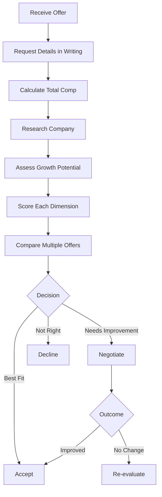
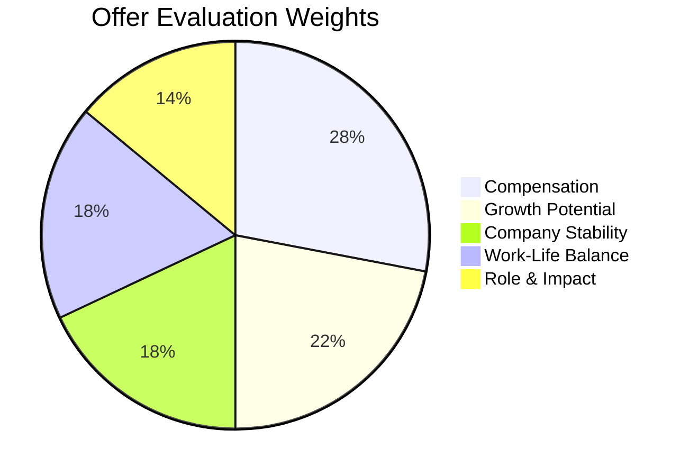

# 104 - Offer Discussion

## Introduction

Receiving a job offer is exciting, but evaluating it properly requires careful analysis and thoughtful decision-making. An offer discussion is the process of reviewing, comparing, and deciding on job offers based on a comprehensive framework that considers compensation, growth potential, company stability, work-life balance, and personal alignment. This guide provides a systematic approach to evaluating offers, understanding the nuances of different compensation structures, and making informed career decisions.

Many candidates make the mistake of accepting the highest-paying offer without considering other critical factors. Others reject great opportunities because they focused on the wrong metrics. This guide teaches you how to evaluate offers holistically, compare multiple opportunities objectively, and make decisions that align with both your short-term needs and long-term career goals. Whether you have one offer or five, the frameworks in this guide will help you make the best possible decision.

---

## Learning Roadmap

```
Week 1: Framework Development
  ├── Create your personal evaluation criteria
  ├── Define your non-negotiables
  ├── Establish weighting for different factors
  └── Set minimum thresholds for each criterion

Week 2: Offer Analysis
  ├── Calculate total compensation for each offer
  ├── Research company stability and growth
  ├── Assess career advancement potential
  └── Evaluate cultural and team fit

Week 3: Comparison and Decision
  ├── Create comparison matrices
  ├── Weigh short-term vs long-term value
  ├── Consider opportunity costs
  └── Make your decision framework

Week 4: Communication
  ├── Accept offer professionally
  ├── Decline offers gracefully
  ├── Negotiate if needed
  └── Document all agreements
```

---

## Theory Notes

### The Offer Evaluation Framework

A comprehensive offer evaluation considers these dimensions:

#### 1. Compensation (25-30% weight)
- Base salary vs market rate
- Total compensation (including equity)
- Bonus structure and targets
- Benefits value
- Signing bonus

#### 2. Growth Potential (20-25% weight)
- Career advancement paths
- Learning opportunities
- Skill development
- Promotion timeline
- Mentorship availability

#### 3. Company Stability (15-20% weight)
- Financial health
- Market position
- Growth trajectory
- Layoff history
- Funding status (for startups)

#### 4. Work-Life Balance (15-20% weight)
- Expected working hours
- Remote/hybrid/office policy
- PTO and flexibility
- On-call requirements
- Travel expectations

#### 5. Role and Impact (10-15% weight)
- Job responsibilities
- Project impact
- Autonomy level
- Team composition
- Technology stack

### Equity Valuation

Understanding equity value is critical:

#### RSUs (Restricted Stock Units)
- Value = Share Price × Number of Shares
- Consider vesting schedule (4-year is standard)
- Annual value = Total grant ÷ Vesting years
- Refresh grants may add value over time

#### Stock Options
- Value = (Current Price - Strike Price) × Number of Shares
- Only valuable if current price > strike price
- Consider time to expiration
- Tax implications vary by type (ISO vs NSO)

#### Startup Equity
- Most speculative - may be worth nothing
- Consider: funding stage, valuation, dilution
- Ask about: last 409A valuation, liquidation preferences
- Don't overvalue paper equity

### Company Stability Assessment

#### Public Companies
- Check stock performance and analyst ratings
- Review quarterly earnings reports
- Look at employee growth/layoff trends
- Assess market position and competition

#### Private Companies
- Check funding history and investors
- Review growth metrics if available
- Assess leadership team stability
- Look for signs of upcoming IPO or acquisition

---

## Key Concepts

### Short-Term vs Long-Term Value

| Factor | Short-Term (1-2 years) | Long-Term (3-5+ years) |
|--------|----------------------|----------------------|
| Compensation | High salary, signing bonus | Equity appreciation, raises |
| Growth | Learning new skills | Promotion, leadership |
| Brand | Company name on resume | Network, reputation |
| Stability | Job security | Career foundation |

### Opportunity Cost Analysis

When choosing between offers, consider what you're giving up:
- Higher salary vs better growth opportunity
- prestigious company vs exciting project
- stability vs potential upside
- current location vs relocation benefits

### The "Regret Minimization" Framework

Ask yourself: "When I'm 80 years old, will I regret not taking this opportunity?" This helps focus on what truly matters long-term.

### Total Compensation vs Cash Compensation

Some companies emphasize cash (base + bonus), others emphasize equity. Compare:
- Cash-focused offers: Predictable, immediate value
- Equity-focused offers: Potential upside, but variable
- Best approach: Compare annualized total compensation

---

## FAQ (20+ Q&A)

### Q1: How long should I take to evaluate an offer?
**A:** 3-7 business days is standard. If you need more time, communicate honestly and ask for an extension.

### Q2: Should I tell companies about competing offers?
**A:** Yes, if real. It provides leverage and can accelerate their decision. Be honest - companies often verify.

### Q3: How do I compare offers from different company sizes?
**A:** Consider total compensation, growth potential, equity risk, brand value, and role impact. A startup offer with equity might beat a large company offer on paper.

### Q4: What if one offer has much higher salary but worse benefits?
**A:** Calculate total compensation including benefits value. Health insurance alone can be worth $10K-$20K+ annually.

### Q5: How do I evaluate startup equity?
**A:** Be skeptical. Consider funding stage, valuation, and dilution. Treat it as potential upside, not guaranteed compensation.

### Q6: Should I accept the highest-paying offer?
**A:** Not necessarily. Consider growth potential, work-life balance, company stability, and career alignment. The highest salary today might not be the best long-term choice.

### Q7: How do I evaluate remote work offers?
**A:** Consider: cost of living adjustment, home office stipend, collaboration tools, team time zones, and career growth in remote settings.

### Q8: What if I need to decide quickly?
**A:** Ask for a reasonable extension (3-5 days). Most companies understand the importance of this decision.

### Q9: How do I decline an offer gracefully?
**A:** Thank them, be honest (without burning bridges), and leave the door open for future opportunities.

### Q10: What if I want to negotiate after accepting?
**A:** It's generally not advisable. Negotiate before accepting. Post-acceptance negotiations can damage trust.

### Q11: How do I evaluate relocation packages?
**A:** Consider: moving costs, temporary housing, travel, cost of living difference, and tax implications.

### Q12: What's more important - company or role?
**A:** Depends on your career stage. Early career: company brand and learning. Mid-career: role impact and growth. Late career: both matter equally.

### Q13: How do I evaluate work-life balance?
**A:** Ask about: typical hours, on-call expectations, PTO usage, meeting load, and how the team handles deadlines.

### Q14: Should I consider the interview experience as a signal?
**A:** Yes. A disorganized or disrespectful interview process often indicates broader company issues.

### Q15: How do I evaluate a counter-offer from my current employer?
**A:** Consider why you were leaving. If only money, staying might work. If deeper issues, money rarely fixes them long-term.

### Q16: What if the offer is below my expectations?
**A:** Negotiate using market data and your value proposition. If they can't meet your minimum, it may not be the right opportunity.

### Q17: How do I compare offers from different locations?
**A:** Adjust for cost of living, consider relocation requirements, and factor in quality of life preferences.

### Q18: Should I consider the team I'd be working with?
**A:** Absolutely. Team dynamics significantly impact daily satisfaction and career growth. Try to meet potential team members.

### Q19: How do I evaluate benefits?
**A:** Calculate the dollar value of benefits: health insurance, 401k match, PTO, education benefits. Some benefits are worth more than they appear.

### Q20: What if I have no competing offers?
**A:** Use market data as your leverage. Research what similar roles pay and negotiate based on your value.

### Q21: How do I handle multiple offers simultaneously?
**A:** Be transparent with companies about your timeline. Negotiate with your preferred offer first, then use other offers as leverage if needed.

---

## Hands-on Practice

### Exercise 1: Offer Comparison Matrix
Create a spreadsheet comparing two or more offers across these dimensions:
- Total compensation (year 1 and annualized)
- Growth potential (promotion timeline, learning)
- Company stability (financial health, market position)
- Work-life balance (hours, flexibility, PTO)
- Role impact (responsibilities, team, technology)
- Personal factors (location, culture, commute)

### Exercise 2: Total Compensation Calculator
For each offer, calculate:
- Base salary
- Annual bonus (expected value)
- Equity value (annualized)
- Sign-on bonus (amortized over 4 years)
- Benefits value
- Total annual compensation

### Exercise 3: Career Trajectory Analysis
Map out potential career paths for each offer:
- Where could you be in 2 years?
- 5 years?
- What skills would you develop?
- What network would you build?

### Exercise 4: Risk Assessment
Evaluate the risk of each offer:
- Company stability risk
- Equity value risk
- Role satisfaction risk
- Growth opportunity risk
- Work-life balance risk

### Exercise 5: Decision Journal
Write a journal entry about your decision-making process. What factors matter most to you? What trade-offs are you willing to make?

---

## FAANG Questions

### FAANG Offer Comparison Scenarios

#### Scenario 1: Amazon vs Google
**Amazon**: $155K base, $50K/year RSUs, $40K sign-on
**Google**: $150K base, $80K/year RSUs, $20K sign-on
**Analysis**: Google has higher equity value; Amazon has higher sign-on. Compare total comp and growth potential.

#### Scenario 2: Meta vs Apple
**Meta**: $180K base, $90K/year RSUs, strong bonus
**Apple**: $175K base, $60K RSUs over 4 years, great benefits
**Analysis**: Meta has higher cash comp; Apple may have better long-term equity and benefits.

#### Scenario 3: Netflix vs Startup
**Netflix**: $280K cash, no equity
**Startup**: $160K base, 0.1% equity, $50K sign-on
**Analysis**: Netflix provides guaranteed high income; startup has potential upside but high risk.

#### Scenario 4: Microsoft vs Amazon
**Microsoft**: $145K base, $40K/year RSUs, great work-life balance
**Amazon**: $160K base, $55K/year RSUs, higher intensity
**Analysis**: Amazon pays more but expects more; Microsoft offers better balance.

#### Scenario 5: Google vs Meta vs Amazon
**Compare**: Total comp, equity structure, growth paths, team opportunities, and culture fit.

---

## Common Mistakes

### Mistake 1: Focusing Only on Base Salary
Total compensation includes equity, bonus, and benefits. A lower base with better equity might be worth more.

### Mistake 2: Not Researching Company Stability
Joining a company about to have layoffs or shut down is risky, regardless of compensation.

### Mistake 3: Ignoring Growth Potential
A high-paying dead-end role can hurt your career long-term. Consider advancement opportunities.

### Mistake 4: Overvaluing Startup Equity
Most startup equity is worth nothing. Treat it as potential upside, not guaranteed compensation.

### Mistake 5: Not Considering Work-Life Balance
Burnout is real. A high salary isn't worth it if you're miserable and exhausted.

### Mistake 6: Making Emotional Decisions
Don't accept or reject based on gut feelings alone. Use a structured evaluation framework.

### Mistake 7: Not Asking Questions
Ask detailed questions about the role, team, expectations, and growth before deciding.

### Mistake 8: Rushing the Decision
This is a major career decision. Take the time you need to evaluate properly.

---

## Best Practices

1. **Use a Structured Framework**: Don't evaluate offers based on feelings alone
2. **Calculate Total Compensation**: Always compare apples to apples
3. **Consider Long-Term Value**: Look beyond immediate compensation
4. **Research Thoroughly**: Understand company stability, growth, and culture
5. **Ask Questions**: Get clarity on expectations and opportunities
6. **Take Your Time**: Don't rush major career decisions
7. **Trust Your Instincts**: After analysis, trust your gut
8. **Communicate Professionally**: Whether accepting or declining
9. **Get Everything in Writing**: Verbal promises aren't enough
10. **Consider the Team**: You'll spend more time with your team than with the company brand

---

## Cheat Sheet

```
OFFER EVALUATION CHEAT SHEET
============================

EVALUATION DIMENSIONS:
□ Compensation (25-30%)
□ Growth Potential (20-25%)
□ Company Stability (15-20%)
□ Work-Life Balance (15-20%)
□ Role & Impact (10-15%)

TOTAL COMPENSATION:
Base + Bonus + Equity + Sign-On + Benefits

EQUITY CONSIDERATIONS:
• RSUs: Value = Share Price × Shares
• Options: Value = (Current - Strike) × Shares
• Vesting Schedule: Typically 4 years
• Refresh Grants: May add annual value

COMPANY STABILITY:
Public: Stock performance, earnings, growth
Private: Funding, valuation, investors

DECISION FRAMEWORK:
1. List all offers
2. Calculate total comp for each
3. Score each dimension (1-10)
4. Apply weights
5. Consider career trajectory
6. Evaluate risk
7. Make decision
8. Communicate professionally

COMMUNICATION:
Accept: Be enthusiastic, confirm details
Decline: Be grateful, leave door open
Negotiate: Use data, be specific
Extension: Ask for 3-5 days

RED FLAGS:
⚠ Company about to lay off
⚠ Equity overvalued
⚠ No growth path
⚠ Poor work-life balance
⚠ Disorganized offer process
⚠ Pressure to decide immediately
```

---

## Flash Cards (20)

### Card 1
**Q:** What should you calculate for each offer?
**A:** Total compensation including base, bonus, equity, sign-on, and benefits.

### Card 2
**Q:** How long should you take to evaluate an offer?
**A:** 3-7 business days. Ask for an extension if needed.

### Card 3
**Q:** What's more important than base salary?
**A:** Total compensation and long-term growth potential.

### Card 4
**Q:** How should you evaluate startup equity?
**A:** Skeptically. Consider funding stage, valuation, and treat it as potential upside.

### Card 5
**Q:** What's the regret minimization framework?
**A:** Asking "When I'm 80, will I regret not taking this opportunity?" to focus on long-term value.

### Card 6
**Q:** Should you tell companies about competing offers?
**A:** Yes, if real. It provides legitimate leverage.

### Card 7
**Q:** How do you compare offers from different locations?
**A:** Adjust for cost of living, consider relocation, and factor in quality of life.

### Card 8
**Q:** What's a red flag in an offer process?
**A:** Pressure to decide immediately or disorganized communication.

### Card 9
**Q:** How do you decline an offer gracefully?
**A:** Thank them, be honest without burning bridges, and leave the door open.

### Card 10
**Q:** Should you consider the team you'd work with?
**A:** Yes. Team dynamics significantly impact daily satisfaction and growth.

### Card 11
**Q:** What's the danger of accepting the highest-paying offer?
**A:** It might not be the best long-term choice for growth, balance, or career alignment.

### Card 12
**Q:** How do you evaluate work-life balance?
**A:** Ask about hours, on-call, PTO usage, meeting load, and deadline handling.

### Card 13
**Q:** What factors matter most for early-career professionals?
**A:** Learning opportunities, company brand, and mentorship.

### Card 14
**Q:** What factors matter most for mid-career professionals?
**A:** Role impact, growth potential, and compensation.

### Card 15
**Q:** How do you evaluate a counter-offer from your current employer?
**A:** Consider why you were leaving. Money rarely fixes deeper issues.

### Card 16
**Q:** Should you consider the interview experience?
**A:** Yes. A disorganized process often indicates broader company issues.

### Card 17
**Q:** How do you handle multiple offers simultaneously?
**A:** Be transparent about timeline. Negotiate with preferred offer first.

### Card 18
**Q:** What's the difference between cash and equity-focused offers?
**A:** Cash offers are predictable; equity offers have potential upside but are variable.

### Card 19
**Q:** Should you get the offer in writing?
**A:** Yes. Always document all terms before accepting.

### Card 20
**Q:** What's the most important factor in offer evaluation?
**A:** Alignment with your career goals and values - it varies by individual.

---

## Mind Map

```
                 OFFER EVALUATION
                     |
      ┌──────────────┼──────────────┐
      |              |              |
 COMPENSATION    GROWTH       STABILITY
      |              |              |
 ┌────┴────┐    ┌────┴────┐    ┌────┴────┐
 |         |    |         |    |         |
Base    Equity  Skills  Promotion Financial Market
Bonus   Benefits Network Paths    Health  Position
```

---

## Mermaid Diagrams

### Offer Evaluation Process


### Decision Weighting


---

## Code Examples

```python
# Offer Evaluation Framework

from dataclasses import dataclass
from typing import List, Dict, Optional
from enum import Enum

class RiskLevel(Enum):
    LOW = 1
    MEDIUM = 2
    HIGH = 3

@dataclass
class JobOffer:
    company_name: str
    base_salary: float
    annual_bonus_pct: float
    equity_annual_value: float
    sign_on_bonus: float
    benefits_annual_value: float
    vesting_years: int = 4
    remote_flexible: bool = False
    pto_days: int = 0
    company_stability: RiskLevel = RiskLevel.MEDIUM
    growth_potential: int = 5  # 1-10
    
    @property
    def annual_bonus(self) -> float:
        return self.base_salary * (self.annual_bonus_pct / 100)
    
    @property
    def annualized_total_comp(self) -> float:
        sign_on_amortized = self.sign_on_bonus / self.vesting_years
        return (
            self.base_salary +
            self.annual_bonus +
            self.equity_annual_value +
            sign_on_amortized +
            self.benefits_annual_value
        )
    
    @property
    def cash_compensation(self) -> float:
        return self.base_salary + self.annual_bonus + (self.sign_on_bonus / self.vesting_years)

@dataclass
class EvaluationCriteria:
    compensation_weight: float = 0.28
    growth_weight: float = 0.22
    stability_weight: float = 0.18
    work_life_weight: float = 0.18
    role_weight: float = 0.14
    
    def normalize_weights(self):
        total = (self.compensation_weight + self.growth_weight + 
                self.stability_weight + self.work_life_weight + self.role_weight)
        self.compensation_weight /= total
        self.growth_weight /= total
        self.stability_weight /= total
        self.work_life_weight /= total
        self.role_weight /= total

class OfferEvaluator:
    def __init__(self, criteria: EvaluationCriteria = None):
        self.criteria = criteria or EvaluationCriteria()
        self.criteria.normalize_weights()
    
    def score_compensation(self, offer: JobOffer, market_median: float) -> float:
        """Score compensation relative to market (0-10)."""
        ratio = offer.annualized_total_comp / market_median
        return min(10, ratio * 7)  # 7 = market rate, 10 = 43% above
    
    def score_growth(self, offer: JobOffer) -> float:
        """Score growth potential (0-10)."""
        return offer.growth_potential
    
    def score_stability(self, offer: JobOffer) -> float:
        """Score company stability (0-10)."""
        stability_scores = {
            RiskLevel.LOW: 9,
            RiskLevel.MEDIUM: 6,
            RiskLevel.HIGH: 3
        }
        return stability_scores[offer.company_stability]
    
    def score_work_life(self, offer: JobOffer) -> float:
        """Score work-life balance (0-10)."""
        score = 5  # Base score
        if offer.remote_flexible:
            score += 2
        if offer.pto_days >= 20:
            score += 2
        elif offer.pto_days >= 15:
            score += 1
        return min(10, score)
    
    def evaluate_offer(self, offer: JobOffer, market_median: float) -> Dict:
        """Calculate overall offer score."""
        scores = {
            "compensation": self.score_compensation(offer, market_median),
            "growth": self.score_growth(offer),
            "stability": self.score_stability(offer),
            "work_life": self.score_work_life(offer),
            "role": 7  # Placeholder - customize based on role assessment
        }
        
        weighted_score = (
            scores["compensation"] * self.criteria.compensation_weight +
            scores["growth"] * self.criteria.growth_weight +
            scores["stability"] * self.criteria.stability_weight +
            scores["work_life"] * self.criteria.work_life_weight +
            scores["role"] * self.criteria.role_weight
        )
        
        return {
            "company": offer.company_name,
            "total_comp": offer.annualized_total_comp,
            "scores": scores,
            "weighted_score": round(weighted_score, 2),
            "recommendation": self._get_recommendation(weighted_score)
        }
    
    def _get_recommendation(self, score: float) -> str:
        if score >= 8:
            return "Strong Offer - Highly Recommended"
        elif score >= 6:
            return "Good Offer - Worth Considering"
        elif score >= 4:
            return "Moderate Offer - Negotiate or Reconsider"
        else:
            return "Weak Offer - Consider Declining"
    
    def compare_offers(self, offers: List[JobOffer], market_median: float) -> List[Dict]:
        """Compare multiple offers and rank them."""
        evaluations = [self.evaluate_offer(offer, market_median) for offer in offers]
        return sorted(evaluations, key=lambda x: x["weighted_score"], reverse=True)

# Example usage
offers = [
    JobOffer(
        company_name="Amazon",
        base_salary=155000,
        annual_bonus_pct=15,
        equity_annual_value=50000,
        sign_on_bonus=40000,
        benefits_annual_value=15000,
        remote_flexible=False,
        pto_days=15,
        company_stability=RiskLevel.LOW,
        growth_potential=8
    ),
    JobOffer(
        company_name="Google",
        base_salary=150000,
        annual_bonus_pct=15,
        equity_annual_value=70000,
        sign_on_bonus=20000,
        benefits_annual_value=18000,
        remote_flexible=True,
        pto_days=20,
        company_stability=RiskLevel.LOW,
        growth_potential=7
    ),
    JobOffer(
        company_name="StartupCo",
        base_salary=140000,
        annual_bonus_pct=10,
        equity_annual_value=30000,
        sign_on_bonus=10000,
        benefits_annual_value=10000,
        remote_flexible=True,
        pto_days=15,
        company_stability=RiskLevel.HIGH,
        growth_potential=9
    )
]

evaluator = OfferEvaluator()
rankings = evaluator.compare_offers(offers, market_median=180000)

print("OFFER RANKINGS")
print("=" * 60)
for i, ranking in enumerate(rankings, 1):
    print(f"\n{i}. {ranking['company']}")
    print(f"   Total Comp: ${ranking['total_comp']:,.0f}")
    print(f"   Score: {ranking['weighted_score']}/10")
    print(f"   {ranking['recommendation']}")
    print(f"   Component Scores: {ranking['scores']}")
```

---

## Resources

### Books
- "The Decision Book" by Krogerus and Tschappeler
- "Thinking, Fast and Slow" by Daniel Kahneman
- "The Paradox of Choice" by Barry Schwartz

### Tools
- Levels.fyi - Compensation comparison
- Glassdoor - Company reviews
- Blind - Anonymous discussions
- Payscale - Salary data

---

## Checklist

- [ ] Created personal evaluation criteria with weights
- [ ] Calculated total compensation for each offer
- [ ] Researched company stability and growth
- [ ] Assessed work-life balance factors
- [ ] Evaluated role impact and team
- [ ] Compared offers using structured framework
  - [ ] Considered short-term vs long-term value
  - [ ] Assessed risk levels
  - [ ] Asked all necessary questions
  - [ ] Negotiated if needed
  - [ ] Got final agreement in writing
  - [ ] Communicated decision professionally

---

## Mock Interviews

### Offer Evaluation Practice

**Scenario**: You receive three offers with different profiles:
- **Company A**: High salary, low equity, great benefits
- **Company B**: Medium salary, high equity, startup
- **Company C**: Low salary, medium equity, amazing culture

Practice using the evaluation framework to compare and make a decision. Explain your reasoning.

---

## Difficulty Rating

| Aspect | Rating (1-10) | Notes |
|--------|---------------|-------|
| Research Required | 6/10 | Moderate research needed |
| Analysis Complexity | 7/10 | Multiple factors to weigh |
| Emotional Difficulty | 6/10 | Can be stressful decisions |
| Time Required | 5/10 | A few focused days |
| Impact on Career | 9/10 | Major long-term impact |
| Overall Difficulty | 6/10 | Requires structured thinking |

---

## Summary

Evaluating job offers requires a systematic approach that considers compensation, growth, stability, work-life balance, and personal alignment. Use a structured framework to compare offers objectively, calculate total compensation, and think long-term about career impact. Don't rush decisions - take the time you need to evaluate properly. Communicate professionally whether accepting, declining, or negotiating. The right offer isn't always the highest-paying one - it's the one that best aligns with your career goals, values, and life situation.
