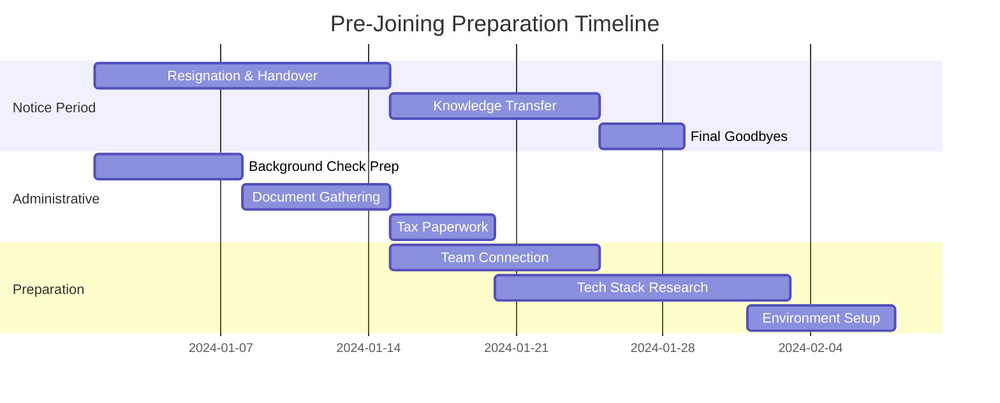
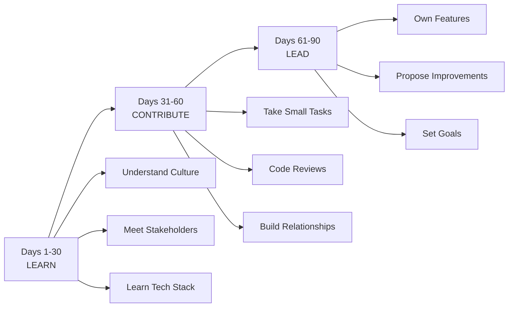

# 105 - Joining Preparation

## Introduction

The period between accepting a job offer and your first day is critical for setting yourself up for success. Proper joining preparation involves managing your notice period, completing background checks, preparing documents, setting up equipment, and planning your first 90 days. Many candidates underestimate this phase, treating it as a waiting period rather than an opportunity to get ahead. This comprehensive guide covers every aspect of pre-joining preparation to ensure you start your new role with confidence and momentum.

The transition from candidate to employee involves administrative tasks, logistical preparations, and strategic planning. How you handle this period signals professionalism and sets the tone for your relationship with your new employer. This guide provides practical checklists, timelines, and strategies for making this transition smooth and successful.

---

## Learning Roadmap

```
Phase 1: Notice Period (Weeks 1-4)
  ├── Handover current responsibilities
  ├── Document processes and knowledge
  ├── Transition projects to colleagues
  ├── Maintain professionalism
  └── Stay connected with new employer

Phase 2: Administrative Prep (Weeks 2-6)
  ├── Background check preparation
  ├── Document verification
  ├── Reference preparation
  ├── Tax and benefits paperwork
  └── Equipment setup coordination

Phase 3: Pre-Onboarding (Weeks 4-8)
  ├── Research new company thoroughly
  ├── Connect with future team
  ├── Review onboarding materials
  ├── Set up personal systems
  └── Plan first 90 days

Phase 4: Final Week
  ├── Last day at current job
  ├── Equipment handover
  ├── Final goodbyes
  ├── Travel arrangements (if needed)
  └── Mental preparation
```

---

## Theory Notes

### Notice Period Management

#### Best Practices for Your Notice Period
1. **Professional Resignation**: Give proper notice, be grateful, don't burn bridges
2. **Complete Handover**: Document everything, train replacements, finish critical tasks
3. **Knowledge Transfer**: Create documentation for ongoing projects
4. **Maintain Relationships**: Stay professional with colleagues and managers
5. **Stay Engaged**: Don't check out mentally - finish strong

#### What NOT to Do During Notice Period
- Badmouth the company or colleagues
- Slack off or reduce effort
- Share confidential information
- Recruit colleagues to leave with you
- Make major changes to systems you're leaving

### Background Check Preparation

#### What Companies Typically Check
1. **Employment History**: Verify previous employers, dates, and roles
2. **Education**: Verify degrees, certifications, and transcripts
3. **Criminal Background**: Check for relevant criminal records
4. **Credit History**: For roles with financial responsibility
5. **Reference Checks**: Contact professional references
6. **Skills Verification**: May include technical assessments

#### Preparing for Background Checks
- Gather employment records (offer letters, pay stubs)
- Contact references beforehand to inform them
- Verify education documents are accessible
- Check your own credit report for accuracy
- Prepare explanations for any gaps in employment

### Document Verification

#### Essential Documents to Prepare
- Government-issued ID (passport, driver's license)
- Social Security card or equivalent
- Education certificates and transcripts
- Previous employment verification letters
- Professional certifications
- Immigration documents (if applicable)
- Tax forms (W-4, I-9, etc.)

---

## Key Concepts

### The First 90 Days Framework

Based on Michael Watkins' "The First 90 Days":

#### Days 1-30: Learn
- Understand company culture and processes
- Meet key stakeholders
- Learn the technology stack and codebase
- Understand team dynamics and communication norms
- Review documentation and history

#### Days 31-60: Contribute
- Start taking on small tasks
- Participate in code reviews
- Contribute to team discussions
- Identify quick wins
- Build relationships across teams

#### Days 61-90: Lead
- Take ownership of a feature or project
- Propose improvements
- Mentor newer team members (if applicable)
- Set long-term goals with manager
- Establish yourself as a reliable team member

### Onboarding Preparation

#### Technical Preparation
- Set up development environment before day one if possible
- Review company's tech stack documentation
- Understand coding standards and practices
- Familiarize with version control and deployment processes

#### Social Preparation
- Connect with future team members on LinkedIn
- Research team structure and reporting lines
- Understand communication tools (Slack, Teams, etc.)
- Review company values and culture materials

### Goal Setting for New Role

#### SMART Goals for First 90 Days
- **Specific**: "Complete onboarding training" not "learn everything"
- **Measurable**: "Submit 5 code reviews" not "participate in reviews"
- **Achievable**: Set realistic goals for a new hire
- **Relevant**: Align with team and company objectives
- **Time-bound**: "Within first 30 days" not "eventually"

---

## FAQ (20+ Q&A)

### Q1: How long should I give as notice period?
**A:** Standard is 2 weeks in the US, but check your contract. Some roles require 30 days or more. Always honor your contractual obligations.

### Q2: Should I tell my current employer where I'm going?
**A:** You're not required to, but it's often professional to do so. If the relationship is good, sharing can be a courtesy. If toxic, keep it vague.

### Q3: Can my new employer contact my current employer during notice period?
**A:** Yes, but only with your permission. Inform your new employer about timing sensitivities.

### Q4: What if my background check reveals something unexpected?
**A:** Be proactive. If there's anything concerning (employment gaps, credit issues), explain it upfront before the check reveals it.

### Q5: Should I work on personal projects during notice period?
**A:** Complete your notice period professionally first. Personal projects are fine after work hours, but don't neglect your handover responsibilities.

### Q6: How do I handle references?
**A:** Ask former managers and colleagues if they'll serve as references. Provide them with context about the role you're applying for.

### Q7: What if my current employer asks me to leave immediately?
**A:** This happens sometimes. Have a plan B ready. Focus on completing critical handovers quickly.

### Q8: Should I connect with my new team before starting?
**A:** Yes, a brief introduction email or LinkedIn connection is appropriate. Don't overwhelm them, but showing interest is positive.

### Q9: How do I prepare my development environment?
**A:** Ask your new employer what tools and setup you'll need. Install software, set up accounts, and familiarize yourself with basic workflows before day one.

### Q10: What if I need to relocate?
**A:** Start early. Research the area, arrange temporary housing if needed, understand relocation benefits, and plan the move carefully.

### Q11: Should I negotiate after accepting?
**A:** Generally not advisable. Negotiate before accepting. Post-acceptance negotiations can damage trust.

### Q12: How do I handle the gap between leaving and starting?
**A:** Use the time productively: rest, learn new skills, prepare for the role, handle personal matters, or take a brief vacation.

### Q13: What documents do I need for I-9 verification?
**A:** One document from List A (passport) OR one from List B (driver's license) + one from List C (Social Security card). Check the full list.

### Q14: Should I continue networking during notice period?
**A:** Yes, but professionally. Don't use company time for personal networking. Maintain relationships you've built.

### Q15: How do I handle team farewell events?
**A:** Be gracious, professional, and positive. Thank colleagues, exchange contact information, and leave on good terms.

### Q16: What if my offer gets rescinded during notice period?
**A:** Extremely rare, but possible. Keep good relations with your current employer as a safety net. Document all offer communications.

### Q17: Should I take time off between jobs?
**A:** Consider it. A brief break can help you recharge and start fresh. But ensure financial stability and check if your new employer has start date expectations.

### Q18: How do I handle intellectual property concerns?
**A:** Don't take any proprietary code, documents, or data from your current employer. Focus on transferring knowledge, not taking it.

### Q19: What if my new employer wants me to start earlier?
**A:** Balance this with your notice period obligations. If possible, negotiate a compromise that respects both commitments.

### Q20: Should I update LinkedIn during notice period?
**A:** Wait until your last day or after you've left. Updating too early can create awkward situations with your current employer.

---

## Hands-on Practice

### Exercise 1: Notice Period Timeline
Create a detailed timeline for your notice period:
- Week 1: Resign, begin handover
- Week 2: Knowledge transfer, documentation
- Week 3: Project transitions, team meetings
- Week 4: Final handovers, goodbyes

### Exercise 2: Document Checklist
Create a comprehensive list of documents you need:
- Personal identification
- Education certificates
- Employment records
- Tax documents
- Benefits paperwork
- Immigration documents (if applicable)

### Exercise 3: Background Check Prep
Gather all background check materials:
- Contact information for previous employers
- Education verification documents
- Professional references
- Credit report (if relevant)
- Criminal background check (if required)

### Exercise 4: First 90 Days Plan
Draft a 90-day plan for your new role:
- Days 1-30: Learning goals
- Days 31-60: Contribution goals
- Days 61-90: Leadership goals

### Exercise 5: Equipment Setup
List all equipment and software you'll need:
- Laptop/computer
- Monitor(s)
- Keyboard/mouse
- Software licenses
- Development tools
- Communication apps

---

## FAANG Questions

### FAANG-Specific Pre-Joining Preparation

#### Amazon
- Complete Amazon's Leadership Principles review
- Set up Amazon employee portal access
- Review Amazon's culture and values
- Connect with your hiring manager before starting

#### Google
- Complete Google's pre-boarding requirements
- Set up Google workspace access
- Review Google's engineering practices
- Connect with your team on Google Chat

#### Meta
- Complete Meta's onboarding portal
- Set up Meta's internal tools
- Review Meta's engineering culture
- Connect with your onboarding buddy

#### Apple
- Complete Apple's pre-employment requirements
- Set up Apple ID for work
- Review Apple's design principles
- Connect with your team lead

#### Microsoft
- Complete Microsoft's onboarding portal
- Set up Microsoft 365 access
- Review Microsoft's engineering practices
- Connect with your manager

---

## Common Mistakes

### Mistake 1: Checking Out During Notice Period
Your reputation follows you. Finish strong and maintain professionalism.

### Mistake 2: Not Documenting Your Work
Failing to document processes and knowledge creates problems for your team.

### Mistake 3: Taking Confidential Information
Never take proprietary code, documents, or data. This can have legal consequences.

### Mistake 4: Badmouthing Your Current Employer
This reflects poorly on you and can damage your professional reputation.

### Mistake 5: Not Preparing for the New Role
Using the gap between jobs to rest is fine, but also prepare for your new role.

### Mistake 6: Ignoring Background Check Issues
If there's something concerning in your background, address it proactively.

### Mistake 7: Not Setting Up Equipment Early
Setting up your development environment before day one shows initiative.

### Mistake 8: Burning Bridges
The tech industry is small. Maintain relationships even when leaving.

---

## Best Practices

1. **Give Proper Notice**: Honor your contractual obligations
2. **Document Everything**: Create comprehensive handover documentation
3. **Stay Professional**: Maintain positive relationships
4. **Prepare for Background Checks**: Gather documents proactively
5. **Set Up Early**: Prepare your development environment before starting
6. **Connect with Team**: Reach out to future colleagues
7. **Plan First 90 Days**: Set goals and expectations
8. **Handle Logistics Early**: Relocation, equipment, benefits
9. **Rest and Recharge**: Take time to recharge before starting
10. **Stay Positive**: Approach the transition with enthusiasm

---

## Cheat Sheet

```
JOINING PREPARATION CHEAT SHEET
================================

NOTICE PERIOD CHECKLIST:
□ Submit resignation letter
□ Begin handover documentation
□ Transfer projects to colleagues
□ Train replacement (if needed)
□ Complete knowledge transfer
□ Maintain professionalism
□ Say appropriate goodbyes

BACKGROUND CHECK PREP:
□ Employment history records
□ Education certificates
□ Professional references
□ Credit report (if relevant)
□ Criminal background (if required)
□ Explanation for gaps

DOCUMENTS NEEDED:
□ Government ID
□ Social Security card
□ Education certificates
□ Employment verification
□ Professional certifications
□ Tax forms (W-4, I-9)
□ Immigration documents

FIRST 90 DAYS:
Days 1-30: LEARN
• Understand culture and processes
• Meet key stakeholders
• Learn tech stack
• Review documentation

Days 31-60: CONTRIBUTE
• Take on small tasks
• Participate in code reviews
• Build relationships
• Identify quick wins

Days 61-90: LEAD
• Own a feature/project
• Propose improvements
• Set long-term goals
• Establish yourself

EQUIPMENT SETUP:
□ Laptop/computer
□ Monitor(s)
□ Development environment
□ Communication tools
□ Version control access
□ IDE and extensions
□ Testing tools

FINAL WEEK:
□ Last day at current job
□ Equipment handover
□ Final goodbyes
□ Travel arrangements
□ Mental preparation
```

---

## Flash Cards (20)

### Card 1
**Q:** What's the standard notice period in the US?
**A:** 2 weeks, but check your contract for specific requirements.

### Card 2
**Q:** What should you document during your notice period?
**A:** Processes, project status, contact information, and ongoing work.

### Card 3
**Q:** What does I-9 verification require?
**A:** One document from List A, or one from List B + one from List C.

### Card 4
**Q:** What's the First 90 Days framework?
**A:** Days 1-30: Learn, Days 31-60: Contribute, Days 61-90: Lead.

### Card 5
**Q:** Should you update LinkedIn during notice period?
**A:** Wait until your last day or after you've left.

### Card 6
**Q:** What should you NOT do during notice period?
**A:** Badmouth the company, slack off, or take confidential information.

### Card 7
**Q:** How should you handle references?
**A:** Ask former managers, provide context about the role, keep them informed.

### Card 8
**Q:** Should you connect with your new team before starting?
**A:** Yes, a brief introduction or LinkedIn connection is appropriate.

### Card 9
**Q:** What if your background check reveals something unexpected?
**A:** Be proactive and explain it upfront before the check reveals it.

### Card 10
**Q:** How do you handle intellectual property concerns?
**A:** Don't take proprietary information. Focus on transferring knowledge.

### Card 11
**Q:** Should you take time off between jobs?
**A:** Consider it, but ensure financial stability and check start date expectations.

### Card 12
**Q:** What's the best way to prepare your development environment?
**A:** Ask your new employer what's needed and set it up before day one.

### Card 13
**Q:** How do you handle team farewell events?
**A:** Be gracious, professional, and positive. Exchange contact information.

### Card 14
**Q:** What if your offer gets rescinded during notice period?
**A:** Extremely rare. Keep good relations with current employer as safety net.

### Card 15
**Q:** Should you negotiate after accepting?
**A:** Generally not advisable. Negotiate before accepting.

### Card 16
**Q:** How do you handle the gap between jobs?
**A:** Rest, learn new skills, prepare for the role, or handle personal matters.

### Card 17
**Q:** What if your current employer asks you to leave immediately?
**A:** Have a plan B ready. Focus on completing critical handovers quickly.

### Card 18
**Q:** Should you continue networking during notice period?
**A:** Yes, but professionally and not on company time.

### Card 19
**Q:** What's the most important thing during notice period?
**A:** Maintaining professionalism and completing a thorough handover.

### Card 20
**Q:** How should you approach your first day?
**A:** With enthusiasm, curiosity, and a willingness to learn.

---

## Mind Map

```
              JOINING PREPARATION
                     |
      ┌──────────────┼──────────────┐
      |              |              |
 NOTICE PERIOD   ADMIN PREP    ONBOARDING
      |              |              |
 ┌────┴────┐    ┌────┴────┐    ┌────┴────┐
 |         |    |         |    |         |
Handover  Docu- Background Team    Goal
Process   ments  Check    Connect  Setting
```

---

## Mermaid Diagrams

### Pre-Joining Timeline


### First 90 Days Framework


---

## Code Examples

```python
# Pre-Joining Preparation Tracker

from dataclasses import dataclass, field
from typing import List, Dict
from datetime import datetime, timedelta
from enum import Enum

class TaskStatus(Enum):
    NOT_STARTED = "Not Started"
    IN_PROGRESS = "In Progress"
    COMPLETED = "Completed"

@dataclass
class PreparationTask:
    name: str
    category: str
    deadline: datetime
    status: TaskStatus = TaskStatus.NOT_STARTED
    notes: str = ""
    
    @property
    def is_overdue(self) -> bool:
        return datetime.now() > self.deadline and self.status != TaskStatus.COMPLETED
    
    @property
    def days_until_deadline(self) -> int:
        return (self.deadline - datetime.now()).days

@dataclass
class OnboardingPlan:
    company_name: str
    start_date: datetime
    tasks: List[PreparationTask] = field(default_factory=list)
    
    def add_task(self, name: str, category: str, days_before_start: int):
        deadline = self.start_date - timedelta(days=days_before_start)
        task = PreparationTask(name=name, category=category, deadline=deadline)
        self.tasks.append(task)
    
    def get_tasks_by_category(self, category: str) -> List[PreparationTask]:
        return [t for t in self.tasks if t.category == category]
    
    def get_overdue_tasks(self) -> List[PreparationTask]:
        return [t for t in self.tasks if t.is_overdue]
    
    def get_completion_rate(self) -> float:
        if not self.tasks:
            return 0.0
        completed = sum(1 for t in self.tasks if t.status == TaskStatus.COMPLETED)
        return completed / len(self.tasks)
    
    def generate_report(self) -> str:
        report = f"\n{'='*60}"
        report += f"\nPRE-JOINING PREPARATION REPORT: {self.company_name}"
        report += f"\nStart Date: {self.start_date.strftime('%Y-%m-%d')}"
        report += f"\nCompletion Rate: {self.get_completion_rate()*100:.1f}%"
        report += f"\n{'='*60}"
        
        categories = set(t.category for t in self.tasks)
        for category in sorted(categories):
            cat_tasks = self.get_tasks_by_category(category)
            report += f"\n\n{category.upper()}"
            report += f"\n{'-'*40}"
            for task in cat_tasks:
                status_icon = "✓" if task.status == TaskStatus.COMPLETED else "○"
                overdue = " [OVERDUE]" if task.is_overdue else ""
                report += f"\n  {status_icon} {task.name}{overdue}"
                report += f"\n    Due: {task.deadline.strftime('%Y-%m-%d')} ({task.days_until_deadline} days)"
        
        if self.get_overdue_tasks():
            report += f"\n\n⚠️  OVERDUE TASKS:"
            for task in self.get_overdue_tasks():
                report += f"\n  - {task.name} (due {task.deadline.strftime('%Y-%m-%d')})"
        
        return report

class First90DaysPlan:
    def __init__(self, role: str, team: str):
        self.role = role
        self.team = team
        self.goals = {
            "learn": [],      # Days 1-30
            "contribute": [], # Days 31-60
            "lead": []        # Days 61-90
        }
    
    def add_goal(self, phase: str, goal: str, metrics: str = ""):
        if phase in self.goals:
            self.goals[phase].append({"goal": goal, "metrics": metrics})
    
    def generate_plan(self) -> str:
        plan = f"\n{'='*60}"
        plan += f"\nFIRST 90 DAYS PLAN: {self.role} on {self.team}"
        plan += f"\n{'='*60}"
        
        phase_names = {
            "learn": "DAYS 1-30: LEARN",
            "contribute": "DAYS 31-60: CONTRIBUTE",
            "lead": "DAYS 61-90: LEAD"
        }
        
        for phase, name in phase_names.items():
            plan += f"\n\n{name}"
            plan += f"\n{'-'*40}"
            for i, item in enumerate(self.goals[phase], 1):
                plan += f"\n  {i}. {item['goal']}"
                if item['metrics']:
                    plan += f"\n     Metrics: {item['metrics']}"
        
        return plan

# Example usage
onboarding = OnboardingPlan(
    company_name="TechCorp",
    start_date=datetime(2024, 3, 1)
)

# Add preparation tasks
onboarding.add_task("Submit resignation", "Notice Period", 30)
onboarding.add_task("Complete handover documentation", "Notice Period", 14)
onboarding.add_task("Gather background check documents", "Administrative", 21)
onboarding.add_task("Contact references", "Administrative", 14)
onboarding.add_task("Set up development environment", "Technical", 3)
onboarding.add_task("Review company engineering blog", "Research", 7)
onboarding.add_task("Connect with team on LinkedIn", "Social", 5)
onboarding.add_task("Complete tax paperwork", "Administrative", 7)
onboarding.add_task("Review company values and culture", "Research", 5)
onboarding.add_task("Plan first week wardrobe", "Personal", 2)

# Mark some tasks as completed
onboarding.tasks[0].status = TaskStatus.COMPLETED
onboarding.tasks[2].status = TaskStatus.COMPLETED

print(onboarding.generate_report())

# Create 90-day plan
plan = First90DaysPlan(role="Senior Software Engineer", team="Backend Platform")

plan.add_goal("learn", "Understand the codebase and architecture", "Review 5 key repositories")
plan.add_goal("learn", "Meet all team members and key stakeholders", "Schedule 1:1s with 10 people")
plan.add_goal("learn", "Complete onboarding training", "Finish all required courses")

plan.add_goal("contribute", "Submit first code review", "Within 2 weeks")
plan.add_goal("contribute", "Fix a bug in the main service", "Within 3 weeks")
plan.add_goal("contribute", "Participate in sprint planning", "Attend all sprint ceremonies")

plan.add_goal("lead", "Own a feature from design to deployment", "Ship one feature end-to-end")
plan.add_goal("lead", "Propose one process improvement", "Present proposal to team")
plan.add_goal("lead", "Mentor a new hire", "Help onboard next joiner")

print(plan.generate_plan())
```

---

## Projects

### Project 1: Transition Management Dashboard
Build a tool that:
- Tracks notice period tasks and deadlines
- Manages document checklists
- Coordinates handover activities
- Sends reminders for upcoming deadlines

### Project 2: First 90 Days Planner
Create a web application that:
- Generates customizable 90-day plans
- Tracks goal progress
- Provides templates for different roles
- Integrates with calendar applications

---

## Resources

### Books
- "The First 90 Days" by Michael Watkins
- "Onboarding" by George Bradt
- "Right Away and All at Once" by Greg Brenneman
- "The New Leader's 100-Day Action Plan" by George Bradt

### Tools
- Notion - Documentation and planning
- Trello - Task management
- Google Calendar - Scheduling
- LinkedIn - Team connection

---

## Checklist

- [ ] Submitted resignation letter
- [ ] Created handover documentation
- [ ] Trained replacement or team members
- [ ] Gathered background check documents
- [ ] Contacted references
  - [ ] Completed tax paperwork
  - [ ] Set up development environment
  - [ ] Connected with future team
  - [ ] Reviewed company culture and values
  - [ ] Created first 90 days plan
  - [ ] Handled logistics (relocation, equipment)
  - [ ] Said professional goodbyes
  - [ ] Planned rest and recharge time
  - [ ] Prepared for first day

---

## Mock Interviews

### Pre-Joining Scenario Practice

**Scenario 1**: Your current employer counter-offers. Practice handling this professionally.

**Scenario 2**: Background check reveals a discrepancy in your employment dates. Practice explaining it.

**Scenario 3**: Your new employer wants you to start earlier than agreed. Practice negotiating.

---

## Difficulty Rating

| Aspect | Rating (1-10) | Notes |
|--------|---------------|-------|
| Administrative Complexity | 6/10 | Moderate paperwork involved |
| Emotional Difficulty | 5/10 | Exciting but stressful |
| Time Required | 4/10 | Manageable with planning |
| Risk if Done Poorly | 7/10 | Can impact reputation |
| Impact on Success | 8/10 | Sets tone for new role |
| Overall Difficulty | 5/10 | Straightforward with planning |

---

## Summary

Joining preparation is a critical phase that sets the stage for your success in a new role. Handle your notice period professionally, prepare for background checks, connect with your new team, and plan your first 90 days. The effort you put into this transition demonstrates professionalism and positions you for a strong start. Remember that the tech industry is small - how you leave a company matters as much as how you join one. Be thorough, professional, and enthusiastic throughout the process.
