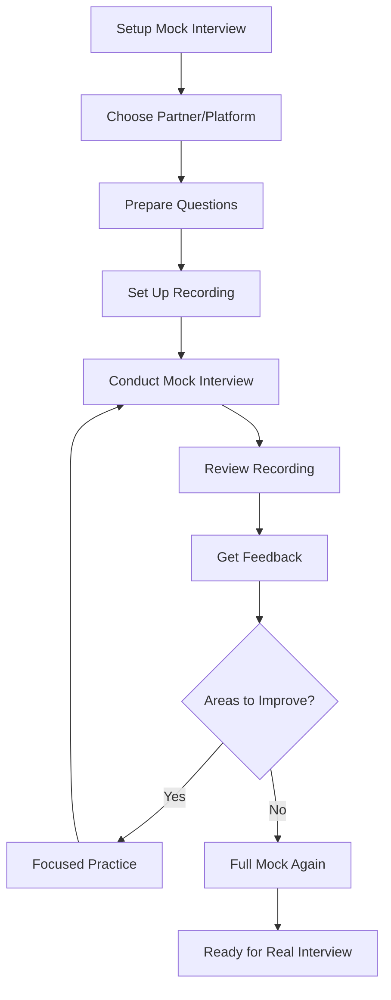
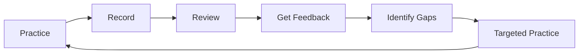

# 106 - Mock Interviews

## Introduction

Mock interviews are one of the most effective ways to prepare for real interviews. They provide a safe environment to practice your responses, refine your delivery, build confidence, and identify areas for improvement. Research shows that candidates who practice with mock interviews perform significantly better in actual interviews than those who only study or practice alone. This comprehensive guide covers everything from setting up mock interviews to getting the most value from the experience.

Whether you practice with a friend, mentor, or professional service, mock interviews simulate the pressure and format of real interviews, helping you become comfortable with the process. This guide provides strategies, formats, feedback frameworks, and techniques to maximize the value of your mock interview practice.

---

## Learning Roadmap

```
Week 1: Setup
  ├── Identify mock interview partners
  ├── Choose platforms and tools
  ├── Prepare question banks
  └── Set up recording equipment

Week 2: Initial Practice
  ├── Conduct baseline mock interview
  ├── Record and review performance
  ├── Identify top 3 areas for improvement
  └── Develop improvement plan

Week 3: Focused Practice
  ├── Practice specific weak areas
  ├── Get feedback from multiple sources
  ├── Refine answers and delivery
  └── Build confidence

Week 4: Final Preparation
  ├── Full-length mock interview
  ├── Simulate real conditions
  ├── Final review and adjustments
  └── Mental preparation
```

---

## Theory Notes

### Why Mock Interviews Work

1. **Reduce Anxiety**: Familiarity with the format reduces nervousness
2. **Improve Delivery**: Practice makes responses smoother and more confident
3. **Identify Gaps**: Feedback reveals blind spots you can't see yourself
4. **Build Muscle Memory**: Repeated practice makes good habits automatic
5. **Test Preparation**: Validates whether your preparation is effective

### Types of Mock Interviews

#### 1. Peer Mock Interviews
- **Format**: Practice with other job seekers
- **Pros**: Free, mutual benefit, relatable feedback
- **Cons**: May lack expertise, inconsistent quality

#### 2. Mentor/Expert Mock Interviews
- **Format**: Practice with experienced professionals
- **Pros**: Expert feedback, industry insights
- **Cons**: May cost money, scheduling challenges

#### 3. Professional Mock Interview Services
- **Format**: Paid services with trained interviewers
- **Pros**: High-quality feedback, realistic simulation
- **Cons**: Cost, may feel less authentic

#### 4. Self-Practice (Video Recording)
- **Format**: Record yourself answering questions
- **Pros**: Available anytime, self-paced
- **Cons**: No external feedback, harder to self-assess

### Feedback Frameworks

#### SBI Model (Situation-Behavior-Impact)
- **Situation**: What was the context?
- **Behavior**: What did you do/say?
- **Impact**: What was the result?

#### STAR Feedback
- **Situation**: Was context clear?
- **Task**: Was your role defined?
- **Action**: Were your actions specific?
- **Result**: Were results quantified?

---

## Key Concepts

### Mock Interview Structure

A complete mock interview should include:

1. **Introduction** (2-3 minutes)
   - Brief self-introduction
   - Set expectations for the session

2. **Technical/Behavioral Questions** (45-55 minutes)
   - Mix of question types
   - Realistic timing
   - Follow-up questions

3. **Feedback Session** (10-15 minutes)
   - Specific observations
   - Strengths identified
   - Areas for improvement
   - Actionable suggestions

### Common Mock Interview Scenarios

#### Technical Mock Interview
- Coding problems (DSA, algorithms)
- System design questions
- Code review exercises
- Debugging challenges

#### Behavioral Mock Interview
- STAR-based leadership questions
- Conflict resolution scenarios
- Team collaboration questions
- Career motivation questions

#### Phone Screen Mock
- Concise self-introduction
- Technical screening questions
- Cultural fit assessment
- Questions for the interviewer

#### Onsite Simulation
- Multiple rounds in sequence
- Mix of technical and behavioral
- Breaks between rounds
- Full-day commitment

### Self-Assessment Techniques

#### Video Recording Review
- Watch for body language
- Listen to filler words
- Check timing of responses
- Note clarity of explanations

#### Peer Feedback Forms
- Structured evaluation criteria
- Specific examples from performance
- Actionable improvement suggestions
- Prioritized feedback items

---

## FAQ (20+ Q&A)

### Q1: How many mock interviews should I do before my real interview?
**A:** Aim for 3-5 complete mock interviews, with additional focused practice sessions on weak areas.

### Q2: Should I mock interview with someone in my target industry?
**A:** Yes, ideally. Industry-specific feedback is more relevant, but general practice is still valuable.

### Q3: How do I find mock interview partners?
**A:** Use platforms like Pramp, Interviewing.io, or join interview prep communities on Discord/Reddit.

### Q4: Should I record my mock interviews?
**A:** Absolutely. Recording allows you to review your performance objectively and track improvement.

### Q5: How do I give good feedback to my mock interview partner?
**A:** Use the SBI model: describe the Situation, the Behavior you observed, and the Impact it had.

### Q6: What if I'm nervous during mock interviews?
**A:** That's normal and valuable! Mock interviews help you build comfort with interview nerves.

### Q7: How long should a mock interview session last?
**A:** 45-60 minutes for a full mock, with 10-15 minutes for feedback. Shorter sessions work for focused practice.

### Q8: Should I practice in the same format as my real interview?
**A:** Yes. If your real interview is virtual, practice virtually. If it's in-person, simulate that environment.

### Q9: How do I handle difficult questions in mock interviews?
**A:** Practice thinking out loud, asking for clarification, and structuring your response under pressure.

### Q10: Should I use the same questions repeatedly?
**A:** Mix new questions with repeats to practice both adapting to new scenarios and refining known answers.

### Q11: How do I simulate interview pressure?
**A:** Set strict time limits, have someone ask follow-up questions, practice in unfamiliar environments.

### Q12: What if I don't have anyone to practice with?
**A:** Use self-practice: record yourself answering questions, use AI interview tools, or join online communities.

### Q13: How do I prepare questions for the interviewer portion?
**A:** Prepare thoughtful questions about the role, team, company, and culture for the end of each mock.

### Q14: Should I dress up for mock interviews?
**A:** If your real interview is formal, yes. Dressing the part helps you practice the complete experience.

### Q15: How do I track improvement across mock interviews?
**A:** Keep a log of scores, feedback items, and areas for improvement. Review periodically.

### Q16: What if my mock interview partner gives poor feedback?
**A:** Seek multiple perspectives. Not all feedback is equally valuable. Look for patterns across sources.

### Q17: Should I practice different interview types separately?
**A:** Yes. Practice technical, behavioral, and system design interviews as separate sessions for focused improvement.

### Q18: How do I simulate a phone screen?
**A:** Practice speaking clearly, concisely, and professionally. Have someone ask screening questions over the phone.

### Q19: Should I tell my mock interviewer about my target company?
**A:** Yes. Context helps them ask relevant questions and give targeted feedback.

### Q20: How do I handle interview anxiety during mocks?
**A:** Treat it as practice for managing real anxiety. Use breathing techniques and positive self-talk.

---

## Hands-on Practice

### Exercise 1: Baseline Assessment
Conduct a baseline mock interview with a friend or mentor. Record it. Score yourself on:
- Content quality (1-10)
- Communication clarity (1-10)
- Confidence level (1-10)
- Time management (1-10)
- STAR structure (1-10)

### Exercise 2: Focused Practice Sessions
Identify your weakest area and do 3 focused practice sessions:
- Session 1: Practice specific question types
- Session 2: Get feedback and adjust
- Session 3: Refine and build consistency

### Exercise 3: Video Self-Review
Record yourself answering 5 behavioral questions. Watch the recording and note:
- Filler words used
- Body language issues
- Clarity of structure
- Timing accuracy
- Energy and enthusiasm

### Exercise 4: Peer Feedback Exchange
Practice with a partner. After each answer, they provide feedback using:
- One strength they observed
- One specific improvement suggestion
- One example of what could be better

### Exercise 5: Full Simulation
Conduct a full interview simulation:
- 5 minutes: Introduction
- 45 minutes: Questions (mix of technical and behavioral)
- 10 minutes: Candidate questions
- 15 minutes: Feedback session

---

## FAANG Questions

### FAANG Mock Interview Practice Sets

#### Set 1: Amazon Behavioral (Bar Raiser Style)
1. Tell me about a time you made a decision based on incomplete information.
2. Describe a situation where you went above and beyond for a customer.
3. Give an example of when you had to push back on a decision.
4. Tell me about a time you took ownership outside your responsibility.
5. Describe a time when you simplified a complex process.

#### Set 2: Google Technical + Behavioral
1. Implement a function to find the longest palindromic substring.
2. Tell me about a time you used data to make a decision.
3. Design a URL shortener.
4. Describe a project where you had to learn something new quickly.

#### Set 3: Meta System Design + Behavioral
1. Design a real-time notification system.
2. Tell me about a time you moved fast and broke something.
3. Design a newsfeed algorithm.
4. Describe how you handle competing priorities.

#### Set 4: Apple Technical + Culture
1. Implement a caching system.
2. Tell me about a time you refused to compromise on quality.
3. Design a mobile app feature.
4. Describe your approach to user experience.

#### Set 5: Microsoft Leadership + Technical
1. Tell me about a time you grew through a growth mindset challenge.
2. Design a distributed key-value store.
3. Describe how you've mentored junior developers.
4. Explain a technical concept to a non-technical audience.

---

## Common Mistakes

### Mistake 1: Not Taking Mock Interviews Seriously
Treat mocks like real interviews. Serious practice leads to serious improvement.

### Mistake 2: Only Practicing with Friends
Friends may be too lenient. Seek feedback from people who will be honest and constructive.

### Mistake 3: Not Recording Sessions
Without recording, you miss opportunities to review and improve your delivery.

### Mistake 4: Ignoring Feedback
Getting feedback but not acting on it wastes everyone's time. Create an action plan.

### Mistake 5: Practicing Only Comfortable Questions
Focus on your weak areas. Practice what's hard, not what's easy.

### Mistake 6: Not Simulating Real Conditions
Practice in conditions similar to your real interview (virtual, time pressure, etc.).

### Mistake 7: Rushing Through Practice
Quality matters more than quantity. Do fewer, more focused sessions.

### Mistake 8: Not Getting Diverse Feedback
Seek feedback from multiple sources to avoid blind spots.

---

## Best Practices

1. **Treat It Like the Real Thing**: Dress appropriately, be on time, take it seriously
2. **Record Everything**: Video and audio recordings are invaluable for self-review
3. **Get Specific Feedback**: Ask for concrete examples, not general impressions
4. **Practice Under Pressure**: Set time limits and simulate real conditions
5. **Focus on Weak Areas**: Don't just practice what you're good at
6. **Track Progress**: Keep a log of scores, feedback, and improvements
7. **Seek Diverse Perspectives**: Get feedback from multiple people
8. **Follow Up**: Thank your mock interviewer and share how their feedback helped
9. **Space Your Practice**: Don't cram all mocks into one day
10. **Stay Positive**: Mock interviews are learning opportunities, not tests

---

## Cheat Sheet

```
MOCK INTERVIEW CHEAT SHEET
===========================

SESSION STRUCTURE:
□ Introduction (2-3 min)
□ Questions (45-55 min)
□ Candidate Questions (5-10 min)
□ Feedback (10-15 min)

FEEDBACK FRAMEWORK:
SBI Model:
• Situation: What was the context?
• Behavior: What did you observe?
• Impact: What was the effect?

STAR Evaluation:
• Situation: Clear context?
• Task: Role defined?
• Action: Specific actions?
• Result: Quantified outcomes?

SELF-ASSESSMENT SCORES:
Content Quality:    /10
Communication:      /10
Confidence:         /10
Time Management:    /10
STAR Structure:     /10

PLATFORMS:
□ Pramp (free peer mocks)
□ Interviewing.io (paid experts)
□ Blind (find partners)
□ Reddit r/cscareerquestions
□ Discord communities

RECORDING CHECKLIST:
□ Camera positioned correctly
□ Good lighting
□ Clear audio
□ Full body visible
□ Background professional

IMPROVEMENT TRACKING:
Mock #  | Date | Score | Key Feedback | Actions
--------|------|-------|--------------|--------
   1    |      |       |              |
   2    |      |       |              |
   3    |      |       |              |
```

---

## Flash Cards (20)

### Card 1
**Q:** How many mock interviews should you do before a real interview?
**A:** 3-5 complete mocks, plus focused practice sessions.

### Card 2
**Q:** Should you record your mock interviews?
**A:** Yes, recording allows objective review and tracks improvement.

### Card 3
**Q:** What's the SBI feedback model?
**A:** Situation-Behavior-Impact: describe context, observed behavior, and its effect.

### Card 4
**Q:** How long should a mock interview session last?
**A:** 45-60 minutes for a full mock, with 10-15 minutes for feedback.

### Card 5
**Q:** Should you practice in the same format as your real interview?
**A:** Yes. Match the format (virtual, in-person, phone) to simulate real conditions.

### Card 6
**Q:** What's the benefit of practicing with strangers vs friends?
**A:** Strangers provide more honest, less biased feedback than friends who may be too lenient.

### Card 7
**Q:** How do you simulate interview pressure?
**A:** Set strict time limits, have someone ask follow-up questions, practice in unfamiliar environments.

### Card 8
**Q:** Should you practice only comfortable questions?
**A:** No. Focus on weak areas where you need the most improvement.

### Card 9
**Q:** What's the best way to track improvement?
**A:** Keep a log of scores, feedback items, and actions taken across sessions.

### Card 10
**Q:** How do you give good feedback to your partner?
**A:** Use specific examples, focus on behavior not personality, and provide actionable suggestions.

### Card 11
**Q:** Should you dress up for mock interviews?
**A:** If your real interview is formal, yes. Dressing the part helps practice the complete experience.

### Card 12
**Q:** What if you don't have anyone to practice with?
**A:** Use self-practice with video recording, AI interview tools, or join online communities.

### Card 13
**Q:** How do you handle difficult questions in mocks?
**A:** Practice thinking out loud, asking for clarification, and structuring responses under pressure.

### Card 14
**Q:** Should you use the same questions repeatedly?
**A:** Mix new questions with repeats to practice both adaptation and refinement.

### Card 15
**Q:** What's a full interview simulation?
**A:** 5 min intro, 45 min questions, 10 min candidate questions, 15 min feedback.

### Card 16
**Q:** How do you practice phone screens?
**A:** Practice speaking clearly and concisely over the phone with screening questions.

### Card 17
**Q:** Should you tell your mock interviewer about your target company?
**A:** Yes. Context helps them ask relevant questions and give targeted feedback.

### Card 18
**Q:** How do you handle interview anxiety during mocks?
**A:** Treat it as practice for real anxiety. Use breathing techniques and positive self-talk.

### Card 19
**Q:** What's the most important aspect of mock interviews?
**A:** Getting honest, specific feedback and acting on it to improve.

### Card 20
**Q:** How do you space your practice sessions?
**A:** Space them over days/weeks rather than cramming, allowing time to incorporate feedback.

---

## Mind Map

```
                 MOCK INTERVIEWS
                      |
       ┌──────────────┼──────────────┐
       |              |              |
   PREPARATION     EXECUTION     FEEDBACK
       |              |              |
  ┌────┴────┐    ┌────┴────┐    ┌────┴────┐
  |         |    |         |    |         |
Partner  Questions Format  Timing SBI    Action
Setup    Bank          Recording Model  Plan
```

---

## Mermaid Diagrams

### Mock Interview Process


### Feedback Loop


---

## Code Examples

```python
# Mock Interview Tracker

from dataclasses import dataclass, field
from typing import List, Dict
from datetime import datetime
from enum import Enum

class InterviewType(Enum):
    TECHNICAL = "Technical"
    BEHAVIORAL = "Behavioral"
    SYSTEM_DESIGN = "System Design"
    PHONE_SCREEN = "Phone Screen"
    FULL_SIMULATION = "Full Simulation"

@dataclass
class MockInterviewSession:
    date: datetime
    interview_type: InterviewType
    partner: str
    duration_minutes: int
    scores: Dict[str, int] = field(default_factory=dict)
    feedback: List[str] = field(default_factory=list)
    improvements: List[str] = field(default_factory=list)
    questions_practiced: List[str] = field(default_factory=list)
    
    @property
    def average_score(self) -> float:
        if not self.scores:
            return 0.0
        return sum(self.scores.values()) / len(self.scores)
    
    def add_score(self, category: str, score: int):
        self.scores[category] = min(10, max(1, score))

class MockInterviewTracker:
    def __init__(self):
        self.sessions: List[MockInterviewSession] = []
    
    def add_session(self, session: MockInterviewSession):
        self.sessions.append(session)
    
    def get_progress_summary(self) -> Dict:
        if not self.sessions:
            return {"sessions": 0, "message": "No sessions recorded yet"}
        
        total_sessions = len(self.sessions)
        avg_scores = {}
        
        # Collect all score categories
        all_categories = set()
        for session in self.sessions:
            all_categories.update(session.scores.keys())
        
        # Calculate average for each category
        for category in all_categories:
            scores = [s.scores.get(category, 0) for s in self.sessions if category in s.scores]
            if scores:
                avg_scores[category] = sum(scores) / len(scores)
        
        overall_avg = sum(avg_scores.values()) / len(avg_scores) if avg_scores else 0
        
        return {
            "total_sessions": total_sessions,
            "average_scores": avg_scores,
            "overall_average": round(overall_avg, 2),
            "improvement_trend": self._calculate_trend(),
            "total_questions": sum(len(s.questions_practiced) for s in self.sessions)
        }
    
    def _calculate_trend(self) -> str:
        if len(self.sessions) < 2:
            return "Insufficient data"
        
        first_half = self.sessions[:len(self.sessions)//2]
        second_half = self.sessions[len(self.sessions)//2:]
        
        first_avg = sum(s.average_score for s in first_half) / len(first_half)
        second_avg = sum(s.average_score for s in second_half) / len(second_half)
        
        if second_avg > first_avg + 0.5:
            return "Improving"
        elif second_avg < first_avg - 0.5:
            return "Declining"
        else:
            return "Stable"
    
    def identify_weak_areas(self) -> List[Dict]:
        """Identify areas with consistently low scores."""
        category_scores = {}
        
        for session in self.sessions:
            for category, score in session.scores.items():
                if category not in category_scores:
                    category_scores[category] = []
                category_scores[category].append(score)
        
        weak_areas = []
        for category, scores in category_scores.items():
            avg = sum(scores) / len(scores)
            if avg < 7:
                weak_areas.append({
                    "category": category,
                    "average_score": round(avg, 2),
                    "sessions_count": len(scores),
                    "recommendation": self._get_recommendation(category, avg)
                })
        
        return sorted(weak_areas, key=lambda x: x["average_score"])
    
    def _get_recommendation(self, category: str, score: float) -> str:
        recommendations = {
            "Content Quality": "Review technical concepts and prepare more examples",
            "Communication": "Practice speaking clearly and reducing filler words",
            "Confidence": "Practice positive self-talk and power poses before interviews",
            "Time Management": "Set timers during practice and prioritize key points",
            "STAR Structure": "Use STAR framework consistently for all behavioral answers"
        }
        return recommendations.get(category, "Focus on targeted practice in this area")
    
    def generate_report(self) -> str:
        summary = self.get_progress_summary()
        weak_areas = self.identify_weak_areas()
        
        report = f"\n{'='*60}"
        report += f"\nMOCK INTERVIEW PROGRESS REPORT"
        report += f"\n{'='*60}"
        report += f"\nTotal Sessions: {summary['total_sessions']}"
        report += f"\nOverall Average: {summary['overall_average']}/10"
        report += f"\nImprovement Trend: {summary['improvement_trend']}"
        report += f"\nTotal Questions Practiced: {summary['total_questions']}"
        
        report += f"\n\nAVERAGE SCORES BY CATEGORY:"
        report += f"\n{'-'*40}"
        for category, score in summary['average_scores'].items():
            bar = "█" * int(score) + "░" * (10 - int(score))
            report += f"\n  {category:<20} {bar} {score:.1f}/10"
        
        if weak_areas:
            report += f"\n\nAREAS NEEDING IMPROVEMENT:"
            report += f"\n{'-'*40}"
            for area in weak_areas:
                report += f"\n  {area['category']}: {area['average_score']}/10"
                report += f"\n    → {area['recommendation']}"
        
        report += f"\n\nRECENT SESSIONS:"
        report += f"\n{'-'*40}"
        for session in self.sessions[-5:]:
            report += f"\n  {session.date.strftime('%Y-%m-%d')} | {session.interview_type.value}"
            report += f" | Score: {session.average_score:.1f}/10"
        
        return report

# Example usage
tracker = MockInterviewTracker()

# Add mock sessions
session1 = MockInterviewSession(
    date=datetime(2024, 1, 15),
    interview_type=InterviewType.BEHAVIORAL,
    partner="John (Mentor)",
    duration_minutes=60,
    scores={
        "Content Quality": 7,
        "Communication": 6,
        "Confidence": 5,
        "Time Management": 7,
        "STAR Structure": 6
    },
    feedback=[
        "Good examples but could quantify results more",
        "Some filler words - try pausing instead",
        "Speak with more authority"
    ],
    improvements=[
        "Add metrics to all stories",
        "Practice pausing instead of using filler words"
    ],
    questions_practiced=[
        "Tell me about a time you led a difficult project",
        "Describe a conflict with a colleague"
    ]
)

session2 = MockInterviewSession(
    date=datetime(2024, 1, 22),
    interview_type=InterviewType.TECHNICAL,
    partner="Sarah (Colleague)",
    duration_minutes=45,
    scores={
        "Content Quality": 8,
        "Communication": 7,
        "Confidence": 6,
        "Time Management": 8,
        "STAR Structure": 7
    },
    feedback=[
        "Strong technical explanations",
        "Clearer structure this time",
        "Could be more concise"
    ],
    improvements=[
        "Practice explaining solutions more concisely"
    ],
    questions_practiced=[
        "Implement LRU Cache",
        "Explain database indexing"
    ]
)

tracker.add_session(session1)
tracker.add_session(session2)

print(tracker.generate_report())
```

---

## Projects

### Project 1: Mock Interview Scheduler
Build a tool that:
- Matches practice partners by skill level and target companies
- Schedules sessions across time zones
- Tracks session history and feedback
- Sends reminders and follow-ups

### Project 2: Interview Practice App
Create an application that:
- Provides timed question banks
- Records audio/video responses
- Uses AI to analyze responses
- Tracks improvement over time

---

## Resources

### Platforms
- [Pramp](https://www.pramp.com) - Free peer-to-peer mock interviews
- [Interviewing.io](https://interviewing.io) - Anonymous practice with experts
- [Exponent](https://www.tryexponent.com) - Mock interviews with industry professionals
- [Blind](https://www.teamblind.com) - Find mock interview partners

### Books
- "Cracking the Coding Interview" by Gayle Laakmann McDowell
- "Interviewing.io Blog" - Real interview insights
- "The Behavioral Interview Guide" by various authors

---

## Checklist

- [ ] Identified 3+ mock interview partners
- [ ] Set up recording equipment
- [ ] Prepared question bank for each interview type
- [ ] Conducted baseline mock interview
- [ ] Identified top 3 areas for improvement
- [ ] Completed 3+ focused practice sessions
- [ ] Conducted full-length mock interview
- [ ] Got feedback from multiple sources
- [ ] Tracked progress across sessions
- [ ] Practiced in realistic conditions
- [ ] Prepared for each interview type separately
- [ ] Reviewed and incorporated all feedback
- [ ] Built confidence through repetition
- [ ] Ready for real interview

---

## Mock Interviews

### Finding Mock Interview Partners

**Online Communities:**
- Reddit r/cscareerquestions
- Discord interview prep servers
- LinkedIn tech communities
- Blind app

**Professional Services:**
- Pramp (free)
- Interviewing.io ($100-200/session)
- Exponent ($50-100/session)
- Local meetup groups

**Personal Network:**
- Former colleagues
- Bootcamp alumni
- University career services
- Mentor relationships

---

## Difficulty Rating

| Aspect | Rating (1-10) | Notes |
|--------|---------------|-------|
| Finding Partners | 5/10 | Many free options available |
| Time Investment | 6/10 | Requires regular practice |
| Emotional Challenge | 6/10 | Can be nerve-wracking but valuable |
| Improvement Potential | 9/10 | One of the highest-ROI activities |
| Accessibility | 8/10 | Available to everyone |
| Overall Difficulty | 5/10 | Moderate; highly recommended |

---

## Summary

Mock interviews are an essential part of interview preparation that provide safe, structured practice opportunities. They help reduce anxiety, improve delivery, identify weaknesses, and build confidence. Use a variety of partners and platforms, record your sessions, get specific feedback, and track your progress. The investment in mock interviews pays enormous dividends in actual interview performance. Start early, practice consistently, and treat each mock as a real interview to maximize the value of your preparation.
