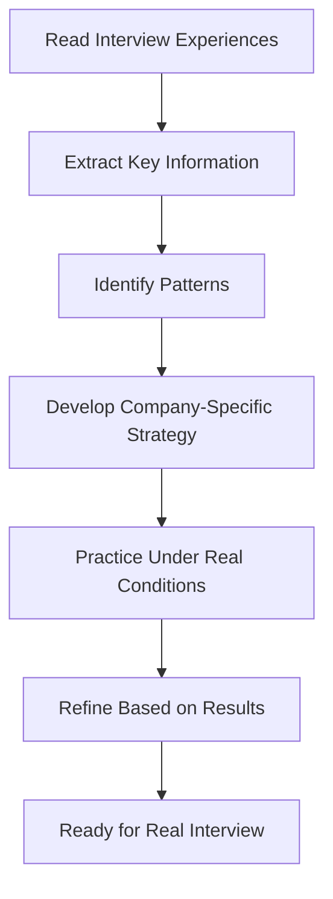
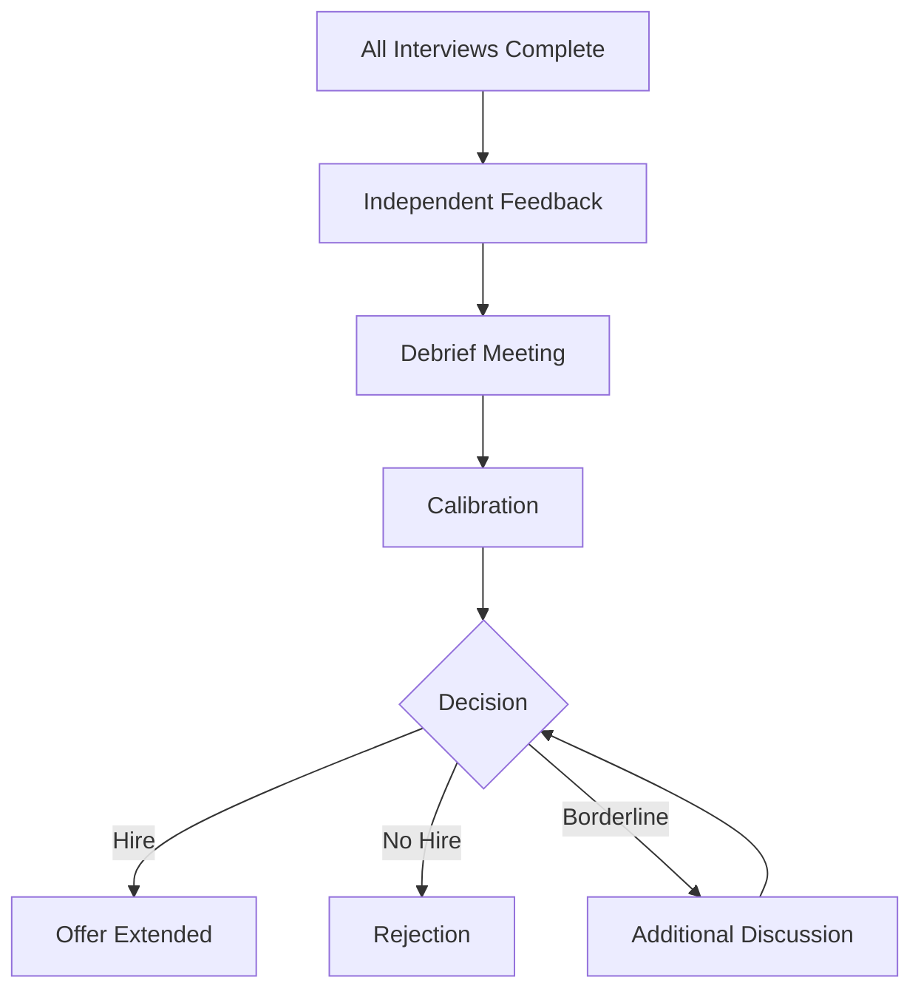

# 107 - Interview Experiences

## Introduction

Real interview experiences from candidates who have been through the process are invaluable resources for interview preparation. They provide insights into question patterns, company-specific formats, interviewer behaviors, and strategies that work or don't work. This comprehensive collection covers FAANG interview experiences, startup stories, both successful and rejected candidate perspectives, remote interview experiences, onsite preparation insights, and the debrief process. Learning from others' experiences helps you anticipate what to expect, avoid common pitfalls, and develop effective strategies.

This guide compiles patterns and insights from hundreds of interview experiences shared across platforms like Blind, Glassdoor, Reddit, and personal blogs. While every interview is unique, understanding common patterns and themes helps you prepare more effectively and approach your interviews with confidence.

---

## Learning Roadmap

```
Week 1: Research & Analysis
  ├── Read 10+ interview experiences from target companies
  ├── Note common question patterns
  ├── Identify company-specific formats
  └── Understand evaluation criteria

Week 2: Pattern Recognition
  ├── Categorize questions by type
  ├── Identify difficulty trends
  ├── Note interviewer behaviors
  └── Understand debrief processes

Week 3: Strategy Development
  ├── Develop company-specific strategies
  ├── Prepare for common patterns
  ├── Address frequently asked questions
  └── Build question banks

Week 4: Application
  ├── Apply insights to your preparation
  ├── Adjust strategies based on patterns
  ├── Practice with realistic scenarios
  └── Refine approach based on feedback
```

---

## Theory Notes

### Where to Find Interview Experiences

#### Primary Sources
1. **Blind** (teamblind.com) - Anonymous employee discussions
2. **Glassdoor** - Company reviews and interview experiences
3. **Reddit** - r/cscareerquestions, r/leetcode, company-specific subreddits
4. **LeetCode Discuss** - Coding interview experiences
5. **InterviewBit Blog** - Curated interview stories
6. **Personal blogs** - Detailed write-ups from candidates

#### How to Evaluate Sources
- Look for recent experiences (within last 6 months)
- Check if the experience matches your target level
- Note if the experience is from a verified employee
- Consider multiple perspectives for the same company
- Be aware of survivorship bias (more success stories shared)

### Common Interview Patterns by Company

#### Amazon
- **Format**: Phone screen + Virtual onsite (5-6 rounds)
- **Focus**: Leadership Principles heavily weighted
- **Coding**: Medium difficulty, arrays/strings/hashmaps
- **System Design**: Distributed systems, scalability
- **Bar Raiser**: Final round, behavioral focus
- **Common Pattern**: Deep LP probing, follow-up questions

#### Google
- **Format**: Phone screen + Virtual onsite (4-5 rounds)
- **Focus**: Problem-solving approach, coding quality
- **Coding**: Medium-Hard, algorithmic
- **System Design**: Large-scale systems, trade-offs
- **Behavioral**: Less LP-focused, more general
- **Common Pattern**: Clean code, optimal solutions expected

#### Meta (Facebook)
- **Format**: Phone screen + Virtual onsite (4-5 rounds)
- **Focus**: Coding efficiency, system design
- **Coding**: Medium, practical problems
- **System Design**: Real-world Meta products
- **Behavioral**: Impact-driven questions
- **Common Pattern**: Fast-paced, expect quick solutions

#### Apple
- **Format**: Phone screen + Onsite (4-5 rounds)
- **Focus**: Depth of knowledge, quality obsession
- **Coding**: Medium, language-specific
- **System Design**: Product-focused, user experience
- **Behavioral**: Privacy, quality, innovation
- **Common Pattern**: Detail-oriented, thorough explanations

#### Microsoft
- **Format**: Phone screen + Virtual onsite (3-5 rounds)
- **Focus**: Problem-solving, growth mindset
- **Coding**: Medium, sometimes interactive
- **System Design**: Practical, real-world
- **Behavioral**: Growth, learning, collaboration
- **Common Pattern**: Collaborative, teaching moments

### Interview Experience Categories

#### Successful Candidate Patterns
- Thorough preparation (2-3 months)
- Strong fundamentals in DSA
- Clear communication of thought process
- Good cultural alignment
- Strategic use of mock interviews
- Positive attitude throughout

#### Rejected Candidate Patterns
- Insufficient preparation time
- Weak fundamentals in key areas
- Poor communication of approach
- Cultural misalignment
- Lack of practice with mock interviews
- Negative attitude or desperation

---

## Key Concepts

### The Debrief Process

After onsite interviews, companies conduct debriefs where interviewers share feedback:

#### How Debriefs Work
1. **Independent Feedback**: Each interviewer submits feedback independently
2. **Debrief Meeting**: Interviewers discuss their assessments
3. **Calibration**: Compare notes and resolve disagreements
4. **Decision**: Make hire/no-hire decision
5. **Feedback**: Communicate decision to candidate

#### What Interviewers Discuss
- Technical performance per round
- Behavioral/cultural fit
- Overall impression
- Concerns or red flags
- Comparison to bar/standard

### Signal vs Noise in Interview Experiences

Not all interview experiences are equally valuable:
- **High Signal**: Detailed, specific, recent, from similar level/role
- **Low Signal**: Vague, emotional, outdated, different context
- **Red Flags**: Experiences that seem extreme or one-sided

### The Interviewer's Perspective

Understanding how interviewers think helps you prepare:
- **What they're evaluating**: Technical skills + soft skills + culture fit
- **How they evaluate**: Rubrics, scorecards, calibration standards
- **What they notice**: Communication, problem-solving approach, attitude
- **Common biases**: Anchoring, halo effect, similarity bias

---

## FAQ (20+ Q&A)

### Q1: How do I find interview experiences for my target company?
**A:** Search Blind, Glassdoor, Reddit, and LeetCode Discuss. Use company name + "interview experience" as search terms.

### Q2: How recent should interview experiences be?
**A:** Within the last 6 months is most relevant. Interview processes change, and older experiences may not reflect current formats.

### Q3: Should I trust all interview experiences I read?
**A:** Take them with a grain of salt. Look for patterns across multiple experiences rather than relying on single accounts.

### Q4: How do I know if an experience is from my target level?
**A:** Look for mentions of specific roles (SDE I, Senior, Staff) or levels (L3, L4, L5).

### Q5: What's the most common reason for rejection?
**A:** Technical performance (coding, system design) is the most common reason, followed by cultural fit concerns.

### Q6: How do I prepare for company-specific question patterns?
**A:** Study multiple experiences from the same company to identify recurring themes and question types.

### Q7: What's the typical timeline from interview to decision?
**A:** Usually 1-2 weeks after the final round. Some companies are faster (Google can be 1 week), others slower (Amazon can be 2-3 weeks).

### Q8: Should I reach out to interviewers after the process?
**A:** A brief thank-you email is appropriate, but don't pester for feedback. Some companies don't allow interviewer contact.

### Q9: How do I handle a bad interview experience?
**A:** Learn from it, adjust your preparation, and move on. Every failed interview makes you better prepared for the next one.

### Q10: What if I get different feedback from different sources?
**A:** Look for patterns. Individual experiences vary, but consistent themes across multiple sources are more reliable.

### Q11: How do I prepare for behavioral interviews based on experiences?
**A:** Note which LPs are most frequently tested and prepare strong stories for each.

### Q12: What's the difference between phone screen and onsite experiences?
**A:** Phone screens are shorter, more focused on basics. Onsites are comprehensive, multiple rounds, deeper evaluation.

### Q13: Should I share my own interview experience?
**A:** Yes, it helps others. Share constructively, be specific, and avoid revealing proprietary questions.

### Q14: How do I handle interview anxiety based on others' experiences?
**A:** Knowing what to expect reduces anxiety. Use others' experiences to mentally prepare for the format and pressure.

### Q15: What if I encounter the same questions I've seen in experiences?
**A:** Don't memorize answers. Understand the concepts and practice solving similar problems, not identical ones.

### Q16: How do I differentiate between preparation and memorization?
**A:** Preparation means understanding concepts deeply. Memorization means recalling specific solutions.前者 is valuable; 后者 is risky.

### Q17: Should I prepare differently for different company types?
**A:** Yes. FAANG focuses on scale and algorithms. Startups focus on versatility and speed. Adjust accordingly.

### Q18: How do I use interview experiences for salary negotiation?
**A:** Some experiences mention compensation ranges. Use this data alongside Levels.fyi for negotiation research.

### Q19: What if I have a unique interview experience that doesn't match others?
**A:** Every interview is unique. Use your experience as additional data, but don't let it override general patterns.

### Q20: How do I prepare for virtual vs in-person interview differences?
**A:** Virtual interviews require different setup (camera, lighting, background). Practice in the format you'll actually interview in.

### Q21: Should I memorize coding solutions I see in experiences?
**A:** Never. Understand the approach, practice similar problems, and develop your own solution style.

---

## Hands-on Practice

### Exercise 1: Experience Analysis
Read 5 interview experiences from your target company. For each, extract:
- Question types asked
- Difficulty level
- Format and timing
- Common themes
- Advice given

### Exercise 2: Pattern Identification
After reading 10+ experiences, identify:
- Most frequently asked topics
- Company-specific focus areas
- Common red flags mentioned
- Successful candidate traits

### Exercise 3: Question Bank Creation
Based on experiences, create a company-specific question bank:
- Technical questions (with topic tags)
- Behavioral questions (with LP mapping)
- System design scenarios
- Follow-up questions commonly asked

### Exercise 4: Strategy Development
Using insights from experiences, develop:
- Company-specific preparation plan
- Time allocation per round
- Approach for each question type
- Contingency plans for unexpected questions

### Exercise 5: Mock Experience
Simulate a full interview experience based on patterns you've identified:
- Time each round appropriately
- Practice under realistic pressure
- Get feedback on your approach
- Adjust based on results

---

## FAANG Questions

### FAANG-Specific Interview Patterns

#### Amazon Interview Experience Themes
- **Coding**: Two-sum variations, string manipulation, array problems
- **System Design**: Scalable services, distributed systems
- **Behavioral**: Deep LP exploration, "Tell me about a time..."
- **Bar Raiser**: Final round, heavy behavioral focus
- **Common Advice**: Prepare 3+ stories per LP, practice STAR method

#### Google Interview Experience Themes
- **Coding**: Algorithmic problems, graph traversal, dynamic programming
- **System Design**: Large-scale, multi-component systems
- **Behavioral**: Problem-solving approach, learning ability
- **Common Advice**: Focus on clean code, explain thought process clearly

#### Meta Interview Experience Themes
- **Coding**: Practical problems, optimization focus
- **System Design**: Social features, real-time systems
- **Behavioral**: Impact-driven, move fast culture
- **Common Advice**: Be efficient, show impact, demonstrate speed

#### Apple Interview Experience Themes
- **Coding**: Language-specific, implementation details
- **System Design**: User experience, product thinking
- **Behavioral**: Quality, privacy, innovation
- **Common Advice**: Show attention to detail, think about user impact

#### Microsoft Interview Experience Themes
- **Coding**: Problem-solving approach, sometimes interactive
- **System Design**: Practical, real-world scenarios
- **Behavioral**: Growth mindset, learning from failures
- **Common Advice**: Show willingness to learn, be collaborative

---

## Common Mistakes

### Mistake 1: Memorizing Specific Questions
Companies change questions frequently. Understanding concepts is more valuable than memorizing solutions.

### Mistake 2: Ignoring Company Culture
Not researching company values and culture leads to misalignment in behavioral rounds.

### Mistake 3: Over-Indexing on One Experience
One experience doesn't represent the entire process. Look for patterns across multiple sources.

### Mistake 4: Not Practicing Under Real Conditions
Reading experiences is helpful, but practicing under similar conditions is essential.

### Mistake 5: Neglecting Soft Skills
Technical preparation without communication and behavioral preparation is incomplete.

### Mistake 6: panicking When Questions Are Different
If you get different questions than expected, stay calm and apply your problem-solving skills.

### Mistake 7: Not Asking Questions
Failing to ask thoughtful questions at the end of interviews signals lack of interest.

### Mistake 8: Comparing Your Experience to Others
Every interview is unique. Focus on your preparation, not comparing to others' outcomes.

---

## Best Practices

1. **Read Multiple Experiences**: Don't rely on single accounts
2. **Focus on Patterns**: Look for recurring themes across experiences
3. **Practice, Don't Memorize**: Understand concepts, not specific solutions
4. **Research Company Culture**: Align your preparation with company values
5. **Simulate Real Conditions**: Practice under interview-like pressure
6. **Learn from Rejections**: Every failed interview teaches something
7. **Stay Positive**: Maintain confidence throughout the process
8. **Share Your Experience**: Help others by sharing your story
9. **Update Your Preparation**: Adjust based on recent experiences
10. **Trust the Process**: Consistent preparation leads to success

---

## Cheat Sheet

```
INTERVIEW EXPERIENCES CHEAT SHEET
==================================

WHERE TO FIND:
□ Blind (teamblind.com)
□ Glassdoor
□ Reddit (r/cscareerquestions)
□ LeetCode Discuss
□ InterviewBit Blog
□ Personal blogs

EVALUATE SOURCES:
□ Recency (within 6 months)
□ Level match (SDE I, Senior, etc.)
□ Verified employee status
□ Multiple perspectives
□ Specific details

COMMON PATTERNS:
Amazon: LPs + Bar Raiser
Google: Algorithms + Clean Code
Meta: Speed + Impact
Apple: Quality + UX
Microsoft: Growth + Collaboration

DEBRIEF PROCESS:
1. Independent feedback submission
2. Debrief meeting
3. Calibration
4. Hire/no-hire decision
5. Candidate notification

LEARN FROM EXPERIENCES:
• Question patterns
• Difficulty trends
• Company-specific focus
• Common pitfalls
• Success factors

AVOID:
✗ Memorizing specific solutions
✗ Ignoring company culture
✗ Over-indexing on one experience
✗ Not practicing conditions
✗ Neglecting soft skills
```

---

## Flash Cards (20)

### Card 1
**Q:** What's the most important thing to learn from interview experiences?
**A:** Patterns and trends, not specific questions to memorize.

### Card 2
**Q:** How recent should interview experiences be?
**A:** Within the last 6 months for the most relevant information.

### Card 3
**Q:** What's the most common interview format at Amazon?
**A:** Phone screen + Virtual onsite (5-6 rounds) with Bar Raiser final round.

### Card 4
**Q:** What does Google focus on in coding interviews?
**A:** Algorithmic problem-solving, clean code, and clear communication.

### Card 5
**Q:** What's the debrief process?
**A:** Interviewers independently submit feedback, then meet to discuss and make a hire/no-hire decision.

### Card 6
**Q:** Should you memorize questions from experiences?
**A:** Never. Understand concepts and practice similar problems instead.

### Card 7
**Q:** What's the most common reason for rejection?
**A:** Technical performance, followed by cultural fit concerns.

### Card 8
**Q:** How do you find interview experiences?
**A:** Blind, Glassdoor, Reddit, LeetCode Discuss, and company blogs.

### Card 9
**Q:** What's Meta's interview focus?
**A:** Coding efficiency, system design for real products, and impact-driven behavioral questions.

### Card 10
**Q:** How long does it typically take to hear back?
**A:** 1-2 weeks after the final round.

### Card 11
**Q:** What's Apple's interview focus?
**A:** Depth of knowledge, quality obsession, and user experience thinking.

### Card 12
**Q:** Should you share your own interview experience?
**A:** Yes, constructively and without revealing proprietary questions.

### Card 13
**Q:** What's Microsoft's behavioral focus?
**A:** Growth mindset, learning from failures, and collaboration.

### Card 14
**Q:** How do you handle a bad interview experience?
**A:** Learn from it, adjust preparation, and move on.

### Card 15
**Q:** What's the difference between phone screen and onsite?
**A:** Phone screens are shorter and more focused; onsites are comprehensive with multiple rounds.

### Card 16
**Q:** Should you reach out to interviewers after?
**A:** A brief thank-you email is appropriate, but don't pester for feedback.

### Card 17
**Q:** How do you prepare for company-specific patterns?
**A:** Study multiple experiences to identify recurring themes and question types.

### Card 18
**Q:** What if you get different questions than expected?
**A:** Stay calm, apply your problem-solving skills, and adapt.

### Card 19
**Q:** How do you use experiences for salary negotiation?
**A:** Note compensation ranges mentioned and combine with Levels.fyi data.

### Card 20
**Q:** What's the most valuable type of interview experience?
**A:** Detailed, specific, recent experiences from candidates at your target level.

---

## Mind Map

```
              INTERVIEW EXPERIENCES
                     |
      ┌──────────────┼──────────────┐
      |              |              |
   SOURCES       ANALYSIS      APPLICATION
      |              |              |
 ┌────┴────┐    ┌────┴────┐    ┌────┴────┐
 |         |    |         |    |         |
Blind    Glass- Patterns  Company Strategy Practice
Reddit   door  Trends    Specific  Prep   Under
LeetCode       Red Flags  Focus         Conditions
```

---

## Mermaid Diagrams

### Learning from Interview Experiences


### Debrief Process Flow


---

## Code Examples

```python
# Interview Experience Analyzer

from dataclasses import dataclass, field
from typing import List, Dict
from collections import Counter
from datetime import datetime

@dataclass
class InterviewExperience:
    company: str
    role: str
    level: str
    date: datetime
    outcome: str  # "hire" or "reject"
    rounds: List[Dict] = field(default_factory=list)
    questions_asked: List[str] = field(default_factory=list)
    topics_covered: List[str] = field(default_factory=list)
    advice: List[str] = field(default_factory=list)
    difficulty_rating: int = 5  # 1-10
    
    def to_dict(self) -> Dict:
        return {
            "company": self.company,
            "role": self.role,
            "level": self.level,
            "date": self.date.isoformat(),
            "outcome": self.outcome,
            "rounds": self.rounds,
            "questions": self.questions_asked,
            "topics": self.topics_covered,
            "advice": self.advice,
            "difficulty": self.difficulty_rating
        }

class InterviewExperienceAnalyzer:
    def __init__(self):
        self.experiences: List[InterviewExperience] = []
    
    def add_experience(self, experience: InterviewExperience):
        self.experiences.append(experience)
    
    def get_company_patterns(self, company: str) -> Dict:
        """Analyze patterns for a specific company."""
        company_exp = [e for e in self.experiences if e.company.lower() == company.lower()]
        
        if not company_exp:
            return {"message": f"No experiences found for {company}"}
        
        # Analyze topics
        all_topics = []
        for exp in company_exp:
            all_topics.extend(exp.topics_covered)
        
        topic_counts = Counter(all_topics)
        
        # Analyze outcomes
        hire_count = sum(1 for e in company_exp if e.outcome == "hire")
        reject_count = sum(1 for e in company_exp if e.outcome == "reject")
        
        # Analyze difficulty
        avg_difficulty = sum(e.difficulty_rating for e in company_exp) / len(company_exp)
        
        # Collect all advice
        all_advice = []
        for exp in company_exp:
            all_advice.extend(exp.advice)
        
        advice_counts = Counter(all_advice)
        
        return {
            "company": company,
            "total_experiences": len(company_exp),
            "hire_rate": hire_count / len(company_exp) if company_exp else 0,
            "average_difficulty": round(avg_difficulty, 1),
            "top_topics": topic_counts.most_common(10),
            "common_advice": advice_counts.most_common(5),
            "outcome_breakdown": {
                "hired": hire_count,
                "rejected": reject_count
            }
        }
    
    def get_level_patterns(self, level: str) -> Dict:
        """Analyze patterns for a specific level."""
        level_exp = [e for e in self.experiences if e.level.lower() == level.lower()]
        
        if not level_exp:
            return {"message": f"No experiences found for level {level}"}
        
        topics = []
        for exp in level_exp:
            topics.extend(exp.topics_covered)
        
        topic_counts = Counter(topics)
        
        return {
            "level": level,
            "total_experiences": len(level_exp),
            "top_topics": topic_counts.most_common(15),
            "average_difficulty": round(
                sum(e.difficulty_rating for e in level_exp) / len(level_exp), 1
            )
        }
    
    def generate_question_bank(self, company: str, limit: int = 20) -> List[str]:
        """Generate a question bank from experiences."""
        company_exp = [e for e in self.experiences if e.company.lower() == company.lower()]
        
        all_questions = []
        for exp in company_exp:
            all_questions.extend(exp.questions_asked)
        
        # Remove duplicates while preserving order
        seen = set()
        unique_questions = []
        for q in all_questions:
            if q not in seen:
                seen.add(q)
                unique_questions.append(q)
        
        return unique_questions[:limit]
    
    def generate_report(self) -> str:
        """Generate comprehensive analysis report."""
        report = f"\n{'='*60}"
        report += f"\nINTERVIEW EXPERIENCE ANALYSIS REPORT"
        report += f"\n{'='*60}"
        report += f"\nTotal Experiences Analyzed: {len(self.experiences)}"
        
        # Company breakdown
        companies = Counter(e.company for e in self.experiences)
        report += f"\n\nCOMPANIES COVERED:"
        for company, count in companies.most_common():
            report += f"\n  {company}: {count} experiences"
        
        # Level breakdown
        levels = Counter(e.level for e in self.experiences)
        report += f"\n\nLEVELS COVERED:"
        for level, count in levels.most_common():
            report += f"\n  {level}: {count} experiences"
        
        # Overall patterns
        all_topics = []
        for exp in self.experiences:
            all_topics.extend(exp.topics_covered)
        
        topic_counts = Counter(all_topics)
        report += f"\n\nTOP TECHNICAL TOPICS:"
        for topic, count in topic_counts.most_common(10):
            report += f"\n  {topic}: mentioned {count} times"
        
        # Difficulty distribution
        difficulties = [e.difficulty_rating for e in self.experiences]
        avg_diff = sum(difficulties) / len(difficulties) if difficulties else 0
        report += f"\n\nAVERAGE DIFFICULTY: {avg_diff:.1f}/10"
        
        # Outcome analysis
        outcomes = Counter(e.outcome for e in self.experiences)
        report += f"\n\nOUTCOME BREAKDOWN:"
        for outcome, count in outcomes.items():
            pct = count / len(self.experiences) * 100
            report += f"\n  {outcome}: {count} ({pct:.1f}%)"
        
        return report

# Example usage
analyzer = InterviewExperienceAnalyzer()

# Add sample experiences
analyzer.add_experience(InterviewExperience(
    company="Amazon",
    role="SDE II",
    level="Mid-Level",
    date=datetime(2024, 1, 15),
    outcome="hire",
    rounds=[
        {"type": "Phone Screen", "duration": 45},
        {"type": "Virtual Onsite", "duration": 360}
    ],
    questions_asked=[
        "Tell me about a time you took ownership",
        "Implement LRU Cache",
        "Design a scalable notification system",
        "Describe a conflict with a team member"
    ],
    topics_covered=["Arrays", "Hashmaps", "System Design", "Leadership Principles"],
    advice=[
        "Prepare 3+ stories per LP",
        "Practice STAR method",
        "Study distributed systems"
    ],
    difficulty_rating=7
))

analyzer.add_experience(InterviewExperience(
    company="Google",
    role="SWE III",
    level="Mid-Level",
    date=datetime(2024, 2, 20),
    outcome="reject",
    rounds=[
        {"type": "Phone Screen", "duration": 45},
        {"type": "Virtual Onsite", "duration": 300}
    ],
    questions_asked=[
        "Implement a autocomplete system",
        "Design a URL shortener",
        "Explain your thought process for the algorithm"
    ],
    topics_covered=["Trees", "Dynamic Programming", "System Design", "Algorithms"],
    advice=[
        "Focus on clean code",
        "Explain approach before coding",
        "Practice under time pressure"
    ],
    difficulty_rating=8
))

print(analyzer.generate_report())

# Get Amazon-specific patterns
amazon_patterns = analyzer.get_company_patterns("Amazon")
print(f"\nAmazon Hire Rate: {amazon_patterns.get('hire_rate', 0)*100:.1f}%")
print(f"Top Topics: {amazon_patterns.get('top_topics', [])}")

# Generate question bank
questions = analyzer.generate_question_bank("Amazon")
print(f"\nAmazon Question Bank:")
for i, q in enumerate(questions, 1):
    print(f"  {i}. {q}")
```

---

## Projects

### Project 1: Interview Experience Database
Build a tool that:
- Aggregates experiences from multiple sources
- Categorizes by company, role, and level
- Identifies patterns and trends
- Generates personalized preparation recommendations

### Project 2: Experience Visualization Dashboard
Create a visualization tool that:
- Shows topic frequency by company
- Displays difficulty trends over time
- Maps successful candidate characteristics
- Provides company comparison charts

---

## Resources

### Primary Sources
- [Blind](https://www.teamblind.com)
- [Glassdoor](https://www.glassdoor.com)
- [Reddit r/cscareerquestions](https://reddit.com/r/cscareerquestions)
- [LeetCode Discuss](https://leetcode.com/discuss)

### Curated Collections
- [InterviewBit Blog](https://www.interviewbit.com/blog)
- [Exponent Blog](https://www.tryexponent.com/blog)
- [ByteByteGo Blog](https://blog.bytebytego.com)

---

## Checklist

- [ ] Read 10+ experiences from target company
- [ ] Identified common question patterns
- [ ] Noted company-specific format and timing
- [ ] Created company-specific question bank
- [ ] Developed company-specific strategy
- [ ] Practiced with realistic scenarios
- [ ] Understood debrief process
- [ ] Learned from both success and rejection stories
- [ ] Applied insights to preparation plan
- [ ] Ready for target company interview

---

## Mock Interviews

### Experience-Based Practice

Using insights from interview experiences, practice:
1. **Common Questions**: Answer frequently asked questions from your target company
2. **Format Simulation**: Practice in the exact format (timing, rounds, breaks)
3. **Difficulty Calibration**: Practice at the difficulty level reported by candidates
4. **Follow-Up Handling**: Practice responding to deep follow-up questions

---

## Difficulty Rating

| Aspect | Rating (1-10) | Notes |
|--------|---------------|-------|
| Research Required | 5/10 | Finding and reading experiences |
| Analysis Complexity | 4/10 | Pattern recognition is straightforward |
| Application Value | 9/10 | Highly valuable for preparation |
| Time Investment | 3/10 | Moderate time to read and analyze |
| Reliability | 6/10 | Varies by source quality |
| Overall Difficulty | 4/10 | Low effort, high reward |

---

## Summary

Learning from real interview experiences is one of the most effective ways to prepare for interviews. By analyzing patterns across multiple experiences, you can develop company-specific strategies, anticipate question types, and avoid common pitfalls. Remember to focus on patterns rather than memorizing specific questions, and always practice under realistic conditions. The insights from hundreds of candidates who have been through the process before you are invaluable - use them wisely to maximize your chances of success.
