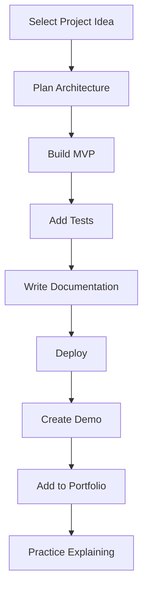
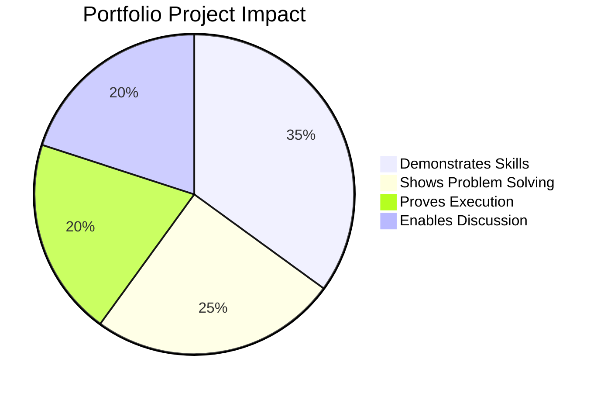

# 108 - Portfolio Projects

## Introduction

Portfolio projects are tangible demonstrations of your skills, creativity, and ability to deliver results. In the tech industry, a strong portfolio can differentiate you from other candidates, especially when you lack extensive professional experience or when switching careers. Projects show interviewers not just what you know, but how you apply that knowledge to solve real problems. This comprehensive guide covers project selection strategy, documentation, deployment, presentation techniques, and how to effectively showcase your work during interviews.

A well-curated portfolio of 3-5 strong projects demonstrates technical proficiency, problem-solving ability, communication skills, and passion for your craft. This guide teaches you how to build, document, deploy, and present projects that impress interviewers and advance your career.

---

## Learning Roadmap

```
Week 1: Project Selection
  ├── Identify skill gaps to fill
  ├── Research impressive project types
  ├── Match projects to target roles
  └── Plan project scope and timeline

Week 2-4: Project Development
  ├── Build project with best practices
  ├── Write clean, documented code
  ├── Implement tests
  └── Handle edge cases

Week 5: Documentation
  ├── Write comprehensive README
  ├── Create architecture diagrams
  ├── Document design decisions
  └── Add usage instructions

Week 6: Deployment & Presentation
  ├── Deploy to production
  ├── Create demo/screenshots
  ├── Practice explaining the project
  └── Add to portfolio/resume
```

---

## Theory Notes

### Project Selection Strategy

#### The STAR-P Framework for Projects
- **S**pecific: Focused on solving one problem well
- **T**echnical: Demonstrates relevant technical skills
- **A**pplied: Solves a real-world problem
- **R**obust: Handles edge cases and is production-ready
- **P**resentable: Easy to understand and demonstrate

#### Types of Projects by Impact

1. **Full-Stack Applications**: Show end-to-end development skills
2. **Open Source Contributions**: Show collaboration and code quality
3. **Data Science/AI Projects**: Show analytical and ML skills
4. **System Design Projects**: Show architecture and scalability thinking
5. **Developer Tools/Utilities**: Show developer experience focus
6. **Mobile Applications**: Show cross-platform or native skills
7. **APIs/Services**: Show backend and integration skills

#### Matching Projects to Target Roles

| Target Role | Ideal Project Types |
|------------|-------------------|
| Frontend Engineer | React/Vue apps, interactive UIs, design systems |
| Backend Engineer | APIs, microservices, database-heavy applications |
| Full-Stack Engineer | Complete web apps with frontend and backend |
| Data Engineer | ETL pipelines, data warehouses, streaming systems |
| ML Engineer | Model training pipelines, inference services |
| DevOps Engineer | CI/CD pipelines, infrastructure as code |
| Mobile Engineer | iOS/Android apps, cross-platform solutions |

### Project Complexity Tiers

#### Tier 1: Basic (0-6 months experience)
- Simple CRUD applications
- Single-page applications
- Basic API endpoints
- Command-line tools

#### Tier 2: Intermediate (6-18 months experience)
- Full-stack applications with authentication
- Database design with complex queries
- Third-party API integrations
- Basic deployment and CI/CD

#### Tier 3: Advanced (18+ months experience)
- Distributed systems
- Real-time applications
- Machine learning pipelines
- Open source contributions with community adoption

---

## Key Concepts

### Project Documentation Best Practices

#### README Structure
1. **Project Title and Description**: What it does and why
2. **Features**: Key functionality
3. **Tech Stack**: Technologies used
4. **Architecture**: System design overview
5. **Setup Instructions**: How to run locally
6. **API Documentation**: Endpoints and usage
7. **Screenshots/Demo**: Visual representation
8. **Future Improvements**: What you'd add next
9. **Contributing Guidelines**: If open source
10. **License**: Usage terms

### Code Quality Indicators

- Consistent naming conventions
- Proper error handling
- Comprehensive comments (where needed)
- Unit and integration tests
- Code review readiness
- Linting and formatting applied

### Deployment Strategies

#### Frontend
- Vercel (React, Next.js)
- Netlify (static sites)
- GitHub Pages (documentation sites)
- AWS S3 + CloudFront (scalable)

#### Backend
- Heroku (quick deployment)
- AWS EC2/ECS (scalable)
- Google Cloud Run (serverless)
- Railway (modern PaaS)

#### Full-Stack
- Vercel + PlanetScale
- AWS (full stack)
- Render (simplified deployment)

### Demo Preparation

- Create a live demo URL
- Record a 2-3 minute walkthrough video
- Prepare screenshots for documentation
- Have a backup plan for demo failures
- Practice explaining the project clearly

---

## FAQ (20+ Q&A)

### Q1: How many projects should I have in my portfolio?
**A:** 3-5 strong projects are ideal. Quality over quantity - each should demonstrate different skills.

### Q2: Should I build projects from scratch or contribute to open source?
**A:** Both are valuable. Building from scratch shows creation skills; open source shows collaboration and code quality.

### Q3: How long should each project take?
**A:** 2-6 weeks for a focused project. Don't let projects drag on - finish and move to the next.

### Q4: Should I use tutorial projects in my portfolio?
**A:** Only if you've significantly modified and extended them. Tutorial projects don't demonstrate original thinking.

### Q5: How do I make my project stand out?
**A:** Solve a real problem, implement great UX, add tests, deploy it live, and write excellent documentation.

### Q6: Should I include class projects or bootcamp projects?
**A:** If they demonstrate strong skills and you've added significant features beyond the requirements.

### Q7: How do I choose what technologies to use?
**A:** Match the tech stack to your target role. If targeting React roles, build React projects.

### Q8: Should my projects be related to each other?
**A:** Not necessarily. Diverse projects show breadth. A cohesive portfolio shows depth in an area.

### Q9: How do I handle project failures or abandoned projects?
**A:** Don't include incomplete or poorly executed projects. One strong project is better than several mediocre ones.

### Q10: Should I deploy my projects?
**A:** Yes. Live projects demonstrate production-readiness and make demos easier.

### Q11: How do I document my projects effectively?
**A:** Write clear READMEs with setup instructions, architecture diagrams, and demo links. Show, don't just tell.

### Q12: What if my project isn't technically complex?
**A:** Focus on user experience, code quality, documentation, and the problem it solves. Not every project needs to be technically complex.

### Q13: Should I include personal projects that aren't work-related?
**A:** Yes. Passion projects show genuine interest and creativity.

### Q14: How do I talk about projects in interviews?
**A:** Use the STAR method: Situation (problem), Task (your role), Action (what you built), Results (impact).

### Q15: Should I put all projects on GitHub?
**A:** Yes. Clean, well-documented GitHub repositories demonstrate code quality and professionalism.

### Q16: How do I handle project scope creep?
**A:** Define clear MVP requirements upfront. Finish the core, then add enhancements if time permits.

### Q17: What makes a bad portfolio project?
**A:** Tutorial copies, poorly documented code, broken deployments, unclear purpose, no tests.

### Q18: Should I include screenshots or video demos?
**A:** Both. Screenshots in README, video demos for presentations and interviews.

### Q19: How do I show collaboration in personal projects?
**A:** Include contributions to open source, pair programming sessions, or projects with collaborators.

### Q20: Should I rebuild old projects?
**A:** If they're outdated or poorly executed, yes. Show growth and improvement over time.

---

## Hands-on Practice

### Exercise 1: Project Idea Generation
Brainstorm 10 project ideas that:
- Solve a real problem you or others face
- Use technologies relevant to your target role
- Can be completed in 2-4 weeks
- Would be impressive to interviewers

### Exercise 2: Project Planning
For your top project idea, create:
- Feature list (MVP and enhancements)
- Technical architecture diagram
- Database schema (if applicable)
- API endpoints (if applicable)
- Timeline with milestones

### Exercise 3: README Writing
Write a comprehensive README for an existing project including:
- Clear description
- Feature list
- Tech stack
- Setup instructions
- Screenshots/demo link
- Architecture overview

### Exercise 4: Demo Preparation
Create a 2-minute demo of a project:
- Record a screen walkthrough
- Practice explaining the technical decisions
- Prepare for follow-up questions
- Have a live demo ready

### Exercise 5: Project Code Review
Review your project code with a focus on:
- Code organization
- Error handling
- Test coverage
- Documentation
- Performance considerations

---

## FAANG Questions

### FAANG Project Discussion Questions

#### Amazon
1. Tell me about a project where you had to make technical trade-offs.
2. Describe a project where you had to scale for high traffic.
3. How did you handle deployment and operations for a project?

#### Google
4. Explain the architecture of your most complex project.
5. How would you redesign your project if you had to start over?
6. What would you do differently if you had unlimited time?

#### Meta
7. Tell me about a project where you had to move fast.
8. How did you measure the success of your project?
9. Describe a project where you had to balance speed and quality.

#### Apple
10. How did you ensure the user experience was excellent?
11. Tell me about a project where you obsessed over details.
12. How did you handle privacy and security in your project?

#### Microsoft
13. Tell me about a project where you had to learn something new.
14. How did you collaborate with others on the project?
15. What was the most challenging technical problem you solved?

---

## Common Mistakes

### Mistake 1: Too Many Small Projects
3-5 strong projects are better than 15 half-finished ones. Quality over quantity.

### Mistake 2: No Documentation
Code without documentation is hard to understand and looks unprofessional.

### Mistake 3: Not Deploying
Projects that can't be seen live lose impact. Always deploy your work.

### Mistake 4: Tutorial Copies
Portfolio projects should demonstrate original thinking, not tutorial following.

### Mistake 5: No Tests
Projects without tests signal poor engineering practices.

### Mistake 6: Ignoring UX
Even backend projects should have a reasonable user interface for demos.

### Mistake 7: Outdated Technology
Using outdated stacks signals you're not keeping current with industry trends.

### Mistake 8: No Clear Purpose
Projects should solve a specific problem, not just demonstrate technology.

---

## Best Practices

1. **Solve Real Problems**: Build projects that address genuine needs
2. **Focus on Quality**: Clean code, tests, documentation
3. **Deploy Everything**: Live demos are more impressive than screenshots
4. **Document Thoroughly**: READMEs should explain everything
5. **Match Target Role**: Tech stack should align with what companies use
6. **Show Growth**: Include projects of varying complexity
7. **Practice Presenting**: Be able to explain any project in 2 minutes
8. **Keep Updated**: Maintain and improve projects over time
9. **Get Feedback**: Have others review your projects before sharing
10. **Be Proud**: Show enthusiasm when discussing your work

---

## Cheat Sheet

```
PORTFOLIO PROJECTS CHEAT SHEET
==============================

PROJECT SELECTION:
□ Solves a real problem
□ Matches target role
□ Completable in 2-4 weeks
□ Technically interesting
□ Demonstrates multiple skills

README STRUCTURE:
□ Title and description
□ Features list
□ Tech stack
□ Architecture diagram
□ Setup instructions
□ API documentation
□ Screenshots/demo
□ Future improvements
□ Contributing guidelines
□ License

CODE QUALITY:
□ Consistent naming
□ Error handling
□ Comments (where needed)
□ Unit tests
□ Integration tests
□ Linting applied
□ Formatting consistent

DEPLOYMENT OPTIONS:
Frontend: Vercel, Netlify, GitHub Pages
Backend: Heroku, AWS, Google Cloud
Full-Stack: Vercel+PlanetScale, Render

DEMO PREPARATION:
□ Live demo URL
□ 2-minute walkthrough video
□ Screenshots in README
□ Backup for failures
□ Clear explanation ready

PROJECT TIERS:
Tier 1 (Basic): CRUD apps, CLI tools
Tier 2 (Intermediate): Full-stack, auth, APIs
Tier 3 (Advanced): Distributed systems, ML, open source

INTERVIEW TALKING POINTS:
□ Problem you solved
□ Your specific contributions
□ Technical decisions made
□ Challenges overcome
□ Results and impact
□ What you'd improve
```

---

## Flash Cards (20)

### Card 1
**Q:** How many projects should be in a strong portfolio?
**A:** 3-5 projects that demonstrate different skills and technologies.

### Card 2
**Q:** What's the most important section of a project README?
**A:** A clear description of what the project does and why it exists.

### Card 3
**Q:** Should you deploy your portfolio projects?
**A:** Yes. Live demos are much more impressive than screenshots alone.

### Card 4
**Q:** What makes a bad portfolio project?
**A:** Tutorial copies, no documentation, broken deployments, unclear purpose.

### Card 5
**Q:** How do you match projects to target roles?
**A:** Use the same tech stack that companies in your target role use.

### Card 6
**Q:** What's the STAR-P framework for projects?
**A:** Specific, Technical, Applied, Robust, Presentable.

### Card 7
**Q:** Should you include class/bootcamp projects?
**A:** Only if you've significantly extended them beyond original requirements.

### Card 8
**Q:** How long should a project take?
**A:** 2-6 weeks for a focused, well-executed project.

### Card 9
**Q:** What's the value of open source contributions?
**A:** They show collaboration, code quality, and ability to work with others' codebases.

### Card 10
**Q:** How do you handle project failures?
**A:** Don't include them. One strong project beats several mediocre ones.

### Card 11
**Q:** Should all projects use the same technology?
**A:** No. Diverse projects show breadth. A cohesive set shows depth in an area.

### Card 12
**Q:** What documentation is essential?
**A:** Clear README with setup instructions, architecture overview, and demo link.

### Card 13
**Q:** How do you talk about projects in interviews?
**A:** Use STAR: Situation, Task, Action, Results. Focus on your contributions.

### Card 14
**Q:** Should you put projects on GitHub?
**A:** Yes. Clean repositories demonstrate code quality and professionalism.

### Card 15
**Q:** What if your project isn't technically complex?
**A:** Focus on UX, code quality, documentation, and the problem solved.

### Card 16
**Q:** How do you show collaboration?
**A:** Through open source contributions, pair programming, or team projects.

### Card 17
**Q:** Should you rebuild old projects?
**A:** If outdated or poorly executed, yes. Show growth and improvement.

### Card 18
**Q:** What's the biggest project mistake?
**A:** Having no live demo or poor documentation.

### Card 19
**Q:** How do you handle scope creep?
**A:** Define MVP upfront, finish core features, then add enhancements.

### Card 20
**Q:** Should you include screenshots or video demos?
**A:** Both. Screenshots in README, videos for presentations.

---

## Mind Map

```
                 PORTFOLIO PROJECTS
                      |
       ┌──────────────┼──────────────┐
       |              |              |
   SELECTION      BUILDING      PRESENTATION
       |              |              |
  ┌────┴────┐    ┌────┴────┐    ┌────┴────┐
  |         |    |         |    |         |
Target   Real   Code    Tests  README  Demo
Role     Problem Quality       Deploy  Talk
```

---

## Mermaid Diagrams

### Project Development Flow


### Portfolio Impact


---

## Code Examples

```python
# Portfolio Project Tracker

from dataclasses import dataclass, field
from typing import List, Dict, Optional
from datetime import datetime
from enum import Enum

class ProjectStatus(Enum):
    IDEA = "Idea"
    PLANNING = "Planning"
    IN_PROGRESS = "In Progress"
    TESTING = "Testing"
    DOCUMENTATION = "Documentation"
    DEPLOYED = "Deployed"
    MAINTAINED = "Maintained"

class ProjectTier(Enum):
    BASIC = 1
    INTERMEDIATE = 2
    ADVANCED = 3

@dataclass
class PortfolioProject:
    name: str
    description: str
    tech_stack: List[str]
    tier: ProjectTier
    status: ProjectStatus = ProjectStatus.IDEA
    repo_url: Optional[str] = None
    demo_url: Optional[str] = None
    start_date: Optional[datetime] = None
    completion_date: Optional[datetime] = None
    features: List[str] = field(default_factory=list)
    skills_demonstrated: List[str] = field(default_factory=list)
    readme_complete: bool = False
    tests_complete: bool = False
    deployed: bool = False
    
    @property
    def completion_percentage(self) -> float:
        checks = [
            self.readme_complete,
            self.tests_complete,
            self.deployed,
            self.status in [ProjectStatus.DEPLOYED, ProjectStatus.MAINTAINED]
        ]
        return sum(checks) / len(checks) * 100
    
    def to_resume_bullets(self) -> List[str]:
        bullets = []
        bullets.append(f"**{self.name}**: {self.description}")
        bullets.append(f"- Tech: {', '.join(self.tech_stack)}")
        if self.demo_url:
            bullets.append(f"- Live: {self.demo_url}")
        if self.repo_url:
            bullets.append(f"- GitHub: {self.repo_url}")
        return bullets

class PortfolioManager:
    def __init__(self):
        self.projects: List[PortfolioProject] = []
    
    def add_project(self, project: PortfolioProject):
        self.projects.append(project)
    
    def get_projects_by_status(self, status: ProjectStatus) -> List[PortfolioProject]:
        return [p for p in self.projects if p.status == status]
    
    def get_projects_by_tier(self, tier: ProjectTier) -> List[PortfolioProject]:
        return [p for p in self.projects if p.tier == tier]
    
    def calculate_portfolio_strength(self) -> Dict:
        """Calculate overall portfolio strength score."""
        if not self.projects:
            return {"score": 0, "message": "No projects in portfolio"}
        
        # Factor 1: Project diversity (tech stack)
        all_tech = set()
        for p in self.projects:
            all_tech.update(p.tech_stack)
        tech_diversity = min(10, len(all_tech))
        
        # Factor 2: Tier distribution
        tier_counts = {
            ProjectTier.BASIC: 0,
            ProjectTier.INTERMEDIATE: 0,
            ProjectTier.ADVANCED: 0
        }
        for p in self.projects:
            tier_counts[p.tier] += 1
        
        tier_score = (
            tier_counts[ProjectTier.BASIC] * 2 +
            tier_counts[ProjectTier.INTERMEDIATE] * 5 +
            tier_counts[ProjectTier.ADVANCED] * 8
        ) / len(self.projects)
        
        # Factor 3: Completion rate
        completed = sum(1 for p in self.projects if p.deployed)
        completion_rate = completed / len(self.projects) * 10
        
        # Factor 4: Documentation quality
        documented = sum(1 for p in self.projects if p.readme_complete)
        doc_score = documented / len(self.projects) * 10
        
        # Factor 5: Testing
        tested = sum(1 for p in self.projects if p.tests_complete)
        test_score = tested / len(self.projects) * 10
        
        overall_score = (
            tech_diversity * 0.2 +
            tier_score * 0.3 +
            completion_rate * 0.2 +
            doc_score * 0.15 +
            test_score * 0.15
        )
        
        return {
            "overall_score": round(overall_score, 1),
            "tech_diversity": round(tech_diversity, 1),
            "tier_score": round(tier_score, 1),
            "completion_rate": round(completion_rate, 1),
            "documentation_score": round(doc_score, 1),
            "testing_score": round(test_score, 1),
            "total_projects": len(self.projects),
            "completed_projects": completed
        }
    
    def generate_resume_section(self) -> str:
        """Generate resume-ready project section."""
        output = "\nPORTFOLIO PROJECTS\n"
        output += "=" * 50 + "\n"
        
        # Sort by tier (advanced first)
        sorted_projects = sorted(self.projects, key=lambda p: p.tier.value, reverse=True)
        
        for project in sorted_projects:
            output += f"\n{project.name}\n"
            output += f"  {project.description}\n"
            output += f"  Tech: {', '.join(project.tech_stack)}\n"
            if project.demo_url:
                output += f"  Demo: {project.demo_url}\n"
            if project.repo_url:
                output += f"  GitHub: {project.repo_url}\n"
            if project.features:
                output += "  Features:\n"
                for feature in project.features[:5]:
                    output += f"    • {feature}\n"
        
        return output
    
    def identify_gaps(self) -> List[Dict]:
        """Identify gaps in the portfolio."""
        gaps = []
        
        # Check tech stack diversity
        all_tech = set()
        for p in self.projects:
            all_tech.update(p.tech_stack)
        
        target_tech = {"React", "Node.js", "Python", "SQL", "AWS"}
        missing_tech = target_tech - all_tech
        
        if missing_tech:
            gaps.append({
                "type": "Technology",
                "description": f"Missing experience with: {', '.join(missing_tech)}",
                "recommendation": "Consider a project using these technologies"
            })
        
        # Check tier distribution
        advanced_projects = self.get_projects_by_tier(ProjectTier.ADVANCED)
        if len(advanced_projects) < 2:
            gaps.append({
                "type": "Complexity",
                "description": "Need more advanced projects",
                "recommendation": "Build a project demonstrating distributed systems or complex architecture"
            })
        
        # Check deployment
        deployed = sum(1 for p in self.projects if p.deployed)
        if deployed < len(self.projects) * 0.8:
            gaps.append({
                "type": "Deployment",
                "description": "Not all projects are deployed",
                "recommendation": "Deploy remaining projects for live demos"
            })
        
        return gaps

# Example usage
portfolio = PortfolioManager()

# Add projects
portfolio.add_project(PortfolioProject(
    name="TaskFlow",
    description="A collaborative project management tool with real-time updates",
    tech_stack=["React", "Node.js", "PostgreSQL", "Socket.io", "Redis"],
    tier=ProjectTier.ADVANCED,
    status=ProjectStatus.DEPLOYED,
    repo_url="https://github.com/username/taskflow",
    demo_url="https://taskflow.vercel.app",
    features=[
        "Real-time collaboration",
        "Kanban board",
        "User authentication",
        "Team management"
    ],
    skills_demonstrated=["Full-stack development", "Real-time systems", "Database design"],
    readme_complete=True,
    tests_complete=True,
    deployed=True
))

portfolio.add_project(PortfolioProject(
    name="DataPipeline",
    description="ETL pipeline for processing and analyzing large datasets",
    tech_stack=["Python", "Apache Airflow", "AWS S3", "Pandas", "SQL"],
    tier=ProjectTier.INTERMEDIATE,
    status=ProjectStatus.DEPLOYED,
    repo_url="https://github.com/username/datapipeline",
    features=[
        "Automated data extraction",
        "Data validation",
        "Transform and load",
        "Monitoring dashboard"
    ],
    skills_demonstrated=["Data engineering", "ETL", "Cloud services"],
    readme_complete=True,
    tests_complete=True,
    deployed=True
))

portfolio.add_project(PortfolioProject(
    name="URLShortener",
    description="A URL shortening service with analytics",
    tech_stack=["Go", "Redis", "PostgreSQL", "Docker"],
    tier=ProjectTier.INTERMEDIATE,
    status=ProjectStatus.DEPLOYED,
    repo_url="https://github.com/username/urlshortener",
    demo_url="https://urlshort.example.com",
    features=[
        "URL shortening",
        "Click analytics",
        "Rate limiting",
        "Custom aliases"
    ],
    skills_demonstrated=["Backend development", "Caching", "API design"],
    readme_complete=True,
    tests_complete=False,
    deployed=True
))

# Analyze portfolio
strength = portfolio.calculate_portfolio_strength()
print(f"\nPortfolio Strength Score: {strength['overall_score']}/10")
print(f"Projects: {strength['total_projects']}")
print(f"Completed: {strength['completed_projects']}")

# Get resume section
resume_section = portfolio.generate_resume_section()
print(resume_section)

# Identify gaps
gaps = portfolio.identify_gaps()
if gaps:
    print("\nPORTFOLIO GAPS:")
    for gap in gaps:
        print(f"  {gap['type']}: {gap['description']}")
        print(f"    → {gap['recommendation']}")
```

---

## Resources

### Project Ideas by Domain
- **E-commerce**: Full-stack store with cart, payments, admin
- **Social**: Chat app, forum, social network clone
- **Productivity**: Task manager, note-taking app, calendar
- **Developer Tools**: CLI tool, VS Code extension, API
- **Data**: Dashboard, analytics tool, data pipeline

### Deployment Platforms
- [Vercel](https://vercel.com) - Frontend deployment
- [Heroku](https://heroku.com) - Full-stack deployment
- [AWS](https://aws.amazon.com) - Cloud services
- [Railway](https://railway.app) - Modern PaaS

---

## Checklist

- [ ] Selected 3-5 project ideas
- [ ] Planned architecture for each
- [ ] Built MVP with clean code
- [ ] Added tests (unit + integration)
- [ ] Wrote comprehensive README
- [ ] Deployed all projects
- [ ] Created demo/screenshots
- [ ] Added to GitHub profile
- [ ] Updated resume with projects
- [ ] Practiced explaining each project
- [ ] Got feedback on projects
- [ ] Maintained and updated projects

---

## Mock Interviews

### Project Discussion Practice

**Questions to practice answering:**
1. "Walk me through your most complex project."
2. "What technical decisions did you make and why?"
3. "What would you do differently?"
4. "How did you handle challenges?"
5. "What did you learn from this project?"

---

## Difficulty Rating

| Aspect | Rating (1-10) | Notes |
|--------|---------------|-------|
| Project Selection | 5/10 | Requires strategic thinking |
| Building Projects | 7/10 | Technical effort required |
| Documentation | 5/10 | Writing skills needed |
| Deployment | 4/10 | Platform tools make it easy |
| Presentation | 6/10 | Practice helps significantly |
| Overall Difficulty | 6/10 | Moderate; high impact |

---

## Summary

Portfolio projects are powerful differentiators in the job market. Focus on quality over quantity, solve real problems, deploy your work, and document everything. Each project should demonstrate different skills and technologies relevant to your target role. Practice explaining your projects clearly and be prepared for deep technical questions about your design decisions. A strong portfolio of 3-5 projects, well-documented and deployed, can be more impressive than years of experience at the wrong companies.
