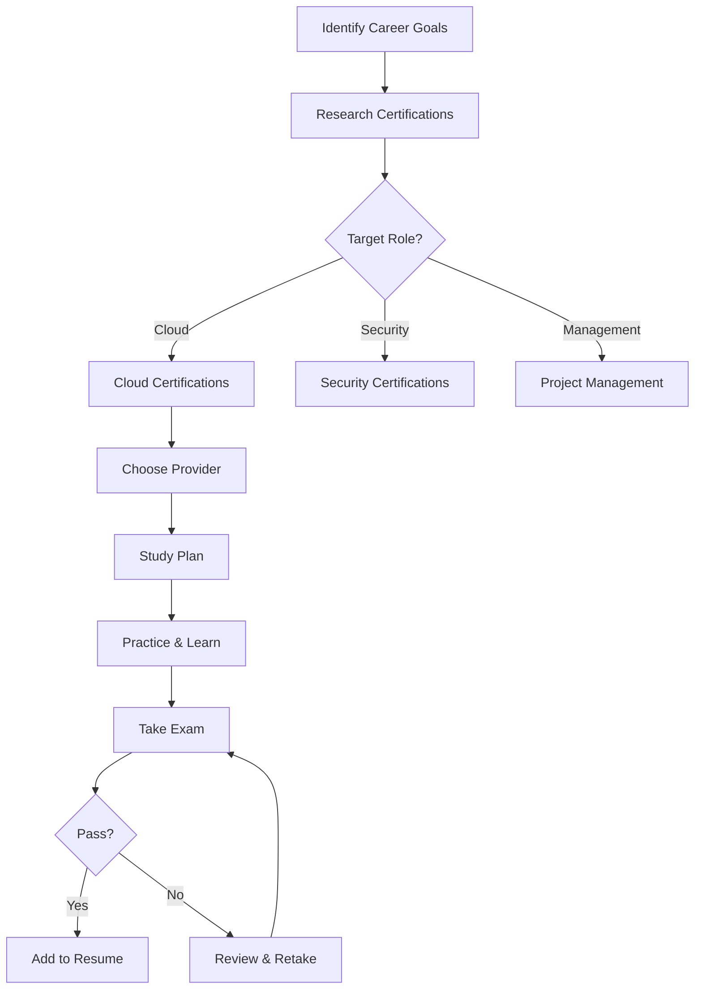
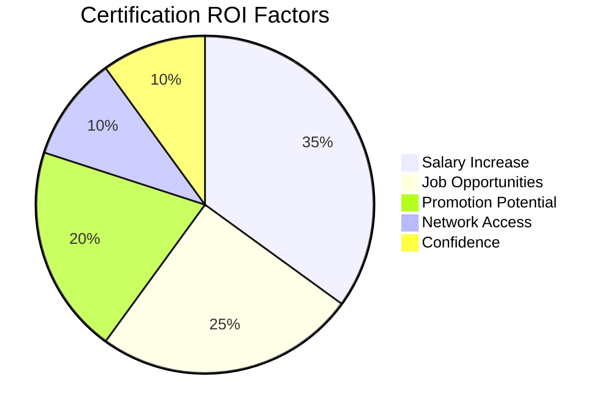

# 109 - Certifications

## Introduction

Professional certifications validate your expertise, demonstrate commitment to your field, and can significantly boost your career prospects. In the tech industry, certifications from major cloud providers (AWS, Azure, GCP), programming languages, project management frameworks, and security domains are highly valued. This comprehensive guide covers the most valuable certifications, study strategies, ROI analysis, and how to leverage certifications in your career.

Certifications aren't just about passing an exam - they demonstrate structured learning, commitment to professional development, and verified competency. This guide helps you choose the right certifications, prepare effectively, and maximize the return on your investment.

---

## Learning Roadmap

```
Phase 1: Research & Selection (2 weeks)
  ├── Identify career goals
  ├── Research certification requirements
  ├── Evaluate ROI of different certs
  └── Choose target certifications

Phase 2: Preparation (4-12 weeks per cert)
  ├── Study official materials
  ├── Complete hands-on labs
  ├── Take practice exams
  └── Schedule exam date

Phase 3: Certification & Maintenance
  ├── Pass the exam
  ├── Update resume and LinkedIn
  ├── Apply skills in projects
  └── Plan recertification
```

---

## Theory Notes

### Cloud Certifications

#### AWS Certifications
- **Cloud Practitioner**: Foundational, non-technical
- **Solutions Architect Associate**: Architecture and design
- **Developer Associate**: Development and deployment
- **SysOps Administrator Associate**: Operations and management
- **Solutions Architect Professional**: Advanced architecture
- **DevOps Engineer Professional**: Advanced DevOps
- **Specialty Certifications**: Security, ML, Data Analytics, etc.

#### Azure Certifications
- **AZ-900**: Azure Fundamentals
- **AZ-204**: Azure Developer Associate
- **AZ-104**: Azure Administrator Associate
- **AZ-400**: Azure DevOps Engineer Expert
- **AZ-305**: Azure Solutions Architect Expert
- **Specialty**: AI Engineer, Data Engineer, Security Engineer

#### Google Cloud Certifications
- **Cloud Digital Leader**: Foundational
- **Associate Cloud Engineer**: Entry-level operations
- **Professional Cloud Architect**: Architecture design
- **Professional Data Engineer**: Data processing
- **Professional ML Engineer**: Machine learning
- **Professional DevOps Engineer**: DevOps practices

### Programming Certifications

#### Python
- **PCAP**: Certified Associate in Python Programming
- **PCPP**: Certified Professional in Python Programming
- **PCEP**: Entry-level Python certification

#### Java
- **Oracle Certified Associate (OCA)**: Java SE Programmer
- **Oracle Certified Professional (OCP)**: Advanced Java
- **Spring Professional**: Spring framework expertise

#### JavaScript
- **ECMAScript certifications**
- **Node.js certifications**
- **React/Angular/Vue certifications**

### Project Management

- **PMP**: Project Management Professional
- **CAPM**: Certified Associate in Project Management
- **Scrum Master (CSM/PSM)**
- **Agile Certified Practitioner (PMI-ACP)**
- **PRINCE2**: Foundation and Practitioner

### Security Certifications

- **CompTIA Security+**: Entry-level security
- **CISSP**: Certified Information Systems Security Professional
- **CEH**: Certified Ethical Hacker
- **CISM**: Certified Information Security Manager
- **CISA**: Certified Information Systems Auditor

---

## Key Concepts

### Certification ROI Framework

#### Direct Benefits
- **Salary Increase**: Average 5-20% salary boost
- **Job Opportunities**: More interview calls
- **Promotion Potential**: Qualification for senior roles
- **Freelancing**: Higher rates for certified professionals

#### Indirect Benefits
- **Structured Learning**: Systematic knowledge acquisition
- **Industry Recognition**: Credibility with employers
- **Network Access**: Certification communities and events
- **Confidence**: Verified competency boosts confidence

### Study Strategy Framework

#### The 70-20-10 Learning Model
- **70% Hands-on Practice**: Labs, projects, real-world scenarios
- **20% Social Learning**: Study groups, forums, mentorship
- **10% Formal Learning**: Books, courses, documentation

#### Spaced Repetition for Certifications
- Review material at increasing intervals
- Use flashcards for key concepts
- Practice exams regularly
- Focus on weak areas

### Certification Maintenance

Most certifications require:
- **Renewal**: Every 2-3 years
- **Continuing Education**: Earn credits through training
- **Re-examination**: Some require retaking the exam
- **Activity Requirements**: Contribute to the community

---

## FAQ (20+ Q&A)

### Q1: Are certifications worth the time and money?
**A:** Yes, for most professionals. Studies show certifications correlate with higher salaries and more job opportunities. The ROI is typically positive within 6-12 months.

### Q2: Which cloud certification should I start with?
**A:** Start with the provider your target companies use. If unsure, AWS Cloud Practitioner or Azure Fundamentals are good entry points.

### Q3: How long does it take to prepare for a certification?
**A:** Typically 4-12 weeks depending on the certification and your existing knowledge. Associate-level certs usually take 4-6 weeks.

### Q4: Do certifications replace experience?
**A:** No. Certifications complement experience. They're most valuable when combined with practical skills.

### Q5: How much do certifications cost?
**A:** Varies widely. Cloud certs: $150-$300. Security certs: $300-$700. Project management: $400-$555. Some employers reimburse costs.

### Q6: Should I get certified before or after getting a job?
**A:** Both have value. Pre-job certifications help with hiring. On-the-job certifications support promotions and skill development.

### Q7: How do I prepare for certification exams?
**A:** Use official study materials, complete hands-on labs, take practice exams, and join study groups.

### Q8: Are online certification exams proctored?
**A:** Yes, most certification exams are proctored either at test centers or online with webcam monitoring.

### Q9: Can I retake the exam if I fail?
**A:** Yes, but there's usually a waiting period and retake fee. Some certifications offer multiple attempts.

### Q10: Do certifications expire?
**A:** Most do. Cloud certifications typically expire after 2-3 years and require renewal.

### Q11: How do I list certifications on my resume?
**A:** Create a dedicated "Certifications" section. Include certification name, issuing organization, date obtained, and expiration.

### Q12: Should I get multiple certifications?
**A:** Quality over quantity. Get certifications that align with your career goals. 2-3 relevant certs are better than 10 unrelated ones.

### Q13: Are bootcamp certifications valuable?
**A:** Bootcamp certificates demonstrate completion but are less recognized than industry certifications from major providers.

### Q14: How do I choose between AWS, Azure, and GCP?
**A:** Research which cloud provider your target companies use. AWS has the largest market share, Azure is strong in enterprise, GCP in data/ML.

### Q15: Do certifications guarantee a job?
**A:** No. They're one factor among many. Combine certifications with projects, experience, and networking.

### Q16: How do I maintain certifications?
**A:** Track renewal dates, earn continuing education credits, and stay current with the technology.

### Q17: Are free certifications valuable?
**A:** Some are. Google's Digital Leader, free tier cloud certifications, and open-source certifications can add value.

### Q18: Should I study full-time for certifications?
**A:** Usually not necessary. Consistent study over weeks is more effective than cramming.

### Q19: How do employers view certifications?
**A:** Most employers value them positively, especially for cloud and security roles. Some list them as requirements.

### Q20: Can I use certification study for interview prep?
**A:** Absolutely. Certification study covers fundamental concepts that are frequently asked in interviews.

### Q21: What's the most in-demand certification in 2024?
**A:** AWS Solutions Architect, Azure Administrator, and CISSP are consistently among the most requested.

---

## Hands-on Practice

### Exercise 1: Certification Research
Research 5 certifications relevant to your career goals:
- Requirements and prerequisites
- Exam format and duration
- Cost and study materials
- Success rates and difficulty

### Exercise 2: Study Plan Creation
Create a 6-week study plan for a target certification:
- Week 1-2: Core concepts
- Week 3-4: Advanced topics
- Week 5: Practice exams
- Week 6: Review and exam

### Exercise 3: Practice Exam
Take a practice exam for your target certification:
- Identify weak areas
- Create a study plan for gaps
- Review explanations for wrong answers
- Track your score over time

### Exercise 4: Hands-On Lab
Complete a hands-on lab related to your certification:
- Set up a sandbox environment
- Follow along with official tutorials
- Document what you learned
- Apply concepts in a personal project

### Exercise 5: ROI Calculation
Calculate the potential ROI of a certification:
- Cost (exam + study materials + time)
- Expected salary increase
- Job opportunity improvement
- Timeline to recoup investment

---

## FAANG Questions

### FAANG Certification Preferences

#### Amazon
- **Preferred**: AWS certifications (especially Solutions Architect)
- **Valued**: Security certifications for security roles
- **Not Required**: But demonstrates cloud expertise

#### Google
- **Preferred**: GCP Professional certifications
- **Valued**: Data and ML certifications
- **Strong Signal**: Professional Cloud Architect

#### Meta
- **Preferred**: Cloud certifications (any provider)
- **Valued**: Security and infrastructure certifications
- **Good Signal**: Shows commitment to learning

#### Apple
- **Valued**: Platform-specific certifications
- **Preferred**: Security certifications
- **Good Signal**: Shows attention to detail

#### Microsoft
- **Preferred**: Azure certifications
- **Valued**: Security and DevOps certifications
- **Strong Signal**: Azure Solutions Architect Expert

---

## Common Mistakes

### Mistake 1: Getting Too Many Certifications
Focus on quality over quantity. 2-3 relevant certifications are more valuable than 10 unrelated ones.

### Mistake 2: Certifications Without Practice
Passing an exam without hands-on experience limits your actual ability.

### Mistake 3: Ignoring Renewal Requirements
Letting certifications expire wastes your investment. Track renewal dates.

### Mistake 4: Studying Only Practice Exams
Practice exams help, but deep understanding of concepts is more valuable.

### Mistake 5: Not Aligning with Career Goals
Get certifications that support your career path, not just whatever's popular.

### Mistake 6: Cramming for Exams
Spaced repetition over weeks is more effective than cramming in days.

### Mistake 7: Not Using Official Materials
Official study materials are the most accurate source for exam content.

### Mistake 8: Ignoring Hands-On Labs
Practical experience is what certifications validate. Don't skip the labs.

---

## Best Practices

1. **Choose Strategically**: Select certifications aligned with career goals
2. **Use Official Materials**: Study from the certification provider's resources
3. **Practice Hands-On**: Complete labs and projects alongside study
4. **Take Practice Exams**: Regular practice exams identify gaps
5. **Join Study Groups**: Learn from and teach others
6. **Schedule the Exam**: Having a date creates accountability
7. **Apply the Knowledge**: Use certification skills in real projects
8. **Track Renewal Dates**: Don't let certifications expire
9. **Leverage on Resume**: Highlight certifications prominently
10. **Continue Learning**: Certifications are starting points, not endpoints

---

## Cheat Sheet

```
CERTIFICATIONS CHEAT SHEET
==========================

CLOUD CERTIFICATIONS:
AWS:
  Cloud Practitioner (Foundational)
  Solutions Architect Associate
  Developer Associate
  SysOps Administrator Associate
  Solutions Architect Professional
  DevOps Engineer Professional

Azure:
  AZ-900 (Fundamentals)
  AZ-204 (Developer)
  AZ-104 (Administrator)
  AZ-400 (DevOps)
  AZ-305 (Solutions Architect)

GCP:
  Cloud Digital Leader
  Associate Cloud Engineer
  Professional Cloud Architect
  Professional Data Engineer
  Professional ML Engineer

SECURITY:
  CompTIA Security+ (Entry)
  CISSP (Advanced)
  CEH (Ethical Hacking)
  CISM (Management)
  CISA (Auditing)

PROJECT MANAGEMENT:
  PMP (Project Management)
  CSM/PSM (Scrum Master)
  PMI-ACP (Agile)
  PRINCE2 (Framework)

STUDY STRATEGY:
70-20-10 Model:
70% Hands-on Practice
20% Social Learning
10% Formal Study

PREPARATION TIMELINE:
Week 1-2: Core Concepts
Week 3-4: Advanced Topics
Week 5: Practice Exams
Week 6: Review & Exam

COSTS:
Cloud Certs: $150-$300
Security: $300-$700
Project Mgmt: $400-$555
Retake Fees: $100-$200

RENEWAL:
Most expire in 2-3 years
Track dates in calendar
Earn continuing education credits
```

---

## Flash Cards (20)

### Card 1
**Q:** What's the most popular cloud certification?
**A:** AWS Solutions Architect Associate is consistently the most requested.

### Card 2
**Q:** How long should you prepare for a certification?
**A:** 4-12 weeks depending on the certification and your existing knowledge.

### Card 3
**Q:** What's the 70-20-10 learning model?
**A:** 70% hands-on practice, 20% social learning, 10% formal study.

### Card 4
**Q:** Do certifications expire?
**A:** Most do. Cloud certs typically expire after 2-3 years.

### Card 5
**Q:** How much do AWS certifications cost?
**A:** Associate level: $150. Professional level: $300.

### Card 6
**Q:** What's CISSP?
**A:** Certified Information Systems Security Professional - an advanced security certification.

### Card 7
**Q:** Should you get certified before or after a job?
**A:** Both have value. Pre-job helps with hiring, on-the-job supports promotions.

### Card 8
**Q:** What's PMP?
**A:** Project Management Professional - a globally recognized project management certification.

### Card 9
**Q:** How do you maintain certifications?
**A:** Track renewal dates, earn continuing education credits, and sometimes retake exams.

### Card 10
**Q:** Do certifications replace experience?
**A:** No. They complement experience and demonstrate verified competency.

### Card 11
**Q:** What's the entry-level AWS certification?
**A:** Cloud Practitioner - covers basic cloud concepts.

### Card 12
**Q:** What Azure cert is good for developers?
**A:** AZ-204: Azure Developer Associate.

### Card 13
**Q:** What's the Google Cloud entry-level cert?
**A:** Associate Cloud Engineer.

### Card 14
**Q:** Are bootcamp certificates valuable?
**A:** Less than industry certifications, but they demonstrate completion of training.

### Card 15
**Q:** How do certifications affect salary?
**A:** Studies show 5-20% salary increase on average.

### Card 16
**Q:** What's the CSM certification?
**A:** Certified ScrumMaster - validates Scrum framework knowledge.

### Card 17
**Q:** Should you study full-time for certs?
**A:** Usually not. Consistent study over weeks is more effective than cramming.

### Card 18
**Q:** What's the best way to prepare?
**A:** Official materials + hands-on labs + practice exams.

### Card 19
**Q:** How many certifications should you have?
**A:** 2-3 relevant certifications are better than 10 unrelated ones.

### Card 20
**Q:** Can certification study help with interviews?
**A:** Yes. It covers fundamental concepts frequently asked in interviews.

---

## Mind Map

```
                 CERTIFICATIONS
                      |
       ┌──────────────┼──────────────┐
       |              |              |
    CLOUD         SECURITY      PROJECT MGMT
       |              |              |
  ┌────┴────┐    ┌────┴────┐    ┌────┴────┐
  |         |    |         |    |         |
AWS    Azure   Security+  CISSP  PMP    CSM
GCP          CEH  CISM  CISA  PMI-ACP PRINCE2
```

---

## Mermaid Diagrams

### Certification Decision Flow


### Certification ROI


---

## Code Examples

```python
# Certification Tracker and ROI Calculator

from dataclasses import dataclass, field
from typing import List, Dict, Optional
from datetime import datetime, timedelta
from enum import Enum

class CertStatus(Enum):
    PLANNED = "Planned"
    IN_PROGRESS = "In Progress"
    OBTAINED = "Obtained"
    EXPIRED = "Expired"
    RENEWED = "Renewed"

@dataclass
class Certification:
    name: str
    provider: str
    cost: float
    exam_date: Optional[datetime] = None
    expiry_date: Optional[datetime] = None
    status: CertStatus = CertStatus.PLANNED
    study_hours: int = 0
    passed: bool = False
    salary_impact_pct: float = 0.0
    
    @property
    def is_expired(self) -> bool:
        if self.expiry_date:
            return datetime.now() > self.expiry_date
        return False
    
    @property
    def days_until_expiry(self) -> Optional[int]:
        if self.expiry_date:
            return (self.expiry_date - datetime.now()).days
        return None

class CertificationTracker:
    def __init__(self, current_salary: float):
        self.current_salary = current_salary
        self.certifications: List[Certification] = []
    
    def add_certification(self, cert: Certification):
        self.certifications.append(cert)
    
    def calculate_roi(self, cert: Certification, years: int = 3) -> Dict:
        """Calculate ROI of a certification over specified years."""
        if not cert.passed:
            return {"message": "Certification not yet obtained"}
        
        annual_salary_increase = self.current_salary * (cert.salary_impact_pct / 100)
        total_salary_increase = annual_salary_increase * years
        total_cost = cert.cost + (cert.study_hours * 50)  # Assuming $50/hour value for study time
        
        roi = ((total_salary_increase - total_cost) / total_cost) * 100
        payback_months = total_cost / (annual_salary_increase / 12)
        
        return {
            "certification": cert.name,
            "cost": cert.cost,
            "study_hours": cert.study_hours,
            "study_time_value": cert.study_hours * 50,
            "total_investment": total_cost,
            "annual_salary_increase": annual_salary_increase,
            "total_salary_increase": total_salary_increase,
            "roi_percentage": round(roi, 1),
            "payback_months": round(payback_months, 1),
            "years_analyzed": years
        }
    
    def get_expiring_certs(self, within_days: int = 90) -> List[Certification]:
        """Get certifications expiring within specified days."""
        expiring = []
        for cert in self.certifications:
            if cert.expiry_date:
                days_left = cert.days_until_expiry
                if days_left is not None and 0 <= days_left <= within_days:
                    expiring.append(cert)
        return expiring
    
    def generate_study_plan(self, cert: Certification, weeks: int = 6) -> str:
        """Generate a study plan for a certification."""
        plan = f"\nSTUDY PLAN: {cert.name}"
        plan += f"\n{'='*50}"
        plan += f"\nDuration: {weeks} weeks"
        plan += f"\nTotal Hours: {cert.study_hours}"
        plan += f"\nWeekly Hours: {cert.study_hours // weeks}"
        
        weekly_hours = cert.study_hours // weeks
        
        phases = [
            ("Weeks 1-2", "Foundation", "Core concepts and fundamentals"),
            ("Weeks 3-4", "Deep Dive", "Advanced topics and hands-on labs"),
            ("Week 5", "Practice", "Practice exams and weak area focus"),
            ("Week 6", "Review", "Final review and exam preparation")
        ]
        
        plan += f"\n\nPHASES:"
        for weeks_label, phase_name, description in phases:
            plan += f"\n\n{weeks_label}: {phase_name}"
            plan += f"\n  {description}"
            plan += f"\n  Hours: {weekly_hours * 2 if 'Weeks 1-2' in weeks_label else weekly_hours}"
        
        plan += f"\n\nRESOURCES:"
        plan += f"\n  - Official study guide"
        plan += f"\n  - Hands-on labs"
        plan += f"\n  - Practice exams"
        plan += f"\n  - Community forums"
        
        return plan
    
    def generate_report(self) -> str:
        """Generate comprehensive certification report."""
        report = f"\n{'='*60}"
        report += f"\nCERTIFICATION TRACKER REPORT"
        report += f"\n{'='*60}"
        report += f"\nCurrent Salary: ${self.current_salary:,.0f}"
        report += f"\nTotal Certifications: {len(self.certifications)}"
        
        # Status breakdown
        status_counts = {}
        for cert in self.certifications:
            status = cert.status.value
            status_counts[status] = status_counts.get(status, 0) + 1
        
        report += f"\n\nSTATUS BREAKDOWN:"
        for status, count in status_counts.items():
            report += f"\n  {status}: {count}"
        
        # Obtained certifications
        obtained = [c for c in self.certifications if c.passed]
        if obtained:
            total_salary_impact = sum(c.salary_impact_pct for c in obtained)
            report += f"\n\nOBTAINED CERTIFICATIONS:"
            for cert in obtained:
                report += f"\n  {cert.name} ({cert.provider})"
                report += f"\n    Salary Impact: +{cert.salary_impact_pct}%"
                report += f"\n    Expiry: {cert.expiry_date.strftime('%Y-%m-%d') if cert.expiry_date else 'Never'}"
            
            report += f"\n\nTotal Salary Impact: +{total_salary_impact}%"
            report += f"\nEstimated Annual Increase: ${self.current_salary * total_salary_impact / 100:,.0f}"
        
        # Expiring soon
        expiring = self.get_expiring_certs(within_days=90)
        if expiring:
            report += f"\n\n⚠️  EXPIRING WITHIN 90 DAYS:"
            for cert in expiring:
                report += f"\n  {cert.name}: {cert.days_until_expiry} days left"
        
        return report

# Example usage
tracker = CertificationTracker(current_salary=120000)

# Add certifications
tracker.add_certification(Certification(
    name="AWS Solutions Architect Associate",
    provider="Amazon Web Services",
    cost=150,
    exam_date=datetime(2024, 3, 15),
    expiry_date=datetime(2027, 3, 15),
    status=CertStatus.OBTAINED,
    study_hours=80,
    passed=True,
    salary_impact_pct=8
))

tracker.add_certification(Certification(
    name="Azure Developer Associate",
    provider="Microsoft",
    cost=165,
    status=CertStatus.IN_PROGRESS,
    study_hours=60,
    salary_impact_pct=6
))

tracker.add_certification(Certification(
    name="CISSP",
    provider="ISC²",
    cost=749,
    status=CertStatus.PLANNED,
    study_hours=200,
    salary_impact_pct=15
))

# Generate report
print(tracker.generate_report())

# Calculate ROI for AWS cert
aws_roi = tracker.calculate_roi(tracker.certifications[0], years=3)
print(f"\nAWS Certification ROI (3 years):")
print(f"  Investment: ${aws_roi['total_investment']:,.0f}")
print(f"  Salary Increase: ${aws_roi['total_salary_increase']:,.0f}")
print(f"  ROI: {aws_roi['roi_percentage']}%")
print(f"  Payback: {aws_roi['payback_months']} months")

# Generate study plan for CISSP
cissp_plan = tracker.generate_study_plan(tracker.certifications[2], weeks=12)
print(cissp_plan)
```

---

## Resources

### Study Platforms
- [A Cloud Guru](https://acloudguru.com) - Cloud certifications
- [Linux Academy](https://linuxacademy.com) - Cloud and Linux
- [Whizlabs](https://whizlabs.com) - Practice exams
- [Coursera](https://coursera.org) - University-backed courses
- [Udemy](https://udemy.com) - Affordable certification courses

### Practice Exams
- [Tutorials Docto](https://tutorialsdojo.com) - AWS practice exams
- [MeasureUp](https://measureup.com) - Microsoft practice exams
- [Pocket Prep](https://pocketprep.com) - Mobile practice exams

---

## Checklist

- [ ] Identified career goals and target certifications
- [ ] Researched certification requirements and costs
- [ ] Calculated ROI for target certifications
- [ ] Created study plan (6-12 weeks)
- [ ] Obtained study materials
- [ ] Completed hands-on labs
- [ ] Taken practice exams
- [ ] Scheduled and passed exam
- [ ] Updated resume and LinkedIn
- [ ] Applied skills in projects
- [ ] Tracked renewal dates
- [ ] Planned next certification

---

## Mock Interviews

### Certification Discussion Questions

**Practice answering:**
1. "Tell me about your AWS certification experience."
2. "How has your certification helped in your work?"
3. "What did you learn while preparing for the exam?"
4. "How do you stay current with cloud technologies?"
5. "What certification would you recommend for our team?"

---

## Difficulty Rating

| Aspect | Rating (1-10) | Notes |
|--------|---------------|-------|
| Research Required | 4/10 | Well-documented certifications |
| Study Effort | 7/10 | Significant preparation needed |
| Cost | 6/10 | $150-$750 per exam |
| Time Investment | 7/10 | 4-12 weeks per certification |
| Career Impact | 8/10 | High value for career growth |
| Overall Difficulty | 6/10 | Moderate; high return |

---

## Summary

Certifications are valuable investments in your career that validate your expertise and open new opportunities. Choose certifications aligned with your career goals, prepare thoroughly using the 70-20-10 model, and leverage your certifications in job applications and interviews. Remember that certifications complement experience - they don't replace it. Track renewal dates, continue learning, and apply your certified skills in real projects to maximize the value of your investment.
