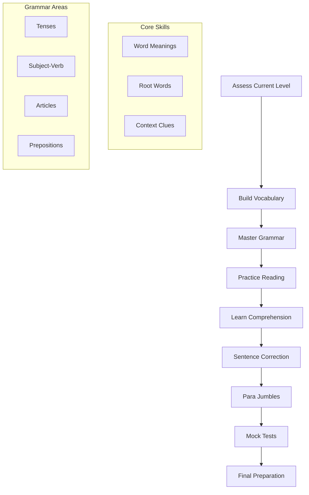
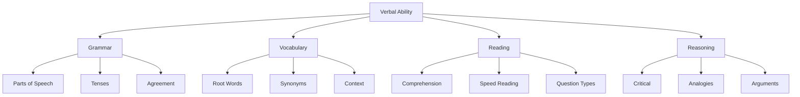
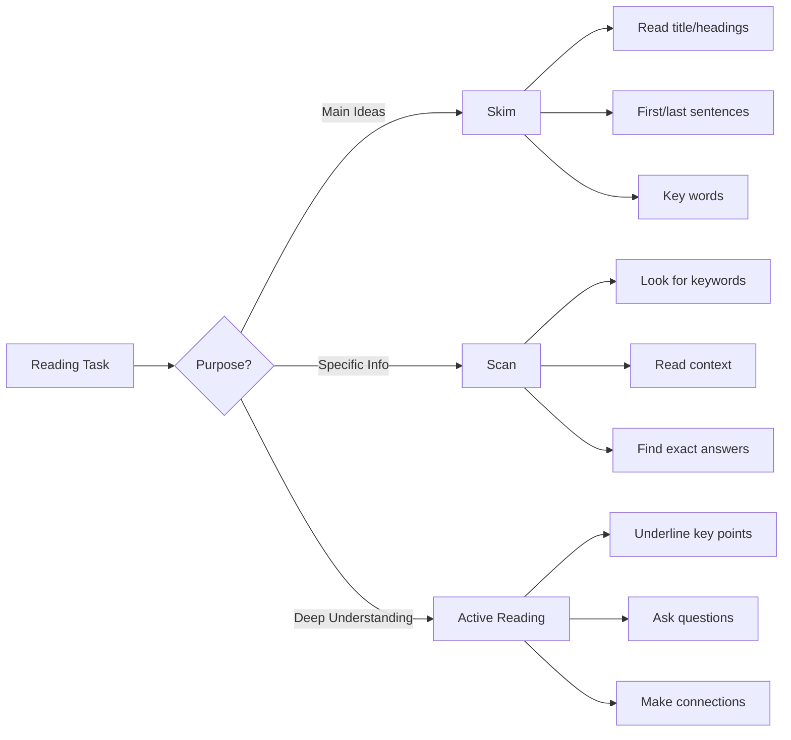
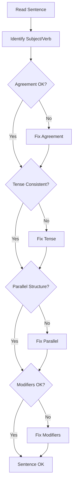
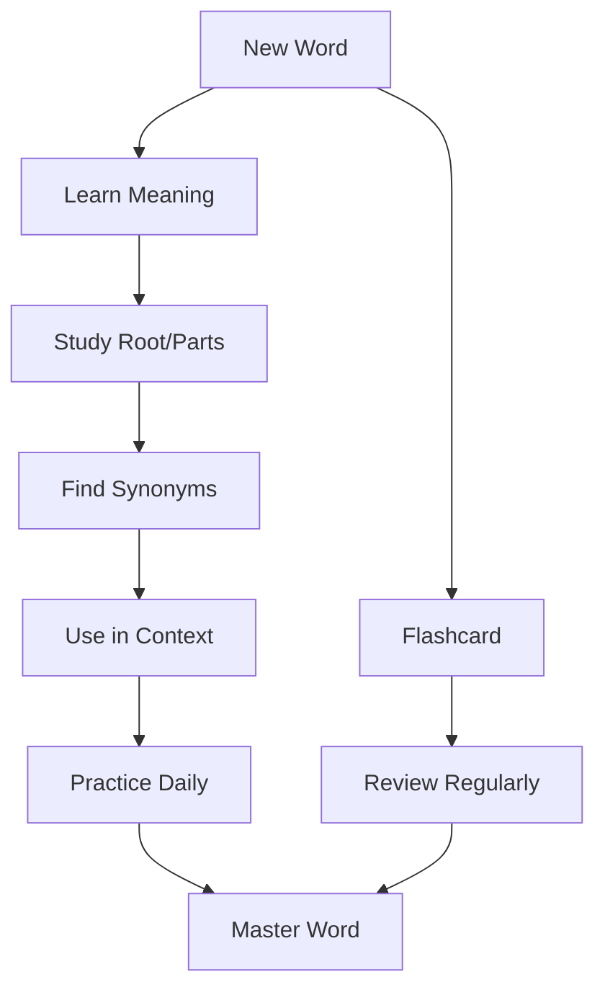

# Verbal Ability and Comprehension

## Introduction

**What is Verbal Ability?**
Verbal ability refers to the capacity to understand, use, and manipulate language effectively. It encompasses grammar, vocabulary, reading comprehension, sentence structure, and communication skills that are essential for professional success in any field.

**Why Does it Matter for Interviews?**
Verbal ability matters because:
- It's a core component of most aptitude tests
- It demonstrates communication skills
- It's essential for client-facing and leadership roles
- Companies use it to evaluate writing and comprehension abilities
- Strong verbal skills indicate clear thinking
- It's often used in consulting, marketing, and management roles

**Key Areas of Verbal Ability:**
1. **Grammar**: Sentence structure, tenses, agreement
2. **Vocabulary**: Synonyms, antonyms, word meanings
3. **Reading Comprehension**: Understanding passages
4. **Sentence Correction**: Fixing grammatical errors
5. **Para Jumbles**: Arranging sentences in order
6. **Fill in the Blanks**: Choosing appropriate words
7. **Verbal Analogies**: Word relationships
8. **Critical Reasoning**: Argument analysis

---

## Learning Roadmap

### Mermaid Diagram



### Topic-wise Timeline

| Topic | Days Required | Difficulty | Importance |
|-------|---------------|------------|------------|
| Vocabulary Building | Ongoing | Easy | High |
| Grammar Basics | 5-7 days | Easy | Very High |
| Reading Comprehension | 7-10 days | Medium | Very High |
| Sentence Correction | 5-7 days | Medium | High |
| Para Jumbles | 3-4 days | Medium | Medium |
| Fill in the Blanks | 3-4 days | Medium | Medium |
| Verbal Analogies | 3-4 days | Medium | Medium |
| Critical Reasoning | 5-7 days | Hard | High |

---

## Theory Notes

### Grammar Fundamentals

**Parts of Speech:**
1. **Noun**: Person, place, thing, idea
2. **Pronoun**: Replaces a noun
3. **Verb**: Action or state of being
4. **Adjective**: Modifies a noun
5. **Adverb**: Modifies a verb, adjective, or adverb
6. **Preposition**: Shows relationship
7. **Conjunction**: Connects words/phrases
8. **Interjection**: Expresses emotion

**Tenses:**

| Tense | Structure | Example |
|-------|-----------|---------|
| Simple Present | V/Vs | He plays |
| Present Continuous | is/am/are + Ving | He is playing |
| Present Perfect | has/have + V3 | He has played |
| Present Perfect Continuous | has/have been + Ving | He has been playing |
| Simple Past | V2 | He played |
| Past Continuous | was/were + Ving | He was playing |
| Past Perfect | had + V3 | He had played |
| Past Perfect Continuous | had been + Ving | He had been playing |
| Simple Future | will + V | He will play |
| Future Continuous | will be + Ving | He will be playing |
| Future Perfect | will have + V3 | He will have played |
| Future Perfect Continuous | will have been + Ving | He will have been playing |

**Subject-Verb Agreement:**
- Singular subject → Singular verb: He plays
- Plural subject → Plural verb: They play
- Collective nouns → Usually singular: The team plays
- Indefinite pronouns → Usually singular: Everyone plays

**Articles:**
- **A**: Before consonant sounds: a cat, a university
- **An**: Before vowel sounds: an apple, an hour
- **The**: Specific reference: the book, the sun
- Zero article: General reference: Cats are animals

**Prepositions:**
- Time: at (specific time), on (day/date), in (month/year)
- Place: at (point), on (surface), in (enclosed space)
- Direction: to, from, into, onto, through

### Vocabulary Building

**Word Parts (Root Words):**

| Root | Meaning | Example |
|------|---------|---------|
| aud- | hear | audience, audio |
| dict- | say | predict, dictate |
| duct- | lead | conduct, produce |
| ject- | throw | project, reject |
| port- | carry | transport, import |
| scrib- | write | describe, prescribe |
| spect- | look | inspect, respect |
| struct- | build | construct, destroy |
| tract- | pull | attract, extract |
| vis- | see | visible, vision |

**Prefixes:**

| Prefix | Meaning | Example |
|--------|---------|---------|
| anti- | against | antisocial |
| auto- | self | automatic |
| bi- | two | bicycle |
| circum- | around | circumstance |
| co- | together | cooperate |
| de- | down, remove | decrease |
| dis- | not, opposite | disagree |
| ex- | out, former | exit, ex-president |
| in- | not | inactive |
| inter- | between | international |
| mis- | wrong | misunderstand |
| mono- | one | monopoly |
| post- | after | postpone |
| pre- | before | predict |
| re- | again | return |
| sub- | under | submarine |
| super- | above | superstar |
| trans- | across | transport |
| un- | not | unable |

**Suffixes:**

| Suffix | Meaning | Example |
|--------|---------|---------|
| -able | capable of | readable |
| -al | relating to | musical |
| -tion | act or state | education |
| -ment | result of | development |
| -ness | state of | happiness |
| -ful | full of | beautiful |
| -less | without | careless |
| -ous | having quality | famous |
| -ive | tendency | active |
| -ly | in manner of | quickly |

**Synonyms and Antonyms:**

Common Synonym Groups:
- Happy: glad, joyful, pleased, delighted
- Sad: unhappy, sorrowful, melancholy, gloomy
- Big: large, huge, enormous, massive
- Small: tiny, little, miniature, diminutive
- Fast: quick, rapid, swift, speedy
- Slow: sluggish, leisurely, gradual, tardy

Common Antonym Pairs:
- Hot ↔ Cold
- Big ↔ Small
- Fast ↔ Slow
- Happy ↔ Sad
- Easy ↔ Difficult
- Strong ↔ Weak

### Reading Comprehension

**Reading Strategies:**

1. **Skimming**: Quick overview for main ideas
   - Read title, headings, first/last sentences
   - Look for key words and phrases
   - Get general understanding

2. **Scanning**: Quick search for specific information
   - Look for keywords, numbers, names
   - Read surrounding context
   - Find exact answers

3. **Active Reading**: Engaged comprehension
   - Underline key points
   - Ask questions
   - Make connections
   - Summarize paragraphs

**Question Types:**

1. **Main Idea**: What is the passage mainly about?
2. **Supporting Details**: What details support the main idea?
3. **Inference**: What can be implied from the passage?
4. **Vocabulary in Context**: What does word X mean here?
5. **Author's Purpose**: Why did the author write this?
6. **Tone/Attitude**: What is the author's tone?
7. **Conclusion**: What conclusion can be drawn?

**Time Management:**
- Read passage once (3-4 minutes)
- Answer questions (1 minute each)
- Return to passage for specific details
- Don't spend too long on one question

### Sentence Correction

**Common Errors:**

1. **Subject-Verb Agreement**
   - Wrong: The team are playing well.
   - Right: The team is playing well.

2. **Tense Consistency**
   - Wrong: He went to the store and buys milk.
   - Right: He went to the store and bought milk.

3. **Pronoun Reference**
   - Wrong: When John met Mike, he was happy.
   - Right: When John met Mike, John was happy.

4. **Parallel Structure**
   - Wrong: She likes swimming, to run, and cycling.
   - Right: She likes swimming, running, and cycling.

5. **Dangling Modifiers**
   - Wrong: Walking to school, the rain started.
   - Right: Walking to school, I got caught in the rain.

6. **Double Negatives**
   - Wrong: I don't have no money.
   - Right: I don't have any money.

7. **Misplaced Modifiers**
   - Wrong: She only eats vegetables.
   - Right: She eats only vegetables.

**Correction Strategies:**
1. Read the entire sentence first
2. Identify the subject and verb
3. Check for agreement
4. Look for parallel structure
5. Eliminate redundant words
6. Check modifier placement

### Para Jumbles (Sentence Ordering)

**Key Words for Ordering:**

| Type | Examples |
|------|----------|
| Time | First, then, next, finally, later |
| Order | Firstly, secondly, subsequently, thereafter |
| Addition | Also, moreover, furthermore, additionally |
| Contrast | However, but, yet, nevertheless, although |
| Cause | Because, since, as, therefore, thus |
| Example | For instance, such as, for example |

**Strategies:**

1. **Find the opening sentence**: Usually introduces the topic
2. **Look for pronouns**: They refer to something mentioned earlier
3. **Find concluding sentence**: Usually summarizes or concludes
4. **Use connectors**: Time words, transitions
5. **Check logical flow**: Ideas should progress logically

**Common Patterns:**
- General to specific
- Problem to solution
- Chronological order
- Cause to effect

### Fill in the Blanks

**Strategies:**

1. **Read the entire sentence**: Understand context
2. **Look for clues**: Words that hint at the answer
3. **Use elimination**: Rule out obviously wrong options
4. **Check grammar**: Ensure correct tense, agreement
5. **Consider collocations**: Words that commonly go together

**Common Collocations:**
- Make a decision
- Do homework
- Take a break
- Have a look
- Give advice
- Keep a promise
- Break a record
- Pay attention

### Verbal Analogies

**Types of Analogies:**

1. **Synonym**: A is to B as C is to D (similar meanings)
2. **Antonym**: A is to B as C is to D (opposite meanings)
3. **Part to Whole**: Wheel is to Car as Page is to Book
4. **Worker to Tool**: Carpenter is to Saw as Artist is to Brush
5. **Definition**: A is defined as B as C is defined as D
6. **Function**: A is used for B as C is used for D

**Solving Approach:**
1. Determine the relationship between first pair
2. Find the same relationship in second pair
3. Verify the answer makes sense

### Critical Reasoning

**Argument Structure:**
- **Premise**: Statement of fact or assumption
- **Conclusion**: Statement being argued
- **Evidence**: Support for the conclusion

**Common Fallacies:**
1. **Ad Hominem**: Attacking the person, not the argument
2. **Straw Man**: Misrepresenting opponent's argument
3. **Appeal to Authority**: Using authority as evidence
4. **False Dilemma**: Presenting only two options
5. **Slippery Slope**: Assuming extreme consequences

**Question Types:**
1. Strengthen the argument
2. Weaken the argument
3. Find assumptions
4. Draw conclusions
5. Identify flaws

---

## Key Concepts

| Concept | Definition | Application |
|---------|------------|-------------|
| Grammar Rules | Correct language structure | Sentence correction |
| Vocabulary | Word knowledge | All verbal sections |
| Comprehension | Understanding text | Reading passages |
| Inference | Drawing conclusions | Critical reasoning |
| Context Clues | Using surrounding words | Vocabulary questions |
| Parallel Structure | Consistent grammatical form | Sentence correction |
| Collocations | Words that go together | Fill in blanks |
| Analogies | Word relationships | Verbal analogies |
| Argument Analysis | Evaluating reasoning | Critical reasoning |
| Active Reading | Engaged comprehension | Reading passages |

---

## Frequently Asked Interview Questions

### Beginner Level

1. **Q: What is verbal ability?**
   A: Verbal ability is the capacity to understand, use, and manipulate language effectively. It includes grammar, vocabulary, reading comprehension, and communication skills essential for professional success.

2. **Q: How do I improve my vocabulary?**
   A: Read extensively, learn words in context, use flashcard apps (Anki), study root words/prefixes/suffixes, and practice using new words in sentences. Consistent daily practice is key.

3. **Q: What is the best way to prepare for reading comprehension?**
   A: Practice active reading (underline key points), learn to skim and scan, understand question types, practice with timed passages, and read diverse materials regularly.

4. **Q: How do I fix grammar mistakes?**
   A: Learn basic grammar rules, practice sentence correction exercises, read well-written content, use grammar checking tools, and proofread your writing regularly.

5. **Q: What are common grammar errors?**
   A: Subject-verb agreement, tense consistency, pronoun reference, parallel structure, dangling modifiers, and misplaced modifiers are the most common errors.

### Intermediate Level

6. **Q: How do I approach sentence correction questions?**
   A: Read the entire sentence, identify subject and verb, check agreement, look for parallel structure, eliminate redundant words, and check modifier placement.

7. **Q: What is the difference between synonyms and antonyms?**
   A: Synonyms are words with similar meanings (happy/glad), while antonyms are words with opposite meanings (happy/sad). Both are tested in verbal ability sections.

8. **Q: How do I solve para jumbles?**
   A: Find the opening sentence (introduces topic), look for pronouns (refer to earlier words), find concluding sentence, use connectors (time words), and check logical flow.

9. **Q: What are verbal analogies?**
   A: Analogies test word relationships. Common types include synonym (A:B as C:D), antonym, part-to-whole, worker-to-tool, and function relationships.

10. **Q: How do I improve reading speed?**
    A: Practice skimming and scanning, reduce subvocalization (saying words in your head), read in chunks, and practice with timed passages regularly.

### Advanced Level

11. **Q: How do companies use verbal ability tests?**
    A: Companies use them to assess communication skills, writing ability, attention to detail, and analytical thinking. Strong verbal skills are valued in most professional roles.

12. **Q: What's the difference between verbal ability and verbal reasoning?**
    A: Verbal ability tests language knowledge (grammar, vocabulary). Verbal reasoning tests ability to understand and analyze written information (comprehension, critical reasoning).

13. **Q: How do I handle critical reasoning questions?**
    A: Identify argument structure (premise, conclusion), find assumptions, evaluate evidence strength, consider alternative explanations, and choose answer that best supports/weakens argument.

14. **Q: What makes a good reading comprehension strategy?**
    A: Active engagement, understanding question types before reading, strategic reading (skim first, then scan), time management, and eliminating wrong answers systematically.

15. **Q: How do I prepare for fill-in-the-blank questions?**
    A: Read the entire sentence for context, look for clues (collocations, grammar), eliminate wrong options, check grammar/tense, and consider word meanings in context.

### FAANG Level

16. **Q: How would you design a verbal ability test?**
    A: Include diverse question types, balance difficulty levels, ensure clear wording, avoid cultural bias, test practical communication skills, and provide detailed feedback.

17. **Q: What makes a good verbal ability question?**
    A: Tests specific skill, clear and unambiguous, single correct answer, appropriate difficulty, relevant to the role, and fair across demographics.

18. **Q: How do verbal skills translate to job performance?**
    A: They indicate clear thinking, attention to detail, professional communication ability, and capacity to understand complex information - valuable in any role.

19. **Q: How would you improve verbal ability assessment?**
    A: Include real-world scenarios, test practical communication, consider multiple valid approaches, and provide detailed explanations for answers.

20. **Q: What's the future of verbal ability testing?**
    A: AI-powered assessment, real-time writing analysis, natural language understanding, and more authentic communication scenarios that test practical skills.

21. **Q: How do you handle ambiguous verbal questions?**
    A: Consider all valid interpretations, identify assumptions, state limitations, and choose the most reasonable answer. Acknowledge when information is insufficient.

---

## Hands-on Practice

### Exercise 1: Vocabulary Building
Learn 10 new words daily for 2 weeks:
1. Use flashcard apps (Anki)
2. Learn words in context
3. Practice using words in sentences
4. Review and test yourself

### Exercise 2: Grammar Rules Practice
Complete 20 grammar exercises:
- Subject-verb agreement (5)
- Tense consistency (5)
- Pronoun reference (5)
- Parallel structure (5)

### Exercise 3: Reading Comprehension
Practice 5 reading passages:
1. Read passage in 3-4 minutes
2. Answer 5 questions in 5 minutes
3. Review answers and explanations
4. Note vocabulary and patterns

### Exercise 4: Sentence Correction
Solve 20 sentence correction problems:
- Common errors (10)
- Advanced errors (10)
Time yourself and aim for 80% accuracy.

### Exercise 5: Para Jumbles
Practice 10 sentence ordering problems:
- Find opening and closing sentences
- Use connectors and transitions
- Verify logical flow

### Exercise 6: Fill in the Blanks
Solve 15 fill-in-the-blank questions:
- Context clues (5)
- Collocations (5)
- Vocabulary in context (5)

### Exercise 7: Verbal Analogies
Practice 10 analogy problems:
- Synonym analogies
- Antonym analogies
- Part-whole relationships
- Function relationships

### Exercise 8: Critical Reasoning
Solve 10 critical reasoning problems:
- Identify arguments
- Find assumptions
- Strengthen/weaken arguments
- Draw conclusions

### Exercise 9: Mixed Practice Test
Take a 30-question timed test:
- 10 vocabulary questions
- 10 grammar questions
- 10 comprehension questions
Analyze your performance by type.

### Exercise 10: Writing Practice
Write a 200-word paragraph on a topic:
- Focus on grammar and clarity
- Use varied vocabulary
- Check for errors
- Get feedback from others

---

## Real FAANG Interview Questions

| Company | Question | Difficulty |
|---------|----------|------------|
| Google | How would you explain a complex technical concept in simple terms? | Intermediate |
| Amazon, Facebook | What metrics would you track for verbal ability assessment? | Intermediate |
| Google | How do you ensure clear communication in technical documentation? | Advanced |
| Apple | What makes writing effective for user-facing content? | Intermediate |
| Netflix | How would you assess verbal ability for creative roles? | Advanced |
| Microsoft | How do you handle ambiguous language in requirements? | Advanced |
| Google, Amazon | What role does verbal ability play in technical interviews? | Intermediate |
| Facebook, Apple | How would you improve verbal ability testing? | Advanced |
| Microsoft, Google | How do you write clear commit messages and documentation? | Intermediate |
| All FAANG | How would you design a verbal ability test for engineers? | Advanced |
| Google | How do you communicate technical concepts to non-technical stakeholders? | Advanced |
| Amazon | What's the importance of writing skills in Amazon's culture? | Intermediate |
| Facebook | How would you assess writing ability for content roles? | Advanced |
| Apple, Netflix | How do you ensure accessibility in written communication? | Advanced |
| Microsoft | How do you write effective error messages? | Intermediate |
| Google, Amazon | How would you improve technical writing at scale? | Advanced |
| Facebook | How do you handle multilingual communication challenges? | Advanced |
| Apple | What's the role of verbal skills in design communication? | Intermediate |
| Netflix | How do you write compelling narratives for business? | Advanced |
| All FAANG | How would you balance clarity with technical accuracy? | Advanced |

---

## Common Mistakes

| Mistake | Why It's Bad | How to Fix |
|---------|--------------|------------|
| Not reading carefully | Misunderstands question | Read every word carefully |
| Ignoring grammar rules | Makes errors | Learn and apply rules |
| Guessing on vocabulary | Wrong answers | Build vocabulary systematically |
| Rushing through passages | Misses details | Practice active reading |
| Not eliminating options | Lower accuracy | Use process of elimination |
| Memorizing without understanding | Can't apply | Understand concepts deeply |
| Ignoring context clues | Wrong word choices | Use surrounding words for meaning |
| Not practicing enough | Low scores | Daily practice required |
| Poor time management | Incomplete test | Practice with timer |
| Not reviewing mistakes | Repeat errors | Analyze every mistake |
| Overcomplicating simple problems | Wasting time | Look for straightforward answers |
| Not learning from solutions | No improvement | Study correct approaches |

---

## Best Practices

1. **Read Daily**: Improve vocabulary and comprehension
2. **Learn Grammar Rules**: Master fundamental rules
3. **Build Vocabulary**: Learn new words daily
4. **Practice Active Reading**: Engage with text
5. **Use Context Clues**: Guess word meanings from context
6. **Learn Root Words**: Understand word parts
7. **Practice Timed Tests**: Build speed and accuracy
8. **Review Mistakes**: Learn from every error
9. **Read Diverse Materials**: Various topics and styles
10. **Write Regularly**: Practice clear communication
11. **Use Grammar Tools**: Check your writing
12. **Learn Collocations**: Words that go together
13. **Practice Analogies**: Understand word relationships
14. **Study Critical Reasoning**: Analyze arguments
15. **Stay Consistent**: Regular practice beats cramming

---

## Cheat Sheet

```
╔══════════════════════════════════════════════════════════════╗
║               VERBAL ABILITY CHEAT SHEET                    ║
╠══════════════════════════════════════════════════════════════╣
║                                                              ║
║  GRAMMAR RULES:                                              ║
║  • Subject-Verb Agreement: Singular→Singular, Plural→Plural ║
║  • Tense Consistency: Keep tenses consistent in paragraph   ║
║  • Pronoun Reference: Clear antecedent                       ║
║  • Parallel Structure: Consistent grammatical form           ║
║  • Modifier Placement: Near the word it modifies             ║
║                                                              ║
║  VOCABULARY BUILDING:                                        ║
║  • Learn root words (aud-, dict-, spect-)                   ║
║  • Study prefixes (anti-, pre-, un-)                        ║
║  • Learn suffixes (-tion, -ment, -ness)                     ║
║  • Practice in context                                       ║
║  • Use flashcards (Anki)                                     ║
║                                                              ║
║  READING COMPREHENSION:                                      ║
║  • Skim for main ideas (3-4 min)                            ║
║  • Scan for specific details                                 ║
║  • Identify question types                                   ║
║  • Eliminate wrong answers                                   ║
║  • Manage time (1 min/question)                              ║
║                                                              ║
║  SENTENCE CORRECTION:                                        ║
║  • Check subject-verb agreement                              ║
║  • Verify tense consistency                                  ║
║  • Ensure parallel structure                                 ║
║  • Fix dangling modifiers                                    ║
║  • Remove redundancy                                         ║
║                                                              ║
║  PARA JUMBLES:                                               ║
║  • Find opening sentence (introduces topic)                  ║
.look for pronouns (refer to earlier)                ║
║  • Find closing sentence (summarizes)                        ║
║  • Use connectors (time, addition, contrast)                 ║
║  • Check logical flow                                        ║
║                                                              ║
║  FILL IN BLANKS:                                             ║
║  • Read entire sentence for context                          ║
║  • Look for collocations (make decision)                     ║
║  • Check grammar/tense                                       ║
║  • Eliminate wrong options                                   ║
║  • Consider word meanings in context                         ║
║                                                              ║
║  ANALOGIES:                                                  ║
║  • Identify relationship in first pair                       ║
║  • Find same relationship in second pair                     ║
║  • Common types: synonym, antonym, part-whole, function      ║
║                                                              ║
║  TIME MANAGEMENT:                                            ║
║  • Vocabulary: 30 seconds per question                       ║
║  • Grammar: 45 seconds per question                          ║
║  • Reading: 3-4 min passage + 1 min/question                 ║
║  • Critical reasoning: 1.5 min per question                  ║
║                                                              ║
╚══════════════════════════════════════════════════════════════╝
```

---

## Flash Cards

| # | Question | Answer |
|---|----------|--------|
| 1 | What is verbal ability? | Capacity to understand and use language effectively |
| 2 | What are the main verbal areas? | Grammar, vocabulary, reading comprehension, critical reasoning |
| 3 | What is subject-verb agreement? | Singular subject takes singular verb, plural takes plural |
| 4 | What is a root word? | Base word from which other words are formed |
| 5 | What is active reading? | Engaged reading with underlining, questioning, summarizing |
| 6 | What is skimming? | Quick reading for main ideas |
| 7 | What is scanning? | Quick search for specific information |
| 8 | What is parallel structure? | Consistent grammatical form in lists/series |
| 9 | What is a dangling modifier? | Modifier that doesn't clearly modify the intended word |
| 10 | What are collocations? | Words that commonly go together |
| 11 | What is a verbal analogy? | Comparison showing word relationships |
| 12 | What is critical reasoning? | Analyzing and evaluating arguments |
| 13 | What is an argument structure? | Premise + evidence → conclusion |
| 14 | What is a logical fallacy? | Error in reasoning |
| 15 | What is context clue? | Surrounding words that hint at meaning |
| 16 | What is a prefix? | Word part added before root |
| 17 | What is a suffix? | Word part added after root |
| 18 | What is a synonym? | Word with similar meaning |
| 19 | What is an antonym? | Word with opposite meaning |
| 20 | What is vocabulary in context? | Word meaning as used in specific passage |

---

## Mind Map

```
Verbal Ability
├── Grammar
│   ├── Parts of Speech
│   │   ├── Nouns
│   │   ├── Verbs
│   │   ├── Adjectives
│   │   └── Adverbs
│   ├── Tenses
│   │   ├── Present
│   │   ├── Past
│   │   └── Future
│   ├── Subject-Verb Agreement
│   ├── Articles
│   └── Prepositions
├── Vocabulary
│   ├── Root Words
│   │   ├── Common Roots
│   │   ├── Prefixes
│   │   └── Suffixes
│   ├── Synonyms
│   ├── Antonyms
│   └── Context Clues
├── Reading Comprehension
│   ├── Skimming
│   ├── Scanning
│   ├── Active Reading
│   └── Question Types
├── Sentence Correction
│   ├── Common Errors
│   ├── Grammar Rules
│   └── Parallel Structure
├── Para Jumbles
│   ├── Connectors
│   ├── Opening/Closing
│   └── Logical Flow
├── Fill in Blanks
│   ├── Context Clues
│   ├── Collocations
│   └── Grammar Check
├── Verbal Analogies
│   ├── Synonym
│   ├── Antonym
│   ├── Part-Whole
│   └── Function
└── Critical Reasoning
    ├── Arguments
    ├── Assumptions
    ├── Fallacies
    └── Conclusions
```

---

## Mermaid Diagrams

### Verbal Ability Topics



### Reading Strategies



### Grammar Check Flow



### Vocabulary Building Process



---

## Code Examples

### Python: Verbal Ability Practice Tool

```python
from typing import List, Dict, Optional
from dataclasses import dataclass
from enum import Enum
import random

class VerbalType(Enum):
    VOCABULARY = "vocabulary"
    GRAMMAR = "grammar"
    READING = "reading"
    ANALOGY = "analogy"
    SENTENCE_CORRECTION = "sentence_correction"

@dataclass
class VerbalQuestion:
    type: VerbalType
    question: str
    options: List[str]
    correct: str
    explanation: str
    difficulty: str

class VerbalPractice:
    def __init__(self):
        self.vocabulary = self._load_vocabulary()
        self.grammar_rules = self._load_grammar_rules()
        self.analogies = self._load_analogies()
    
    def _load_vocabulary(self) -> Dict:
        return {
            'aberration': {'meaning': 'departure from normal', 'synonyms': ['anomaly', 'deviation'], 'antonyms': ['norm', 'standard']},
            'benevolent': {'meaning': 'kind and generous', 'synonyms': ['kind', 'generous'], 'antonyms': ['malevolent', 'hostile']},
            'candid': {'meaning': 'truthful and straightforward', 'synonyms': ['frank', 'honest'], 'antonyms': ['deceitful', 'dishonest']},
            'diligent': {'meaning': 'hardworking', 'synonyms': ['industrious', 'conscientious'], 'antonyms': ['lazy', 'idle']},
            'eloquent': {'meaning': 'fluent and persuasive', 'synonyms': ['articulate', 'expressive'], 'antonyms': ['inarticulate', 'tongue-tied']},
        }
    
    def _load_grammar_rules(self) -> List[Dict]:
        return [
            {
                'rule': 'Subject-Verb Agreement',
                'example_wrong': 'The team are playing well.',
                'example_right': 'The team is playing well.',
                'explanation': 'Collective nouns take singular verbs'
            },
            {
                'rule': 'Tense Consistency',
                'example_wrong': 'He went to the store and buys milk.',
                'example_right': 'He went to the store and bought milk.',
                'explanation': 'Keep tenses consistent in a sentence'
            },
            {
                'rule': 'Parallel Structure',
                'example_wrong': 'She likes swimming, to run, and cycling.',
                'example_right': 'She likes swimming, running, and cycling.',
                'explanation': 'Use same grammatical form in lists'
            }
        ]
    
    def _load_analogies(self) -> List[Dict]:
        return [
            {'pair1': ('happy', 'sad'), 'pair2': ('hot', 'cold'), 'type': 'antonym'},
            {'pair1': ('big', 'large'), 'pair2': ('small', 'tiny'), 'type': 'synonym'},
            {'pair1': ('wheel', 'car'), 'pair2': ('page', 'book'), 'type': 'part_whole'},
            {'pair1': ('carpenter', 'saw'), 'pair2': ('artist', 'brush'), 'type': 'worker_tool'},
        ]
    
    def generate_vocabulary_question(self, difficulty: str = 'medium') -> VerbalQuestion:
        word = random.choice(list(self.vocabulary.keys()))
        data = self.vocabulary[word]
        
        question = f"Choose the synonym of '{word}'"
        options = [word] + random.sample(data['synonyms'] + data['antonyms'], 3)
        random.shuffle(options)
        
        return VerbalQuestion(
            type=VerbalType.VOCABULARY,
            question=question,
            options=options,
            correct=data['synonyms'][0],
            explanation=f"'{word}' means {data['meaning']}. Synonyms: {', '.join(data['synonyms'])}",
            difficulty=difficulty
        )
    
    def generate_grammar_question(self, difficulty: str = 'medium') -> VerbalQuestion:
        rule = random.choice(self.grammar_rules)
        
        question = f"Which sentence is grammatically correct?"
        options = [rule['example_right'], rule['example_wrong']]
        options += [f"Neither is correct", "Both are correct"]
        random.shuffle(options)
        
        return VerbalQuestion(
            type=VerbalType.GRAMMAR,
            question=question,
            options=options,
            correct=rule['example_right'],
            explanation=f"Rule: {rule['rule']}. {rule['explanation']}",
            difficulty=difficulty
        )
    
    def generate_analogy_question(self, difficulty: str = 'medium') -> VerbalQuestion:
        analogy = random.choice(self.analogies)
        
        question = f"{analogy['pair1'][0]} is to {analogy['pair1'][1]} as {analogy['pair2'][0]} is to ?"
        correct = analogy['pair2'][1]
        
        options = [correct]
        while len(options) < 4:
            random_word = random.choice(['house', 'tree', 'book', 'car', 'phone'])
            if random_word not in options:
                options.append(random_word)
        random.shuffle(options)
        
        return VerbalQuestion(
            type=VerbalType.ANALOGY,
            question=question,
            options=options,
            correct=correct,
            explanation=f"Relationship: {analogy['type']}. {analogy['pair1'][0]}:{analogy['pair1'][1]}::{analogy['pair2'][0]}:{correct}",
            difficulty=difficulty
        )
    
    def generate_sentence_correction(self, difficulty: str = 'medium') -> VerbalQuestion:
        sentences = [
            {
                'wrong': 'The group of students were studying hard.',
                'right': 'The group of students was studying hard.',
                'explanation': 'Group is singular, takes singular verb'
            },
            {
                'wrong': 'Neither the teacher nor the students was ready.',
                'right': 'Neither the teacher nor the students were ready.',
                'explanation': 'With neither/nor, verb agrees with nearer subject'
            },
            {
                'wrong': 'Each of the players have their own uniform.',
                'right': 'Each of the players has his or her own uniform.',
                'explanation': 'Each is singular, takes singular verb'
            }
        ]
        
        sentence = random.choice(sentences)
        options = [sentence['right'], sentence['wrong']]
        options += ['Both are correct', 'Neither is correct']
        random.shuffle(options)
        
        return VerbalQuestion(
            type=VerbalType.SENTENCE_CORRECTION,
            question=f"Choose the correct sentence:",
            options=options,
            correct=sentence['right'],
            explanation=sentence['explanation'],
            difficulty=difficulty
        )
    
    def generate_question(self, type: VerbalType = None, difficulty: str = 'medium') -> VerbalQuestion:
        if type is None:
            type = random.choice(list(VerbalType))
        
        generators = {
            VerbalType.VOCABULARY: self.generate_vocabulary_question,
            VerbalType.GRAMMAR: self.generate_grammar_question,
            VerbalType.ANALOGY: self.generate_analogy_question,
            VerbalType.SENTENCE_CORRECTION: self.generate_sentence_correction,
        }
        
        generator = generators.get(type, self.generate_vocabulary_question)
        return generator(difficulty)
    
    def print_question(self, question: VerbalQuestion, index: int):
        print(f"\n{'='*63}")
        print(f"QUESTION {index + 1}: {question.type.value.upper()}")
        print(f"DIFFICULTY: {question.difficulty.upper()}")
        print(f"{'='*63}")
        print(f"Q: {question.question}")
        for i, option in enumerate(question.options, 1):
            print(f"  {chr(64+i)}. {option}")
    
    def check_answer(self, question: VerbalQuestion, answer: str) -> bool:
        return answer.upper() == question.correct.upper()


# Example usage
if __name__ == "__main__":
    practice = VerbalPractice()
    
    # Generate and display questions
    for i in range(5):
        question = practice.generate_question()
        practice.print_question(question, i)
        
        # Simulate answering
        answer = question.options[0]
        is_correct = practice.check_answer(question, answer)
        print(f"\nYour answer: {answer}")
        print(f"Correct: {is_correct}")
        print(f"Explanation: {question.explanation}")
```

### JavaScript: Vocabulary Builder

```javascript
class VocabularyBuilder {
    constructor() {
        this.words = {};
        this.learned = new Set();
        this.toReview = [];
    }

    addWord(word, meaning, synonyms = [], antonyms = []) {
        this.words[word] = {
            meaning,
            synonyms,
            antonyms,
            addedAt: new Date().toISOString(),
            reviewCount: 0,
            lastReviewed: null
        };
    }

    getWord(word) {
        return this.words[word] || null;
    }

    getSynonyms(word) {
        const wordData = this.words[word];
        return wordData ? wordData.synonyms : [];
    }

    getAntonyms(word) {
        const wordData = this.words[word];
        return wordData ? wordData.antonyms : [];
    }

    markAsLearned(word) {
        this.learned.add(word);
        if (this.words[word]) {
            this.words[word].reviewCount++;
            this.words[word].lastReviewed = new Date().toISOString();
        }
    }

    getWordsToReview(limit = 10) {
        return Object.entries(this.words)
            .filter(([word, data]) => !this.learned.has(word))
            .sort((a, b) => a[1].reviewCount - b[1].reviewCount)
            .slice(0, limit)
            .map(([word, data]) => ({ word, ...data }));
    }

    generateQuiz(numQuestions = 5) {
        const words = Object.keys(this.words);
        const quizWords = words.sort(() => Math.random() - 0.5).slice(0, numQuestions);
        
        return quizWords.map(word => {
            const data = this.words[word];
            const wrongOptions = words
                .filter(w => w !== word)
                .sort(() => Math.random() - 0.5)
                .slice(0, 3);
            
            const options = [word, ...wrongOptions].sort(() => Math.random() - 0.5);
            
            return {
                question: `Choose the word that means: ${data.meaning}`,
                options,
                correct: word,
                explanation: `'${word}' means ${data.meaning}. Synonyms: ${data.synonyms.join(', ')}`
            };
        });
    }

    getStatistics() {
        const totalWords = Object.keys(this.words).length;
        const learnedCount = this.learned.size;
        const toReviewCount = totalWords - learnedCount;
        
        return {
            totalWords,
            learnedCount,
            toReviewCount,
            progress: totalWords > 0 ? (learnedCount / totalWords) * 100 : 0
        };
    }

    generateReport() {
        const stats = this.getStatistics();
        
        return `
═══════════════════════════════════════════════════════════════
                    VOCABULARY PROGRESS
═══════════════════════════════════════════════════════════════

STATISTICS
───────────────────────────────────────────────────────────────
Total Words: ${stats.totalWords}
Learned: ${stats.learnedCount}
To Review: ${stats.toReviewCount}
Progress: ${stats.progress.toFixed(1)}%

PROGRESS BAR
───────────────────────────────────────────────────────────────
${'█'.repeat(Math.floor(stats.progress / 5))}${'░'.repeat(20 - Math.floor(stats.progress / 5))} ${stats.progress.toFixed(1)}%

RECENTLY ADDED
───────────────────────────────────────────────────────────────
${Object.entries(this.words)
    .sort(([,a], [,b]) => new Date(b.addedAt) - new Date(a.addedAt))
    .slice(0, 5)
    .map(([word, data]) => `${word}: ${data.meaning}`)
    .join('\n')}

WORDS TO REVIEW
───────────────────────────────────────────────────────────────
${this.getWordsToReview(5)
    .map(w => `${w.word}: ${w.meaning}`)
    .join('\n') || 'No words to review'}
`;
    }
}

// Usage example
const vocab = new VocabularyBuilder();

// Add words
vocab.addWord('aberration', 'departure from normal', ['anomaly', 'deviation'], ['norm', 'standard']);
vocab.addWord('benevolent', 'kind and generous', ['kind', 'generous'], ['malevolent', 'hostile']);
vocab.addWord('candid', 'truthful and straightforward', ['frank', 'honest'], ['deceitful', 'dishonest']);

// Generate quiz
const quiz = vocab.generateQuiz(3);
console.log("Quiz:");
quiz.forEach((q, i) => {
    console.log(`\n${i + 1}. ${q.question}`);
    console.log(`Options: ${q.options.join(', ')}`);
    console.log(`Answer: ${q.correct}`);
});

// Get statistics
console.log(vocab.generateReport());
```

### Python: Reading Comprehension Trainer

```python
from typing import List, Dict
from dataclasses import dataclass

@dataclass
class ReadingPassage:
    title: str
    content: str
    questions: List[Dict]

class ReadingTrainer:
    def __init__(self):
        self.passages = self._load_passages()
    
    def _load_passages(self) -> List[ReadingPassage]:
        return [
            ReadingPassage(
                title="The Importance of Communication",
                content="""
                Effective communication is the cornerstone of successful relationships, 
                both personal and professional. It involves not just speaking clearly, 
                but also listening actively and understanding the message being conveyed.
                
                In the workplace, good communication skills can lead to better teamwork, 
                increased productivity, and stronger client relationships. Studies have 
                shown that companies with effective communication practices have 47% 
                higher returns to shareholders.
                
                However, communication barriers can arise from various factors including 
                language differences, cultural backgrounds, and technological limitations. 
                Overcoming these barriers requires patience, empathy, and a willingness 
                to adapt.
                """,
                questions=[
                    {
                        'question': 'What is the main idea of the passage?',
                        'options': ['Communication is important', 'Workplace communication', 'Communication barriers', 'Communication skills'],
                        'correct': 'Communication is important',
                        'explanation': 'The passage discusses the importance of communication in various contexts.'
                    },
                    {
                        'question': 'What percentage higher returns do companies with good communication have?',
                        'options': ['25%', '35%', '47%', '60%'],
                        'correct': '47%',
                        'explanation': 'The passage states companies have 47% higher returns to shareholders.'
                    },
                    {
                        'question': 'What are communication barriers caused by?',
                        'options': ['Only language', 'Technology only', 'Various factors', 'No barriers exist'],
                        'correct': 'Various factors',
                        'explanation': 'The passage mentions language, cultural, and technological barriers.'
                    }
                ]
            )
        ]
    
    def get_random_passage(self) -> ReadingPassage:
        import random
        return random.choice(self.passages)
    
    def check_answer(self, passage: ReadingPassage, question_index: int, answer: str) -> bool:
        if question_index < len(passage.questions):
            return answer.upper() == passage.questions[question_index]['correct'].upper()
        return False
    
    def get_explanation(self, passage: ReadingPassage, question_index: int) -> str:
        if question_index < len(passage.questions):
            return passage.questions[question_index]['explanation']
        return "No explanation available"
    
    def display_passage(self, passage: ReadingPassage):
        print("=" * 63)
        print(f"READING: {passage.title.upper()}")
        print("=" * 63)
        print(passage.content.strip())
        print("\n" + "=" * 63)
        print("QUESTIONS")
        print("=" * 63)
        
        for i, q in enumerate(passage.questions, 1):
            print(f"\n{i}. {q['question']}")
            for j, option in enumerate(q['options'], 1):
                print(f"   {chr(64+j)}. {option}")
    
    def run_practice(self):
        passage = self.get_random_passage()
        self.display_passage(passage)
        
        score = 0
        for i, q in enumerate(passage.questions):
            answer = input(f"\nYour answer for Q{i+1}: ")
            is_correct = self.check_answer(passage, i, answer)
            
            if is_correct:
                print("✓ Correct!")
                score += 1
            else:
                print(f"✗ Incorrect. Correct answer: {q['correct']}")
                print(f"Explanation: {q['explanation']}")
        
        print(f"\nScore: {score}/{len(passage.questions)} ({score/len(passage.questions)*100:.1f}%)")


# Example usage
trainer = ReadingTrainer()
passage = trainer.get_random_passage()
trainer.display_passage(passage)
```

---

## Mini Project: Verbal Ability Trainer

Build a web application for verbal ability practice:

**Features:**
- Grammar exercises
- Vocabulary building
- Reading comprehension
- Sentence correction
- Progress tracking

**Tech Stack:**
- React frontend
- Node.js backend
- Question database
- Analytics dashboard

---

## Intermediate Project: Reading Comprehension System

Build an advanced reading comprehension tool:

**Features:**
- Multiple passage types
- Question generation
- Time tracking
- Performance analysis
- Vocabulary integration

**Tech Stack:**
- Python backend
- NLP for text analysis
- React frontend
- Database for passages

---

## Advanced Project: AI Writing Assistant

Build an AI-powered writing improvement tool:

**Features:**
- Grammar checking
- Style suggestions
- Vocabulary enhancement
- Readability scoring
- Plagiarism detection

**Tech Stack:**
- Python (FastAPI)
- NLP libraries
- Grammar checking API
- React frontend

---

## Project Ideas Table

| # | Project | Difficulty | Skills Practiced | Time Estimate |
|---|---------|------------|------------------|---------------|
| 1 | Vocabulary Flashcard App | Beginner | React, local storage | 4-6 hours |
| 2 | Grammar Quiz Generator | Beginner | Question creation, UI | 1 week |
| 3 | Reading Comprehension Test | Intermediate | NLP, text analysis | 1-2 weeks |
| 4 | Sentence Corrector | Intermediate | Grammar rules, algorithms | 2-3 weeks |
| 5 | Writing Quality Analyzer | Advanced | NLP, text analysis | 3-4 weeks |
| 6 | Verbal Ability Platform | Advanced | Full-stack development | 4-6 weeks |
| 7 | AI Writing Assistant | Expert | NLP, ML, full-stack | 6-8 weeks |
| 8 | Communication Skills Trainer | Expert | Speech, NLP, AI | 8-10 weeks |
| 9 | Language Learning App | Expert | Full-stack, AI, speech | 10-12 weeks |
| 10 | Complete Verbal Training | Expert | Full-stack, AI, analytics | 12-14 weeks |

---

## Resources

### Practice Websites

| Website | Purpose | URL |
|---------|---------|-----|
| Grammarly | Grammar checking | grammarly.com |
| Merriam-Webster | Dictionary & thesaurus | merriam-webster.com |
| Vocabulary.com | Vocabulary building | vocabulary.com |
| ReadWorks | Reading comprehension | readworks.org |
| Purdue OWL | Grammar resources | owl.purdue.edu |

### Books

| Book | Author | Focus |
|------|--------|-------|
| "Word Power Made Easy" | Norman Lewis | Vocabulary building |
| "English Grammar in Use" | Raymond Murphy | Grammar practice |
| "The Elements of Style" | Strunk & White | Writing style |
| "Eats, Shoots & Leaves" | Lynne Truss | Punctuation |
| "Verbal Ability" | R.S. Aggarwal | Complete verbal guide |

### Online Courses

| Course | Platform | Focus |
|--------|----------|-------|
| English Grammar | Coursera | Grammar fundamentals |
| Vocabulary Building | Udemy | Word power |
| Reading Comprehension | Khan Academy | Reading skills |
| Business Writing | LinkedIn Learning | Professional writing |

### YouTube Channels

| Channel | Content |
|---------|---------|
| English with Lucy | Grammar and vocabulary |
| Learn English with TV Series | Contextual learning |
| EngVid | Grammar lessons |
| English Addict | Conversation skills |

### Tools & Software

| Tool | Purpose |
|------|---------|
| Grammarly | Grammar and style checking |
| Hemingway Editor | Readability improvement |
| ProWritingAid | Writing analysis |
| Thesaurus.com | Synonym lookup |
| Anki | Vocabulary flashcards |

---

## Checklist

### Grammar
- [ ] Learn parts of speech
- [ ] Master subject-verb agreement
- [ ] Understand tense usage
- [ ] Learn article rules
- [ ] Practice prepositions

### Vocabulary
- [ ] Learn 10 new words daily
- [ ] Study root words
- [ ] Practice synonyms/antonyms
- [ ] Use words in context
- [ ] Review regularly

### Reading
- [ ] Practice daily reading
- [ ] Learn skimming/scanning
- [ ] Understand question types
- [ ] Improve reading speed
- [ ] Build comprehension

### Practice
- [ ] Solve 10 verbal questions daily
- [ ] Take weekly mock tests
- [ ] Review all mistakes
- [ ] Track improvement
- [ ] Write regularly

### Test Readiness
- [ ] Achieve 80%+ in practice
- [ ] Complete within time limit
- [ ] Handle pressure
- [ ] Review and learn

---

## Revision Notes

### Grammar Rules
- Subject-verb agreement
- Tense consistency
- Parallel structure
- Pronoun reference
- Modifier placement

### Vocabulary Strategy
- Learn root words
- Study prefixes/suffixes
- Use context clues
- Practice in sentences
- Review regularly

### Reading Strategies
- Skim for main ideas
- Scan for details
- Active reading
- Time management
- Eliminate wrong answers

### Common Errors
- Subject-verb disagreement
- Tense inconsistency
- Dangling modifiers
- Parallel structure errors
- Pronoun ambiguity

### One-Day Review
- Morning: Grammar rules (1 hour)
- Afternoon: Vocabulary practice (2 hours)
- Evening: Reading comprehension (2 hours)

### One-Week Plan
- Days 1-2: Grammar fundamentals
- Days 3-4: Vocabulary building
- Days 5-6: Reading comprehension
- Day 7: Mock test & review

---

## Mock Interview Questions

### Verbal Ability Concepts

1. "Explain the importance of subject-verb agreement."

2. "How do you build vocabulary effectively?"

3. "What strategies improve reading comprehension?"

4. "How do you approach sentence correction problems?"

5. "What is the difference between synonyms and antonyms?"

### Communication Questions

6. "How do you explain complex ideas simply?"

7. "What makes writing effective in business?"

8. "How do you ensure clear communication in teams?"

9. "What role does verbal ability play in leadership?"

10. "How do you handle communication barriers?"

### Application Questions

11. "How would you improve a poorly written document?"

12. "What makes technical writing effective?"

13. "How do you adapt communication for different audiences?"

14. "What's the most common grammar mistake you see?"

15. "How do you stay updated on language usage?"

---

## Difficulty Rating

| Task | Time Required | Difficulty | Impact |
|------|---------------|------------|--------|
| Learn grammar basics | 1-2 weeks | Easy | Very High |
| Build vocabulary | Ongoing | Easy | High |
| Improve reading speed | 2-3 weeks | Medium | High |
| Master sentence correction | 1-2 weeks | Medium | High |
| Develop critical reasoning | 2-3 weeks | Hard | High |
| Achieve 80%+ verbal score | 6-8 weeks | Hard | Very High |

---

## Summary

Verbal ability is a critical component of aptitude tests and professional success. It encompasses grammar, vocabulary, reading comprehension, and communication skills that are essential in any role.

**Key Areas to Master:**
1. **Grammar**: Learn and apply fundamental rules
2. **Vocabulary**: Build systematically through daily practice
3. **Reading Comprehension**: Develop active reading strategies
4. **Sentence Correction**: Identify and fix common errors
5. **Critical Reasoning**: Analyze arguments effectively

**Key Takeaway**: Verbal ability improves with consistent practice. Read daily, learn new words, practice grammar rules, and engage with diverse texts. With 6-8 weeks of dedicated preparation, you can significantly improve your verbal ability performance.
