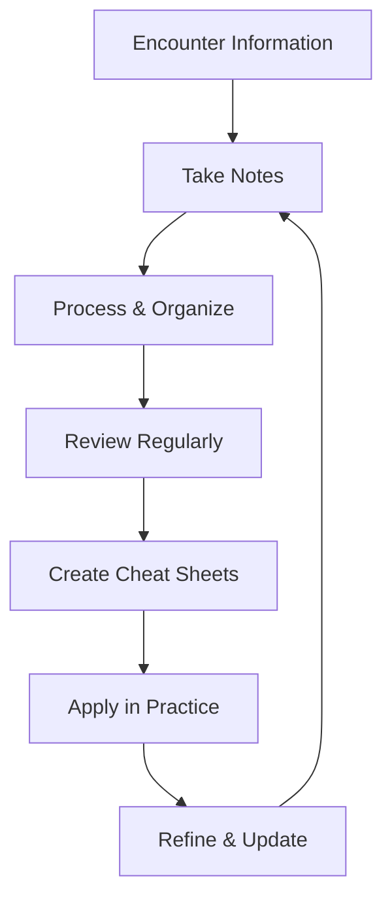
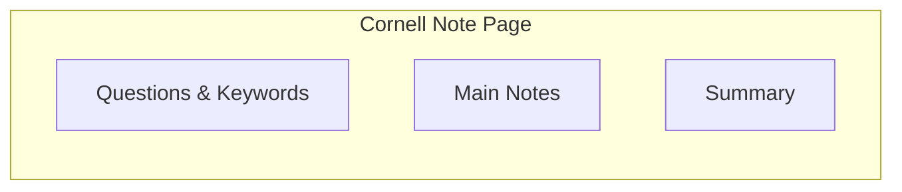

# 110 - Personal Notes

## Introduction

Effective note-taking is a cornerstone of successful interview preparation. The right notes help you organize knowledge, track progress, reinforce learning through spaced repetition, and quickly review key concepts before interviews. This comprehensive guide covers note-taking strategies, methods, digital tools, organization systems, and how to create personal cheat sheets that maximize your preparation efficiency.

Good notes aren't just about recording information - they're about processing, organizing, and retaining knowledge in a way that's useful for your specific goals. This guide teaches you how to take notes strategically, organize them effectively, and use them as powerful tools for interview success.

---

## Learning Roadmap

```
Week 1: Setup & Strategy
  ├── Choose note-taking tools
  ├── Select note-taking methods
  ├── Create folder structure
  └── Establish daily note routine

Week 2-3: Implementation
  ├── Take notes using chosen methods
  ├── Organize notes by topic
  ├── Review and refine notes
  └── Create cheat sheets from notes

Week 4: Optimization
  ├── Review note-taking effectiveness
  ├── Adjust methods as needed
  ├── Implement spaced repetition
  └── Finalize organization system
```

---

## Theory Notes

### Note-Taking Methods

#### 1. Cornell Method
Divide the page into three sections:
- **Right column** (large): Main notes during lecture/reading
- **Left column** (narrow): Questions and keywords after class
- **Bottom section**: Summary in your own words

**Best for**: Active learning, review preparation, exam studying

#### 2. Mind Mapping
Visual method that shows relationships between concepts:
- Central concept in the middle
- Branches radiate outward for main topics
- Sub-branches for details
- Use colors and images for memory

**Best for**: Creative thinking, seeing connections, big-picture understanding

#### 3. Outline Method
Hierarchical structure using indentation:
- Main topics as Roman numerals
- Subtopics as letters
- Details as numbers
- Further details with bullet points

**Best for**: Structured subjects, logical organization, detailed notes

#### 4. Charting Method
Organize information in columns and rows:
- Categories across the top
- Details down the side
- Compare and contrast information
- Track patterns and relationships

**Best for**: Comparison topics, factual information, timeline events

#### 5. Sentence Method
Write each new thought as a complete sentence:
- Number each sentence
- Group related sentences together
- Add headings for organization
- Simple and straightforward

**Best for**: Lecture-heavy content, quick note-taking, chronological information

### Digital Note-Taking Tools

#### Note-Taking Apps
- **Notion**: All-in-one workspace (notes, databases, wikis)
- **Obsidian**: Markdown-based, local-first, graph view
- **Roam Research**: Networked thought, bidirectional links
- **OneNote**: Microsoft ecosystem, free-form notes
- **Evernote**: Web clipping, multi-platform sync
- **Apple Notes**: Simple, integrated with Apple ecosystem

#### Specialized Tools
- **Anki**: Spaced repetition flashcards
- **Remnote**: Combines notes with flashcards
- **Logseq**: Open-source, bidirectional linking
- **Typora**: Markdown editor, clean interface

### Organization Strategies

#### Folder Structure
```
Interview Prep/
├── Technical/
│   ├── DSA/
│   │   ├── Arrays/
│   │   ├── Trees/
│   │   ├── Dynamic Programming/
│   │   └── ...
│   ├── System Design/
│   ├── Databases/
│   ├── Operating Systems/
│   └── Networking/
├── Behavioral/
│   ├── Leadership Principles/
│   ├── STAR Stories/
│   └── Common Questions/
├── Company Research/
│   ├── Amazon/
│   ├── Google/
│   └── ...
├── Cheat Sheets/
├── Flash Cards/
└── Mock Interview Notes/
```

#### Tagging System
- **Topic tags**: #dsa #systemdesign #behavioral
- **Company tags**: #amazon #google #meta
- **Difficulty tags**: #easy #medium #hard
- **Status tags**: #todo #inprogress #reviewed
- **Priority tags**: #high-priority #low-priority

---

## Key Concepts

### Active Note-Taking

Active notes are processed, not just recorded:
- **Summarize** in your own words
- **Connect** to existing knowledge
- **Question** assumptions and details
- **Apply** concepts to problems
- **Review** regularly

### Spaced Repetition for Notes

Review notes at increasing intervals:
- **Day 1**: Initial note-taking
- **Day 2**: First review (5 minutes)
- **Day 7**: Second review (3 minutes)
- **Day 30**: Third review (2 minutes)
- **Day 90**: Final review (1 minute)

### Note Quality Indicators

Good notes are:
- **Concise**: Key points, not verbatim
- **Organized**: Clear structure and hierarchy
- **Connected**: Links between related concepts
- **Actionable**: Can be used for quick review
- **Personal**: In your own words and understanding

### The Zettelkasten Method

A system for interconnected notes:
- Each note is a single idea
- Notes link to related notes
- Creates a network of knowledge
- Enables serendipitous connections
- Excellent for deep understanding

---

## FAQ (20+ Q&A)

### Q1: What's the best note-taking method for interview prep?
**A:** Cornell method for learning new topics, mind mapping for connections, and outlines for structured review.

### Q2: Should I take notes by hand or digitally?
**A:** Both have benefits. Handwriting improves retention; digital enables search and organization. Use both strategically.

### Q3: How do I organize notes for multiple topics?
**A:** Use a consistent folder structure, tagging system, and index. Review and reorganize regularly.

### Q4: How often should I review my notes?
**A:** Daily for active topics, weekly for maintenance, monthly for comprehensive review.

### Q5: Should I rewrite notes for clarity?
**A:** Yes, rewriting is a powerful learning technique. It forces you to process and organize information.

### Q6: How do I make notes useful for quick review?
**A:** Create cheat sheets and summaries. Highlight key formulas, concepts, and patterns.

### Q7: What's the Zettelkasten method?
**A:** A system of interconnected notes where each note is a single idea, linked to related notes to create a knowledge network.

### Q8: How do I take notes during mock interviews?
**A:** Note questions asked, your responses, feedback received, and areas for improvement.

### Q9: Should I share notes with others?
**A:** Yes, teaching others reinforces your learning. Consider creating public study guides.

### Q10: How do I handle notes from different sources?
**A:** Standardize your format, use consistent tags, and create a master index.

### Q11: What tools are best for note organization?
**A:** Notion for all-in-one, Obsidian for local-first, Anki for flashcards.

### Q12: How do I create effective cheat sheets?
**A:** Focus on key formulas, patterns, and concepts. Use visual formatting for quick scanning.

### Q13: Should I take notes during coding practice?
**A:** Yes. Note patterns, common mistakes, and solutions for future reference.

### Q14: How do I handle notes for behavioral vs technical topics?
**A:** Use different structures: stories for behavioral, concepts/formulas for technical.

### Q15: What if my notes become disorganized?
**A:** Schedule regular review sessions to reorganize, delete outdated notes, and update structure.

### Q16: How do I use notes during actual interviews?
**A:** Review key cheat sheets before interviews. Notes aren't used during interviews but prepare you.

### Q17: Should I color-code my notes?
**A:** Color-coding can help with visual organization and memory. Use it strategically, not excessively.

### Q18: How do I take notes from video lectures?
**A:** Pause frequently, note key points, sketch diagrams, and review after the lecture.

### Q19: What's the Cornell method?
**A:** Divide pages into notes (right), questions (left), and summary (bottom) for active learning.

### Q20: How do I create a personal knowledge base?
**A:** Use tools like Notion or Obsidian, create consistent structure, and regularly link related concepts.

### Q21: Should I take notes during technical interviews?
**A:** Not during the interview itself. Take notes immediately after to capture questions and reflections.

---

## Hands-on Practice

### Exercise 1: Cornell Notes Practice
Take Cornell notes on a technical topic (e.g., Binary Search Trees):
- Write main notes during study
- Add questions and keywords after
- Write a summary at the end

### Exercise 2: Mind Map Creation
Create a mind map for a complex topic (e.g., System Design):
- Central concept in the middle
- Main topics as branches
- Details as sub-branches
- Use colors for different categories

### Exercise 3: Note Organization
Organize existing notes using:
- Consistent folder structure
- Tagging system
- Master index
- Regular review schedule

### Exercise 4: Cheat Sheet Creation
Create a cheat sheet for a topic:
- Key formulas
- Common patterns
- Important concepts
- Quick reference examples

### Exercise 5: Spaced Repetition Setup
Set up a spaced repetition system:
- Choose tool (Anki, Remnote)
- Create initial flashcards
- Schedule review sessions
- Track progress

---

## FAANG Questions

### FAANG Note-Taking Approaches

#### Amazon
- **Focus**: Leadership Principles stories
- **Method**: Cornell notes for each LP
- **Organization**: By LP, then by story
- **Cheat Sheet**: One-page LP summary

#### Google
- **Focus**: Algorithm patterns and approaches
- **Method**: Mind maps for problem types
- **Organization**: By algorithm category
- **Cheat Sheet**: Pattern recognition guide

#### Meta
- **Focus**: System design and coding efficiency
- **Method**: Outline method for design
- **Organization**: By component and pattern
- **Cheat Sheet**: Design patterns summary

#### Apple
- **Focus**: Quality and attention to detail
- **Method**: Detailed notes with examples
- **Organization**: By technology and concept
- **Cheat Sheet**: Best practices guide

#### Microsoft
- **Focus**: Growth mindset and learning
- **Method**: Reflective notes on learning
- **Organization**: By skill area
- **Cheat Sheet**: Growth framework summary

---

## Common Mistakes

### Mistake 1: Taking Verbatim Notes
Notes should be processed, not copied word-for-word. Summarize in your own words.

### Mistake 2: Never Reviewing Notes
Notes without review are wasted effort. Schedule regular review sessions.

### Mistake 3: Over-Organizing
Too much structure can be as bad as too little. Find the right balance.

### Mistake 4: Not Connecting Concepts
Notes should show relationships between ideas, not just isolated facts.

### Mistake 5: Ignoring Visual Elements
Diagrams, charts, and visual formatting enhance understanding and memory.

### Mistake 6: Using Too Many Tools
Choose 2-3 tools and master them. Too many tools create fragmentation.

### Mistake 7: Not Making Notes Actionable
Notes should be useful for quick review and application, not just storage.

### Mistake 8: Perfectionism
Don't spend more time making notes look perfect than actually learning.

---

## Best Practices

1. **Process, Don't Copy**: Summarize in your own words
2. **Connect Ideas**: Link related concepts together
3. **Review Regularly**: Schedule consistent review sessions
4. **Use Visuals**: Diagrams and charts enhance memory
5. **Create Cheat Sheets**: One-page summaries for quick review
6. **Organize Consistently**: Use standard structure and tagging
7. **Make Notes Actionable**: Focus on what you'll use for review
8. **Keep It Simple**: Don't over-complicate your system
9. **Share When Possible**: Teaching reinforces learning
10. **Evolve Your System**: Adjust based on what works for you

---

## Cheat Sheet

```
PERSONAL NOTES CHEAT SHEET
==========================

NOTE-TAKING METHODS:
□ Cornell Method (3-column)
□ Mind Mapping (visual)
□ Outline Method (hierarchical)
□ Charting Method (comparison)
□ Sentence Method (narrative)

TOOLS:
Notion: All-in-one workspace
Obsidian: Local-first, markdown
Anki: Spaced repetition flashcards
OneNote: Microsoft ecosystem
Google Docs: Simple collaboration

ORGANIZATION:
Folder Structure:
├── Technical/
│   ├── DSA/
│   ├── System Design/
│   └── ...
├── Behavioral/
├── Company Research/
├── Cheat Sheets/
└── Flash Cards/

Tagging System:
#topic #company #difficulty #status #priority

REVIEW SCHEDULE:
Day 1: Initial notes
Day 2: First review (5 min)
Day 7: Second review (3 min)
Day 30: Third review (2 min)
Day 90: Final review (1 min)

CHEAT SHEET FORMAT:
□ Key formulas
□ Common patterns
□ Important concepts
□ Quick examples
□ Visual formatting

ACTIVE NOTE-TAKING:
✓ Summarize in own words
✓ Connect to existing knowledge
✓ Question assumptions
✓ Apply to problems
✓ Review regularly

ZETTELKASTEN METHOD:
• Single idea per note
• Link related notes
• Create knowledge network
• Enable serendipitous connections
```

---

## Flash Cards (20)

### Card 1
**Q:** What is the Cornell method?
**A:** A note-taking system with three sections: notes (right), questions (left), and summary (bottom).

### Card 2
**Q:** What's the difference between active and passive notes?
**A:** Active notes are processed and summarized; passive notes are copied verbatim.

### Card 3
**Q:** What is the Zettelkasten method?
**A:** A system of interconnected notes where each note is a single idea linked to related notes.

### Card 4
**Q:** How often should you review notes?
**A:** Daily for active topics, weekly for maintenance, monthly for comprehensive review.

### Card 5
**Q:** What's the best tool for spaced repetition?
**A:** Anki is the most popular and effective tool for spaced repetition flashcards.

### Card 6
**Q:** Should you take notes by hand or digitally?
**A:** Both have benefits. Handwriting improves retention; digital enables search and organization.

### Card 7
**Q:** What makes good notes?
**A:** Concise, organized, connected, actionable, and personal (in your own words).

### Card 8
**Q:** How do you create effective cheat sheets?
**A:** Focus on key formulas, patterns, and concepts with visual formatting for quick scanning.

### Card 9
**Q:** What's the purpose of note organization?
**A:** To quickly find and review information when needed, especially before interviews.

### Card 10
**Q:** Should you share notes with others?
**A:** Yes, teaching others reinforces your learning and benefits the community.

### Card 11
**Q:** How do you take notes during mock interviews?
**A:** Note questions asked, your responses, feedback, and areas for improvement.

### Card 12
**Q:** What's the best folder structure for interview prep?
**A:** Organize by category (Technical, Behavioral, Company Research) with subfolders for topics.

### Card 13
**Q:** How do you connect ideas in notes?
**A:** Use links, references, and tags to show relationships between concepts.

### Card 14
**Q:** What's the benefit of mind mapping?
**A:** Shows relationships between concepts visually, helps with creative thinking and big-picture understanding.

### Card 15
**Q:** How do you handle notes from video lectures?
**A:** Pause frequently, note key points, sketch diagrams, and review after the lecture.

### Card 16
**Q:** Should you rewrite notes?
**A:** Yes, rewriting is a powerful learning technique that forces you to process information.

### Card 17
**Q:** What tags should you use for notes?
**A:** Topic, company, difficulty, status, and priority tags for easy filtering.

### Card 18
**Q:** How do you make notes useful for quick review?
**A:** Create summaries, cheat sheets, and highlight key concepts with visual formatting.

### Card 19
**Q:** What's the danger of over-organizing notes?
**A:** Too much structure can be overwhelming and waste time better spent on learning.

### Card 20
**Q:** How do you use notes during interviews?
**A:** You don't use notes during interviews. Review them before to prepare.

---

## Mind Map

```
              PERSONAL NOTES
                  |
       ┌──────────┼──────────┐
       |          |          |
   METHODS      TOOLS     ORGANIZATION
       |          |          |
  ┌────┴────┐ ┌──┴──┐  ┌───┴───┐
  |         | |     |  |       |
Cornell  Mind  Notion Anki  Folders Tags
Outline  Map  Obsidian     Index   Links
```

---

## Mermaid Diagrams

### Note-Taking Workflow


### Cornell Method Layout


---

## Code Examples

```python
# Personal Notes Manager

from dataclasses import dataclass, field
from typing import List, Dict, Set
from datetime import datetime
from enum import Enum

class NoteType(Enum):
    CONCEPT = "Concept"
    FORMULA = "Formula"
    PATTERN = "Pattern"
    STORY = "Story"
    CHEAT_SHEET = "Cheat Sheet"

@dataclass
class Note:
    title: str
    content: str
    note_type: NoteType
    topic: str
    tags: Set[str] = field(default_factory=set)
    related_notes: List[str] = field(default_factory=list)
    created_at: datetime = field(default_factory=datetime.now)
    last_reviewed: datetime = field(default_factory=datetime.now)
    review_count: int = 0
    
    def add_tag(self, tag: str):
        self.tags.add(tag)
    
    def link_to(self, note_title: str):
        if note_title not in self.related_notes:
            self.related_notes.append(note_title)

class NotesManager:
    def __init__(self):
        self.notes: List[Note] = []
        self.folder_structure: Dict[str, List[str]] = {}
    
    def add_note(self, note: Note):
        self.notes.append(note)
        
        # Update folder structure
        if note.topic not in self.folder_structure:
            self.folder_structure[note.topic] = []
        self.folder_structure[note.topic].append(note.title)
    
    def search_by_tag(self, tag: str) -> List[Note]:
        return [n for n in self.notes if tag in n.tags]
    
    def search_by_topic(self, topic: str) -> List[Note]:
        return [n for n in self.notes if n.topic == topic]
    
    def get_notes_needing_review(self, days_threshold: int = 7) -> List[Note]:
        """Get notes that haven't been reviewed recently."""
        threshold = datetime.now().timestamp() - (days_threshold * 86400)
        return [
            n for n in self.notes 
            if n.last_reviewed.timestamp() < threshold
        ]
    
    def create_cheat_sheet(self, topic: str) -> str:
        """Create a cheat sheet from notes on a topic."""
        topic_notes = self.search_by_topic(topic)
        
        cheat_sheet = f"\n{'='*60}"
        cheat_sheet += f"\nCHEAT SHEET: {topic.upper()}"
        cheat_sheet += f"\n{'='*60}"
        
        # Group by note type
        by_type = {}
        for note in topic_notes:
            note_type = note.note_type.value
            if note_type not in by_type:
                by_type[note_type] = []
            by_type[note_type].append(note)
        
        for note_type, notes in by_type.items():
            cheat_sheet += f"\n\n{note_type.upper()}S:"
            cheat_sheet += f"\n{'-'*40}"
            for note in notes:
                cheat_sheet += f"\n\n{note.title}"
                cheat_sheet += f"\n  {note.content[:200]}..."
                if note.tags:
                    cheat_sheet += f"\n  Tags: {', '.join(note.tags)}"
        
        return cheat_sheet
    
    def generate_review_schedule(self) -> str:
        """Generate a review schedule for notes."""
        schedule = "\nREVIEW SCHEDULE"
        schedule += "\n" + "=" * 50
        
        # Group by topic
        topics = {}
        for note in self.notes:
            if note.topic not in topics:
                topics[note.topic] = []
            topics[note.topic].append(note)
        
        for topic, notes in topics.items():
            schedule += f"\n\n{topic.upper()}"
            schedule += f"\n  Notes: {len(notes)}"
            schedule += f"\n  Last Reviewed: {max(n.last_reviewed for n in notes).strftime('%Y-%m-%d')}"
            schedule += f"\n  Review Count: {sum(n.review_count for n in notes)}"
        
        # Notes needing review
        needing_review = self.get_notes_needing_review(days_threshold=7)
        if needing_review:
            schedule += f"\n\nNOTES NEEDING REVIEW (>7 days):"
            for note in needing_review:
                schedule += f"\n  - {note.title} ({note.topic})"
        
        return schedule
    
    def export_notes_summary(self) -> Dict:
        """Export summary statistics of all notes."""
        summary = {
            "total_notes": len(self.notes),
            "by_topic": {},
            "by_type": {},
            "total_reviews": sum(n.review_count for n in self.notes),
            "tags_used": set()
        }
        
        for note in self.notes:
            # By topic
            summary["by_topic"][note.topic] = summary["by_type"].get(note.topic, 0) + 1
            
            # By type
            note_type = note.note_type.value
            summary["by_type"][note_type] = summary["by_type"].get(note_type, 0) + 1
            
            # Tags
            summary["tags_used"].update(note.tags)
        
        summary["tags_used"] = list(summary["tags_used"])
        return summary

# Example usage
manager = NotesManager()

# Add notes
manager.add_note(Note(
    title="Binary Search Tree Operations",
    content="Insert: O(log n) avg, O(n) worst. Search: O(log n) avg. Delete: O(log n) avg.",
    note_type=NoteType.CONCEPT,
    topic="Data Structures",
    tags={"dsa", "trees", "binary-search"}
))

manager.add_note(Note(
    title="Two Pointer Pattern",
    content="Use when array is sorted. Left and right pointers converge. O(n) time, O(1) space.",
    note_type=NoteType.PATTERN,
    topic="DSA Patterns",
    tags={"dsa", "arrays", "two-pointer"}
))

manager.add_note(Note(
    title="Amazon LP: Customer Obsession",
    content="Leaders start with the customer and work backwards. They work vigorously to earn and keep customer trust.",
    note_type=NoteType.FORMULA,
    topic="Leadership Principles",
    tags={"amazon", "behavioral", "lp"}
))

manager.add_note(Note(
    title="STAR Method",
    content="Situation: Set context. Task: Your role. Action: What YOU did. Result: Quantified outcomes.",
    note_type=NoteType.CHEAT_SHEET,
    topic="Interview Technique",
    tags={"behavioral", "star", "method"}
))

# Link related notes
manager.notes[0].link_to("Binary Search")
manager.notes[1].link_to("Sliding Window")
manager.notes[3].link_to("Amazon LP: Customer Obsession")

# Generate outputs
print(manager.create_cheat_sheet("Data Structures"))
print(manager.generate_review_schedule())

summary = manager.export_notes_summary()
print(f"\nTotal Notes: {summary['total_notes']}")
print(f"By Topic: {summary['by_topic']}")
print(f"By Type: {summary['by_type']}")
print(f"Tags Used: {summary['tags_used']}")
```

---

## Resources

### Books
- "How to Take Smart Notes" by Sönke Ahrens
- "Building a Second Brain" by Tiago Forte
- "The Notetaking Book" by Emily Gould

### Tools
- [Notion](https://notion.so)
- [Obsidian](https://obsidian.md)
- [Anki](https://apps.ankiweb.net)
- [Remnote](https://remnote.com)

---

## Checklist

- [ ] Chose note-taking tools (2-3 max)
- [ ] Selected note-taking methods
- [ ] Created folder structure
- [ ] Established tagging system
- [ ] Created daily note routine
- [ ] Implemented review schedule
- [ ] Created cheat sheets for key topics
- [ ] Set up spaced repetition system
- [ ] Organized existing notes
- [ ] Tested and refined system

---

## Mock Interviews

### Note-Taking Practice

**During mock interviews, practice:**
- Jotting key points quickly
- Noting feedback accurately
- Capturing areas for improvement
- Recording questions you want to research

---

## Difficulty Rating

| Aspect | Rating (1-10) | Notes |
|--------|---------------|-------|
| Setup Effort | 4/10 | Initial tool setup required |
| Daily Maintenance | 5/10 | Consistent effort needed |
| Learning Curve | 3/10 | Methods are straightforward |
| Impact on Prep | 8/10 | Highly effective when done well |
| Long-term Value | 9/10 | Skills transfer to career |
| Overall Difficulty | 4/10 | Low barrier, high reward |

---

## Summary

Effective note-taking is a powerful skill that enhances interview preparation and lifelong learning. Choose methods that work for you, organize notes consistently, review regularly, and create actionable cheat sheets. The investment in good note-taking practices pays dividends throughout your career, not just during interview prep. Start with a simple system, refine it over time, and make your notes work for you.
