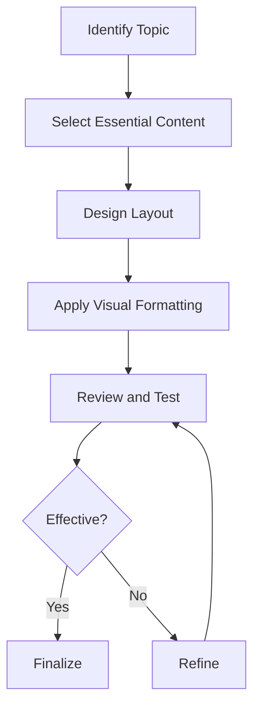
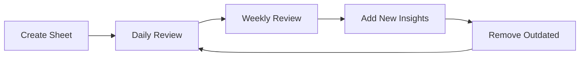

# 111 - Cheat Sheets

## Introduction

Cheat sheets are condensed reference guides that capture essential information in a format that's quick to review and easy to memorize. In interview preparation, well-crafted cheat sheets allow you to rapidly review key concepts, formulas, patterns, and strategies before interviews. This comprehensive guide covers cheat sheets for DSA, SQL, system design, OOP, operating systems, networking, programming languages, behavioral interviews, and salary negotiation.

The power of cheat sheets lies in their ability to distill complex topics into scannable, memorable formats. When created well, a single page can capture the essence of an entire topic, making it invaluable for last-minute review and long-term retention. This guide provides templates, strategies, and examples for creating effective cheat sheets.

---

## Learning Roadmap

```
Week 1: Foundation Sheets
  ├── DSA patterns and algorithms
  ├── SQL queries and syntax
  ├── OOP principles
  └── OS fundamentals

Week 2: Technical Sheets
  ├── System design patterns
  ├── Networking concepts
  ├── Programming language syntax
  └── Database concepts

Week 3: Behavioral & Professional
  ├── STAR method template
  ├── Leadership principles
  ├── Salary negotiation scripts
  └── Interview day checklist

Week 4: Customization
  ├── Create personal cheat sheets
  ├── Optimize for your weak areas
  ├── Practice using sheets
  └── Refine based on feedback
```

---

## Theory Notes

### What Makes a Good Cheat Sheet

#### Characteristics
1. **Concise**: Maximum information in minimum space
2. **Visual**: Uses formatting, icons, and layout for quick scanning
3. **Organized**: Logical flow from simple to complex
4. **Actionable**: Can be used immediately during review
5. **Personalized**: Tailored to your specific needs

#### Anti-Patterns
- Too much text (walls of words)
- No visual hierarchy
- Missing key formulas
- Overly complex layout
- Not updated regularly

### Cheat Sheet Creation Process

#### Step 1: Content Selection
- Identify the most important concepts
- Focus on what you frequently forget
- Include formulas and patterns
- Add quick examples

#### Step 2: Layout Design
- Use columns for space efficiency
- Group related items together
- Use bullet points and icons
- Highlight key information

#### Step 3: Visual Formatting
- Use bold for emphasis
- Use colors strategically
- Create visual hierarchies
- Add diagrams where helpful

#### Step 4: Review and Refine
- Test for quick readability
- Get feedback from others
- Update based on new learning
- Ensure accuracy

---

## Key Concepts

### DSA Cheat Sheet Categories

#### Data Structures
- Arrays & Strings
- Linked Lists
- Stacks & Queues
- Trees (Binary, BST, AVL, Heap)
- Graphs
- Hash Tables

#### Algorithms
- Sorting (Quick, Merge, Heap, Insertion)
- Searching (Binary, BFS, DFS)
- Dynamic Programming patterns
- Greedy algorithms
- Backtracking
- Graph algorithms (Dijkstra, Prim, Kruskal)

#### Complexity Analysis
- Time complexity by operation
- Space complexity patterns
- Common complexity traps

### SQL Cheat Sheet Categories

#### Queries
- SELECT variations
- JOIN types
- Subqueries
- Aggregate functions
- Window functions

#### Optimization
- Indexing strategies
- Query optimization tips
- Common performance pitfalls

### System Design Cheat Sheet Categories

#### Components
- Load balancers
- Caches (Redis, Memcached)
- Message queues
- Databases (SQL, NoSQL)
- CDNs

#### Patterns
- Microservices
- Event-driven architecture
- CQRS
- Circuit breaker

---

## FAQ (20+ Q&A)

### Q1: How many cheat sheets should I have?
**A:** One per major topic area (DSA, SQL, System Design, Behavioral, etc.). Keep them focused and concise.

### Q2: How long should a cheat sheet be?
**A:** Ideally one page per topic. Two pages maximum. The constraint forces you to focus on essentials.

### Q3: Should I create my own or use existing ones?
**A:** Create your own. The process of creating them is as valuable as having them.

### Q4: How often should I update cheat sheets?
**A:** Weekly during active preparation. Add new insights and remove outdated information.

### Q5: Should cheat sheets be handwritten or digital?
**A:** Both have value. Digital is easier to update and share. Handwritten aids memory retention.

### Q6: How do I use cheat sheets effectively?
**A:** Review regularly (daily for weak areas), use for quick refreshers before practice sessions, and test yourself.

### Q7: What should I include in a DSA cheat sheet?
**A:** Key algorithms, data structure operations, common patterns, time complexities, and quick examples.

### Q8: Should I include code in cheat sheets?
**A:** Minimal pseudocode or key syntax snippets. Focus on concepts and patterns, not full implementations.

### Q9: How do I make cheat sheets visually effective?
**A:** Use columns, bullet points, icons, colors, and visual hierarchies. Test for quick scanning.

### Q10: Should cheat sheets be topic-specific or comprehensive?
**A:** Topic-specific. One focused cheat sheet per topic is more useful than one massive reference.

### Q11: How do I know what to include?
**A:** Review what you frequently forget, what's commonly asked in interviews, and what has the highest impact.

### Q12: Should I share my cheat sheets?
**A:** Yes. Sharing helps others and reviewing others' sheets can give you new perspectives.

### Q13: How do cheat sheets help with interviews?
**A:** They provide quick review before interviews and reinforce learning through regular review.

### Q14: What's the difference between a cheat sheet and notes?
**A:** Cheat sheets are condensed, visual references. Notes are more detailed and explanatory.

### Q15: Should I bring cheat sheets to interviews?
**A:** No. Cheat sheets are for preparation, not for use during interviews. Review them before.

### Q16: How do I create a behavioral interview cheat sheet?
**A:** List key stories, LP mappings, STAR templates, and common questions.

### Q17: Should I include examples in cheat sheets?
**A:** Yes, brief examples that illustrate key concepts. Keep them minimal but memorable.

### Q18: How do I organize multiple cheat sheets?
**A:** Use consistent formatting, create an index, and organize by topic area.

### Q19: What's the most important cheat sheet?
**A:** The one for your weakest area. Focus sheets where you need the most review.

### Q20: How do I test if my cheat sheet is effective?
**A:** Time yourself reviewing it. If you can scan key info in 5-10 minutes, it's effective.

---

## Hands-on Practice

### Exercise 1: DSA Cheat Sheet Creation
Create a one-page DSA cheat sheet covering:
- 10 most common algorithms
- Time/space complexity for each
- Common patterns
- When to use each

### Exercise 2: SQL Cheat Sheet
Create a SQL cheat sheet covering:
- SELECT, JOIN, GROUP BY syntax
- Window function patterns
- Common aggregate functions
- Optimization tips

### Exercise 3: System Design Cheat Sheet
Create a system design cheat sheet covering:
- Common components and their uses
- Design patterns
- Capacity estimation formulas
- Trade-off frameworks

### Exercise 4: Behavioral Cheat Sheet
Create a behavioral interview cheat sheet covering:
- STAR method template
- 5 key stories mapped to LPs
- Common questions
- Strong answer indicators

### Exercise 5: Personalized Sheet
Create a cheat sheet for your weakest area:
- Identify your weakest topic
- List the most important concepts
- Add key formulas and patterns
- Include quick examples

---

## FAANG Questions

### FAANG-Specific Cheat Sheet Focus

#### Amazon
- **Behavioral**: LP stories with STAR structure
- **Technical**: Hash tables, arrays, trees
- **System Design**: Scalable services, distributed systems

#### Google
- **DSA**: Algorithms, graphs, dynamic programming
- **System Design**: Large-scale systems, trade-offs
- **Coding**: Clean code, optimal solutions

#### Meta
- **DSA**: Practical coding problems
- **System Design**: Social features, real-time systems
- **Behavioral**: Impact-driven stories

#### Apple
- **DSA**: Language-specific implementations
- **System Design**: User experience focus
- **Behavioral**: Quality and innovation stories

#### Microsoft
- **DSA**: Problem-solving approach
- **System Design**: Practical solutions
- **Behavioral**: Growth mindset stories

---

## Common Mistakes

### Mistake 1: Too Much Content
Cheat sheets should be concise. If it's more than one page, it's not a cheat sheet.

### Mistake 2: No Visual Hierarchy
Without clear organization, cheat sheets are hard to scan quickly.

### Mistake 3: Including Obvious Information
Don't waste space on things you already know well. Focus on what you forget.

### Mistake 4: Never Updating
Stale cheat sheets become useless. Update regularly with new insights.

### Mistake 5: Making Them Too Pretty
Function over form. A useful sheet beats a beautiful one.

### Mistake 6: Not Reviewing Them
Cheat sheets only work if you review them regularly.

### Mistake 7: One Giant Sheet
Multiple focused sheets are better than one massive reference.

### Mistake 8: Copying Without Understanding
Creating sheets from memory forces learning. Copying defeats the purpose.

---

## Best Practices

1. **Create Your Own**: The process teaches as much as the result
2. **Keep It Concise**: One page per topic maximum
3. **Use Visual Formatting**: Columns, bullets, icons, colors
4. **Focus on Essentials**: What you forget most, not what you know
5. **Update Regularly**: Add new insights, remove outdated info
6. **Review Consistently**: Daily for weak areas, weekly for maintenance
7. **Test Yourself**: Use sheets for active recall practice
8. **Share with Others**: Teaching reinforces learning
9. **Make Them Personal**: Tailored to your specific needs
10. **Organize Consistently**: Use standard structure across sheets

---

## Cheat Sheet

```
CHEAT SHEET CREATION CHEAT SHEET
=================================

PROCESS:
1. Select essential content
2. Design layout
3. Apply visual formatting
4. Review and refine

ONE-PER-PAGE RULES:
□ Maximum one page per topic
□ Focus on what you forget
□ Include key formulas
□ Add quick examples

VISUAL FORMATTING:
□ Use columns
□ Bullet points
□ Icons and symbols
□ Color coding
□ Bold for emphasis

TOPIC AREAS:
DSA: Algorithms, patterns, complexities
SQL: Queries, joins, optimization
System Design: Components, patterns
OOP: Principles, design patterns
OS: Concepts, scheduling, memory
Networking: Protocols, layers
Behavioral: STAR, stories, LPs
Negotiation: Scripts, strategies

REVIEW SCHEDULE:
Daily: Weak areas (5 min)
Weekly: All sheets (30 min)
Before interview: Key sheets (15 min)

QUALITY CHECK:
□ Can scan in 5-10 minutes?
□ Contains only essentials?
□ Visually scannable?
□ Up to date?
□ Personally relevant?
```

---

## Flash Cards (20)

### Card 1
**Q:** What's the ideal length for a cheat sheet?
**A:** One page per topic maximum. Two pages for complex topics.

### Card 2
**Q:** What's the most important principle for cheat sheets?
**A:** Conciseness - maximum information in minimum space.

### Card 3
**Q:** Should you create your own cheat sheets?
**A:** Yes. The creation process is as valuable as having them.

### Card 4
**Q:** How often should you review cheat sheets?
**A:** Daily for weak areas, weekly for all sheets, before interviews for key sheets.

### Card 5
**Q:** What should a DSA cheat sheet include?
**A:** Key algorithms, time/space complexities, common patterns, and when to use each.

### Card 6
**Q:** What makes a cheat sheet visually effective?
**A:** Columns, bullet points, icons, colors, and clear visual hierarchy.

### Card 7
**Q:** Should cheat sheets include full code?
**A:** No. Minimal pseudocode or key syntax. Focus on concepts and patterns.

### Card 8
**Q:** What's the difference between a cheat sheet and notes?
**A:** Cheat sheets are condensed visual references. Notes are detailed and explanatory.

### Card 9
**Q:** Should you bring cheat sheets to interviews?
**A:** No. They're for preparation, not use during interviews.

### Card 10
**Q:** How do you know what to include?
**A:** Focus on what you frequently forget and what's commonly asked in interviews.

### Card 11
**Q:** What's a good system design cheat sheet format?
**A:** Common components, design patterns, capacity formulas, and trade-off frameworks.

### Card 12
**Q:** Should you share cheat sheets with others?
**A:** Yes. Teaching reinforces learning and benefits the community.

### Card 13
**Q:** What's the biggest cheat sheet mistake?
**A:** Including too much content. Keep it focused and concise.

### Card 14
**Q:** How do you test if a cheat sheet is effective?
**A:** Time yourself scanning it. Key info should be accessible in 5-10 minutes.

### Card 15
**Q:** What should a behavioral cheat sheet include?
**A:** STAR template, key stories, LP mappings, and common questions.

### Card 16
**Q:** How do you organize multiple cheat sheets?
**A:** Consistent formatting, topic-based organization, and a master index.

### Card 17
**Q:** Should cheat sheets be handwritten or digital?
**A:** Both have value. Digital for updates/sharing, handwritten for memory retention.

### Card 18
**Q:** What's the most important cheat sheet?
**A:** The one for your weakest area where you need the most review.

### Card 19
**Q:** How do you update cheat sheets?
**A:** Add new insights weekly, remove outdated info, and refine based on practice.

### Card 20
**Q:** What makes a bad cheat sheet?
**A:** Too much text, no visual hierarchy, missing key formulas, never updated.

---

## Mermaid Diagrams

### Cheat Sheet Creation Process


### Cheat Sheet Review Cycle


---

## Code Examples

```python
# Cheat Sheet Generator

from dataclasses import dataclass, field
from typing import List, Dict
from enum import Enum

class SheetType(Enum):
    DSA = "Data Structures & Algorithms"
    SQL = "SQL"
    SYSTEM_DESIGN = "System Design"
    OOP = "Object-Oriented Programming"
    OS = "Operating Systems"
    NETWORKING = "Networking"
    BEHAVIORAL = "Behavioral Interview"
    NEGOTIATION = "Salary Negotiation"

@dataclass
class CheatSheetEntry:
    concept: str
    description: str
    formula: str = ""
    example: str = ""
    key_points: List[str] = field(default_factory=list)
    complexity: str = ""
    when_to_use: str = ""

@dataclass
class CheatSheet:
    title: str
    sheet_type: SheetType
    entries: List[CheatSheetEntry] = field(default_factory=list)
    max_entries: int = 15
    
    def add_entry(self, entry: CheatSheetEntry) -> bool:
        if len(self.entries) < self.max_entries:
            self.entries.append(entry)
            return True
        return False
    
    def to_markdown(self) -> str:
        """Generate markdown version of the cheat sheet."""
        output = f"# {self.title}\n\n"
        
        # Group entries by category if applicable
        for i, entry in enumerate(self.entries, 1):
            output += f"## {entry.concept}\n"
            output += f"{entry.description}\n\n"
            
            if entry.formula:
                output += f"**Formula:** `{entry.formula}`\n\n"
            
            if entry.complexity:
                output += f"**Complexity:** {entry.complexity}\n\n"
            
            if entry.when_to_use:
                output += f"**When to Use:** {entry.when_to_use}\n\n"
            
            if entry.example:
                output += f"**Example:** {entry.example}\n\n"
            
            if entry.key_points:
                output += "**Key Points:**\n"
                for point in entry.key_points:
                    output += f"- {point}\n"
                output += "\n"
            
            output += "---\n\n"
        
        return output
    
    def to_compact_format(self) -> str:
        """Generate compact one-page format."""
        output = f"{'='*50}\n"
        output += f"{self.title.upper()}\n"
        output += f"{'='*50}\n\n"
        
        for i, entry in enumerate(self.entries, 1):
            output += f"{i}. {entry.concept}\n"
            if entry.formula:
                output += f"   {entry.formula}\n"
            if entry.complexity:
                output += f"   {entry.complexity}\n"
            output += "\n"
        
        return output

class CheatSheetGenerator:
    def __init__(self):
        self.sheets: List[CheatSheet] = []
    
    def create_dsa_sheet(self) -> CheatSheet:
        """Create a comprehensive DSA cheat sheet."""
        sheet = CheatSheet(
            title="DSA Cheat Sheet",
            sheet_type=SheetType.DSA,
            max_entries=15
        )
        
        # Add key algorithms
        sheet.add_entry(CheatSheetEntry(
            concept="Binary Search",
            description="Search sorted array by repeatedly dividing search interval in half",
            formula="T(n) = T(n/2) + O(1) => O(log n)",
            complexity="Time: O(log n), Space: O(1)",
            when_to_use="Sorted array, search space reduction",
            key_points=["Works on sorted data", "Compare mid with target", "Eliminate half each step"]
        ))
        
        sheet.add_entry(CheatSheetEntry(
            concept="Two Pointer",
            description="Use two pointers to traverse array/string from different positions",
            formula="Time: O(n), Space: O(1)",
            complexity="Time: O(n), Space: O(1)",
            when_to_use="Sorted array, pair finding, palindrome check",
            key_points=["Left and right pointers", "Converge or diverge based on condition", "Often combined with sorting"]
        ))
        
        sheet.add_entry(CheatSheetEntry(
            concept="Sliding Window",
            description="Maintain a window of elements and slide it across the data structure",
            formula="Time: O(n), Space: O(k)",
            complexity="Time: O(n), Space: O(k) where k is window size",
            when_to_use="Subarray/substring problems, fixed or variable window",
            key_points=["Expand/shrink window based on condition", "Track window state efficiently", "Often O(n) time"]
        ))
        
        sheet.add_entry(CheatSheetEntry(
            concept="Dynamic Programming",
            description="Break problem into overlapping subproblems and store solutions",
            formula="dp[i] = f(dp[i-1], dp[i-2], ...)",
            complexity="Time: O(n*m), Space: O(n*m) typical",
            when_to_use="Optimization problems, counting problems, overlapping subproblems",
            key_points=["Identify subproblems", "Define recurrence relation", "Choose memoization or tabulation"]
        ))
        
        sheet.add_entry(CheatSheetEntry(
            concept="BFS/DFS",
            description="Graph traversal algorithms for exploring nodes and edges",
            formula="Time: O(V+E), Space: O(V)",
            complexity="Time: O(V+E), Space: O(V)",
            when_to_use="BFS: shortest path, level-order. DFS: path finding, cycle detection",
            key_points=["BFS uses queue, DFS uses stack/recursion", "Both visit each node once", "Choose based on problem requirements"]
        ))
        
        return sheet
    
    def create_sql_sheet(self) -> CheatSheet:
        """Create a comprehensive SQL cheat sheet."""
        sheet = CheatSheet(
            title="SQL Cheat Sheet",
            sheet_type=SheetType.SQL,
            max_entries=15
        )
        
        sheet.add_entry(CheatSheetEntry(
            concept="JOIN Types",
            description="Combine rows from two or more tables based on related columns",
            key_points=[
                "INNER JOIN: Only matching rows",
                "LEFT JOIN: All from left, matching from right",
                "RIGHT JOIN: All from right, matching from left",
                "FULL OUTER JOIN: All rows from both tables",
                "CROSS JOIN: Cartesian product of both tables"
            ]
        ))
        
        sheet.add_entry(CheatSheetEntry(
            concept="Window Functions",
            description="Perform calculations across sets of rows related to current row",
            formula="FUNCTION() OVER (PARTITION BY ... ORDER BY ...)",
            key_points=[
                "ROW_NUMBER(): Unique sequential numbers",
                "RANK(): Gaps in ranking for ties",
                "DENSE_RANK(): No gaps in ranking",
                "SUM/AVG/COUNT OVER(): Running totals",
                "LAG/LEAD(): Access previous/next rows"
            ]
        ))
        
        sheet.add_entry(CheatSheetEntry(
            concept="Aggregate Functions",
            description="Perform calculations on a set of values",
            key_points=[
                "COUNT(): Number of rows",
                "SUM(): Total of values",
                "AVG(): Average of values",
                "MIN/MAX(): Minimum/maximum values",
                "GROUP BY: Group rows for aggregation",
                "HAVING: Filter groups (post-aggregation)"
            ]
        ))
        
        return sheet
    
    def generate_all_sheets(self) -> str:
        """Generate all cheat sheets."""
        output = "CHEAT SHEET COLLECTION\n"
        output += "=" * 60 + "\n\n"
        
        # DSA Sheet
        dsa_sheet = self.create_dsa_sheet()
        output += dsa_sheet.to_compact_format() + "\n\n"
        
        # SQL Sheet
        sql_sheet = self.create_sql_sheet()
        output += sql_sheet.to_compact_format() + "\n\n"
        
        return output

# Example usage
generator = CheatSheetGenerator()
print(generator.generate_all_sheets())

# Create custom sheet
custom_sheet = CheatSheet(
    title="My Custom Cheat Sheet",
    sheet_type=SheetType.DSA,
    max_entries=10
)

custom_sheet.add_entry(CheatSheetEntry(
    concept="My Algorithm",
    description="Custom algorithm I frequently forget",
    formula="O(n log n)",
    when_to_use="When I need to sort and search"
))

print("\nCUSTOM SHEET:")
print(custom_sheet.to_markdown())
```

---

## Resources

### Cheat Sheet Collections
- [DevHints](https://devhints.io) - developer cheat sheets
- [OverAPI](https://overapi.com) - API cheat sheets
- [Cheatography](https://cheatography.com) - community cheat sheets
- [Riju](https://riju.tcscodejoy.com) - programming cheat sheets

### Tools
- [Cheat Sheet generators](https://cheatsheetgenerator.com)
- [Markdown editors](https://typora.io)
- [Design tools](https://canva.com)

---

## Checklist

- [ ] Created DSA cheat sheet (1 page)
- [ ] Created SQL cheat sheet (1 page)
- [ ] Created system design cheat sheet (1 page)
- [ ] Created behavioral interview cheat sheet (1 page)
- [ ] Created salary negotiation cheat sheet (1 page)
- [ ] Reviewed and updated all sheets
- [ ] Established regular review schedule
- [ ] Shared sheets with study group
- [ ] Tested effectiveness through practice
- [ ] Refined based on feedback

---

## Mock Interviews

### Cheat Sheet Practice

**Using cheat sheets for mock interview prep:**
1. Review relevant sheet before each mock
2. Time yourself scanning key information
3. Test recall without looking at sheet
4. Identify gaps and update sheets
5. Share sheets with mock partners

---

## Difficulty Rating

| Aspect | Rating (1-10) | Notes |
|--------|---------------|-------|
| Creation Effort | 4/10 | Focused work needed |
| Maintenance | 3/10 | Quick updates |
| Review Value | 9/10 | High impact for quick review |
| Learning Impact | 8/10 | Creation teaches, review reinforces |
| Usability | 9/10 | Invaluable for last-minute prep |
| Overall Difficulty | 3/10 | Low effort, high reward |

---

## Summary

Cheat sheets are powerful tools for interview preparation that condense essential information into scannable, memorable formats. Create your own sheets focused on your weak areas, use visual formatting for quick scanning, and review regularly. The process of creating cheat sheets is as valuable as having them - it forces you to identify and articulate what's most important. Keep them concise, update them regularly, and use them as part of a consistent review routine. Well-crafted cheat sheets can be the difference between forgetting a key concept and having it at your fingertips when you need it most.
