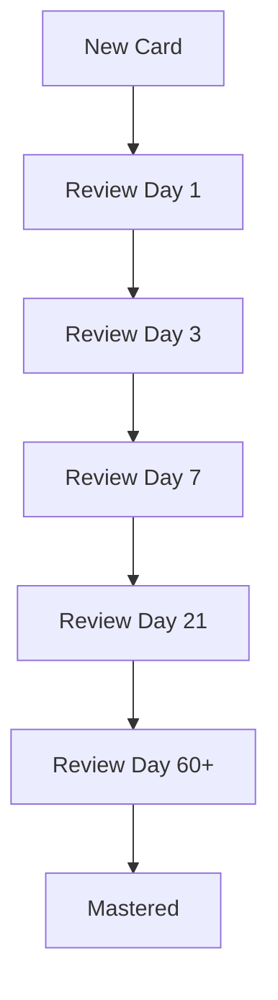
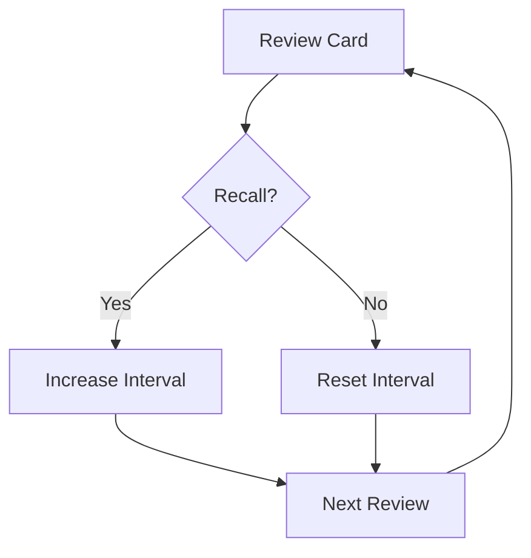

# 112 - Flash Cards

## Introduction

Flash cards are one of the most effective tools for active recall and spaced repetition learning. They force you to actively retrieve information from memory, which strengthens neural pathways and improves long-term retention. In interview preparation, flash cards help you memorize key concepts, formulas, patterns, and quick facts that you need to recall quickly during interviews. This comprehensive guide covers flashcard creation strategies, Anki setup, spaced repetition techniques, and flashcard decks for DSA, OS, DBMS, CN, system design, and behavioral questions.

The power of flash cards lies in their simplicity and effectiveness. Research shows that active recall through flash cards is 50-100% more effective than passive review like re-reading notes. Combined with spaced repetition, flash cards ensure you review material at optimal intervals for maximum retention.

---

## Learning Roadmap

```
Week 1: Setup
  ├── Choose flashcard tool (Anki recommended)
  ├── Learn spaced repetition principles
  ├── Create first deck (100 cards)
  └── Establish daily review routine

Week 2-3: Building Decks
  ├── Create DSA flashcards (100 cards)
  ├── Create OS flashcards (80 cards)
  ├── Create DBMS flashcards (80 cards)
  └── Create Networking flashcards (60 cards)

Week 4: Advanced Decks
  ├── System design flashcards (50 cards)
  ├── Behavioral flashcards (50 cards)
  ├── Programming-specific cards (50 cards)
  └── Optimize review schedule
```

---

## Theory Notes

### Spaced Repetition Science

#### How Spaced Repetition Works
1. **Initial Learning**: You learn a new concept
2. **First Review**: Review after 1 day
3. **Second Review**: Review after 3 days
4. **Third Review**: Review after 7 days
5. **Fourth Review**: Review after 21 days
6. **Maintenance**: Review after 60+ days

The intervals increase as you demonstrate mastery, optimizing review time.

#### The Forgetting Curve
Hermann Ebbinghaus discovered that memory decays exponentially:
- After 1 day: ~60% retention
- After 7 days: ~40% retention
- After 30 days: ~20% retention

Spaced repetition counters this by reviewing just before you'd forget.

### Flashcard Design Principles

#### The Minimum Information Principle
Each card should test one fact or concept:
- **Bad**: "Explain binary search trees"
- **Good**: "What is the time complexity of searching in a BST?"

#### The 20 Rules of Formulation
1. Don't learn what you don't understand
2. Build upon the basics
3. Use mnemonics and memory tricks
4. Use images and visual cues
5. Keep it simple and focused
6. Avoid "orphaned" information
7. Use cloze deletions for key terms
8. Make your own cards
9. Review and refine regularly
10. Test at the appropriate difficulty

### Anki Setup

#### Installation
- Desktop: [apps.ankiweb.net](https://apps.ankiweb.net)
- Mobile: AnkiMobile (iOS) / AnkiDroid (Android)
- Web: AnkiWeb (sync across devices)

#### Basic Settings
- **New cards/day**: 20-30 (adjust based on capacity)
- **Maximum reviews/day**: 200
- **Learning steps**: 1m 10m 1h 1d
- **Graduating interval**: 1 day
- **Easy interval**: 4 days

---

## Key Concepts

### Card Types

#### Basic Cards
- **Front**: Question
- **Back**: Answer
- Use for: Definitions, facts, simple concepts

#### Cloze Deletion Cards
- **Text with blank**: "The time complexity of binary search is {{c1::O(log n)}}"
- Use for: Key terms, formulas, important concepts

#### Image Occlusion Cards
- **Image with hidden labels**: Hide parts of diagrams
- Use for: Anatomy, charts, visual concepts

#### Reverse Cards
- **Front**: Term
- **Back**: Definition
- AND
- **Front**: Definition
- **Back**: Term
- Use for: Bidirectional learning

### Card Quality Indicators

Good flash cards are:
- **Atomic**: One concept per card
- **Clear**: Unambiguous question and answer
- **Contextual**: Includes enough context to understand
- **Memorable**: Uses mnemonics or visual cues
- **Testable**: Can be self-tested effectively

### Deck Organization

#### Recommended Deck Structure
```
Interview Prep/
├── DSA Fundamentals/
│   ├── Data Structures
│   ├── Algorithms
│   ├── Complexity Analysis
│   └── Common Patterns
├── Operating Systems/
│   ├── Process Management
│   ├── Memory Management
│   ├── File Systems
│   └── Scheduling
├── DBMS/
│   ├── SQL Basics
│   ├── Normalization
│   ├── Transactions
│   └── Indexing
├── Computer Networks/
│   ├── OSI Model
│   ├── TCP/IP
│   ├── HTTP/HTTPS
│   └── DNS
├── System Design/
│   ├── Components
│   ├── Patterns
│   ├── Capacity Estimation
│   └── Trade-offs
├── Behavioral/
│   ├── Leadership Principles
│   ├── STAR Stories
│   └── Common Questions
└── Programming/
    ├── Python
    ├── Java
    └── JavaScript
```

---

## FAQ (20+ Q&A)

### Q1: How many flashcards should I create per day?
**A:** Start with 20-30 new cards per day. You can increase as you build capacity, but consistency matters more than volume.

### Q2: Should I make my own cards or use pre-made decks?
**A:** Make your own. The creation process forces you to process and understand the material. Pre-made decks can supplement but shouldn't replace.

### Q3: How long should I review flashcards each day?
**A:** 15-30 minutes daily is sufficient. Consistency is more important than marathon sessions.

### Q4: What's the best flashcard tool?
**A:** Anki is the gold standard for spaced repetition. Other options include Quizlet, Remnote, and SuperMemo.

### Q5: Should cards be simple or detailed?
**A:** Simple. One fact per card. Detail belongs in notes, not flashcards.

### Q6: How do I know when I've mastered a card?
**A:** When you can recall the answer instantly and consistently over multiple reviews at increasing intervals.

### Q7: Should I include code in flashcards?
**A:** Minimal pseudocode or key syntax only. Focus on concepts and patterns, not full implementations.

### Q8: How do I handle cards I keep getting wrong?
**A:** Simplify the card, add context, use mnemonics, or break it into multiple simpler cards.

### Q9: Should I study all decks equally?
**A:** No. Focus more on weak areas and topics you need to review most.

### Q10: How do I use flashcards for behavioral questions?
**A:** Create cards with question on front, key points of your STAR story on back.

### Q11: Should I share decks with others?
**A:** Yes. Sharing benefits others and reviewing others' cards can give you new perspectives.

### Q12: How do I handle cards that become too easy?
**A:** Delete them or increase their interval. Don't waste time on mastered material.

### Q13: Should I create cards while reading or after?
**A:** After. Process the information first, then create cards for key takeaways.

### Q14: How do I prevent flashcard fatigue?
**A:** Keep sessions short, vary decks, use gamification, and focus on quality over quantity.

### Q15: Should I use images in flashcards?
**A:** Yes, especially for visual concepts. Images enhance memory and provide context.

### Q16: How do I sync flashcards across devices?
**A:** Use AnkiWeb for automatic sync between desktop, mobile, and web.

### Q17: Should I review cards in order or random?
**A:** Anki's algorithm handles optimal ordering. Don't manually sort.

### Q18: How do I know if my cards are effective?
**A:** Track your retention rate. Aim for 85-90% recall rate at review time.

### Q19: Should I delete cards after mastering them?
**A:** No. Let the algorithm handle intervals. Delete only if the information is outdated.

### Q20: How many cards should be in a deck?
**A:** No maximum, but organize into subdecks for manageability. 100-300 cards per subdeck is manageable.

---

## Hands-on Practice

### Exercise 1: First Deck Creation
Create your first Anki deck with 50 cards covering:
- 10 data structures
- 10 algorithms
- 10 SQL concepts
- 10 OS concepts
- 10 networking concepts

### Exercise 2: Daily Review Routine
Establish a daily review routine:
- Morning: 15 minutes of review
- Evening: 10 minutes of new cards
- Track retention rate

### Exercise 3: Cloze Deletion Practice
Convert 20 existing notes into cloze deletion cards:
- "The time complexity of quicksort is {{c1::O(n log n)}} average"
- "TCP is {{c1::connection-oriented}} while UDP is {{c1::connectionless}}"

### Exercise 4: Image Occlusion Cards
Create 10 image occlusion cards:
- OSI model layers
- Binary tree structures
- Database schema diagrams
- Network topology

### Exercise 5: Behavioral Cards
Create 20 behavioral flashcards:
- Question on front
- Key STAR points on back
- LP mapping included

---

## FAANG Questions

### FAANG-Specific Flashcard Focus

#### Amazon
- **LP Cards**: 16 Leadership Principles with examples
- **Coding Cards**: Common data structure operations
- **System Design**: Scalable service patterns

#### Google
- **Algorithm Cards**: Key algorithms with complexity
- **Problem Pattern Cards**: When to use each pattern
- **System Design**: Large-scale system components

#### Meta
- **Practical Cards**: Real-world coding patterns
- **Speed Cards**: Quick recall for efficient coding
- **System Design**: Social feature patterns

#### Apple
- **Quality Cards**: Best practices and principles
- **Detail Cards**: Important implementation details
- **UX Cards**: User experience considerations

#### Microsoft
- **Growth Cards**: Learning and adaptation concepts
- **Collaboration Cards**: Team dynamics principles
- **Problem-Solving Cards**: Approaches and frameworks

---

## Common Mistakes

### Mistake 1: Too Many Cards Per Card
Each card should test ONE fact. Break complex topics into multiple cards.

### Mistake 2: Making Cards Too Detailed
Flashcards are for recall, not explanation. Keep them concise.

### Mistake 3: Not Using Spaced Repetition
Random review is less effective. Use Anki's algorithm for optimal intervals.

### Mistake 4: Creating Cards You Don't Understand
Don't memorize what you don't understand. Learn first, then create cards.

### Mistake 5: Never Deleting Old Cards
Review and prune outdated or too-easy cards regularly.

### Mistake 6: Marathon Review Sessions
Short, daily sessions are more effective than occasional long sessions.

### Mistake 7: Not Tracking Progress
Monitor retention rate and adjust strategy based on results.

### Mistake 8: Copying Without Processing
Create cards from your own understanding, not by copying.

---

## Best Practices

1. **Atomic Cards**: One fact per card, no exceptions
2. **Daily Review**: Consistency beats intensity
3. **Own Cards**: Create from your own understanding
4. **Use Cloze**: Great for key terms and formulas
5. **Add Images**: Visual cues enhance memory
6. **Track Retention**: Aim for 85-90% recall
7. **Prune Regularly**: Delete outdated or mastered cards
8. **Varied Decks**: Cover all interview topics
9. **Share Decks**: Benefit others while reinforcing learning
10. **Integrate with Study**: Use alongside other preparation methods

---

## Cheat Sheet

```
FLASH CARDS CHEAT SHEET
========================

SPACED REPETITION:
Day 1 → Day 3 → Day 7 → Day 21 → Day 60+
(Review just before forgetting)

CARD TYPES:
□ Basic (Question → Answer)
□ Cloze (Fill in the blank)
□ Image Occlusion (Hide labels)
□ Reverse (Bidirectional)

DESIGN PRINCIPLES:
□ One fact per card
□ Clear and unambiguous
□ Include context
□ Use mnemonics
□ Add images

ANKI SETTINGS:
New cards/day: 20-30
Max reviews/day: 200
Learning steps: 1m 10m 1h 1d
Graduating interval: 1 day

DECK STRUCTURE:
├── DSA Fundamentals
├── Operating Systems
├── DBMS
├── Computer Networks
├── System Design
├── Behavioral
└── Programming Languages

DAILY ROUTINE:
Morning: 15 min review
Evening: 10 min new cards
Weekly: Prune and update

QUALITY METRICS:
Retention rate: 85-90%
New cards/day: 20-30
Review time: 15-30 min/day
```

---

## Flash Cards (20)

### Card 1
**Q:** What is spaced repetition?
**A:** A learning technique where reviews are scheduled at increasing intervals to optimize memory retention.

### Card 2
**Q:** What's the ideal retention rate for flashcards?
**A:** 85-90% recall rate at review time indicates optimal difficulty.

### Card 3
**Q:** How many new cards should you add per day?
**A:** 20-30 new cards per day is recommended for consistent progress.

### Card 4
**Q:** What is a cloze deletion card?
**A:** A card with a blank to fill in, like "The time complexity is {{c1::O(n)}}".

### Card 5
**Q:** What's the minimum information principle?
**A:** Each card should test one fact or concept - keep it atomic.

### Card 6
**Q:** How long should daily flashcard review be?
**A:** 15-30 minutes daily is sufficient and effective.

### Card 7
**Q:** What's the best flashcard tool?
**A:** Anki is the gold standard for spaced repetition learning.

### Card 8
**Q:** Should you make your own cards?
**A:** Yes. The creation process forces you to understand the material.

### Card 9
**Q:** How do you handle cards you keep getting wrong?
**A:** Simplify the card, add context, use mnemonics, or break it into smaller cards.

### Card 10
**Q:** Should flashcards include full code?
**A:** No. Focus on concepts, patterns, and key syntax snippets.

### Card 11
**Q:** What's the Forgetting Curve?
**A:** Memory decays exponentially without review: 60% after 1 day, 40% after 7 days.

### Card 12
**Q:** How do you use flashcards for behavioral questions?
**A:** Question on front, key STAR points on back, with LP mapping.

### Card 13
**Q:** Should you review cards in order or random?
**A:** Let Anki's algorithm handle optimal ordering for best results.

### Card 14
**Q:** How do you sync flashcards across devices?
**A:** Use AnkiWeb for automatic sync between desktop, mobile, and web.

### Card 15
**Q:** Should you delete mastered cards?
**A:** No. Let the algorithm increase intervals. Delete only if outdated.

### Card 16
**Q:** How do you prevent flashcard fatigue?
**A:** Keep sessions short, vary decks, use gamification, and focus on quality.

### Card 17
**Q:** What's image occlusion?
**A:** Hiding labels on diagrams to create visual recall cards.

### Card 18
**Q:** How do you know if cards are effective?
**A:** Track retention rate and adjust difficulty based on results.

### Card 19
**Q:** Should you share decks with others?
**A:** Yes. It benefits others and reviewing others' cards gives new perspectives.

### Card 20
**Q:** What's the most important flashcard principle?
**A:** Consistency - daily review is more important than marathon sessions.

---

## Mind Map

```
                FLASH CARDS
                    |
     ┌──────────────┼──────────────┐
     |              |              |
  CREATION       REVIEW       OPTIMIZATION
     |              |              |
 ┌───┴───┐    ┌────┴────┐    ┌───┴───┐
 |       |    |         |    |       |
 One   Cloze  Daily   Track  Prune  Share
 Fact  Delete Routine Rate  Cards  Decks
```

---

## Mermaid Diagrams

### Spaced Repetition Schedule


### Flashcard Review Flow


---

## Code Examples

```python
# Flashcard System Manager

from dataclasses import dataclass, field
from typing import List, Dict
from datetime import datetime, timedelta
from enum import Enum

class CardDifficulty(Enum):
    EASY = 1
    MEDIUM = 2
    HARD = 3

@dataclass
class Flashcard:
    front: str
    back: str
    deck: str
    difficulty: CardDifficulty = CardDifficulty.MEDIUM
    interval_days: int = 1
    ease_factor: float = 2.5
    review_count: int = 0
    last_reviewed: datetime = field(default_factory=datetime.now)
    next_review: datetime = field(default_factory=lambda: datetime.now() + timedelta(days=1))
    
    def review(self, quality: int):
        """Update card based on review quality (0-5 scale)."""
        self.review_count += 1
        self.last_reviewed = datetime.now()
        
        # Update ease factor
        self.ease_factor = max(1.3, self.ease_factor + 0.1 - (5 - quality) * (0.08 + (5 - quality) * 0.02))
        
        # Update interval
        if quality < 3:
            self.interval_days = 1
        elif self.review_count == 1:
            self.interval_days = 1
        elif self.review_count == 2:
            self.interval_days = 6
        else:
            self.interval_days = int(self.interval_days * self.ease_factor)
        
        self.next_review = datetime.now() + timedelta(days=self.interval_days)
    
    @property
    def is_due(self) -> bool:
        return datetime.now() >= self.next_review
    
    @property
    def days_until_review(self) -> int:
        delta = self.next_review - datetime.now()
        return max(0, delta.days)

class FlashcardDeck:
    def __init__(self, name: str):
        self.name = name
        self.cards: List[Flashcard] = []
    
    def add_card(self, card: Flashcard):
        self.cards.append(card)
    
    def get_due_cards(self) -> List[Flashcard]:
        return [c for c in self.cards if c.is_due]
    
    def get_stats(self) -> Dict:
        total = len(self.cards)
        due = len(self.get_due_cards())
        mastered = sum(1 for c in self.cards if c.interval_days > 30)
        
        avg_ease = sum(c.ease_factor for c in self.cards) / total if total > 0 else 0
        
        return {
            "total_cards": total,
            "due_today": due,
            "mastered": mastered,
            "mastery_rate": mastered / total * 100 if total > 0 else 0,
            "average_ease": round(avg_ease, 2)
        }

class FlashcardManager:
    def __init__(self):
        self.decks: Dict[str, FlashcardDeck] = {}
    
    def create_deck(self, name: str) -> FlashcardDeck:
        deck = FlashcardDeck(name)
        self.decks[name] = deck
        return deck
    
    def add_card_to_deck(self, deck_name: str, front: str, back: str):
        if deck_name not in self.decks:
            self.create_deck(deck_name)
        
        card = Flashcard(front=front, back=back, deck=deck_name)
        self.decks[deck_name].add_card(card)
    
    def get_due_cards_all_decks(self) -> List[Flashcard]:
        all_due = []
        for deck in self.decks.values():
            all_due.extend(deck.get_due_cards())
        return all_due
    
    def get_overall_stats(self) -> Dict:
        total_cards = sum(len(d.cards) for d in self.decks.values())
        total_due = sum(len(d.get_due_cards()) for d in self.decks.values())
        total_mastered = sum(
            sum(1 for c in d.cards if c.interval_days > 30) 
            for d in self.decks.values()
        )
        
        return {
            "total_cards": total_cards,
            "total_due": total_due,
            "total_mastered": total_mastered,
            "mastery_rate": total_mastered / total_cards * 100 if total_cards > 0 else 0,
            "deck_count": len(self.decks)
        }
    
    def generate_study_plan(self) -> str:
        """Generate a daily study plan."""
        plan = "\nDAILY STUDY PLAN"
        plan += "\n" + "=" * 50
        
        due_cards = self.get_due_cards_all_decks()
        
        # Group by deck
        by_deck = {}
        for card in due_cards:
            if card.deck not in by_deck:
                by_deck[card.deck] = []
            by_deck[card.deck].append(card)
        
        for deck_name, cards in by_deck.items():
            plan += f"\n\n{deck_name.upper()}"
            plan += f"\n  Due cards: {len(cards)}"
            plan += f"\n  Estimated time: {len(cards) * 0.5:.0f} minutes"
        
        plan += f"\n\nTotal due: {len(due_cards)} cards"
        plan += f"\nEstimated time: {len(due_cards) * 0.5:.0f} minutes"
        
        return plan

# Example usage
manager = FlashcardManager()

# Create DSA deck
dsa_deck = manager.create_deck("DSA Fundamentals")

# Add cards
manager.add_card_to_deck(
    "DSA Fundamentals",
    "What is the time complexity of binary search?",
    "O(log n) - eliminates half the search space each step"
)

manager.add_card_to_deck(
    "DSA Fundamentals",
    "When should you use a hash table?",
    "When you need O(1) average-case lookup, insert, and delete operations"
)

manager.add_card_to_deck(
    "DSA Fundamentals",
    "What is the space complexity of merge sort?",
    "O(n) - requires additional space for merging"
)

# Create SQL deck
sql_deck = manager.create_deck("SQL")

manager.add_card_to_deck(
    "SQL",
    "What is the difference between WHERE and HAVING?",
    "WHERE filters rows before grouping; HAVING filters groups after aggregation"
)

manager.add_card_to_deck(
    "SQL",
    "What is a window function?",
    "A function that performs calculations across rows related to the current row without collapsing them"
)

# Simulate reviews
for card in dsa_deck.cards:
    card.review(4)  # Good quality review

# Get stats
print("DECK STATS:")
for name, deck in manager.decks.items():
    stats = deck.get_stats()
    print(f"\n{name}:")
    print(f"  Total cards: {stats['total_cards']}")
    print(f"  Due today: {stats['due_today']}")
    print(f"  Mastery rate: {stats['mastery_rate']:.1f}%")

# Generate study plan
print(manager.generate_study_plan())
```

---

## Resources

### Tools
- [Anki](https://apps.ankiweb.net) - Spaced repetition software
- [AnkiWeb](https://ankiweb.net) - Web interface
- [AnkiDroid](https://play.google.com/store/apps/details?id=com.ichi2.anki) - Android app
- [Quizlet](https://quizlet.com) - Alternative flashcard tool

### Pre-made Decks
- [AnkiWeb Shared Decks](https://ankiweb.net/shared/decks)
- [Cram Fighter](https://cramfighter.com) - MCAT/USMLE decks
- [r/Anki](https://reddit.com/r/Anki) - Community decks

---

## Checklist

- [ ] Installed Anki and set up account
- [ ] Created DSA flashcard deck (50+ cards)
- [ ] Created OS flashcard deck (40+ cards)
- [ ] Created DBMS flashcard deck (40+ cards)
- [ ] Created Networking flashcard deck (30+ cards)
- [ ] Created System Design deck (25+ cards)
- [ ] Created Behavioral deck (25+ cards)
- [ ] Established daily review routine
- [ ] Tracked retention rate
- [ ] Pruned mastered/outdated cards
- [ ] Shared decks with study partners
- [ ] Optimized review schedule

---

## Mock Interviews

### Flashcard Review for Mock Interviews

**Before each mock:**
1. Review relevant flashcard deck for 10 minutes
2. Focus on cards you've gotten wrong recently
3. Test yourself on key concepts
4. Note any gaps to address

---

## Difficulty Rating

| Aspect | Rating (1-10) | Notes |
|--------|---------------|-------|
| Setup Time | 3/10 | Quick tool setup |
| Card Creation | 5/10 | Requires processing material |
| Daily Maintenance | 3/10 | 15-30 minutes daily |
| Retention Impact | 9/10 | Highly effective for memory |
| Long-term Value | 9/10 | Skills transfer to career |
| Overall Difficulty | 3/10 | Low barrier, high reward |

---

## Summary

Flash cards with spaced repetition are one of the most effective tools for interview preparation. They force active recall, optimize review timing, and ensure long-term retention of key concepts. Use Anki for its powerful spaced repetition algorithm, create atomic cards focused on single facts, and maintain a consistent daily review routine. The combination of flash cards with other study methods creates a comprehensive preparation strategy that maximizes your chances of interview success.
