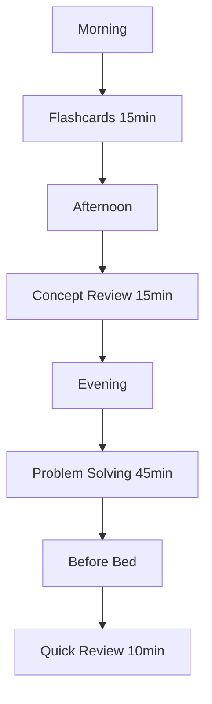
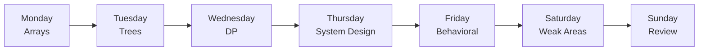

# 113 - Daily Revision

## Introduction

Daily revision is the practice of consistently reviewing and reinforcing what you've learned on a regular basis. It's one of the most effective study strategies because it leverages the spacing effect - reviewing material at increasing intervals to strengthen long-term memory. This comprehensive guide covers daily study routines, topic rotation strategies, problem-solving goals, revision techniques, progress tracking, and time allocation for effective interview preparation.

The key to successful daily revision is consistency and structure. A well-designed daily routine ensures you cover all necessary topics while focusing on your weak areas. This guide provides practical frameworks, schedules, and techniques to make your daily revision efficient and effective.

---

## Learning Roadmap

```
Week 1: Foundation
  ├── Establish daily routine
  ├── Set up tracking system
  ├── Identify core topics
  └── Set realistic goals

Week 2-3: Implementation
  ├── Follow daily schedule
  ├── Track progress daily
  ├── Adjust time allocation
  └── Focus on weak areas

Week 4: Optimization
  ├── Review what's working
  ├── Adjust schedule based on results
  ├── Add new techniques
  └── Prepare for next month
```

---

## Theory Notes

### The Science of Daily Revision

#### Spacing Effect
- Material is better retained when reviewed at increasing intervals
- Daily review prevents the forgetting curve from taking effect
- Consistent review creates stronger neural pathways

#### Active Recall
- Actively retrieving information strengthens memory more than passive review
- Testing yourself is more effective than re-reading
- Flash cards leverage active recall effectively

#### Interleaving
- Mixing different topics during study sessions improves retention
- Alternating between problem types enhances pattern recognition
- Prevents mental fatigue from focusing on one topic too long

### Daily Study Routine Components

#### The 80/20 Rule for Study
- 20% of topics account for 80% of interview questions
- Focus daily revision on the most high-impact topics
- Don't spend equal time on everything - prioritize by importance

#### Time Blocking
- Dedicate specific time blocks to specific activities
- Protect your study time from interruptions
- Use techniques like Pomodoro for focus

### Revision Techniques

#### 1. Flash Card Review
- Use Anki or similar spaced repetition tools
- Review due cards daily
- Focus on cards with low retention rates

#### 2. Problem Solving
- Solve 1-2 coding problems daily
- Focus on patterns, not just solutions
- Track problems solved and patterns learned

#### 3. Concept Review
- Review key concepts using cheat sheets
- Teach concepts to others (real or imaginary)
- Connect new concepts to existing knowledge

#### 4. Self-Testing
- Quiz yourself without looking at notes
- Time yourself on practice problems
- Review mistakes immediately

---

## Key Concepts

### Daily Goal Setting

#### The SMART Framework for Daily Goals
- **Specific**: "Solve 2 array problems" not "Practice DSA"
- **Measurable**: Trackable with clear success criteria
- **Achievable**: Realistic given your schedule
- **Relevant**: Aligned with interview preparation
- **Time-bound**: Completed within the day

#### Sample Daily Goals
- **Technical**: Solve 2 coding problems (30-60 minutes)
- **Concept Review**: Review 10 flashcards (15 minutes)
- **Behavioral**: Practice 1 STAR story (10 minutes)
- **System Design**: Review 1 concept (15 minutes)
- **Mock Interview**: 1 per week (45-60 minutes)

### Topic Rotation Strategy

#### Weekly Rotation
- **Monday**: Arrays & Strings
- **Tuesday**: Trees & Graphs
- **Wednesday**: Dynamic Programming
- **Thursday**: System Design
- **Friday**: Behavioral Practice
- **Saturday**: Weak Areas Focus
- **Sunday**: Review & Planning

#### Priority-Based Rotation
- Focus more time on weak areas
- Maintain strong areas with less time
- Adjust based on progress and upcoming interviews

### Progress Tracking

#### Daily Metrics
- Problems solved
- Flashcards reviewed
- Concepts learned
- Time spent studying
- Retention rate

#### Weekly Metrics
- Total problems solved
- Topics covered
- Weak areas identified
- Confidence level (1-10)

---

## FAQ (20+ Q&A)

### Q1: How long should I study each day?
**A:** 1-2 hours daily is sufficient for consistent progress. Quality matters more than quantity.

### Q2: What's the best time of day to study?
**A:** Whenever you're most alert and focused. Many people prefer morning or evening - find your peak time.

### Q3: Should I study the same topic every day?
**A:** No. Use topic rotation to cover breadth while focusing more on weak areas.

### Q4: How do I stay motivated for daily study?
**A:** Set small, achievable goals, track progress, reward yourself, and remember your "why."

### Q5: Should I take breaks during study sessions?
**A:** Yes. Use techniques like Pomodoro (25 min study, 5 min break) to maintain focus.

### Q6: How do I handle days when I can't study?
**A:** Don't skip entirely. Even 10 minutes of flashcard review maintains momentum.

### Q7: Should I study on weekends?
**A:** Yes, but you can do lighter sessions. Use weekends for review and weak areas.

### Q8: How do I track my progress?
**A:** Use a spreadsheet, app, or journal to track daily metrics and weekly summaries.

### Q9: What if I'm not making progress?
**A:** Reassess your goals, adjust your schedule, and consider getting help or changing techniques.

### Q10: Should I study with others?
**A:** Yes, if it helps you stay accountable. Solo study works for others - find what works for you.

### Q11: How do I handle burnout?
**A:** Take a day off, reduce study load, do something enjoyable, and remember it's a marathon not a sprint.

### Q12: Should I review material I already know well?
**A:** Minimal maintenance review is enough. Focus time on weak areas.

### Q13: How do I know what to study each day?
**A:** Follow your rotation schedule, adjust based on progress, and focus on upcoming interview priorities.

### Q14: Should I study before bed?
**A:** Light review before bed can help consolidation. Avoid heavy studying that affects sleep.

### Q15: How do I handle multiple topics?
**A:** Use time blocking and rotation to give each topic dedicated time.

### Q16: Should I track time spent studying?
**A:** Yes, it helps with accountability and ensuring you're putting in sufficient effort.

### Q17: How do I adjust my plan based on progress?
**A:** Review weekly, identify what's working, and adjust time allocation accordingly.

### Q18: Should I study during lunch breaks?
**A:** Light review (flashcards, cheat sheets) can be effective. Avoid heavy studying.

### Q19: How do I stay consistent?
**A:** Build habits, schedule study time, use accountability partners, and track streaks.

### Q20: What if I have an interview soon?
**A:** Increase study intensity, focus on mock interviews, and review key concepts.

---

## Hands-on Practice

### Exercise 1: Create Daily Schedule
Design a daily study schedule:
- Morning: Flashcard review (15 min)
- Lunch: Light concept review (15 min)
- Evening: Problem solving (45 min)
- Before bed: Quick review (10 min)

### Exercise 2: Weekly Topic Rotation
Create a weekly rotation plan:
- Assign topics to each day
- Allocate time based on priority
- Include review and weak areas

### Exercise 3: Progress Tracker
Create a progress tracking system:
- Daily spreadsheet with metrics
- Weekly summary
- Monthly review

### Exercise 4: Goal Setting
Set SMART goals for the week:
- 3-5 specific, measurable goals
- Aligned with interview preparation
- Time-bound with deadlines

### Exercise 5: Accountability System
Set up accountability:
- Study partner or group
- Public commitments
- Regular check-ins

---

## FAANG Questions

### FAANG Daily Study Patterns

#### Amazon Preparation
- **Daily**: 2 coding problems + 10 flashcards
- **Weekly**: 1 behavioral practice + 1 system design
- **Focus**: Leadership Principles stories

#### Google Preparation
- **Daily**: 2 algorithm problems + concept review
- **Weekly**: 1 system design + 1 mock interview
- **Focus**: Problem-solving approach

#### Meta Preparation
- **Daily**: 2 practical coding problems
- **Weekly**: 1 system design + behavioral practice
- **Focus**: Speed and efficiency

#### Apple Preparation
- **Daily**: 1-2 problems + quality review
- **Weekly**: 1 system design + UX discussion
- **Focus**: Attention to detail

#### Microsoft Preparation
- **Daily**: 2 problems + growth mindset reflection
- **Weekly**: 1 mock interview + concept review
- **Focus**: Learning and collaboration

---

## Common Mistakes

### Mistake 1: Cramming Instead of Consistency
Daily, consistent study is more effective than occasional marathons.

### Mistake 2: Not Tracking Progress
Without tracking, you can't identify what's working and what isn't.

### Mistake 3: Ignoring Weak Areas
Focusing only on comfortable topics doesn't address gaps.

### Mistake 4: Studying Without Breaks
Continuous studying leads to fatigue and reduced retention.

### Mistake 5: Setting Unrealistic Goals
Overambitious goals lead to burnout and discouragement.

### Mistake 6: Not Reviewing Mistakes
Learning from errors is crucial for improvement.

### Mistake 7: Studying Passively
Active engagement (problem solving, self-testing) is more effective than passive review.

### Mistake 8: Comparing to Others
Everyone's journey is different. Focus on your own progress.

---

## Best Practices

1. **Be Consistent**: Study at the same time daily
2. **Set Specific Goals**: Know exactly what you'll accomplish
3. **Track Progress**: Measure to manage
4. **Focus on Weaknesses**: Spend more time on what's hard
5. **Take Breaks**: Use Pomodoro or similar techniques
6. **Review Mistakes**: Learn from errors immediately
7. **Stay Active**: Problem solve, don't just read
8. **Adjust Regularly**: Refine your plan based on results
9. **Stay Accountable**: Use partners or public commitments
10. **Celebrate Progress**: Acknowledge achievements

---

## Cheat Sheet

```
DAILY REVISION CHEAT SHEET
===========================

DAILY ROUTINE:
□ Morning: Flashcards (15 min)
□ Afternoon: Concept review (15 min)
□ Evening: Problem solving (45 min)
□ Before bed: Quick review (10 min)

WEEKLY ROTATION:
Monday: Arrays & Strings
Tuesday: Trees & Graphs
Wednesday: Dynamic Programming
Thursday: System Design
Friday: Behavioral Practice
Saturday: Weak Areas Focus
Sunday: Review & Planning

DAILY GOALS (SMART):
□ Specific: "Solve 2 array problems"
□ Measurable: Trackable with criteria
□ Achievable: Realistic for schedule
□ Relevant: Aligned with interview prep
□ Time-bound: Completed within day

TRACKING METRICS:
□ Problems solved
□ Flashcards reviewed
□ Concepts learned
□ Time spent
□ Retention rate

TIME ALLOCATION:
Problem Solving: 45 min
Flashcards: 15 min
Concept Review: 15 min
Behavioral: 10 min
System Design: 15 min

TECHNIQUES:
□ Pomodoro (25/5)
□ Active recall
□ Self-testing
□ Teaching concepts
□ Spaced repetition

PROGRESS REVIEW:
Daily: Track metrics
Weekly: Assess progress
Monthly: Adjust plan
```

---

## Flash Cards (20)

### Card 1
**Q:** How long should you study each day?
**A:** 1-2 hours daily for consistent progress. Quality over quantity.

### Card 2
**Q:** What's the spacing effect?
**A:** Material is better retained when reviewed at increasing intervals.

### Card 3
**Q:** Should you study the same topic every day?
**A:** No. Use topic rotation while focusing more on weak areas.

### Card 4
**Q:** What's the Pomodoro technique?
**A:** 25 minutes of focused study followed by a 5-minute break.

### Card 5
**Q:** How do you stay motivated for daily study?
**A:** Set small goals, track progress, reward yourself, and remember your "why."

### Card 6
**Q:** Should you take breaks during study sessions?
**A:** Yes. Breaks maintain focus and prevent fatigue.

### Card 7
**Q:** How do you track your progress?
**A:** Use spreadsheets, apps, or journals to track daily metrics.

### Card 8
**Q:** What if you can't study one day?
**A:** Don't skip entirely. Even 10 minutes of flashcards maintains momentum.

### Card 9
**Q:** Should you study on weekends?
**A:** Yes, but lighter sessions. Use weekends for review and weak areas.

### Card 10
**Q:** How do you handle burnout?
**A:** Take a day off, reduce load, do something enjoyable, and remember it's a marathon.

### Card 11
**Q:** Should you study before bed?
**A:** Light review helps consolidation. Avoid heavy studying that affects sleep.

### Card 12
**Q:** What's active recall?
**A:** Actively retrieving information from memory, which strengthens retention.

### Card 13
**Q:** Should you track time spent studying?
**A:** Yes, for accountability and ensuring sufficient effort.

### Card 14
**Q:** How do you adjust your plan?
**A:** Review weekly, identify what's working, and adjust time allocation.

### Card 15
**Q:** Should you study with others?
**A:** If it helps accountability. Solo study works for others - find what works.

### Card 16
**Q:** How do you handle multiple topics?
**A:** Use time blocking and rotation for dedicated time per topic.

### Card 17
**Q:** Should you review known material?
**A:** Minimal maintenance is enough. Focus on weak areas.

### Card 18
**Q:** How do you stay consistent?
**A:** Build habits, schedule time, use accountability, and track streaks.

### Card 19
**Q:** What's interleaving?
**A:** Mixing different topics during study sessions to improve retention.

### Card 20
**Q:** Should you study during lunch?
**A:** Light review is effective. Avoid heavy studying.

---

## Mind Map

```
               DAILY REVISION
                   |
    ┌──────────────┼──────────────┐
    |              |              |
  ROUTINE       GOALS         TRACKING
    |              |              |
 ┌──┴──┐     ┌────┴────┐    ┌───┴───┐
 |     |     |         |    |       |
Time  Breaks SMART   Weekly Daily  Weekly
Block Pomodoro Goals  Topics Metrics Review
```

---

## Mermaid Diagrams

### Daily Study Flow


### Topic Rotation


---

## Code Examples

```python
# Daily Revision Tracker

from dataclasses import dataclass, field
from typing import List, Dict
from datetime import datetime, timedelta
from enum import Enum

class StudyActivity(Enum):
    PROBLEM_SOLVING = "Problem Solving"
    FLASHCARDS = "Flashcards"
    CONCEPT_REVIEW = "Concept Review"
    BEHAVIORAL = "Behavioral Practice"
    SYSTEM_DESIGN = "System Design"
    MOCK_INTERVIEW = "Mock Interview"

@dataclass
class DailySession:
    date: datetime
    activities: Dict[StudyActivity, int] = field(default_factory=dict)
    problems_solved: int = 0
    concepts_reviewed: int = 0
    flashcards_reviewed: int = 0
    notes: str = ""
    
    @property
    def total_minutes(self) -> int:
        return sum(self.activities.values())
    
    @property
    def goals_met(self) -> bool:
        return (
            self.problems_solved >= 2 and
            self.flashcards_reviewed >= 20
        )

@dataclass
class WeeklyGoal:
    topic: str
    target_problems: int
    target_concepts: int
    target_minutes: int
    actual_problems: int = 0
    actual_concepts: int = 0
    actual_minutes: int = 0
    
    @property
    def completion_rate(self) -> float:
        problem_rate = min(1, self.actual_problems / self.target_problems) if self.target_problems > 0 else 0
        concept_rate = min(1, self.actual_concepts / self.target_concepts) if self.target_concepts > 0 else 0
        time_rate = min(1, self.actual_minutes / self.target_minutes) if self.target_minutes > 0 else 0
        return (problem_rate + concept_rate + time_rate) / 3 * 100

class DailyRevisionTracker:
    def __init__(self):
        self.sessions: List[DailySession] = []
        self.weekly_goals: List[WeeklyGoal] = []
        self.current_week: int = 1
    
    def log_session(self, session: DailySession):
        self.sessions.append(session)
    
    def add_weekly_goal(self, goal: WeeklyGoal):
        self.weekly_goals.append(goal)
    
    def get_streak(self) -> int:
        """Calculate current study streak in days."""
        if not self.sessions:
            return 0
        
        streak = 0
        current_date = datetime.now().date()
        
        session_dates = {s.date.date() for s in self.sessions}
        
        while current_date in session_dates:
            streak += 1
            current_date -= timedelta(days=1)
        
        return streak
    
    def get_weekly_summary(self, week_number: int) -> Dict:
        """Get summary for a specific week."""
        week_sessions = [
            s for s in self.sessions 
            if s.date.isocalendar()[1] == week_number
        ]
        
        if not week_sessions:
            return {"message": "No sessions found for this week"}
        
        total_problems = sum(s.problems_solved for s in week_sessions)
        total_concepts = sum(s.concepts_reviewed for s in week_sessions)
        total_flashcards = sum(s.flashcards_reviewed for s in week_sessions)
        total_minutes = sum(s.total_minutes for s in week_sessions)
        
        return {
            "week": week_number,
            "sessions": len(week_sessions),
            "total_problems": total_problems,
            "total_concepts": total_concepts,
            "total_flashcards": total_flashcards,
            "total_minutes": total_minutes,
            "avg_minutes_per_day": total_minutes / len(week_sessions) if week_sessions else 0,
            "goals_met_days": sum(1 for s in week_sessions if s.goals_met)
        }
    
    def identify_weak_areas(self) -> List[Dict]:
        """Identify areas needing more focus."""
        # Analyze by activity type
        activity_counts = {}
        for session in self.sessions:
            for activity, minutes in session.activities.items():
                if activity not in activity_counts:
                    activity_counts[activity] = {"count": 0, "total_minutes": 0}
                activity_counts[activity]["count"] += 1
                activity_counts[activity]["total_minutes"] += minutes
        
        weak_areas = []
        for activity, data in activity_counts.items():
            avg_minutes = data["total_minutes"] / len(self.sessions) if self.sessions else 0
            if avg_minutes < 15:  # Less than 15 minutes average
                weak_areas.append({
                    "activity": activity.value,
                    "average_minutes": round(avg_minutes, 1),
                    "recommendation": f"Increase {activity.value} time to at least 15 minutes daily"
                })
        
        return weak_areas
    
    def generate_report(self) -> str:
        """Generate comprehensive revision report."""
        report = f"\n{'='*60}"
        report += f"\nDAILY REVISION REPORT"
        report += f"\n{'='*60}"
        
        # Overall stats
        total_sessions = len(self.sessions)
        total_problems = sum(s.problems_solved for s in self.sessions)
        total_minutes = sum(s.total_minutes for s in self.sessions)
        streak = self.get_streak()
        
        report += f"\n\nOverall Statistics:"
        report += f"\n  Total Sessions: {total_sessions}"
        report += f"\n  Total Problems Solved: {total_problems}"
        report += f"\n  Total Study Time: {total_minutes // 60}h {total_minutes % 60}m"
        report += f"\n  Current Streak: {streak} days"
        
        # Weekly progress
        if self.sessions:
            current_week = datetime.now().isocalendar()[1]
            weekly_summary = self.get_weekly_summary(current_week)
            report += f"\n\nThis Week's Progress:"
            report += f"\n  Sessions: {weekly_summary.get('sessions', 0)}"
            report += f"\n  Problems Solved: {weekly_summary.get('total_problems', 0)}"
            report += f"\n  Study Time: {weekly_summary.get('total_minutes', 0)} minutes"
        
        # Weak areas
        weak_areas = self.identify_weak_areas()
        if weak_areas:
            report += f"\n\nAreas Needing More Focus:"
            for area in weak_areas:
                report += f"\n  - {area['activity']}: {area['average_minutes']} min avg"
                report += f"\n    {area['recommendation']}"
        
        # Daily goals compliance
        goals_met_days = sum(1 for s in self.sessions if s.goals_met)
        compliance_rate = goals_met_days / total_sessions * 100 if total_sessions > 0 else 0
        report += f"\n\nDaily Goals Compliance: {compliance_rate:.1f}%"
        report += f"\n  Days goals met: {goals_met_days}/{total_sessions}"
        
        return report

# Example usage
tracker = DailyRevisionTracker()

# Log some sessions
for i in range(7):
    session = DailySession(
        date=datetime.now() - timedelta(days=i),
        activities={
            StudyActivity.PROBLEM_SOLVING: 45,
            StudyActivity.FLASHCARDS: 15,
            StudyActivity.CONCEPT_REVIEW: 15,
            StudyActivity.BEHAVIORAL: 10
        },
        problems_solved=2,
        concepts_reviewed=5,
        flashcards_reviewed=25
    )
    tracker.log_session(session)

print(tracker.generate_report())

# Calculate streak
print(f"\nCurrent streak: {tracker.get_streak()} days")
```

---

## Resources

### Apps & Tools
- [Forest](https://www.forestapp.cc) - Focus timer
- [Toggl](https://toggl.com) - Time tracking
- [Notion](https://notion.so) - Study planning
- [Google Calendar](https://calendar.google.com) - Scheduling

### Books
- "Make It Stick" by Brown, Roediger, McDaniel
- "Ultralearning" by Scott Young
- "Deep Work" by Cal Newport

---

## Checklist

- [ ] Established daily study routine
- [ ] Set up tracking system
- [ ] Created weekly topic rotation
- [ ] Set SMART daily goals
- [ ] Established accountability system
- [ ] Tracked progress for 1 week
- [ ] Reviewed and adjusted plan
- [ ] Maintained study streak
- [ ] Identified weak areas
- [ ] Adjusted time allocation based on progress

---

## Mock Interviews

### Daily Revision for Mock Interviews

**Before each mock interview:**
1. Review relevant flashcards (10 min)
2. Practice 1-2 key problems (20 min)
3. Review behavioral stories (10 min)
4. Quick system design review (10 min)

---

## Difficulty Rating

| Aspect | Rating (1-10) | Notes |
|--------|---------------|-------|
| Setup Effort | 3/10 | Quick planning needed |
| Daily Commitment | 6/10 | Requires consistency |
| Time Investment | 5/10 | 1-2 hours daily |
| Impact on Prep | 9/10 | Consistency is key |
| Sustainability | 7/10 | Build habits gradually |
| Overall Difficulty | 5/10 | Moderate; high impact |

---

## Summary

Daily revision is the foundation of effective interview preparation. By maintaining consistent study habits, tracking progress, and focusing on weak areas, you build the knowledge and confidence needed for interview success. Start with a simple routine, build consistency, and adjust based on results. Remember that daily, focused study beats occasional marathon sessions every time. The compound effect of consistent daily effort will prepare you better than any cramming session.
