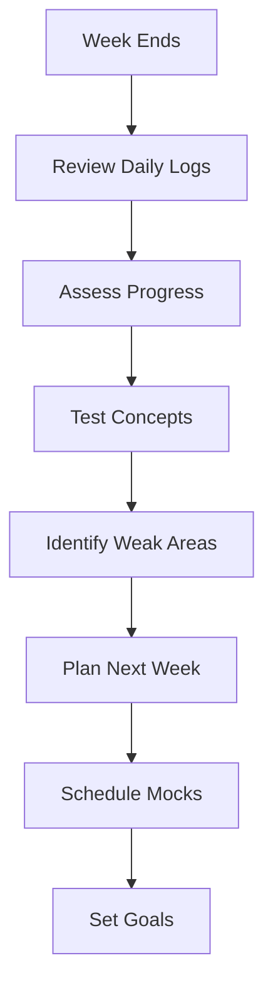
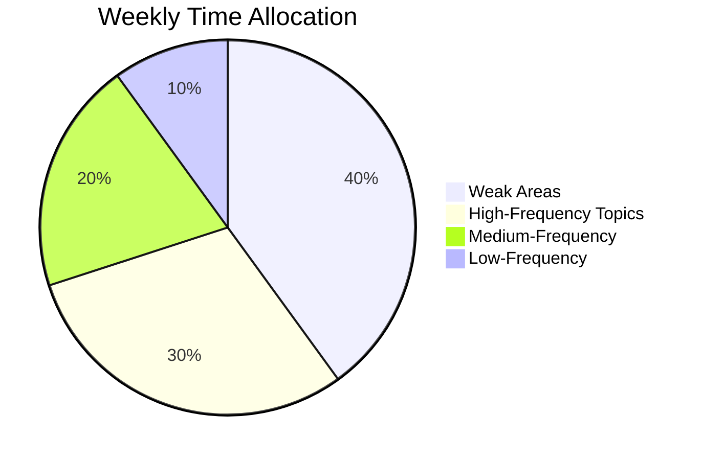

# 114 - Weekly Revision

## Introduction

Weekly revision complements daily study by providing structured time to review the week's learning, assess progress, identify gaps, and plan the upcoming week. While daily revision builds knowledge incrementally, weekly revision ensures nothing falls through the cracks and keeps your preparation on track. This comprehensive guide covers weekly topic focus, weekend mock interviews, weekly assessments, plan adjustments, balanced coverage, and weekly goals templates.

Weekly revision creates a rhythm that balances learning new material with reinforcing what you've already studied. It's the checkpoint that ensures your daily efforts are aligned with your overall preparation goals.

---

## Learning Roadmap

```
Week 1: Establish Rhythm
  ├── Set up weekly review session
  ├── Create assessment framework
  ├── Establish weekend mock schedule
  └── Set weekly goals

Week 2-3: Refine Process
  ├── Conduct weekly reviews
  ├── Assess progress against goals
  ├── Adjust daily routine based on findings
  └── Schedule mock interviews

Week 4: Optimize
  ├── Review monthly progress
  ├── Adjust weekly goals
  ├── Refine assessment criteria
  └── Plan next month
```

---

## Theory Notes

### Why Weekly Revision Matters

#### The forgetting Curve Revisited
- Daily study combats short-term forgetting
- Weekly review addresses medium-term retention gaps
- Monthly review ensures long-term knowledge stability

#### Course Correction
- Weekly review identifies when you're off-track
- Allows adjustment before small issues become big problems
- Ensures balanced coverage across all topics

#### Motivation and Accountability
- Weekly progress reports maintain motivation
- Seeing improvement builds confidence
- Planned mock interviews create milestones

### Weekly Review Components

#### 1. Progress Assessment
- Review daily metrics from the week
- Compare to weekly goals
- Identify what worked and what didn't

#### 2. Knowledge Review
- Review key concepts from the week
- Test yourself on important topics
- Identify any gaps in understanding

#### 3. Weak Area Identification
- Which topics did you struggle with?
- Where did you spend most time?
- What needs more attention next week?

#### 4. Planning
- Set goals for next week
- Schedule mock interviews
- Allocate time based on priorities

### Weekend Mock Interviews

#### Structure
- **Saturday**: Technical mock (coding + system design)
- **Sunday**: Behavioral mock (STAR stories + LPs)

#### Benefits
- Simulates real interview pressure
- Identifies areas for improvement
- Builds confidence through practice
- Provides feedback from others

---

## Key Concepts

### Weekly Goals Template

#### Goal Categories
1. **Technical Goals**: Problems to solve, concepts to learn
2. **Behavioral Goals**: Stories to prepare, LPs to cover
3. **System Design**: Components to understand, patterns to practice
4. **Mock Interview Goals**: Number and type of mocks
5. **Review Goals**: Topics to review, flashcards to create

### Balanced Coverage Strategy

#### The 40-30-20-10 Rule
- **40%**: Weak areas (most improvement potential)
- **30%**: High-frequency interview topics
- **20%**: Medium-frequency topics
- **10%**: Low-frequency topics

#### Topic Rotation Balance
- Don't spend all week on one topic
- Mix technical and behavioral
- Include review alongside new learning
- Plan mock interviews regularly

### Weekly Assessment Framework

#### Self-Assessment Areas
1. **Technical Proficiency**: Can you solve problems independently?
2. **Conceptual Understanding**: Can you explain concepts clearly?
3. **Communication**: Can you articulate your thought process?
4. **Time Management**: Can you solve problems within time limits?
5. **Confidence**: How confident do you feel overall?

#### Scoring System
Rate each area 1-10:
- 1-3: Needs significant work
- 4-6: Developing
- 7-8: Strong
- 9-10: Excellent

---

## FAQ (20+ Q&A)

### Q1: How long should a weekly review session be?
**A:** 1-2 hours on a weekend day. Focus on quality review, not marathon sessions.

### Q2: What should I review each week?
**A:** Topics covered during the week, weak areas, key concepts, and progress toward goals.

### Q3: Should I do mock interviews every week?
**A:** Yes, 1-2 mocks per week is ideal. Alternate between technical and behavioral.

### Q4: How do I assess my progress weekly?
**A:** Review daily metrics, compare to goals, test yourself on key concepts, and rate your confidence.

### Q5: What if I'm not meeting weekly goals?
**A:** Adjust goals to be more realistic, identify barriers, and modify your approach.

### Q6: Should I change my daily routine based on weekly review?
**A:** Yes. If weekly review reveals gaps, adjust daily focus areas accordingly.

### Q7: How do I balance review with new learning?
**A:** Use the 40-30-20-10 rule: 40% weak areas, 30% high-frequency topics, etc.

### Q8: Should I track weekly progress?
**A:** Absolutely. Weekly tracking shows trends and helps adjust your plan.

### Q9: What if I have a busy week and can't study much?
**A:** Do a minimal review session. Even 30 minutes maintains momentum.

### Q10: How do I prepare for weekend mock interviews?
**A:** Review relevant topics Friday evening, get good rest, and approach with confidence.

### Q11: Should I review with others?
**A:** Yes, if it helps accountability. Study groups can provide diverse perspectives.

### Q12: How do I know what to focus on next week?
**A:** Base it on this week's weak areas, upcoming interview priorities, and goal progress.

### Q13: What's the best day for weekly review?
**A:** Usually Sunday, but choose a day when you're fresh and focused.

### Q14: Should I create new cheat sheets weekly?
**A:** Update existing ones as needed. Create new sheets for new topics.

### Q15: How do I handle topics I'm struggling with?
**A:** Spend more time on them, seek help, and break them into smaller parts.

### Q16: Should I review flashcards during weekly review?
**A:** Yes, review weak flashcards and add new ones based on the week's learning.

### Q17: How do I stay motivated if progress is slow?
**A:** Focus on small wins, track improvement over time, and remember your long-term goals.

### Q18: Should I adjust my weekly goals over time?
**A:** Yes. As you improve, increase goals. If overwhelmed, reduce them.

### Q19: How do I handle multiple interview targets?
**A:** Prioritize based on upcoming deadlines. Give more time to imminent interviews.

### Q20: What's the most important part of weekly review?
**A:** Identifying weak areas and adjusting your plan accordingly.

---

## Hands-on Practice

### Exercise 1: Weekly Review Session
Conduct a complete weekly review:
- Review all daily logs
- Assess progress against goals
- Identify weak areas
- Plan next week

### Exercise 2: Mock Interview Scheduling
Schedule and conduct 1-2 mock interviews:
- Technical mock on Saturday
- Behavioral mock on Sunday
- Get feedback and log improvements

### Exercise 3: Weekly Goal Setting
Set SMART goals for next week:
- 3-5 specific goals
- Aligned with interview priorities
- Time-bound with deadlines

### Exercise 4: Progress Assessment
Create a self-assessment:
- Rate each skill area (1-10)
- Identify improvement areas
- Set targets for next week

### Exercise 5: Balance Check
Review your topic distribution:
- Are you spending time on the right topics?
- Is your time allocation balanced?
- Adjust based on priorities

---

## FAANG Questions

### FAANG Weekly Study Patterns

#### Amazon Weekly Plan
- **Mon-Fri**: 2 problems/day + flashcards
- **Saturday**: 1 behavioral mock + LP review
- **Sunday**: System design + weekly review
- **Focus**: Leadership Principles stories

#### Google Weekly Plan
- **Mon-Fri**: 2 algorithm problems/day
- **Saturday**: 1 coding mock + concept review
- **Sunday**: System design + weekly review
- **Focus**: Problem-solving approach

#### Meta Weekly Plan
- **Mon-Fri**: 2 practical problems/day
- **Saturday**: 1 coding mock + speed practice
- **Sunday**: System design + weekly review
- **Focus**: Efficiency and impact

#### Apple Weekly Plan
- **Mon-Fri**: 1-2 problems/day + quality review
- **Saturday**: 1 mock + UX discussion
- **Sunday**: System design + weekly review
- **Focus**: Attention to detail

#### Microsoft Weekly Plan
- **Mon-Fri**: 2 problems/day + growth reflection
- **Saturday**: 1 mock + learning review
- **Sunday**: System design + weekly review
- **Focus**: Growth mindset

---

## Common Mistakes

### Mistake 1: Skipping Weekly Reviews
Weekly review is essential for course correction. Don't skip it.

### Mistake 2: Not Adjusting Based on Review
Review without action is wasted effort. Change your approach based on findings.

### Mistake 3: Too Many Mock Interviews
1-2 mocks per week is sufficient. More can lead to burnout.

### Mistake 4: Ignoring Weak Areas
Weekly review should identify weak areas and address them.

### Mistake 5: Not Tracking Progress
Without tracking, you can't assess improvement.

### Mistake 6: Unrealistic Weekly Goals
Overambitious goals lead to burnout and discouragement.

### Mistake 7: Only Reviewing New Material
Review old material regularly to maintain retention.

### Mistake 8: Not Planning Next Week
Weekly review should include planning for the upcoming week.

---

## Best Practices

1. **Schedule It**: Block time for weekly review on your calendar
2. **Be Consistent**: Same day and time each week
3. **Review AND Plan**: Assess this week, plan next week
4. **Track Progress**: Use metrics to measure improvement
5. **Focus on Weaknesses**: Spend more time on what's hard
6. **Include Mocks**: Regular practice builds confidence
7. **Adjust Regularly**: Refine your plan based on results
8. **Stay Balanced**: Cover breadth while focusing on depth
9. **Celebrate Wins**: Acknowledge progress to maintain motivation
10. **Keep It Sustainable**: Don't burn out with overambitious plans

---

## Cheat Sheet

```
WEEKLY REVISION CHEAT SHEET
============================

REVIEW SESSION (1-2 hours):
□ Review daily logs (15 min)
□ Assess progress vs goals (15 min)
□ Test key concepts (20 min)
□ Identify weak areas (10 min)
□ Plan next week (20 min)

BALANCED COVERAGE:
40%: Weak areas
30%: High-frequency topics
20%: Medium-frequency topics
10%: Low-frequency topics

ASSESSMENT AREAS (1-10):
□ Technical Proficiency
□ Conceptual Understanding
□ Communication
□ Time Management
□ Confidence

MOCK INTERVIEW SCHEDULE:
Saturday: Technical Mock (1)
Sunday: Behavioral Mock (1)

WEEKLY GOALS TEMPLATE:
□ Technical: X problems, Y concepts
□ Behavioral: X stories, Y LPs
□ System Design: X components, Y patterns
□ Mock Interviews: X total
□ Review: X topics

PROGRESS TRACKING:
Daily: Metrics logged
Weekly: Progress assessed
Monthly: Plan adjusted
```

---

## Flash Cards (20)

### Card 1
**Q:** How long should a weekly review session be?
**A:** 1-2 hours on a weekend day, focusing on quality review.

### Card 2
**Q:** What's the 40-30-20-10 rule?
**A:** 40% weak areas, 30% high-frequency topics, 20% medium, 10% low frequency.

### Card 3
**Q:** How many mock interviews per week?
**A:** 1-2 per week is ideal. Alternate technical and behavioral.

### Card 4
**Q:** What should weekly review include?
**A:** Progress assessment, knowledge review, weak area identification, and planning.

### Card 5
**Q:** Should you adjust daily routine based on weekly review?
**A:** Yes. If review reveals gaps, adjust daily focus areas.

### Card 6
**Q:** What's the best day for weekly review?
**A:** Usually Sunday, but choose a day when you're fresh and focused.

### Card 7
**Q:** How do you assess progress weekly?
**A:** Review daily metrics, compare to goals, test yourself, and rate confidence.

### Card 8
**Q:** Should you track weekly progress?
**A:** Absolutely. Weekly tracking shows trends and helps adjust your plan.

### Card 9
**Q:** What if you can't study one week?
**A:** Do a minimal review. Even 30 minutes maintains momentum.

### Card 10
**Q:** How do you prepare for weekend mocks?
**A:** Review Friday evening, get good rest, approach with confidence.

### Card 11
**Q:** Should you review with others?
**A:** Yes, if it helps accountability. Study groups provide diverse perspectives.

### Card 12
**Q:** How do you know what to focus on next week?
**A:** Base it on weak areas, upcoming priorities, and goal progress.

### Card 13
**Q:** Should you create new cheat sheets weekly?
**A:** Update existing ones. Create new sheets for new topics as needed.

### Card 14
**Q:** How do you handle struggling topics?
**A:** Spend more time, seek help, break into smaller parts.

### Card 15
**Q:** Should you review flashcards during weekly review?
**A:** Yes. Review weak cards and add new ones from the week's learning.

### Card 16
**Q:** How do you stay motivated if progress is slow?
**A:** Focus on small wins, track improvement over time, remember long-term goals.

### Card 17
**Q:** Should you adjust weekly goals over time?
**A:** Yes. Increase as you improve. Reduce if overwhelmed.

### Card 18
**Q:** How do you handle multiple interview targets?
**A:** Prioritize based on deadlines. More time to imminent interviews.

### Card 19
**Q:** What's the most important part of weekly review?
**A:** Identifying weak areas and adjusting your plan accordingly.

### Card 20
**Q:** How do you balance review with new learning?
**A:** Use the 40-30-20-10 rule for balanced coverage.

---

## Mind Map

```
               WEEKLY REVISION
                    |
     ┌──────────────┼──────────────┐
     |              |              |
   REVIEW        ASSESSMENT      PLANNING
     |              |              |
  ┌──┴──┐     ┌────┴────┐    ┌───┴───┐
  |     |     |         |    |       |
Daily  Concept Self    Goals  Next  Mock
Logs   Test   Rate    Review Week  Schedule
```

---

## Mermaid Diagrams

### Weekly Review Flow


### Balanced Coverage


---

## Code Examples

```python
# Weekly Revision Planner

from dataclasses import dataclass, field
from typing import List, Dict
from datetime import datetime, timedelta

@dataclass
class WeeklyGoal:
    category: str
    description: str
    target: int
    actual: int = 0
    
    @property
    def completion_rate(self) -> float:
        return min(100, (self.actual / self.target * 100)) if self.target > 0 else 0

@dataclass
class WeeklyPlan:
    week_number: int
    start_date: datetime
    goals: List[WeeklyGoal] = field(default_factory=list)
    focus_areas: List[str] = field(default_factory=list)
    mock_interviews: int = 0
    review_hours: float = 0
    
    def add_goal(self, category: str, description: str, target: int):
        goal = WeeklyGoal(category=category, description=description, target=target)
        self.goals.append(goal)
    
    def update_progress(self, category: str, actual: int):
        for goal in self.goals:
            if goal.category == category:
                goal.actual = actual
                break
    
    def get_completion_rate(self) -> float:
        if not self.goals:
            return 0.0
        total = sum(g.completion_rate for g in self.goals)
        return total / len(self.goals)

class WeeklyRevisionPlanner:
    def __init__(self):
        self.plans: List[WeeklyPlan] = []
    
    def create_plan(self, week_number: int, start_date: datetime) -> WeeklyPlan:
        plan = WeeklyPlan(week_number=week_number, start_date=start_date)
        self.plans.append(plan)
        return plan
    
    def generate_plan_template(self) -> WeeklyPlan:
        """Generate a standard weekly plan template."""
        plan = WeeklyPlan(
            week_number=datetime.now().isocalendar()[1],
            start_date=datetime.now()
        )
        
        # Technical goals
        plan.add_goal("Technical", "Solve coding problems", 10)
        plan.add_goal("Technical", "Review DSA concepts", 5)
        
        # Behavioral goals
        plan.add_goal("Behavioral", "Practice STAR stories", 3)
        plan.add_goal("Behavioral", "Review Leadership Principles", 2)
        
        # System Design
        plan.add_goal("System Design", "Study components", 3)
        plan.add_goal("System Design", "Practice design problems", 2)
        
        # Mock Interviews
        plan.add_goal("Mock Interviews", "Complete mocks", 2)
        
        # Review
        plan.add_goal("Review", "Review flashcards", 50)
        plan.add_goal("Review", "Update cheat sheets", 2)
        
        plan.focus_areas = ["Weak areas from last week", "High-frequency topics"]
        plan.mock_interviews = 2
        plan.review_hours = 10
        
        return plan
    
    def generate_weekly_review(self, plan: WeeklyPlan) -> str:
        """Generate weekly review report."""
        review = f"\n{'='*60}"
        review += f"\nWEEKLY REVIEW - Week {plan.week_number}"
        review += f"\n{'='*60}"
        
        # Goal completion
        review += f"\n\nGOAL COMPLETION:"
        for goal in plan.goals:
            status = "✓" if goal.completion_rate >= 100 else "○"
            review += f"\n  {status} {goal.description}: {goal.actual}/{goal.target} ({goal.completion_rate:.0f}%)"
        
        overall = plan.get_completion_rate()
        review += f"\n\nOverall Completion: {overall:.1f}%"
        
        # Focus areas
        review += f"\n\nFOCUS AREAS:"
        for area in plan.focus_areas:
            review += f"\n  • {area}"
        
        # Mock interviews
        review += f"\n\nMOCK INTERVIEWS: {plan.mock_interviews}"
        
        # Review time
        review += f"\nREVIEW TIME: {plan.review_hours} hours"
        
        # Recommendations
        review += f"\n\nRECOMMENDATIONS:"
        if overall < 50:
            review += "\n  - Goals may be too ambitious. Consider reducing targets."
        elif overall < 80:
            review += "\n  - Good progress. Focus on consistency."
        else:
            review += "\n  - Excellent progress. Consider increasing goals."
        
        # Weak areas identification
        incomplete = [g for g in plan.goals if g.completion_rate < 80]
        if incomplete:
            review += f"\n\nAREAS NEEDING MORE FOCUS:"
            for goal in incomplete:
                review += f"\n  - {goal.description}"
        
        return review
    
    def compare_weeks(self, week1: WeeklyPlan, week2: WeeklyPlan) -> str:
        """Compare two weeks of progress."""
        comparison = f"\nWEEK COMPARISON"
        comparison += f"\n{'='*50}"
        
        comparison += f"\n\nWeek {week1.week_number}: {week1.get_completion_rate():.1f}% completion"
        comparison += f"\nWeek {week2.week_number}: {week2.get_completion_rate():.1f}% completion"
        
        difference = week2.get_completion_rate() - week1.get_completion_rate()
        trend = "improving" if difference > 0 else "declining" if difference < 0 else "stable"
        
        comparison += f"\n\nTrend: {trend} ({'+' if difference > 0 else ''}{difference:.1f}%)"
        
        return comparison

# Example usage
planner = WeeklyRevisionPlanner()

# Create this week's plan
current_plan = planner.generate_plan_template()

# Simulate progress
current_plan.update_progress("Technical", 8)  # 8/10 problems
current_plan.update_progress("Behavioral", 3)  # 3/3 stories
current_plan.update_progress("System Design", 2)  # 2/3 components
current_plan.update_progress("Mock Interviews", 2)  # 2/2 mocks
current_plan.update_progress("Review", 40)  # 40/50 flashcards

# Generate review
print(planner.generate_weekly_review(current_plan))
```

---

## Resources

### Tools
- [Trello](https://trello.com) - Weekly planning boards
- [Notion](https://notion.so) - Weekly review templates
- [Google Calendar](https://calendar.google.com) - Schedule blocks

### Books
- "The 7 Habits of Highly Effective People" by Stephen Covey
- "Atomic Habits" by James Clear

---

## Checklist

- [ ] Established weekly review routine
- [ ] Created weekly goals template
- [ ] Scheduled mock interviews
- [ ] Conducted weekly review session
- [ ] Assessed progress against goals
- [ ] Identified weak areas
- [ ] Adjusted daily routine
- [ ] Planned next week
- [ ] Tracked weekly metrics
- [ ] Compared to previous weeks

---

## Difficulty Rating

| Aspect | Rating (1-10) | Notes |
|--------|---------------|-------|
| Setup Effort | 3/10 | Quick planning needed |
| Weekly Commitment | 5/10 | 1-2 hours for review |
| Impact on Prep | 8/10 | Essential for course correction |
| Planning Required | 4/10 | Straightforward with templates |
| Sustainability | 8/10 | Easy to maintain long-term |
| Overall Difficulty | 4/10 | Low barrier, high value |

---

## Summary

Weekly revision is the checkpoint that keeps your interview preparation on track. By conducting regular reviews, assessing progress, identifying weak areas, and planning ahead, you ensure that your daily study efforts are aligned with your goals. Include mock interviews in your weekly routine to build confidence and identify areas for improvement. Remember that the goal of weekly review is course correction - use it to adjust your approach and maintain momentum toward interview success.
