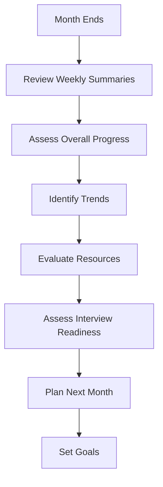
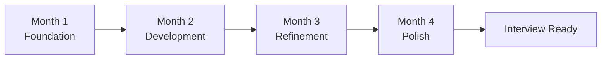

# 115 - Monthly Revision

## Introduction

Monthly revision provides a high-level review of your entire interview preparation journey. While daily and weekly revisions focus on incremental progress, monthly revision helps you step back and evaluate your overall strategy, identify long-term trends, adjust your approach, and build confidence. This comprehensive guide covers monthly milestones, progress tracking, weak area identification, resource adjustment, mock interview scheduling, confidence building, and comprehensive review strategies.

Monthly revision is essential for ensuring your preparation is on track and making strategic adjustments. It's the time to assess whether your daily and weekly efforts are translating into meaningful progress toward your interview goals.

---

## Learning Roadmap

```
Month 1: Foundation
  ├── Set monthly goals
  ├── Establish tracking systems
  ├── Create baseline assessments
  └── Plan monthly review schedule

Month 2-3: Implementation
  ├── Follow daily/weekly routines
  ├── Conduct monthly reviews
  ├── Track progress against goals
  └── Adjust strategy as needed

Month 4+: Optimization
  ├── Refine approach based on results
  ├── Focus on interview readiness
  ├── Increase mock interview frequency
  └── Build confidence
```

---

## Theory Notes

### Why Monthly Revision Matters

#### Strategic Perspective
- Daily/weekly focus can cause tunnel vision
- Monthly review provides big-picture perspective
- Ensures alignment with overall goals

#### Trend Identification
- Monthly tracking reveals patterns
- Identify what's working long-term
- Spot areas needing sustained attention

#### Confidence Building
- Seeing monthly progress builds confidence
- Recognition of improvement motivates continued effort
- Preparation feels more manageable with regular checkpoints

### Monthly Review Components

#### 1. Overall Progress Assessment
- Compare current skills to starting point
- Track improvement across all areas
- Identify major breakthroughs and challenges

#### 2. Goal Progress Review
- Review monthly goals set at start
- Assess completion rates
- Adjust future goals based on results

#### 3. Resource Effectiveness
- Evaluate study materials and methods
- Identify what's working and what isn't
- Adjust resource allocation accordingly

#### 4. Interview Readiness Assessment
- Rate confidence in each interview area
- Identify remaining gaps
- Plan final preparation phases

### Monthly Milestones

#### Typical Monthly Milestones
- **Month 1**: Foundation - Basic concepts, initial practice
- **Month 2**: Development - Intermediate problems, mock interviews
- **Month 3**: Refinement - Advanced topics, confident practice
- **Month 4**: Polish - Weak areas, interview simulation

---

## Key Concepts

### Progress Tracking Methods

#### Quantitative Metrics
- Problems solved per month
- Flashcards reviewed
- Mock interviews completed
- Concepts learned
- Study hours logged

#### Qualitative Metrics
- Confidence level (1-10)
- Comfort with different topics
- Interview simulation performance
- Feedback from mock partners

### Weak Area Identification

#### Systematic Approach
1. Review all assessment scores
2. Identify consistently low-scoring areas
3. Categorize by topic and difficulty
4. Create focused improvement plan

#### Priority Matrix
- **High Priority**: Weak areas in high-frequency topics
- **Medium Priority**: Weak areas in medium-frequency topics
- **Low Priority**: Weak areas in low-frequency topics

### Resource Adjustment

#### When to Change Resources
- Consistent low scores despite study
- Material doesn't match your learning style
- Better resources available for specific topics
- Outdated or irrelevant content

#### How to Adjust
- Try alternative explanations
- Seek different practice sources
- Get help from mentors or peers
- Focus on hands-on practice over theory

---

## FAQ (20+ Q&A)

### Q1: How long should a monthly review session be?
**A:** 2-3 hours for a comprehensive review. Break it into sections if needed.

### Q2: What should I review monthly?
**A:** Overall progress, goal completion, resource effectiveness, interview readiness, and strategic adjustments.

### Q3: How do I assess my overall progress?
**A:** Compare current skills to starting point, track improvement metrics, and get feedback from others.

### Q4: Should I change my study plan monthly?
**A:** Adjust based on results. Keep what works, change what doesn't.

### Q5: How do I identify weak areas systematically?
**A:** Review all assessment scores, identify consistent gaps, and categorize by priority.

### Q6: Should I increase mock interview frequency monthly?
**A:** Yes, as you approach interviews. Start with 1-2 per week, increase to 3-4 closer to interview dates.

### Q7: How do I track monthly progress?
**A:** Use spreadsheets or apps to track quantitative metrics and confidence ratings.

### Q8: What if I'm not making expected progress?
**A:** Reassess your goals, methods, and time allocation. Consider getting help.

### Q9: Should I celebrate monthly achievements?
**A:** Absolutely. Acknowledge progress to maintain motivation.

### Q10: How do I adjust resources monthly?
**A:** Evaluate what's working, try alternatives for what isn't, and focus on effective methods.

### Q11: Should I increase study intensity monthly?
**A:** As you approach interviews, yes. But maintain balance to avoid burnout.

### Q12: How do I build confidence monthly?
**A:** Track improvement, acknowledge wins, and gradually increase challenge level.

### Q13: Should I review all topics monthly?
**A:** Yes, but focus more time on weak areas and high-frequency topics.

### Q14: How do I know if I'm interview-ready?
**A:** Consistent high scores on practice tests, confident mock interview performance, and strong feedback from others.

### Q15: Should I change my daily routine based on monthly review?
**A:** Yes, if monthly review reveals persistent gaps or ineffective methods.

### Q16: How do I handle topics I'm still struggling with after a month?
**A:** Seek different explanations, get help, or break the topic into smaller parts.

### Q17: Should I track qualitative metrics monthly?
**A:** Yes. Confidence and comfort levels are important indicators of readiness.

### Q18: How do I compare myself to interview standards?
**A:** Use practice test scores, mock interview feedback, and industry benchmarks.

### Q19: Should I adjust my interview targets monthly?
**A:** Yes. Based on progress, you may need to adjust target companies or timelines.

### Q20: How do I stay motivated over months of preparation?
**A:** Track progress, celebrate milestones, vary study methods, and remember your "why."

---

## Hands-on Practice

### Exercise 1: Monthly Review Session
Conduct a complete monthly review:
- Review all weekly summaries
- Assess progress against monthly goals
- Identify trends and patterns
- Plan next month

### Exercise 2: Progress Assessment
Create a comprehensive assessment:
- Rate all skill areas (1-10)
- Compare to starting point
- Identify improvement areas
- Set targets for next month

### Exercise 3: Resource Evaluation
Evaluate your study resources:
- Which are most effective?
- Which need replacement?
- What's missing?
- Adjust allocation accordingly

### Exercise 4: Interview Readiness Check
Assess interview readiness:
- Technical proficiency
- Behavioral preparedness
- System design knowledge
- Overall confidence

### Exercise 5: Monthly Planning
Plan next month:
- Set specific goals
- Allocate time by topic
- Schedule mock interviews
- Plan review sessions

---

## FAANG Questions

### FAANG Monthly Milestones

#### Amazon Monthly Plan
- **Month 1**: LP stories + basic coding
- **Month 2**: Advanced coding + system design basics
- **Month 3**: Mock interviews + advanced system design
- **Month 4**: Polish weak areas + full mocks

#### Google Monthly Plan
- **Month 1**: Algorithm fundamentals
- **Month 2**: Advanced algorithms + system design
- **Month 3**: Mock interviews + problem patterns
- **Month 4**: Polish + confidence building

#### Meta Monthly Plan
- **Month 1**: Practical coding + system design basics
- **Month 2**: Advanced topics + speed practice
- **Month 3**: Mock interviews + impact stories
- **Month 4**: Polish + interview simulation

#### Apple Monthly Plan
- **Month 1**: Fundamentals + quality focus
- **Month 2**: Advanced topics + UX understanding
- **Month 3**: Mock interviews + detail orientation
- **Month 4**: Polish + confidence building

#### Microsoft Monthly Plan
- **Month 1**: Problem-solving fundamentals
- **Month 2**: Advanced topics + growth mindset
- **Month 3**: Mock interviews + collaboration
- **Month 4**: Polish + learning demonstration

---

## Common Mistakes

### Mistake 1: Not Doing Monthly Reviews
Monthly review is essential for strategic adjustment. Don't skip it.

### Mistake 2: Only Tracking Quantitative Metrics
Qualitative metrics like confidence are equally important.

### Mistake 3: Not Adjusting Based on Results
Monthly review should lead to action, not just observation.

### Mistake 4: Overwhelming Monthly Goals
Set realistic goals that build on each other monthly.

### Mistake 5: Ignoring Long-term Trends
Monthly review helps identify patterns that weekly review might miss.

### Mistake 6: Not Celebrating Progress
Acknowledging improvement maintains motivation.

### Mistake 7: Same Approach Every Month
Adjust methods based on what's working and what isn't.

### Mistake 8: Not Planning Ahead
Monthly review should include planning for the upcoming month.

---

## Best Practices

1. **Schedule It**: Block time for monthly review on your calendar
2. **Be Comprehensive**: Review all aspects of preparation
3. **Track Trends**: Look for patterns over multiple months
4. **Adjust Strategically**: Make changes based on data, not feelings
5. **Build Confidence**: Acknowledge improvement and celebrate wins
6. **Focus on Gaps**: Identify and address persistent weak areas
7. **Vary Methods**: Try new approaches if current ones aren't working
8. **Plan Ahead**: Set clear goals for the upcoming month
9. **Stay Balanced**: Maintain breadth while focusing on depth
10. **Keep It Sustainable**: Adjust intensity to avoid burnout

---

## Cheat Sheet

```
MONTHLY REVISION CHEAT SHEET
==============================

REVIEW SESSION (2-3 hours):
□ Review weekly summaries (30 min)
□ Assess progress vs goals (30 min)
□ Identify trends (30 min)
□ Evaluate resources (20 min)
□ Assess interview readiness (30 min)
□ Plan next month (40 min)

ASSESSMENT AREAS:
□ Technical proficiency
□ Behavioral preparedness
□ System design knowledge
□ Overall confidence
□ Resource effectiveness

PROGRESS METRICS:
Quantitative:
  Problems solved
  Mock interviews completed
  Study hours logged
  Concepts learned

Qualitative:
  Confidence level (1-10)
  Comfort with topics
  Mock performance
  Peer feedback

WEAK AREA IDENTIFICATION:
1. Review all scores
2. Identify consistent gaps
3. Categorize by priority
4. Create improvement plan

RESOURCE EVALUATION:
□ Which are most effective?
□ Which need replacement?
□ What's missing?
□ Adjust allocation

MONTHLY GOALS TEMPLATE:
□ Technical: X problems, Y concepts
□ Behavioral: X stories, Y LPs
□ System Design: X components, Y patterns
□ Mock Interviews: X total
□ Review: X topics

CONFIDENCE BUILDING:
□ Track improvement
□ Acknowledge wins
□ Increase challenge gradually
□ Celebrate milestones
```

---

## Flash Cards (20)

### Card 1
**Q:** How long should a monthly review session be?
**A:** 2-3 hours for a comprehensive review of all preparation aspects.

### Card 2
**Q:** What's the purpose of monthly revision?
**A:** Strategic perspective, trend identification, and confidence building.

### Card 3
**Q:** What should you review monthly?
**A:** Overall progress, goal completion, resources, interview readiness, and strategic adjustments.

### Card 4
**Q:** How do you assess overall progress?
**A:** Compare current skills to starting point, track metrics, and get feedback.

### Card 5
**Q:** Should you change study plans monthly?
**A:** Adjust based on results. Keep what works, change what doesn't.

### Card 6
**Q:** How do you identify weak areas systematically?
**A:** Review scores, identify consistent gaps, categorize by priority.

### Card 7
**Q:** Should you increase mock interview frequency monthly?
**A:** Yes, as you approach interviews. Start with 1-2/week, increase closer to dates.

### Card 8
**Q:** How do you track monthly progress?
**A:** Use spreadsheets for quantitative metrics and confidence ratings for qualitative.

### Card 9
**Q:** What if you're not making expected progress?
**A:** Reassess goals, methods, and time allocation. Consider getting help.

### Card 10
**Q:** Should you celebrate monthly achievements?
**A:** Absolutely. Acknowledging progress maintains motivation.

### Card 11
**Q:** How do you adjust resources monthly?
**A:** Evaluate effectiveness, try alternatives, focus on what works.

### Card 12
**Q:** Should you increase study intensity monthly?
**A:** As you approach interviews, yes, but maintain balance to avoid burnout.

### Card 13
**Q:** How do you build confidence monthly?
**A:** Track improvement, acknowledge wins, increase challenge gradually.

### Card 14
**Q:** Should you review all topics monthly?
**A:** Yes, but focus more on weak areas and high-frequency topics.

### Card 15
**Q:** How do you know if you're interview-ready?
**A:** Consistent high scores, confident mock performance, and strong feedback.

### Card 16
**Q:** Should you change daily routine based on monthly review?
**A:** Yes, if review reveals persistent gaps or ineffective methods.

### Card 17
**Q:** How do you handle topics you're still struggling with?
**A:** Seek different explanations, get help, or break into smaller parts.

### Card 18
**Q:** Should you track qualitative metrics monthly?
**A:** Yes. Confidence and comfort levels indicate readiness.

### Card 19
**Q:** How do you compare to interview standards?
**A:** Use practice scores, mock feedback, and industry benchmarks.

### Card 20
**Q:** How do you stay motivated over months?
**A:** Track progress, celebrate milestones, vary methods, remember your "why."

---

## Mind Map

```
                MONTHLY REVISION
                     |
      ┌──────────────┼──────────────┐
      |              |              |
   ASSESSMENT     ANALYSIS      PLANNING
      |              |              |
  ┌───┴───┐    ┌────┴────┐    ┌───┴───┐
  |       |    |         |    |       |
Goals  Skills  Trends  Gaps   Next   Resources
Progress Confidence Patterns Priority Month Adjustment
```

---

## Mermaid Diagrams

### Monthly Review Flow


### Monthly Milestones


---

## Code Examples

```python
# Monthly Revision Planner

from dataclasses import dataclass, field
from typing import List, Dict
from datetime import datetime
from enum import Enum

class SkillLevel(Enum):
    BEGINNER = 1
    INTERMEDIATE = 2
    ADVANCED = 3
    EXPERT = 4

@dataclass
class SkillAssessment:
    skill: str
    level: SkillLevel
    score: int  # 1-10
    confidence: int  # 1-10
    notes: str = ""

@dataclass
class MonthlyGoal:
    category: str
    description: str
    target: int
    actual: int = 0
    
    @property
    def completion_rate(self) -> float:
        return min(100, (self.actual / self.target * 100)) if self.target > 0 else 0

@dataclass
class MonthlyPlan:
    month: int
    year: int
    goals: List[MonthlyGoal] = field(default_factory=list)
    skill_assessments: List[SkillAssessment] = field(default_factory=list)
    focus_areas: List[str] = field(default_factory=list)
    mock_interviews_target: int = 0
    study_hours_target: float = 0
    
    def add_goal(self, category: str, description: str, target: int):
        goal = MonthlyGoal(category=category, description=description, target=target)
        self.goals.append(goal)
    
    def add_skill_assessment(self, skill: str, level: SkillLevel, score: int, confidence: int):
        assessment = SkillAssessment(skill=skill, level=level, score=score, confidence=confidence)
        self.skill_assessments.append(assessment)
    
    def get_goal_completion(self) -> float:
        if not self.goals:
            return 0.0
        total = sum(g.completion_rate for g in self.goals)
        return total / len(self.goals)
    
    def get_average_confidence(self) -> float:
        if not self.skill_assessments:
            return 0.0
        return sum(a.confidence for a in self.skill_assessments) / len(self.skill_assessments)

class MonthlyRevisionPlanner:
    def __init__(self):
        self.plans: List[MonthlyPlan] = []
    
    def create_plan(self, month: int, year: int) -> MonthlyPlan:
        plan = MonthlyPlan(month=month, year=year)
        self.plans.append(plan)
        return plan
    
    def generate_plan_template(self) -> MonthlyPlan:
        """Generate a standard monthly plan template."""
        now = datetime.now()
        plan = MonthlyPlan(month=now.month, year=now.year)
        
        # Technical goals
        plan.add_goal("Technical", "Solve coding problems", 40)
        plan.add_goal("Technical", "Review DSA concepts", 20)
        
        # Behavioral goals
        plan.add_goal("Behavioral", "Practice STAR stories", 12)
        plan.add_goal("Behavioral", "Review Leadership Principles", 8)
        
        # System Design
        plan.add_goal("System Design", "Study components", 12)
        plan.add_goal("System Design", "Practice design problems", 8)
        
        # Mock Interviews
        plan.add_goal("Mock Interviews", "Complete mocks", 8)
        
        # Review
        plan.add_goal("Review", "Review flashcards", 200)
        plan.add_goal("Review", "Update cheat sheets", 8)
        
        plan.focus_areas = ["Weak areas from assessment", "High-frequency topics"]
        plan.mock_interviews_target = 8
        plan.study_hours_target = 60
        
        # Initial skill assessments
        plan.add_skill_assessment("Arrays & Strings", SkillLevel.INTERMEDIATE, 6, 5)
        plan.add_skill_assessment("Trees & Graphs", SkillLevel.BEGINNER, 4, 3)
        plan.add_skill_assessment("Dynamic Programming", SkillLevel.BEGINNER, 3, 2)
        plan.add_skill_assessment("System Design", SkillLevel.BEGINNER, 4, 3)
        plan.add_skill_assessment("Behavioral", SkillLevel.INTERMEDIATE, 6, 5)
        
        return plan
    
    def generate_monthly_review(self, plan: MonthlyPlan) -> str:
        """Generate monthly review report."""
        review = f"\n{'='*60}"
        review += f"\nMONTHLY REVIEW - {plan.month}/{plan.year}"
        review += f"\n{'='*60}"
        
        # Goal completion
        review += f"\n\nGOAL COMPLETION:"
        for goal in plan.goals:
            status = "✓" if goal.completion_rate >= 100 else "○"
            review += f"\n  {status} {goal.description}: {goal.actual}/{goal.target} ({goal.completion_rate:.0f}%)"
        
        overall = plan.get_goal_completion()
        review += f"\n\nOverall Completion: {overall:.1f}%"
        
        # Skill assessments
        review += f"\n\nSKILL ASSESSMENTS:"
        for assessment in plan.skill_assessments:
            review += f"\n  {assessment.skill}"
            review += f"\n    Level: {assessment.level.name}"
            review += f"\n    Score: {assessment.score}/10"
            review += f"\n    Confidence: {assessment.confidence}/10"
        
        avg_confidence = plan.get_average_confidence()
        review += f"\n\nAverage Confidence: {avg_confidence:.1f}/10"
        
        # Focus areas
        review += f"\n\nFOCUS AREAS:"
        for area in plan.focus_areas:
            review += f"\n  • {area}"
        
        # Recommendations
        review += f"\n\nRECOMMENDATIONS:"
        if overall < 50:
            review += "\n  - Goals may be too ambitious. Consider reducing targets."
        elif overall < 80:
            review += "\n  - Good progress. Focus on consistency and weak areas."
        else:
            review += "\n  - Excellent progress. Consider increasing challenge."
        
        # Weak areas
        weak_skills = [a for a in plan.skill_assessments if a.score < 6]
        if weak_skills:
            review += f"\n\nWEAK AREAS TO FOCUS:"
            for skill in weak_skills:
                review += f"\n  - {skill.skill} (Score: {skill.score}/10)"
        
        return review
    
    def compare_months(self, month1: MonthlyPlan, month2: MonthlyPlan) -> str:
        """Compare two months of progress."""
        comparison = f"\nMONTH COMPARISON"
        comparison += f"\n{'='*50}"
        
        comparison += f"\n\n{month1.month}/{month1.year}: {month1.get_goal_completion():.1f}% completion"
        comparison += f"\n{month2.month}/{month2.year}: {month2.get_goal_completion():.1f}% completion"
        
        goal_diff = month2.get_goal_completion() - month1.get_goal_completion()
        comparison += f"\nGoal Progress: {'+'if goal_diff > 0 else ''}{goal_diff:.1f}%"
        
        conf_diff = month2.get_average_confidence() - month1.get_average_confidence()
        comparison += f"\nConfidence Change: {'+'if conf_diff > 0 else ''}{conf_diff:.1f}"
        
        return comparison

# Example usage
planner = MonthlyRevisionPlanner()
current_plan = planner.generate_plan_template()

# Simulate progress
current_plan.goals[0].actual = 35  # 35/40 problems
current_plan.goals[1].actual = 18  # 18/20 concepts
current_plan.goals[2].actual = 10  # 10/12 stories
current_plan.goals[3].actual = 6   # 6/8 LPs
current_plan.goals[4].actual = 10  # 10/12 components
current_plan.goals[5].actual = 7   # 7/8 designs
current_plan.goals[6].actual = 7   # 7/8 mocks
current_plan.goals[7].actual = 180 # 180/200 flashcards
current_plan.goals[8].actual = 6   # 6/8 cheat sheets

# Update skill assessments
current_plan.skill_assessments[0].score = 7
current_plan.skill_assessments[0].confidence = 6
current_plan.skill_assessments[1].score = 5
current_plan.skill_assessments[1].confidence = 4

print(planner.generate_monthly_review(current_plan))
```

---

## Resources

### Tools
- [Notion](https://notion.so) - Monthly planning templates
- [Trello](https://trello.com) - Progress tracking boards
- [Google Sheets](https://sheets.google.com) - Metrics tracking

### Books
- "Measure What Matters" by John Doerr
- "The Effective Executive" by Peter Drucker

---

## Checklist

- [ ] Established monthly review routine
- [ ] Created monthly goals template
- [ ] Set up progress tracking system
- [ ] Conducted first monthly review
- [ ] Identified trends and patterns
- [ ] Adjusted study plan based on results
- [ ] Built confidence through progress tracking
- [ ] Planned next month strategically
- [ ] Compared to previous months
- [ ] Maintained motivation through milestones

---

## Difficulty Rating

| Aspect | Rating (1-10) | Notes |
|--------|---------------|-------|
| Setup Effort | 3/10 | Quick planning needed |
| Monthly Commitment | 5/10 | 2-3 hours for review |
| Impact on Prep | 8/10 | Essential for strategy |
| Planning Required | 4/10 | Straightforward with templates |
| Sustainability | 8/10 | Easy to maintain long-term |
| Overall Difficulty | 4/10 | Low barrier, high value |

---

## Summary

Monthly revision provides the strategic perspective needed to keep your interview preparation on track. By reviewing progress, identifying trends, adjusting resources, and building confidence, you ensure that your daily and weekly efforts are leading toward your goals. Monthly reviews help you see the bigger picture, make strategic adjustments, and maintain motivation over the long preparation journey. Remember that preparation is a marathon, not a sprint - monthly checkpoints keep you on the right path.
