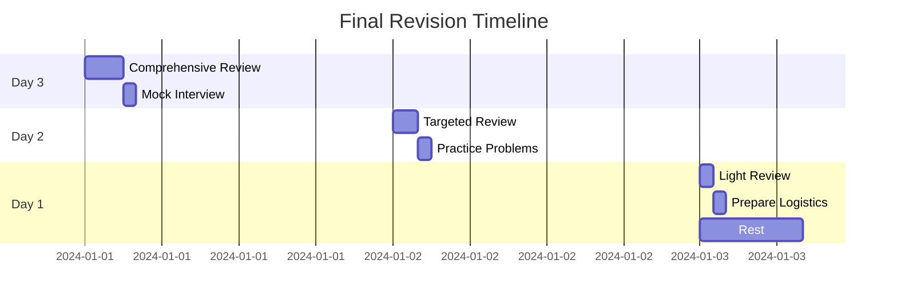
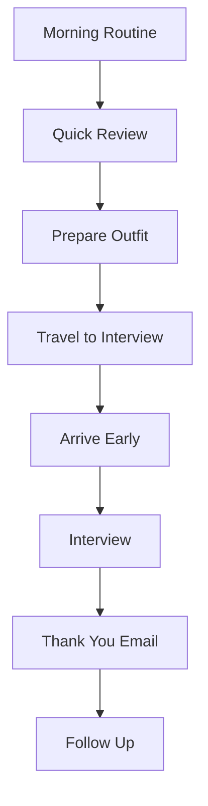

# 116 - Final Revision

## Introduction

Final revision is the critical last phase of interview preparation that consolidates your knowledge, builds confidence, and ensures you're mentally and practically ready for your interview. Whether you have 3 days, 1 day, or just a few hours before your interview, this guide provides structured revision plans, quick reference materials, confidence boosters, and practical checklists to maximize your readiness. This comprehensive guide covers 3-day and 1-day revision plans, formula sheets, common mistakes review, confidence building, and interview day preparation.

The key to effective final revision is focusing on high-impact activities rather than trying to learn new material. This phase is about consolidation, confidence building, and mental preparation - not cramming.

---

## Learning Roadmap

```
3 Days Before:
  ├── Review key concepts
  ├── Practice mock interview
  ├── Finalize stories and examples
  └── Prepare logistics

2 Days Before:
  ├── Review weak areas
  ├── Practice timing
  ├── Prepare questions to ask
  └── Rest and relax

1 Day Before:
  ├── Light review only
  ├── Prepare interview outfit
  ├── Plan logistics
  └── Early sleep

Interview Day:
  ├── Morning routine
  ├── Quick review
  ├── Arrive early
  └── Stay confident
```

---

## Theory Notes

### The Science of Final Revision

#### Consolidation Effect
- Reviewing material just before the interview keeps it fresh
- Light review activates relevant neural pathways
- Avoid cramming - it causes anxiety and fatigue

#### Confidence Building
- Reviewing what you know well builds confidence
- Focusing on strengths outweighs last-minute weakness fixes
- Positive self-talk and visualization help performance

#### Stress Management
- Final revision should be calming, not stressful
- Light review reduces anxiety
- Preparation reduces uncertainty

### 3-Day Revision Plan

#### Day 3: Comprehensive Review
- Review all major topics (2-3 hours)
- Practice 2-3 coding problems
- Review 5 behavioral stories
- Do a mock interview if possible

#### Day 2: Targeted Review
- Focus on weak areas (1-2 hours)
- Review system design concepts
- Practice 1-2 coding problems
- Prepare questions for interviewer

#### Day 1: Light Review
- Quick concept review (30-60 minutes)
- Review cheat sheets
- Prepare logistics
- Rest and relax

### 1-Day Revision Plan

#### Morning
- Quick flashcard review (20 minutes)
- Review key formulas (20 minutes)
- Light coding practice (30 minutes)

#### Afternoon
- Review behavioral stories (20 minutes)
- Prepare interview outfit
- Plan logistics

#### Evening
- Relax and rest
- Early sleep
- Positive visualization

---

## Key Concepts

### Quick Reference Materials

#### Formula Sheets
- Key algorithms and their complexities
- Important data structure operations
- Common design patterns
- SQL queries and syntax

#### Behavioral Templates
- STAR method structure
- Key stories mapped to LPs
- Questions to ask interviewer
- Company-specific talking points

### Common Mistakes to Avoid

#### Technical Mistakes
- Not clarifying requirements
- Jumping into code without planning
- Not considering edge cases
- Poor time management

#### Behavioral Mistakes
- Not using STAR method
- Taking credit for team work
- Not quantifying results
- Being too vague

#### Interview Day Mistakes
- Arriving late
- Not bringing required materials
- Being unprepared for logistics
- Not getting enough sleep

### Confidence Boosters

#### Before the Interview
- Review your strongest stories
- Practice power poses
- Positive self-talk
- Visualization of success

#### During the Interview
- Take deep breaths
- Pause before answering
- Maintain good posture
- Smile and be personable

---

## FAQ (20+ Q&A)

### Q1: How much should I study the day before?
**A:** Light review only - 30-60 minutes maximum. Focus on confidence, not cramming.

### Q2: Should I practice coding the night before?
**A:** Light practice is fine if it helps you relax. Avoid stressful problems.

### Q3: How do I handle interview anxiety?
**A:** Deep breathing, positive visualization, and remembering that preparation reduces anxiety.

### Q4: What should I bring to the interview?
**A:** Resume copies, portfolio, notepad, pen, ID, and any requested materials.

### Q5: How early should I arrive?
**A:** 10-15 minutes early for in-person, 5 minutes early for virtual.

### Q6: Should I review new material before the interview?
**A:** No. Focus on reviewing what you already know, not learning new concepts.

### Q7: How do I stay calm during the interview?
**A:** Take deep breaths, pause before answering, and remember that it's a conversation.

### Q8: What if I blank on a question?
**A:** Ask for clarification, take a moment to think, and start with what you know.

### Q9: Should I have a morning routine on interview day?
**A:** Yes. A consistent routine helps you feel normal and confident.

### Q10: How do I prepare for virtual interviews?
**A:** Test technology, ensure good lighting, have a clean background, and minimize distractions.

### Q11: What if I'm running late?
**A:** Call ahead if possible. Arriving flustered is worse than arriving a few minutes late.

### Q12: Should I eat before the interview?
**A:** Yes, but not too heavy. A light meal 1-2 hours before helps maintain energy.

### Q13: How do I end the interview well?
**A:** Ask thoughtful questions, thank the interviewer, and follow up with a thank-you email.

### Q14: What if I don't know an answer?
**A:** Be honest, explain your thought process, and show willingness to learn.

### Q15: Should I bring notes to the interview?
**A:** Light notes for reference are fine, but don't read from them.

### Q16: How do I handle multiple rounds?
**A:** Stay consistent, take breaks between rounds, and maintain energy throughout.

### Q17: Should I follow up after the interview?
**A:** Yes. A brief thank-you email within 24 hours shows professionalism.

### Q18: What if I make a mistake during the interview?
**A:** Acknowledge it briefly and move on. Don't dwell on mistakes.

### Q19: How do I prepare for different interview formats?
**A:** Practice each format separately: phone, virtual, in-person, whiteboard.

### Q20: Should I review my resume before the interview?
**A:** Yes. Be familiar with everything on your resume and ready to discuss it.

---

## Hands-on Practice

### Exercise 1: 3-Day Plan Execution
Follow the 3-day revision plan:
- Day 3: Comprehensive review
- Day 2: Targeted review
- Day 1: Light review and rest

### Exercise 2: Formula Sheet Review
Review key formula sheets:
- Time complexities
- Data structure operations
- Design patterns
- SQL syntax

### Exercise 3: Mock Interview
Conduct a final mock interview:
- Practice under realistic conditions
- Get feedback on performance
- Identify any remaining gaps

### Exercise 4: Logistics Preparation
Prepare interview logistics:
- Route and timing
- Outfit and materials
- Technology setup (for virtual)
- Backup plans

### Exercise 5: Confidence Building
Practice confidence techniques:
- Power poses
- Positive self-talk
- Visualization
- Deep breathing

---

## FAANG Questions

### FAANG Final Revision Focus

#### Amazon Final Review
- **Focus**: Leadership Principles stories
- **Review**: Top 5 LP stories
- **Practice**: 2 coding problems
- **Prepare**: Questions about team

#### Google Final Review
- **Focus**: Algorithm patterns
- **Review**: Key algorithms and complexities
- **Practice**: 2 medium problems
- **Prepare**: Questions about projects

#### Meta Final Review
- **Focus**: Practical coding
- **Review**: Common patterns
- **Practice**: 2 practical problems
- **Prepare**: Questions about impact

#### Apple Final Review
- **Focus**: Quality and detail
- **Review**: Best practices
- **Practice**: 1-2 problems
- **Prepare**: Questions about design

#### Microsoft Final Review
- **Focus**: Problem-solving approach
- **Review**: Growth mindset stories
- **Practice**: 1-2 problems
- **Prepare**: Questions about learning

---

## Common Mistakes

### Mistake 1: Cramming New Material
The night before is for review, not learning. Focus on what you already know.

### Mistake 2: Staying Up Late
Sleep is crucial for cognitive performance. Get 7-8 hours minimum.

### Mistake 3: Not Preparing Logistics
Running late or being unprepared for logistics adds unnecessary stress.

### Mistake 4: Skipping Meals
Eat light, nutritious meals to maintain energy and focus.

### Mistake 5: Over-Reviewing
Too much review causes anxiety. Light review builds confidence.

### Mistake 6: Not Preparing for Virtual Issues
Test technology, have backup plans, and ensure good setup.

### Mistake 7: Forgetting to Follow Up
A thank-you email shows professionalism and keeps you in the interviewer's mind.

### Mistake 8: Being Too Hard on Yourself
Everyone makes mistakes. Focus on overall performance, not perfection.

---

## Best Practices

1. **Focus on Consolidation**: Review, don't learn new material
2. **Get Enough Sleep**: 7-8 hours minimum the night before
3. **Prepare Logistics Early**: Route, outfit, materials planned in advance
4. **Build Confidence**: Review strengths and practice positive self-talk
5. **Light Review Only**: 30-60 minutes maximum the day before
6. **Have a Morning Routine**: Consistent routine helps you feel normal
7. **Arrive Early**: 10-15 minutes early reduces stress
8. **Stay Calm**: Deep breaths and pause before answering
9. **Follow Up**: Thank-you email within 24 hours
10. **Be Yourself**: Authenticity is more valuable than perfection

---

## Cheat Sheet

```
FINAL REVISION CHEAT SHEET
============================

3-DAY PLAN:
Day 3: Comprehensive Review (2-3 hours)
  □ Review major topics
  □ Practice 2-3 problems
  □ Review 5 stories
  □ Mock interview

Day 2: Targeted Review (1-2 hours)
  □ Focus on weak areas
  □ System design review
  □ Practice 1-2 problems
  □ Prepare questions

Day 1: Light Review (30-60 min)
  □ Quick concept review
  □ Review cheat sheets
  □ Prepare logistics
  □ Rest and relax

INTERVIEW DAY:
Morning:
  □ Light review (20 min)
  □ Review formulas (20 min)
  □ Prepare outfit

During:
  □ Arrive early
  □ Take deep breaths
  □ Pause before answering
  □ Maintain good posture

After:
  □ Thank-you email
  □ Reflect on performance
  □ Plan next steps

WHAT TO BRING:
□ Resume copies
□ Portfolio/projects
□ Notepad and pen
□ ID
□ Questions for interviewer
□ Water bottle

CONFIDENCE BUILDERS:
□ Review strongest stories
□ Power poses
□ Positive self-talk
□ Visualization
□ Deep breathing

COMMON MISTAKES TO AVOID:
✗ Cramming new material
✗ Staying up late
✗ Being unprepared for logistics
✗ Skipping meals
✗ Over-reviewing
✗ Not following up
```

---

## Flash Cards (20)

### Card 1
**Q:** How much should you study the day before?
**A:** Light review only - 30-60 minutes maximum.

### Card 2
**Q:** Should you practice coding the night before?
**A:** Light practice if it helps relax. Avoid stressful problems.

### Card 3
**Q:** How do you handle interview anxiety?
**A:** Deep breathing, positive visualization, and remember preparation reduces anxiety.

### Card 4
**Q:** What should you bring to the interview?
**A:** Resume copies, portfolio, notepad, pen, ID, and requested materials.

### Card 5
**Q:** How early should you arrive?
**A:** 10-15 minutes early for in-person, 5 minutes for virtual.

### Card 6
**Q:** Should you review new material before the interview?
**A:** No. Focus on reviewing what you already know.

### Card 7
**Q:** How do you stay calm during the interview?
**A:** Deep breaths, pause before answering, and remember it's a conversation.

### Card 8
**Q:** What if you blank on a question?
**A:** Ask for clarification, take a moment to think, start with what you know.

### Card 9
**Q:** Should you have a morning routine?
**A:** Yes. A consistent routine helps you feel normal and confident.

### Card 10
**Q:** How do you prepare for virtual interviews?
**A:** Test technology, ensure good lighting, clean background, minimize distractions.

### Card 11
**Q:** What if you're running late?
**A:** Call ahead if possible. Arriving flustered is worse than a few minutes late.

### Card 12
**Q:** Should you eat before the interview?
**A:** Yes, light meal 1-2 hours before. Avoid heavy food.

### Card 13
**Q:** How do you end the interview well?
**A:** Ask thoughtful questions, thank interviewer, send thank-you email.

### Card 14
**Q:** What if you don't know an answer?
**A:** Be honest, explain thought process, show willingness to learn.

### Card 15
**Q:** Should you bring notes?
**A:** Light notes for reference are fine, but don't read from them.

### Card 16
**Q:** How do you handle multiple rounds?
**A:** Stay consistent, take breaks, maintain energy throughout.

### Card 17
**Q:** Should you follow up after?
**A:** Yes. Thank-you email within 24 hours shows professionalism.

### Card 18
**Q:** What if you make a mistake?
**A:** Acknowledge briefly and move on. Don't dwell on mistakes.

### Card 19
**Q:** How do you prepare for different formats?
**A:** Practice each format separately: phone, virtual, in-person, whiteboard.

### Card 20
**Q:** Should you review your resume?
**A:** Yes. Be familiar with everything and ready to discuss it.

---

## Mind Map

```
               FINAL REVISION
                   |
    ┌──────────────┼──────────────┐
    |              |              |
  3-DAY PLAN    1-DAY PLAN    INTERVIEW DAY
    |              |              |
 ┌──┴──┐     ┌────┴────┐    ┌───┴───┐
 |     |     |         |    |       |
Day 3 Day 2  Morning Evening Morning During
Review Review Review  Rest   Routine  Performance
```

---

## Mermaid Diagrams

### 3-Day Revision Timeline


### Interview Day Flow


---

## Code Examples

```python
# Final Revision Planner

from dataclasses import dataclass, field
from typing import List, Dict
from datetime import datetime, timedelta

@dataclass
class RevisionTask:
    name: str
    duration_minutes: int
    priority: int  # 1-5, 5 being highest
    completed: bool = False

@dataclass
class FinalRevisionPlan:
    days_before: int
    tasks: List[RevisionTask] = field(default_factory=list)
    
    def add_task(self, name: str, duration_minutes: int, priority: int):
        task = RevisionTask(name=name, duration_minutes=duration_minutes, priority=priority)
        self.tasks.append(task)
    
    def get_total_time(self) -> int:
        return sum(t.duration_minutes for t in self.tasks)
    
    def get_completed_time(self) -> int:
        return sum(t.duration_minutes for t in self.tasks if t.completed)
    
    def get_completion_rate(self) -> float:
        total = self.get_total_time()
        completed = self.get_completed_time()
        return (completed / total * 100) if total > 0 else 0

class FinalRevisionManager:
    def __init__(self):
        self.plans: List[FinalRevisionPlan] = []
    
    def create_3_day_plan(self) -> List[FinalRevisionPlan]:
        """Create a 3-day revision plan."""
        plans = []
        
        # Day 3: Comprehensive Review
        day3 = FinalRevisionPlan(days_before=3)
        day3.add_task("Review major topics", 120, 5)
        day3.add_task("Practice coding problems", 60, 4)
        day3.add_task("Review behavioral stories", 30, 4)
        day3.add_task("Mock interview", 60, 5)
        plans.append(day3)
        
        # Day 2: Targeted Review
        day2 = FinalRevisionPlan(days_before=2)
        day2.add_task("Review weak areas", 60, 5)
        day2.add_task("System design review", 30, 3)
        day2.add_task("Practice coding problems", 30, 4)
        day2.add_task("Prepare questions for interviewer", 15, 3)
        plans.append(day2)
        
        # Day 1: Light Review
        day1 = FinalRevisionPlan(days_before=1)
        day1.add_task("Quick concept review", 20, 3)
        day1.add_task("Review cheat sheets", 15, 2)
        day1.add_task("Prepare interview outfit", 15, 4)
        day1.add_task("Plan logistics", 10, 5)
        day1.add_task("Rest and relax", 0, 5)
        plans.append(day1)
        
        return plans
    
    def generate_checklist(self) -> str:
        """Generate interview day checklist."""
        checklist = f"\n{'='*50}"
        checklist += f"\nINTERVIEW DAY CHECKLIST"
        checklist += f"\n{'='*50}"
        
        checklist += f"\n\nNIGHT BEFORE:"
        checklist += f"\n□ Lay out interview outfit"
        checklist += f"\n□ Pack bag with materials"
        checklist += f"\n□ Set alarm"
        checklist += f"\n□ Get 7-8 hours of sleep"
        
        checklist += f"\n\nMORNING OF:"
        checklist += f"\n□ Eat light breakfast"
        checklist += f"\n□ Quick review (20 min)"
        checklist += f"\n□ Get dressed"
        checklist += f"\n□ Leave early"
        
        checklist += f"\n\nTO BRING:"
        checklist += f"\n□ Resume (2-3 copies)"
        checklist += f"\n□ Portfolio/projects"
        checklist += f"\n□ Notepad and pen"
        checklist += f"\n□ ID"
        checklist += f"\n□ Water bottle"
        checklist += f"\n□ Questions for interviewer"
        
        checklist += f"\n\nDURING INTERVIEW:"
        checklist += f"\n□ Arrive 10-15 min early"
        checklist += f"\n□ Take deep breaths"
        checklist += f"\n□ Pause before answering"
        checklist += f"\n□ Maintain good posture"
        checklist += f"\n□ Ask thoughtful questions"
        
        checklist += f"\n\nAFTER INTERVIEW:"
        checklist += f"\n□ Send thank-you email"
        checklist += f"\n□ Reflect on performance"
        checklist += f"\n□ Plan next steps"
        
        return checklist
    
    def generate_confidence_boosters(self) -> str:
        """Generate confidence building tips."""
        boosters = f"\n{'='*50}"
        boosters += f"\nCONFIDENCE BUILDERS"
        boosters += f"\n{'='*50}"
        
        boosters += f"\n\nBEFORE THE INTERVIEW:"
        boosters += f"\n• Review your strongest stories"
        boosters += f"\n• Practice power poses (2 minutes)"
        boosters += f"\n• Positive self-talk"
        boosters += f"\n• Visualization of success"
        boosters += f"\n• Remember: you've prepared well"
        
        boosters += f"\n\nDURING THE INTERVIEW:"
        boosters += f"\n• Take deep breaths when nervous"
        boosters += f"\n• Pause before answering"
        boosters += f"\n• Maintain good posture"
        boosters += f"\n• Smile and be personable"
        boosters += f"\n• Remember: it's a conversation"
        
        boosters += f"\n\nIF YOU MAKE A MISTAKE:"
        boosters += f"\n• Acknowledge briefly"
        boosters += f"\n• Move on immediately"
        boosters += f"\n• Don't dwell on it"
        boosters += f"\n• Focus on the next question"
        boosters += f"\n• Remember: everyone makes mistakes"
        
        return boosters

# Example usage
manager = FinalRevisionManager()

# Create 3-day plan
plans = manager.create_3_day_plan()
for plan in plans:
    print(f"\nDay {plan.days_before} before interview:")
    print(f"Total time: {plan.get_total_time()} minutes")
    for task in plan.tasks:
        print(f"  • {task.name} ({task.duration_minutes} min)")

# Generate checklist
print(manager.generate_checklist())

# Generate confidence boosters
print(manager.generate_confidence_boosters())
```

---

## Resources

### Books
- "The Confident Candidate" by various authors
- "Interview Like a Master" by Rhett power
- "Peak Performance" by Brad Stulberg

### Apps
- [Headspace](https://headspace.com) - Meditation for anxiety
- [Calm](https://calm.com) - Relaxation techniques

---

## Checklist

- [ ] Created 3-day revision plan
- [ ] Executed Day 3 comprehensive review
- [ ] Executed Day 2 targeted review
- [ ] Executed Day 1 light review
  - [ ] Prepared interview outfit
  - [ ] Planned logistics
  - [ ] Got 7-8 hours sleep
  - [ ] Morning routine established
  - [ ] Quick morning review done
  - [ ] Materials packed
  - [ ] Arrived early
  - [ ] Sent thank-you email

---

## Difficulty Rating

| Aspect | Rating (1-10) | Notes |
|--------|---------------|-------|
| Planning Required | 3/10 | Simple plans to follow |
| Emotional Challenge | 6/10 | Anxiety management needed |
| Time Commitment | 4/10 | Moderate, decreases daily |
| Impact on Performance | 8/10 | Final preparation matters |
| Stress Level | 5/10 | Manageable with good planning |
| Overall Difficulty | 4/10 | Low barrier, high impact |

---

## Summary

Final revision is about consolidation, confidence building, and mental preparation - not cramming new material. Follow a structured 3-day plan, get enough sleep, prepare logistics early, and focus on your strengths. Remember that you've prepared well and that the interview is a conversation, not an interrogation. Stay calm, be yourself, and let your preparation shine through. Good luck!
