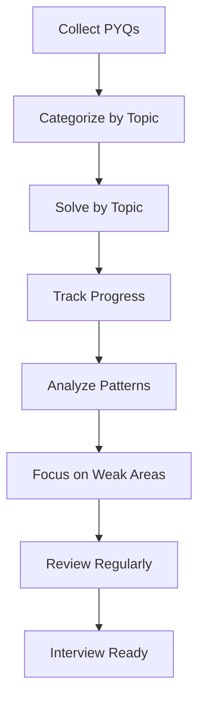
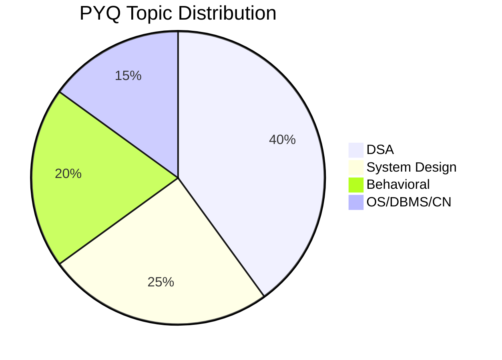

# 117 - Previous Year Questions

## Introduction

Previous Year Questions (PYQs) are one of the most valuable resources for interview preparation. They provide real insight into what companies actually ask, reveal question patterns, indicate difficulty levels, and help you focus your preparation on high-probability topics. This comprehensive guide covers how to find PYQs, categorized question banks for DSA, OS, DBMS, CN, and System Design, company-specific patterns, difficulty trends, and strategies for using PYQs effectively.

The value of PYQs lies in their authenticity - they're real questions asked by real interviewers at real companies. While companies do change their questions over time, patterns persist, and understanding these patterns gives you a significant advantage.

---

## Learning Roadmap

```
Week 1: Collection
  ├── Find PYQ sources for target companies
  ├── Categorize by topic and difficulty
  ├── Create question bank spreadsheet
  └── Identify high-frequency topics

Week 2-3: Practice
  ├── Solve PYQs by topic
  ├── Track success rate
  ├── Identify weak areas
  └── Create solution notes

Week 4: Analysis
  ├── Analyze patterns by company
  ├── Identify difficulty trends
  ├── Focus on high-frequency topics
  └── Create targeted practice plan
```

---

## Theory Notes

### Where to Find PYQs

#### Primary Sources
1. **LeetCode Discuss**: Company-specific question tags
2. **Glassdoor**: Interview questions by company
3. **Blind**: Anonymous employee discussions
4. **Reddit**: r/cscareerquestions, company subreddits
5. **GeeksforGeeks**: Interview experience articles
6. **InterviewBit**: Curated question banks
7. **GitHub**: Interview question repositories

#### How to Evaluate PYQs
- **Recency**: Questions from last 6-12 months are most relevant
- **Verification**: Prefer verified employee experiences
- **Specificity**: Look for specific role/level mentions
- **Frequency**: Questions mentioned multiple times are more likely

### PYQ Categories by Topic

#### Data Structures & Algorithms
- Arrays & Strings
- Linked Lists
- Trees & Graphs
- Dynamic Programming
- Sorting & Searching
- Hash Tables
- Stack & Queue

#### Operating Systems
- Process Management
- Memory Management
- File Systems
- Scheduling Algorithms
- Synchronization
- Deadlocks

#### Database Management Systems
- SQL Queries
- Normalization
- Indexing
- Transactions & ACID
- Concurrency Control
- Query Optimization

#### Computer Networks
- OSI Model
- TCP/IP
- HTTP/HTTPS
- DNS
- Routing
- Network Security

#### System Design
- Scalability
- Load Balancing
- Caching
- Database Design
- Message Queues
- Microservices

### Company-Specific Patterns

#### Amazon
- **Focus**: Leadership Principles + Technical
- **Frequency**: LPs in every round
- **Common**: System design with scalability focus
- **Pattern**: Behavioral-heavy, deep follow-ups

#### Google
- **Focus**: Algorithms and problem-solving
- **Frequency**: Hard algorithmic problems
- **Common**: Graph problems, DP
- **Pattern**: Clean code, optimal solutions

#### Meta
- **Focus**: Practical coding and system design
- **Frequency**: Medium difficulty, practical problems
- **Common**: Social features, real-time systems
- **Pattern**: Speed and efficiency

#### Apple
- **Focus**: Depth and quality
- **Frequency**: Language-specific, detailed
- **Common**: Product-focused system design
- **Pattern**: Attention to detail

#### Microsoft
- **Focus**: Problem-solving approach
- **Frequency**: Medium difficulty, varied topics
- **Common**: Interactive problems
- **Pattern**: Growth mindset, learning

---

## Key Concepts

### PYQ Analysis Framework

#### Frequency Analysis
- Count how often each topic appears
- Identify high-frequency topics
- Focus preparation on frequent areas

#### Difficulty Analysis
- Rate each question's difficulty
- Track difficulty distribution by company
- Prepare for expected difficulty level

#### Pattern Recognition
- Identify recurring question types
- Note common variations
- Understand underlying concepts

### Using PYQs Effectively

#### The 3-Pass Approach
1. **First Pass**: Solve all questions, mark difficult ones
2. **Second Pass**: Focus on weak areas and difficult questions
3. **Third Pass**: Review and ensure mastery

#### Spaced Repetition with PYQs
- Review solved questions at increasing intervals
- Track which questions you can solve consistently
- Focus on questions you struggle with

### Creating a Question Bank

#### Spreadsheet Structure
| Company | Topic | Question | Difficulty | Date | Status | Notes |
|---------|-------|----------|------------|------|--------|-------|
| Amazon | Arrays | Two Sum | Easy | 2024-01 | Solved | Variations exist |
| Google | Trees | Binary Tree Level Order | Medium | 2024-02 | Review | BFS approach |

---

## FAQ (20+ Q&A)

### Q1: How many PYQs should I solve?
**A:** Aim for 100-200 questions covering all major topics, with emphasis on high-frequency areas.

### Q2: Are PYQs still relevant if companies change questions?
**A:** Yes. Patterns persist even if specific questions change. Understanding patterns is more valuable than memorizing solutions.

### Q3: Should I solve PYQs by company or by topic?
**A:** Both. Start by topic to build skills, then by company to understand patterns.

### Q4: How do I find company-specific PYQs?
**A:** Search LeetCode discuss, Glassdoor, Blind, and Reddit with company name + "interview questions."

### Q5: What if I can't solve a PYQ?
**A:** Study the solution, understand the approach, and practice similar problems. Mark it for review.

### Q6: Should I time myself on PYQs?
**A:** Yes. Practice solving within interview time limits (20-30 minutes per problem).

### Q7: How often should I review PYQs?
**A:** Review solved questions weekly. Use spaced repetition for retention.

### Q8: Are PYQs enough for preparation?
**A:** PYQs are a key component but should be supplemented with concept study, system design, and behavioral preparation.

### Q9: How do I track my PYQ progress?
**A:** Use a spreadsheet to track questions solved, success rate, and areas needing improvement.

### Q10: Should I share my PYQ solutions?
**A:** Yes, if it doesn't violate confidentiality. Sharing helps others and reinforces your learning.

### Q11: How do PYQs vary by level?
**A:** Junior roles get easier questions; senior roles get harder questions and system design.

### Q12: Should I solve PYQs from multiple companies?
**A:** Yes. Patterns across companies reveal high-probability topics.

### Q13: How do I handle PYQs I've seen before?
**A:** Practice solving them again to ensure you can solve them consistently.

### Q14: Should I focus on recent PYQs?
**A:** Yes. Questions from the last 6-12 months are most relevant.

### Q15: How do I use PYQs for system design?
**A:** Study the design problems, understand trade-offs, and practice explaining your approach.

### Q16: Should I solve PYQs in order of difficulty?
**A:** Start with easier questions to build confidence, then progress to harder ones.

### Q17: How do I handle PYQs that seem outdated?
**A:** Focus on the underlying concepts. The concepts remain relevant even if the specific question changes.

### Q18: Should I create my own solutions or look at others'?
**A:** Try to solve independently first. If stuck, study others' solutions and understand the approach.

### Q19: How do I use PYQs for behavioral interviews?
**A:** Note common behavioral questions, prepare STAR stories for each, and practice articulating them.

### Q20: Should I focus on PYQs from my target company?
**A:** Yes, but also study other companies to understand broader patterns and prepare for variations.

---

## Hands-on Practice

### Exercise 1: PYQ Collection
Collect 50 PYQs from your target companies:
- Search multiple sources
- Categorize by topic and difficulty
- Create a tracking spreadsheet
- Identify high-frequency topics

### Exercise 2: Topic-Based Practice
Solve PYQs by topic:
- Start with your strongest topic
- Move to weaker areas
- Track success rate
- Review solutions for missed questions

### Exercise 3: Company-Specific Practice
Solve PYQs from your target company:
- Focus on frequently asked topics
- Note company-specific patterns
- Understand their interview style
- Prepare accordingly

### Exercise 4: Pattern Analysis
Analyze PYQ patterns:
- Identify recurring question types
- Note difficulty trends
- Understand underlying concepts
- Create a pattern guide

### Exercise 5: Mock PYQ Session
Simulate a PYQ session:
- Set a timer for 30 minutes
- Solve 2-3 problems
- Review your performance
- Identify areas for improvement

---

## FAANG Questions

### FAANG PYQ Collections

#### Amazon Common PYQs
1. Two Sum (Easy)
2. LRU Cache (Medium)
3. Binary Tree Level Order Traversal (Medium)
4. Merge Intervals (Medium)
5. Word Break (Medium)
6. Design Twitter (Medium)
7. Minimum Window Substring (Hard)
8. Find Median from Data Stream (Hard)

#### Google Common PYQs
1. Longest Substring Without Repeating Characters (Medium)
2. Median of Two Sorted Arrays (Hard)
3. Regular Expression Matching (Hard)
4. Merge K Sorted Lists (Hard)
5. Word Ladder (Medium)
6. Course Schedule (Medium)
7. Serialize and Deserialize Binary Tree (Hard)
8. Alien Dictionary (Hard)

#### Meta Common PYQs
1. Valid Parentheses (Easy)
2. Merge Two Sorted Lists (Easy)
3. Binary Tree Right Side View (Medium)
4. Lowest Common Ancestor (Medium)
5. Product of Array Except Self (Medium)
6. Find Duplicate Number (Medium)
7. Random Pick Index (Medium)
8. Design Hit Counter (Medium)

#### Apple Common PYQs
1. Reverse Linked List (Easy)
2. Maximum Subarray (Medium)
3. Clone Graph (Medium)
4. Word Search (Medium)
5. Meeting Rooms II (Medium)
6. Find Minimum in Rotated Sorted Array (Medium)
7. Binary Search Tree Iterator (Medium)
8. Serialize and Deserialize BST (Medium)

#### Microsoft Common PYQs
1. Reverse String (Easy)
2. Best Time to Buy and Sell Stock (Easy)
3. Number of Islands (Medium)
4. Validate Binary Search Tree (Medium)
5. Coin Change (Medium)
6. Task Scheduler (Medium)
7. Design Add and Search Words (Medium)
8. Binary Tree Maximum Path Sum (Hard)

---

## Common Mistakes

### Mistake 1: Memorizing Solutions
Understanding the approach is more valuable than memorizing specific solutions.

### Mistake 2: Only Solving Easy Questions
Challenge yourself with medium and hard questions to prepare for real interviews.

### Mistake 3: Not Reviewing Mistakes
Learning from errors is crucial for improvement.

### Mistake 4: Ignoring Pattern Recognition
Focus on understanding patterns, not just solving individual problems.

### Mistake 5: Not Tracking Progress
Without tracking, you can't identify areas needing improvement.

### Mistake 6: Rushing Through Questions
Take time to understand each problem thoroughly.

### Mistake 7: Not Practicing Under Time Pressure
Practice solving within interview time limits.

### Mistake 8: Ignoring Company-Specific Patterns
Different companies have different focuses - prepare accordingly.

---

## Best Practices

1. **Collect from Multiple Sources**: Get PYQs from various platforms
2. **Categorize by Topic**: Organize for focused practice
3. **Track Progress**: Use spreadsheets to monitor improvement
4. **Focus on Patterns**: Understand underlying concepts
5. **Practice Under Pressure**: Simulate interview conditions
6. **Review Regularly**: Use spaced repetition for retention
7. **Analyze Company Patterns**: Understand what each company focuses on
8. **Supplement with Concepts**: PYQs should complement, not replace, concept study
9. **Share Solutions**: Help others while reinforcing your learning
10. **Stay Updated**: Focus on recent PYQs from the last 6-12 months

---

## Cheat Sheet

```
PREVIOUS YEAR QUESTIONS CHEAT SHEET
====================================

WHERE TO FIND:
□ LeetCode Discuss
□ Glassdoor
□ Blind
□ Reddit (r/cscareerquestions)
□ GeeksforGeeks
□ InterviewBit
□ GitHub repositories

CATEGORIES:
DSA: Arrays, Trees, DP, Graphs, Strings
OS: Processes, Memory, Scheduling, Deadlocks
DBMS: SQL, Normalization, Indexing, Transactions
CN: OSI, TCP/IP, HTTP, DNS, Security
System Design: Scalability, Caching, Load Balancing

COMPANY FOCUS:
Amazon: LPs + Technical
Google: Algorithms + Problem-solving
Meta: Practical coding + Speed
Apple: Depth + Quality
Microsoft: Approach + Growth

USAGE STRATEGY:
1. Collect 50-100 PYQs
2. Categorize by topic/difficulty
3. Solve by topic (3-pass approach)
4. Track progress in spreadsheet
5. Review patterns weekly
6. Focus on high-frequency areas

TRACKING SPREADSHEET:
| Company | Topic | Question | Difficulty | Status | Notes |

PATTERN RECOGNITION:
□ Identify recurring question types
□ Note difficulty trends
□ Understand underlying concepts
□ Create pattern guide
```

---

## Flash Cards (20)

### Card 1
**Q:** What are Previous Year Questions?
**A:** Real interview questions asked by companies in past interviews.

### Card 2
**Q:** How many PYQs should you solve?
**A:** 100-200 questions covering all major topics.

### Card 3
**Q:** What's the best source for company-specific PYQs?
**A:** LeetCode Discuss, Glassdoor, and Blind.

### Card 4
**Q:** Should you solve PYQs by company or topic?
**A:** Both. Start by topic, then by company for pattern recognition.

### Card 5
**Q:** How do you handle PYQs you can't solve?
**A:** Study the solution, understand the approach, practice similar problems.

### Card 6
**Q:** Should you time yourself on PYQs?
**A:** Yes. Practice within interview time limits (20-30 minutes).

### Card 7
**Q:** How often should you review PYQs?
**A:** Weekly review of solved questions. Spaced repetition for retention.

### Card 8
**Q:** Are PYQs enough for preparation?
**A:** No. Supplement with concept study, system design, and behavioral prep.

### Card 9
**Q:** How do you track PYQ progress?
**A:** Use a spreadsheet to track questions solved and success rate.

### Card 10
**Q:** Should you share PYQ solutions?
**A:** Yes, if it doesn't violate confidentiality. Helps others and reinforces learning.

### Card 11
**Q:** How do PYQs vary by level?
**A:** Junior roles get easier questions; senior roles get harder questions and system design.

### Card 12
**Q:** Should you focus on recent PYQs?
**A:** Yes. Questions from last 6-12 months are most relevant.

### Card 13
**Q:** How do you use PYQs for system design?
**A:** Study design problems, understand trade-offs, practice explaining approach.

### Card 14
**Q:** Should you solve PYQs in difficulty order?
**A:** Start with easier questions, then progress to harder ones.

### Card 15
**Q:** How do you handle outdated PYQs?
**A:** Focus on underlying concepts. Concepts remain relevant.

### Card 16
**Q:** Should you create your own solutions?
**A:** Try independently first, then study others' solutions if stuck.

### Card 17
**Q:** How do you use PYQs for behavioral interviews?
**A:** Note common questions, prepare STAR stories, practice articulating.

### Card 18
**Q:** Should you focus on target company PYQs?
**A:** Yes, but also study other companies for broader patterns.

### Card 19
**Q:** What's the 3-pass approach?
**A:** First pass: solve all. Second pass: focus on weak areas. Third pass: review.

### Card 20
**Q:** What's the most important PYQ strategy?
**A:** Focus on patterns and concepts, not memorizing specific solutions.

---

## Mind Map

```
           PREVIOUS YEAR QUESTIONS
                  |
       ┌──────────┼──────────┐
       |          |          |
   SOURCES     ANALYSIS    APPLICATION
       |          |          |
  ┌────┴────┐ ┌──┴──┐  ┌───┴───┐
  |         | |     |  |       |
LeetCode  Glass- Pattern Company Targeted
Blind     door  Recognition  Focus  Practice
Reddit    Geeks Company     Pattern
          for   Trends      Recognition
          Geeks
```

---

## Mermaid Diagrams

### PYQ Usage Flow


### Company PYQ Distribution


---

## Code Examples

```python
# PYQ Tracker

from dataclasses import dataclass, field
from typing import List, Dict
from enum import Enum

class Difficulty(Enum):
    EASY = "Easy"
    MEDIUM = "Medium"
    HARD = "Hard"

class Status(Enum):
    NOT_STARTED = "Not Started"
    ATTEMPTED = "Attempted"
    SOLVED = "Solved"
    REVIEW = "Review"

@dataclass
class PYQ:
    company: str
    topic: str
    question: str
    difficulty: Difficulty
    date_asked: str = ""
    status: Status = Status.NOT_STARTED
    notes: str = ""
    time_taken_minutes: int = 0
    
    def to_dict(self) -> Dict:
        return {
            "company": self.company,
            "topic": self.topic,
            "question": self.question,
            "difficulty": self.difficulty.value,
            "status": self.status.value,
            "time_taken": self.time_taken_minutes
        }

class PYQTracker:
    def __init__(self):
        self.questions: List[PYQ] = []
    
    def add_question(self, pyq: PYQ):
        self.questions.append(pyq)
    
    def get_by_company(self, company: str) -> List[PYQ]:
        return [q for q in self.questions if q.company.lower() == company.lower()]
    
    def get_by_topic(self, topic: str) -> List[PYQ]:
        return [q for q in self.questions if q.topic.lower() == topic.lower()]
    
    def get_by_difficulty(self, difficulty: Difficulty) -> List[PYQ]:
        return [q for q in self.questions if q.difficulty == difficulty]
    
    def get_solved_count(self) -> int:
        return sum(1 for q in self.questions if q.status == Status.SOLVED)
    
    def get_success_rate(self) -> float:
        solved = self.get_solved_count()
        return (solved / len(self.questions) * 100) if self.questions else 0
    
    def get_company_stats(self) -> Dict[str, Dict]:
        stats = {}
        for q in self.questions:
            if q.company not in stats:
                stats[q.company] = {"total": 0, "solved": 0, "topics": set()}
            stats[q.company]["total"] += 1
            if q.status == Status.SOLVED:
                stats[q.company]["solved"] += 1
            stats[q.company]["topics"].add(q.topic)
        
        # Convert sets to lists for JSON
        for company in stats:
            stats[company]["topics"] = list(stats[company]["topics"])
            stats[company]["success_rate"] = (
                stats[company]["solved"] / stats[company]["total"] * 100
                if stats[company]["total"] > 0 else 0
            )
        
        return stats
    
    def get_topic_stats(self) -> Dict[str, Dict]:
        stats = {}
        for q in self.questions:
            if q.topic not in stats:
                stats[q.topic] = {"total": 0, "solved": 0, "companies": set()}
            stats[q.topic]["total"] += 1
            if q.status == Status.SOLVED:
                stats[q.topic]["solved"] += 1
            stats[q.topic]["companies"].add(q.company)
        
        for topic in stats:
            stats[topic]["companies"] = list(stats[topic]["companies"])
            stats[topic]["success_rate"] = (
                stats[topic]["solved"] / stats[topic]["total"] * 100
                if stats[topic]["total"] > 0 else 0
            )
        
        return stats
    
    def generate_report(self) -> str:
        report = f"\n{'='*60}"
        report += f"\nPYQ TRACKER REPORT"
        report += f"\n{'='*60}"
        
        report += f"\n\nTotal Questions: {len(self.questions)}"
        report += f"\nSolved: {self.get_solved_count()}"
        report += f"\nSuccess Rate: {self.get_success_rate():.1f}%"
        
        # Company stats
        company_stats = self.get_company_stats()
        report += f"\n\nCOMPANY BREAKDOWN:"
        for company, stats in company_stats.items():
            report += f"\n  {company}: {stats['solved']}/{stats['total']} ({stats['success_rate']:.0f}%)"
        
        # Topic stats
        topic_stats = self.get_topic_stats()
        report += f"\n\nTOPIC BREAKDOWN:"
        for topic, stats in topic_stats.items():
            report += f"\n  {topic}: {stats['solved']}/{stats['total']} ({stats['success_rate']:.0f}%)"
        
        # Weak areas
        weak_topics = [
            (topic, stats) for topic, stats in topic_stats.items()
            if stats['success_rate'] < 70 and stats['total'] >= 3
        ]
        if weak_topics:
            report += f"\n\nWEAK AREAS (Success Rate < 70%):"
            for topic, stats in sorted(weak_topics, key=lambda x: x[1]['success_rate']):
                report += f"\n  {topic}: {stats['success_rate']:.0f}% ({stats['solved']}/{stats['total']})"
        
        return report

# Example usage
tracker = PYQTracker()

# Add sample questions
tracker.add_question(PYQ(
    company="Amazon",
    topic="Arrays",
    question="Two Sum",
    difficulty=Difficulty.EASY,
    status=Status.SOLVED,
    time_taken_minutes=10
))

tracker.add_question(PYQ(
    company="Amazon",
    topic="Trees",
    question="Binary Tree Level Order Traversal",
    difficulty=Difficulty.MEDIUM,
    status=Status.SOLVED,
    time_taken_minutes=25
))

tracker.add_question(PYQ(
    company="Google",
    topic="Graphs",
    question="Course Schedule",
    difficulty=Difficulty.MEDIUM,
    status=Status.ATTEMPTED,
    time_taken_minutes=30
))

tracker.add_question(PYQ(
    company="Meta",
    topic="Dynamic Programming",
    question="Coin Change",
    difficulty=Difficulty.MEDIUM,
    status=Status.NOT_STARTED
))

print(tracker.generate_report())
```

---

## Resources

### PYQ Collections
- [LeetCode Company Questions](https://leetcode.com/company/)
- [Glassdoor Interview Questions](https://www.glassdoor.com/Interview/)
- [GeeksforGeeks Interview Corner](https://www.geeksforgeeks.org/category/interview-experiences/)

### GitHub Repositories
- [Tech Interview Handbook](https://github.com/yangshun/tech-interview-handbook)
- [Interview Questions Collection](https://github.com/jwasham/coding-interview-university)

---

## Checklist

- [ ] Collected 50+ PYQs from target companies
- [ ] Categorized by topic and difficulty
- [ ] Created tracking spreadsheet
- [ ] Solved PYQs by topic (100+ questions)
- [ ] Analyzed company-specific patterns
- [ ] Identified weak areas
- [ ] Created pattern recognition guide
- [ ] Reviewed solutions for missed questions
- [ ] Practiced under time pressure
- [ ] Tracked success rate and progress

---

## Difficulty Rating

| Aspect | Rating (1-10) | Notes |
|--------|---------------|-------|
| Collection Effort | 5/10 | Moderate search required |
| Practice Time | 7/10 | Significant practice needed |
| Analysis Value | 9/10 | Highly valuable insights |
| Pattern Recognition | 8/10 | Essential for preparation |
| Impact on Success | 9/10 | One of the highest-ROI activities |
| Overall Difficulty | 5/10 | Moderate; essential |

---

## Summary

Previous Year Questions are invaluable resources that provide real insight into what companies actually ask. Collect PYQs from multiple sources, categorize them, and practice systematically. Focus on understanding patterns rather than memorizing solutions, and track your progress to identify weak areas. Use PYQs as a core component of your preparation, supplemented by concept study, system design, and behavioral preparation. The patterns you discover through PYQ analysis will give you a significant advantage in your interviews.
