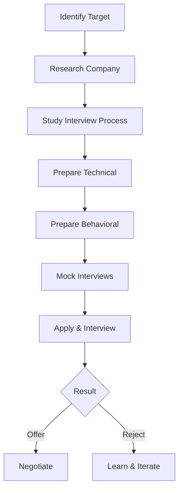

# Company-wise Preparation — Complete Interview Guide

---

## Table of Contents

1. [Introduction](#1-introduction)
2. [Learning Roadmap](#2-learning-roadmap)
3. [Theory Notes](#3-theory-notes)
4. [Key Concepts](#4-key-concepts)
5. [Interview Questions & Answers](#5-interview-questions--answers)
6. [Hands-on Practice](#6-hands-on-practice)
7. [FAANG Interview Questions](#7-faang-interview-questions)
8. [Common Mistakes to Avoid](#8-common-mistakes-to-avoid)
9. [Best Practices](#9-best-practices)
10. [Cheat Sheet](#10-cheat-sheet)
11. [Flash Cards](#11-flash-cards)
12. [Mind Map](#12-mind-map)
13. [Mermaid Diagrams](#13-mermaid-diagrams)
14. [Code Examples](#14-code-examples)
15. [Projects & Ideas](#15-projects--ideas)
16. [Resources](#16-resources)
17. [Interview Preparation Checklist](#17-interview-preparation-checklist)
18. [Revision Notes](#18-revision-notes)
19. [Mock Interview Questions](#19-mock-interview-questions)
20. [Difficulty Rating](#20-difficulty-rating)
21. [Summary](#21-summary)

---

## 1. Introduction

Company-wise preparation involves researching and preparing for interviews at specific companies. Each company has unique interview formats, focus areas, and culture. Understanding these differences helps you tailor your preparation and maximize your chances of success.

### Why Company-Wise Preparation Matters

- **Interview format** — Each company has a different process
- **Focus areas** — Companies emphasize different skills
- **Culture fit** — Understanding values helps alignment
- **Question patterns** — Companies reuse similar questions
- **Time efficiency** — Targeted preparation is more effective

### Major Company Categories

| Category | Examples | Focus |
|----------|----------|-------|
| FAANG+ | Google, Amazon, Meta, Apple, Netflix | System design, coding, leadership |
| Unicorns | Stripe, Airbnb, Uber, Lyft | Domain expertise, product sense |
| Enterprise | Microsoft, IBM, Oracle | breadth, legacy systems |
| Startups | YC companies, Series A-C | Full-stack, speed, ownership |
| Finance | Goldman Sachs, JPMorgan | Algorithms, quant skills |

---

## 2. Learning Roadmap

### Phase 1: Research (Week 1)
- Identify target companies
- Study their interview process (Glassdoor, Blind)
- Understand their tech stack and culture
- Learn about recent news and products

### Phase 2: Technical Preparation (Weeks 2-4)
- Practice company-specific coding patterns
- Study their engineering blog posts
- Understand their system design patterns
- Review their open-source contributions

### Phase 3: Behavioral Preparation (Weeks 5-6)
- Study company values and leadership principles
- Prepare stories aligned with their values
- Practice company-specific behavioral questions
- Research interviewer backgrounds

### Phase 4: Mock Interviews (Week 7)
- Practice with company-specific formats
- Simulate time constraints
- Get feedback on presentation style
- Refine weak areas

---

## 3. Theory Notes

### 3.1 Company Research Framework

**The 7 Areas to Research:**

1. **Company Overview** — Mission, vision, founding story, size, funding
2. **Products/Services** — Core products, recent launches, roadmap
3. **Tech Stack** — Languages, frameworks, infrastructure, tools
4. **Engineering Culture** — Values, practices, blog posts, talks
5. **Interview Process** — Stages, formats, timelines, tips
6. **Compensation** — Salary ranges, equity, benefits
7. **Recent News** — Funding, acquisitions, launches, challenges

### 3.2 Interview Format by Company Type

**Big Tech (FAANG+):**
- Phone screen → Online assessment → Onsite (4-6 rounds)
- Coding: LeetCode medium/hard
- System design: Large-scale systems
- Behavioral: Leadership principles, STAR method

**Unicorns/Scale-ups:**
- Recruiter → Technical screen → Take-home/project → Onsite
- Coding: Practical problems, often with their product
- System design: Domain-specific
- Product sense: Understanding users

**Startups:**
- Founder/CTO call → Technical challenge → Team fit
- Full-stack: End-to-end development
- Ownership: Ability to wear many hats
- Speed: Ship fast, iterate quickly

### 3.3 Compensation Research

**Sources:**
- Levels.fyi (most accurate for tech)
- Glassdoor salary data
- Blind discussions
- Recruiter conversations

**Components:**
- Base salary
- Signing bonus
- Annual bonus
- Equity (RSUs, options)
- Benefits (401k, health, perks)

---

## 4. Key Concepts

### 4.1 Company-Specific Focus Areas

**Google:**
- Coding: Data structures, algorithms
- System design: Scalability, reliability
- Googleyness: Culture fit, leadership
- Focus: Problem-solving approach

**Amazon:**
- Coding: LeetCode, OOD
- System design: Scalable systems
- Leadership Principles: 16 LPs
- Focus: Customer obsession, ownership

**Meta:**
- Coding: Algorithms, system design
- Product sense: User impact
- Building for scale
- Focus: Move fast, impact

**Apple:**
- Coding: Algorithms, low-level
- System design: Device integration
- Innovation: Creative solutions
- Focus: Attention to detail

**Microsoft:**
- Coding: Arrays, strings, trees
- System design: Azure services
- Problem-solving: Step-by-step
- Focus: Growth mindset

### 4.2 Values Alignment Matrix

| Company | Key Values | How to Demonstrate |
|---------|------------|-------------------|
| Google | Innovation, user focus | Creative solutions, user impact |
| Amazon | Customer obsession, ownership | Customer-first examples, accountability |
| Meta | Move fast, build social value | Speed examples, impact metrics |
| Apple | Innovation, attention to detail | Craftsmanship, elegant solutions |
| Microsoft | Growth mindset, diversity | Learning examples, collaboration |

---

## 5. Interview Questions & Answers

### Google

**Q: How would you design Gmail's search feature?**
**A:** Consider: (1) Indexing — Build inverted index on email content, (2) Ranking — TF-IDF or BM25 for relevance, (3) Filters — Date, sender, label, attachment type, (4) Autocomplete — Trie-based suggestions, (5) Scale — Sharded index across multiple machines, (6) Freshness — Near real-time indexing, (7) Privacy — User can only search their own emails, (8) Performance — Cache frequent queries, use SSD for index.

### Amazon

**Q: Tell me about a time you went above and beyond for a customer.**
**A:** "At [Company], a customer reported their app crashing during a critical business process. Instead of just documenting the bug, I: (1) Immediately set up a call to understand their workflow, (2) Discovered it was a rare edge case with their data format, (3) Built a hotfix within 2 hours, (4) Worked with them to implement a workaround while the fix deployed, (5) Followed up to ensure stability. The customer later expanded their contract by 30%. I learned that customer issues are opportunities to build trust, not just fix bugs."

### Meta

**Q: How would you improve the News Feed ranking algorithm?**
**A:** "Current ranking likely optimizes for engagement. I'd consider: (1) **Diversity** — Ensure feed isn't an echo chamber, show diverse perspectives, (2) **Well-being** — Reduce clickbait, prioritize meaningful interactions, (3) **Freshness** — Balance popular content with recent posts, (4) **Relationship strength** — Prioritize content from close friends, (5) **Content quality** — Boost original content over shares, (6) **User control** — Let users fine-tune their feed, (7) **Metrics** — Track not just clicks but time well spent, shares to DMs, and hide/unfollow rates."

### Apple

**Q: Design a system for Apple Pay transactions.**
**A:** Key considerations: (1) **Security** — Tokenization (never store card numbers), end-to-end encryption, (2) **Privacy** — Minimal data collection, on-device processing where possible, (3) **Performance** — Sub-second transaction time, NFC for tap-to-pay, (4) **Reliability** — Offline support for transit, graceful degradation, (5) **Compliance** — PCI DSS, regional regulations, (6) **Scale** — Handle Black Friday-level traffic, (7) **Integration** — Support multiple card networks, bank partnerships, (8) **Fraud** — ML-based fraud detection, device fingerprinting.

### Microsoft

**Q: How would you design a real-time collaboration feature like Google Docs?**
**A:** "For real-time editing: (1) **CRDTs** — Conflict-free replicated data types for merging concurrent edits, (2) **WebSocket** — Real-time bidirectional communication, (3) **Operational Transform** — Alternative to CRDTs for simpler cases, (4) **Presence** — Show who's editing where with cursor positions, (5) **Version history** — Track changes with ability to revert, (6) **Offline support** — Queue changes locally, sync when reconnected, (7) **Conflict resolution** — Last-write-wins for simple conflicts, user resolution for complex, (8) **Scale** — Shard documents across servers, WebSocket connections managed by service."

---

## 6. Hands-on Practice

### Practice 1: Company Research Document

```markdown
# Company Research: [Target Company]

## Company Overview
- Founded: [Year]
- CEO: [Name]
- Size: [Employees]
- Valuation: [If known]
- Headquarters: [Location]

## Products
1. [Product 1]: [Description, users, revenue if known]
2. [Product 2]: [Description, users]
3. [Recent Launch]: [Details]

## Tech Stack
- Languages: [Python, Java, Go, etc.]
- Frameworks: [Django, React, etc.]
- Infrastructure: [AWS, GCP, On-prem]
- Tools: [Git, Jira, etc.]

## Engineering Culture
- Values: [List from website/blog]
- Practices: [CI/CD, agile, etc.]
- Blog: [Link to engineering blog]
- Open Source: [Notable projects]

## Interview Process
1. Recruiter Screen (30 min)
2. Technical Phone Screen (45 min)
3. Onsite (5 rounds):
   - 2 Coding
   - 1 System Design
   - 1 Behavioral
   - 1 Lunch (culture)

## Compensation (from Levels.fyi)
- L3/E3: $150-180K
- L4/E4: $200-260K
- L5/E5: $280-360K

## Questions for Interviewer
1. What's the biggest technical challenge the team faces?
2. How do you balance speed with quality?
3. What does success look like in this role?
```

### Practice 2: Values Story Mapping

```python
from dataclasses import dataclass
from typing import List, Dict


@dataclass
class CompanyValues:
    """Map company values to personal stories."""
    
    company: str
    values: Dict[str, str]
    stories: Dict[str, str] = None
    
    def __post_init__(self):
        if self.stories is None:
            self.stories = {}
    
    def add_story(self, value: str, story: str):
        """Add a story that demonstrates a company value."""
        self.stories[value] = story
    
    def get_prep_plan(self) -> str:
        """Generate preparation plan based on values."""
        plan = f"Preparation Plan for {self.company}\n"
        plan += "=" * 40 + "\n\n"
        
        for value, description in self.values.items():
            plan += f"Value: {value}\n"
            plan += f"Description: {description}\n"
            if value in self.stories:
                plan += f"Story: {self.stories[value]}\n"
            else:
                plan += "Story: [NEEDS PREPARATION]\n"
            plan += "\n"
        
        return plan


# Amazon Leadership Principles
amazon = CompanyValues(
    company="Amazon",
    values={
        "Customer Obsession": "Start with customer and work backwards",
        "Ownership": "Think long-term, act on behalf of entire company",
        "Invent and Simplify": "Innovate and find ways to simplify",
        "Are Right, A Lot": "Strong judgment and good instincts",
        "Learn and Be Curious": "Never stop learning",
        "Hire and Develop the Best": "Raise performance bar",
        "Insist on Highest Standards": "Relentlessly high standards",
        "Think Big": "Bold direction, think differently",
        "Bias for Action": "Speed matters in business",
        "Frugality": "Accomplish more with less",
    }
)

amazon.add_story(
    "Customer Obsession",
    "Led a project that reduced customer support tickets by 40% through UX improvements"
)
amazon.add_story(
    "Ownership",
    "Took initiative to fix a production issue outside my team's responsibility"
)

print(amazon.get_prep_plan())
```

---

## Additional Company Deep Dives

### Stripe
- **Focus:** Payments infrastructure, developer experience
- **Interview Process:** Phone screen → Technical → Onsite (coding + system design + behavioral)
- **Key Values:** User-focused, move with urgency, trust and transparency
- **Preparation Tips:** Study payment systems, distributed transactions, idempotency. Build something with the Stripe API.
- **Common Questions:** Design a payment system, handle double-charging, design idempotency keys

### Uber
- **Focus:** Real-time systems, geospatial, marketplace dynamics
- **Interview Process:** Phone screen → Onsite (coding + system design + behavioral)
- **Key Values:** We do the right thing, toe the line, make bold choices
- **Preparation Tips:** Study real-time matching algorithms, geospatial data structures, surge pricing. Understand marketplace dynamics.
- **Common Questions:** Design ride matching, real-time ETA, surge pricing algorithm

### Airbnb
- **Focus:** Product sense, trust and safety, global scaling
- **Interview Process:** Phone screen → Technical → Onsite (coding + system design + product)
- **Key Values:** Belong anywhere, embrace the adventure, be a host
- **Preparation Tips:** Study trust and safety systems, review/rating algorithms, search and ranking. Think about global marketplace challenges.
- **Common Questions:** Design a review system, trust and safety detection, search ranking

### Netflix
- **Focus:** Streaming infrastructure, content delivery, personalization
- **Interview Process:** Phone screen → Onsite (coding + system design + behavioral)
- **Key Values:** Freedom and responsibility, judgment, selflessness
- **Preparation Tips:** Study CDN architecture, video encoding pipelines, recommendation systems. Read their tech blog extensively.
- **Common Questions:** Design video streaming, content recommendation, CDN architecture

### ByteDance/TikTok
- **Focus:** Content delivery, recommendation algorithms, short-form video
- **Interview Process:** Phone screen → Onsite (coding + system design)
- **Key Values:** Always day one, challenge, true to self
- **Preparation Tips:** Study feed algorithms, video processing pipelines, global content delivery. Practice LeetCode extensively.
- **Common Questions:** Design feed ranking, video processing pipeline, content moderation system

### Shopify
- **Focus:** E-commerce platform, merchant tools, checkout optimization
- **Interview Process:** Phone screen → Technical challenge → Onsite
- **Key Values:** Be a merchant's champion, do the right thing, ownership
- **Preparation Tips:** Study e-commerce flows, payment processing, inventory management. Understand merchant pain points.
- **Common Questions:** Design checkout flow, inventory system, merchant analytics

### LinkedIn
- **Focus:** Professional networking, feed ranking, identity
- **Interview Process:** Phone screen → Onsite (coding + system design + behavioral)
- **Key Values:** Members first, relationships matter, be open and honest
- **Preparation Tips:** Study graph algorithms, feed ranking, connection recommendations. Think about professional identity.
- **Common Questions:** Design connection recommendations, feed ranking, job matching

### Salesforce
- **Focus:** CRM platform, enterprise software, multi-tenancy
- **Interview Process:** Phone screen → Technical → Onsite
- **Key Values:** Customer success, trust, innovation
- **Preparation Tips:** Study multi-tenant architectures, enterprise security, API design. Understand CRM workflows.
- **Common Questions:** Design multi-tenant system, CRM data model, enterprise API

---

## Company-Specific LeetCode Patterns

### Google
- Focus on: Graph algorithms, dynamic programming, optimization
- Difficulty: Medium to Hard
- Time limit: Usually 45 min for 2 problems
- Tips: Think about edge cases, scalability, follow-up optimizations

### Amazon
- Focus on: Arrays, strings, trees, BFS/DFS, OOD
- Difficulty: Easy to Medium
- Time limit: 30-45 min per problem
- Tips: Think about scalability, discuss time/space complexity

### Meta
- Focus on: Arrays, strings, trees, graphs, DP
- Difficulty: Medium
- Time limit: 30-45 min per problem
- Tips: Start with brute force, optimize, discuss edge cases

### Apple
- Focus on: Arrays, strings, linked lists, trees
- Difficulty: Easy to Medium
- Time limit: 30-45 min per problem
- Tips: Write clean, readable code, discuss trade-offs

### Microsoft
- Focus on: Arrays, strings, trees, graphs
- Difficulty: Easy to Medium
- Time limit: 45 min per problem
- Tips: Think step-by-step, discuss multiple approaches

---

## Interview Day Timeline

### Typical FAANG Onsite Schedule
```
8:30 AM  — Arrive, check in, get badge
9:00 AM  — Coding Round 1 (45 min)
9:50 AM  — Break (10 min)
10:00 AM — Coding Round 2 (45 min)
10:50 AM — Break (10 min)
11:00 AM — System Design (45-60 min)
12:00 PM — Lunch with team (culture fit)
1:00 PM  — Behavioral/Manager Round (45 min)
2:00 PM  — Break (10 min)
2:10 PM  — Final Round (coding or design)
3:00 PM  — Debrief with recruiter
```

### What to Bring
- Government-issued ID
- Laptop (if required for coding)
- Charger
- Water bottle
- Notepad and pen
- Resume copies (2-3)
- List of questions for interviewers

### Energy Management
- Eat a good breakfast
- Stay hydrated
- Take breaks between rounds
- Don't discuss previous rounds with other candidates
- Stay positive even if a round went poorly
- Remember: one bad answer doesn't define the outcome

---

---

## 8. Common Mistakes to Avoid

| Mistake | Problem | Solution |
|---------|---------|----------|
| Applying generic preparation | Doesn't address company specifics | Research and tailor approach |
| Not knowing their products | Shows lack of interest | Use their products, read reviews |
| Ignoring company values | Misses culture fit signals | Map your stories to their values |
| Not practicing their format | Different timing/format surprises | Practice with their specific style |
| Badmouthing competitors | Looks unprofessional | Focus on positives |
| Not following up | Misses connection opportunity | Send personalized thank-you |

---

## 9. Best Practices

1. **Research deeply** — Know more than other candidates
2. **Use their products** — Understand the user experience
3. **Read engineering blogs** — Understand their technical challenges
4. **Connect with employees** — Get insider perspectives
5. **Practice their format** — Match timing and style
6. **Align your stories** — Map to their values
7. **Ask thoughtful questions** — Show genuine interest
8. **Follow up** — Build relationship beyond interview

---

## 10. Cheat Sheet

```
COMPANY-WISE PREP CHEAT SHEET
══════════════════════════════

RESEARCH AREAS
──────────────
1. Company overview (mission, size, funding)
2. Products and services
3. Tech stack and engineering blog
4. Interview process and format
5. Compensation data
6. Recent news
7. Company values and culture

INTERVIEW FORMATS
─────────────────
FAANG: Phone → OA → Onsite (4-6 rounds)
Unicorns: Screen → Take-home → Onsite
Startups: Founder call → Challenge → Team fit

COMPENSATION RESEARCH
─────────────────────
Levels.fyi: Most accurate
Glassdoor: General ranges
Blind: Insider discussions
Recruiters: Specific offers
```

---

## 11. Flash Cards

**Card 1:** What are the 5 areas to research about a company?
→ Overview, Products, Tech Stack, Interview Process, Compensation.

**Card 2:** What is Levels.fyi?
→ Website with crowdsourced compensation data for tech companies.

**Card 3:** How should you align your stories to company values?
→ Map your STAR stories to each of their core values/principles.

**Card 4:** What should you do before a company interview?
→ Research, use their products, read engineering blog, connect with employees.

**Card 5:** What questions impress interviewers?
→ Questions showing research, strategic thinking, genuine curiosity.

**Card 6:** What is the difference between FAANG and startup interviews?
→ FAANG: structured, multiple rounds; Startups: faster, more generalist.

**Card 7:** How do you research a company's tech stack?
→ Check job postings, engineering blog, GitHub repos, conference talks.

**Card 8:** What is the best source for tech salary data?
→ Levels.fyi for big tech; Glassdoor for broader range.

**Card 9:** Should you mention competitor products in interviews?
→ Only to show market understanding; never badmouth competitors.

**Card 10:** How do you follow up after a company interview?
→ Send personalized thank-you within 24 hours, referencing specific discussion points.

---

## 12. Mind Map

```
Company-wise Preparation
│
├─── Research
│    ├─── Company Overview
│    ├─── Products/Services
│    ├─── Tech Stack
│    ├─── Engineering Culture
│    ├─── Interview Process
│    ├─── Compensation
│    └─── Recent News
│
├─── Technical
│    ├─── Coding Patterns
│    ├─── System Design
│    ├─── Domain Knowledge
│    └─── Open Source
│
├─── Behavioral
│    ├─── Values Alignment
│    ├─── Story Preparation
│    ├─── Culture Fit
│    └─── Questions for Them
│
└─── Strategy
     ├─── Target Companies
     ├─── Timeline
     ├─── Mock Interviews
     └─── Follow-up
```

---

## 13. Mermaid Diagrams

### Company Research Process



---

## 14. Code Examples

See Hands-on Practice section for company research templates and values mapping.

---

## 15. Projects & Ideas

| # | Project | Description | Difficulty | Tools |
|---|---------|-------------|------------|-------|
| 1 | Company Database | Track research on target companies | ⭐ | Spreadsheet, Notion |
| 2 | Story Bank | STAR stories mapped to values | ⭐⭐ | Document |
| 3 | Mock Interview | Practice with company-specific format | ⭐⭐ | Partner, video |
| 4 | Salary Calculator | Compare offers across companies | ⭐⭐ | Spreadsheet |
| 5 | Interview Tracker | Track applications and outcomes | ⭐⭐ | Spreadsheet, CRM |

---

## 16. Resources

### Research Platforms
- **Glassdoor** — Company reviews and interview experiences
- **Blind** — Anonymous employee discussions
- **Levels.fyi** — Compensation data
- **LinkedIn** — Employee connections

### Interview Prep
- **LeetCode** — Coding practice by company
- **Interviewing.io** — Mock interviews
- **Pramp** — Peer mock interviews

---

## 17. Interview Preparation Checklist

### Company Research
- [ ] Company mission and values
- [ ] Products and recent launches
- [ ] Tech stack and engineering blog
- [ ] Interview process and format
- [ ] Compensation ranges
- [ ] Recent news

### Technical Preparation
- [ ] Practice company-specific coding patterns
- [ ] Study their system design challenges
- [ ] Review their open-source contributions
- [ ] Understand their tech stack

### Behavioral Preparation
- [ ] Map stories to their values
- [ ] Prepare culture fit examples
- [ ] Research interviewer backgrounds
- [ ] Prepare thoughtful questions

---

## 18. Revision Notes

### Key Research Areas

**Before Applying:**
- Company overview, products, tech stack
- Interview process, compensation

**Before Interview:**
- Engineering blog, recent news
- Specific interviewer research
- Questions for them

### Compensation Negotiation

- Research market rate (Levels.fyi)
- Consider total comp (base + equity + bonus)
- Negotiate after offer, not during
- Have competing offers if possible

---

## 19. Mock Interview Questions

**Q1:** Why do you want to work at [specific company]?

**Q2:** What do you know about our products?

**Q3:** How would you improve [specific product feature]?

**Q4:** Tell me about a time you demonstrated [company value].

**Q5:** What's the biggest challenge facing [industry]?

**Q6:** Where do you see yourself in 5 years at [company]?

**Q7:** What question would you ask our CEO?

**Q8:** Why should we choose you over other candidates?

---

## 20. Difficulty Rating

| Topic | Difficulty | Time to Master | Priority |
|-------|-----------|----------------|----------|
| Company Research | ⭐⭐ | 1-2 weeks | Critical |
| Values Alignment | ⭐⭐⭐ | 2 weeks | High |
| Technical Tailoring | ⭐⭐⭐ | 2-3 weeks | High |
| Behavioral Prep | ⭐⭐⭐ | 2-3 weeks | High |
| Compensation Research | ⭐⭐ | 1 week | Medium |
| Follow-up Strategy | ⭐ | 1-2 days | Medium |

**Overall Interview Difficulty:** ⭐⭐⭐ (Moderate)

---

## 21. Summary

Company-wise preparation is about tailoring your approach to each specific company. By researching their interview process, tech stack, values, and culture, you can align your preparation to maximize your chances. This includes mapping your stories to their values, practicing their specific interview format, and demonstrating genuine interest through informed questions.

### Key Takeaways

1. **Research deeply** — Know more than other candidates
2. **Use their products** — Understand the user experience
3. **Align to their values** — Map your stories accordingly
4. **Practice their format** — Match timing and style
5. **Ask great questions** — Show genuine interest
6. **Follow up** — Build relationship beyond interview
7. **Know the compensation** — Research before negotiating
8. **Iterate** — Learn from each interview experience

---

> **Pro Tip:** The best company-specific preparation is using their product daily. Understand the user experience, think about improvements, and be ready to discuss specific features. This shows genuine interest that generic preparation can't match.