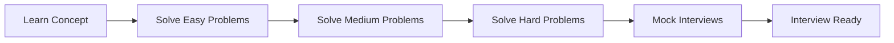
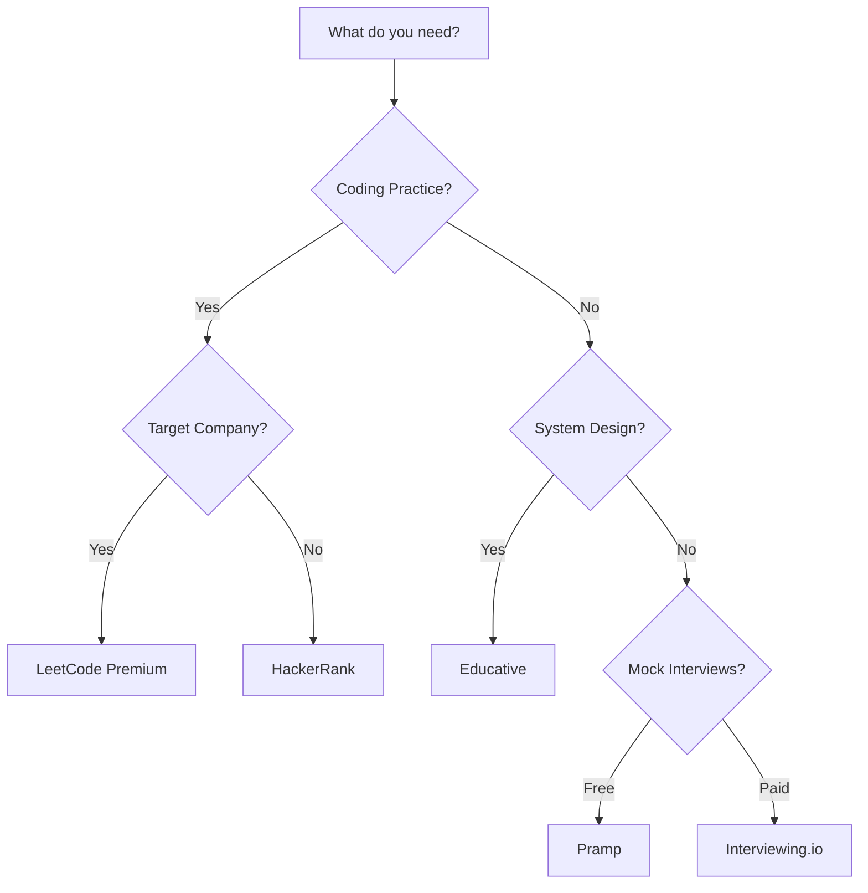

# Practice Websites — Complete Resource Guide

---

## Table of Contents

1. [Introduction](#1-introduction)
2. [Learning Roadmap](#2-learning-roadmap)
3. [Theory Notes](#3-theory-notes)
4. [Key Concepts](#4-key-concepts)
5. [Interview Questions & Answers](#5-interview-questions--answers)
6. [Hands-on Practice](#6-hands-on-practice)
7. [FAANG Interview Questions](#7-faang-interview-questions)
8. [Common Mistakes to Avoid](#8-common-mistakes-to-avoid)
9. [Best Practices](#9-best-practices)
10. [Cheat Sheet](#10-cheat-sheet)
11. [Flash Cards](#11-flash-cards)
12. [Mind Map](#12-mind-map)
13. [Mermaid Diagrams](#13-mermaid-diagrams)
14. [Code Examples](#14-code-examples)
15. [Projects & Ideas](#15-projects--ideas)
16. [Resources](#16-resources)
17. [Interview Preparation Checklist](#17-interview-preparation-checklist)
18. [Revision Notes](#18-revision-notes)
19. [Mock Interview Questions](#19-mock-interview-questions)
20. [Difficulty Rating](#20-difficulty-rating)
21. [Summary](#21-summary)

---

## 1. Introduction

Practice websites are essential tools for interview preparation. They provide coding challenges, system design practice, mock interviews, and learning resources. Using the right platforms can significantly improve your interview performance.

### Why Practice Websites Matter

- **Structured practice** — Organized problems by topic and difficulty
- **Immediate feedback** — Automated testing of solutions
- **Real interview questions** — Actual questions from companies
- **Progress tracking** — Monitor your improvement over time
- **Community** — Learn from others' solutions and discussions

### Practice Categories

| Category | Purpose | Best Platforms |
|----------|---------|---------------|
| Coding Challenges | Algorithm & data structure practice | LeetCode, HackerRank, CodeSignal |
| System Design | Architecture and scalability | Educative, System Design Interview |
| Mock Interviews | Simulate real interviews | Pramp, Interviewing.io |
| Learning | Build foundational knowledge | Coursera, edX, Khan Academy |
| Flashcards | Memorize concepts | Anki, Quizlet |

---

## 2. Learning Roadmap

### Phase 1: Foundation Building (Weeks 1-4)
- Start with easy problems on LeetCode
- Learn core data structures and algorithms
- Complete a structured course (Coursera, edX)
- Build basic project portfolio

### Phase 2: Pattern Recognition (Weeks 5-8)
- Solve medium problems by pattern
- Study company-specific questions
- Practice system design basics
- Start mock interviews

### Phase 3: Advanced Practice (Weeks 9-12)
- Tackle hard problems
- Focus on weak areas
- Practice under time pressure
- Do full mock interviews

### Phase 4: Interview Simulation (Weeks 13-14)
- Simulate real interview conditions
- Practice explaining solutions
- Review and learn from mistakes
- Final preparation sprint

---

## 3. Theory Notes

### 3.1 Effective Practice Strategies

**Spaced Repetition:**
Review problems at increasing intervals (1 day, 3 days, 7 days, 14 days).

**Active Recall:**
Try to solve problems from memory before looking at solutions.

**Interleaving:**
Mix different problem types rather than doing all of one type.

**Deliberate Practice:**
Focus on weak areas, not just problems you're already good at.

### 3.2 Problem-Solving Framework

1. **Understand** — Read problem carefully, clarify requirements
2. **Examples** — Work through examples by hand
3. **Pattern** — Identify what pattern/topic this is
4. **Plan** — Outline your approach before coding
5. **Code** — Implement clean, readable solution
6. **Test** — Verify with examples and edge cases
7. **Optimize** — Analyze time/space complexity

### 3.3 Progress Tracking Metrics

- Problems solved by difficulty
- Time per problem
- Success rate
- Pattern coverage
- Company-specific progress

---

## 4. Key Concepts

### 4.1 Top Practice Platforms

| Platform | Focus | Price | Best For |
|----------|-------|-------|----------|
| LeetCode | Coding challenges | Free/Premium | Algorithm practice |
| HackerRank | Coding challenges | Free | Beginners |
| CodeSignal | Coding challenges | Free | Company assessments |
| Pramp | Mock interviews | Free | Peer practice |
| Interviewing.io | Mock interviews | Paid | Anonymous practice |
| Educative | System design | Paid | Architecture |
| NeetCode | Curated problems | Free | LeetCode roadmap |

### 4.2 Platform Comparison

**LeetCode:**
- 2000+ problems
- Company-specific questions
- Premium has company tags
- Discussion forums

**HackerRank:**
- Structured tracks
- Good for beginners
- Company hiring challenges
- Free certificates

**Pramp:**
- Free mock interviews
- Peer-to-peer format
- Video interviews
- Rotating problem sets

**Interviewing.io:**
- Anonymous practice
- Real engineer interviewers
- Paid but high quality
- Potential job referrals

---

## 5. Interview Questions & Answers

**Q1: How many problems should I solve before interviewing?**
**A:** Quality over quantity. 150-300 well-understood problems is better than 500 rushed ones. Focus on: (1) All easy problems for confidence, (2) Medium problems by pattern (20+ per pattern), (3) Hard problems in your weak areas, (4) Company-specific problems for target companies. Track patterns, not just counts.

**Q2: Should I use LeetCode Premium?**
**A:** Yes if you're targeting FAANG+. Premium provides: (1) Company-tagged questions, (2) Frequency data, (3) Detailed solutions, (4) Interview simulate. The cost ($35/month) is minimal compared to the salary difference between landing and not landing a job. Cancel after you interview.

**Q3: How do I practice system design without a partner?**
**A:** (1) Use Educative's Grokking the System Design Interview, (2) Read system design blogs (Netflix, Uber, Airbnb), (3) Draw designs on paper and time yourself, (4) Record yourself explaining designs, (5) Study real architectures (Twitter, WhatsApp, Instagram), (6) Practice with Pramp or Interviewing.io for feedback.

**Q4: What's the best way to use mock interviews?**
**A:** (1) Schedule weekly mocks, (2) Simulate real conditions (timed, no interruptions), (3) Practice explaining your thought process, (4) Get feedback on communication, (5) Review mistakes afterward, (6) Focus on weak areas identified, (7) Alternate between coding and system design.

**Q5: How do I track my progress effectively?**
**A:** (1) Use a spreadsheet or app to log problems, (2) Track by pattern/topic, (3) Note difficulty and time taken, (4) Mark as "mastered" when you can solve in <20 min, (5) Review weak areas weekly, (6) Set weekly goals (e.g., 10 medium problems), (7) Celebrate milestones.

---

## 6. Hands-on Practice

### Practice 1: LeetCode Progress Tracker

```python
from dataclasses import dataclass, field
from typing import Dict, List
from datetime import datetime


@dataclass
class Problem:
    """Track a LeetCode problem."""
    number: int
    title: str
    difficulty: str  # Easy, Medium, Hard
    pattern: str
    solved: bool = False
    time_taken: int = 0  # minutes
    attempts: int = 0
    date_solved: str = ""
    notes: str = ""


@dataclass
class ProgressTracker:
    """Track LeetCode progress over time."""
    problems: List[Problem] = field(default_factory=list)
    
    def add_problem(self, problem: Problem):
        self.problems.append(problem)
    
    def mark_solved(self, number: int, time_minutes: int, notes: str = ""):
        for p in self.problems:
            if p.number == number:
                p.solved = True
                p.time_taken = time_minutes
                p.attempts += 1
                p.date_solved = datetime.now().strftime("%Y-%m-%d")
                p.notes = notes
                break
    
    def get_summary(self) -> Dict:
        """Get progress summary."""
        total = len(self.problems)
        solved = sum(1 for p in self.problems if p.solved)
        
        by_difficulty = {}
        for diff in ["Easy", "Medium", "Hard"]:
            total_d = sum(1 for p in self.problems if p.difficulty == diff)
            solved_d = sum(1 for p in self.problems if p.difficulty == diff and p.solved)
            by_difficulty[diff] = {"total": total_d, "solved": solved_d}
        
        by_pattern = {}
        for p in self.problems:
            if p.pattern not in by_pattern:
                by_pattern[p.pattern] = {"total": 0, "solved": 0}
            by_pattern[p.pattern]["total"] += 1
            if p.solved:
                by_pattern[p.pattern]["solved"] += 1
        
        avg_time = 0
        if solved > 0:
            avg_time = sum(p.time_taken for p in self.problems if p.solved) / solved
        
        return {
            "total_problems": total,
            "solved": solved,
            "completion_rate": f"{solved/total*100:.1f}%",
            "by_difficulty": by_difficulty,
            "by_pattern": by_pattern,
            "avg_time_minutes": round(avg_time, 1)
        }


# Example usage
tracker = ProgressTracker()

# Add problems
tracker.add_problem(Problem(1, "Two Sum", "Easy", "Hash Map"))
tracker.add_problem(Problem(3, "Longest Substring Without Repeat", "Medium", "Sliding Window"))
tracker.add_problem(Problem(15, "3Sum", "Medium", "Two Pointers"))
tracker.add_problem(Problem(42, "Trapping Rain Water", "Hard", "Stack"))

# Mark as solved
tracker.mark_solved(1, 5, "Used hash map for O(n)")
tracker.mark_solved(3, 15, "Sliding window approach")
tracker.mark_solved(15, 20, "Sort + two pointers")

# Get summary
summary = tracker.get_summary()
print(f"Progress: {summary['solved']}/{summary['total_problems']} ({summary['completion_rate']})")
print(f"Average time: {summary['avg_time_minutes']} minutes")
print("\nBy Difficulty:")
for diff, data in summary['by_difficulty'].items():
    print(f"  {diff}: {data['solved']}/{data['total']}")
print("\nBy Pattern:")
for pattern, data in summary['by_pattern'].items():
    print(f"  {pattern}: {data['solved']}/{data['total']}")
```

---

## Platform Deep Dives

### LeetCode Complete Guide

**Pricing Tiers:**
- Free: 2000+ problems, basic features
- Premium ($35/month): Company tags, frequency data, detailed solutions, interview simulate

**How to Use LeetCode Effectively:**
1. Start with the "Top 100 Liked Questions" list
2. Use company tags to focus on target companies
3. Solve by pattern, not randomly
4. Time yourself (30 min for medium, 45 min for hard)
5. Read discussions for alternative approaches
6. Implement solutions in multiple languages if possible

**Problem Categories on LeetCode:**
- Arrays & Hashing
- Two Pointers
- Sliding Window
- Stack
- Binary Search
- Linked List
- Trees
- Graphs
- Dynamic Programming
- Greedy
- Backtracking
- Heap / Priority Queue
- Intervals
- Math & Geometry
- Bit Manipulation

**Premium Features Worth the Cost:**
- Company-tagged problems (see what Google/Amazon actually ask)
- Frequency data (how often each problem appears)
- Solutions with detailed explanations
- Interview simulate mode
- Official solutions from problem authors

### HackerRank Guide

**Best For:** Beginners, structured learning, company assessments
**Free Features:** All problems, certificates, basic editorials

**Tracks to Follow:**
1. Data Structures (fundamentals)
2. Algorithms (problem-solving)
3. Mathematics (number theory)
4. SQL (database queries)
5. Regular Expressions (pattern matching)
6. Functional Programming (Haskell, etc.)

**Company Assessments:**
Many companies use HackerRank for initial screening:
- Complete practice tests in your target language
- Time yourself strictly
- Review editorials after each test

### Pramp Guide

**Best For:** Free mock interviews with peers
**How It Works:**
1. Sign up and complete your profile
2. Schedule an available slot
3. Get matched with a peer
4. You interview them, then they interview you
5. Both get scored and provide feedback

**Tips for Pramp:**
- Take it seriously (treat like a real interview)
- Ask clarifying questions before coding
- Think out loud
- Give constructive feedback to your partner
- Review your scorecard afterward
- Practice both the interviewer and interviewee roles

### Interviewing.io Guide

**Best For:** Anonymous practice with real engineers
**How It Works:**
1. Book a session with an engineer from a top company
2. Practice anonymously (no name, no resume)
3. Get detailed feedback
4. If you do well, you can get a referral to their company

**Pricing:** ~$100-200 per session
**Value:** Real engineers from FAANG+ companies, honest feedback, potential referrals

### Educative Guide

**Best For:** System design courses, structured learning
**Top Courses:**
- Grokking the System Design Interview
- Grokking the Coding Interview Patterns
- Designing Data-Intensive Applications (companion)
- Zero to Mastery programs

**How to Use Educative:**
1. Start with a structured course (not random topics)
2. Take notes in the built-in editor
3. Implement designs on paper
4. Practice explaining designs out loud
5. Review course materials before interviews

### NeetCode Guide

**Best For:** Curated LeetCode roadmap
**What It Offers:**
- Organized problem sets by pattern
- Video explanations for each problem
- Progress tracking
- Company-specific roadmaps
- Free and comprehensive

**How to Use NeetCode:**
1. Follow the "NeetCode 150" roadmap
2. Watch the video explanation AFTER attempting the problem
3. Mark problems as "mastered" when you can solve in <20 min
4. Use the spaced repetition schedule

---

## Study Schedule Templates

### 8-Week Intensive Plan

```
Week 1-2: Foundation
- 3 Easy problems/day
- Learn all data structures
- 1 system design video/day

Week 3-4: Patterns
- 2 Medium problems/day
- Focus on: Two Pointers, Sliding Window, Trees
- 1 system design topic/day

Week 5-6: Advanced
- 1 Medium + 1 Hard problem/day
- Focus on: Graphs, DP, Greedy
- Practice system design on paper

Week 7-8: Interview Prep
- Company-specific problems
- 2 mock interviews/week
- Review weak areas
- Practice explaining solutions
```

### 12-Week Balanced Plan

```
Week 1-3: Easy problems + Data Structures
Week 4-6: Medium problems by pattern
Week 7-9: Hard problems + System Design
Week 10-11: Company-specific + Mock interviews
Week 12: Final review + light practice
```

### 4-Week Crash Plan (For Experienced Developers)

```
Week 1: Review fundamentals, solve 30 medium problems
Week 2: Focus on weak patterns, 20 medium + 10 hard
Week 3: Company-specific problems, 2 mock interviews
Week 4: System design review, behavioral prep, light practice
```

---

## Problem-Solving Patterns Deep Dive

### Pattern 1: Two Pointers
**When to use:** Sorted arrays, finding pairs/triplets
**Time:** O(n) or O(n²)
**Key insight:** Start from both ends, move based on comparison

### Pattern 2: Sliding Window
**When to use:** Subarray/substring problems
**Time:** O(n)
**Key insight:** Expand window until constraint violated, then shrink

### Pattern 3: Fast & Slow Pointers
**When to use:** Cycle detection, middle of linked list
**Time:** O(n)
**Key insight:** One moves 2x speed; if they meet, there's a cycle

### Pattern 4: Merge Intervals
**When to use:** Overlapping intervals, scheduling
**Time:** O(n log n)
**Key insight:** Sort by start time, merge overlapping intervals

### Pattern 5: Top-K Elements
**When to use:** Finding K largest/smallest/frequent elements
**Time:** O(n log k)
**Key insight:** Use a heap of size K

### Pattern 6: Binary Search
**When to use:** Sorted data, finding boundaries
**Time:** O(log n)
**Key insight:** Eliminate half the search space each step

### Pattern 7: DFS/BFS
**When to use:** Graph/tree traversal, path finding
**Time:** O(V + E)
**Key insight:** DFS uses stack (recursion), BFS uses queue

### Pattern 8: Dynamic Programming
**When to use:** Overlapping subproblems, optimal substructure
**Time:** Varies
**Key insight:** Define state, find recurrence, build bottom-up

### Pattern 9: Backtracking
**When to use:** Combinations, permutations, constraints
**Time:** Exponential
**Key insight:** Explore all options, prune when constraint violated

### Pattern 10: Greedy
**When to use:** Local optimal leads to global optimal
**Time:** Varies
**Key insight:** Make the locally optimal choice at each step

---

## Measuring Your Progress

### Weekly Metrics to Track
```
Problems attempted: ___
Problems solved: ___
Solved without hints: ___
Average solve time: ___
New patterns learned: ___
Mock interviews completed: ___
Mock interview score: ___
```

### Monthly Milestones
```
Month 1: 50+ easy problems, all data structures reviewed
Month 2: 100+ medium problems, 5 patterns mastered
Month 3: 50+ hard problems, 10 patterns mastered
Month 4: Company-specific prep, mock interviews weekly
```

### Signs You're Interview-Ready
- Can solve medium problems in <20 minutes consistently
- Can explain solutions clearly to others
- Have completed 3+ mock interviews with good scores
- Comfortable with all major patterns
- Can handle system design for common scenarios
- Can articulate behavioral answers using STAR method

---

---

## 8. Common Mistakes to Avoid

| Mistake | Problem | Solution |
|---------|---------|----------|
| Solving too many easy problems | False confidence | Focus on medium/hard |
| Not reviewing solutions | Misses learning opportunities | Study multiple approaches |
| Copying solutions | Doesn't build understanding | Solve yourself first |
| Ignoring time complexity | Inefficient solutions | Analyze before coding |
| Not practicing explanations | Poor communication in interviews | Practice talking through solutions |
| Cramming before interview | Burnout, poor retention | Consistent daily practice |

---

## 9. Best Practices

1. **Consistency** — Practice daily, even if just 1-2 problems
2. **Quality over quantity** — Understand deeply, don't just solve
3. **Pattern focus** — Learn patterns, not individual solutions
4. **Time yourself** — Simulate interview pressure
5. **Review solutions** — Even for problems you solved
6. **Practice explaining** — Communication is half the battle
7. **Track progress** — Know your weak areas
8. **Use multiple platforms** — Different perspectives and problems

---

## 10. Cheat Sheet

```
PRACTICE WEBSITES CHEAT SHEET
══════════════════════════════

TOP PLATFORMS
─────────────
LeetCode: Coding (company tags)
HackerRank: Coding (beginner-friendly)
Pramp: Free mock interviews
Interviewing.io: Paid mock interviews
Educative: System design courses
NeetCode: Curated LeetCode roadmap

PROBLEM-SOLVING FRAMEWORK
──────────────────────────
1. Understand the problem
2. Work through examples
3. Identify the pattern
4. Plan your approach
5. Code the solution
6. Test with edge cases
7. Analyze complexity

PRACTICE METRICS
────────────────
- Problems solved by difficulty
- Time per problem
- Success rate
- Pattern coverage
- Company-specific progress

SPACED REPETITION
─────────────────
Review at: 1 day, 3 days, 7 days, 14 days
```

---

## 11. Flash Cards

**Card 1:** What is the best platform for coding practice?
→ LeetCode for company-specific; HackerRank for beginners.

**Card 2:** How many problems should I solve before interviewing?
→ 150-300 well-understood problems is ideal.

**Card 3:** What is the problem-solving framework?
→ Understand → Examples → Pattern → Plan → Code → Test → Optimize.

**Card 4:** Should I use LeetCode Premium?
→ Yes for FAANG+ targets; company tags are valuable.

**Card 5:** How do I practice system design alone?
→ Use Educative, read engineering blogs, record yourself explaining.

**Card 6:** What is spaced repetition?
→ Reviewing problems at increasing intervals for long-term retention.

**Card 7:** How do I track my progress?
→ Log problems by pattern, difficulty, and time; review weekly.

**Card 8:** What is the best way to use mock interviews?
→ Weekly, timed, simulate real conditions, get feedback.

**Card 9:** Should I study solutions for problems I solved?
→ Yes; learn alternative approaches and optimize.

**Card 10:** How important is explaining my thought process?
→ Very; communication is half the interview score.

---

## 12. Mind Map

```
Practice Websites
│
├─── Coding Platforms
│    ├─── LeetCode (Premium for company tags)
│    ├─── HackerRank (Beginner-friendly)
│    ├─── CodeSignal (Company assessments)
│    └─── NeetCode (Curated roadmap)
│
├─── Mock Interviews
│    ├─── Pramp (Free, peer-to-peer)
│    ├─── Interviewing.io (Paid, expert)
│    └──— interviewing.io (Anonymous)
│
├─── Learning
│    ├─── Coursera (University courses)
│    ├─── Educative (System design)
│    ├─── Udemy (Various topics)
│    └─── YouTube (Free tutorials)
│
├─── System Design
│    ├─── Grokking the System Design Interview
│    ├─── System Design Interview (Alex Xu)
│    └─── Engineering Blogs
│
└─── Tracking
     ├─── Spreadsheet
     ├─── Anki (Flashcards)
     └─── Personal website
```

---

## 13. Mermaid Diagrams

### Practice Progress Flow



### Platform Selection Guide



---

## 14. Code Examples

See Hands-on Practice section for progress tracker implementation.

---

## 15. Projects & Ideas

| # | Project | Description | Difficulty | Tools |
|---|---------|-------------|------------|-------|
| 1 | Progress Dashboard | Visualize LeetCode progress | ⭐⭐⭐ | React, D3.js |
| 2 | Anki Deck | Create flashcard deck for patterns | ⭐⭐ | Anki, Python |
| 3 | Problem Randomizer | Random problem picker by pattern | ⭐⭐ | Python |
| 4 | Mock Interview Scheduler | Schedule and track mocks | ⭐⭐ | Web app |
| 5 | Solution Notes | Organize solution notes | ⭐ | Markdown |

---

## 16. Resources

### Top Platforms

**Coding Practice:**
- LeetCode (leetcode.com)
- HackerRank (hackerrank.com)
- CodeSignal (codesignal.com)
- NeetCode (neetcode.io)

**Mock Interviews:**
- Pramp (pramp.com)
- Interviewing.io (interviewing.io)

**System Design:**
- Educative (educative.io)
- ByteByteGo (bytebytego.com)

**Learning:**
- Coursera (coursera.org)
- edX (edx.org)
- Khan Academy (khanacademy.org)

---

## 17. Interview Preparation Checklist

### Platform Setup
- [ ] Create LeetCode account
- [ ] Set up HackerRank profile
- [ ] Schedule first Pramp mock
- [ ] Bookmark system design resources

### Practice Plan
- [ ] Daily: 2-3 problems (mix of difficulties)
- [ ] Weekly: 1 mock interview
- [ ] Monthly: Review progress and adjust

### Tracking
- [ ] Set up progress tracker
- [ ] Track by pattern and difficulty
- [ ] Review weak areas weekly
- [ ] Celebrate milestones

---

## 18. Revision Notes

### Key Platforms

**LeetCode:** Best for coding practice, especially with company tags
**Pramp:** Free mock interviews with peers
**Educative:** System design courses
**HackerRank:** Good for beginners

### Practice Formula

- 2-3 problems daily
- 1 mock interview weekly
- Review solutions even for solved problems
- Focus on patterns, not individual problems

---

## 19. Mock Interview Questions

**Q1:** What platform would you recommend for a beginner?

**Q2:** How do you balance practice with learning new concepts?

**Q3:** What's the most efficient way to prepare for coding interviews?

**Q4:** How do you handle interview anxiety?

**Q5:** What resources are best for system design?

**Q6:** How do you practice explaining your thought process?

**Q7:** What's the ideal practice schedule?

**Q8:** How do you know when you're ready to interview?

---

## 20. Difficulty Rating

| Topic | Difficulty | Time to Master | Priority |
|-------|-----------|----------------|----------|
| Platform Selection | ⭐ | 1 day | Critical |
| Problem Solving | ⭐⭐⭐ | 4-8 weeks | Critical |
| System Design | ⭐⭐⭐⭐ | 4-6 weeks | High |
| Mock Interviews | ⭐⭐⭐ | 2-4 weeks | High |
| Progress Tracking | ⭐ | 1-2 days | Medium |

**Overall Difficulty:** ⭐⭐⭐ (Moderate)

---

## 21. Summary

Practice websites are essential tools for interview preparation. LeetCode is the gold standard for coding practice, especially with company tags. Pramp and Interviewing.io provide mock interview experiences. Educative offers system design courses. Consistent practice with tracking and review is key to improvement.

### Key Takeaways

1. **LeetCode is essential** — Especially Premium for company tags
2. **Mock interviews matter** — Practice explaining solutions
3. **Track progress** — Know your weak areas
4. **Pattern focus** — Learn patterns, not individual solutions
5. **Consistency beats cramming** — Daily practice > weekend cramming
6. **Quality over quantity** — Understand deeply
7. **Use multiple platforms** — Different perspectives
8. **Review solutions** — Even for problems you solved

---

> **Pro Tip:** The best platform is the one you'll actually use consistently. Start with LeetCode for coding, add Pramp for mocks, and use Educative for system design. Track your progress and adjust your focus based on weak areas.