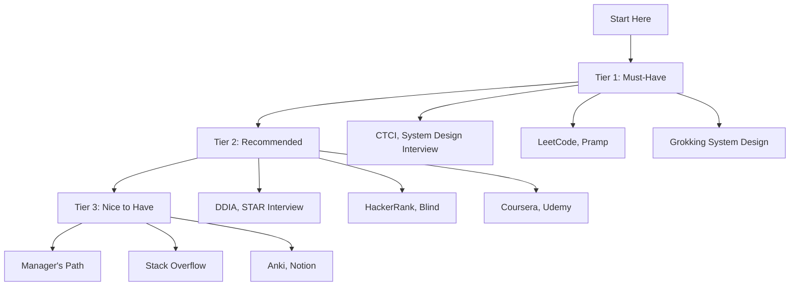
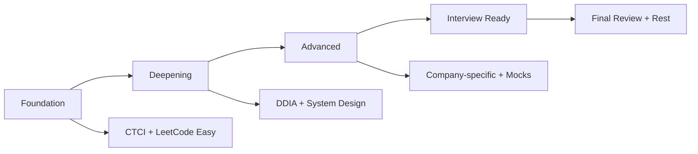

# Resources — Complete Interview Preparation Resource Guide

---

## Table of Contents

1. [Introduction](#1-introduction)
2. [Learning Roadmap](#2-learning-roadmap)
3. [Theory Notes](#3-theory-notes)
4. [Key Concepts](#4-key-concepts)
5. [Interview Questions & Answers](#5-interview-questions--answers)
6. [Hands-on Practice](#6-hands-on-practice)
7. [FAANG Interview Questions](#7-faang-interview-questions)
8. [Common Mistakes to Avoid](#8-common-mistakes-to-avoid)
9. [Best Practices](#9-best-practices)
10. [Cheat Sheet](#10-cheat-sheet)
11. [Flash Cards](#11-flash-cards)
12. [Mind Map](#12-mind-map)
13. [Mermaid Diagrams](#13-mermaid-diagrams)
14. [Code Examples](#14-code-examples)
15. [Projects & Ideas](#15-projects--ideas)
16. [Resources](#16-resources)
17. [Interview Preparation Checklist](#17-interview-preparation-checklist)
18. [Revision Notes](#18-revision-notes)
19. [Mock Interview Questions](#19-mock-interview-questions)
20. [Difficulty Rating](#20-difficulty-rating)
21. [Summary](#21-summary)

---

## 1. Introduction

This comprehensive resource guide compiles the best books, courses, websites, tools, and communities for interview preparation. It covers all areas from coding to system design, behavioral interviews to domain-specific knowledge.

### Why a Resource Guide Matters

- **Curated quality** — Best resources selected from thousands
- **Organization** — Resources grouped by topic and level
- **Time savings** — No need to search for resources yourself
- **Updated regularly** — Remove outdated, add new resources
- **Multiple formats** — Books, courses, videos, tools

### Resource Categories

| Category | Purpose | Examples |
|----------|---------|----------|
| Books | Deep learning | Cracking the Coding Interview, DDIA |
| Courses | Structured learning | Coursera, edX, Udemy |
| Websites | Practice and reference | LeetCode, GeeksforGeeks |
| Tools | Productivity and practice | VS Code, Anki |
| Communities | Support and networking | Reddit, Blind, Discord |

---

## 2. Learning Roadmap

### Phase 1: Foundation (Weeks 1-4)
- Read "Cracking the Coding Interview"
- Complete a data structures course
- Start daily LeetCode practice
- Set up your practice environment

### Phase 2: Deepening (Weeks 5-8)
- Read "Designing Data-Intensive Applications"
- Study system design fundamentals
- Practice mock interviews
- Build a portfolio project

### Phase 3: Advanced (Weeks 9-12)
- Study company-specific patterns
- Read engineering blogs
- Practice behavioral questions
- Do full interview simulations

### Phase 4: Final Prep (Weeks 13-14)
- Review weak areas
- Do final mock interviews
- Prepare logistics (outfit, tech setup)
- Rest before interview

---

## 3. Theory Notes

### 3.1 Resource Evaluation Framework

**Quality Indicators:**
- Author credibility (industry experience, publications)
- Community reviews (Amazon, Reddit, Blind)
- Up-to-date content (recent editions, active maintenance)
- Practical focus (real examples, not just theory)
- Community support (forums, study groups)

**Resource Types by Learning Style:**
| Style | Best Resources |
|-------|---------------|
| Visual | Video courses, diagrams, YouTube |
| Reading | Books, blogs, documentation |
| Hands-on | Coding platforms, projects |
| Social | Study groups, mock interviews |
| Auditory | Podcasts, video lectures |

### 3.2 Learning Efficiency

**The 80/20 Rule for Interview Prep:**
- 20% of resources provide 80% of results
- Focus on high-impact resources first
- Don't try to consume everything
- Depth > breadth

### 3.3 Resource Prioritization

**Tier 1 (Must-Have):**
- LeetCode (or similar coding platform)
- One system design resource
- Behavioral interview preparation
- Company research tools

**Tier 2 (Highly Recommended):**
- Books (CTCI, DDIA)
- Mock interview platform
- Engineering blogs
- Community access

**Tier 3 (Nice to Have):**
- Additional courses
- Specialized tools
- Conference talks
- Mentorship

---

## 4. Key Concepts

### 4.1 Best Books by Topic

| Topic | Book | Author | Level |
|-------|------|--------|-------|
| Coding | Cracking the Coding Interview | Gayle McDowell | Beginner-Intermediate |
| System Design | Designing Data-Intensive Applications | Martin Kleppmann | Intermediate-Advanced |
| System Design | System Design Interview | Alex Xu | Intermediate |
| Behavioral | The STAR Interview | Misha Yurchenko | Beginner-Intermediate |
| Career | The Manager's Path | Camille Fournier | Intermediate |
| Architecture | Clean Architecture | Robert C. Martin | Intermediate |
| Architecture | Fundamentals of Software Architecture | Ford/Richards | Intermediate |
| AWS | AWS Certified Solutions Architect | Ben Piper | Beginner-Intermediate |

### 4.2 Best Online Courses

| Platform | Course | Topic |
|----------|--------|-------|
| Coursera | Algorithms Specialization | Stanford/Coursera |
| Coursera | Machine Learning | Stanford/Coursera |
| edX | Introduction to Computer Science | Harvard CS50 |
| Udemy | Master the Coding Interview | Andrei Neagoie |
| Educative | Grokking the System Design Interview | Educative |
| Pluralsight | Software Engineering Fundamentals | Pluralsight |

### 4.3 Best Websites

| Website | Purpose | URL |
|---------|---------|-----|
| LeetCode | Coding practice | leetcode.com |
| HackerRank | Coding practice | hackerrank.com |
| GeeksforGeeks | CS fundamentals | geeksforgeeks.org |
| Stack Overflow | Q&A | stackoverflow.com |
| GitHub | Open source, portfolio | github.com |
| Blind | Anonymous discussions | teamblind.com |
| Levels.fyi | Salary data | levels.fyi |
| Glassdoor | Company reviews | glassdoor.com |

### 4.4 Best YouTube Channels

| Channel | Focus | Content |
|---------|-------|---------|
| NeetCode | LeetCode solutions | Problem walkthroughs |
| TechLead | Career, interviews | Industry insights |
| Clement Mihailescu | Algorithms | Visual explanations |
| Fireship | Web dev, CS | Quick tutorials |
| Traversy Media | Web development | Tutorials |
| freeCodeCamp | Full-stack | Complete courses |

### 4.5 Best Tools

| Tool | Purpose | Type |
|------|---------|------|
| VS Code | Code editor | IDE |
| Anki | Flashcards | Spaced repetition |
| Notion | Note-taking | Organization |
| Excalidraw | Diagrams | Whiteboard |
| Pramp | Mock interviews | Practice |
| GitHub | Portfolio | Version control |

---

## 5. Interview Questions & Answers

**Q1: What's the single best resource for coding interviews?**
**A:** "Cracking the Coding Interview" by Gayle McDowell for concepts and strategy, combined with LeetCode for practice. CTCI teaches you how to think about problems; LeetCode gives you problems to practice with. Together, they cover 90% of what you need.

**Q2: How do I prepare for system design interviews?**
**A:** Start with "System Design Interview" by Alex Xu for patterns and frameworks. Then read "Designing Data-Intensive Applications" for deep understanding. Practice with Grokking the System Design Interview on Educative. Finally, study real architectures from engineering blogs (Netflix, Uber, Airbnb).

**Q3: What's the best way to prepare for behavioral interviews?**
**A:** (1) Read "The STAR Interview" for framework, (2) Prepare 10+ STAR stories covering different competencies, (3) Map stories to company values (Amazon LPs, Google Googleyness), (4) Practice with a friend or Pramp, (5) Record yourself and review.

**Q4: How do I stay motivated during long preparation?**
**A:** (1) Set small, achievable goals (2 problems/day), (2) Track progress visually (spreadsheet, app), (3) Find a study partner or group, (4) Take breaks (burnout is real), (5) Remember your "why" — career growth, impact, compensation.

**Q5: Are paid resources worth it?**
**A:** Yes, selectively. LeetCode Premium ($35/month) is worth it for company tags. Educative courses ($50-100) save weeks of self-study. A good mock interview platform ($100-200) can be the difference between passing and failing. Invest in yourself.

---

## 6. Hands-on Practice

### Practice 1: Resource Planning Template

```python
from dataclasses import dataclass, field
from typing import List, Dict
from datetime import datetime, timedelta


@dataclass
class Resource:
    """A preparation resource."""
    name: str
    type: str  # book, course, website, tool
    topic: str
    url: str = ""
    cost: float = 0.0
    priority: int = 1  # 1=must-have, 2=recommended, 3=nice-to-have
    completed: bool = False
    notes: str = ""


@dataclass
class PrepPlan:
    """Interview preparation plan."""
    target_date: str
    resources: List[Resource] = field(default_factory=list)
    
    def add_resource(self, resource: Resource):
        self.resources.append(resource)
    
    def get_by_priority(self, priority: int) -> List[Resource]:
        return [r for r in self.resources if r.priority == priority]
    
    def get_by_topic(self, topic: str) -> List[Resource]:
        return [r for r in self.resources if r.topic == topic]
    
    def get_total_cost(self) -> float:
        return sum(r.cost for r in self.resources)
    
    def generate_plan(self) -> str:
        """Generate a preparation plan."""
        weeks_until = (datetime.strptime(self.target_date, "%Y-%m-%d") - datetime.now()).days // 7
        
        plan = f"Interview Preparation Plan\n"
        plan += f"Target Date: {self.target_date} ({weeks_until} weeks)\n"
        plan += "=" * 50 + "\n\n"
        
        # Must-have resources
        plan += "TIER 1: Must-Have Resources\n"
        plan += "-" * 30 + "\n"
        for r in self.get_by_priority(1):
            status = "✓" if r.completed else "○"
            plan += f"  {status} {r.name} ({r.type}) - {r.topic}\n"
        
        plan += "\nTIER 2: Highly Recommended\n"
        plan += "-" * 30 + "\n"
        for r in self.get_by_priority(2):
            status = "✓" if r.completed else "○"
            plan += f"  {status} {r.name} ({r.type}) - {r.topic}\n"
        
        plan += "\nTIER 3: Nice to Have\n"
        plan += "-" * 30 + "\n"
        for r in self.get_by_priority(3):
            status = "✓" if r.completed else "○"
            plan += f"  {status} {r.name} ({r.type}) - {r.topic}\n"
        
        plan += f"\nTotal Cost: ${self.get_total_cost():.2f}"
        return plan


# Example
plan = PrepPlan(target_date="2024-06-01")

plan.add_resource(Resource("Cracking the Coding Interview", "book", "Coding", cost=35, priority=1))
plan.add_resource(Resource("LeetCode Premium", "website", "Coding", cost=35*3, priority=1))
plan.add_resource(Resource("System Design Interview (Alex Xu)", "book", "System Design", cost=30, priority=1))
plan.add_resource(Resource("Grokking System Design", "course", "System Design", cost=79, priority=2))
plan.add_resource(Resource("DDIA", "book", "System Design", cost=45, priority=2))
plan.add_resource(Resource("Pramp", "website", "Mock Interviews", cost=0, priority=1))

print(plan.generate_plan())
```

---

## 7. FAANG Interview Questions

See individual company sections for company-specific resources and preparation guides.

---

## 8. Common Mistakes to Avoid

| Mistake | Problem | Solution |
|---------|---------|----------|
| Buying too many resources | Overwhelmed, wasted money | Focus on Tier 1 first |
| Not finishing resources | Half-knowledge | Complete one before starting another |
| Passive learning | Watching but not doing | Active practice > passive consumption |
| Ignoring fundamentals | Weak foundation | Start with basics |
| Not practicing explaining | Poor communication | Practice with others |
| Cramming last minute | Burnout, poor retention | Start early, practice consistently |

---

## 9. Best Practices

1. **Start with Tier 1** — Must-have resources first
2. **Depth over breadth** — Master one resource before moving on
3. **Active practice** — Don't just read; solve, build, explain
4. **Track progress** — Know what you've covered
5. **Join communities** — Learn from others
6. **Update regularly** — Resources change; stay current
7. **Invest in yourself** — Quality resources are worth the cost
8. **Balance** — Don't neglect health and rest

---

## 10. Cheat Sheet

```
RESOURCES CHEAT SHEET
══════════════════════

TIER 1: MUST-HAVE
──────────────────
Books: CTCI, System Design Interview
Websites: LeetCode, Pramp
Courses: Grokking System Design
Tools: VS Code, Anki

TIER 2: RECOMMENDED
────────────────────
Books: DDIA, Clean Architecture, The STAR Interview
Websites: HackerRank, GeeksforGeeks, Blind
Courses: Coursera Algorithms, Educative

TIER 3: NICE TO HAVE
─────────────────────
Books: The Manager's Path, AWS Solutions Architect
Websites: Stack Overflow, GitHub
Courses: freeCodeCamp, Udemy
Tools: Excalidraw, Notion

BEST BY TOPIC
─────────────
Coding: CTCI + LeetCode
System Design: Alex Xu + DDIA
Behavioral: The STAR Interview + company values
AWS: AWS Solutions Architect Study Guide
```

---

## 11. Flash Cards

**Card 1:** What is the #1 book for coding interviews?
→ Cracking the Coding Interview by Gayle McDowell.

**Card 2:** What is the #1 website for coding practice?
→ LeetCode (Premium for company tags).

**Card 3:** What is the best system design resource?
→ System Design Interview by Alex Xu + DDIA.

**Card 4:** What is the best behavioral interview resource?
→ The STAR Interview by Misha Yurchenko.

**Card 5:** What is the best free mock interview platform?
→ Pramp (peer-to-peer mock interviews).

**Card 6:** What is the best tool for flashcards?
→ Anki (spaced repetition).

**Card 7:** What is the best source for salary data?
→ Levels.fyi (crowdsourced tech salaries).

**Card 8:** What is the best YouTube channel for coding?
→ NeetCode (LeetCode solutions and patterns).

**Card 9:** What is the best course for system design?
→ Grokking the System Design Interview (Educative).

**Card 10:** What is the best way to track interview prep progress?
→ Spreadsheet or Notion tracking problems, patterns, and completion.

---

## 12. Mind Map

```
Resources
│
├─── Books
│    ├─── Coding: CTCI, Elements of Programming Interviews
│    ├─── System Design: DDIA, Alex Xu
│    ├─── Behavioral: The STAR Interview
│    ├─── Career: The Manager's Path
│    └─── Architecture: Clean Architecture
│
├─── Online Courses
│    ├─── Coursera: Algorithms, ML
│    ├─── Educative: System Design
│    ├─── Udemy: Coding Interview
│    └─── edX: CS50
│
├─── Websites
│    ├─── LeetCode: Coding practice
│    ├─── HackerRank: Coding practice
│    ├─── GeeksforGeeks: CS fundamentals
│    ├─── Blind: Anonymous discussions
│    └─── Levels.fyi: Salary data
│
├─── Tools
│    ├─── VS Code: IDE
│    ├─── Anki: Flashcards
│    ├─── Notion: Notes
│    └─── Excalidraw: Diagrams
│
├─── Communities
│    ├─── Reddit: r/cscareerquestions
│    ├─── Blind: Company discussions
│    ├─── Discord: Study groups
│    └─── Local meetups
│
└─── YouTube
     ├─── NeetCode: LeetCode solutions
     ├─── Clement Mihailescu: Algorithms
     └─── freeCodeCamp: Tutorials
```

---

## 13. Mermaid Diagrams

### Resource Priority Flow



### Learning Path



---

## 14. Code Examples

See Hands-on Practice section for resource planning template.

---

## 15. Projects & Ideas

| # | Project | Description | Difficulty | Tools |
|---|---------|-------------|------------|-------|
| 1 | Resource Tracker | Track resources completed | ⭐ | Spreadsheet |
| 2 | Study Schedule | Plan daily/weekly study | ⭐⭐ | Calendar, Notion |
| 3 | Progress Dashboard | Visualize prep progress | ⭐⭐⭐ | React, D3.js |
| 4 | Anki Deck | Create flashcard deck | ⭐⭐ | Anki, Python |
| 5 | Mock Interview Scheduler | Schedule and track mocks | ⭐⭐ | Web app |

---

## 16. Resources

### Complete Resource List

**Books (Must-Have):**
1. Cracking the Coding Interview — Gayle McDowell
2. System Design Interview — Alex Xu
3. Designing Data-Intensive Applications — Martin Kleppmann
4. The STAR Interview — Misha Yurchenko

**Books (Highly Recommended):**
5. Clean Architecture — Robert C. Martin
6. The Manager's Path — Camille Fournier
7. Elements of Programming Interviews
8. AWS Certified Solutions Architect Study Guide

**Websites:**
- leetcode.com — Coding practice
- hackerrank.com — Coding practice
- pramp.com — Mock interviews
- interviewing.io — Mock interviews
- geeksforgeeks.org — CS fundamentals
- levels.fyi — Salary data
- glassdoor.com — Company reviews
- teamblind.com — Anonymous discussions

**Online Courses:**
- Coursera Algorithms Specialization
- Educative Grokking System Design
- Udemy Master the Coding Interview
- edX CS50

**YouTube Channels:**
- NeetCode
- Clement Mihailescu
- freeCodeCamp
- Fireship

**Tools:**
- VS Code — IDE
- Anki — Flashcards
- Notion — Notes
- Excalidraw — Diagrams

---

## 17. Interview Preparation Checklist

### Resource Setup
- [ ] Purchase/download CTCI
- [ ] Create LeetCode account
- [ ] Sign up for Pramp
- [ ] Set up Anki for flashcards
- [ ] Bookmark engineering blogs

### Learning Plan
- [ ] Create weekly schedule
- [ ] Set daily practice goals
- [ ] Plan mock interview frequency
- [ ] Schedule regular review sessions

### Community
- [ ] Join relevant subreddits
- [ ] Find study partner/group
- [ ] Connect with mentors
- [ ] Attend local meetups

### Tracking
- [ ] Set up progress tracker
- [ ] Log problems solved
- [ ] Track resource completion
- [ ] Review weekly

---

## 18. Revision Notes

### Top 5 Resources

1. **Cracking the Coding Interview** — Foundation for coding interviews
2. **LeetCode** — Practice platform with company tags
3. **System Design Interview** — System design patterns
4. **DDIA** — Deep understanding of distributed systems
5. **Pramp** — Free mock interviews

### Study Formula

- 1-2 hours daily practice
- 1 book per month
- 1 mock interview per week
- Review weekly

---

## 19. Mock Interview Questions

**Q1:** What's the first resource you'd recommend for someone starting interview prep?

**Q2:** How do you balance multiple resources without getting overwhelmed?

**Q3:** What's the most underrated resource for interviews?

**Q4:** How do you know if a resource is high quality?

**Q5:** What resources are best for someone switching careers?

**Q6:** How do you stay motivated with long books like DDIA?

**Q7:** What free resources are most valuable?

**Q8:** How do you choose between similar resources?

---

## 20. Difficulty Rating

| Topic | Difficulty | Time to Master | Priority |
|-------|-----------|----------------|----------|
| Resource Selection | ⭐ | 1-2 days | Critical |
| Book Study | ⭐⭐ | 2-4 weeks per book | High |
| Online Courses | ⭐⭐ | 2-6 weeks per course | High |
| Community Engagement | ⭐ | Ongoing | Medium |
| Resource Tracking | ⭐ | 1-2 days | Low |

**Overall Difficulty:** ⭐⭐ (Low-Moderate)

---

## 21. Summary

This resource guide provides a comprehensive list of the best books, courses, websites, tools, and communities for interview preparation. The key is to start with Tier 1 (must-have) resources, practice actively, and track your progress. Quality resources combined with consistent practice are the foundation of successful interview preparation.

### Key Takeaways

1. **CTCI + LeetCode** — The foundation for coding interviews
2. **Alex Xu + DDIA** — System design mastery
3. **STAR Interview** — Behavioral question preparation
4. **Pramp** — Free mock interviews
5. **Consistency** — Daily practice beats cramming
6. **Active learning** — Solve, don't just read
7. **Community** — Learn from others
8. **Invest in yourself** — Quality resources are worth it

---

> **Pro Tip:** The best resource is the one you'll actually use consistently. Start with CTCI and LeetCode, add system design later, and join a community for support. Don't try to consume everything — depth beats breadth.