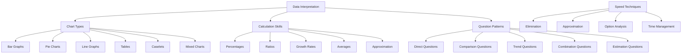
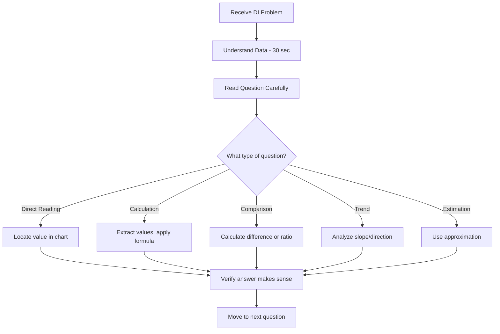
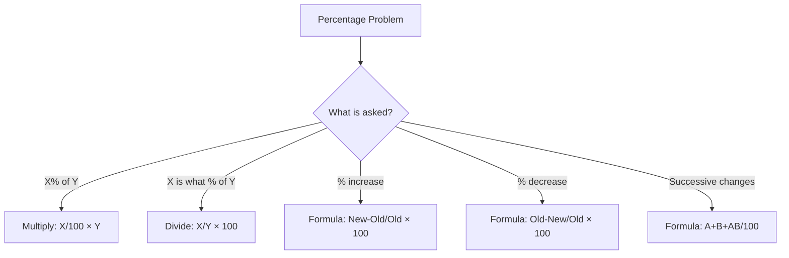
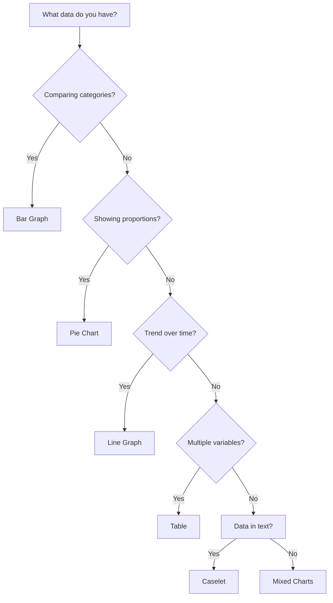

# 14 - Data Interpretation for Interviews

---

## 1. Introduction

### What is Data Interpretation?
Data Interpretation (DI) is the ability to analyze, process, and draw meaningful conclusions from data presented in various formats — tables, bar graphs, pie charts, line graphs, and caselets. It involves mathematical calculations, logical reasoning, and analytical thinking to answer questions based on visual and tabular data.

### Why It Matters for Interviews
Data Interpretation is a staple in:
- **Campus placement aptitude tests** (AMCAT, eLitmus, CoCubes)
- **Banking and MBA entrance exams** (CAT, GRE, GMAT)
- **Consulting interviews** (McKinsey, BCG, Bain case interviews)
- **Product management interviews** (data-driven decision making)
- **Business analyst interviews** (report analysis)
- **Marketing and finance roles** (metric interpretation)
- **Data analyst/scientist interviews** (foundational skill)

Companies test DI because modern business decisions are data-driven. If you can't interpret a chart, you can't make informed decisions.

### How It Matters for Your Career
Every role, from engineering to marketing to management, involves some level of data analysis. Managers review dashboards, engineers monitor metrics, and executives make decisions based on charts and reports. DI proficiency enables you to:
- Make faster, data-driven decisions
- Present findings clearly to stakeholders
- Identify trends and anomalies in business data
- Communicate data insights to non-technical teams

---

## 2. Learning Roadmap



### Timeline
| Phase | Duration | Focus |
|-------|----------|-------|
| Week 1 | Days 1-3 | Percentage and ratio calculations |
| Week 1 | Days 4-7 | Bar graphs and tables |
| Week 2 | Days 8-10 | Pie charts and line graphs |
| Week 2 | Days 11-14 | Caselets and mixed charts |
| Week 3 | Days 15-17 | Growth rates and averages |
| Week 3 | Days 18-21 | Speed techniques and approximation |
| Week 4 | Days 22-28 | Full practice sets and mock tests |

---

## 3. Theory Notes

### 3.1 Chart Types and When to Use Them

#### Bar Graphs
- **What:** Rectangular bars representing data values
- **Best for:** Comparing quantities across categories
- **Key skills:** Reading values, comparing heights, calculating differences
- **Types:** Simple, grouped, stacked

#### Pie Charts
- **What:** Circular charts divided into sectors (slices)
- **Best for:** Showing proportions/percentages of a whole
- **Key skills:** Converting degrees to percentages, comparing slices
- **Formula:** Percentage = (Sector Value / Total) × 100; Degrees = (Percentage / 100) × 360

#### Line Graphs
- **What:** Data points connected by lines
- **Best for:** Showing trends over time
- **Key skills:** Reading slopes, identifying trends, comparing rates of change

#### Tables
- **What:** Data organized in rows and columns
- **Best for:** Precise numerical data, multiple variables
- **Key skills:** Reading cross-references, calculating row/column totals

#### Caselets
- **What:** Data presented in paragraph form (no visual)
- **Best for:** Testing reading comprehension + calculation
- **Key skills:** Extracting data from text, creating mental models

#### Mixed Charts
- **What:** Combinations of different chart types
- **Best for:** Complex data sets with multiple dimensions
- **Key skills:** Cross-referencing between chart types

### 3.2 Essential Calculation Skills

#### Percentage Calculations
| What to Calculate | Formula | Example |
|-------------------|---------|---------|
| X is what % of Y | (X/Y) × 100 | 45 is what % of 180? → (45/180)×100 = 25% |
| X% of Y | (X/100) × Y | 25% of 200 = 50 |
| Percentage increase | ((New-Old)/Old) × 100 | From 80 to 100: ((100-80)/80)×100 = 25% |
| Percentage decrease | ((Old-New)/Old) × 100 | From 100 to 80: ((100-80)/100)×100 = 20% |
| Successive % change | A + B + (AB/100) | 10% increase + 20% decrease = 10+20+(10×20/100) = -8% (net decrease) |

#### Quick Percentage Tricks
| Percentage | Fraction |
|-----------|----------|
| 10% | 1/10 |
| 12.5% | 1/8 |
| 16.67% | 1/6 |
| 20% | 1/5 |
| 25% | 1/4 |
| 33.33% | 1/3 |
| 50% | 1/2 |
| 66.67% | 2/3 |
| 75% | 3/4 |

#### Ratio Analysis
- **Part-to-Part:** A:B (e.g., boys:girls = 3:2)
- **Part-to-Whole:** A:(A+B) (e.g., boys:total = 3:5)
- **Cross-multiplication:** If A/B = C/D, then AD = BC
- **Proportion:** If 3:5 = 6:x, then x = (5×6)/3 = 10

#### Growth Rates
| Type | Formula | Example |
|------|---------|---------|
| Simple Growth | Value × (1 + rate) | 500 × 1.20 = 600 |
| Compound Growth | Value × (1 + rate)^n | 500 × (1.10)^2 = 605 |
| CAGR | (Final/Initial)^(1/n) - 1 | (1000/500)^(1/3) - 1 = 26% |

#### Averages
- **Average** = Sum of values / Number of values
- **Weighted Average** = Σ(value × weight) / Σ(weights)
- **New average** = (old average × old count + new value) / new count

### 3.3 Approximation Techniques

1. **Round to nearest easy number:** 478 → 480, 193 → 200
2. **Use fractions instead of percentages:** 33.3% → 1/3
3. **Cancel common factors early:** (144 × 25)/(12 × 15) → (12 × 12 × 25)/(12 × 15) → (12 × 25)/15 → (12 × 5)/3 = 20
4. **Estimate before calculating:** Check if answer should be roughly 10, 100, or 1000
5. **Use options to guide precision:** If options are 20, 40, 60, 80, approximate; if 21, 23, 25, 27, be precise

### 3.4 Reading Charts Effectively

**Step-by-step approach:**
1. **Read the title:** What is this chart about?
2. **Read axes/labels:** What do the axes represent? What are the units?
3. **Read the legend:** What do different colors/patterns represent?
4. **Identify the range:** What's the minimum and maximum?
5. **Spot trends:** Is data increasing, decreasing, or stable?
6. **Identify outliers:** Any unusually high or low values?

**Common chart traps:**
- Different scales on axes (e.g., left axis 0-100, right axis 0-1000)
- Truncated axes (y-axis doesn't start at zero)
- Misleading proportions in pie charts
- Missing data points in line graphs
- Grouped bar graphs with different categories

### 3.5 DI Question Patterns

| Pattern | Description | Strategy |
|---------|------------|----------|
| **Direct Reading** | Read exact value from chart | Locate and read carefully |
| **Comparison** | Compare values across categories | Calculate difference or ratio |
| **Trend Analysis** | Identify patterns over time | Look at slope/direction |
| **Calculation** | Perform arithmetic with chart values | Extract values, calculate |
| **Estimation** | Approximate values or answers | Use rounding and fractions |
| **Combination** | Use data from multiple charts | Cross-reference carefully |
| **Percentage** | Calculate percentages from data | Apply percentage formulas |
| **Ratio** | Determine ratios between values | Simplify fractions |

### 3.6 Speed Techniques

**1. Option Analysis:**
Before calculating, look at the options. If options are far apart, approximate. If close together, calculate precisely.

**2. Elimination:**
Use logic to eliminate obviously wrong answers before calculating.

**3. Back-solving:**
Plug options into the question to see which works.

**4. Ratio shortcut:**
Instead of calculating both values, find the ratio directly.

**5. Percentage shortcuts:**
Use fraction equivalents (1/8 = 12.5%, 1/6 ≈ 16.67%).

---

## 4. Key Concepts

| Concept | Formula/Rule | Application |
|---------|-------------|-------------|
| Percentage | (Part/Whole) × 100 | Comparing values, growth rates |
| Ratio | A:B = A/B | Comparing proportions |
| Growth Rate | ((New-Old)/Old) × 100 | Year-over-year changes |
| CAGR | (Final/Initial)^(1/n) - 1 | Multi-year growth trends |
| Average | Sum / Count | Central tendency |
| Weighted Average | Σ(value × weight) / Σ(weights) | Combined group analysis |
| Pie Chart Degrees | (Percentage/100) × 360 | Converting data to pie chart |
| Successive Change | A + B + AB/100 | Multiple percentage changes |
| Ratio to Percentage | A/(A+B) × 100 | Converting ratios to percentages |
| Inverse Ratio | If A:B = m:n, then B:A = n:m | Reversing comparisons |

---

## 5. Frequently Asked Interview Questions

### Beginner Level

1. **Q: How do you read a bar graph?**
   A: Identify the title (what it represents), read the x-axis (categories) and y-axis (values), check the scale, then read the height of each bar. For grouped bar graphs, use the legend to identify which bar represents which category.

2. **Q: What is the difference between a bar graph and a line graph?**
   A: A bar graph compares discrete categories using bars. A line graph shows trends over continuous data (usually time) using connected points. Use bar graphs for comparison and line graphs for trends.

3. **Q: How do you calculate percentage increase?**
   A: Formula: ((New Value - Old Value) / Old Value) × 100. Example: Sales went from 200 to 250. Increase = ((250-200)/200) × 100 = 25%.

4. **Q: How do you convert a pie chart sector to degrees?**
   A: Degrees = (Percentage / 100) × 360. Example: A 25% sector = (25/100) × 360 = 90 degrees.

5. **Q: What is a caselet in DI?**
   A: A caselet presents data in paragraph form instead of a visual chart. You need to extract the data, organize it (mentally or on paper), and then answer questions. It combines reading comprehension with data interpretation.

6. **Q: What does CAGR stand for?**
   A: Compound Annual Growth Rate. It represents the mean annual growth rate of an investment over a period longer than one year. Formula: CAGR = (Final Value / Initial Value)^(1/n) - 1, where n is the number of years.

7. **Q: How do you handle DI questions with multiple charts?**
   A: Read all charts first to understand what each shows. Note which data connects between charts. Answer each question by identifying which chart(s) contain the needed information. Be careful about units and scales.

8. **Q: What is the most important skill for DI?**
   A: Quick and accurate percentage/ratio calculations. Most DI questions boil down to percentage calculations, ratio comparisons, or growth rate computations. Mastering these fundamentals dramatically improves speed.

### Intermediate Level

9. **Q: A company's revenue grew 20% in Year 1 and 30% in Year 2. What is the overall growth?**
   A: Overall growth = 20 + 30 + (20×30)/100 = 50 + 6 = 56%. Using the successive percentage formula: A + B + AB/100.

10. **Q: How do you compare data across two different bar graphs with different scales?**
    A: Don't compare absolute values directly. Convert both to percentages of their respective totals, or normalize to a common base. Always check the scales before comparing.

11. **Q: A pie chart shows 5 sectors: 30%, 25%, 20%, 15%, 10%. If the total is 500, what is the value of the smallest sector?**
    A: Smallest sector = 10% of 500 = 50. Quick calculation: 10% = 1/10, so 500/10 = 50.

12. **Q: How do you handle DI questions with "approximate" or "approximately" in the question?**
    A: This means you don't need exact calculations. Round numbers to the nearest easy value and use estimation. Check if your approximation falls within the range of options.

13. **Q: What is the relationship between ratios and percentages?**
    A: A ratio A:B can be converted to percentages: A% = A/(A+B) × 100, B% = B/(A+B) × 100. Example: Ratio 3:2 → A = 60%, B = 40%. Percentages are just ratios expressed per 100.

14. **Q: How do you calculate the average when data is given in frequencies?**
    A: Use weighted average. Formula: (Σ(value × frequency)) / Σ(frequencies). Example: 10 students scored 80, 20 scored 90. Average = (10×80 + 20×90)/(10+20) = (800+1800)/30 = 86.67.

15. **Q: A line graph shows declining sales for 3 consecutive months. How do you calculate the rate of decline?**
    A: Calculate percentage decrease for each month: ((Previous - Current)/Previous) × 100. For overall decline: ((First Month - Last Month)/First Month) × 100.

16. **Q: What should you do if you can't read exact values from a chart?**
    A: Use the grid lines and scale to estimate. If bars are between grid lines, estimate proportionally. Check if the question asks for "approximately" — then estimation is fine. If exact values are needed, look for the closest reasonable estimate.

### Advanced Level

17. **Q: A stacked bar graph shows components A, B, C for 4 years. How do you find the growth rate of component B alone?**
    A: Extract the value of B for each year from the stacked bar. Calculate growth rate for B: ((Year N value - Year 1 value) / Year 1 value) × 100. Don't confuse with total bar growth.

18. **Q: How do you handle DI questions where data is inconsistent across charts?**
    A: Note the discrepancy, but typically answer based on the chart the question specifically references. If a question says "according to the bar graph," use only that data. Flag inconsistencies for later review.

19. **Q: You have a table with 5 columns and 10 rows. A question asks about the ratio of column 3 to column 5 for rows where column 2 > 100. How do you approach this?**
    A: First, filter rows where column 2 > 100. Then, for each filtered row, calculate column 3/column 5. Find the ratio. If asked for average ratio, sum the ratios and divide by count. If asked for overall ratio, sum all column 3 values and divide by sum of all column 5 values.

20. **Q: How do you compare efficiency between two entities when given both absolute and percentage data?**
    A: Use both metrics. High percentage with low absolute may mean a small base. Low percentage with high absolute may mean a large impact. Consider both magnitude and rate for a complete picture.

### FAANG Level

21. **Q: In a consulting case interview, you're given a chart showing market share trends. How do you structure your analysis?**
    A: (1) State what the chart shows (title, axes, time period). (2) Identify key trends (increasing, decreasing, stable). (3) Compare competitors (who's gaining/losing). (4) Calculate key metrics (growth rates, market share changes). (5) Draw implications (what this means for the business). (6) Recommend actions based on data.

22. **Q: You notice a pie chart in a business report where the percentages don't add up to 100%. How do you handle this?**
    A: Check for rounding (common — percentages may have been rounded individually). Check for missing categories. In a presentation, ask the presenter to clarify. In a test, use the data as given and note the discrepancy if asked. Don't assume it's an error unless it clearly is.

23. **Q: How would you explain a complex data visualization to a non-technical executive?**
    A: Start with the headline (what the data shows), not the details. Use simple language: "This chart shows our sales have grown 25% over the last year." Avoid jargon. Focus on what matters to the executive (trends, outliers, action items). Use analogies if helpful.

24. **Q: A dashboard shows 15 different metrics. How do you identify which ones matter most?**
    A: Align metrics with business objectives. Revenue, customer growth, and cost metrics usually matter most. Look for trends, not just snapshots. Identify leading indicators (predict future) vs. lagging indicators (reflect past). Focus on metrics where action can be taken.

25. **Q: How do you handle data that tells a story different from the company's narrative?**
    A: Report the data accurately. Present both the data and the company's interpretation. Ask clarifying questions: "The data shows X, but we've been saying Y. Can you help me understand the discrepancy?" Be factual, not confrontational. Data should inform decisions, not dictate them.

---

## 6. Hands-on Practice

### Exercise 1: Bar Graph Reading
A bar graph shows quarterly sales: Q1=150, Q2=180, Q3=220, Q4=200.

**Q1:** What is the total annual sales?
**Q2:** Which quarter had the highest sales?
**Q3:** What is the percentage increase from Q1 to Q3?
**Q4:** What is the average quarterly sales?
**Q5:** By what percentage did sales decrease from Q3 to Q4?

**Answers:**
Q1: 150+180+220+200 = 750
Q2: Q3 (220)
Q3: ((220-150)/150) × 100 = 46.67%
Q4: 750/4 = 187.5
Q5: ((220-200)/220) × 100 = 9.09%

### Exercise 2: Pie Chart Analysis
A company's expenses: Salaries (40%), Rent (15%), Marketing (20%), Operations (15%), Others (10%). Total expenses = $500,000.

**Q1:** How much is spent on Salaries?
**Q2:** What is the angle for Marketing in the pie chart?
**Q3:** How much more is spent on Salaries than Rent?
**Q4:** What percentage is spent on Salaries + Marketing combined?
**Q5:** If Salaries increase by 10%, what is the new total expense?

**Answers:**
Q1: 40% of 500,000 = $200,000
Q2: (20/100) × 360 = 72 degrees
Q3: (40%-15%) × 500,000 = 25% × 500,000 = $125,000
Q4: 40% + 20% = 60%
Q5: New salary = 200,000 × 1.10 = 220,000. New total = 500,000 + 20,000 = $520,000

### Exercise 3: Line Graph Trend Analysis
Monthly website visitors: Jan=10K, Feb=12K, Mar=15K, Apr=14K, May=18K, Jun=22K.

**Q1:** What is the overall trend?
**Q2:** Which month saw the biggest increase?
**Q3:** Which month saw a decline?
**Q4:** What is the growth rate from Jan to Jun?
**Q5:** What is the average monthly growth rate?

**Answers:**
Q1: Overall upward trend with a slight dip in April.
Q2: May: 18-14 = 4K increase (28.57%). Also Jun: 22-18 = 4K (22.22%). May had the highest percentage increase.
Q3: April (declined from 15K to 14K).
Q4: ((22-10)/10) × 100 = 120%
Q5: Total growth = 120% over 5 months. Average monthly = 120%/5 = 24% (simple average). More precisely, using CAGR: (22/10)^(1/5) - 1 = 17.1%.

### Exercise 4: Table Data Analysis
| Employee | Dept | Salary | Rating | Years |
|----------|------|--------|--------|-------|
| A | IT | 80K | 4.5 | 5 |
| B | HR | 65K | 3.8 | 3 |
| C | IT | 95K | 4.8 | 8 |
| D | Marketing | 70K | 4.0 | 4 |
| E | HR | 72K | 4.2 | 6 |

**Q1:** What is the average salary?
**Q2:** Which department has a higher average salary?
**Q3:** What is the ratio of IT to HR employees?
**Q4:** Who has the highest salary-to-years ratio?
**Q5:** What is the average rating for employees with more than 4 years?

**Answers:**
Q1: (80+65+95+70+72)/5 = 382/5 = $76.4K
Q2: IT: (80+95)/2 = $87.5K. HR: (65+72)/2 = $68.5K. IT is higher.
Q3: IT:HR = 2:3
Q4: A: 80/5=16, B: 65/3=21.67, C: 95/8=11.875, D: 70/4=17.5, E: 72/6=12. B has highest ratio.
Q5: Employees with >4 years: A (4.5), C (4.8), E (4.2). Average = (4.5+4.8+4.2)/3 = 4.5

### Exercise 5: Successive Percentage Changes
A product's price undergoes: 20% increase → 10% decrease → 15% increase. Starting price = $100.

**Q1:** What is the final price?
**Q2:** What is the overall percentage change?

**Answers:**
Q1: $100 × 1.20 × 0.90 × 1.15 = $100 × 1.242 = $124.20
Q2: ((124.20-100)/100) × 100 = 24.2%

### Exercise 6: Caselet Problem
"A company has 3 products: X, Y, Z. Product X contributes 40% of revenue. Product Y's revenue is half of X's. The remaining revenue comes from Z. Total revenue is $1M. Product X's cost is 60% of its revenue. Product Y's cost is 70% of its revenue. Product Z's cost is 50% of its revenue."

**Q1:** What is each product's revenue?
**Q2:** What is each product's profit?
**Q3:** Which product has the highest profit margin?
**Q4:** What is the total profit?
**Q5:** What percentage of total profit comes from Product Z?

**Answers:**
Q1: X = 40% × 1M = $400K. Y = 50% × 400K = $200K. Z = 1M - 400K - 200K = $400K.
Q2: X profit = 400K - (60% × 400K) = 400K - 240K = $160K. Y profit = 200K - (70% × 200K) = 200K - 140K = $60K. Z profit = 400K - (50% × 400K) = 400K - 200K = $200K.
Q3: X margin = 160/400 = 40%. Y margin = 60/200 = 30%. Z margin = 200/400 = 50%. Z has highest margin.
Q4: Total profit = 160K + 60K + 200K = $420K
Q5: 200K/420K × 100 = 47.62%

### Exercise 7: Growth Rate Calculations
Company A: Revenue Year 1 = $2M, Year 5 = $5M.
Company B: Revenue Year 1 = $3M, Year 5 = $6M.

**Q1:** What is CAGR for each company?
**Q2:** Which company grew faster?
**Q3:** If trends continue, what will each company's revenue be in Year 7?

**Answers:**
Q1: CAGR_A = (5/2)^(1/4) - 1 = (2.5)^0.25 - 1 = 25.7%. CAGR_B = (6/3)^(1/4) - 1 = (2)^0.25 - 1 = 18.9%.
Q2: Company A grew faster (25.7% vs 18.9%).
Q3: A: 5M × (1.257)^2 = 5M × 1.58 = $7.9M. B: 6M × (1.189)^2 = 6M × 1.414 = $8.48M.

### Exercise 8: Mixed Chart Practice
Bar graph shows sales by region (North=200, South=350, East=150, West=300). Pie chart shows profit margins (North=10%, South=8%, East=15%, West=12%).

**Q1:** Which region has the highest profit?
**Q2:** What is the total profit across all regions?
**Q3:** What is the profit-to-sales ratio for the South region?
**Q4:** If the North increases sales by 20%, what is its new profit?

**Answers:**
Q1: North profit = 200×0.10 = 20. South = 350×0.08 = 28. East = 150×0.15 = 22.5. West = 300×0.12 = 36. West has highest profit.
Q2: Total profit = 20 + 28 + 22.5 + 36 = $106.5
Q3: 28/350 = 8% (which matches the profit margin).
Q4: New sales = 200 × 1.20 = 240. New profit = 240 × 0.10 = $24.

### Exercise 9: Approximation Challenge
Without exact calculation, estimate which is larger:
A) 47% of 380
B) 38% of 470
C) They are approximately equal

**Answer:** C. 47% × 380 ≈ 178.6. 38% × 470 ≈ 178.6. They're actually equal! (This is because 47 × 380 = 38 × 470.)

### Exercise 10: Data Sufficiency
For each question, determine if the data provided is sufficient to answer:
**Q:** What is the profit margin of Company X?
- Statement 1: Company X's revenue is $500K.
- Statement 2: Company X's cost is $350K.

**Answer:** Both statements together are sufficient. Profit margin = ((Revenue - Cost)/Revenue) × 100 = ((500-350)/500) × 100 = 30%. Neither statement alone is sufficient.

---

## 7. Real FAANG Interview Questions

| Company | Question Topic | Chart Type | Difficulty |
|---------|---------------|------------|------------|
| Google | Search query trends over time | Line graph | Intermediate |
| Google | Ad revenue by region | Bar graph + Pie chart | Advanced |
| Meta | User growth by platform | Line graph | Intermediate |
| Meta | Advertiser spending patterns | Table | Intermediate |
| Amazon | Product category sales comparison | Bar graph | Beginner |
| Amazon | Warehouse efficiency metrics | Table + Calculation | Advanced |
| Apple | Product line revenue breakdown | Pie chart | Beginner |
| Apple | Quarterly sales trends | Line graph | Intermediate |
| Microsoft | Cloud service adoption rates | Bar graph | Intermediate |
| Microsoft | Market share comparison | Mixed charts | Advanced |
| Netflix | Subscriber growth vs. churn | Line graph | Advanced |
| Netflix | Content spending by category | Pie chart + Bar graph | Intermediate |

---

## 8. Common Mistakes

| Mistake | Description | How to Avoid |
|---------|------------|--------------|
| Misreading axes | Confusing x and y axes or misreading scale | Always read labels carefully before answering |
| Ignoring units | Comparing $1000 with $1M | Check units (K, M, B, %) before calculations |
| Not checking total | Pie chart doesn't add to 100% | Verify total matches before calculating |
| Calculating wrong base | Using wrong denominator in percentages | Identify "of what" — that's your base |
| Rounding too early | Losing precision in multi-step calculations | Round at the end, not the beginning |
| Confusing increase/decrease | Calculating the wrong direction | Draw arrow: Old → New, then calculate |
| Ignoring zero baseline | Truncated axes distorting perception | Check if y-axis starts at zero |
| Mixing data sources | Using data from wrong chart for a question | Match question to correct chart |
| Rushing without understanding | Starting calculations before understanding the data | Spend 30 seconds understanding the chart first |
| Not using options | Calculating exact value when options differ greatly | Check options first — they guide your approach |

---

## 9. Best Practices

1. **Understand the data first** — Spend 30 seconds reading titles, axes, legends, and units before any calculations.
2. **Master percentage calculations** — 80% of DI questions involve percentages. Learn fraction equivalents (1/8=12.5%, 1/6≈16.67%).
3. **Use approximation when possible** — Round numbers to make calculations faster. Only be precise when options are close together.
4. **Check options before calculating** — Options tell you how precise you need to be. Wide options = approximate. Close options = calculate precisely.
5. **Verify your answer makes sense** — If you calculate a 200% growth but options show 20%, you made an error.
6. **Practice mental math** — Quick multiplication, division, and percentage calculations save valuable time.
7. **Read questions carefully** — "What is the percentage increase?" is different from "What is the value after increase?"
8. **Draw/annotate on the chart** — Circle key values, draw arrows for trends, note calculations on the chart itself.
9. **Practice all chart types** — Don't just practice bar graphs. Ensure you're comfortable with pie charts, line graphs, tables, and caselets.
10. **Time yourself** — DI questions should take 1-2 minutes each. Practice with a timer to build speed.
11. **Review errors systematically** — After each practice set, analyze: Was the error in reading, calculating, or understanding?
12. **Build calculation speed** — Practice mental math daily. Know your multiplication tables, fraction equivalents, and percentage shortcuts.

---

## 10. Cheat Sheet

```
+---------------------------------------------------------------+
|              DATA INTERPRETATION CHEAT SHEET                   |
+---------------------------------------------------------------+
|                                                               |
|  PERCENTAGE FORMULAS                                          |
|  X% of Y = (X/100) × Y                                       |
|  X is what % of Y = (X/Y) × 100                              |
|  % increase = ((New-Old)/Old) × 100                          |
|  % decrease = ((Old-New)/Old) × 100                          |
|  Successive: A + B + (A×B)/100                                |
|                                                               |
|  KEY FRACTIONS                                                |
|  1/2=50%  1/3≈33%  1/4=25%  1/5=20%  1/6≈17%               |
|  1/8=12.5%  1/10=10%  1/20=5%  3/4=75%  2/3≈67%            |
|                                                               |
|  PIE CHART                                                    |
|  Degrees = (Percentage/100) × 360                            |
|  Percentage = (Sector/Total) × 100                           |
|                                                               |
|  GROWTH RATES                                                 |
|  Simple: Value × (1 + rate)                                  |
|  Compound: Value × (1 + rate)^n                              |
|  CAGR = (Final/Initial)^(1/n) - 1                           |
|                                                               |
|  AVERAGES                                                     |
|  Average = Sum / Count                                        |
|  Weighted Avg = Σ(value × weight) / Σ(weights)              |
|  New Avg = (Old Avg × Old Count + New Value) / New Count     |
|                                                               |
|  SPEED TRICKS                                                 |
|  - Round numbers before calculating                          |
|  - Use fraction equivalents for percentages                  |
|  - Cancel common factors early                               |
|  - Check options to determine precision needed               |
|  - Eliminate obviously wrong answers first                   |
|                                                               |
|  CHART READING CHECKLIST                                      |
|  1. Read title  2. Read axes  3. Read legend                |
|  4. Check scale  5. Note units  6. Spot trends              |
|                                                               |
+---------------------------------------------------------------+
```

---

## 11. Flash Cards

| # | Question | Answer |
|---|----------|--------|
| 1 | Formula for percentage increase? | ((New-Old)/Old) × 100 |
| 2 | How many degrees is a 25% pie slice? | 90 degrees |
| 3 | What is 15% of 200? | 30 |
| 4 | Successive changes: +10% then -10%? | Net: -1% (not 0%) |
| 5 | What is CAGR formula? | (Final/Initial)^(1/n) - 1 |
| 6 | If ratio is 3:5, what % is the first part? | 3/(3+5) × 100 = 37.5% |
| 7 | What is 1/8 as a percentage? | 12.5% |
| 8 | Average of 10, 20, 30, 40, 50? | 30 |
| 9 | If sales go from 100 to 125, what's the % increase? | 25% |
| 10 | How do you read a stacked bar graph? | Read each segment's height, note the base of each segment |
| 11 | What does a downward slope in a line graph indicate? | Decreasing values over time |
| 12 | What is a caselet? | Data presented in paragraph form instead of visual |
| 13 | If X is 40% of Y and Y = 500, what is X? | 200 |
| 14 | What's the angle for a 10% pie sector? | 36 degrees |
| 15 | CAGR of 100 to 400 in 4 years? | (400/100)^0.25 - 1 = 41.4% |
| 16 | What is a good approximation for 33.33%? | 1/3 |
| 17 | Weighted average of 80 (weight 2) and 90 (weight 3)? | (80×2+90×3)/5 = 86 |
| 18 | What's 20% of 15% of 200? | 20% of 30 = 6 |
| 19 | If pie chart total = 500 and sector = 125, what %? | 25% |
| 20 | Difference between bar graph and histogram? | Bar graph: discrete categories. Histogram: continuous ranges. |

---

## 12. Mind Map

```
Data Interpretation
│
├── Chart Types
│   ├── Bar Graphs (simple, grouped, stacked)
│   ├── Pie Charts (proportions, degrees)
│   ├── Line Graphs (trends over time)
│   ├── Tables (precise data, cross-references)
│   ├── Caselets (text-based data)
│   └── Mixed Charts (combinations)
│
├── Calculation Skills
│   ├── Percentages (increase, decrease, successive)
│   ├── Ratios (part-to-part, part-to-whole)
│   ├── Growth Rates (simple, compound, CAGR)
│   ├── Averages (simple, weighted)
│   └── Approximation (rounding, fractions)
│
├── Question Patterns
│   ├── Direct Reading
│   ├── Comparison
│   ├── Trend Analysis
│   ├── Calculation
│   ├── Estimation
│   ├── Combination
│   └── Data Sufficiency
│
├── Speed Techniques
│   ├── Option Analysis
│   ├── Process of Elimination
│   ├── Back-solving
│   ├── Fraction Shortcuts
│   └── Mental Math
│
└── Common Pitfalls
    ├── Misreading axes/scales
    ├── Ignoring units
    ├── Wrong calculation base
    ├── Rounding too early
    └── Mixing data sources
```

---

## 13. Mermaid Diagrams

### Diagram 1: DI Problem-Solving Flow


### Diagram 2: Percentage Calculation Decision


### Diagram 3: Chart Selection Guide


---

## 14. Code Examples

### Example 1: DI Calculator (Python)
```python
class DICalculator:
    @staticmethod
    def percentage(part, whole):
        return (part / whole) * 100

    @staticmethod
    def percentage_of(percent, value):
        return (percent / 100) * value

    @staticmethod
    def percentage_increase(old, new):
        return ((new - old) / old) * 100

    @staticmethod
    def percentage_decrease(old, new):
        return ((old - new) / old) * 100

    @staticmethod
    def successive_percentage(changes):
        result = 1
        for change in changes:
            result *= (1 + change / 100)
        return (result - 1) * 100

    @staticmethod
    def cagr(initial, final, years):
        return ((final / initial) ** (1 / years) - 1) * 100

    @staticmethod
    def average(values):
        return sum(values) / len(values)

    @staticmethod
    def weighted_average(values, weights):
        return sum(v * w for v, w in zip(values, weights)) / sum(weights)

    @staticmethod
    def ratio_to_percentage(a, b):
        return (a / (a + b)) * 100

    @staticmethod
    def pie_chart_degrees(percentage):
        return (percentage / 100) * 360

calc = DICalculator()

print(f"15% of 200: {calc.percentage_of(15, 200)}")
print(f"50 is what % of 200: {calc.percentage(50, 200)}%")
print(f"Increase from 80 to 100: {calc.percentage_increase(80, 100)}%")
print(f"Successive +10%, -5%: {calc.successive_percentage([10, -5]):.2f}%")
print(f"CAGR (100→200 in 3 years): {calc.cagr(100, 200, 3):.2f}%")
print(f"Average of 10,20,30: {calc.average([10, 20, 30])}")
print(f"Weighted avg (80×2, 90×3): {calc.weighted_average([80, 90], [2, 3]):.1f}")
print(f"3:2 ratio as %: {calc.ratio_to_percentage(3, 2)}%")
print(f"25% in pie chart degrees: {calc.pie_chart_degrees(25)}°")
```

### Example 2: Chart Data Analyzer
```python
class ChartAnalyzer:
    def __init__(self, data):
        self.data = data

    def bar_analysis(self):
        values = list(self.data.values())
        total = sum(values)
        return {
            "total": total,
            "average": total / len(values),
            "max_category": max(self.data, key=self.data.get),
            "min_category": min(self.data, key=self.data.get),
            "range": max(values) - min(values),
            "percentages": {k: round(v/total*100, 1) for k, v in self.data.items()}
        }

    def pie_chart_analysis(self):
        total = sum(self.data.values())
        analysis = {}
        for category, value in self.data.items():
            pct = value / total * 100
            degrees = pct / 100 * 360
            analysis[category] = {
                "value": value,
                "percentage": round(pct, 1),
                "degrees": round(degrees, 1)
            }
        return analysis

    def line_graph_analysis(self):
        values = list(self.data.values())
        categories = list(self.data.keys())
        trends = []
        for i in range(1, len(values)):
            change = values[i] - values[i-1]
            pct_change = (change / values[i-1]) * 100
            trends.append({
                "from": categories[i-1],
                "to": categories[i],
                "change": change,
                "pct_change": round(pct_change, 1)
            })
        overall_growth = ((values[-1] - values[0]) / values[0]) * 100
        return {
            "overall_growth": round(overall_growth, 1),
            "trends": trends,
            "increasing": all(v2 > v1 for v1, v2 in zip(values, values[1:])),
            "peak": max(self.data, key=self.data.get),
            "trough": min(self.data, key=self.data.get)
        }

sales = {"Q1": 150, "Q2": 180, "Q3": 220, "Q4": 200}
analyzer = ChartAnalyzer(sales)

print("Bar Analysis:", analyzer.bar_analysis())
print("\nPie Chart Analysis:", analyzer.pie_chart_analysis())
print("\nLine Graph Analysis:", analyzer.line_graph_analysis())
```

### Example 3: Growth Rate Calculator
```python
class GrowthAnalyzer:
    def __init__(self, yearly_data):
        self.years = list(yearly_data.keys())
        self.values = list(yearly_data.values())

    def yearly_growth_rates(self):
        rates = []
        for i in range(1, len(self.values)):
            rate = ((self.values[i] - self.values[i-1]) / self.values[i-1]) * 100
            rates.append({
                "period": f"{self.years[i-1]} to {self.years[i]}",
                "growth_rate": round(rate, 2)
            })
        return rates

    def cagr(self):
        n = len(self.values) - 1
        return ((self.values[-1] / self.values[0]) ** (1/n) - 1) * 100

    def simple_average_growth(self):
        rates = self.yearly_growth_rates()
        return sum(r["growth_rate"] for r in rates) / len(rates)

    def projected_value(self, years_ahead, method="cagr"):
        if method == "cagr":
            rate = self.cagr() / 100
            return self.values[-1] * (1 + rate) ** years_ahead
        else:
            rate = self.simple_average_growth() / 100
            return self.values[-1] * (1 + rate) ** years_ahead

revenue = {"2019": 200, "2020": 250, "2021": 320, "2022": 400, "2023": 520}
analyzer = GrowthAnalyzer(revenue)

print("Yearly Growth Rates:", analyzer.yearly_growth_rates())
print(f"CAGR: {analyzer.cagr():.2f}%")
print(f"Simple Average Growth: {analyzer.simple_average_growth():.2f}%")
print(f"Projected 2025 (CAGR): ${analyzer.projected_value(2, 'cagr'):.0f}K")
print(f"Projected 2025 (Simple): ${analyzer.projected_value(2, 'simple'):.0f}K")
```

---

## 15. Projects

### Mini Project 1: DI Quiz Application
Build a CLI quiz app that generates random DI questions with bar graphs, pie charts, and tables. Include timed mode, scoring, and difficulty levels.

### Mini Project 2: Percentage Calculator Tool
Create a Python tool that handles all percentage-related DI calculations: increase, decrease, successive changes, CAGR, and ratio conversions.

### Mini Project 3: Chart Data Extractor
Build a tool that takes an image of a chart and extracts the data points, then answers questions based on the extracted data.

### Intermediate Project 1: DI Practice Platform
Develop a web app with multiple chart types, timed practice sets, performance tracking, difficulty adaptive questions, and detailed analytics.

### Intermediate Project 2: Financial Data Analyzer
Create a tool that analyzes company financial data (revenue, expenses, profits) and generates insights: growth rates, trends, comparisons, and projections.

### Advanced Project 1: Real-Time Dashboard
Build a live dashboard that visualizes streaming data with interactive charts, real-time calculations, and anomaly detection.

### Advanced Project 2: DI Test Simulator
Develop a full test simulator that replicates actual exam DI sections with realistic time pressure, question types, and scoring.

### Project Ideas (10 total)
1. Stock price trend analyzer with growth calculations
2. Population growth predictor using CAGR
3. Sales performance dashboard with comparisons
4. Budget tracker with percentage breakdowns
5. Market share analyzer with competitive comparisons
6. Survey data analyzer with weighted averages
7. Sports statistics analyzer with trend detection
8. Weather data trend analyzer
9. Social media metrics tracker
10. Expense ratio analyzer for mutual funds

---

## 16. Resources

### Practice Websites
| Website | URL | Focus |
|---------|-----|-------|
| IndiaBIX | indiabix.com | DI practice questions |
| GMAT Club | gmatclub.com | GMAT DI sections |
| CATKing | catking.in | CAT DI preparation |
| 4tests.com | 4tests.com | Free DI tests |
| PrepInsta | prepinsta.com | Campus placement DI |

### Books
| Book | Author | Level |
|------|--------|-------|
| *Data Interpretation & Data Sufficiency* | Ananta Ashisha | All levels |
| *How to Prepare for Data Interpretation* | Arun Sharma | Intermediate |
| *GRE Data Interpretation* | Manhattan Prep | Advanced |
| *Quantitative Aptitude for Competitive Exams* | R.S. Aggarwal | Beginner |
| *The Official Guide for GMAT Review* | GMAC | Advanced |

### Documentation
- GMAT Official Guide (DI section)
- CAT Previous Year Papers (DI sections)
- AMCAT Quantitative & DI Syllabus
- eLitmus DI Preparation Guide
- CAT Data Interpretation by Indian Institute of Management

### YouTube Channels
| Channel | Focus |
|---------|-------|
| Unacademy CAT | CAT DI preparation |
| Rodha | DI & Quant concepts |
| MBA Pathshala | DI strategies |
| Study IQ Education | General aptitude |
| Adda247 | Banking & competitive exam DI |

### Blogs
- CAT Preparation Blog (Unacademy)
- GMAT Club DI Forum
- PrepInsta Blog
- InsideIIM Blog
- PagalGuy Forum

### Certifications
- AMCAT Quantitative & Logical Ability
- GMAT Quantitative Section Score
- Excel Data Analysis (Microsoft)
- Tableau Data Analyst Certification
- Google Data Analytics Certificate

---

## 17. Checklist

- [ ] I can read and interpret bar graphs accurately
- [ ] I can read and interpret pie charts (percentages and degrees)
- [ ] I can read and interpret line graphs (trends and rates)
- [ ] I can extract data from tables efficiently
- [ ] I can solve caselet problems by extracting text data
- [ ] I can calculate percentages quickly (increase, decrease, successive)
- [ ] I can calculate growth rates (simple, compound, CAGR)
- [ ] I can calculate averages (simple and weighted)
- [ ] I can convert between ratios and percentages
- [ ] I can use approximation techniques to speed up calculations
- [ ] I can handle mixed chart questions
- [ ] I can manage time effectively (1-2 min per question)
- [ ] I can eliminate wrong answer choices quickly
- [ ] I check units and scales before calculating
- [ ] I verify my answers make sense
- [ ] I practice with timed mock tests
- [ ] I track and analyze my errors
- [ ] I can explain data insights clearly
- [ ] I am comfortable with all chart types
- [ ] I feel confident with DI in interview settings

---

## 18. Revision Notes

### Key Formulas & Rules
- **% increase:** ((New-Old)/Old) × 100
- **% decrease:** ((Old-New)/Old) × 100
- **Successive:** A + B + AB/100
- **CAGR:** (Final/Initial)^(1/n) - 1
- **Pie degrees:** (Percentage/100) × 360
- **Weighted Avg:** Σ(value × weight) / Σ(weights)
- **Ratio to %:** A/(A+B) × 100

### One-Day Revision Plan
| Time | Activity |
|------|----------|
| Morning (2 hrs) | Percentage formulas + fraction equivalents drill |
| Mid-morning (1 hr) | Bar graph practice (3 sets) |
| Afternoon (2 hrs) | Pie chart + line graph practice (3 sets) |
| Late afternoon (1 hr) | Growth rate calculations (CAGR, successive) |
| Evening (2 hrs) | Full DI practice test (20 questions, timed) |
| Night (30 min) | Review errors, revise cheat sheet |

### One-Week Revision Plan
| Day | Focus |
|-----|-------|
| Monday | Percentage calculations + shortcuts |
| Tuesday | Bar graphs + tables (5 practice sets) |
| Wednesday | Pie charts + line graphs (5 practice sets) |
| Thursday | Caselets + mixed charts (5 practice sets) |
| Friday | Growth rates + averages (3 practice sets) |
| Saturday | Speed techniques + approximation practice |
| Sunday | Full mock DI test + error analysis |

---

## 19. Mock Interview Questions

### Round 1: Quick Calculations (5 minutes)
1. What is 35% of 480?
2. A value increases from 200 to 260. What is the percentage increase?
3. What is the angle of a 15% sector in a pie chart?
4. A product's price decreases by 20% then increases by 25%. What is the net change?
5. What is the CAGR if revenue doubles in 5 years?

### Round 2: Chart Analysis (10 minutes)
[Provide a bar graph and pie chart with 5 questions]

### Round 3: Caselet (10 minutes)
"A tech company has 3 products. Product A generates 50% of revenue with 30% margin. Product B generates 30% of revenue with 40% margin. Product C generates 20% of revenue with 20% margin. Total revenue is $10M."

**Q1:** What is the profit from each product?
**Q2:** Which product has the highest profit margin?
**Q3:** What is the total profit?
**Q4:** If Product A's revenue grows 10% next year, what is the new total profit?

### Round 4: Data-Driven Discussion (10 minutes)
"How would you present quarterly sales data to the CEO if sales have been declining for 3 consecutive quarters?"

---

## 20. Difficulty Rating

| Skill | Difficulty (1-5) | Interview Frequency | Priority |
|-------|-------------------|--------------------|----|
| Bar Graph Reading | 2 | Very High | Must Know |
| Pie Chart Reading | 2 | Very High | Must Know |
| Line Graph Reading | 2 | Very High | Must Know |
| Table Analysis | 2 | High | Must Know |
| Basic Percentage | 1 | Very High | Must Know |
| Percentage Increase/Decrease | 2 | Very High | Must Know |
| Successive Percentage | 3 | High | Should Know |
| Ratio Analysis | 2 | High | Should Know |
| Growth Rates (Simple) | 2 | High | Should Know |
| CAGR | 3 | Medium | Should Know |
| Weighted Average | 3 | Medium | Should Know |
| Caselets | 4 | High | Should Know |
| Mixed Charts | 4 | Medium | Should Know |
| Approximation | 3 | High | Should Know |
| Time Management | 3 | Very High | Must Know |

---

## 21. Summary

Data Interpretation is a critical skill tested in aptitude exams, campus placements, and various interview formats. It requires a combination of mathematical proficiency, analytical thinking, and speed.

**Key Takeaways:**
- Master percentage calculations — they're the foundation of 80% of DI questions
- Learn fraction equivalents (1/8=12.5%, 1/6≈16.67%, etc.) for speed
- Practice all chart types: bar, pie, line, table, caselet
- Use approximation when options are far apart
- Check units and scales before calculating
- Verify your answer makes logical sense
- Time management is crucial — 1-2 minutes per question
- Review errors systematically to identify patterns

**Interview Success Formula:**
DI Excellence = Calculation Speed + Chart Reading + Pattern Recognition + Time Management

**Next Steps:**
1. Master percentage and ratio calculations
2. Practice each chart type separately
3. Build speed through timed practice sets
4. Learn approximation techniques
5. Take full mock tests weekly
6. Analyze errors and track improvement

---

*Last Updated: July 2026*
*Total Sections: 21*
*Estimated Study Time: 4 weeks (1-2 hours daily)*
