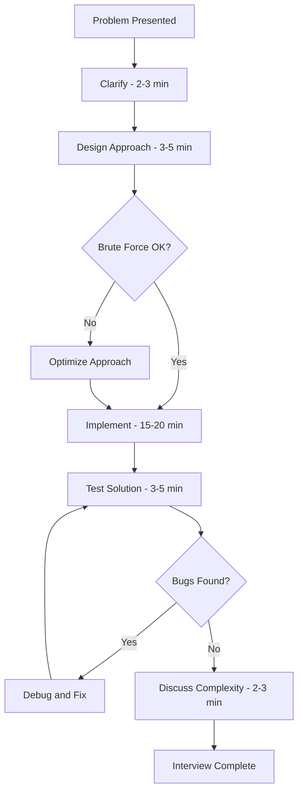
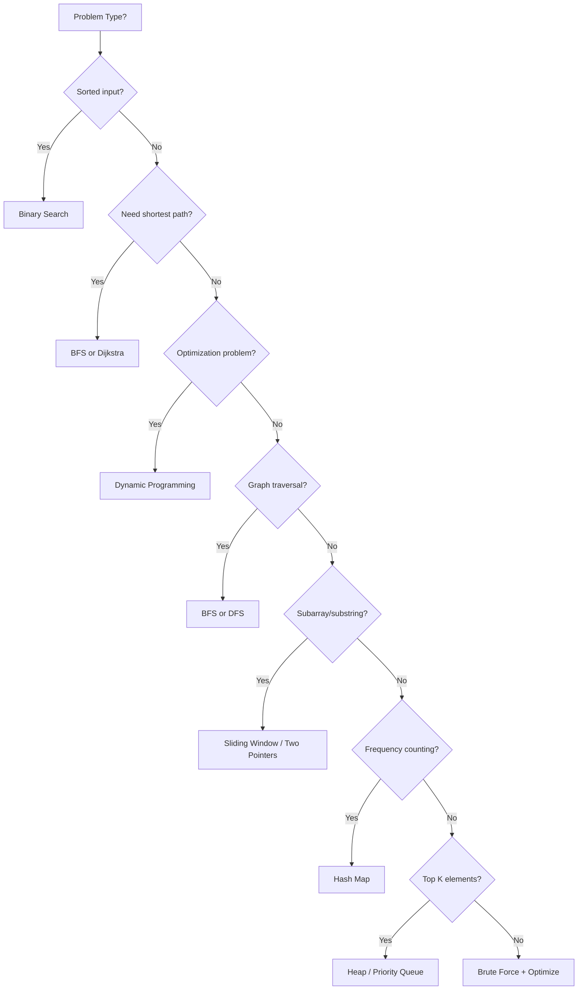
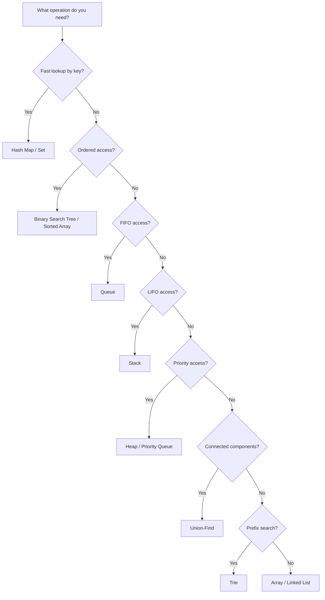

# 17 - Coding Rounds for Interviews

---

## 1. Introduction

### What are Coding Rounds?
Coding rounds are technical interview segments where candidates solve programming problems in real-time. They assess problem-solving ability, coding proficiency, algorithm knowledge, and communication skills. Coding rounds come in various formats: online assessments, whiteboard coding, live coding sessions, and take-home assignments.

### Why They Matter for Interviews
Coding rounds are the primary technical screening mechanism for:
- **Software engineering roles** at virtually all tech companies
- **Data science and ML roles** (with emphasis on algorithms and data manipulation)
- **DevOps and SRE roles** (scripting and automation problems)
- **Product management** at some companies (light coding assessments)
- **Internship selections** at FAANG and top-tier companies

A strong coding round performance can compensate for a weaker resume. A poor performance can eliminate otherwise qualified candidates.

### How They Impact Your Career
- Demonstrate practical coding ability beyond academic knowledge
- Show how you approach problems under pressure
- Reveal communication and collaboration skills
- Differentiate you from candidates with similar backgrounds
- Open doors to top-tier companies and higher compensation

---

## 2. Learning Roadmap

```mermaid
graph TD
    A[Coding Rounds] --> B[Foundations]
    A --> C[Problem Categories]
    A --> D[Soft Skills]
    A --> E[Test Formats]
    B --> B1[Data Structures]
    B --> B2[Algorithms]
    B --> B3[Language Proficiency]
    B --> B4[Complexity Analysis]
    C --> C1[Arrays & Strings]
    C --> C2[Linked Lists & Trees]
    C --> C3[Hash Maps & Sets]
    C --> C4[Graphs & BFS/DFS]
    C --> C5[Dynamic Programming]
    C --> C6[Sorting & Searching]
    D --> D1[Communication]
    D --> D2[Clarifying Questions]
    D --> D3[Thinking Aloud]
    D --> D4[Testing Approach]
    E --> E1[Online Assessment]
    E --> E2[Whiteboard]
    E --> E3[Live Coding]
    E --> E4[Take-Home]
```



### Timeline
| Phase | Duration | Focus |
|-------|----------|-------|
| Week 1-2 | Days 1-14 | Data structures and basic algorithms |
| Week 3-4 | Days 15-28 | Arrays, strings, hash maps, linked lists |
| Week 5-6 | Days 29-42 | Trees, graphs, BFS/DFS |
| Week 7-8 | Days 43-56 | Dynamic programming, greedy algorithms |
| Week 9-10 | Days 57-70 | Practice problems (Easy → Medium) |
| Week 11-12 | Days 71-84 | Mock coding interviews, communication skills |

---

## 3. Theory Notes

### 3.1 The Coding Interview Framework

**Step 1: Understand the Problem (2-3 minutes)**
- Listen carefully to the problem statement
- Ask clarifying questions about edge cases and constraints
- Confirm your understanding: "So I need to..."
- Identify input/output types and expected format

**Step 2: Design the Approach (3-5 minutes)**
- Start with the brute-force approach
- Discuss its time and space complexity
- Identify optimizations
- Choose the best approach
- Walk through an example

**Step 3: Write the Code (15-20 minutes)**
- Write clean, readable code
- Use meaningful variable names
- Handle edge cases
- Think aloud as you code
- Ask if you're on the right track

**Step 4: Test Your Solution (3-5 minutes)**
- Walk through test cases (normal, edge, corner cases)
- Trace through the code manually
- Identify and fix bugs
- Discuss potential improvements

**Step 5: Discuss Complexity (2-3 minutes)**
- State time complexity with justification
- State space complexity with justification
- Discuss possible optimizations

### 3.2 Common Problem Categories

#### Arrays & Strings
| Problem Type | Key Techniques | Example Problems |
|-------------|---------------|-----------------|
| Two pointers | Left/right pointers | Two Sum II, Container with Most Water |
| Sliding window | Fixed/dynamic window | Maximum Subarray Sum, Longest Substring |
| Sorting | Quick sort, merge sort | Sort Colors, Merge Intervals |
| Prefix sums | Cumulative sums | Range Sum Query, Subarray Sum Equals K |
| Kadane's algorithm | Dynamic programming | Maximum Subarray |

#### Linked Lists
| Problem Type | Key Techniques | Example Problems |
|-------------|---------------|-----------------|
| Traversal | Iterative/recursive | Reverse Linked List, Merge Two Lists |
| Fast/slow pointers | Cycle detection | Detect Cycle, Find Middle Node |
| Dummy nodes | Simplify edge cases | Add Two Numbers, Partition List |
| Reversal | In-place reversal | Reverse in k-Groups, Rotate List |

#### Trees
| Problem Type | Key Techniques | Example Problems |
|-------------|---------------|-----------------|
| Traversal | BFS (level), DFS (pre/in/post) | Binary Tree Traversal, Level Order |
| Construction | Recursive building | Construct from Traversals, Serialize |
| BST operations | Search, insert, delete | Validate BST, Kth Smallest Element |
| Depth/Height | Recursive DFS | Maximum Depth, Balanced Binary Tree |

#### Hash Maps & Sets
| Problem Type | Key Techniques | Example Problems |
|-------------|---------------|-----------------|
| Frequency counting | Map char to count | Valid Anagram, Group Anagrams |
| Two Sum pattern | Complement lookup | Two Sum, Four Sum |
| Subarray problems | Prefix sum + hash map | Subarray Sum Equals K, Continuous Subarray |

#### Graphs
| Problem Type | Key Techniques | Example Problems |
|-------------|---------------|-----------------|
| BFS | Level-by-level traversal | Number of Islands, Rotting Oranges |
| DFS | Deep exploration | Clone Graph, Course Schedule |
| Topological sort | Dependency ordering | Course Schedule II, Alien Dictionary |
| Shortest path | Dijkstra, BFS | Network Delay Time, Cheapest Flights |
| Union-Find | Connected components | Number of Provinces, Redundant Connection |

#### Dynamic Programming
| Problem Type | Key Techniques | Example Problems |
|-------------|---------------|-----------------|
| 1D DP | Single variable recurrence | Climbing Stairs, House Robber |
| 2D DP | Two variable recurrence | Unique Paths, Longest Common Subsequence |
| Knapsack | Include/exclude decisions | 0/1 Knapsack, Partition Equal Subset Sum |
| String DP | Character matching | Edit Distance, Longest Palindromic Subsequence |
| Interval DP | Merging intervals | Burst Balloons, Matrix Chain Multiplication |

### 3.3 Communication During Coding

**What Interviewers Want to Hear:**
1. Your understanding of the problem
2. Your thought process for choosing an approach
3. Why you're making specific coding decisions
4. How you handle edge cases
5. How you debug issues

**Communication Templates:**
- "Let me understand the problem first..."
- "The brute force approach would be... with O(n²) complexity."
- "I think we can optimize this using..."
- "Let me trace through this example..."
- "I'm going to handle the edge case where..."
- "Let me test this with a few cases..."

### 3.4 Testing Approaches

**Test Case Categories:**
1. **Normal case:** Standard input that works as expected
2. **Edge cases:** Minimum/maximum input sizes, empty inputs
3. **Corner cases:** Boundary values, special conditions
4. **Error cases:** Invalid inputs, impossible scenarios

**Manual Trace Process:**
1. Pick a small example
2. Trace through each line of code
3. Track variable values at each step
4. Verify the output matches expected

### 3.5 Complexity Analysis

| Complexity | Name | Example |
|-----------|------|---------|
| O(1) | Constant | Hash map lookup |
| O(log n) | Logarithmic | Binary search |
| O(n) | Linear | Single loop through array |
| O(n log n) | Linearithmic | Merge sort, quicksort |
| O(n²) | Quadratic | Nested loops |
| O(2ⁿ) | Exponential | Recursive Fibonacci |
| O(n!) | Factorial | Generate all permutations |

### 3.6 Interviewer Expectations

| Level | What They Expect |
|-------|-----------------|
| **Intern** | Basic data structures, simple algorithms, clean code |
| **Junior** | Solid fundamentals, reasonable optimization, good communication |
| **Mid-level** | Optimal solutions, design patterns, system thinking |
| **Senior** | Architecture decisions, trade-offs, mentoring ability |

---

## 4. Key Concepts

| Concept | Description | Interview Frequency |
|---------|------------|-------------------|
| Time Complexity | How runtime grows with input size | Very High |
| Space Complexity | How memory usage grows with input size | High |
| Brute Force | First, correct solution (not optimized) | Medium |
| Optimal Solution | Best known solution for the problem | High |
| Edge Cases | Unusual inputs that test boundary conditions | Very High |
| Code Cleanliness | Readable, well-structured code | High |
| Communication | Explaining your thought process | Very High |
| Testing | Verifying your solution with test cases | High |
| Optimization | Improving time/space complexity | Medium |
| Trade-offs | Discussing pros/cons of different approaches | High |

---

## 5. Frequently Asked Interview Questions

### Beginner Level

1. **Q: What should I do if I don't know how to solve a coding problem?**
   A: Start by clarifying the problem. Then discuss the brute-force approach. Explain why it's not optimal. Try to identify patterns from similar problems you've solved. Ask the interviewer for hints if needed — they want to see your thought process, not just the answer.

2. **Q: How important is communication during coding?**
   A: Extremely important. Many interviewers value communication as much as the solution itself. Think aloud, explain your choices, ask questions, and keep the interviewer informed. A perfect solution with no communication may score lower than a good solution with excellent communication.

3. **Q: Should I write pseudocode first or jump into coding?**
   A: Discuss the approach verbally first. If the approach is complex, brief pseudocode can help organize your thoughts. For simple problems, you can code directly while explaining. The key is that the interviewer understands your plan before you start coding.

4. **Q: What programming language should I use?**
   A: Use the language you're most comfortable with. Most interviewers don't care about the language — they care about problem-solving. However, some languages are better for certain problems (Python for string manipulation, Java for system design).

5. **Q: How do I handle edge cases?**
   A: After writing the solution, ask yourself: What if the input is empty? What if it has one element? What if all elements are the same? What if it's very large? Then add checks for these cases. Discussing edge cases shows thoroughness.

6. **Q: What if I make a mistake in my code?**
   A: Don't panic. Use debugging techniques: trace through the code, check variable values, identify the issue. Interviewers appreciate seeing how you handle mistakes. Say "Let me check this part" and walk through it.

7. **Q: How long should I spend on each problem?**
   A: In a typical 45-minute interview: 2-3 min understanding, 3-5 min designing, 15-20 min coding, 3-5 min testing, 2-3 min discussing complexity. Adjust based on problem difficulty.

8. **Q: Is it okay to use built-in functions?**
   A: Generally yes, for common operations (sorting, string methods, data structure operations). However, be able to explain what the built-in function does and its complexity. Some interviewers may ask you to implement it from scratch.

### Intermediate Level

9. **Q: How do I optimize from brute force?**
   A: Common optimization patterns: (1) Use a hash map to reduce lookup time from O(n) to O(1). (2) Use two pointers instead of nested loops. (3) Use sliding window for subarray/substring problems. (4) Use dynamic programming to avoid redundant calculations. (5) Use binary search when the search space is sorted or monotonic.

10. **Q: What are the most common coding interview mistakes?**
    A: (1) Not asking clarifying questions; (2) Jumping into code without a plan; (3) Not thinking aloud; (4) Ignoring edge cases; (5) Not testing the solution; (6) Writing unreadable code; (7) Not discussing complexity; (8) Giving up too quickly.

11. **Q: How do I prepare for dynamic programming problems?**
    A: Start with 1D DP (climbing stairs, house robber), then 2D DP (unique paths, LCS), then knapsack variants. Practice the pattern: identify subproblems, write recurrence relation, implement with memoization, optimize to tabulation.

12. **Q: What's the difference between DFS and BFS?**
    A: DFS (Depth-First Search) goes deep before backtracking — uses a stack (or recursion). Good for: finding paths, detecting cycles, topological sort. BFS (Breadth-First Search) visits level by level — uses a queue. Good for: shortest path, level-order operations, finding closest nodes.

13. **Q: How do I approach graph problems?**
    A: (1) Identify the graph type (directed/undirected, weighted/unweighted, cyclic/acyclic). (2) Choose the right representation (adjacency list vs. matrix). (3) Choose BFS or DFS based on the problem. (4) Consider special algorithms (Dijkstra, topological sort, union-find).

14. **Q: How do I handle coding problems that require string manipulation?**
    A: Key techniques: (1) Two pointers for palindromes. (2) Sliding window for substrings. (3) Hash map for character frequency. (4) Sorting for anagram problems. (5) StringBuilder for concatenation. (6) Regex for pattern matching.

### Advanced Level

15. **Q: How do I approach system design + coding hybrid questions?**
    A: Start with requirements and high-level design. Then implement key components. Discuss trade-offs. Consider scalability, error handling, and testing. Think about both the forest (architecture) and the trees (implementation details).

16. **Q: What are the most asked coding patterns?**
    A: (1) Two Pointers, (2) Sliding Window, (3) Fast/Slow Pointers, (4) Merge Intervals, (5) Cyclic Sort, (6) Tree Traversal (BFS/DFS), (7) Two Heaps, (8) Subsets, (9) Modified Binary Search, (10) Top K Elements, (11) K-way Merge, (12) Topological Sort.

17. **Q: How do I optimize space complexity?**
    A: (1) Use iterative approaches instead of recursive (eliminate stack). (2) Modify input in-place instead of creating copies. (3) Use bit manipulation for boolean arrays. (4) Stream processing instead of storing all data. (5) Use appropriate data structures (heap vs. sorted array).

18. **Q: How do I handle problems I've never seen before?**
    A: Break it down: (1) Understand what's being asked. (2) Think of similar problems you've solved. (3) Identify the underlying pattern. (4) Start with brute force. (5) Look for optimization opportunities. (6) Use the problem constraints to guide your approach.

### FAANG Level

19. **Q: How do Google coding interviews differ from Amazon's?**
    A: Google emphasizes algorithmic efficiency and clean code. They often ask medium-hard problems. Amazon focuses on practical problem-solving aligned with their Leadership Principles. They may ask about scalability and real-world considerations. Both value communication highly.

20. **Q: What makes a senior engineer stand out in coding rounds?**
    A: They discuss trade-offs, consider scalability, write production-quality code, handle errors gracefully, think about testing strategies, and communicate design decisions. They also demonstrate awareness of the broader system context, not just the immediate problem.

21. **Q: How do you approach a problem during a 45-minute interview?**
    A: (0-5 min) Understand and clarify. (5-10 min) Design approach, discuss alternatives. (10-30 min) Implement. (30-35 min) Test and debug. (35-40 min) Discuss complexity and optimizations. (40-45 min) Handle follow-up questions.

22. **Q: What follow-up questions are common?**
    A: (1) "Can you optimize this?" (2) "What if the input is very large?" (3) "How would you handle concurrent access?" (4) "What if the data doesn't fit in memory?" (5) "Can you make this real-time?"

23. **Q: How important is code quality in interviews?**
    A: Very. Code quality includes: meaningful variable names, consistent style, appropriate comments (for complex logic), proper indentation, handling edge cases, and DRY (Don't Repeat Yourself) principles. Clean code demonstrates professionalism.

24. **Q: How do you handle the pressure of a coding interview?**
    A: (1) Prepare thoroughly so you're confident. (2) Take a deep breath at the start. (3) Break the problem into smaller pieces. (4) Focus on making progress, not perfection. (5) If stuck, communicate and ask for hints. (6) Remember that interviewers want you to succeed.

25. **Q: What is the ideal way to end a coding interview?**
    A: (1) Confirm your solution works with all test cases. (2) State the time and space complexity. (3) Discuss potential improvements or optimizations. (4) Ask if there are any questions. (5) Thank the interviewer. End on a confident, professional note.

---

## 6. Hands-on Practice

### Exercise 1: Two Sum Problem
Given an array of integers and a target, find two numbers that add up to the target. Return their indices.

**Brute Force:** O(n²) — check every pair.
**Optimal:** O(n) — use hash map to store complement.

```python
def two_sum(nums, target):
    seen = {}
    for i, num in enumerate(nums):
        complement = target - num
        if complement in seen:
            return [seen[complement], i]
        seen[num] = i
    return []
```

### Exercise 2: Valid Parentheses
Given a string containing only '(', ')', '{', '}', '[', ']', determine if the input is valid.

```python
def is_valid(s):
    stack = []
    mapping = {')': '(', '}': '{', ']': '['}
    for char in s:
        if char in mapping:
            if not stack or stack[-1] != mapping[char]:
                return False
            stack.pop()
        else:
            stack.append(char)
    return len(stack) == 0
```

### Exercise 3: Maximum Subarray (Kadane's Algorithm)
Find the contiguous subarray with the largest sum.

```python
def max_subarray(nums):
    max_sum = current_sum = nums[0]
    for num in nums[1:]:
        current_sum = max(num, current_sum + num)
        max_sum = max(max_sum, current_sum)
    return max_sum
```

### Exercise 4: Reverse a Linked List
Reverse a singly linked list iteratively and recursively.

```python
def reverse_iterative(head):
    prev, current = None, head
    while current:
        next_node = current.next
        current.next = prev
        prev = current
        current = next_node
    return prev

def reverse_recursive(head):
    if not head or not head.next:
        return head
    new_head = reverse_recursive(head.next)
    head.next.next = head
    head.next = None
    return new_head
```

### Exercise 5: Binary Search
Search for a target in a sorted array.

```python
def binary_search(nums, target):
    left, right = 0, len(nums) - 1
    while left <= right:
        mid = (left + right) // 2
        if nums[mid] == target:
            return mid
        elif nums[mid] < target:
            left = mid + 1
        else:
            right = mid - 1
    return -1
```

### Exercise 6: BFS Level Order Traversal
Traverse a binary tree level by level.

```python
from collections import deque

def level_order(root):
    if not root:
        return []
    result = []
    queue = deque([root])
    while queue:
        level = []
        for _ in range(len(queue)):
            node = queue.popleft()
            level.append(node.val)
            if node.left:
                queue.append(node.left)
            if node.right:
                queue.append(node.right)
        result.append(level)
    return result
```

### Exercise 7: LRU Cache
Design and implement an LRU (Least Recently Used) cache.

```python
from collections import OrderedDict

class LRUCache:
    def __init__(self, capacity):
        self.cache = OrderedDict()
        self.capacity = capacity

    def get(self, key):
        if key not in self.cache:
            return -1
        self.cache.move_to_end(key)
        return self.cache[key]

    def put(self, key, value):
        if key in self.cache:
            self.cache.move_to_end(key)
        self.cache[key] = value
        if len(self.cache) > self.capacity:
            self.cache.popitem(last=False)
```

### Exercise 8: Merge Intervals
Merge all overlapping intervals.

```python
def merge_intervals(intervals):
    intervals.sort(key=lambda x: x[0])
    merged = [intervals[0]]
    for current in intervals[1:]:
        if current[0] <= merged[-1][1]:
            merged[-1][1] = max(merged[-1][1], current[1])
        else:
            merged.append(current)
    return merged
```

### Exercise 9: Climbing Stairs (Dynamic Programming)
You can climb 1 or 2 steps at a time. How many distinct ways to reach step n?

```python
def climb_stairs(n):
    if n <= 2:
        return n
    a, b = 1, 2
    for _ in range(3, n + 1):
        a, b = b, a + b
    return b
```

### Exercise 10: Find Duplicate Number
Given an array of n+1 integers where each is between 1 and n, find the duplicate.

```python
def find_duplicate(nums):
    slow = fast = nums[0]
    while True:
        slow = nums[slow]
        fast = nums[nums[fast]]
        if slow == fast:
            break
    slow = nums[0]
    while slow != fast:
        slow = nums[slow]
        fast = nums[fast]
    return slow
```

---

## 7. Real FAANG Interview Questions

| Company | Problem | Category | Difficulty |
|---------|---------|----------|------------|
| Google | Merge K Sorted Lists | Heap/Divide & Conquer | Hard |
| Google | Word Ladder | BFS/Graph | Medium |
| Google | Longest Increasing Subsequence | DP | Medium |
| Meta | Valid Palindrome II | Two Pointers | Easy |
| Meta | Binary Tree Right Side View | BFS/DFS | Medium |
| Meta | Design Hit Counter | Design/Queue | Medium |
| Amazon | LRU Cache | Design/Hash Map | Medium |
| Amazon | Number of Islands | BFS/DFS/Union-Find | Medium |
| Amazon | Min Stack | Stack/Design | Easy |
| Apple | Reverse Linked List | Linked List | Easy |
| Apple | Lowest Common Ancestor | Binary Tree | Medium |
| Apple | Implement Trie | Trie/Design | Medium |
| Microsoft | Two Sum | Hash Map | Easy |
| Microsoft | Course Schedule | Topological Sort | Medium |
| Microsoft | Serialize/Deserialize Binary Tree | Tree/Design | Hard |
| Netflix | Data Stream Median | Heap | Hard |

---

## 8. Common Mistakes

| Mistake | Description | How to Avoid |
|---------|------------|--------------|
| Not asking clarifying questions | Starting to code before understanding the problem | Always confirm: input format, constraints, edge cases |
| Jumping into code without a plan | No design discussion | Spend 3-5 min discussing approach first |
| Not thinking aloud | Silent coding | Verbalize every decision you make |
| Ignoring edge cases | Only testing normal inputs | Systematically check: empty, single element, large input |
| Not testing the solution | Writing code and declaring done | Always trace through test cases |
| Writing messy code | Poor variable names, no structure | Use meaningful names, consistent formatting |
| Not discussing complexity | Forgetting to analyze O(n) | Always state time and space complexity |
| Giving up too quickly | Panicking when stuck | Communicate, try brute force, ask for hints |
| Optimizing prematurely | Jumping to optimal before understanding | Start with brute force, then optimize |
| Not handling errors | Code crashes on invalid input | Add input validation and error handling |

---

## 9. Best Practices

1. **Practice daily** — Consistent practice (1-2 problems/day) beats cramming.
2. **Master the patterns** — Learn the 15-20 core patterns, not individual problems.
3. **Think before coding** — Spend time understanding and designing before writing code.
4. **Communicate constantly** — Keep the interviewer informed of your thought process.
5. **Write clean code** — Use meaningful names, proper indentation, and structure.
6. **Test systematically** — Start with the example, then edge cases, then corner cases.
7. **Know your language** — Be proficient in the language you'll use in the interview.
8. **Review your solutions** — After solving, think about optimizations and alternative approaches.
9. **Practice under pressure** — Use a timer to simulate interview conditions.
10. **Learn from mistakes** — When stuck, review the solution and understand the pattern.
11. **Do mock interviews** — Practice with friends or use platforms like Pramp.
12. **Study time/space complexity** — Be able to analyze any algorithm quickly.

---

## 10. Cheat Sheet

```
+---------------------------------------------------------------+
|              CODING ROUNDS CHEAT SHEET                         |
+---------------------------------------------------------------+
|                                                               |
|  INTERVIEW FRAMEWORK (5 Steps)                                |
|  1. Understand (2-3 min) - Clarify, confirm                  |
|  2. Design (3-5 min) - Approach, complexity                  |
|  3. Code (15-20 min) - Clean, readable, think aloud          |
|  4. Test (3-5 min) - Trace through cases                     |
|  5. Analyze (2-3 min) - Time/space complexity                |
|                                                               |
|  COMMON PATTERNS                                              |
|  Two Pointers      - Sorted arrays, palindromes              |
|  Sliding Window    - Substrings, subarrays                   |
|  Fast/Slow Ptrs    - Linked list cycles                      |
|  Merge Intervals   - Overlapping ranges                      |
|  Binary Search     - Sorted/monotonic search space           |
|  BFS               - Shortest path, level-order              |
|  DFS               - Path finding, cycles, connected comp.   |
|  Dynamic Prog.     - Optimization, counting problems         |
|  Hash Map          - Frequency, two sum, caching             |
|  Heap/Priority Q   - Top K, merge sorted, median             |
|  Trie              - Prefix search, autocomplete             |
|  Union-Find        - Connected components                    |
|                                                               |
|  COMPLEXITY REFERENCE                                         |
|  O(1) - Hash lookup, array access                           |
|  O(log n) - Binary search                                    |
|  O(n) - Single loop                                         |
|  O(n log n) - Merge/quick sort                              |
|  O(n²) - Nested loops                                       |
|  O(2ⁿ) - Recursive (no memoization)                         |
|                                                               |
|  COMMUNICATION TEMPLATES                                      |
|  "Let me understand the problem first..."                    |
|  "The brute force approach would be..."                      |
|  "I think we can optimize using..."                          |
|  "Let me trace through this example..."                      |
|  "The time complexity is O(...) because..."                  |
|                                                               |
+---------------------------------------------------------------+
```

---

## 11. Flash Cards

| # | Question | Answer |
|---|----------|--------|
| 1 | What is time complexity? | How runtime grows with input size |
| 2 | What is space complexity? | How memory usage grows with input size |
| 3 | What is the time complexity of binary search? | O(log n) |
| 4 | What data structure is used for BFS? | Queue |
| 5 | What data structure is used for DFS? | Stack (or recursion) |
| 6 | What is Kadane's algorithm for? | Maximum subarray sum in O(n) |
| 7 | What is the Two Sum pattern? | Use hash map to find complement in O(n) |
| 8 | What is the sliding window technique? | Maintain a window over a subarray/substring |
| 9 | When do you use a heap? | When you need top K elements or priority access |
| 10 | What is topological sort used for? | Ordering dependencies in a DAG |
| 11 | What is the difference between DFS and BFS? | DFS goes deep (stack), BFS goes wide (queue) |
| 12 | What is memoization? | Caching results of recursive calls |
| 13 | What is dynamic programming? | Breaking problems into overlapping subproblems |
| 14 | What is a trie? | A tree for prefix-based string searching |
| 15 | What is union-find used for? | Tracking connected components |
| 16 | What is the two-pointer technique? | Using left/right pointers to traverse data |
| 17 | What is merge sort's time complexity? | O(n log n) |
| 18 | What is quicksort's average time complexity? | O(n log n) |
| 19 | What should you do first in a coding interview? | Clarify the problem and confirm understanding |
| 20 | How do you handle being stuck? | Communicate, try brute force, ask for hints |

---

## 12. Mind Map

```
Coding Rounds
│
├── Problem Categories
│   ├── Arrays & Strings
│   │   ├── Two Pointers
│   │   ├── Sliding Window
│   │   ├── Sorting
│   │   └── Prefix Sums
│   ├── Linked Lists
│   │   ├── Traversal
│   │   ├── Fast/Slow Pointers
│   │   └── Reversal
│   ├── Trees
│   │   ├── Traversal (BFS/DFS)
│   │   ├── BST Operations
│   │   └── Construction
│   ├── Graphs
│   │   ├── BFS/DFS
│   │   ├── Topological Sort
│   │   ├── Shortest Path
│   │   └── Union-Find
│   ├── Dynamic Programming
│   │   ├── 1D DP
│   │   ├── 2D DP
│   │   ├── Knapsack
│   │   └── String DP
│   └── Design
│       ├── LRU Cache
│       ├── Data Structures
│       └── API Design
│
├── Interview Skills
│   ├── Clarifying Questions
│   ├── Approach Design
│   ├── Communication
│   ├── Testing
│   └── Complexity Analysis
│
└── Test Formats
    ├── Online Assessment
    ├── Whiteboard
    ├── Live Coding
    └── Take-Home
```

---

## 13. Mermaid Diagrams

### Diagram 1: Coding Interview Flow


### Diagram 2: Algorithm Selection Decision


### Diagram 3: Common Data Structure Selection


---

## 14. Code Examples

### Example 1: Complete Interview Solution Template
```python
class InterviewSolution:
    """
    Template for structured coding interview solution.
    Follow this structure for every problem.
    """

    def solve(self, nums, target):
        """
        Step 1: Understand
        - Input: List[int], int
        - Output: List[int] (indices of two numbers that add to target)
        - Constraints: Exactly one solution exists, same element can't be used twice

        Step 2: Design
        - Brute Force: O(n²) - check every pair
        - Optimized: O(n) - hash map to find complement

        Step 3: Implement
        """
        # Hash map to store value -> index
        seen = {}

        for i, num in enumerate(nums):
            complement = target - num

            # Check if complement exists
            if complement in seen:
                return [seen[complement], i]

            # Store current number
            seen[num] = i

        # No solution found (problem guarantees exactly one solution)
        return []

    def test_solution(self):
        """Step 4: Test"""
        # Normal case
        assert self.solve([2, 7, 11, 15], 9) == [0, 1]

        # Different indices
        assert self.solve([3, 2, 4], 6) == [1, 2]

        # Same values
        assert self.solve([3, 3], 6) == [0, 1]

        # Negative numbers
        assert self.solve([-1, -2, -3, -4, -5], -8) == [2, 4]

        print("All tests passed!")

    def analyze_complexity(self):
        """
        Step 5: Analyze
        - Time: O(n) - single pass through array
        - Space: O(n) - hash map stores at most n elements
        """
        pass

# Usage
solution = InterviewSolution()
solution.test_solution()
```

### Example 2: Problem Pattern Matcher
```python
class PatternMatcher:
    PATTERNS = {
        "two_sum": {
            "keywords": ["two numbers", "add to", "target", "pair", "indices"],
            "technique": "Hash Map",
            "complexity": "O(n) time, O(n) space",
            "template": "Use hash map to store seen values and check for complement"
        },
        "sliding_window": {
            "keywords": ["subarray", "substring", "contiguous", "maximum", "minimum", "window"],
            "technique": "Sliding Window",
            "complexity": "O(n) time, O(1) or O(k) space",
            "template": "Maintain left and right pointers, expand/contract window"
        },
        "binary_search": {
            "keywords": ["sorted", "search", "find", "minimum", "maximum"],
            "technique": "Binary Search",
            "complexity": "O(log n) time, O(1) space",
            "template": "Use left, right, mid pointers; narrow search space"
        },
        "bfs": {
            "keywords": ["shortest path", "level", "minimum distance", "connected"],
            "technique": "BFS",
            "complexity": "O(V+E) time, O(V) space",
            "template": "Use queue, visit level by level"
        },
        "dfs": {
            "keywords": ["path", "all paths", "connected", "cycle", "traverse"],
            "technique": "DFS",
            "complexity": "O(V+E) time, O(V) space",
            "template": "Use recursion or stack, go deep before backtracking"
        },
        "dynamic_programming": {
            "keywords": ["count ways", "minimum cost", "maximum", "optimal", "subsequence"],
            "technique": "Dynamic Programming",
            "complexity": "O(n*m) time, O(n*m) space (varies)",
            "template": "Define subproblems, write recurrence, memoize/tabulate"
        }
    }

    @classmethod
    def identify_pattern(cls, problem_description):
        description_lower = problem_description.lower()
        matches = []
        for pattern, info in cls.PATTERNS.items():
            keyword_matches = [k for k in info["keywords"] if k in description_lower]
            if keyword_matches:
                matches.append({
                    "pattern": pattern,
                    "confidence": len(keyword_matches) / len(info["keywords"]),
                    "technique": info["technique"],
                    "complexity": info["complexity"],
                    "template": info["template"]
                })
        matches.sort(key=lambda x: x["confidence"], reverse=True)
        return matches[:3]

matcher = PatternMatcher()
results = matcher.identify_pattern("Find the maximum sum of a contiguous subarray")
for r in results:
    print(f"{r['pattern']}: {r['technique']} ({r['complexity']})")
```

---

## 15. Projects

### Mini Project 1: Coding Problem Tracker
Build a CLI app to track coding problems you've solved, categorize by pattern, and track difficulty progress.

### Mini Project 2: Algorithm Visualizer
Create a web tool that visualizes common algorithms (sorting, searching, BFS, DFS) step by step.

### Mini Project 3: Complexity Analyzer
Build a tool that analyzes Python functions and estimates their time/space complexity.

### Intermediate Project 1: Mock Interview Platform
Develop a platform with timed coding problems, automated test cases, and performance tracking.

### Intermediate Project 2: Pattern Library
Create a reference library of coding patterns with templates, examples, and practice problems.

### Advanced Project 1: AI Code Reviewer
Build an AI-powered tool that reviews code quality, suggests optimizations, and identifies bugs.

### Advanced Project 2: Interview Prep Dashboard
Create a comprehensive dashboard tracking progress across all coding patterns, with spaced repetition.

### Project Ideas (10 total)
1. LeetCode problem solver with explanations
2. Code complexity calculator
3. Algorithm comparison tool (run and compare different solutions)
4. Interview question flashcard system
5. Coding challenge daily reminder bot
6. Code snippet organizer for interview prep
7. Test case generator for coding problems
8. Performance benchmarking tool
9. Code review practice tool
10. Mock interview scheduling platform

---

## 16. Resources

### Practice Websites
| Website | URL | Focus |
|---------|-----|-------|
| LeetCode | leetcode.com | Coding problems (3000+) |
| HackerRank | hackerrank.com | Coding challenges by category |
| CodeSignal | codesignal.com | Interview practice |
| Pramp | pramp.com | Free mock interviews |
| NeetCode | neetcode.io | Curated problem lists |

### Books
| Book | Author | Level |
|------|--------|-------|
| *Cracking the Coding Interview* | Gayle Laakmann | All levels |
| *Elements of Programming Interviews* | Adnan Aziz | Intermediate-Advanced |
| *Algorithm Design Manual* | Steven Skiena | Intermediate |
| *Introduction to Algorithms (CLRS)* | Cormen et al. | Reference |
| *Grokking Algorithms* | Aditya Bhargava | Beginner |

### Documentation
- LeetCode Problem List (Blind 75, NeetCode 150)
- Big-O Cheat Sheet (bigocheatsheet.com)
- GeeksforGeeks Algorithm Portal
- Visualgo.net (Algorithm Visualization)
- USACO Guide (Competitive Programming)

### YouTube Channels
| Channel | Focus |
|---------|-------|
| NeetCode | Problem explanations and patterns |
| take U forward (Striver) | DSA concepts and problems |
| Tech With Tim | Python coding interviews |
| Kevin Naughton Jr. | LeetCode problem solutions |
| Back To Back SWE | System design and coding |

### Blogs
- LeetCode Discuss (Problem Solutions)
- GeeksforGeeks Articles
- Medium (Interview Experiences)
- Dev.to (Coding Tips)
- HackerNoon (Technical Articles)

### Certifications
- HackerRank Problem Solving (Basic/Intermediate/Advanced)
- CodeSignal Certified Developer
- Google Certified Professional (Cloud-related)
- AWS Certified Developer (for cloud-focused roles)
- Meta Front-End/Back-End Developer Certificate

---

## 17. Checklist

- [ ] I know the 5-step coding interview framework
- [ ] I can solve array/string problems with two pointers
- [ ] I can solve sliding window problems
- [ ] I can implement binary search (standard and modified)
- [ ] I can traverse trees using BFS and DFS
- [ ] I can detect cycles in linked lists
- [ ] I can solve graph problems (BFS, DFS, topological sort)
- [ ] I can solve basic dynamic programming problems
- [ ] I can analyze time and space complexity
- [ ] I communicate my thought process during coding
- [ ] I ask clarifying questions before starting
- [ ] I test my solutions with edge cases
- [ ] I write clean, readable code
- [ ] I can implement LRU Cache and similar design problems
- [ ] I can handle medium-difficulty problems within 30 minutes
- [ ] I have completed at least 100 coding problems
- [ ] I have done at least 5 mock interviews
- [ ] I am comfortable with at least one programming language
- [ ] I know the 15 core coding patterns
- [ ] I feel confident about coding rounds

---

## 18. Revision Notes

### Key Patterns to Master
1. Two Pointers
2. Sliding Window
3. Fast/Slow Pointers
4. Merge Intervals
5. Cyclic Sort
6. In-place Reversal of Linked List
7. Tree BFS (Level Order)
8. Tree DFS (Pre/In/Post)
9. Two Heaps
10. Subsets/Permutations
11. Modified Binary Search
12. Top K Elements
13. K-way Merge
14. Topological Sort
15. Dynamic Programming (1D, 2D, Knapsack)

### One-Day Revision Plan
| Time | Activity |
|------|----------|
| Morning (2 hrs) | Review 5 core patterns with examples |
| Mid-morning (1 hr) | Solve 3 Easy problems |
| Afternoon (2 hrs) | Solve 2 Medium problems |
| Late afternoon (1 hr) | Review complexity analysis |
| Evening (2 hrs) | Mock interview (1 problem, 45 min) |
| Night (30 min) | Review flash cards and cheat sheet |

### One-Week Revision Plan
| Day | Focus |
|-----|-------|
| Monday | Arrays + Two Pointers + Sliding Window |
| Tuesday | Linked Lists + Fast/Slow Pointers |
| Wednesday | Trees (BFS/DFS) |
| Thursday | Graphs (BFS, DFS, Topological Sort) |
| Friday | Dynamic Programming (1D + 2D) |
| Saturday | Design problems (LRU Cache, etc.) |
| Sunday | Mock interview + review weak areas |

---

## 19. Mock Interview Questions

### Round 1: Easy (15 minutes)
1. Two Sum (LeetCode #1)
2. Valid Parentheses (LeetCode #20)
3. Merge Two Sorted Lists (LeetCode #21)

### Round 2: Medium (25 minutes)
1. Longest Substring Without Repeating Characters (LeetCode #3)
2. Number of Islands (LeetCode #200)
3. Product of Array Except Self (LeetCode #238)

### Round 3: Hard (35 minutes)
1. Merge K Sorted Lists (LeetCode #23)
2. Word Break II (LeetCode #140)
3. Alien Dictionary (LeetCode #269)

### Round 4: Design + Code (45 minutes)
1. Design an LRU Cache
2. Design a Rate Limiter
3. Design a Parking Lot System

---

## 20. Difficulty Rating

| Skill | Difficulty (1-5) | Interview Frequency | Priority |
|-------|-------------------|--------------------|----|
| Array Basics | 1 | Very High | Must Know |
| String Manipulation | 2 | Very High | Must Know |
| Two Pointers | 2 | High | Must Know |
| Sliding Window | 3 | High | Should Know |
| Hash Map Usage | 2 | Very High | Must Know |
| Binary Search | 2 | High | Must Know |
| Linked List | 2 | High | Should Know |
| Stack/Queue | 2 | High | Should Know |
| Tree Traversal | 3 | High | Must Know |
| BST Operations | 3 | Medium | Should Know |
| Graph BFS/DFS | 3 | High | Should Know |
| Dynamic Programming | 4 | High | Should Know |
| Heap/Priority Queue | 3 | Medium | Should Know |
| Trie | 4 | Medium | Nice to Know |
| Union-Find | 4 | Low | Nice to Know |
| Complexity Analysis | 3 | Very High | Must Know |
| Communication | 3 | Very High | Must Know |

---

## 21. Summary

Coding rounds are the most critical technical assessment in software engineering interviews. Success requires a combination of algorithm knowledge, coding proficiency, problem-solving strategy, and communication skills.

**Key Takeaways:**
- Master the 5-step interview framework (Understand, Design, Code, Test, Analyze)
- Learn the 15 core patterns and recognize them in problems
- Practice consistently (1-2 problems daily)
- Communicate your thought process throughout
- Write clean, readable code
- Test your solutions with edge cases
- Analyze time and space complexity for every solution
- Do mock interviews to simulate real conditions

**Interview Success Formula:**
Coding Round Success = Patterns + Practice + Communication + Clean Code

**Next Steps:**
1. Master the core data structures and algorithms
2. Learn the 15 coding patterns with examples
3. Solve 100+ problems (Blind 75 / NeetCode 150)
4. Practice under timed conditions
5. Do at least 10 mock interviews
6. Review and analyze your solutions
7. Focus on your weakest areas

---

*Last Updated: July 2026*
*Total Sections: 21*
*Estimated Study Time: 12 weeks (1-2 hours daily)*
