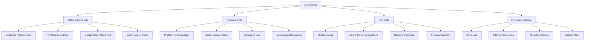
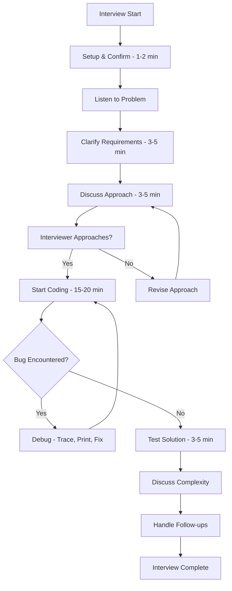
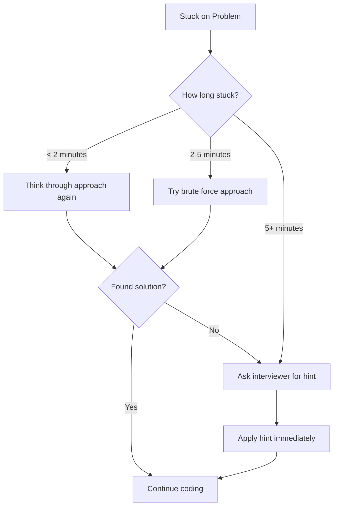

# 18 - Live Coding for Interviews

---

## 1. Introduction

### What is Live Coding?
Live coding is a real-time coding session where you write, explain, and debug code while being observed by an interviewer. It simulates actual work conditions where engineers write code, discuss approaches, and collaborate under time constraints. Unlike take-home assignments, live coding tests your ability to perform under pressure with immediate feedback.

### Why It Matters for Interviews
Live coding has become the dominant interview format because:
- It reveals how you think, not just what you know
- It tests communication alongside technical skills
- It shows how you handle pressure and unexpected challenges
- It simulates real work environments (pair programming, code reviews)
- It provides a more accurate assessment than written tests

Companies like Google, Amazon, Meta, and virtually all tech companies use some form of live coding. Remote live coding has become standard post-2020.

### How It Impacts Your Career
- Demonstrates real-time problem-solving ability
- Shows how you collaborate with team members
- Reveals your communication and teaching skills
- Tests your ability to handle feedback gracefully
- Differentiates you from candidates who only practice offline

---

## 2. Learning Roadmap



### Timeline
| Phase | Duration | Focus |
|-------|----------|-------|
| Week 1 | Days 1-3 | Platform familiarization |
| Week 1 | Days 4-7 | Thinking aloud practice |
| Week 2 | Days 8-10 | Live debugging techniques |
| Week 2 | Days 11-14 | Timed coding sessions |
| Week 3 | Days 15-17 | Mock live coding with friends |
| Week 3 | Days 18-21 | Platform-specific practice |
| Week 4 | Days 22-28 | Full mock interviews |

---

## 3. Theory Notes

### 3.1 Live Coding Platforms

| Platform | Features | Companies Using |
|----------|---------|----------------|
| **CoderPad** | Collaborative IDE, supports 30+ languages, runs code | Google, Airbnb, Stripe |
| **HackerRank** | Built-in problems, code editor, video | Amazon, Facebook, Apple |
| **CodeSignal** | Timed assessments, auto-grading | Uber, Dropbox, Netflix |
| **CodeSandbox** | Full IDE, web development focus | Front-end roles |
| **VS Code Live Share** | Real-time collaboration in VS Code | Microsoft, internal tools |
| **Google Docs** | For pseudocode and discussion | Some consulting firms |
| **Replit** | Collaborative coding environment | Startup interviews |

### 3.2 The Live Coding Protocol

**Phase 1: Setup (1-2 minutes)**
- Test your environment (audio, video, screen share)
- Confirm the interviewer can see your screen
- Ask which platform/language they prefer
- Do a quick test: "Can you see my screen? Let me type something."

**Phase 2: Problem Understanding (3-5 minutes)**
- Listen to the problem carefully
- Take notes on key requirements
- Ask clarifying questions:
  - "What's the expected input format?"
  - "Are there any constraints on the input size?"
  - "What should I return if no solution exists?"
  - "Can I assume the input is valid?"
- Restate the problem to confirm understanding

**Phase 3: Approach Discussion (3-5 minutes)**
- Start with brute force
- Discuss time/space complexity
- Identify optimizations
- Get interviewer's buy-in: "Does this approach sound good?"

**Phase 4: Coding (15-20 minutes)**
- Write code while thinking aloud
- Explain each section as you write
- Handle edge cases as you go
- Keep the code organized

**Phase 5: Testing (3-5 minutes)**
- Walk through test cases
- Check edge cases
- Fix any bugs found
- Verify output matches expected

**Phase 6: Discussion (3-5 minutes)**
- Summarize what you built
- Discuss complexity
- Mention potential improvements
- Handle follow-up questions

### 3.3 Thinking Aloud Techniques

**What to say while coding:**

| While Writing | Example |
|--------------|---------|
| Explaining purpose | "I'm creating a hash map to store the values we've seen so far" |
| Describing logic | "For each element, I'll check if the complement exists in our map" |
| Handling complexity | "This is O(n) because we traverse the array once" |
| Edge case handling | "I should handle the case where the array is empty" |
| Decision-making | "I'm using a dictionary instead of a list because lookup is O(1)" |

**What NOT to say:**
- "Um... let me think..." (silence is ok, but fill it with purpose)
- "I don't know..." (instead: "Let me think about this differently")
- "This is probably wrong but..." (stay confident even when uncertain)

### 3.4 Live Debugging Strategies

**When you encounter a bug:**
1. **Stay calm** — Bugs are normal. Interviewers expect them.
2. **Read the error message** — It usually tells you exactly what's wrong.
3. **Trace through the code** — Use a small example and follow the logic.
4. **Check the obvious first** — Typos, off-by-one errors, wrong variable names.
5. **Use print statements** — Add debugging output to see intermediate values.
6. **Explain what you expect** — "I expect this variable to be X at this point."
7. **Verify assumptions** — Is the data what you think it is?

**Communication during debugging:**
- "I'm getting an index out of bounds error. Let me check my loop boundaries."
- "The output isn't what I expected. Let me trace through with a simple example."
- "I think there's an issue with my base case. Let me check."

### 3.5 Screen Sharing Best Practices

**Do:**
- Share only the relevant window (not your entire desktop)
- Use a clean desktop with no personal items visible
- Ensure your code editor has a good font size (14-16pt)
- Use a light or neutral theme for readability
- Close unnecessary tabs and applications

**Don't:**
- Share your entire screen (privacy risk)
- Have notifications pop up during the session
- Use tiny font that the interviewer can't read
- Have music or background noise
- Keep phone on loud

### 3.6 Handling Pressure

**Techniques to stay calm:**
1. **Deep breathing** — 3 slow breaths before starting
2. **Positive self-talk** — "I've prepared for this. I can do this."
3. **Break it down** — Focus on one step at a time
4. **Embrace the pause** — It's ok to think for 10-15 seconds
5. **Remember the goal** — Show your thought process, not perfection
6. **Accept mistakes** — They happen; how you handle them matters more

### 3.7 Common Live Coding Scenarios

| Scenario | How to Handle |
|----------|--------------|
| **You don't understand the problem** | Ask clarifying questions until you do |
| **You're stuck on an approach** | Discuss brute force, then ask for hints |
| **Your code has a bug** | Stay calm, trace through, use print statements |
| **Time is running out** | Focus on core functionality, skip optimizations |
| **Interviewer gives a hint** | Thank them, apply the hint immediately |
| **You finish early** | Discuss optimizations, test edge cases, handle follow-ups |
| **The platform has issues** | Stay calm, suggest alternatives (Google Docs, email) |

---

## 4. Key Concepts

| Concept | Description | Importance |
|---------|------------|-----------|
| Thinking Aloud | Verbalizing your thought process | Very High |
| Clarifying Questions | Asking about requirements before coding | Very High |
| Screen Sharing | Properly sharing your development environment | High |
| Live Debugging | Finding and fixing bugs in real-time | High |
| Time Management | Allocating time for each phase | High |
| Platform Familiarity | Being comfortable with the coding platform | High |
| Code Readability | Writing clean code under observation | High |
| Handling Pressure | Staying calm and focused | Very High |
| Communication | Keeping the interviewer informed | Very High |
| Testing | Verifying your solution live | High |

---

## 5. Frequently Asked Interview Questions

### Beginner Level

1. **Q: What platform will the live coding interview be on?**
   A: Common platforms include CoderPad, HackerRank, CodeSignal, and VS Code Live Share. Ask the recruiter beforehand which platform will be used so you can practice on it.

2. **Q: Do I need to set up anything before the interview?**
   A: Test your internet connection, microphone, and camera. Install any required extensions. Practice screen sharing. Ensure your code editor has appropriate font size. Have a backup plan (phone hotspot, alternative editor).

3. **Q: Should I write pseudocode first or jump into coding?**
   A: Briefly discuss your approach verbally first. For complex problems, quick pseudocode can help organize your thoughts. The key is that the interviewer understands your plan before you start coding.

4. **Q: What if the platform crashes during the interview?**
   A: Stay calm. Suggest alternatives: "It seems the platform is having issues. Would you like me to continue in a Google Doc or my local IDE while we troubleshoot?" Have your local environment ready as backup.

5. **Q: How do I share my screen effectively?**
   A: Share only the relevant application window (not your entire desktop). Use a font size of at least 14pt. Close unnecessary tabs. Ensure the interviewer confirms they can see your screen before starting.

6. **Q: What language should I use for live coding?**
   A: Use the language you're most comfortable with and that the company uses. Python is popular for its readability. JavaScript for web roles. Java/C++ for systems roles. Ask the interviewer if they have a preference.

7. **Q: How long is a typical live coding interview?**
   A: Usually 45-60 minutes: 5 min intro/setup, 5 min problem understanding, 5 min approach discussion, 20-25 min coding, 5-10 min testing/discussion. Some companies have shorter (30 min) or longer (90 min) formats.

8. **Q: Should I talk the entire time?**
   A: Not the entire time, but most of it. Explain your thinking while coding. It's ok to have brief pauses for focused thinking, but explain what you're thinking about. Silence can make the interviewer uncomfortable.

### Intermediate Level

9. **Q: How do I handle it when the interviewer gives me a hint?**
   A: Thank them, acknowledge the hint, and immediately apply it. Don't resist hints — interviewers give them to help you progress. Say "That's a great point, let me incorporate that" and continue.

10. **Q: What if I realize my approach is wrong halfway through coding?**
    A: Acknowledge it honestly: "I realize this approach won't work for [reason]. Let me reconsider." Discuss the issue briefly, propose a new approach, and start fresh. Interviewers appreciate self-correction over stubborn persistence.

11. **Q: How do I handle multiple parts to a coding question?**
    A: Clarify which part to start with. Start with the core functionality. If you finish early, ask "Would you like me to implement the additional features?" Prioritize completeness of the main feature over partial implementation of everything.

12. **Q: What should I do if I finish early?**
    A: (1) Test edge cases. (2) Discuss optimizations. (3) Add error handling. (4) Refactor for readability. (5) Ask about follow-up questions. (6) Discuss how you'd extend the solution.

13. **Q: How do I handle a question I've never seen before?**
    A: Break it down: Identify what's being asked. Think of similar problems you know. Start with brute force. Look for patterns. If truly stuck, say "I'm going to think about this for a moment" and take 30 seconds to collect your thoughts.

14. **Q: What if the interviewer seems unimpressed?**
    A: Don't try to read too much into their expression. Many interviewers are neutral by nature. Focus on doing your best. Continue communicating clearly. Sometimes a neutral expression means they're just listening carefully.

### Advanced Level

15. **Q: How do I handle a pair programming live coding interview?**
    A: Treat it as a collaboration. Discuss approach together. Share the keyboard when appropriate. Acknowledge their suggestions. Ask for their input: "What do you think about this approach?" Be a good partner, not just a coder.

16. **Q: How do I optimize for speed without sacrificing quality?**
    A: Practice common patterns so you recognize them instantly. Use language-specific shortcuts (Python list comprehensions, Java streams). Skip minor optimizations and focus on the core algorithm. Don't over-engineer.

17. **Q: What if I need to use a library or function I can't remember the syntax for?**
    A: Say "I'll use a [data structure] here — let me recall the exact syntax." Take a moment to think. If you can't remember, implement a simpler version: "I'll implement a basic version of this since I can't recall the exact library call."

18. **Q: How do I handle time pressure when the interviewer says "we have 10 minutes left"?**
    A: Prioritize: (1) Ensure core functionality works. (2) Add basic edge case handling. (3) State what you'd do with more time. (4) Don't rush and introduce bugs. Better to have clean, working core code than rushed, buggy complete code.

### FAANG Level

19. **Q: How do Google's live coding interviews differ from Amazon's?**
    A: Google focuses on algorithmic problem-solving with emphasis on optimal solutions. They may ask follow-up questions to test depth. Amazon emphasizes practical problem-solving and may ask about scalability. Both value communication equally.

20. **Q: What's the key difference between a good and excellent live coding performance?**
    A: Good: Solves the problem with clean code. Excellent: Solves the problem, communicates clearly, handles edge cases, discusses trade-offs, considers scalability, and remains composed under pressure. The difference is in the soft skills and depth of thinking.

21. **Q: How do you approach a live coding problem you've solved before?**
    A: Don't reveal you've seen it. Solve it as if it's new, but use your knowledge to be thorough. Discuss edge cases, optimizations, and design decisions that a first-time solver might miss. This demonstrates depth, not just memorization.

22. **Q: How important is code readability in live coding vs. written code?**
    A: Even more important in live coding because the interviewer is reading it in real-time. Use meaningful names, consistent structure, and comments for complex logic. Poor readability makes it harder for the interviewer to follow your thinking.

23. **Q: What follow-up questions are common in live coding?**
    A: (1) "Can you optimize this further?" (2) "How would you handle concurrent access?" (3) "What if the input is very large (doesn't fit in memory)?" (4) "How would you test this?" (5) "Can you make this more general/extensible?"

24. **Q: How do you handle a live coding session where the problem is intentionally ambiguous?**
    A: This tests your ability to clarify requirements. Ask specific questions about edge cases, expected behavior, and constraints. Propose assumptions and get confirmation: "I'll assume X — is that correct?" Ambiguity is a feature, not a bug.

25. **Q: What's the most common reason candidates fail live coding interviews?**
    A: Poor communication. Many candidates can solve the problem but fail to explain their thinking. Interviewers can't assess what they can't see. Second most common: not handling edge cases. Third: giving up too quickly when stuck.

---

## 6. Hands-on Practice

### Exercise 1: Screen Setup Test
Set up your live coding environment and verify:
1. [ ] IDE/editor is open with correct font size (14-16pt)
2. [ ] Screen sharing works (share only the IDE window)
3. [ ] Microphone is clear (no echo, no background noise)
4. [ ] Internet is stable (run a speed test)
5. [ ] Backup plan ready (local IDE, phone hotspot)

### Exercise 2: Timed Communication Practice
Pick a coding problem. Set a 25-minute timer. Code while speaking aloud every thought. Record yourself (audio only). Listen back and note:
- How often did you go silent?
- Did you explain your reasoning clearly?
- Did you verbalize edge cases?

### Exercise 3: Live Debugging Drill
Take a piece of code with 3 bugs. "Debug" it by:
1. Reading the error message
2. Tracing through with a test case
3. Identifying each bug
4. Fixing while explaining

### Exercise 4: Mock Live Coding (With a Friend)
Schedule a 45-minute session with a friend:
- Friend presents a problem (5 min)
- You clarify and discuss approach (5 min)
- You code while they observe (20 min)
- You test and discuss (5 min)
- Friend gives feedback (10 min)

### Exercise 5: Platform Familiarity Practice
Spend 30 minutes on each platform:
1. CoderPad (create a free account)
2. HackerRank (practice in their IDE)
3. CodeSignal (try their practice tests)
4. VS Code Live Share (set up with a friend)

### Exercise 6: Pressure Coding
Have a friend give you a problem and watch you code. They should:
- Stay silent (no reactions)
- Occasionally say "time check" at random intervals
- At the end, give feedback on communication

### Exercise 7: Edge Case Identification
For each problem below, list 5 edge cases:
1. Two Sum → (empty array, one pair, duplicate values, negative numbers, target not found)
2. Valid Parentheses → (empty string, single character, nested, mismatched, very long string)
3. Binary Search → (empty array, single element, target not found, duplicate elements, very large array)

### Exercise 8: Code Readability Challenge
Write the same solution in two ways: messy and clean. Compare them:

**Messy:**
```python
def f(a,t):
    d={}
    for i in range(len(a)):
        if t-a[i] in d:
            return [d[t-a[i]],i]
        d[a[i]]=i
```

**Clean:**
```python
def two_sum(nums, target):
    """Find two numbers that add up to target. Return their indices."""
    seen = {}

    for index, number in enumerate(nums):
        complement = target - number

        if complement in seen:
            return [seen[complement], index]

        seen[number] = index

    return []
```

### Exercise 9: Time Management Drill
Simulate a 45-minute interview:
- 0-3 min: Read and clarify the problem
- 3-7 min: Discuss approach
- 7-27 min: Code
- 27-32 min: Test
- 32-37 min: Optimize/discuss
- 37-45 min: Handle follow-ups

### Exercise 10: Full Mock Interview
Record a complete mock live coding session:
1. Record your screen and audio
2. Code a medium-difficulty problem
3. Watch the recording
4. Evaluate: communication, code quality, time management, debugging

---

## 7. Real FAANG Interview Questions

| Company | Platform | Problem Type | Duration |
|---------|----------|-------------|----------|
| Google | CoderPad/HackerRank | Algorithm (Medium-Hard) | 45 min |
| Amazon | HackerRank/Chime | Data Structures (Medium) | 45 min |
| Meta | CoderPad | Algorithm (Medium) | 45 min |
| Apple | CoderPad/Local IDE | Problem-solving (Medium) | 60 min |
| Microsoft | CoderPad/Teams | Algorithm + Design (Medium) | 60 min |
| Netflix | CoderPad | Algorithm (Medium-Hard) | 60 min |
| Stripe | CoderPad | Practical coding (Medium) | 60 min |
| Uber | HackerRank/CodeSignal | Algorithm (Medium) | 45 min |

---

## 8. Common Mistakes

| Mistake | Description | How to Avoid |
|---------|------------|--------------|
| Not testing the setup | Platform issues at interview start | Test everything 30 min before |
| Silent coding | Not explaining thought process | Practice thinking aloud daily |
| Not asking questions | Starting before understanding the problem | Always spend 3-5 min clarifying |
| Ignoring the interviewer | Talking at them, not with them | Check in: "Does this make sense?" |
| Panic when stuck | Freezing when you encounter a bug | Take a breath, trace through calmly |
| Not handling edge cases | Only testing normal inputs | Systematically check edge cases |
| Poor code readability | Messy, hard-to-read code | Use meaningful names, structure |
| Running out of time | Not managing the clock | Track time, prioritize core features |
| Not using the platform features | Not knowing IDE shortcuts | Practice on the specific platform |
| Giving up too quickly | Saying "I can't do this" | Try brute force, ask for hints |

---

## 9. Best Practices

1. **Practice on the actual platform** — Familiarity with the IDE reduces stress.
2. **Record yourself coding** — Watch the playback to identify communication gaps.
3. **Time yourself** — Practice under realistic time constraints.
4. **Use a clean, well-lit setup** — Professional appearance matters.
5. **Close all notifications** — Prevent embarrassing pop-ups.
6. **Have a backup plan** — Local IDE, phone hotspot, alternative platform.
7. **Practice thinking aloud** — It's a skill that improves with practice.
8. **Do mock interviews** — Pramp, Interviewing.io, or with friends.
9. **Review your solutions** — After practice, think about improvements.
10. **Stay calm when stuck** — It's more about how you handle difficulty than the solution itself.
11. **Ask clarifying questions** — It shows professionalism and prevents wasted effort.
12. **End strong** — Discuss complexity, optimizations, and handle follow-ups confidently.

---

## 10. Cheat Sheet

```
+---------------------------------------------------------------+
|              LIVE CODING CHEAT SHEET                           |
+---------------------------------------------------------------+
|                                                               |
|  INTERVIEW TIMELINE (45 min)                                  |
|  0-3 min:   Setup + clarify problem                           |
|  3-7 min:   Discuss approach                                  |
|  7-27 min:  Code (think aloud)                                |
|  27-32 min: Test and debug                                    |
|  32-37 min: Discuss complexity + optimize                     |
|  37-45 min: Follow-ups + wrap-up                              |
|                                                               |
|  THINKING ALOUD TEMPLATES                                     |
|  "Let me understand the problem first..."                     |
|  "I'm going to use [data structure] because..."              |
|  "For each element, I need to..."                             |
|  "Let me handle the edge case where..."                       |
|  "This is O(n) time because..."                               |
|  "Let me trace through with a small example..."              |
|                                                               |
|  DEBUGGING STEPS                                              |
|  1. Read the error message carefully                          |
|  2. Trace through with a test case                            |
|  3. Check obvious issues (typos, off-by-one)                 |
|  4. Add print statements for debugging                        |
|  5. Verify assumptions about the data                        |
|                                                               |
|  SETUP CHECKLIST                                              |
|  [ ] Test internet connection                                 |
|  [ ] Test microphone and camera                               |
|  [ ] Open IDE with correct font size (14pt+)                 |
|  [ ] Close notifications                                      |
|  [ ] Share only the IDE window                                |
|  [ ] Have backup plan ready                                   |
|                                                               |
|  WHEN STUCK                                                   |
|  1. Take a deep breath                                        |
|  2. Restate the problem                                       |
|  3. Think of similar problems                                 |
|  4. Start with brute force                                    |
|  5. Ask for a hint if needed                                  |
|                                                               |
+---------------------------------------------------------------+
```

---

## 11. Flash Cards

| # | Question | Answer |
|---|----------|--------|
| 1 | What should you do first in live coding? | Set up environment, confirm screen share works |
| 2 | How long should you spend clarifying the problem? | 3-5 minutes |
| 3 | What is "thinking aloud"? | Verbalizing every decision and thought while coding |
| 4 | What platform does Google often use? | CoderPad or HackerRank |
| 5 | What should you do if the platform crashes? | Stay calm, suggest alternatives (Google Docs, local IDE) |
| 6 | How do you handle a bug during live coding? | Stay calm, trace through, use print statements |
| 7 | What should you share on screen? | Only the IDE window (not entire desktop) |
| 8 | What font size should you use? | 14-16pt for readability |
| 9 | What if you realize your approach is wrong? | Acknowledge it, discuss why, propose a new approach |
| 10 | What should you do if you finish early? | Test edge cases, discuss optimizations, handle follow-ups |
| 11 | How important is communication? | Very — many interviewers value it as much as the solution |
| 12 | What if the interviewer gives a hint? | Thank them, apply it immediately |
| 13 | Should you use pseudocode? | Briefly discuss approach; pseudocode for complex problems |
| 14 | How do you handle time pressure? | Prioritize core functionality, don't rush |
| 15 | What if you can't remember syntax? | Explain what you're trying to do, implement a simpler version |
| 16 | How long is a typical live coding interview? | 45-60 minutes |
| 17 | What's the most common failure reason? | Poor communication (not thinking aloud) |
| 18 | Should you test your code? | Yes — walk through test cases including edge cases |
| 19 | What if you've seen the problem before? | Solve it as if new, but be thorough |
| 20 | How do you end a live coding session? | Summarize, discuss complexity, mention improvements |

---

## 12. Mind Map

```
Live Coding
│
├── Platforms
│   ├── CoderPad (collaborative IDE)
│   ├── HackerRank (built-in problems)
│   ├── CodeSignal (timed assessments)
│   ├── VS Code Live Share (real-time collab)
│   └── Google Docs (pseudocode)
│
├── Interview Phases
│   ├── Setup (1-2 min)
│   ├── Problem Understanding (3-5 min)
│   ├── Approach Discussion (3-5 min)
│   ├── Coding (15-20 min)
│   ├── Testing (3-5 min)
│   └── Discussion (3-5 min)
│
├── Soft Skills
│   ├── Thinking Aloud
│   ├── Clarifying Questions
│   ├── Handling Feedback
│   ├── Staying Calm Under Pressure
│   └── Time Management
│
├── Technical Skills
│   ├── Problem Decomposition
│   ├── Code Implementation
│   ├── Live Debugging
│   ├── Edge Case Handling
│   └── Complexity Analysis
│
└── Environment
    ├── IDE Setup
    ├── Screen Sharing
    ├── Audio/Video
    ├── Internet Connection
    └── Backup Plans
```

---

## 13. Mermaid Diagrams

### Diagram 1: Live Coding Interview Flow


### Diagram 2: When to Ask for Help


---

## 14. Code Examples

### Example 1: Live Coding Solution with Communication
```python
"""
PROBLEM: Two Sum
Given an array of integers and a target, return indices of two numbers that add up to target.

THINKING ALOUD:
"I'll start by understanding the problem. I need to find two numbers that sum to the target.
I'll use a hash map to store values I've seen, which gives O(n) lookup.
For each number, I check if the complement (target - number) exists in the map."
"""

def two_sum(nums, target):
    # Hash map to store value -> index
    seen = {}

    # Iterate through the array
    for i, num in enumerate(nums):
        complement = target - num

        # Check if complement exists
        if complement in seen:
            return [seen[complement], i]

        # Store current number and its index
        seen[num] = i

    # No solution found (problem guarantees exactly one solution exists)
    return []


# TESTING:
# "Let me trace through with the example [2, 7, 11, 15], target = 9"
# i=0, num=2, complement=7, seen={}, 7 not in seen, seen={2:0}
# i=1, num=7, complement=2, seen={2:0}, 2 in seen! Return [0, 1] ✓

# EDGE CASES:
# Empty array: returns [] (no pairs)
# Single element: returns [] (can't form a pair)
# Negative numbers: works correctly (hash handles negatives)
# Duplicate values: works (stores latest index)

# COMPLEXITY:
# Time: O(n) - single pass through array
# Space: O(n) - hash map stores at most n elements
```

### Example 2: Live Debugging Session
```python
"""
BUGGY CODE - Finding the maximum in a rotated sorted array
"""

def find_max(nums):
    left, right = 0, len(nums)

    while left < right:
        mid = (left + right) // 2

        # Bug: comparing with nums[left] instead of nums[right]
        if nums[mid] > nums[left]:
            left = mid
        else:
            right = mid

    return nums[left]

# DEBUGGING PROCESS:
# "I'm getting wrong answers. Let me trace through [4, 5, 6, 7, 0, 1, 2]"
# Expected: 7, Got: something else
#
# "Let me check my loop condition and comparison"
# left=0, right=7, mid=3, nums[3]=7, nums[0]=4, 7>4 so left=3
# left=3, right=7, mid=5, nums[5]=1, nums[3]=4, 1<4 so right=5
# left=3, right=5, mid=4, nums[4]=0, nums[3]=4, 0<4 so right=4
# left=3, right=4, mid=3, nums[3]=7, nums[3]=4, 7>4 so left=3
# left=3, right=4, mid=3, nums[3]=7, nums[3]=4, 7>4 so left=3
# Infinite loop! Bug: left never reaches right
#
# FIX: Change comparison to use nums[right] and adjust loop
def find_max_fixed(nums):
    left, right = 0, len(nums) - 1

    while left < right:
        mid = (left + right) // 2

        if nums[mid] > nums[right]:
            left = mid + 1
        else:
            right = mid

    return nums[left]

# TEST: find_max_fixed([4, 5, 6, 7, 0, 1, 2]) → 7 ✓
# TEST: find_max_fixed([1, 2, 3]) → 3 ✓
# TEST: find_max_fixed([3, 1]) → 3 ✓
```

### Example 3: Template for Any Live Coding Problem
```python
"""
LIVE CODING TEMPLATE
Use this structure for every problem.
"""

# STEP 1: UNDERSTAND (ask clarifying questions)
# - Input type and format?
# - Output type and format?
# - Constraints on input size?
# - Edge cases to handle?
# - Expected time/space complexity?

# STEP 2: DESIGN (discuss approach)
# - Start with brute force
# - Identify optimization opportunities
# - Get interviewer's buy-in

# STEP 3: CODE (write clean code)
def solution(input_data):
    """
    Solution with clear variable names and structure.
    """
    # Handle edge cases first
    if not input_data:
        return default_value

    # Main logic
    result = initialize_result()

    for item in input_data:
        # Clear logic with comments for complex parts
        process_item(item, result)

    return result

# STEP 4: TEST (verify with test cases)
# - Normal case
# - Edge cases (empty, single element, large input)
# - Corner cases (boundary values)

# STEP 5: ANALYZE (discuss complexity)
# - Time complexity: O(...)
# - Space complexity: O(...)
# - Possible optimizations: ...

if __name__ == "__main__":
    # Test cases
    assert solution(test_input_1) == expected_1
    assert solution(test_input_2) == expected_2
    print("All tests passed!")
```

---

## 15. Projects

### Mini Project 1: Live Coding Timer
Build a CLI tool that manages interview phases with countdown timers for each step.

### Mini Project 2: Communication Tracker
Create a tool that records your voice during practice and analyzes how often you go silent.

### Mini Project 3: Edge Case Generator
Develop a tool that generates edge cases for common coding problems.

### Intermediate Project 1: Mock Interview Platform
Build a platform that pairs candidates for mock live coding sessions with scheduling and feedback.

### Intermediate Project 2: Live Coding Practice Tool
Create a tool that simulates live coding with timed prompts, simulated interviewer comments, and pressure scenarios.

### Advanced Project 1: AI Interview Coach
Build an AI-powered tool that analyzes your live coding sessions and provides feedback on communication, code quality, and time management.

### Advanced Project 2: Interview Environment Simulator
Develop a full simulation of live coding interviews with multiple interviewer personalities, time pressure, and varying difficulty levels.

### Project Ideas (10 total)
1. Live coding session recorder and reviewer
2. Code readability analyzer
3. Interview question randomizer with difficulty selection
4. Communication frequency analyzer
5. Time management tracker for coding interviews
6. Multi-platform testing tool (test on CoderPad, HackerRank, etc.)
7. Pair programming scheduler for practice
8. Live coding performance dashboard
9. Interview setup validator (check all requirements)
10. Live coding flashcard system

---

## 16. Resources

### Practice Platforms
| Platform | URL | Focus |
|---------|-----|-------|
| CoderPad | coderpad.io | Live coding practice |
| Pramp | pramp.com | Free mock interviews |
| Interviewing.io | interviewing.io | Anonymous mock interviews |
| HackerRank | hackerrank.com | Coding practice |
| CodeSignal | codesignal.com | Interview practice |

### Books
| Book | Author | Level |
|------|--------|-------|
| *Cracking the Coding Interview* | Gayle Laakmann | All levels |
| *The Pragmatic Programmer* | Hunt & Thomas | Professional |
| *Soft Skills: The Software Developer's Life Manual* | John Sonmez | All levels |

### Documentation
- CoderPad Documentation
- HackerRank Interview Guides
- Google Engineering Practices (Code Review)
- Amazon Leadership Principles
- Microsoft Interview Preparation Guide

### YouTube Channels
| Channel | Focus |
|---------|-------|
| NeetCode | Problem-solving approaches |
| TechWithTim | Python live coding |
| Clement Mihailescu | Interview experiences |
| Kevin Naughton Jr. | LeetCode solutions |
| take U forward | DSA concepts |

### Blogs
- Blind (TeamBlind.com) - Interview experiences
- Interviewing.io Blog
- LeetCode Discuss
- Medium (Interview tagged posts)
- Dev.to (Interview tips)

### Certifications
- HackerRank Problem Solving Certification
- CodeSignal Certified Developer
- CoderPad Interview Certification
- AWS Developer (for cloud-related roles)
- Google Cloud Professional

---

## 17. Checklist

- [ ] I have practiced on the platform my target company uses
- [ ] I have a stable internet connection and backup plan
- [ ] I can set up my IDE/screen share in under 2 minutes
- [ ] I practice thinking aloud regularly
- [ ] I can solve medium-difficulty problems in 25 minutes
- [ ] I handle edge cases systematically
- [ ] I debug calmly and methodically
- [ ] I communicate my thought process clearly
- [ ] I ask good clarifying questions
- [ ] I can discuss time/space complexity confidently
- [ ] I have done at least 5 mock live coding sessions
- [ ] I record and review my practice sessions
- [ ] I can handle time pressure without panicking
- [ ] I stay calm when stuck
- [ ] I apply interviewer hints effectively
- [ ] I write clean, readable code under observation
- [ ] I test my solutions before declaring them done
- [ ] I discuss optimizations when I finish early
- [ ] I have reviewed my setup (font size, notifications, background)
- [ ] I feel confident about live coding interviews

---

## 18. Revision Notes

### Key Principles
1. **Think aloud** — Your thought process is as important as your solution
2. **Clarify first** — 3-5 minutes of questions saves 20 minutes of wrong coding
3. **Start with brute force** — Always discuss the simplest approach first
4. **Stay calm under pressure** — Interviewers evaluate how you handle difficulty
5. **Test thoroughly** — Walk through normal and edge cases before declaring done

### One-Day Revision Plan
| Time | Activity |
|------|----------|
| Morning (1 hr) | Review live coding protocol and communication templates |
| Mid-morning (1 hr) | Practice thinking aloud on a simple problem |
| Afternoon (2 hrs) | Solve 2 medium problems under timed conditions |
| Late afternoon (1 hr) | Practice debugging a buggy solution |
| Evening (1.5 hrs) | Mock live coding session with friend |
| Night (30 min) | Review cheat sheet, check setup |

### One-Week Revision Plan
| Day | Focus |
|-----|-------|
| Monday | Platform familiarization + setup practice |
| Tuesday | Thinking aloud practice (3 problems) |
| Wednesday | Live debugging drills |
| Thursday | Timed coding under pressure |
| Friday | Mock interview with friend (45 min) |
| Saturday | Review recordings, identify communication gaps |
| Sunday | Full mock interview + setup review |

---

## 19. Mock Interview Questions

### Round 1: Easy (30 minutes)
1. Two Sum (discuss multiple approaches)
2. Valid Palindrome (handle edge cases)
3. Maximum Subarray (Kadane's algorithm with explanation)

### Round 2: Medium (45 minutes)
1. LRU Cache (design + implement)
2. Number of Islands (BFS/DFS with explanation)
3. Merge Intervals (sort + merge with edge cases)

### Round 3: Hard (60 minutes)
1. Word Break II (backtracking with optimization)
2. Serialize/Deserialize Binary Tree (design + implement)
3. Design a Rate Limiter (design + implement)

### Round 4: Follow-ups
After each solution, the interviewer asks:
1. "Can you optimize this further?"
2. "How would you handle concurrent access?"
3. "What if the input doesn't fit in memory?"
4. "How would you test this function?"

---

## 20. Difficulty Rating

| Skill | Difficulty (1-5) | Interview Frequency | Priority |
|-------|-------------------|--------------------|----|
| Platform Setup | 1 | Very High | Must Know |
| Thinking Aloud | 3 | Very High | Must Know |
| Clarifying Questions | 2 | Very High | Must Know |
| Code Implementation | 3 | Very High | Must Know |
| Live Debugging | 4 | High | Should Know |
| Edge Case Handling | 3 | High | Must Know |
| Time Management | 3 | Very High | Must Know |
| Handling Pressure | 4 | High | Should Know |
| Communication | 3 | Very High | Must Know |
| Complexity Discussion | 3 | High | Should Know |
| Using Hints | 2 | Medium | Should Know |
| Follow-up Questions | 4 | Medium | Nice to Know |
| Code Readability | 2 | Very High | Must Know |
| Testing Live | 3 | High | Must Know |

---

## 21. Summary

Live coding is the most realistic and demanding technical interview format. It tests not just your coding ability but your communication, problem-solving under pressure, and collaboration skills.

**Key Takeaways:**
- Practice on the actual platform your company uses
- Think aloud consistently — your thought process matters
- Clarify the problem thoroughly before coding
- Start with brute force, then optimize
- Handle edge cases systematically
- Debug calmly when issues arise
- Test your solution before declaring done
- Practice under timed, pressured conditions

**Interview Success Formula:**
Live Coding Success = Communication + Clean Code + Edge Cases + Calm Under Pressure

**Next Steps:**
1. Set up your coding environment and test it
2. Practice thinking aloud on 10 problems
3. Do 5 mock live coding sessions with friends
4. Practice on the specific platform your company uses
5. Record yourself and review for improvement
6. Focus on communication as much as coding

---

*Last Updated: July 2026*
*Total Sections: 21*
*Estimated Study Time: 4 weeks (1-2 hours daily)*
