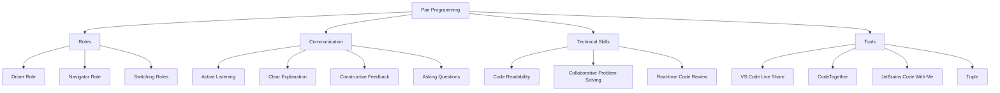
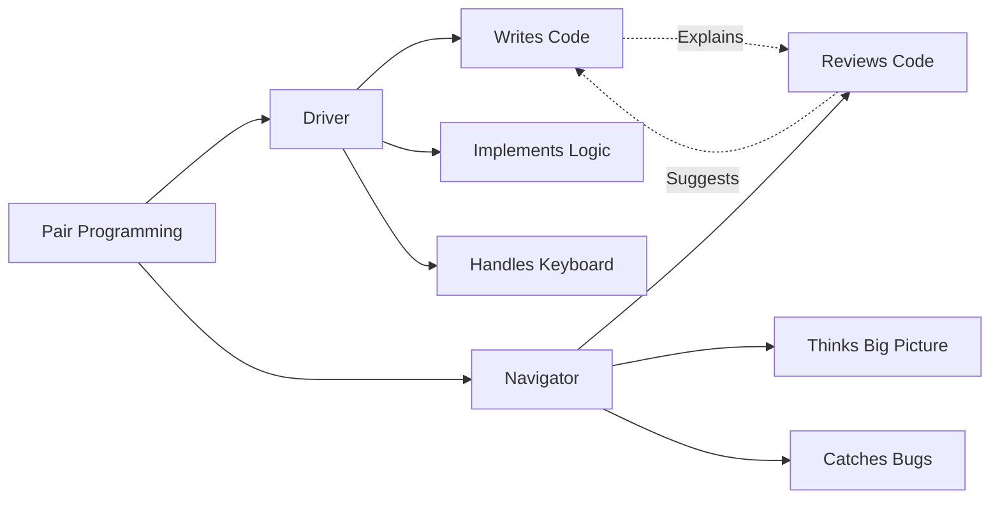
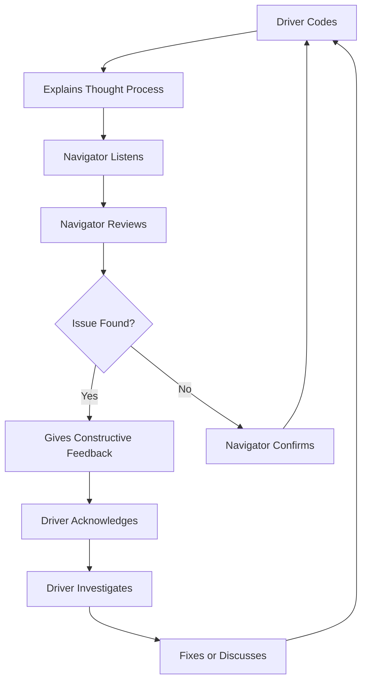
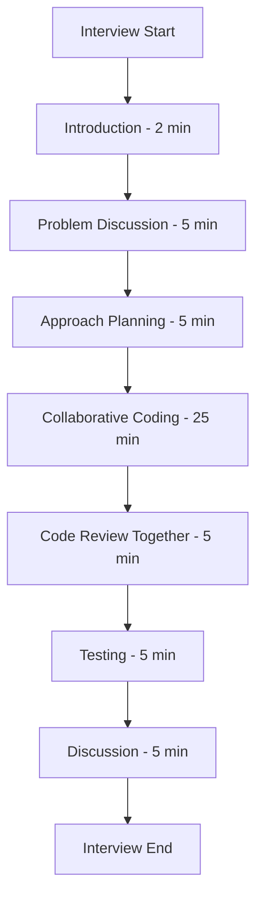

# 19 - Pair Programming for Interviews

---

## 1. Introduction

### What is Pair Programming?
Pair programming is a collaborative coding practice where two developers work together on the same codebase in real-time. In an interview context, it involves working with an interviewer (or another candidate) to solve a coding problem, simulating real-world collaboration. One person typically "drives" (writes code) while the other "navigates" (reviews and guides).

### Why It Matters for Interviews
Pair programming interviews assess:
- **Collaboration skills** — Can you work effectively with others?
- **Communication** — Can you explain your thinking clearly?
- **Code quality** — Can you write code that others can understand?
- **Adaptability** — Can you incorporate feedback in real-time?
- **Technical skills** — Can you solve problems while collaborating?

Companies like Pivotal, GitHub, Shopify, and many startups use pair programming interviews because they closely simulate actual work environments.

### How It Impacts Your Career
- Demonstrates you can work in agile/Scrum teams
- Shows you're open to feedback and code review
- Proves you can communicate technical concepts
- Indicates you'll integrate well with existing teams
- Differentiates you from candidates who only work solo

---

## 2. Learning Roadmap



### Timeline
| Phase | Duration | Focus |
|-------|----------|-------|
| Week 1 | Days 1-3 | Learn roles (driver/navigator) |
| Week 1 | Days 4-7 | Communication techniques |
| Week 2 | Days 8-10 | Practice with tools |
| Week 2 | Days 11-14 | Pair programming exercises |
| Week 3 | Days 15-17 | Mock pair programming interviews |
| Week 3 | Days 18-21 | Full practice sessions |

---

## 3. Theory Notes

### 3.1 Pair Programming Roles

#### The Driver
- Writes the code
- Focuses on implementation details
- Thinks about syntax and logic
- Makes the code work
- Asks navigator for input when needed

**Responsibilities:**
- Write clean, readable code
- Explain what you're coding as you go
- Listen to navigator's suggestions
- Don't ignore feedback
- Handle the keyboard confidently

#### The Navigator
- Reviews code in real-time
- Thinks about the big picture
- Identifies bugs and improvements
- Suggests approaches and optimizations
- Keeps track of the overall direction

**Responsibilities:**
- Watch for bugs and logic errors
- Suggest improvements without being controlling
- Think about edge cases
- Keep track of time and progress
- Ask clarifying questions to the driver

### 3.2 Communication Techniques

#### Active Listening
- Give the speaker your full attention
- Don't interrupt while they're explaining
- Paraphrase to confirm understanding: "So you're saying..."
- Ask clarifying questions when unsure
- Acknowledge suggestions: "Good point, let me incorporate that"

#### Clear Explanation
- Explain your reasoning, not just your actions
- Use specific language: "I'm creating a hash map" not "I'm doing this"
- Describe the purpose of code sections
- When stuck, explain what you've tried

#### Constructive Feedback
- Be specific: "This loop might have an off-by-one error" not "This is wrong"
- Be respectful: "Have you considered..." not "You should..."
- Be timely: Don't let errors accumulate before mentioning them
- Be solution-oriented: Suggest alternatives, not just problems

#### Asking Questions
- "What do you think about this approach?"
- "Should I handle this edge case?"
- "Would you prefer I use a different data structure?"
- "Am I on the right track?"

### 3.3 Code Review During Pairing

**What the Navigator Should Look For:**
1. Logic errors
2. Off-by-one errors
3. Edge case handling
4. Variable naming
5. Code structure and readability
6. Potential optimizations
7. Missing error handling
8. Test coverage

**How to Give Code Review Feedback:**
- "I notice the loop goes to len(arr), should it be len(arr)-1?"
- "What happens if the input is empty?"
- "Could we extract this into a helper function?"
- "This variable name could be more descriptive."

### 3.4 Remote Pair Programming

**Tools:**
| Tool | Features | Best For |
|------|---------|----------|
| VS Code Live Share | Real-time collab, shared terminal | Most interviews |
| CodeTogether | IntelliJ/VS Code extension | JetBrains users |
| JetBrains Code With Me | Full IDE collaboration | JetBrains ecosystem |
| Tuple | Screen sharing + control | Mac users |
| CodeSandbox | Browser-based collab | Web development |
| GitHub Codespaces | Cloud-based dev environments | GitHub-heavy teams |

**Best Practices for Remote Pairing:**
1. Test your setup 30 minutes before the session
2. Use a stable internet connection
3. Have a good microphone (headset preferred)
4. Use screen sharing, not just file sharing
5. Establish clear roles before starting
6. Use a shared timer for time management
7. Take brief breaks if the session is long

### 3.5 Common Pair Programming Exercises

| Exercise | Description | Skills Tested |
|----------|------------|---------------|
| **FizzBuzz variant** | Classic problem with twists | Basic coding, communication |
| **Two Sum** | Find two numbers adding to target | Hash maps, clear explanation |
| **LRU Cache** | Design and implement | Design, data structures |
| **Tic-Tac-Toe** | Game implementation | OOP, logic, testing |
| **API Design** | Design a REST API | System thinking, clarity |
| **Refactoring** | Improve existing code | Code quality, review skills |
| **Bug fixing** | Find and fix bugs in code | Debugging, attention to detail |

### 3.6 Interviewer Expectations

| Expectation | What They're Looking For |
|------------|------------------------|
| Collaboration | You work WITH the interviewer, not against them |
| Communication | You explain your thinking clearly and listen to input |
| Code Quality | You write readable, maintainable code |
| Flexibility | You adapt your approach based on feedback |
| Professionalism | You handle disagreement gracefully |
| Technical Skill | You solve the problem effectively |
| Time Management | You balance thoroughness with progress |

---

## 4. Key Concepts

| Concept | Description | Importance |
|---------|------------|-----------|
| Driver Role | Writing the code | High |
| Navigator Role | Reviewing and guiding | High |
| Active Listening | Fully engaging with the speaker | Very High |
| Constructive Feedback | Specific, respectful, solution-oriented | High |
| Code Readability | Writing code others can understand | Very High |
| Real-time Review | Catching issues as code is written | High |
| Role Switching | Alternating driver/navigator | Medium |
| Collaborative Problem-Solving | Working together to find solutions | Very High |
| Time Management | Balancing speed with quality | High |
| Remote Tools | Proficiency with collaboration tools | High |

---

## 5. Frequently Asked Interview Questions

### Beginner Level

1. **Q: What is pair programming?**
   A: A collaborative practice where two developers work together on the same code. One writes code (driver) while the other reviews and guides (navigator). In interviews, it simulates real work environments and tests both technical and soft skills.

2. **Q: What's the difference between pair programming and a regular coding interview?**
   A: In a regular coding interview, you code alone while the interviewer watches. In pair programming, the interviewer actively participates — they may navigate, suggest approaches, or even drive while you navigate. It's more collaborative.

3. **Q: Should I always be the driver?**
   A: No. Be willing to switch roles. Some interviewers want to see if you can navigate (review code, suggest improvements) as well as drive. Offer to switch: "Would you like to try driving for the next part?"

4. **Q: How do I give feedback on the interviewer's code without being rude?**
   A: Be respectful and specific. "I notice this function could handle empty input. Should we add a check?" Focus on the code, not the person. Use questions rather than commands: "What about..." instead of "You should..."

5. **Q: What if I disagree with the interviewer's suggestion?**
   A: Acknowledge their input, then explain your reasoning. "That's a good point. I was thinking about [alternative] because [reason]. What do you think?" Show you can consider different perspectives.

6. **Q: Do I need to know specific tools for pair programming interviews?**
   A: Familiarize yourself with common tools (VS Code Live Share, CoderPad). Most interviews will use a shared online IDE. Practice basic navigation: sharing your screen, using the editor together, and debugging.

7. **Q: How long is a typical pair programming interview?**
   A: Usually 45-60 minutes. May include: problem discussion (5-10 min), collaborative coding (25-30 min), code review (5-10 min), and discussion (5-10 min).

8. **Q: What if the interviewer doesn't participate much?**
   A: Continue coding and communicating your thoughts. Some interviewers prefer to observe more. Keep them engaged: "What do you think about this approach?" Don't let their silence make you nervous.

### Intermediate Level

9. **Q: How do I handle it when the navigator points out a bug I don't see?**
   A: Thank them and investigate: "Let me look at that. Can you walk me through what you're seeing?" Trust their observation — they may see something you missed. Debug it together.

10. **Q: What if the navigator suggests an approach I think is worse?**
    A: Discuss it respectfully: "I see why you'd suggest that. My concern is [reason]. What if we [alternative]?" Show you can evaluate suggestions critically while remaining open.

11. **Q: How do I balance thoroughness with speed?**
    A: Focus on getting the core functionality working first. Then handle edge cases and optimizations. Communicate your priorities: "Let me get the main logic working, then I'll add error handling."

12. **Q: What should I do if I'm the navigator and the driver is stuck?**
    A: Give targeted hints, not solutions. "Have you considered using a hash map here?" or "What if we approach this differently?" Help them progress without taking over.

13. **Q: How do I handle code that's already written (in refactoring exercises)?**
    A: First, understand what the code does. Then identify issues: bugs, readability, performance, edge cases. Discuss with the navigator what to improve. Make changes incrementally and test after each change.

14. **Q: What if the interviewer asks me to navigate while they drive?**
    A: This is a test of your review and communication skills. Actively look for issues, suggest improvements, and think about edge cases. Ask questions about their approach. Show you can be a valuable team member.

15. **Q: How do I demonstrate leadership during pair programming?**
    A: Take initiative on structure: "Let's start by understanding the requirements." Suggest approaches: "I think we should..." Keep the session organized. Propose testing strategies. But remain collaborative, not dictatorial.

16. **Q: What if we run out of time?**
    A: Communicate: "We have 5 minutes left. Let me make sure the core functionality works." Prioritize: working code > edge cases > optimization > comments. Summarize what you've done and what you'd do with more time.

### Advanced Level

17. **Q: How do I handle pair programming with someone much more experienced?**
    A: Be humble but not passive. Ask questions to learn: "Why did you suggest that approach?" Implement their suggestions but also offer your perspective. Show you're eager to learn while contributing value.

18. **Q: What's the difference between pair programming and mob programming?**
    A: Pair programming = 2 people. Mob programming = entire team on one computer. In interviews, pair programming is more common. Mob programming is rare but tests team collaboration skills.

19. **Q: How do I handle a pair programming exercise where the codebase is unfamiliar?**
    A: Spend the first few minutes understanding the structure: "Let me read through the existing code first." Ask about conventions: "What's the team's coding standard?" Don't rush to modify code you don't understand.

20. **Q: How do I show that I'd be a good team member?**
    A: Demonstrate: (1) Active listening. (2) Respectful communication. (3) Willingness to adapt. (4) Constructive feedback. (5) Shared ownership of the code. (6) Accountability. (7) Positive attitude.

### FAANG Level

21. **Q: How do pair programming interviews differ from standard coding interviews at FAANG?**
    A: FAANG typically uses standard coding interviews (solo coding). However, some teams and roles use pair programming-style interviews to assess collaboration. The core technical assessment is similar, but pair programming adds a collaboration dimension.

22. **Q: What's the most important skill in pair programming?**
    A: Communication. Technical skills are important, but pair programming primarily tests how well you work with others. Clear, respectful, continuous communication is the single most important factor.

23. **Q: How do I handle pair programming when I'm the less experienced person?**
    A: Be proactive about learning: "Can you explain why you chose this approach?" Contribute where you can: "I can handle this part." Stay positive and engaged. Show humility and eagerness to grow.

24. **Q: What if the exercise involves unfamiliar technology?**
    A: Acknowledge it: "I haven't used this specific framework, but I can learn quickly." Focus on fundamentals: the logic, structure, and problem-solving remain the same regardless of technology. Ask the navigator for guidance on syntax.

25. **Q: How do you prepare for a pair programming interview specifically?**
    A: (1) Practice pair programming with friends regularly. (2) Learn the collaboration tools. (3) Practice explaining code as you write it. (4) Practice reviewing others' code constructively. (5) Do exercises that require collaboration, not just solo coding.

---

## 6. Hands-on Practice

### Exercise 1: Driver Practice
Find a coding problem. Write the code while explaining every line out loud (even to yourself). Focus on:
- Clear variable names
- Explaining your logic
- Handling edge cases as you code
- Keeping code organized

### Exercise 2: Navigator Practice
Have a friend code a simple problem while you navigate. Focus on:
- Watching for bugs
- Suggesting improvements
- Thinking about edge cases
- Keeping track of overall progress

### Exercise 3: Role Switching
Work with a partner on a coding problem. Switch roles every 10 minutes. Focus on:
- Smooth transitions
- Maintaining context when switching
- Integrating each other's code
- Communicating about what's been done

### Exercise 4: Constructive Feedback Drill
Review the following code and provide constructive feedback:

```python
def process_data(d):
    r = []
    for i in d:
        if i > 0:
            r.append(i * 2)
        elif i < 0:
            r.append(i * -1)
    return r
```

**Feedback examples:**
1. "The function name could be more descriptive — what does 'process_data' mean specifically?"
2. "The variable names (d, r, i) are not very readable. Could we use names like 'data', 'result', 'item'?"
3. "Should we handle the case where i == 0?"
4. "What if the input d is None or empty?"
5. "The logic for negative numbers might not be what we want — should we use abs() instead?"

### Exercise 5: Remote Pair Programming Setup
Set up a remote pair programming session:
1. Choose a tool (VS Code Live Share recommended)
2. Test screen sharing and audio
3. Open a coding problem
4. Code together for 30 minutes
5. Discuss what worked and what didn't

### Exercise 6: Code Review Exercise
Have a friend write a solution to a problem. Review it and provide:
1. 3 things they did well
2. 3 things they could improve
3. 1 potential bug
4. 1 optimization suggestion

### Exercise 7: Time-Pressured Pairing
Set a 30-minute timer. Code a medium-difficulty problem with a partner. Focus on:
- Getting the core functionality working
- Communicating clearly
- Testing edge cases
- Discussing complexity

### Exercise 8: Conflict Resolution Drill
Your partner suggests an approach you disagree with. Practice:
1. Acknowledging their suggestion: "I see your point."
2. Explaining your concern: "My worry is..."
3. Proposing an alternative: "What if we try..."
4. Reaching consensus: "Let's go with..."

### Exercise 9: Full Mock Pair Programming Interview
Simulate a complete pair programming interview (45 minutes):
- Problem introduction (5 min)
- Collaborative coding (25 min)
- Code review (5 min)
- Discussion and feedback (10 min)

### Exercise 10: Post-Session Review
After each pair programming session, discuss:
1. What communication worked well?
2. What could be improved?
3. Were there any misunderstandings?
4. How was the code quality?
5. What would we do differently next time?

---

## 7. Real FAANG Interview Questions

| Company | Format | Problem Type | Collaboration Style |
|---------|--------|-------------|-------------------|
| Pivotal | Full pair programming | TDD + feature implementation | Strong collaboration |
| GitHub | Pair programming | Tool-related problems | Collaborative coding |
| Shopify | Pair programming | Feature implementation | Driver/navigator |
| Stripe | Collaborative coding | Practical problems | Guided collaboration |
| Basecamp | Pair programming | Real-world problems | Team simulation |
| thoughtbot | Pair programming | TDD exercises | Strong pairing |
| Automattic | Collaborative coding | WordPress problems | Asynchronous collab |

---

## 8. Common Mistakes

| Mistake | Description | How to Avoid |
|---------|------------|--------------|
| Being too dominant | Taking over the keyboard constantly | Share control, listen to navigator |
| Being too passive | Not contributing or suggesting | Actively participate even as navigator |
| Ignoring feedback | Not incorporating navigator's suggestions | Acknowledge and try their suggestions |
| Poor communication | Not explaining thought process | Think aloud constantly |
| Not listening | Dismissing navigator's input | Practice active listening |
| Being defensive | Arguing when feedback is given | Accept feedback gracefully |
| Not asking questions | Working in isolation | Ask for navigator's input regularly |
| Rushing | Trying to finish too fast | Balance speed with quality |
| Not testing | Writing code without verifying | Test as you go |
| Code readability | Writing code that's hard to follow | Use meaningful names and structure |

---

## 9. Best Practices

1. **Communicate constantly** — Verbalize your thought process as you code.
2. **Listen actively** — Give the navigator your full attention when they speak.
3. **Be open to feedback** — Accept suggestions gracefully, even if you disagree.
4. **Ask questions** — "What do you think about this approach?"
5. **Share control** — Don't hog the keyboard; let the navigator drive when appropriate.
6. **Write readable code** — Others need to understand your code in real-time.
7. **Test as you go** — Don't write 100 lines before testing the first 10.
8. **Stay positive** — Pair programming should be enjoyable and productive.
9. **Respect time** — Balance thoroughness with making progress.
10. **Give constructive feedback** — Specific, respectful, solution-oriented.
11. **Practice regularly** — Pair programming is a skill that improves with practice.
12. **Review together** — After solving, review the code together for improvements.

---

## 10. Cheat Sheet

```
+---------------------------------------------------------------+
|            PAIR PROGRAMMING CHEAT SHEET                        |
+---------------------------------------------------------------+
|                                                               |
|  ROLES                                                        |
|  Driver: Writes code, implements logic, handles keyboard      |
|  Navigator: Reviews code, thinks big picture, catches bugs    |
|                                                               |
|  COMMUNICATION                                                |
|  - Explain what you're coding and why                         |
|  - Ask "What do you think about this approach?"               |
|  - Acknowledge feedback: "Good point, let me fix that"        |
|  - Use questions, not commands: "What about..." not "Do..."   |
|                                                               |
|  GIVING FEEDBACK                                              |
|  - Be specific: "This loop might miss index 0"               |
|  - Be respectful: "Have you considered..."                   |
|  - Be timely: Don't let errors accumulate                     |
|  - Be solution-oriented: Suggest alternatives                 |
|                                                               |
|  BEST PRACTICES                                               |
|  1. Communicate constantly                                    |
|  2. Listen actively                                           |
|  3. Be open to feedback                                       |
|  4. Write readable code                                       |
|  5. Test as you go                                            |
|  6. Stay positive                                             |
|  7. Share control                                             |
|  8. Respect time                                              |
|                                                               |
|  REMOTE TOOLS                                                 |
|  - VS Code Live Share (most common)                           |
|  - CodeTogether (JetBrains)                                   |
|  - Tuple (Mac)                                                |
|  - CoderPad (online IDE)                                      |
|                                                               |
+---------------------------------------------------------------+
```

---

## 11. Flash Cards

| # | Question | Answer |
|---|----------|--------|
| 1 | What is the driver's role? | Writing the code, implementing logic |
| 2 | What is the navigator's role? | Reviewing code, thinking about the big picture |
| 3 | What's the #1 skill in pair programming? | Communication |
| 4 | How do you give constructive feedback? | Specific, respectful, solution-oriented |
| 5 | What if you disagree with the navigator? | Acknowledge their point, explain your reasoning |
| 6 | What tool is most common for remote pairing? | VS Code Live Share |
| 7 | Should you always be the driver? | No — be willing to switch roles |
| 8 | How do you handle being stuck? | Ask the navigator for input, think aloud |
| 9 | What if the navigator doesn't contribute? | Ask them directly for their thoughts |
| 10 | How do you test during pair programming? | Test incrementally as you write code |
| 11 | What is pair programming's main advantage? | Simulates real collaborative work environments |
| 12 | How do you handle time pressure? | Prioritize core functionality, communicate |
| 13 | What should you do before starting? | Confirm roles, test tools, clarify the problem |
| 14 | How do you switch roles smoothly? | Summarize what you've done, explain context |
| 15 | What if you find a bug in the navigator's suggestion? | Explain respectfully with evidence |
| 16 | Should you code silently? | No — always think aloud |
| 17 | What's code review during pairing? | Real-time review of code as it's written |
| 18 | How do you handle unfamiliar technology? | Acknowledge it, focus on fundamentals, ask for help |
| 19 | What's the ideal pair programming pace? | Steady progress with clear communication |
| 20 | How do you end a pair programming session? | Review code together, discuss improvements |

---

## 12. Mind Map

```
Pair Programming
│
├── Roles
│   ├── Driver (writes code)
│   │   ├── Implements logic
│   │   ├── Explains while coding
│   │   └── Handles keyboard
│   └── Navigator (reviews code)
│       ├── Watches for bugs
│       ├── Thinks big picture
│       ├── Suggests improvements
│       └── Keeps track of progress
│
├── Communication
│   ├── Active Listening
│   ├── Clear Explanation
│   ├── Constructive Feedback
│   ├── Asking Questions
│   └── Acknowledging Input
│
├── Skills
│   ├── Code Readability
│   ├── Collaborative Problem-Solving
│   ├── Real-time Code Review
│   ├── Time Management
│   └── Adaptability
│
├── Tools
│   ├── VS Code Live Share
│   ├── CodeTogether
│   ├── JetBrains Code With Me
│   ├── Tuple
│   └── CoderPad
│
└── Best Practices
    ├── Communicate constantly
    ├── Listen actively
    ├── Write readable code
    ├── Test incrementally
    └── Stay positive
```

---

## 13. Mermaid Diagrams

### Diagram 1: Pair Programming Roles


### Diagram 2: Communication Flow


### Diagram 3: Pair Programming Interview Timeline


---

## 14. Code Examples

### Example 1: Pair Programming Session (Driver Perspective)
```python
"""
PAIR PROGRAMMING: Two Sum Problem
Driver: Writing code and explaining
Navigator: Watching and suggesting
"""

def two_sum(nums, target):
    """
    DRIVER: "I'm going to use a hash map to solve this.
    For each number, I'll check if the complement exists."
    """
    # DRIVER: "First, I'll create an empty hash map to store seen values"
    seen = {}

    # DRIVER: "Now I'll iterate through the array with index"
    for i, num in enumerate(nums):
        # DRIVER: "For each number, I calculate the complement"
        complement = target - num

        # NAVIGATOR: "What if there are duplicates?"
        # DRIVER: "Good point! The map stores the latest index,
        # which is correct for this problem."

        if complement in seen:
            return [seen[complement], i]

        seen[num] = i

    # NAVIGATOR: "Should we handle the case where no solution exists?"
    # DRIVER: "The problem guarantees exactly one solution,
    # but for robustness, we return an empty list."
    return []


# TESTING TOGETHER:
# Navigator: "Let's trace through [2, 7, 11, 15], target = 9"
# Driver: "i=0, num=2, complement=7, not in seen, store {2:0}"
# Navigator: "i=1, num=7, complement=2, 2 is in seen! Return [0,1]"
# Both: "Correct!"

# Navigator: "What about edge cases?"
# Driver: "Let's test with negative numbers: [-1, -2, -3, -4, -5], -8"
# Navigator: "Expected [2,4] since -3 + -5 = -8"
# Driver: "Let me trace: i=2, num=-3, complement=-5, not in seen yet"
# "i=4, num=-5, complement=-3, -3 is in seen at index 2! Return [2,4] ✓"
```

### Example 2: Pair Programming Session (Navigator Perspective)
```python
"""
NAVIGATOR'S CODE REVIEW NOTES
"""

# Code written by driver:
def merge_sorted_lists(list1, list2):
    result = []
    i = j = 0
    while i < len(list1) and j < len(list2):
        if list1[i] < list2[j]:
            result.append(list1[i])
            i += 1
        else:
            result.append(list2[j])
            j += 1
    result.extend(list1[i:])
    result.extend(list2[j:])
    return result

# NAVIGATOR'S REVIEW:
"""
Positive feedback:
- Good use of two-pointer technique
- Clean variable names
- Handles remaining elements with extend

Suggestions:
1. "Should we add a check for empty input lists?"
2. "What if the lists have different types of elements?"
3. "The function name is clear — good!"
4. "Should we handle the case where inputs are None?"
5. "Could we add a docstring explaining the algorithm?"
"""

# AFTER NAVIGATOR'S FEEDBACK:
def merge_sorted_lists(list1, list2):
    """
    Merge two sorted lists into a single sorted list.
    Uses two-pointer technique for O(n+m) time.
    """
    if not list1:
        return list2
    if not list2:
        return list1

    result = []
    i = j = 0

    while i < len(list1) and j < len(list2):
        if list1[i] < list2[j]:
            result.append(list1[i])
            i += 1
        else:
            result.append(list2[j])
            j += 1

    result.extend(list1[i:])
    result.extend(list2[j:])
    return result
```

### Example 3: Communication Templates
```python
"""
PAIR PROGRAMMING COMMUNICATION TEMPLATES
"""

# As Driver:
EXPLAIN_TEMPLATES = {
    "starting": "Let me start by understanding the problem...",
    "approach": "I think we should use [technique] because [reason]...",
    "coding": "I'm creating a [data structure] to store [what]...",
    "edge_case": "I need to handle the case where [edge case]...",
    "stuck": "I'm considering two approaches: [A] and [B]. What do you think?",
    "testing": "Let me trace through this with [test case]...",
    "done": "Let me verify this works for all test cases...",
}

# As Navigator:
REVIEW_TEMPLATES = {
    "positive": "That looks good. I like how you [specific positive].",
    "concern": "I notice [specific issue]. Have you considered [solution]?",
    "question": "What about [edge case/scenario]? How would the code handle it?",
    "suggestion": "We could optimize this by [suggestion]. What do you think?",
    "confirmation": "Yes, that approach makes sense. Let's proceed.",
    "help": "Would you like me to help with [specific part]?",
}

# Example usage:
print(EXPLAIN_TEMPLATES["approach"])
# "I think we should use a hash map because it gives O(1) lookup"

print(REVIEW_TEMPLATES["concern"])
# "I notice the loop doesn't handle empty input. Have you considered adding a check?"
```

---

## 15. Projects

### Mini Project 1: Pair Programming Scheduler
Build a tool that pairs developers for practice sessions, schedules meetings, and tracks session history.

### Mini Project 2: Communication Tracker
Create a tool that records pair programming sessions and analyzes communication patterns (time speaking, questions asked, feedback given).

### Mini Project 3: Code Review Template Generator
Develop a tool that generates code review checklists for pair programming exercises.

### Intermediate Project 1: Remote Pairing Platform
Build a lightweight web-based pair programming platform with shared editor, video chat, and role tracking.

### Intermediate Project 2: Pair Programming Exercise Library
Create a collection of pair programming exercises with difficulty levels, role assignments, and evaluation criteria.

### Advanced Project 1: AI Pair Programming Coach
Build an AI tool that provides real-time feedback on communication, code quality, and collaboration during pair programming.

### Advanced Project 2: Pair Programming Analytics Dashboard
Develop a dashboard that tracks pair programming metrics: communication frequency, code quality, problem-solving speed, and collaboration effectiveness.

### Project Ideas (10 total)
1. Role-switching timer for pair programming practice
2. Code review feedback generator
3. Pair programming session recorder and reviewer
4. Communication frequency analyzer
5. Pair compatibility matcher (based on skills and schedules)
6. Code readability scorer for pair-written code
7. Pair programming retrospective tool
8. Collaboration metrics dashboard
9. Pair programming exercise randomizer
10. Virtual pair programming environment

---

## 16. Resources

### Practice Platforms
| Platform | URL | Focus |
|---------|-----|-------|
| Pair with Me | pairprogramming.com | Find pairing partners |
| Exercism | exercism.org | Pair programming tracks |
| CodeSignal | codesignal.com | Collaborative coding |
| VS Code Live Share | code.visualstudio.com | Real-time collaboration |
| Tuple | tuple.app | Screen sharing for pairing |

### Books
| Book | Author | Level |
|------|--------|-------|
| *Pair Programming Illuminated* | Laurie Williams | All levels |
| *The Clean Coder* | Robert Martin | Professional |
| *Extreme Programming Explained* | Kent Beck | All levels |
| *Collaborative Programming* | Mishra & Kerievsky | Intermediate |

### Documentation
- VS Code Live Share Documentation
- GitHub Codespaces Guide
- Pair Programming Best Practices (Pivotal)
- Agile Alliance Pair Programming Resources
- Thoughtbot Pairing Guide

### YouTube Channels
| Channel | Focus |
|---------|-------|
| Pair Programming Tips | Pairing techniques |
| Thoughtbot Videos | Pairing and TDD |
| Agile Alliance | Agile practices |
| Uncle Bob Martin | Clean coding and collaboration |

### Blogs
- Thoughtbot Blog (Pairing guides)
- Pivotal Blog (Pairing practices)
- Agile Alliance Blog
- Martin Fowler's Blog
- Robert C. Martin Blog

### Certifications
- Certified ScrumMaster (CSM) — includes pairing
- PMI-ACP (Agile Certified Practitioner)
- ICAgile Certified Professional
- Certified Agile Team Practitioner

---

## 17. Checklist

- [ ] I understand the driver and navigator roles
- [ ] I can communicate my thought process clearly
- [ ] I can give constructive feedback respectfully
- [ ] I can receive feedback without being defensive
- [ ] I write readable code that others can follow
- [ ] I test code incrementally during pairing
- [ ] I can use VS Code Live Share (or similar tool)
- [ ] I can switch roles smoothly
- [ ] I ask clarifying questions regularly
- [ ] I acknowledge the navigator's input
- [ ] I handle disagreement professionally
- [ ] I manage time effectively during pairing
- [ ] I can handle being stuck gracefully
- [ ] I contribute as both driver and navigator
- [ ] I have practiced pair programming with others
- [ ] I can handle remote pair programming
- [ ] I review code collaboratively
- [ ] I stay positive during the session
- [ ] I can solve problems while collaborating
- [ ] I feel confident about pair programming interviews

---

## 18. Revision Notes

### Key Principles
1. **Communication is #1** — Talk through every decision
2. **Listen actively** — Give the navigator your full attention
3. **Be open to feedback** — Accept suggestions gracefully
4. **Write readable code** — Others need to understand it
5. **Test as you go** — Don't write 100 lines before testing

### One-Day Revision Plan
| Time | Activity |
|------|----------|
| Morning (1 hr) | Review pair programming roles and communication techniques |
| Mid-morning (1 hr) | Practice giving constructive feedback on code |
| Afternoon (2 hrs) | Pair programming session with a friend (1 hour each role) |
| Late afternoon (1 hr) | Review communication patterns and improve |
| Evening (1 hr) | Practice on VS Code Live Share with a partner |

### One-Week Revision Plan
| Day | Focus |
|-----|-------|
| Monday | Review roles and communication techniques |
| Tuesday | Practice as driver (3 problems) |
| Wednesday | Practice as navigator (3 problems) |
| Thursday | Role switching practice |
| Friday | Remote pair programming session |
| Saturday | Code review practice |
| Sunday | Full mock pair programming interview |

---

## 19. Mock Interview Questions

### Round 1: Easy Pair Programming (30 minutes)
Partner presents: Two Sum problem
- Driver implements while explaining
- Navigator provides feedback
- Switch roles halfway
- Discuss approach and complexity

### Round 2: Medium Pair Programming (45 minutes)
Partner presents: LRU Cache design
- Collaborative design discussion
- Driver implements core functionality
- Navigator suggests improvements
- Test together

### Round 3: Code Review Exercise (30 minutes)
Partner presents: A buggy solution
- Navigator identifies bugs
- Driver fixes based on navigator's feedback
- Discuss what went wrong and why
- Refactor for better code quality

### Round 4: Full Mock Interview (60 minutes)
- Problem introduction and discussion (10 min)
- Collaborative coding (30 min)
- Code review and testing (10 min)
- Discussion and feedback (10 min)

---

## 20. Difficulty Rating

| Skill | Difficulty (1-5) | Interview Frequency | Priority |
|-------|-------------------|--------------------|----|
| Driver Role | 2 | High | Must Know |
| Navigator Role | 3 | High | Must Know |
| Active Listening | 3 | Very High | Must Know |
| Constructive Feedback | 3 | High | Should Know |
| Code Readability | 2 | Very High | Must Know |
| Role Switching | 3 | Medium | Should Know |
| Remote Collaboration | 3 | High | Should Know |
| Time Management | 3 | High | Should Know |
| Handling Disagreement | 4 | Medium | Should Know |
| Collaborative Problem-Solving | 3 | Very High | Must Know |
| Real-time Code Review | 3 | High | Should Know |
| Tool Proficiency | 2 | High | Must Know |

---

## 21. Summary

Pair programming interviews test both technical skills and collaboration abilities. They simulate real work environments where developers work together daily.

**Key Takeaways:**
- Master both driver and navigator roles
- Communication is the most important skill
- Give and receive feedback constructively
- Write readable code that others can follow
- Practice with actual pair programming tools
- Test incrementally during the session
- Handle disagreement professionally
- Practice regularly with partners

**Interview Success Formula:**
Pair Programming Success = Communication + Collaboration + Code Quality + Adaptability

**Next Steps:**
1. Practice pair programming with friends weekly
2. Learn VS Code Live Share or similar tools
3. Practice giving constructive feedback on code
4. Do mock pair programming interviews
5. Focus on communication as much as coding
6. Learn to switch roles smoothly

---

*Last Updated: July 2026*
*Total Sections: 21*
*Estimated Study Time: 3 weeks (1-2 hours daily)*
