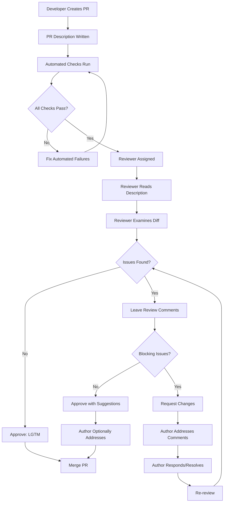
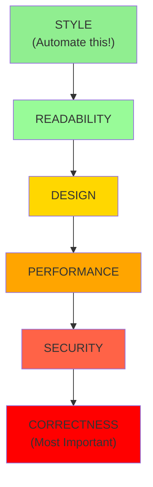
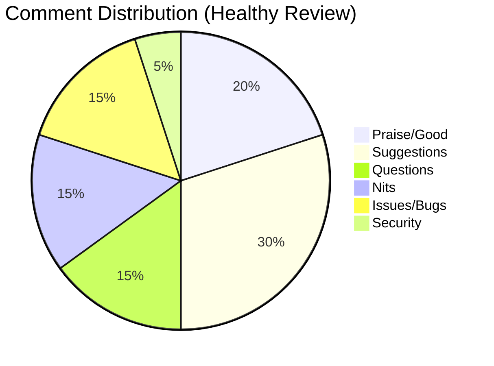
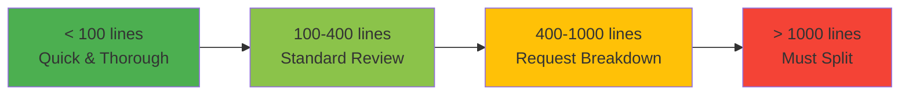

# 23 - Code Review: Skills, Best Practices, and Interview Preparation

## 1. Introduction

Code review is the systematic examination of source code by peers to find bugs, improve code quality, and share knowledge. It is one of the most important practices in modern software development and a critical skill assessed during technical interviews.

At FAANG companies, code review is not just a process — it's a culture. Google, Meta, Amazon, and others require code reviews for virtually every change that goes into production. As an interview candidate, demonstrating code review awareness signals that you can work effectively in a team and maintain high-quality codebases.

This module covers everything from writing effective code reviews to common findings, tools, and the etiquette that makes code reviews productive rather than adversarial. Mastering code review skills helps you write better code yourself, as you learn to spot issues before they're pointed out by others.

---

## 2. Learning Roadmap

### Phase 1: Foundations (Week 1-2)
- [ ] Understand the purpose and value of code review
- [ ] Learn the code review checklist (correctness, readability, performance, security)
- [ ] Practice giving feedback on open-source projects
- [ ] Understand common code smells and anti-patterns
- [ ] Learn to write clear, constructive review comments

### Phase 2: Tools and Workflows (Week 3-4)
- [ ] Master GitHub Pull Request workflows
- [ ] Learn GitLab Merge Request processes
- [ ] Understand Gerrit and Crucible review systems
- [ ] Practice using inline comments and suggestions
- [ ] Learn to use automated code analysis tools (ESLint, SonarQube, etc.)

### Phase 3: Advanced Review Skills (Week 5-6)
- [ ] Perform security-focused code reviews
- [ ] Review for performance and scalability
- [ ] Assess architectural decisions in code
- [ ] Review concurrent and distributed code
- [ ] Learn to review database migrations safely

### Phase 4: Interview Mastery (Week 7-8)
- [ ] Practice whiteboard code review exercises
- [ ] Learn to review code under time pressure
- [ ] Understand how companies evaluate code review skills
- [ ] Review production code from open-source projects
- [ ] Practice articulating review feedback clearly

---

## 3. Theory Notes

### 3.1 Purpose of Code Review

Code review serves multiple purposes:
1. **Bug Detection** — Find defects before they reach production
2. **Knowledge Sharing** — Distribute understanding of the codebase
3. **Code Quality** — Maintain consistent standards and readability
4. **Mentoring** — Help junior developers learn best practices
5. **Design Feedback** — Catch architectural issues early
6. **Security** — Identify vulnerabilities before deployment
7. **Documentation** — Reviews serve as a record of design decisions

### 3.2 Types of Code Review

| Type | Description | When to Use |
|------|-------------|-------------|
| Over-the-shoulder | Informal, developer shows code to reviewer | Small changes, quick questions |
| Pull/Merge Request | Formal review through version control | Standard workflow |
| Pair Programming | Two developers code together in real-time | Complex features, mentoring |
| Fagan Inspection | Formal, structured review process | Critical/safety code |
| Tool-assisted | Automated + manual review | Large codebases |

### 3.3 The Code Review Pyramid

Focus your review effort from bottom to top:
1. **Correctness** — Does it do what it's supposed to?
2. **Security** — Can it be exploited?
3. **Performance** — Will it scale?
4. **Design** — Is the architecture sound?
5. **Readability** — Can others understand it?
6. **Style** — Does it follow conventions? (Automate this!)

### 3.4 Review Response Time Statistics

Studies show:
- Reviews completed within **1 hour** have the highest impact
- Reviews delayed beyond **24 hours** become significantly less effective
- Review quality drops after reviewing more than **400 lines** at once
- Optimal reviewer-to-author ratio is **1:1 to 2:1**

---

## 4. Key Concepts

### 4.1 Code Review Checklist

#### Correctness
- [ ] Does the code do what the requirements/specs say?
- [ ] Are all edge cases handled (empty inputs, null, max values)?
- [ ] Are error conditions handled gracefully?
- [ ] Is the logic correct for all code paths?

#### Security
- [ ] Is user input validated and sanitized?
- [ ] Are SQL queries parameterized (no string concatenation)?
- [ ] Is authentication/authorization checked where needed?
- [ ] Are secrets and credentials not hardcoded?
- [ ] Is sensitive data properly encrypted/hashed?
- [ ] Are there potential injection vulnerabilities (SQL, XSS, CSRF)?

#### Performance
- [ ] Are there unnecessary database queries (N+1 problem)?
- [ ] Are algorithms efficient enough for expected data volumes?
- [ ] Are expensive operations cached where appropriate?
- [ ] Is memory usage reasonable (no leaks, no unnecessary allocations)?

#### Readability
- [ ] Are variable and function names clear and descriptive?
- [ ] Are complex algorithms explained with comments?
- [ ] Is the code DRY (Don't Repeat Yourself)?
- [ ] Are functions/methods appropriately sized (single responsibility)?

#### Testing
- [ ] Are there adequate unit tests?
- [ ] Are edge cases covered in tests?
- [ ] Do tests actually assert meaningful behavior?
- [ ] Are integration tests included where needed?

### 4.2 Giving Constructive Feedback

**DO:**
```
- Explain WHY the change is suggested
- Provide alternative code or solutions
- Use a respectful and collaborative tone
- Distinguish between blocking issues and suggestions
- Ask questions when you don't understand something
- Acknowledge what's done well
```

**DON'T:**
```
- Make personal attacks or use condescending language
- Use absolute terms without explanation ("this is wrong")
- Nitpick on style when auto-formatters exist
- Request changes without explaining the benefit
- Review when you're tired or frustrated
- Approve without actually reviewing
```

### 4.3 Comment Prefixes

Use consistent prefixes to indicate review intent:
- **`[nit]`** — Minor style/naming suggestion (non-blocking)
- **`[suggestion]`** — Optional improvement idea
- **`[question]`** — Seeking clarification
- **`[issue]`** — Must be fixed before merge
- **`[security]`** — Security concern
- **`[perf]`** — Performance concern
- **`[bug]`** — Identified bug

### 4.4 Common Code Review Findings

| Category | Common Finding | Severity |
|----------|---------------|----------|
| Security | Hardcoded credentials | Critical |
| Security | SQL injection vulnerability | Critical |
| Security | Missing input validation | High |
| Bug | Off-by-one error | High |
| Bug | Missing null check | High |
| Bug | Unhandled exception | Medium |
| Performance | N+1 database query | High |
| Performance | Unbounded collection growth | Medium |
| Performance | Missing database index | Medium |
| Design | God class / too many responsibilities | Medium |
| Design | Tight coupling between modules | Medium |
| Readability | Unclear variable naming | Low |
| Readability | Missing documentation for complex logic | Low |
| Readability | Duplicated code | Medium |
| Style | Inconsistent formatting | Low |

---

## 5. FAQ (20+ Q&A)

**Q1: How long should a code review take?**
Ideally, review a PR within 1-4 business hours. Reviews should take no more than 30-60 minutes. If the PR is too large to review in that time, ask the author to break it into smaller PRs. Studies show review effectiveness drops significantly after 400 lines.

**Q2: Should I review my own code before requesting review?**
Absolutely. Self-review catches obvious issues, demonstrates professionalism, and respects the reviewer's time. Use `git diff` to review your own changes before requesting review.

**Q3: How do I handle disagreements during code review?**
Focus on the code, not the person. Use data, benchmarks, or reference standards to support your position. If you can't reach agreement, escalate to a tech lead or establish a team convention. Document the decision.

**Q4: What's the right level of detail for review comments?**
Match the detail to the severity. For blocking issues, explain the problem and suggest a fix. For nitpicks, keep comments brief. For complex changes, provide detailed context. Always be constructive.

**Q5: Should I review the entire codebase or just the diff?**
Focus on the diff (changed lines), but understand the surrounding context. Look at the files touched and how the changes integrate with existing code. Don't review code that wasn't changed unless it's directly relevant.

**Q6: How do I review code in a language I'm not familiar with?**
Focus on logic, design, and security rather than language-specific idioms. Ask questions about unfamiliar patterns. Request that the author add comments explaining language-specific constructs. Pair with a language expert if possible.

**Q7: What tools are commonly used for code review?**
GitHub Pull Requests, GitLab Merge Requests, Bitbucket Pull Requests, Gerrit, Crucible (Atlassian), Phabricator, Azure DevOps PRs, and Crucible. Most teams use one integrated with their version control.

**Q8: How do I write a good PR description?**
Include: what the change does, why it's needed, how it works (high level), testing done, screenshots if UI changes, and any follow-up work needed. Reference related issues/tickets.

**Q9: What is LGTM?**
"Looks Good To Me" — used to approve a code review. Some teams use 👍 or "approved" instead. It means the reviewer has no blocking concerns.

**Q10: How do I handle a PR that's too large to review?**
Politely ask the author to break it into smaller, logical PRs. Smaller PRs (under 400 lines) are easier to review, faster to merge, and result in fewer bugs.

**Q11: Should automated checks replace manual review?**
No. Automated checks (linting, formatting, static analysis) handle style and some correctness issues, but can't assess design, business logic, or security nuances. Use automation for the routine; humans for the complex.

**Q12: How do I review code for security?**
Look for: input validation, SQL parameterization, authentication checks, proper encryption, secrets in code, OWASP Top 10 vulnerabilities, proper error handling (don't leak info), and secure defaults.

**Q13: What makes a bad code review?**
Nitpicking on trivial style issues while missing real bugs, being condescending or personal, rubber-stamping (approving without reading), blocking on opinions rather than facts, and not providing actionable feedback.

**Q14: How do I handle review feedback on my own code?**
Stay professional and non-defensive. Thank the reviewer. If you disagree, explain your reasoning with evidence. Distinguish between mandatory fixes and optional suggestions. Learn from the feedback.

**Q15: What is the role of a code review in agile?**
Code reviews are part of the Definition of Done in most agile teams. They ensure quality gates are met, knowledge is shared, and the team maintains collective code ownership.

**Q16: How do I review code for performance?**
Look for: algorithmic complexity, unnecessary allocations, N+1 queries, missing indexes, blocking I/O in async contexts, unbounded loops, and missing caching. Use profiling data to validate concerns.

**Q17: Should junior developers review senior developers' code?**
Yes, with appropriate support. Junior developers often catch issues seniors miss because they approach code fresh. It's also a valuable learning opportunity. Pair them with another reviewer initially.

**Q18: How many reviewers should a PR have?**
One thorough reviewer is better than two superficial ones. For critical changes, two reviewers provide better coverage. Most teams use 1-2 reviewers per PR.

**Q19: What is a code review comment resolution?**
After a reviewer leaves comments, the author addresses each one: either by making the change, explaining why the current approach is preferred, or reaching a compromise. All threads should be resolved before merge.

**Q20: How do I handle post-merge发现的 issues?**
If a post-merge issue is critical, revert first, fix later. For non-critical issues, create a follow-up ticket. Use it as a learning opportunity to improve the review process.

**Q21: What is the difference between code review and pair programming?**
Code review is asynchronous — one person writes code, another reviews it later. Pair programming is synchronous — two developers write code together in real-time. Both catch bugs but at different stages.

**Q22: How do I review database migrations?**
Check: backward compatibility, data integrity, index creation strategy (online vs offline), rollback plan, impact on running queries, and whether the migration can be applied without downtime.

---

## 6. Hands-on Practice

### Exercise 1: Review This Code

```python
# Review the following function. Find all issues.
def process_users(users):
    results = []
    for user in users:
        query = "SELECT * FROM users WHERE name = '" + user['name'] + "'"
        db.execute(query)
        result = db.fetchone()
        if result:
            results.append(result)
    return results

# Issues to find:
# 1. SQL Injection vulnerability (CRITICAL)
# 2. N+1 query pattern (PERFORMANCE)
# 3. No error handling for db failures
# 4. No input validation
# 5. No connection pooling consideration

# FIXED VERSION:
def process_users(users):
    results = []
    query = "SELECT * FROM users WHERE name = %s"
    for user in users:
        if not user.get('name'):
            continue
        try:
            db.execute(query, (user['name'],))
            result = db.fetchone()
            if result:
                results.append(result)
        except DatabaseError as e:
            logger.error(f"DB error processing user {user.get('name')}: {e}")
    return results
```

### Exercise 2: Identify Security Issues

```java
// Review this Java code for security issues.
public class UserController {
    @PostMapping("/login")
    public ResponseEntity login(@RequestBody LoginRequest request) {
        String query = "SELECT * FROM users WHERE username='" + 
                       request.getUsername() + "' AND password='" + 
                       request.getPassword() + "'";
        User user = db.query(query);
        if (user != null) {
            String token = generateToken(user);
            return ResponseEntity.ok(token);
        }
        return ResponseEntity.status(401).build();
    }
    
    private String generateToken(User user) {
        return Base64.encode(user.getId() + ":" + user.getUsername());
    }
}

// Issues:
// 1. SQL Injection (CRITICAL)
// 2. Passwords stored/compared in plaintext (CRITICAL)
// 3. Base64 token is not secure (should use JWT with signing)
// 4. No rate limiting
// 5. No account lockout after failed attempts
// 6. Generic 401 response is good (don't reveal if user exists)
```

### Exercise 3: Performance Review

```javascript
// Review this code for performance issues.
function findUsersWithOrders(users, orders) {
    const result = [];
    for (const user of users) {
        for (const order of orders) {  // O(n*m) nested loop
            if (order.userId === user.id) {
                result.push({ ...user, order });
                break;
            }
        }
    }
    return result;
}

// Issues:
// 1. O(n*m) complexity — should use a Map/Set for lookups
// 2. Spreading entire user object creates unnecessary copies

// IMPROVED:
function findUsersWithOrders(users, orders) {
    const ordersByUser = new Map();
    for (const order of orders) {
        if (!ordersByUser.has(order.userId)) {
            ordersByUser.set(order.userId, []);
        }
        ordersByUser.get(order.userId).push(order);
    }
    
    return users
        .filter(user => ordersByUser.has(user.id))
        .map(user => ({ ...user, orders: ordersByUser.get(user.id) }));
}
```

---

## 7. FAANG Questions

### Google
1. **"Walk me through how you would review this pull request."**
   - Approach systematically: understand the purpose, review the design, check correctness, look for security issues, assess readability, verify tests

2. **"What would you do if a senior engineer's code has a bug and they don't want to change it?"**
   - Present data/evidence, suggest alternatives, escalate to tech lead if needed, focus on the code not the person

### Amazon
3. **"How do you ensure code quality in your team?"**
   - Code reviews, automated testing, static analysis, coding standards, pair programming, CI/CD pipelines

4. **"Tell me about a code review where you found a critical issue."**
   - Use STAR format. Describe the issue, how you found it, and the impact of catching it.

### Meta
5. **"How do you review code for scalability?"**
   - Check algorithmic complexity, database query patterns, caching strategies, load handling, and consider future growth scenarios

### Apple
6. **"What's your approach to reviewing code you're not familiar with?"**
   - Start with the PR description, understand the context, focus on logic over syntax, ask questions, consult documentation

### Netflix
7. **"How do you handle code review disagreements?"**
   - Use data-driven arguments, benchmark if possible, reference established patterns, escalate constructively, document decisions

---

## 8. Common Mistakes

### Mistake 1: Reviewing Too Much Code at Once
**Problem:** Reviewing 1000+ lines leads to fatigue and missed issues.
**Fix:** Keep PRs under 400 lines. If larger, review in logical chunks over multiple sessions.

### Mistake 2: Nitpicking While Missing Real Issues
**Problem:** Commenting on formatting while missing a SQL injection vulnerability.
**Fix:** Review in order of importance: correctness → security → performance → design → readability → style.

### Mistake 3: Not Providing Actionable Feedback
**Problem:** Saying "this is bad" without explaining why or how to fix it.
**Fix:** Always explain the issue and provide a suggested fix or alternative approach.

### Mistake 4: Rubber-Stamping Approvals
**Problem:** Approving without actually reading the code.
**Fix:** Take the time to understand the changes. If you don't have time, say so and request another reviewer.

### Mistake 5: Making It Personal
**Problem:** "You always write code like this" or "This is sloppy."
**Fix:** Focus on the code: "This function could be clearer if we..." or "Consider adding error handling here."

### Mistake 6: Delaying Reviews
**Problem:** Sitting on PRs for days, blocking the team.
**Fix:** Review PRs within 4 business hours. If you can't, let the author know and find an alternative reviewer.

### Mistake 7: Not Reading the PR Description
**Problem:** Diving into code without understanding the context or purpose.
**Fix:** Always read the description first to understand what the PR is trying to accomplish.

### Mistake 8: Ignoring Tests
**Problem:** Reviewing only production code and not checking test coverage.
**Fix:** Review test code with the same rigor as production code. Check edge cases, assertions, and coverage.

### Mistake 9: Blocking on Opinions
**Problem:** Refusing to approve because of a stylistic preference.
**Fix:** Use automated formatters for style. Focus reviews on substantive issues. Document team conventions.

### Mistake 10: Not Following Up
**Problem:** Leaving comments but not checking if they were addressed.
**Fix:** Re-review the changes after the author responds. Resolve all threads before approving.

---

## 9. Best Practices

### For Reviewers
1. Review the PR description first to understand context
2. Start with the most critical files (core logic, security-sensitive)
3. Check tests alongside production code
4. Use consistent comment prefixes for clarity
5. Approve with minor comments when possible (don't block on nits)
6. Be timely — review within 4 hours when possible
7. Provide praise for good work, not just criticism

### For Authors
1. Write clear PR descriptions with context
2. Keep PRs small and focused (under 400 lines)
3. Self-review before requesting review
4. Respond to all comments, even if just to acknowledge
5. Don't take feedback personally
6. Mark conversations as resolved when addressed
7. Provide screenshots/gifs for UI changes

### For Teams
1. Establish and document coding standards
2. Use automated linters and formatters to handle style
3. Define clear review requirements (who reviews, SLA for turnaround)
4. Rotate reviewers to spread knowledge
5. Track review metrics and continuously improve
6. Use CODEOWNERS for automatic reviewer assignment
7. Conduct regular review retrospectives

---

## 10. Cheat Sheet

```
CODE REVIEW QUICK REFERENCE
============================

REVIEW ORDER (by importance):
  1. Purpose & Design    — Does this solve the right problem?
  2. Correctness         — Does it work for all cases?
  3. Security            — Can it be exploited?
  4. Performance         — Will it scale?
  5. Error Handling      — Are failures handled gracefully?
  6. Testing             — Are tests adequate?
  7. Readability         — Can others understand it?
  8. Style               — (Should be automated)

COMMENT PREFIXES:
  [bug]       — Must fix, this is incorrect
  [security]  — Security vulnerability
  [perf]      — Performance concern
  [suggestion] — Optional improvement
  [nit]       — Minor style/naming (non-blocking)
  [question]  — Seeking clarification
  [praise]    — Good work! (Always include these)

RED FLAGS — STOP AND INVESTIGATE:
  □ eval() or exec() with user input
  □ SQL string concatenation
  □ Hardcoded passwords or API keys
  □ Empty catch/except blocks
  □ TODOs/FIXMEs in production code
  □ Deleting tests without replacement
  □ Very large files (1000+ lines)
  □ Functions with 10+ parameters
  □ Deeply nested code (> 3 levels)

PR SIZE GUIDELINES:
  < 100 lines  : Quick review (minutes)
  100-400 lines: Standard review (30-60 min)
  400-1000 lines: Request breakdown
  > 1000 lines : MUST break into smaller PRs

REVIEW SLA:
  Response: < 4 hours
  Full review: < 1 business day
  Revision re-review: < 4 hours

COMMON SECURITY CHECKS:
  □ Input validation present?
  □ SQL queries parameterized?
  □ Authentication/authorization checked?
  □ No secrets in code?
  □ Sensitive data encrypted?
  □ Error messages don't leak info?
  □ CORS configured properly?
```

---

## 11. Flash Cards

**Card 1:** What is the recommended maximum PR size for effective review?
**Answer:** Under 400 lines of code. Studies show review effectiveness drops significantly beyond this.

**Card 2:** What does the [nit] prefix mean in a code review?
**Answer:** A minor style or naming suggestion that is non-blocking and can be addressed optionally.

**Card 3:** What is LGTM?
**Answer:** "Looks Good To Me" — indicates the reviewer approves the changes with no blocking concerns.

**Card 4:** What is the N+1 query problem?
**Answer:** When code executes one query to fetch N records, then N additional queries (one per record) instead of using JOINs or batch loading.

**Card 5:** What should you review first in a PR?
**Answer:** The PR description, to understand the purpose and context of the changes.

**Card 6:** What is a CODEOWNERS file?
**Answer:** A file that defines which team members are automatically requested for review when specific files are changed.

**Card 7:** What is the biggest mistake in code reviews?
**Answer:** Nitpicking on trivial style issues while missing critical security or correctness bugs.

**Card 8:** What is the recommended review response time?
**Answer:** Within 4 business hours for initial response, within 1 business day for full review.

**Card 9:** Should code reviews replace automated testing?
**Answer:** No. Automated testing catches bugs deterministically. Code review catches design issues, security concerns, and provides knowledge sharing that tests cannot.

**Card 10:** What is a code review anti-pattern?
**Answer:** Rubber-stamping — approving code without actually reading it thoroughly.

**Card 11:** How should you handle a disagreement in code review?
**Answer:** Focus on the code with data/evidence, suggest alternatives, and escalate to a tech lead if needed. Never make it personal.

**Card 12:** What is self-review?
**Answer:** Reviewing your own PR using `git diff` before requesting others to review. It catches obvious issues and respects reviewers' time.

**Card 13:** What should a good PR description include?
**Answer:** What changed, why, how it works, testing done, screenshots if applicable, and any follow-up items.

**Card 14:** What is the review pyramid?
**Answer:** Correctness → Security → Performance → Design → Readability → Style (review in this order of priority).

**Card 15:** What is the difference between a blocking and non-blocking comment?
**Answer:** Blocking comments must be addressed before merge. Non-blocking comments are suggestions the author can choose to address.

**Card 16:** What is a code smell?
**Answer:** A表面 indicator of a deeper design problem, such as duplicated code, god classes, long methods, or feature envy.

**Card 17:** What is the purpose of code review comments prefixes?
**Answer:** To clearly communicate the intent and severity of each comment (bug, security, nit, suggestion, etc.).

**Card 18:** How many reviewers should review a PR?
**Answer:** 1-2 reviewers. One thorough reviewer is better than two superficial ones. Two reviewers for critical changes.

**Card 19:** What is the Definition of Done in agile?
**Answer:** A shared understanding of when a feature is complete, typically including: code reviewed, tests passing, documentation updated, and meets acceptance criteria.

**Card 20:** What is pair programming?
**Answer:** Two developers working together at one workstation — one codes (driver) while the other reviews in real-time (navigator). A synchronous alternative to traditional code review.

---

## 12. Mind Map

```
                          CODE REVIEW
                              |
          ┌───────────────────┼───────────────────┐
          |                   |                   |
     PURPOSE              PROCESS              TOOLS
          |                   |                   |
    ┌─────┼─────┐     ┌──────┼──────┐     ┌──────┼──────┐
    |     |     |     |      |      |     |      |      |
  Bug   Know   Quality Design  Review  Author GitHub Gerrit
  Detection ledge      Feedback Order   Respon- PRs    |
    |     Share  |     |      |     ses    |   Crucible
  Find   |    Standards|  Correct-  |     GitLab  |
  before |    Consist- |  ness→     |     MRs   Azure
  prod   |    ency    |  Security  |            DevOps
         |             |  →Perf→   |
       Mentor         |  Design→  |
       ing            |  Readab-  |
                      |  ility    |
                      |           |
                    Small PRs   Timely
                    < 400 lines Response
```

---

## 13. Mermaid Diagrams

### Code Review Workflow



### Review Priority Pyramid



### Code Review Comment Types



### PR Size vs Review Quality



---

## 14. Code Examples

### Example 1: Python Code Review with Security Issues

```python
# BEFORE REVIEW - Multiple issues
import os
import pickle

def load_user_data(filename):
    """Load user data from a pickle file."""
    with open(filename, 'rb') as f:
        return pickle.load(f)  # SECURITY: Pickle deserialization = RCE

def search_products(query):
    """Search products by name."""
    sql = f"SELECT * FROM products WHERE name LIKE '%{query}%'"  # SQL Injection
    return db.execute(sql)

def create_session(user_id):
    """Create a session for a user."""
    token = str(user_id)  # WEAK: Predictable token
    sessions[token] = user_id
    return token

# AFTER REVIEW - Fixed
import os
import json
import secrets
from parameterized import sql

def load_user_data(filename):
    """Load user data from a JSON file."""
    with open(filename, 'r') as f:
        return json.load(f)  # Safe: JSON deserialization

def search_products(query):
    """Search products by name."""
    sql = "SELECT * FROM products WHERE name LIKE %s"
    return db.execute(sql, (f"%{query}%",))  # Parameterized query

def create_session(user_id):
    """Create a session for a user."""
    token = secrets.token_urlsafe(32)  # Cryptographically secure
    sessions[token] = user_id
    return token
```

### Example 2: Java Code Review - Design Issues

```java
// BEFORE REVIEW - God class
public class UserManager {
    // 2000+ lines handling users, auth, emails, payments, notifications...
    public void createUser(User u) { /* 50 lines */ }
    public void sendEmail(String to, String body) { /* 30 lines */ }
    public void processPayment(Payment p) { /* 80 lines */ }
    public void sendNotification(User u, String msg) { /* 20 lines */ }
}

// AFTER REVIEW - Single Responsibility
public class UserService {
    private final UserRepository userRepository;
    private final EmailService emailService;
    
    public void createUser(User u) {
        userRepository.save(u);
        emailService.sendWelcomeEmail(u.getEmail());
    }
}

public class PaymentService {
    private final PaymentRepository paymentRepository;
    
    public void processPayment(Payment p) {
        paymentRepository.process(p);
    }
}
```

### Example 3: JavaScript Code Review - Async Issues

```javascript
// BEFORE REVIEW - Fire and forget
async function updateUserProfile(userId, data) {
    const user = await fetchUser(userId);  // Could fail
    const updated = { ...user, ...data };
    await saveUser(updated);  // Could fail
    sendEmail(user.email, "Profile updated");  // No await, no error handling
    return updated;
}

// AFTER REVIEW - Proper error handling
async function updateUserProfile(userId, data) {
    try {
        const user = await fetchUser(userId);
        const updated = { ...user, ...data };
        await saveUser(updated);
        
        try {
            await sendEmail(user.email, "Profile updated");
        } catch (emailError) {
            logger.warn("Failed to send update email", { userId, error: emailError });
            // Don't fail the whole operation for email failure
        }
        
        return updated;
    } catch (error) {
        logger.error("Failed to update profile", { userId, error });
        throw new UpdateProfileError("Unable to update profile", { cause: error });
    }
}
```

### Example 4: Go Code Review - Error Handling

```go
// BEFORE REVIEW - Ignored errors
func readFile(path string) string {
    data, _ := os.ReadFile(path)  // Ignored error!
    return string(data)
}

// AFTER REVIEW - Proper error handling
func readFile(path string) (string, error) {
    data, err := os.ReadFile(path)
    if err != nil {
        return "", fmt.Errorf("reading file %s: %w", path, err)
    }
    return string(data), nil
}
```

---

## 15. Projects

### Project 1: Code Review Training Platform
Build a web application with:
- 50+ code snippets with intentional issues across languages
- Guided review process with hints
- Scoring system tracking issues found vs missed
- Progress tracking and skill assessment

### Project 2: Automated Code Review Bot
Create a bot that:
- Integrates with GitHub PRs
- Detects common security issues (hardcoded secrets, SQL injection patterns)
- Checks for performance anti-patterns
- Validates PR descriptions and sizes
- Posts review comments automatically

### Project 3: Code Review Metrics Dashboard
Build a dashboard that:
- Tracks review turnaround times
- Measures PR sizes over time
- Shows reviewer workload distribution
- Identifies bottlenecks in the review process
- Generates team health reports

---

## 16. Resources

### Books
- "Code Complete" by Steve McConnell
- "Clean Code" by Robert C. Martin
- "Effective Code Reviews" by Paul Jones
- "Software Engineering at Google" by Titus Winters

### Online Resources
- [Google's Code Review Developer Guide](https://google.github.io/eng-practices/review/)
- [Pull Request Review Best Practices](https://github.blog/2019-01-07-code-review-best-practices/)
- [Code Review Guidelines](https://github.com/thomvaill/log4brains/blob/master/docs/adr/2020-01-01-code-review-guidelines.md)

### Tools
- [SonarQube](https://www.sonarqube.org/) — Static code analysis
- [CodeClimate](https://codeclimate.com/) — Automated code review
- [ESLint](https://eslint.org/) — JavaScript linting
- [Pylint](https://pylint.org/) — Python linting
- [Checkstyle](https://checkstyle.org/) — Java style checking

### Practice
- Review open-source PRs on GitHub (look for "good first issue" labels)
- Practice on [Pull Request Reviews on Exercism](https://exercism.org/)

---

## 17. Checklist

### Before Submitting for Review
- [ ] Self-reviewed the diff
- [ ] PR description is clear and complete
- [ ] Tests are added/updated
- [ ] Documentation is updated
- [ ] No debug code or console.logs left
- [ ] Branch is up to date with target

### Reviewer Checklist
- [ ] Read the PR description
- [ ] Understand the purpose and context
- [ ] Review for correctness
- [ ] Review for security vulnerabilities
- [ ] Review for performance
- [ ] Check test coverage
- [ ] Check error handling
- [ ] Verify naming conventions
- [ ] Look for code duplication
- [ ] Provide constructive feedback
- [ ] Approve or request changes with clear reasoning

---

## 18. Revision Plans

### Week 1: Foundation
- Read Google's Code Review Developer Guide
- Review 5 open-source PRs
- Learn comment prefixes and review etiquette

### Week 2: Tools
- Master your team's code review tool (GitHub, GitLab, etc.)
- Set up automated linters and formatters
- Practice writing clear review comments

### Week 3: Security & Performance
- Study OWASP Top 10 for code review
- Review 10 PRs focused on security
- Practice identifying performance issues

### Week 4: Interview Prep
- Practice whiteboard code review exercises
- Review buggy code under time pressure
- Do mock code review interviews

---

## 19. Mock Interviews

### Mock Interview 1: PR Review
**Interviewer:** Here's a PR with 200 lines of changes. Review it and identify issues.

```python
# PR changes a user registration endpoint
@app.route('/register', methods=['POST'])
def register():
    data = request.get_json()
    password = data['password']  # No validation
    
    # Check if user exists
    query = f"SELECT id FROM users WHERE email='{data['email']}'"  # SQL injection
    existing = db.execute(query)
    
    if existing:
        return jsonify({"error": "exists"}), 409
    
    # Create user
    db.execute(
        f"INSERT INTO users (email, password) VALUES ('{data['email']}', '{password}')"
    )  # Plaintext password + SQL injection
    
    return jsonify({"success": True}), 201
```

**Expected Review:** Identify SQL injection (2 instances), plaintext password storage, no input validation, no error handling, no rate limiting.

### Mock Interview 2: Design Review
**Interviewer:** A teammate proposes this architecture for a notification system. Review the design.

### Mock Interview 3: Performance Review
**Interviewer:** This function is reported as slow. Review and suggest improvements.

```python
def get_user_dashboard(user_id):
    user = db.query(f"SELECT * FROM users WHERE id = {user_id}")
    orders = db.query(f"SELECT * FROM orders WHERE user_id = {user_id}")
    products = []
    for order in orders:
        product = db.query(f"SELECT * FROM products WHERE id = {order.product_id}")
        products.append(product)
    recommendations = db.query(f"SELECT * FROM recommendations WHERE user_id = {user_id}")
    return {"user": user, "orders": orders, "products": products, "recommendations": recommendations}
```

---

## 20. Difficulty Rating

| Topic | Difficulty | Time to Master |
|-------|-----------|---------------|
| Review Etiquette | ⭐ (1/5) | 1 day |
| Using Review Tools | ⭐ (1/5) | 1-2 days |
| Writing Clear Comments | ⭐⭐ (2/5) | 1 week |
| Identifying Code Smells | ⭐⭐ (2/5) | 1-2 weeks |
| Security Review | ⭐⭐⭐⭐ (4/5) | 3-4 weeks |
| Performance Review | ⭐⭐⭐ (3/5) | 2-3 weeks |
| Design Review | ⭐⭐⭐⭐ (4/5) | 4-6 weeks |
| Giving Constructive Feedback | ⭐⭐ (2/5) | 2 weeks |
| Handling Disagreements | ⭐⭐⭐ (3/5) | Ongoing |

---

## 21. Summary

Code review is an essential practice that improves code quality, catches bugs, shares knowledge, and builds team culture. Key principles:

1. **Be timely** — Review within 4 hours for responsiveness
2. **Be constructive** — Suggest solutions, not just problems
3. **Be thorough** — Focus on correctness and security first
4. **Be small** — Keep PRs under 400 lines for effective review
5. **Be automated** — Let tools handle style; focus humans on substance

In interviews, demonstrate awareness of code review best practices, the ability to spot issues systematically, and the communication skills to provide feedback professionally. Companies value engineers who can both give and receive code review feedback effectively.
