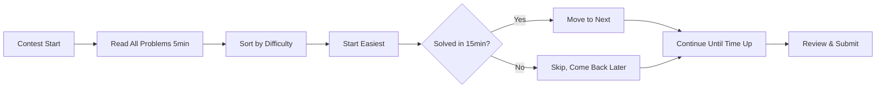

# 24 - Competitive Programming: Strategies and Patterns

## 1. Introduction

Competitive Programming (CP) is a mind sport where participants solve well-defined algorithmic problems under time constraints. It is widely recognized as one of the best training grounds for technical interviews, as it develops problem-solving speed, algorithmic thinking, and coding proficiency under pressure.

Major tech companies including Google (Google Code Jam), Meta (Meta Hacker Cup), and Microsoft actively sponsor CP competitions and recruit top performers. The skills developed in CP — rapid problem analysis, algorithm selection, and clean implementation — directly translate to interview success.

This module covers competitive programming platforms, common problem categories, optimization techniques, contest strategies, and practical templates that will help you excel in both CP competitions and technical interviews.

---

## 2. Learning Roadmap

### Phase 1: Foundations (Month 1-2)
- [ ] Master basic data structures (arrays, strings, hash maps, sets)
- [ ] Learn fundamental algorithms (sorting, searching, two pointers)
- [ ] Understand Big-O notation and complexity analysis
- [ ] Solve 50 problems on Codeforces (rating 800-1200)
- [ ] Set up your development environment for fast coding

### Phase 2: Intermediate (Month 3-4)
- [ ] Learn graph algorithms (BFS, DFS, shortest paths, MST)
- [ ] Master dynamic programming (knapsack, LIS, LCS, interval DP)
- [ ] Study number theory basics (GCD, primes, modular arithmetic)
- [ ] Solve 100 problems on Codeforces (rating 1200-1600)
- [ ] Participate in 5+ contests

### Phase 3: Advanced (Month 5-6)
- [ ] Learn advanced DP (bitmask, digit, tree DP, centroid decomposition)
- [ ] Study advanced graph algorithms (SCC, 2-SAT, flows, matching)
- [ ] Master string algorithms (KMP, Z-function, suffix structures)
- [ ] Learn advanced data structures (segment tree, BIT, sparse table)
- [ ] Solve 50 problems at rating 1600-2000

### Phase 4: Contest Mastery (Month 7+)
- [ ] Regularly participate in Codeforces, AtCoder, and LeetCode contests
- [ ] Upsolve problems you couldn't solve during contests
- [ ] Study editorial solutions from top competitors
- [ ] Develop personal template library
- [ ] Target rating 1800+ on Codeforces

---

## 3. Theory Notes

### 3.1 Competitive Programming vs Interview Coding

| Aspect | Competitive Programming | Interview Coding |
|--------|------------------------|------------------|
| Time Limit | 2-5 hours, multiple problems | 30-45 min, 1-2 problems |
| Problem Type | Algorithmic, mathematical | Design + implementation |
| Input/Output | Custom, optimized | Standard, explained |
| Hints | None | Interviewer may guide |
| Testing | Automated, hidden tests | Manual walkthrough |
| Code Quality | Speed matters most | Readability matters |
| Collaboration | Solo | Paired with interviewer |

### 3.2 Problem-Solving Framework

1. **Read & Understand** (2-3 minutes)
   - Read problem statement carefully
   - Identify input/output format
   - Note constraints — they hint at the solution

2. **Design** (5-10 minutes)
   - Think of the approach
   - Consider edge cases
   - Estimate time/space complexity
   - Verify it fits within constraints

3. **Implement** (15-25 minutes)
   - Write clean, modular code
   - Use templates where possible
   - Handle edge cases

4. **Test & Debug** (5-10 minutes)
   - Test with examples
   - Test edge cases (empty, single element, max values)
   - Debug if needed

### 3.3 Constraint Analysis

Constraints guide your algorithm choice:

| Constraint | Likely Approach |
|-----------|----------------|
| n ≤ 10 | Brute force, all permutations |
| n ≤ 20 | Bitmask DP |
| n ≤ 500 | O(n³) algorithms |
| n ≤ 5000 | O(n²) algorithms |
| n ≤ 10⁵ | O(n log n) algorithms |
| n ≤ 10⁶ | O(n) algorithms |
| n ≤ 10⁹ | O(log n) or O(1) — math/binary search |
| n ≤ 10¹⁸ | O(log n) — matrix exponentiation, math |

---

## 4. Key Concepts

### 4.1 Common Problem Categories

#### Array & String
- Two pointers technique
- Sliding window
- Prefix sums
- Kadane's algorithm (max subarray)
- Sort and greedy

#### Graphs
- BFS/DFS traversal
- Shortest path (Dijkstra, Bellman-Ford, Floyd-Warshall)
- Minimum spanning tree (Kruskal, Prim)
- Strongly connected components (Tarjan's)
- Topological sort
- Bipartite checking

#### Dynamic Programming
- Memoization vs tabulation
- Knapsack variants (0/1, unbounded, bounded)
- Longest common subsequence/substring
- Longest increasing subsequence
- Interval DP
- Digit DP
- Bitmask DP

#### Data Structures
- Union-Find (Disjoint Set Union)
- Segment Tree (range queries + updates)
- Binary Indexed Tree (Fenwick Tree)
- Sparse Table (range queries, no updates)
- Monotonic stack/queue
- Trie

#### Mathematics
- GCD/LCM, modular arithmetic
- Sieve of Eratosthenes
- Combinatorics (nCr, Pascal's triangle)
- Matrix exponentiation
- Game theory (Grundy numbers)

#### Strings
- KMP pattern matching
- Z-function
- Rabin-Karp rolling hash
- Suffix array / Suffix automaton
- Aho-Corasick

### 4.2 Essential Algorithms

#### Binary Search on Answer
```python
def binary_search_answer():
    lo, hi = min_possible, max_possible
    while lo < hi:
        mid = (lo + hi) // 2
        if check(mid):  # Can we achieve 'mid'?
            hi = mid     # Try smaller
        else:
            lo = mid + 1  # Need larger
    return lo
```

#### Two Pointers
```python
def two_pointers(arr, target):
    left, right = 0, len(arr) - 1
    while left < right:
        current = arr[left] + arr[right]
        if current == target:
            return (left, right)
        elif current < target:
            left += 1
        else:
            right -= 1
    return None
```

#### Sliding Window
```python
def sliding_window(arr, k):
    window_sum = sum(arr[:k])
    max_sum = window_sum
    for i in range(k, len(arr)):
        window_sum += arr[i] - arr[i - k]
        max_sum = max(max_sum, window_sum)
    return max_sum
```

#### Segment Tree
```python
class SegmentTree:
    def __init__(self, data):
        self.n = len(data)
        self.tree = [0] * (4 * self.n)
        self.build(data, 1, 0, self.n - 1)
    
    def build(self, data, node, start, end):
        if start == end:
            self.tree[node] = data[start]
        else:
            mid = (start + end) // 2
            self.build(data, 2*node, start, mid)
            self.build(data, 2*node+1, mid+1, end)
            self.tree[node] = self.tree[2*node] + self.tree[2*node+1]
    
    def update(self, node, start, end, idx, val):
        if start == end:
            self.tree[node] = val
        else:
            mid = (start + end) // 2
            if idx <= mid:
                self.update(2*node, start, mid, idx, val)
            else:
                self.update(2*node+1, mid+1, end, idx, val)
            self.tree[node] = self.tree[2*node] + self.tree[2*node+1]
    
    def query(self, node, start, end, l, r):
        if r < start or end < l:
            return 0
        if l <= start and end <= r:
            return self.tree[node]
        mid = (start + end) // 2
        left_sum = self.query(2*node, start, mid, l, r)
        right_sum = self.query(2*node+1, mid+1, end, l, r)
        return left_sum + right_sum
```

### 4.3 Speed Techniques

1. **Use a template library** — Pre-write common structures
2. **Fast I/O** — In Python: `sys.stdin.read()`; In C++: `ios_base::sync_with_stdio(false)`
3. **Copy-paste from templates** — Don't retype common code
4. **Use appropriate data structures** — Hash maps for O(1) lookup
5. **Simplify before coding** — Make sure your approach is correct on paper first

---

## 5. FAQ (20+ Q&A)

**Q1: Which platform is best for competitive programming beginners?**
Codeforces is the most popular platform with problems sorted by difficulty. Start with Div. 3 and Div. 2 problems rated 800-1200. AtCoder has well-curated problems for learning. LeetCode is better for interview preparation specifically.

**Q2: How many problems should I solve to become good at CP?**
There's no magic number, but solving 500+ problems with deliberate practice (upsolving, reading editorials) typically puts you at an intermediate level. Quality matters more than quantity — understanding each solution deeply is key.

**Q3: What is upsolving?**
Upsolving means solving contest problems after the contest ends, using the editorial (solution explanation) for problems you couldn't solve during the contest. It's one of the most effective ways to improve.

**Q4: How do I improve my rating on Codeforces?**
Practice consistently (solve problems daily), participate in every contest, upsolve all problems, study editorial solutions, and focus on your weak areas. Improvement is gradual — expect to plateau before breaking through.

**Q5: Should I focus on competitive programming or interview prep?**
If you're preparing for interviews specifically, focus on interview-style problems (LeetCode, company-tagged questions). If you want strong algorithmic fundamentals, CP is excellent. CP skills transfer well to interviews, but interview-specific practice is also important.

**Q6: What programming language should I use for CP?**
C++ is most popular for CP due to speed and STL. Python is good for prototyping but may be too slow for some problems. Java is acceptable but verbose. Choose one and master it.

**Q7: How do I handle time pressure during contests?**
Practice under timed conditions regularly. Don't spend too long on one problem — skip and come back. Read all problems first to choose the easiest ones. Stay calm and systematic.

**Q8: What is the difference between Div. 1 and Div. 2 on Codeforces?**
Div. 2 is for lower-rated participants (beginners to intermediate). Div. 1 is for higher-rated participants (advanced). Some contests have both divisions. Problems in Div. 1 are harder.

**Q9: How important is it to know advanced data structures?**
For rating 1600+, understanding segment trees, BIT, and union-find is essential. For rating 2000+, you'll need advanced techniques like centroid decomposition, persistent structures, and heavy-light decomposition.

**Q10: What is a greedy algorithm?**
A greedy algorithm makes the locally optimal choice at each step, hoping to find a global optimum. It works when the problem has optimal substructure and the greedy choice property. Not all problems can be solved greedily.

**Q11: How do I know if a problem requires DP or greedy?**
Greedy works when subproblems are independent and locally optimal choices lead to a global optimum. DP is needed when subproblems overlap or when the optimal solution requires considering all combinations. If greedy fails on some test case, try DP.

**Q12: What is the time complexity of Dijkstra's algorithm?**
O((V + E) log V) with a binary heap, or O(V²) with a simple array. With a Fibonacci heap, it's O(E + V log V).

**Q13: When should I use BFS vs DFS?**
BFS finds shortest paths in unweighted graphs and explores level by level. DFS explores as deep as possible first and is useful for cycle detection, topological sort, and connectivity. Use BFS when you need shortest path; DFS when you need to explore all paths.

**Q14: What is a monotonic stack?**
A monotonic stack maintains elements in sorted order (increasing or decreasing). It's useful for finding the next greater/smaller element for each element in an array in O(n) time.

**Q15: How do I debug during a contest?**
Use test cases from the problem statement. Add print statements for debugging. Consider edge cases (empty, single element, max values). If stuck, try a brute force solution to verify your understanding.

**Q16: What is the meet-in-the-middle technique?**
A technique that splits the problem into two halves, solves each independently, and combines results. Used when brute force is O(2^n) but splitting gives O(2^(n/2)). Example: subset sum with n ≤ 40.

**Q17: What is coordinate compression?**
Mapping large coordinate values to smaller consecutive integers while preserving relative order. Used when coordinate ranges are large but the number of distinct coordinates is small. Essential for sweep line algorithms.

**Q18: What is a persistent data structure?**
A data structure that preserves previous versions of itself when modified. Each update creates a new version while sharing structure with old versions. Useful for problems requiring historical queries.

**Q19: How do I handle integer overflow in CP?**
Use `long long` in C++, `long` in Java, or Python's arbitrary precision. Be careful with multiplication before division (use modular arithmetic or divide first when possible). In C++, use `1LL *` prefix for multiplication.

**Q20: What is modulo arithmetic and when do I need it?**
Modulo arithmetic computes remainders. Used when problems ask for answers "modulo 10^9+7" to prevent overflow and keep numbers manageable. Key operations: (a+b)%m, (a*b)%m, modular inverse for division.

---

## 6. Hands-on Practice

### Exercise 1: Two Sum (Easy)
```python
# Given an array of integers and a target, return indices of two numbers that add up to target.
def two_sum(nums, target):
    seen = {}
    for i, num in enumerate(nums):
        complement = target - num
        if complement in seen:
            return [seen[complement], i]
        seen[num] = i
    return []

# Time: O(n), Space: O(n)
```

### Exercise 2: Maximum Subarray (Medium)
```python
# Kadane's Algorithm - O(n)
def max_subarray(nums):
    max_sum = current_sum = nums[0]
    for num in nums[1:]:
        current_sum = max(num, current_sum + num)
        max_sum = max(max_sum, current_sum)
    return max_sum
```

### Exercise 3: Binary Search on Answer
```python
# Minimum capacity to ship all packages within D days
def min_ship_capacity(weights, D):
    def can_ship(capacity):
        days = 1
        current = 0
        for w in weights:
            if current + w > capacity:
                days += 1
                current = w
            else:
                current += w
        return days <= D
    
    lo, hi = max(weights), sum(weights)
    while lo < hi:
        mid = (lo + hi) // 2
        if can_ship(mid):
            hi = mid
        else:
            lo = mid + 1
    return lo
```

### Exercise 4: Graph BFS
```python
from collections import deque

def shortest_path(grid, start, end):
    rows, cols = len(grid), len(grid[0])
    queue = deque([(start, 0)])
    visited = {start}
    
    while queue:
        (r, c), dist = queue.popleft()
        if (r, c) == end:
            return dist
        
        for dr, dc in [(-1,0),(1,0),(0,-1),(0,1)]:
            nr, nc = r + dr, c + dc
            if (0 <= nr < rows and 0 <= nc < cols and 
                (nr, nc) not in visited and grid[nr][nc] != 1):
                visited.add((nr, nc))
                queue.append(((nr, nc), dist + 1))
    
    return -1
```

### Exercise 5: Union-Find
```python
class UnionFind:
    def __init__(self, n):
        self.parent = list(range(n))
        self.rank = [0] * n
    
    def find(self, x):
        if self.parent[x] != x:
            self.parent[x] = self.find(self.parent[x])
        return self.parent[x]
    
    def union(self, x, y):
        px, py = self.find(x), self.find(y)
        if px == py:
            return False
        if self.rank[px] < self.rank[py]:
            px, py = py, px
        self.parent[py] = px
        if self.rank[px] == self.rank[py]:
            self.rank[px] += 1
        return True
```

---

## 7. FAANG Questions

### Google (Code Jam)
1. **"Find the minimum number of operations to transform one string to another, where each operation can swap any two characters."**
   - This is equivalent to finding the minimum number of swaps, which relates to cycle decomposition in permutation graphs.

2. **"Given a grid with obstacles, find the shortest path from top-left to bottom-right moving only right and down."**
   - Classic DP or BFS problem. DP: dp[i][j] = min(dp[i-1][j], dp[i][j-1]) + cost.

### Meta (Hacker Cup)
3. **"Given a list of meeting intervals, find the minimum number of rooms needed."**
   - Sort by start time, use a min-heap to track end times. O(n log n).

4. **"Find the longest palindromic substring."**
   - Expand around center approach: O(n²) time, O(1) space. Or Manacher's algorithm: O(n).

### Amazon
5. **"Given a binary tree, find the maximum path sum."**
   - DFS returning max single-path sum while tracking global max path sum.

### Apple
6. **"Design a data structure that supports insert, delete, and getRandom in O(1)."**
   - Hash map + array combination.

---

## 8. Common Mistakes

### Mistake 1: Not Reading Constraints Carefully
**Problem:** Implementing O(n²) when constraints require O(n log n).
**Fix:** Always check constraints first and determine the required complexity before coding.

### Mistake 2: Off-By-One in Loop Bounds
**Problem:** Loop runs one too many or too few times.
**Fix:** Double-check loop boundaries. Test with small inputs manually.

### Mistake 3: Forgetting Edge Cases
**Problem:** Solution works for normal inputs but fails on empty arrays, single elements, or maximum values.
**Fix:** Always consider: empty input, single element, all same, all different, maximum size, negative numbers.

### Mistake 4: Integer Overflow
**Problem:** Multiplying two large numbers overflows before taking modulo.
**Fix:** Use `long long` in C++, take modulo after each operation, use `1LL *` prefix.

### Mistake 5: Wrong Complexity
**Problem:** Code is too slow despite "correct" algorithm.
**Fix:** Profile your code. Check for hidden O(n) operations inside loops. Verify your complexity analysis.

### Mistake 6: Not Using Fast I/O
**Problem:** TLE on large input/output.
**Fix:** Use `sys.stdin.buffer.read()` in Python, `scanf/printf` in C++, `BufferedReader` in Java.

### Mistake 7: Modulo Errors
**Problem:** Negative modulo results in wrong answer.
**Fix:** Use `((a % m) + m) % m` to ensure non-negative result.

### Mistake 8: Copying Wrong Template
**Problem:** Using segment tree when BIT suffices, or vice versa.
**Fix:** Understand what each data structure does before using it. Match the problem requirements.

---

## 9. Best Practices

### Before Contest
- Set up your IDE with templates and snippets
- Test your fast I/O setup
- Review your template library
- Get comfortable (snacks, water, comfortable chair)
- Read recent contest editorials for practice

### During Contest
1. Read all problems first (5 minutes)
2. Start with the easiest problem (build confidence)
3. Don't spend more than 20 minutes stuck — skip and come back
4. Test with examples before submitting
5. Keep track of time
6. Don't panic if you can't solve everything

### After Contest
1. Upsolve problems you missed
2. Read editorials for all problems
3. Study top contestants' solutions
4. Note what you learned and what to improve
5. Track your progress (rating graph, problem categories)

### General
- Practice consistently (at least 1 problem/day)
- Focus on understanding, not just solving
- Diversify problem types (don't just do one category)
- Learn from others' solutions
- Maintain a personal template library

---

## 10. Cheat Sheet

```
COMPETITIVE PROGRAMMING QUICK REFERENCE
========================================

TIME COMPLEXITY GUIDELINES:
  n ≤ 10      → O(n!) brute force
  n ≤ 20      → O(2^n) bitmask DP
  n ≤ 500     → O(n^3) Floyd-Warshall
  n ≤ 5000    → O(n^2) DP
  n ≤ 10^5    → O(n log n) sorting, segment tree
  n ≤ 10^6    → O(n) linear scan
  n ≤ 10^9    → O(log n) binary search
  n ≤ 10^18   → O(log n) matrix exponentiation

COMMON ALGORITHMS & COMPLEXITIES:
  Sorting:           O(n log n)
  Binary Search:     O(log n)
  BFS/DFS:           O(V + E)
  Dijkstra:          O((V+E) log V)
  Kruskal/Prim:      O(E log E)
  Knapsack:          O(n * W)
  LIS:               O(n log n)
  LCS:               O(n * m)
  Union-Find:        O(α(n)) ≈ O(1) amortized
  Segment Tree:      O(log n) per query/update

PYTHON FAST I/O:
  import sys
  input = sys.stdin.readline
  data = sys.stdin.buffer.read().split()

C++ FAST I/O:
  ios_base::sync_with_stdio(false);
  cin.tie(NULL);

MODULAR ARITHMETIC:
  MOD = 10**9 + 7
  (a + b) % m = (a%m + b%m) % m
  (a * b) % m = (a%m * b%m) % m
  a / b mod m = a * pow(b, m-2, m) mod m  (Fermat's little theorem)

USEFUL FORMULAS:
  nCr = n! / (r! * (n-r)!)
  Sum 1 to n = n*(n+1)/2
  Sum of GP = a*(r^n - 1)/(r - 1)
```

---

## 11. Flash Cards

**Card 1:** What is the time complexity of Dijkstra's algorithm with a binary heap?
**Answer:** O((V + E) log V)

**Card 2:** When should you use BFS over DFS?
**Answer:** When you need the shortest path in an unweighted graph, or when exploring level by level is more natural.

**Card 3:** What is Kadane's algorithm used for?
**Answer:** Finding the maximum subarray sum in O(n) time.

**Card 4:** What is the time complexity of Union-Find with path compression and union by rank?
**Answer:** O(α(n)) per operation, where α is the inverse Ackermann function (effectively O(1)).

**Card 5:** What is coordinate compression?
**Answer:** Mapping large coordinate values to smaller consecutive integers to enable array-based data structures.

**Card 6:** What is a monotonic stack used for?
**Answer:** Finding the next greater or smaller element for each element in an array in O(n) time.

**Card 7:** What is the meet-in-the-middle technique?
**Answer:** Splitting the problem into two halves, solving each independently, and combining results to reduce O(2^n) to O(2^(n/2)).

**Card 8:** How do you detect a cycle in a directed graph?
**Answer:** DFS with three states (unvisited, in progress, completed), or topological sort using Kahn's algorithm.

**Card 9:** What is the purpose of the Z-function?
**Answer:** Computing the longest common prefix between a string and each of its suffixes in O(n) time.

**Card 10:** When do you use binary search on answer?
**Answer:** When the answer space is monotonic (if x works, then x+1 also works, or vice versa) and you can check feasibility in polynomial time.

**Card 11:** What is the time complexity of building a segment tree?
**Answer:** O(n)

**Card 12:** How do you find the shortest path in a weighted graph with negative edges?
**Answer:** Bellman-Ford algorithm in O(V * E). Dijkstra doesn't work with negative edges.

**Card 13:** What is the difference between 0/1 knapsack and unbounded knapsack?
**Answer:** 0/1 knapsack: each item can be taken at most once (O(nW)). Unbounded: items can be taken unlimited times (also O(nW) but different recurrence).

**Card 14:** What is Tarjan's algorithm used for?
**Answer:** Finding Strongly Connected Components (SCCs) in a directed graph in O(V + E) time.

**Card 15:** What is a Fenwick Tree (Binary Indexed Tree)?
**Answer:** A data structure supporting prefix sum queries and point updates in O(log n) time, using O(n) space.

**Card 16:** How do you find the GCD of two numbers efficiently?
**Answer:** Euclidean algorithm: gcd(a, b) = gcd(b, a % b), runs in O(log(min(a,b))) time.

**Card 17:** What is the Sieve of Eratosthenes?
**Answer:** An algorithm to find all primes up to n in O(n log log n) time.

**Card 18:** What is Manacher's algorithm?
**Answer:** An algorithm to find all palindromic substrings of a string in O(n) time.

**Card 19:** What is the difference between a segment tree and a Fenwick tree?
**Answer:** Both support prefix sums and point updates in O(log n). Segment tree is more versatile (range updates, arbitrary operations). Fenwick tree is simpler and faster in practice.

**Card 20:** What is a topological sort?
**Answer:** A linear ordering of vertices in a DAG such that for every edge (u,v), u comes before v. Can be done with DFS or Kahn's algorithm in O(V + E).

---

## 12. Mind Map

```
                    COMPETITIVE PROGRAMMING
                            |
        ┌───────────────────┼───────────────────┐
        |                   |                   |
   PROBLEM TYPES        TECHNIQUES          PLATFORMS
        |                   |                   |
  ┌─────┼─────┐     ┌──────┼──────┐     ┌──────┼──────┐
  |     |     |     |      |      |     |      |      |
 Array Graph  DP  Greedy  Binary  Two  Code-  AtCoder Leet-
 & Str       |     Search Point-  forces       Code
  |     Short- |     |    ers
 Two   est   Knapsack| Binary   Sliding
 Ptr   Path  LCS  BIT/  Search  Window
 Kadane| MST  LIS  Seg  on
 Prefix     |    Tree Answer
 Sum     Union-
         Find
```

---

## 13. Mermaid Diagrams

### Problem-Solving Framework

```mermaid
flowchart TD
    A[Read Problem] --> B[Identify Constraints]
    B --> C{n ≤ 10?}
    C -->|Yes| D[Brute Force]
    C -->|No| E{n ≤ 10^5?}
    E -->|Yes| F[O(n log n) approach]
    E -->|No| G{n ≤ 10^9?}
    G -->|Yes| H[O(log n) or math]
    G -->|No| I[O(1) formula]
    D --> J[Implement]
    F --> J
    H --> J
    I --> J
    J --> K[Test Examples]
    K --> L[Test Edge Cases]
    L --> M{All Pass?}
    M -->|Yes| N[Submit]
    M -->|No| O[Debug]
    O --> K
```

### Data Structure Selection

```mermaid
graph TD
    A[Need range query?] --> B{Need updates?}
    B -->|No| C[Sparse Table O(1) query]
    B -->|Yes| D{What operation?}
    D -->|Sum| E[Fenwick Tree]
    D -->|Min/Max| F[Segment Tree]
    D -->|Custom| G[Segment Tree]
    A --> H[Need point query?]
    H --> I[Fenwick Tree]
    A --> J[Need union/find?]
    J --> K[Union-Find]
    A --> L[Need pattern matching?]
    L --> M[KMP / Z-function]
```

### Contest Strategy



---

## 14. Code Examples

### Example 1: Dijkstra's Shortest Path

```python
import heapq
from collections import defaultdict

def dijkstra(graph, start, n):
    dist = [float('inf')] * n
    dist[start] = 0
    pq = [(0, start)]
    
    while pq:
        d, u = heapq.heappop(pq)
        if d > dist[u]:
            continue
        for v, w in graph[u]:
            if dist[u] + w < dist[v]:
                dist[v] = dist[u] + w
                heapq.heappush(pq, (dist[v], v))
    
    return dist

# Usage
graph = defaultdict(list)
edges = [(0, 1, 4), (0, 2, 1), (2, 1, 2), (1, 3, 1)]
for u, v, w in edges:
    graph[u].append((v, w))
    graph[v].append((u, w))

distances = dijkstra(graph, 0, 4)
print(distances)  # [0, 3, 1, 4]
```

### Example 2: Longest Common Subsequence

```python
def lcs(text1, text2):
    m, n = len(text1), len(text2)
    dp = [[0] * (n + 1) for _ in range(m + 1)]
    
    for i in range(1, m + 1):
        for j in range(1, n + 1):
            if text1[i-1] == text2[j-1]:
                dp[i][j] = dp[i-1][j-1] + 1
            else:
                dp[i][j] = max(dp[i-1][j], dp[i][j-1])
    
    return dp[m][n]

print(lcs("abcde", "ace"))  # 3
```

### Example 3: Segment Tree Range Sum

```python
class SegmentTree:
    def __init__(self, data):
        self.n = len(data)
        self.tree = [0] * (4 * self.n)
        self._build(data, 1, 0, self.n - 1)
    
    def _build(self, data, node, start, end):
        if start == end:
            self.tree[node] = data[start]
        else:
            mid = (start + end) // 2
            self._build(data, 2*node, start, mid)
            self._build(data, 2*node+1, mid+1, end)
            self.tree[node] = self.tree[2*node] + self.tree[2*node+1]
    
    def _update(self, node, start, end, idx, val):
        if start == end:
            self.tree[node] = val
        else:
            mid = (start + end) // 2
            if idx <= mid:
                self._update(2*node, start, mid, idx, val)
            else:
                self._update(2*node+1, mid+1, end, idx, val)
            self.tree[node] = self.tree[2*node] + self.tree[2*node+1]
    
    def update(self, idx, val):
        self._update(1, 0, self.n-1, idx, val)
    
    def _query(self, node, start, end, l, r):
        if r < start or end < l:
            return 0
        if l <= start and end <= r:
            return self.tree[node]
        mid = (start + end) // 2
        return (self._query(2*node, start, mid, l, r) + 
                self._query(2*node+1, mid+1, end, l, r))
    
    def query(self, l, r):
        return self._query(1, 0, self.n-1, l, r)

# Usage
st = SegmentTree([1, 3, 5, 7, 9, 11])
print(st.query(1, 3))  # 15 (3+5+7)
st.update(1, 10)
print(st.query(1, 3))  # 22 (10+5+7)
```

### Example 4: KMP Pattern Matching

```python
def kmp_search(text, pattern):
    def build_lps(pattern):
        lps = [0] * len(pattern)
        length = 0
        i = 1
        while i < len(pattern):
            if pattern[i] == pattern[length]:
                length += 1
                lps[i] = length
                i += 1
            else:
                if length != 0:
                    length = lps[length - 1]
                else:
                    lps[i] = 0
                    i += 1
        return lps
    
    lps = build_lps(pattern)
    i = j = 0
    results = []
    
    while i < len(text):
        if text[i] == pattern[j]:
            i += 1
            j += 1
        if j == len(pattern):
            results.append(i - j)
            j = lps[j - 1]
        elif i < len(text) and text[i] != pattern[j]:
            if j != 0:
                j = lps[j - 1]
            else:
                i += 1
    
    return results

print(kmp_search("ABABDABACDABABCABAB", "ABABCABAB"))  # [9]
```

---

## 15. Projects

### Project 1: Personal Template Library
Create a collection of ready-to-use code templates:
- Data structures (segment tree, BIT, union-find, trie)
- Graph algorithms (Dijkstra, BFS, DFS, topological sort)
- String algorithms (KMP, Z-function, suffix array)
- Math (GCD, modular exponentiation, sieve)
- DP templates (knapsack, LIS, LCS)

### Project 2: Practice Tracker
Build a system to:
- Track problems solved with difficulty ratings
- Log time taken and approach used
- Generate weekly progress reports
- Identify weak areas for focused practice
- Visualize rating progression

### Project 3: Problem Recommendation Engine
Create a tool that:
- Analyzes your solved problems
- Identifies weak categories
- Recommends problems at the right difficulty
- Schedules spaced repetition for review
- Tracks improvement over time

---

## 16. Resources

### Books
- "Competitive Programming" by Steven Halim
- "Algorithm Design Manual" by Steven Skiena
- "Introduction to Algorithms" (CLRS)
- "Competitive Programmer's Handbook" by Antti Laaksonen (free PDF)

### Online Platforms
- [Codeforces](https://codeforces.com/) — Most popular CP platform
- [AtCoder](https://atcoder.jp/) — Well-curated problems
- [LeetCode](https://leetcode.com/) — Interview-focused
- [CSES Problem Set](https://cses.fi/problemset/) — Finnish Olympiad problems
- [USACO Guide](https://usaco.guide/) — Structured learning

### YouTube Channels
- [Errichto](https://www.youtube.com/@Errichto) — CP tutorials and contest solutions
- [William Lin](https://www.youtube.com/@WilliamLin) — Live contest solutions
- [SecondThread](https://www.youtube.com/@SecondThread) — Problem explanations
- [NeetCode](https://www.youtube.com/@NeetCode) — LeetCode solutions

### Practice Problem Sets
- CSES Problem Set (300+ problems, structured by topic)
- Codeforces Problem Set (sorted by rating and topic)
- LeetCode Top 150 Interview Questions
- USACO Training Pages

---

## 17. Checklist

### Pre-Contest
- [ ] IDE set up with templates
- [ ] Fast I/O configured and tested
- [ ] Template library reviewed
- [ ] Comfortable environment prepared
- [ ] Recent editorial solutions reviewed

### During Contest
- [ ] Read all problems first
- [ ] Start with easiest problem
- [ ] Test examples before submitting
- [ ] Don't get stuck — skip and come back
- [ ] Monitor time

### Post-Contest
- [ ] Upsolve all missed problems
- [ ] Read all editorials
- [ ] Study top solutions
- [ ] Note lessons learned
- [ ] Update practice tracker

---

## 18. Revision Plans

### Week 1: Arrays & Strings
- Solve 10 two-pointer problems
- Solve 10 sliding window problems
- Solve 10 prefix sum problems
- Review complexity analysis

### Week 2: Graphs
- Implement BFS and DFS from scratch
- Solve 5 shortest path problems
- Solve 5 MST problems
- Practice topological sort

### Week 3: Dynamic Programming
- Solve 5 knapsack variants
- Solve 5 LCS/LIS problems
- Solve 5 interval DP problems
- Review memoization vs tabulation

### Week 4: Data Structures
- Implement segment tree
- Implement union-find
- Solve 5 segment tree problems
- Practice binary search on answer

### Week 5: Strings
- Implement KMP and Z-function
- Solve 5 string matching problems
- Practice rolling hash techniques

### Week 6: Contest Practice
- Participate in 3+ contests
- Upsolve all problems
- Review and document patterns learned

---

## 19. Mock Interviews

### Mock Interview 1: Two Sum Variation
**Interviewer:** Given an array of integers and a target sum, find all unique pairs that sum to the target.

```python
def find_pairs(nums, target):
    seen = set()
    pairs = set()
    for num in nums:
        complement = target - num
        if complement in seen:
            pair = (min(num, complement), max(num, complement))
            pairs.add(pair)
        seen.add(num)
    return list(pairs)
```

### Mock Interview 2: Graph Problem
**Interviewer:** Given a network of n nodes and edges with weights, find the minimum cost to connect all nodes.

### Mock Interview 3: DP Problem
**Interviewer:** Given coins of different denominations and a target amount, find the minimum number of coins needed.

```python
def coin_change(coins, amount):
    dp = [float('inf')] * (amount + 1)
    dp[0] = 0
    for i in range(1, amount + 1):
        for coin in coins:
            if coin <= i and dp[i - coin] + 1 < dp[i]:
                dp[i] = dp[i - coin] + 1
    return dp[amount] if dp[amount] != float('inf') else -1
```

---

## 20. Difficulty Rating

| Topic | Difficulty | Problems to Master |
|-------|-----------|-------------------|
| Arrays & Strings | ⭐ (1/5) | 50 |
| Two Pointers | ⭐⭐ (2/5) | 20 |
| Sliding Window | ⭐⭐ (2/5) | 15 |
| Binary Search | ⭐⭐ (2/5) | 20 |
| BFS/DFS | ⭐⭐⭐ (3/5) | 30 |
| Dynamic Programming | ⭐⭐⭐⭐ (4/5) | 100+ |
| Graph Algorithms | ⭐⭐⭐⭐ (4/5) | 50+ |
| Segment Trees | ⭐⭐⭐⭐ (4/5) | 20 |
| String Algorithms | ⭐⭐⭐⭐ (4/5) | 30 |
| Advanced Topics | ⭐⭐⭐⭐⭐ (5/5) | 50+ |

---

## 21. Summary

Competitive programming develops essential algorithmic thinking and coding speed. Key takeaways:

1. **Understand constraints** — They tell you which algorithms to use
2. **Practice consistently** — Solve problems daily, not cramming
3. **Upsolve everything** — Learn from problems you couldn't solve during contests
4. **Build templates** — Reuse proven code to save time
5. **Stay calm under pressure** — Practice timed conditions regularly
6. **Learn patterns** — Most problems map to known algorithmic patterns

The skills from CP directly transfer to technical interviews: rapid problem analysis, algorithm selection, clean implementation, and the ability to work under time pressure. Combine CP practice with interview-specific preparation for the best results.
