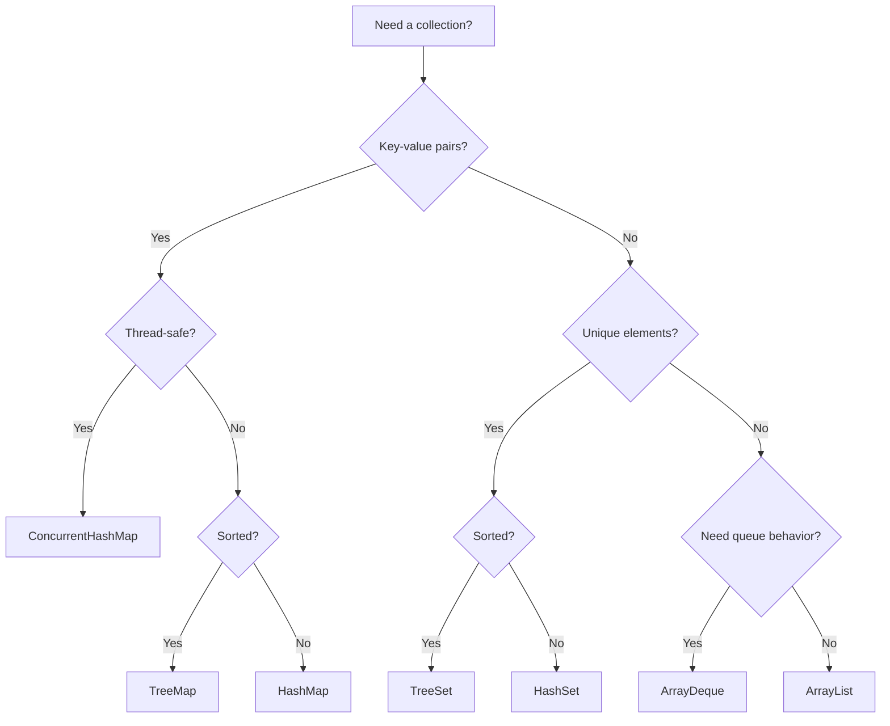
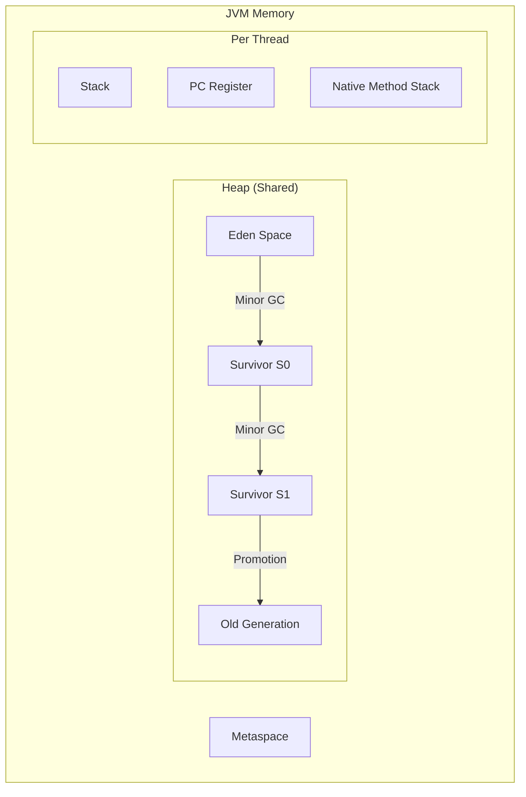
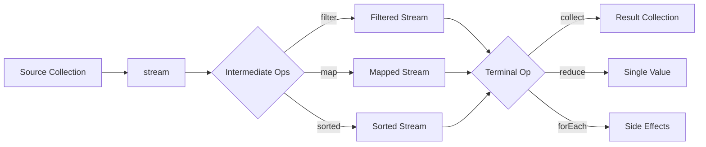

# 28 - Java: Programming for Interviews

## 1. Introduction

Java is one of the most widely used languages in enterprise software development and a staple of technical interviews at FAANG companies. Its strong type system, rich collections framework, and widespread use in backend systems make it a frequent choice for interviewers.

Java interviews test not only algorithmic thinking but also your understanding of the language's internals — the Collections Framework, generics, concurrency model, memory management, and modern features like lambdas and streams. Companies like Amazon, Google, Microsoft, and Uber have Java-heavy codebases and specifically evaluate Java proficiency.

This module covers Java collections, threading, generics, exceptions, JVM internals, memory management, Java 8+ features, design patterns, and common Java interview questions. Mastering these topics will help you write clean, efficient Java code in interviews and production.

---

## 2. Learning Roadmap

### Phase 1: Fundamentals (Week 1-2)
- [ ] Master Java syntax and OOP concepts
- [ ] Learn the Collections Framework (List, Set, Map)
- [ ] Understand exception handling and try-with-resources
- [ ] Practice string manipulation and StringBuilder
- [ ] Solve 20 basic Java interview questions

### Phase 2: Intermediate (Week 3-4)
- [ ] Master generics and type bounds
- [ ] Learn Java 8+ features (lambdas, streams, Optional)
- [ ] Understand threading basics (Thread, Runnable, synchronized)
- [ ] Practice with ConcurrentHashMap, BlockingQueue
- [ ] Solve 20 intermediate Java interview questions

### Phase 3: Advanced (Week 5-6)
- [ ] Study JVM internals (memory model, garbage collection)
- [ ] Learn concurrency utilities (ExecutorService, CompletableFuture)
- [ ] Understand design patterns in Java (Singleton, Factory, Observer)
- [ ] Master Java memory management and leak detection
- [ ] Study class loading and reflection

### Phase 4: Interview Mastery (Week 7-8)
- [ ] Solve 30+ Java-specific interview questions
- [ ] Practice whiteboard coding in Java
- [ ] Study Java internals for system design interviews
- [ ] Mock interviews with Java-focused questions
- [ ] Review Java best practices and anti-patterns

---

## 3. Theory Notes

### 3.1 Java Collections Framework

```
Collection
├── List (ordered, duplicates allowed)
│   ├── ArrayList (array-based, O(1) get, O(n) insert)
│   ├── LinkedList (doubly-linked, O(1) insert/delete)
│   └── Vector (synchronized ArrayList, legacy)
├── Set (no duplicates)
│   ├── HashSet (hash-based, O(1) operations, unordered)
│   ├── LinkedHashSet (hash + linked list, insertion order)
│   └── TreeSet (red-black tree, O(log n), sorted)
├── Queue (FIFO)
│   ├── PriorityQueue (heap-based, O(log n) add/poll)
│   ├── ArrayDeque (array-based, faster than Stack/LinkedList)
│   └── LinkedList (also implements Queue)
└── Map (key-value pairs)
    ├── HashMap (hash-based, O(1) operations)
    ├── LinkedHashMap (hash + linked list, insertion order)
    ├── TreeMap (red-black tree, O(log n), sorted by key)
    ├── ConcurrentHashMap (thread-safe, segment locking)
    └── Hashtable (synchronized, legacy)
```

### 3.2 Time Complexity Summary

| Operation | ArrayList | LinkedList | HashMap | TreeMap | HashSet | TreeSet |
|-----------|-----------|------------|---------|---------|---------|---------|
| get(i) | O(1) | O(n) | N/A | N/A | N/A | N/A |
| add | O(1)* | O(1) | O(1) | O(log n) | O(1) | O(log n) |
| remove | O(n) | O(1)† | O(1) | O(log n) | O(1) | O(log n) |
| contains | O(n) | O(n) | O(1) | O(log n) | O(1) | O(log n) |
| size | O(1) | O(1) | O(1) | O(1) | O(1) | O(1) |

*amortized; †given reference to node

### 3.3 Java 8+ Features

**Lambdas:**
```java
// Before
list.sort(new Comparator<String>() {
    @Override
    public int compare(String a, String b) {
        return a.length() - b.length();
    }
});

// After (lambda)
list.sort((a, b) -> a.length() - b.length());

// After (method reference)
list.sort(Comparator.comparingInt(String::length));
```

**Streams:**
```java
List<String> names = employees.stream()
    .filter(e -> e.getSalary() > 50000)
    .map(Employee::getName)
    .sorted()
    .collect(Collectors.toList());
```

**Optional:**
```java
String result = Optional.ofNullable(user)
    .map(User::getEmail)
    .orElse("unknown@email.com");
```

### 3.4 Generics Type Erasure

Java generics are implemented via type erasure — generic type information is removed at compile time. `List<String>` and `List<Integer>` are both `List` at runtime. This means:
- You can't use `instanceof` with generic types
- You can't create generic arrays
- You can't use primitives as type parameters (use wrapper classes)

---

## 4. Key Concepts

### 4.1 Collections Deep Dive

```java
// HashMap internals (Java 8+)
// Array of buckets → linked list → tree (when bucket size > 8)
// Load factor: 0.75 (default), resize when threshold exceeded

// ConcurrentHashMap
// Java 7: Segment locking (lock striping)
// Java 8+: CAS + synchronized on individual buckets

// When to use what?
// ArrayList vs LinkedList: ArrayList is almost always better
// HashMap vs TreeMap: HashMap unless you need sorted keys
// HashSet vs TreeSet: HashSet unless you need sorted elements
// ArrayDeque vs LinkedList as queue: ArrayDeque is faster
```

### 4.2 Threading and Concurrency

```java
// Thread creation
Thread t = new Thread(() -> {
    System.out.println("Running in thread: " + Thread.currentThread().getName());
});
t.start();

// ExecutorService
ExecutorService executor = Executors.newFixedThreadPool(4);
Future<String> future = executor.submit(() -> {
    return "Result from thread";
});
String result = future.get(); // Blocks until done

// CompletableFuture (Java 8+)
CompletableFuture.supplyAsync(() -> fetchData())
    .thenApply(data -> process(data))
    .thenAccept(result -> System.out.println(result));

// synchronized block
private final Object lock = new Object();

synchronized (lock) {
    // critical section
}

// volatile keyword
private volatile boolean running = true;
// Ensures visibility across threads
```

### 4.3 Memory Management

```
JVM Memory Areas:
├── Heap (shared)
│   ├── Young Generation
│   │   ├── Eden Space (new objects)
│   │   └── Survivor Spaces (S0, S1)
│   └── Old Generation (long-lived objects)
├── Method Area / Metaspace (class metadata)
├── Stack (per thread, local variables)
├── Program Counter Register (per thread)
└── Native Method Stack (per thread)
```

**Garbage Collectors:**
- **Serial GC:** Single-threaded, small apps
- **Parallel GC:** Multi-threaded, throughput-focused
- **G1 GC:** Default since Java 9, balanced latency/throughput
- **ZGC:** Ultra-low latency (< 10ms pauses)

### 4.4 Exception Handling

```java
// Try-with-resources (AutoCloseable)
try (var connection = dataSource.getConnection();
     var statement = connection.prepareStatement(sql)) {
    var rs = statement.executeQuery();
    // process results
} // Auto-closed in reverse order

// Multi-catch
try {
    // code
} catch (IOException | SQLException e) {
    // handle both
}

// Custom exceptions
public class BusinessException extends Exception {
    private final String errorCode;
    
    public BusinessException(String message, String errorCode) {
        super(message);
        this.errorCode = errorCode;
    }
}
```

---

## 5. FAQ (20+ Q&A)

**Q1: What is the difference between ArrayList and LinkedList?**
ArrayList uses a resizable array — O(1) random access, O(n) insertion/deletion in middle. LinkedList uses doubly-linked nodes — O(1) insertion/deletion at known positions, O(n) random access. ArrayList is almost always preferred due to cache locality.

**Q2: What is the difference between HashMap and Hashtable?**
HashMap is not synchronized (faster, not thread-safe). Hashtable is synchronized (slower, thread-safe). Use ConcurrentHashMap for thread-safe maps. HashMap allows null keys/values; Hashtable doesn't.

**Q3: What is the difference between == and .equals()?**
`==` compares references (same object in memory). `.equals()` compares values/content. Override `.equals()` and `.hashCode()` together when defining equality for your classes.

**Q4: What is the purpose of hashCode()?**
Used by hash-based collections (HashMap, HashSet) to determine bucket placement. Equal objects must have equal hash codes. If you override `.equals()`, you must override `.hashCode()`.

**Q5: What are the principles of SOLID?**
S — Single Responsibility: One class, one job. O — Open/Closed: Open for extension, closed for modification. L — Liskov Substitution: Subtypes must be substitutable. I — Interface Segregation: Many specific interfaces. D — Dependency Inversion: Depend on abstractions.

**Q6: What is the difference between abstract class and interface?**
Abstract class can have constructors, instance variables, and both abstract and concrete methods. Interface (Java 8+) can have default and static methods but no instance state. A class can implement multiple interfaces but extend only one class.

**Q7: What is the diamond problem and how does Java solve it?**
When a class inherits from two sources with the same method. Java resolves it by: interface default methods are overridden by class methods, and if two interfaces conflict, the class must explicitly override.

**Q8: What are generics and type erasure?**
Generics provide compile-time type safety. Type erasure removes generic type information at runtime. `List<String>` becomes `List` at runtime. This means no `instanceof List<String>` or `new T()`.

**Q9: What is the difference between fail-fast and fail-safe iterators?**
Fail-fast (ArrayList, HashMap) throw ConcurrentModificationException if collection modified during iteration. Fail-safe (CopyOnWriteArrayList, ConcurrentHashMap) work on a copy and don't throw exceptions.

**Q10: What is the Java Memory Model?**
Defines how threads interact through memory. Key concepts: happens-before relationship, volatile visibility, synchronized mutual exclusion, and atomic variables. Ensures predictable behavior in concurrent code.

**Q11: What is a volatile variable?**
Ensures that reads and writes go directly to main memory, not CPU cache. Guarantees visibility across threads. Does NOT guarantee atomicity (use Atomic classes for that).

**Q12: What is the difference between String, StringBuilder, and StringBuffer?**
String is immutable (creates new objects on concatenation). StringBuilder is mutable, not thread-safe (fastest). StringBuffer is mutable, thread-safe (slower due to synchronization). Use StringBuilder in most cases.

**Q13: What is autoboxing and unboxing?**
Autoboxing: automatic conversion from primitive to wrapper (int → Integer). Unboxing: wrapper to primitive (Integer → int). Can cause performance overhead and NPE with null values.

**Q14: What is the difference between Comparable and Comparator?**
Comparable defines natural ordering (implements `compareTo()` on the class itself). Comparator defines custom ordering (separate class with `compare()` method). Use Comparator when you can't modify the class or need multiple orderings.

**Q15: What is a thread pool?**
A pool of pre-created threads that execute tasks from a queue. Avoids the overhead of creating/destroying threads. Created via `Executors.newFixedThreadPool(n)` or `ThreadPoolExecutor`.

**Q16: What is a deadlock?**
Two or more threads blocked forever, each waiting for the other's lock. Prevention: lock ordering, tryLock with timeout, avoid nested locks.

**Q17: What is the difference between Serializable and Parcelable?**
Serializable uses reflection (slow, easy to implement). Parcelable is Android-specific, faster, manual implementation. For Java interviews, focus on Serializable and its `serialVersionUID`.

**Q18: What are functional interfaces?**
Interfaces with exactly one abstract method, usable with lambda expressions. Examples: `Runnable`, `Callable`, `Comparator`, `Function`, `Predicate`. Annotated with `@FunctionalInterface`.

**Q19: What is the Stream API?**
A declarative way to process collections of data. Supports lazy evaluation, functional-style operations (filter, map, reduce), and parallel processing. Streams are single-use.

**Q20: What is Optional?**
A container that may or may not hold a non-null value. Prevents NullPointerException by forcing explicit handling of absent values. Use `Optional.of()`, `Optional.ofNullable()`, `Optional.empty()`.

---

## 6. Hands-on Practice

### Exercise 1: LRU Cache (Java)
```java
import java.util.LinkedHashMap;
import java.util.Map;

class LRUCache<K, V> extends LinkedHashMap<K, V> {
    private final int capacity;
    
    public LRUCache(int capacity) {
        super(capacity, 0.75f, true); // access-order
        this.capacity = capacity;
    }
    
    @Override
    protected boolean removeEldestEntry(Map.Entry<K, V> eldest) {
        return size() > capacity;
    }
}
```

### Exercise 2: Thread-Safe Singleton
```java
public class Singleton {
    private static volatile Singleton instance;
    
    private Singleton() {}
    
    public static Singleton getInstance() {
        if (instance == null) {
            synchronized (Singleton.class) {
                if (instance == null) {
                    instance = new Singleton();
                }
            }
        }
        return instance;
    }
}
```

### Exercise 3: Producer-Consumer
```java
import java.util.concurrent.*;

public class ProducerConsumer {
    private static final BlockingQueue<Integer> queue = new ArrayBlockingQueue<>(10);
    
    public static void main(String[] args) {
        Thread producer = new Thread(() -> {
            try {
                for (int i = 0; i < 20; i++) {
                    queue.put(i);
                    System.out.println("Produced: " + i);
                    Thread.sleep(100);
                }
            } catch (InterruptedException e) {
                Thread.currentThread().interrupt();
            }
        });
        
        Thread consumer = new Thread(() -> {
            try {
                while (true) {
                    int item = queue.take();
                    System.out.println("Consumed: " + item);
                }
            } catch (InterruptedException e) {
                Thread.currentThread().interrupt();
            }
        });
        
        producer.start();
        consumer.start();
    }
}
```

### Exercise 4: Stream Operations
```java
import java.util.*;
import java.util.stream.*;

public class StreamExample {
    public static void main(String[] args) {
        List<String> names = Arrays.asList(
            "Alice", "Bob", "Charlie", "David", "Eve"
        );
        
        // Filter, sort, collect
        List<String> result = names.stream()
            .filter(name -> name.length() > 3)
            .sorted(Comparator.reverseOrder())
            .collect(Collectors.toList());
        
        // Grouping
        Map<Integer, List<String>> byLength = names.stream()
            .collect(Collectors.groupingBy(String::length));
        
        // Sum
        int totalChars = names.stream()
            .mapToInt(String::length)
            .sum();
        
        // Joining
        String joined = names.stream()
            .collect(Collectors.joining(", "));
    }
}
```

---

## 7. FAANG Questions

### Google
1. **"Implement a thread-safe LRU Cache."**
   - Use ConcurrentHashMap + doubly-linked list, or LinkedHashMap with synchronized access.

2. **"Explain Java's memory model and happens-before guarantees."**
   - Discuss volatile, synchronized, happens-before, and memory visibility.

### Amazon
3. **"When would you use LinkedList over ArrayList?"**
   - Rarely! LinkedList only wins for frequent insertions/deletions at known positions. ArrayList is better for most cases due to cache locality.

4. **"Implement a blocking queue."**
   - Use ArrayBlockingQueue or implement with locks and condition variables.

### Meta
5. **"Design a thread pool from scratch."**
   - Queue of tasks, fixed set of worker threads, submit/execute methods, shutdown logic.

### Apple
6. **"What are the SOLID principles? Give Java examples."**
   - Demonstrate each principle with concrete code examples.

### Netflix
7. **"Explain the difference between HashMap and ConcurrentHashMap internally."**
   - HashMap: single thread, no synchronization. ConcurrentHashMap: segment locking (Java 7) or CAS + synchronized (Java 8+).

---

## 8. Common Mistakes

### Mistake 1: Not Overriding hashCode with equals
```java
// WRONG: HashMap won't work correctly
public class Person {
    String name;
    @Override
    public boolean equals(Object o) { /* ... */ }
    // Missing hashCode()!
}

// RIGHT
@Override
public int hashCode() {
    return Objects.hash(name);
}
```

### Mistake 2: Using Raw Types
```java
// WRONG
List list = new ArrayList();
list.add("hello");
String s = (String) list.get(0); // Manual cast needed

// RIGHT
List<String> list = new ArrayList<>();
list.add("hello");
String s = list.get(0); // Type-safe
```

### Mistake 3: Catching Generic Exception
```java
// WRONG
try {
    // code
} catch (Exception e) {
    // catches everything including RuntimeException
}

// RIGHT
try {
    // code
} catch (IOException e) {
    // specific handling
} catch (SQLException e) {
    // specific handling
}
```

### Mistake 4: Not Using try-with-resources
```java
// WRONG
BufferedReader br = null;
try {
    br = new BufferedReader(new FileReader("file.txt"));
    // code
} finally {
    if (br != null) br.close(); // Can throw!
}

// RIGHT
try (BufferedReader br = new BufferedReader(new FileReader("file.txt"))) {
    // code
} // Auto-closed
```

### Mistake 5: Mutable Shared State Without Synchronization
```java
// WRONG
private Map<String, String> cache = new HashMap<>(); // Not thread-safe!

// RIGHT
private Map<String, String> cache = new ConcurrentHashMap<>();
```

### Mistake 6: String Concatenation in Loops
```java
// WRONG: Creates many intermediate String objects
String result = "";
for (String s : list) {
    result += s; // O(n²) time
}

// RIGHT: StringBuilder
StringBuilder sb = new StringBuilder();
for (String s : list) {
    sb.append(s);
}
String result = sb.toString();
```

### Mistake 7: Ignoring NPE from Autoboxing
```java
// Can throw NPE
Integer num = null;
int value = num; // NullPointerException!

// RIGHT: Check for null
int value = Optional.ofNullable(num).orElse(0);
```

### Mistake 8: Not Implementing Comparable/Comparator Correctly
```java
// WRONG: Overflow risk
public int compareTo(Person other) {
    return this.age - other.age; // Can overflow!
}

// RIGHT
public int compareTo(Person other) {
    return Integer.compare(this.age, other.age);
}
```

---

## 9. Best Practices

### Code Quality
1. Use meaningful variable and method names
2. Keep methods short (single responsibility)
3. Use interfaces for type declarations when possible
4. Prefer immutability (final fields, unmodifiable collections)
5. Use `Optional` instead of returning null
6. Use `try-with-resources` for AutoCloseable objects

### Performance
1. Use `StringBuilder` for string concatenation
2. Choose the right collection (ArrayList over LinkedList in most cases)
3. Pre-allocate collection capacity when size is known
4. Use `Stream.parallel()` for CPU-intensive stream operations
5. Cache expensive computations
6. Use `ConcurrentHashMap` instead of synchronized maps

### Interview Style
1. Declare variables with interface types (`List<String>` not `ArrayList<String>`)
2. Handle null cases explicitly
3. Import specific classes or use fully qualified names (no `import java.util.*`)
4. Close resources properly (try-with-resources)
5. Consider thread safety when designing classes

---

## 10. Cheat Sheet

```
JAVA INTERVIEW QUICK REFLECTION
=================================

COLLECTIONS CHOICE:
  Random access      → ArrayList
  Frequent insert    → LinkedList (rarely better)
  Key-value          → HashMap
  Sorted key-value   → TreeMap
  Unique elements    → HashSet
  Sorted elements    → TreeSet
  Queue/Stack        → ArrayDeque
  Priority queue     → PriorityQueue
  Thread-safe map    → ConcurrentHashMap
  Thread-safe list   → CopyOnWriteArrayList

JAVA 8+ FEATURES:
  Lambda:        (params) -> expression
  Method ref:    ClassName::methodName
  Stream:        collection.stream().filter().map().collect()
  Optional:      Optional.ofNullable(value).orElse(default)
  var:           var x = "type inference"
  record:        record Point(int x, int y) {} (Java 16+)
  switch expr:   switch (x) { case 1 -> "one"; } (Java 14+)

STRING HANDLING:
  String          — Immutable, slow concatenation
  StringBuilder   — Mutable, not thread-safe (preferred)
  StringBuffer    — Mutable, thread-safe (legacy)

EXCEPTION HIERARCHY:
  Throwable
  ├── Error (don't catch)
  │   ├── OutOfMemoryError
  │   └── StackOverflowError
  └── Exception
      ├── RuntimeException (unchecked)
      │   ├── NullPointerException
      │   ├── ArrayIndexOutOfBoundsException
      │   └── IllegalArgumentException
      └── IOException, SQLException, etc. (checked)

THREAD CREATION OPTIONS:
  1. new Thread(runnable).start()
  2. ExecutorService + Callable/Future
  3. CompletableFuture (async chaining)
  4. ForkJoinPool (divide and conquer)
```

---

## 11. Flash Cards

**Card 1:** What is the difference between ArrayList and LinkedList?
**Answer:** ArrayList uses arrays (O(1) get, O(n) insert). LinkedList uses nodes (O(1) insert with reference, O(n) get). ArrayList is preferred for most use cases.

**Card 2:** What is the difference between HashMap and ConcurrentHashMap?
**Answer:** HashMap is not thread-safe. ConcurrentHashMap is thread-safe using segment locking (Java 7) or CAS + synchronized (Java 8+).

**Card 3:** What is type erasure?
**Answer:** Java removes generic type information at compile time. `List<String>` becomes `List` at runtime.

**Card 4:** What is the purpose of hashCode()?
**Answer:** Used by hash-based collections for bucket placement. Equal objects must have equal hash codes.

**Card 5:** What is a functional interface?
**Answer:** An interface with exactly one abstract method, enabling lambda expressions.

**Card 6:** What is the difference between == and .equals()?
**Answer:** `==` compares references. `.equals()` compares values/content.

**Card 7:** What is autoboxing?
**Answer:** Automatic conversion between primitives and wrapper classes (int ↔ Integer).

**Card 8:** What is a deadlock?
**Answer:** Two or more threads blocked forever, each waiting for the other's lock.

**Card 9:** What is the difference between String and StringBuilder?
**Answer:** String is immutable. StringBuilder is mutable and faster for concatenation.

**Card 10:** What is volatile?
**Answer:** A keyword ensuring that reads/writes go to main memory, guaranteeing visibility across threads.

**Card 11:** What is the Stream API?
**Answer:** A declarative way to process collections with filter, map, reduce operations. Streams are single-use and support lazy evaluation.

**Card 12:** What is Optional?
**Answer:** A container that may or may not hold a value, preventing NullPointerException.

**Card 13:** What is the difference between Comparable and Comparator?
**Answer:** Comparable defines natural ordering on the class. Comparator defines external custom ordering.

**Card 14:** What is a thread pool?
**Answer:** A pre-created pool of threads that execute tasks from a queue, avoiding thread creation overhead.

**Card 15:** What are the SOLID principles?
**Answer:** Single Responsibility, Open/Closed, Liskov Substitution, Interface Segregation, Dependency Inversion.

**Card 16:** What is the difference between fail-fast and fail-safe iterators?
**Answer:** Fail-fast throw ConcurrentModificationException. Fail-safe work on copies without exceptions.

**Card 17:** What is the diamond problem?
**Answer:** Ambiguity when a class inherits the same method from two sources. Java resolves via explicit override.

**Card 18:** What is try-with-resources?
**Answer:** A statement that automatically closes resources implementing AutoCloseable after use.

**Card 19:** What are the JVM memory areas?
**Answer:** Heap (objects), Stack (local vars, per thread), Metaspace (class metadata), PC Register, Native Method Stack.

**Card 20:** What is the default garbage collector in modern Java?
**Answer:** G1 GC (Garbage First) since Java 9. ZGC available for ultra-low latency.

---

## 12. Mind Map

```
                         JAVA
                          |
      ┌───────────────────┼───────────────────┐
      |                   |                   |
  COLLECTIONS         FEATURES            INTERNALS
      |                   |                   |
┌─────┼─────┐     ┌──────┼──────┐     ┌──────┼──────┐
|     |     |     |      |      |     |      |      |
List  Set  Map  Lambda Stream Optional JVM   GC    Memory
ArrayList HashSet HashMap|      |      Heap  G1/ZGC  Model
LinkedList TreeSet TreeMap|  Func  Opt   Stack Thread
|     |     |      |  Intf  ion  Safety
Queue Deque Sorted Generics Stream BlockingQ
```

---

## 13. Mermaid Diagrams

### Collections Framework Decision



### JVM Memory Areas



### Java 8+ Stream Pipeline



---

## 14. Code Examples

### Example 1: Custom HashMap Implementation
```java
public class CustomHashMap<K, V> {
    private static final int INITIAL_CAPACITY = 16;
    private static final float LOAD_FACTOR = 0.75f;
    
    private Entry<K, V>[] table;
    private int size;
    
    @SuppressWarnings("unchecked")
    public CustomHashMap() {
        table = new Entry[INITIAL_CAPACITY];
        size = 0;
    }
    
    static class Entry<K, V> {
        K key;
        V value;
        Entry<K, V> next;
        
        Entry(K key, V value) {
            this.key = key;
            this.value = value;
        }
    }
    
    public void put(K key, V value) {
        int index = hash(key) % table.length;
        Entry<K, V> entry = table[index];
        
        while (entry != null) {
            if (entry.key.equals(key)) {
                entry.value = value;
                return;
            }
            entry = entry.next;
        }
        
        Entry<K, V> newEntry = new Entry<>(key, value);
        newEntry.next = table[index];
        table[index] = newEntry;
        size++;
        
        if (size > table.length * LOAD_FACTOR) {
            resize();
        }
    }
    
    public V get(K key) {
        int index = hash(key) % table.length;
        Entry<K, V> entry = table[index];
        
        while (entry != null) {
            if (entry.key.equals(key)) {
                return entry.value;
            }
            entry = entry.next;
        }
        return null;
    }
    
    private int hash(K key) {
        return key.hashCode() & 0x7FFFFFFF;
    }
    
    @SuppressWarnings("unchecked")
    private void resize() {
        Entry<K, V>[] old = table;
        table = new Entry[old.length * 2];
        size = 0;
        for (Entry<K, V> entry : old) {
            while (entry != null) {
                put(entry.key, entry.value);
                entry = entry.next;
            }
        }
    }
}
```

### Example 2: CompletableFuture Chain
```java
import java.util.concurrent.*;

public class AsyncPipeline {
    public static void main(String[] args) throws Exception {
        CompletableFuture.supplyAsync(() -> {
            System.out.println("Step 1: Fetching user");
            return new User("Alice");
        })
        .thenApplyAsync(user -> {
            System.out.println("Step 2: Fetching orders for " + user.name);
            return List.of(new Order("A001"), new Order("A002"));
        })
        .thenApplyAsync(orders -> {
            System.out.println("Step 3: Calculating total");
            return orders.stream()
                .mapToDouble(Order::amount)
                .sum();
        })
        .thenAccept(total -> {
            System.out.println("Step 4: Total = $" + total);
        })
        .exceptionally(ex -> {
            System.out.println("Error: " + ex.getMessage());
            return null;
        })
        .join();
    }
}
```

### Example 3: Design Patterns — Observer
```java
import java.util.*;
import java.util.concurrent.CopyOnWriteArrayList;

interface Observer {
    void update(String event);
}

class EventBus {
    private Map<String, List<Observer>> listeners = new HashMap<>();
    
    public void subscribe(String event, Observer observer) {
        listeners.computeIfAbsent(event, k -> new CopyOnWriteArrayList<>())
                  .add(observer);
    }
    
    public void publish(String event) {
        List<Observer> observers = listeners.getOrDefault(event, List.of());
        for (Observer observer : observers) {
            observer.update(event);
        }
    }
}
```

### Example 4: Merge Sort (Java)
```java
public class MergeSort {
    public static void sort(int[] arr, int left, int right) {
        if (left < right) {
            int mid = left + (right - left) / 2;
            sort(arr, left, mid);
            sort(arr, mid + 1, right);
            merge(arr, left, mid, right);
        }
    }
    
    private static void merge(int[] arr, int left, int mid, int right) {
        int[] temp = new int[right - left + 1];
        int i = left, j = mid + 1, k = 0;
        
        while (i <= mid && j <= right) {
            if (arr[i] <= arr[j]) {
                temp[k++] = arr[i++];
            } else {
                temp[k++] = arr[j++];
            }
        }
        
        while (i <= mid) temp[k++] = arr[i++];
        while (j <= right) temp[k++] = arr[j++];
        
        System.arraycopy(temp, 0, arr, left, temp.length);
    }
}
```

---

## 15. Projects

### Project 1: Thread Pool Implementation
Build a custom thread pool that:
- Accepts Runnable/Callable tasks
- Supports configurable pool size
- Implements work-stealing queue
- Handles graceful shutdown
- Provides monitoring metrics

### Project 2: Cache Library
Create a caching library that:
- Supports LRU, LFU, and TTL eviction policies
- Is thread-safe
- Supports async loading
- Provides hit/miss statistics

### Project 3: Event Bus System
Implement a publish-subscribe event bus:
- Type-safe event registration
- Synchronous and async handlers
- Priority ordering
- Dead letter queue for failed events

---

## 16. Resources

### Books
- "Effective Java" by Joshua Bloch
- "Java Concurrency in Practice" by Brian Goetz
- "Java: The Complete Reference" by Herbert Schildt
- "Head First Java" by Kathy Sierra

### Online Resources
- [Oracle Java Documentation](https://docs.oracle.com/en/java/)
- [Baeldung](https://www.baeldung.com/) — Java tutorials
- [LeetCode Java Solutions](https://leetcode.com/)
- [Java Brains YouTube](https://www.youtube.com/@javabrains)

---

## 17. Checklist

### Fundamentals
- [ ] Collections Framework
- [ ] Generics and type safety
- [ ] Exception handling
- [ ] String/StringBuilder/StringBuffer
- [ ] Autoboxing

### Java 8+
- [ ] Lambda expressions
- [ ] Stream API
- [ ] Optional
- [ ] Method references
- [ ] Functional interfaces

### Concurrency
- [ ] Thread creation (Thread, Runnable, Callable)
- [ ] ExecutorService and thread pools
- [ ] synchronized and volatile
- [ ] ConcurrentHashMap
- [ ] CompletableFuture

### Internals
- [ ] JVM memory model
- [ ] Garbage collection (G1, ZGC)
- [ ] Class loading
- [ ] Happens-before relationship

---

## 18. Revision Plans

### Week 1: Collections
- Study all collection types and their complexities
- Implement custom ArrayList and HashMap
- Solve 10 collection-based interview questions

### Week 2: Java 8+ Features
- Master lambdas and streams
- Practice Optional patterns
- Solve 10 stream-based problems

### Week 3: Concurrency
- Learn threading basics
- Practice with ExecutorService and CompletableFuture
- Implement thread-safe data structures

### Week 4: Internals & Design Patterns
- Study JVM memory model and GC
- Implement common design patterns in Java
- Mock interviews

---

## 19. Mock Interviews

### Mock Interview 1: Design HashMap
**Interviewer:** Implement a HashMap from scratch with put, get, and remove operations.

### Mock Interview 2: Thread-Safe Queue
**Interviewer:** Implement a thread-safe bounded blocking queue.

### Mock Interview 3: Stream Processing
**Interviewer:** Given a list of transactions, find the top 3 customers by total spending using Java streams.

```java
Map<String, Double> topCustomers = transactions.stream()
    .collect(Collectors.groupingBy(
        Transaction::getCustomerId,
        Collectors.summingDouble(Transaction::getAmount)
    ))
    .entrySet().stream()
    .sorted(Map.Entry.<String, Double>comparingByValue().reversed())
    .limit(3)
    .collect(Collectors.toMap(
        Map.Entry::getKey,
        Map.Entry::getValue
    ));
```

---

## 20. Difficulty Rating

| Topic | Difficulty | Time to Master |
|-------|-----------|---------------|
| Basic Syntax | ⭐ (1/5) | 3 days |
| Collections | ⭐⭐ (2/5) | 1 week |
| Generics | ⭐⭐⭐ (3/5) | 2 weeks |
| Exception Handling | ⭐⭐ (2/5) | 1 week |
| Java 8+ Features | ⭐⭐⭐ (3/5) | 2 weeks |
| Threading Basics | ⭐⭐⭐ (3/5) | 2 weeks |
| Concurrent Collections | ⭐⭐⭐⭐ (4/5) | 3 weeks |
| CompletableFuture | ⭐⭐⭐⭐ (4/5) | 3-4 weeks |
| JVM Internals | ⭐⭐⭐⭐⭐ (5/5) | Ongoing |
| Design Patterns | ⭐⭐⭐⭐ (4/5) | 4 weeks |

---

## 21. Summary

Java is a powerful language for interviews with strong typing and a rich ecosystem. Key principles:

1. **Know your collections** — Understand when to use each type and their time complexities.
2. **Master Java 8+** — Lambdas, streams, and Optional are frequently tested.
3. **Understand concurrency** — The ExecutorService model, CompletableFuture, and thread safety are critical for senior roles.
4. **Learn the internals** — JVM memory model, garbage collection, and class loading come up in system design interviews.
5. **Practice clean code** — Proper exception handling, resource management, and meaningful naming matter.

For interviews, focus on writing clean, type-safe code with proper error handling. Java's verbosity means you need to be fast with syntax while maintaining readability.
