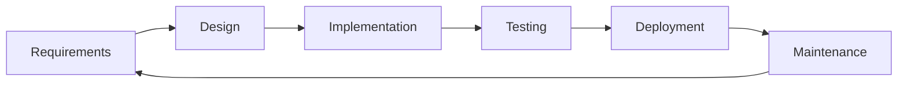
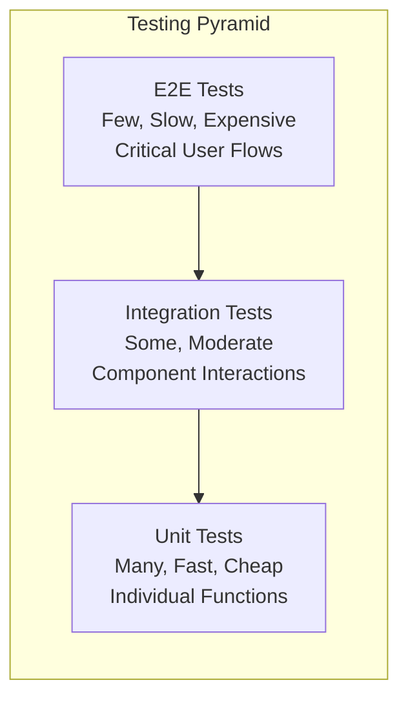
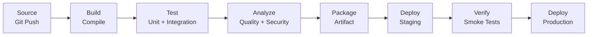

# Software Engineering — Complete Interview Preparation Guide

---

## Table of Contents

1. [Introduction](#1-introduction)
2. [Learning Roadmap](#2-learning-roadmap)
3. [Theory Notes](#3-theory-notes)
4. [Key Concepts](#4-key-concepts)
5. [Interview Questions & Answers](#5-interview-questions--answers)
6. [Hands-on Practice](#6-hands-on-practice)
7. [FAANG Interview Questions](#7-faang-interview-questions)
8. [Common Mistakes to Avoid](#8-common-mistakes-to-avoid)
9. [Best Practices](#9-best-practices)
10. [Cheat Sheet](#10-cheat-sheet)
11. [Flash Cards](#11-flash-cards)
12. [Mind Map](#12-mind-map)
13. [Mermaid Diagrams](#13-mermaid-diagrams)
14. [Code Examples](#14-code-examples)
15. [Projects & Ideas](#15-projects--ideas)
16. [Resources](#16-resources)
17. [Interview Preparation Checklist](#17-interview-preparation-checklist)
18. [Revision Notes](#18-revision-notes)
19. [Mock Interview Questions](#19-mock-interview-questions)
20. [Difficulty Rating](#20-difficulty-rating)
21. [Summary](#21-summary)

---

## 1. Introduction

Software Engineering is the systematic application of engineering principles to the design, development, testing, deployment, and maintenance of software. It encompasses methodologies, practices, tools, and frameworks that enable teams to build reliable, scalable, and maintainable software systems. In interviews, software engineering questions assess your understanding of the entire software lifecycle, not just coding.

### Why Software Engineering Matters in Interviews

- **System thinking** — Understanding how components interact
- **Quality focus** — Writing maintainable, testable code
- **Process knowledge** — Agile, CI/CD, version control
- **Trade-off analysis** — Making informed technical decisions
- **Collaboration skills** — Working effectively in teams

### Core Areas Covered

| Area | Focus | Interview Weight |
|------|-------|-----------------|
| Development Methodologies | Agile, Scrum, Kanban | Medium |
| Version Control | Git, branching, workflows | High |
| Testing | Unit, integration, e2e | High |
| Design Patterns | SOLID, GoF patterns | High |
| Code Quality | Refactoring, code reviews | Medium |
| CI/CD | Build, test, deploy pipelines | Medium |
| Documentation | Technical writing, ADRs | Low-Medium |
| DevOps Basics | Infrastructure, monitoring | Medium |

---

## 2. Learning Roadmap

### Phase 1: Foundations (Weeks 1-2)
- Understand software development lifecycle (SDLC)
- Learn Git basics (init, add, commit, push, pull)
- Study SOLID principles
- Practice writing clean code

### Phase 2: Methodologies (Weeks 3-4)
- Learn Agile/Scrum framework
- Understand Kanban principles
- Practice sprint planning and retrospectives
- Study user stories and acceptance criteria

### Phase 3: Testing & Quality (Weeks 5-6)
- Master unit testing (Jest, pytest, JUnit)
- Learn integration and e2e testing
- Study test-driven development (TDD)
- Practice code reviews

### Phase 4: Design Patterns (Weeks 7-8)
- Learn GoF design patterns (Creational, Structural, Behavioral)
- Study architectural patterns (MVC, MVVM, Microservices)
- Practice refactoring techniques
- Understand dependency injection

### Phase 5: CI/CD & DevOps (Weeks 9-10)
- Set up CI/CD pipelines (GitHub Actions, Jenkins)
- Learn Docker basics
- Understand infrastructure as code
- Study monitoring and logging

### Phase 6: Advanced Topics (Weeks 11-12)
- Study distributed systems basics
- Learn about system scalability
- Practice system design discussions
- Review industry best practices

---

## 3. Theory Notes

### 3.1 Software Development Lifecycle (SDLC)

The SDLC is a structured process for planning, creating, testing, and deploying software systems.

**Phases:**
1. **Planning** — Requirements gathering, feasibility analysis, resource estimation
2. **Analysis** — Detailed requirements specification, use cases
3. **Design** — Architecture, database design, UI/UX design
4. **Implementation** — Coding, unit testing, code reviews
5. **Testing** — Integration testing, system testing, acceptance testing
6. **Deployment** — Release management, production deployment
7. **Maintenance** — Bug fixes, enhancements, optimization

**SDLC Models:**
- **Waterfall** — Sequential, each phase completes before next begins
- **Iterative** — Repeated cycles, each builds on previous
- **Spiral** — Risk-driven, combines iterative with waterfall
- **V-Model** — Verification and validation paired at each level
- **Agile** — Incremental, adaptive, customer-focused

### 3.2 SOLID Principles

**S — Single Responsibility Principle:**
A class should have only one reason to change. Each class should handle one aspect of the software's functionality.

**O — Open/Closed Principle:**
Software entities should be open for extension but closed for modification. You should be able to add new functionality without changing existing code.

**L — Liskov Substitution Principle:**
Objects of a superclass should be replaceable with objects of a subclass without breaking the application. Subtypes must be substitutable for their base types.

**I — Interface Segregation Principle:**
Clients should not be forced to depend on interfaces they don't use. Many specific interfaces are better than one general-purpose interface.

**D — Dependency Inversion Principle:**
High-level modules should not depend on low-level modules; both should depend on abstractions. Abstractions should not depend on details; details should depend on abstractions.

### 3.3 Agile Methodology

**Agile Manifesto Values:**
1. Individuals and interactions over processes and tools
2. Working software over comprehensive documentation
3. Customer collaboration over contract negotiation
4. Responding to change over following a plan

**Scrum Framework:**
- **Roles:** Product Owner, Scrum Master, Development Team
- **Events:** Sprint Planning, Daily Scrum, Sprint Review, Sprint Retrospective
- **Artifacts:** Product Backlog, Sprint Backlog, Increment

**Kanban Principles:**
1. Visualize the workflow
2. Limit work in progress (WIP)
3. Manage flow
4. Make policies explicit
5. Implement feedback loops
6. Improve collaboratively

### 3.4 Design Patterns

**Creational Patterns:**
- Singleton — Ensure single instance
- Factory — Create objects without specifying exact class
- Abstract Factory — Create families of related objects
- Builder — Construct complex objects step by step
- Prototype — Create objects by cloning

**Structural Patterns:**
- Adapter — Interface compatibility between classes
- Bridge — Separate abstraction from implementation
- Composite — Treat individual and composite objects uniformly
- Decorator — Add responsibilities dynamically
- Facade — Simplified interface to complex subsystem
- Proxy — Placeholder for another object

**Behavioral Patterns:**
- Observer — Define subscription mechanism for events
- Strategy — Define family of algorithms, make interchangeable
- Command — Encapsulate requests as objects
- Iterator — Sequential access without exposing representation
- Template Method — Define algorithm skeleton, override specific steps
- State — Allow object to change behavior when state changes

---

## 4. Key Concepts

### 4.1 Version Control Concepts

**Branching Strategies:**
- **Git Flow** — main, develop, feature, release, hotfix branches
- **GitHub Flow** — main + feature branches, simple
- **GitLab Flow** — main + environment branches
- **Trunk-Based Development** — Frequent integration to main

**Git Operations:**
- `git init` — Initialize repository
- `git clone` — Copy remote repository
- `git add` — Stage changes
- `git commit` — Save staged changes
- `git push` — Upload to remote
- `git pull` — Download and merge from remote
- `git merge` — Combine branches
- `git rebase` — Reapply commits on new base
- `git stash` — Temporarily store changes

**Merge vs. Rebase:**
- **Merge** — Creates merge commit, preserves history, non-destructive
- **Rebase** — Linear history, cleaner log, rewrites commits

### 4.2 Testing Concepts

**Testing Pyramid:**
```
        /\
       /  \  E2E Tests (few)
      /----\
     /      \ Integration Tests (some)
    /--------\
   /          \ Unit Tests (many)
  /------------\
```

**Test Types:**
- **Unit** — Test individual functions/methods in isolation
- **Integration** — Test interaction between components
- **End-to-End** — Test complete user workflows
- **Acceptance** — Verify business requirements
- **Regression** — Ensure changes don't break existing functionality
- **Performance** — Test speed, scalability, reliability
- **Security** — Test for vulnerabilities

**TDD Cycle (Red-Green-Refactor):**
1. Write a failing test (Red)
2. Write minimal code to pass (Green)
3. Improve code structure (Refactor)

### 4.3 Code Quality Concepts

**Technical Debt:**
The cost of additional rework caused by choosing an easy solution now instead of using a better approach that would take longer.

**Code Smells:**
- Duplicated code
- Long methods
- Large classes
- Feature envy
- Data clumps
- Primitive obsession
- Switch statements
- Parallel inheritance hierarchies
- Lazy class
- Speculative generality

**Refactoring Techniques:**
- Extract Method/Function
- Inline Method
- Move Method/Field
- Convert Method to Object
- Replace Temp with Query
- Introduce Parameter Object
- Preserve Whole Object
- Replace Conditional with Polymorphism

### 4.4 CI/CD Concepts

**Continuous Integration (CI):**
Frequently merge code changes to a shared repository, with automated builds and tests.

**Continuous Delivery (CD):**
Extend CI by automatically deploying all code changes to a testing/production environment.

**Continuous Deployment:**
Every change that passes all stages of the pipeline is released to production automatically.

**Pipeline Stages:**
1. Source — Code commit triggers build
2. Build — Compile, bundle dependencies
3. Test — Run automated tests
4. Analyze — Code quality, security scanning
5. Package — Create deployable artifact
6. Deploy — Release to environment
7. Verify — Smoke tests, monitoring

---

## 5. Interview Questions & Answers

### Fundamentals

**Q1: What is the difference between software engineering and programming?**
**A:** Programming is writing code to solve specific problems. Software engineering is the broader discipline encompassing the entire lifecycle: requirements analysis, design, development, testing, deployment, and maintenance. Software engineers consider scalability, maintainability, team collaboration, and business objectives, while programmers focus primarily on implementation. Software engineering applies engineering principles to produce reliable, efficient, and maintainable systems.

**Q2: Explain the SOLID principles with examples.**
**A:**
- **S (Single Responsibility):** A `User` class handles user data, while a `UserAuthenticator` handles authentication — each has one reason to change.
- **O (Open/Closed):** A payment system accepts new payment methods through interfaces without modifying existing code.
- **L (Liskov Substitution):** A `Circle` and `Rectangle` can both be used wherever `Shape` is expected without breaking functionality.
- **I (Interface Segregation):** Instead of one `Worker` interface with `work()`, `eat()`, `sleep()`, create `Workable`, `Eatable`, `Sleepable` interfaces.
- **D (Dependency Inversion):** A `NotificationService` depends on an `INotifier` interface, not concrete `EmailNotifier` or `SMSNotifier` classes.

**Q3: What is the difference between Agile and Waterfall?**
**A:** Waterfall is sequential — each phase (requirements → design → implementation → testing → deployment) completes before the next begins. Changes are expensive once a phase is complete. Agile is iterative — work happens in short sprints (1-4 weeks), producing working software incrementally. Agile welcomes changing requirements, emphasizes customer collaboration, and delivers value continuously. Waterfall suits well-defined projects; Agile suits evolving requirements.

**Q4: How does Git differ from SVN?**
**A:** Git is distributed — every developer has a full repository clone, enabling offline work and faster operations. SVN is centralized — there's one main repository and developers check out files. Git tracks content (snapshots), SVN tracks files. Git uses a powerful branching model (cheap branches, easy merging), while SVN branches are directory copies. Git has better performance for most operations and more flexible staging areas.

**Q5: What is technical debt and how do you manage it?**
**A:** Technical debt is the implied cost of future rework from choosing quick solutions over better ones. It accumulates through shortcuts, outdated dependencies, missing tests, or poor design. Manage it by: (1) Tracking debt items in your backlog, (2) Estimating the cost of each debt item, (3) Allocating a percentage of sprint capacity to debt reduction, (4) Establishing coding standards to prevent new debt, (5) Regular refactoring sessions, and (6) Making debt visible to stakeholders through metrics.

### Testing

**Q6: What is the testing pyramid and why does it matter?**
**A:** The testing pyramid recommends many unit tests at the base, fewer integration tests in the middle, and very few end-to-end tests at the top. This matters because: unit tests are fast, cheap, and easy to maintain; integration tests verify component interactions; E2E tests are slow, expensive, and brittle. An inverted pyramid (many E2E, few unit) leads to slow test suites, flaky tests, and delayed feedback. The pyramid ensures fast feedback loops and maintainable test suites.

**Q7: Explain TDD and its benefits.**
**A:** Test-Driven Development follows Red-Green-Refactor: write a failing test first, write minimal code to pass, then refactor. Benefits include: (1) Better code design — code must be testable, (2) Comprehensive test coverage — every line has a test, (3) Confidence to refactor — tests catch regressions, (4) Living documentation — tests describe expected behavior, (5) Reduced debugging time — failures are caught immediately, (6) Cleaner code — you write only what's needed.

**Q8: What is test coverage and is 100% coverage always good?**
**A:** Test coverage measures the percentage of code exercised by tests (lines, branches, functions). While 100% coverage sounds ideal, it's not always practical or beneficial. High coverage ensures most code paths are tested, but achieving 100% may require testing trivial code or untestable code (like complex mocking). Focus on meaningful coverage: critical paths, edge cases, and business logic. Coverage is necessary but not sufficient — a test that asserts `true` covers code but tests nothing.

**Q9: What is the difference between mocking, stubbing, and faking?**
**A:**
- **Mocking** — Objects that record calls and verify behavior (e.g., "was `save()` called?")
- **Stubbing** — Objects that return predefined responses (e.g., return a fixed user object)
- **Faking** — Working implementations that simplify behavior (e.g., in-memory database)

Mocks verify interactions; stubs provide test data; fakes replace complex dependencies with simpler versions. All three help isolate the code under test from its dependencies.

**Q10: How do you decide what to test?**
**A:** Prioritize testing based on: (1) **Business criticality** — Core features need more tests, (2) **Complexity** — Complex logic has more edge cases, (3) **Change frequency** — Frequently changed code needs regression protection, (4) **Bug history** — Previously buggy areas need thorough testing, (5) **Dependencies** — Code with many external dependencies needs integration tests, (6) **Risk** — High-risk code (security, payments) requires comprehensive testing.

### Design Patterns

**Q11: When would you use the Strategy pattern?**
**A:** Strategy pattern defines a family of algorithms and makes them interchangeable. Use it when: (1) Multiple algorithms exist for the same operation, (2) You need to select algorithms at runtime, (3) You want to eliminate conditional statements for algorithm selection, (4) Different variants of an algorithm are needed. Example: A payment system where `CreditCardPayment`, `PayPalPayment`, and `CryptoPayment` implement a common `PaymentStrategy` interface, and the payment method can be switched at runtime.

**Q12: What is the difference between Adapter and Decorator patterns?**
**A:** **Adapter** converts one interface to another, enabling incompatible classes to work together. It's about interface compatibility. **Decorator** adds responsibilities to objects dynamically, wrapping them to extend behavior without changing the class. Example: Adapter converts a European power plug to fit American sockets; Decorator adds surge protection to an existing power adapter. Adapter changes the interface; Decorator keeps the interface and adds functionality.

**Q13: Explain the Observer pattern and give a real-world example.**
**A:** Observer defines a one-to-many dependency between objects so that when one object (subject) changes state, all dependents (observers) are notified automatically. Real-world example: A stock price service (subject) notifies multiple clients (observers) — a mobile app, a web dashboard, and an email service — whenever prices change. Each client registers as an observer and receives updates without the stock service needing to know the specifics of each client. This promotes loose coupling between the publisher and subscribers.

**Q14: What is the difference between Singleton and Monostate patterns?**
**A:** **Singleton** ensures only one instance exists and provides global access to it. It controls instantiation and hides the constructor. **Monostate** allows multiple instances but all share the same state. In Monostate, any instance can access shared static variables, so all instances behave identically. Singleton restricts instantiation; Monostate shares state. Singleton is more commonly used but can create tight coupling; Monostate allows easier testing and more flexible design.

**Q15: When should you NOT use design patterns?**
**A:** Avoid patterns when: (1) **YAGNI** — You Aren't Gonna Need It; don't add complexity for hypothetical requirements, (2) **Simple solution works** — Patterns add abstraction overhead; if a simple if-else suffices, use it, (3) **Team unfamiliarity** — If the team doesn't understand the pattern, it reduces readability, (4) **Premature abstraction** — Abstract too early and you'll need to refactor when requirements change, (5) **Over-engineering** — Using every pattern you know makes code harder to understand and maintain.

### CI/CD and DevOps

**Q16: What is the difference between continuous integration, delivery, and deployment?**
**A:**
- **Continuous Integration (CI)** — Developers frequently merge code changes to a shared repository, with automated builds and tests validating each integration.
- **Continuous Delivery (CD)** — Extends CI by automatically preparing releases for deployment to production. Every change is potentially deployable, but deployment requires manual approval.
- **Continuous Deployment** — Every change that passes all pipeline stages is automatically deployed to production without human intervention.

**Q17: What is a feature flag and when would you use one?**
**A:** A feature flag (or feature toggle) is a mechanism to enable or disable features in production without deploying new code. Use cases: (1) **Progressive rollout** — Enable feature for 10% of users first, (2) **A/B testing** — Test different versions with different user groups, (3) **Kill switch** — Quickly disable a problematic feature, (4) **Dark launches** — Deploy code but hide the feature until ready, (5) **Environment-specific** — Enable features only in staging. Tools: LaunchDarkly, Unleash, Flagsmith.

**Q18: How do you handle database migrations in a CI/CD pipeline?**
**A:** Database migrations should be: (1) **Version controlled** — Stored in the same repository as application code, (2) **Automated** — Run as part of the CI/CD pipeline, (3) **Tested** — Tested against a copy of production data, (4) **Reversible** — Include rollback scripts for every migration, (5) **Idempotent** — Safe to run multiple times, (6) **Backward compatible** — Deploy migrations before code that uses them, (7) **Staged** — Apply to dev, staging, then production. Tools: Flyway, Liquibase, Alembic, Rails migrations.

**Q19: What is the purpose of code reviews?**
**A:** Code reviews serve multiple purposes: (1) **Quality** — Catch bugs and logic errors before production, (2) **Knowledge sharing** — Spread understanding of codebase across the team, (3) **Consistency** — Enforce coding standards and design patterns, (4) **Mentoring** — Help junior developers learn best practices, (5) **Security** — Identify potential vulnerabilities, (6) **Maintainability** — Ensure code is readable and well-documented, (7) **Collaboration** — Discuss approaches and alternatives. Effective reviews are timely, constructive, and focused on the code, not the person.

**Q20: What metrics do you track for software quality?**
**A:** Key metrics include: (1) **Code coverage** — Percentage of code tested, (2) **Bug density** — Bugs per thousand lines of code, (3) **Mean Time to Recovery (MTTR)** — How quickly production issues are resolved, (4) **Deployment frequency** — How often code is deployed, (5) **Change failure rate** — Percentage of deployments causing failures, (6) **Technical debt ratio** — Time spent on debt vs. new features, (7) **Cyclomatic complexity** — Code complexity measure, (8) **Customer satisfaction** — Net Promoter Score (NPS) for software quality.

---

## 6. Hands-on Practice

### Practice Exercise 1: Git Workflow

**Scenario:** You're working on a feature branch and need to incorporate latest changes from main.

```bash
# Step 1: Ensure you're on your feature branch
git checkout feature/user-auth

# Step 2: Fetch latest changes from remote
git fetch origin

# Step 3: Rebase your feature branch on latest main
git rebase origin/main

# Step 4: If conflicts occur, resolve them
# Edit conflicting files, then:
git add <resolved-file>
git rebase --continue

# Step 5: Force push (since rebase rewrites history)
git push --force-with-lease origin feature/user-auth
```

### Practice Exercise 2: Refactoring Code Smell

**Before (Code Smell):**
```python
def process_order(order):
    if order['type'] == 'regular':
        discount = order['total'] * 0.1
    elif order['type'] == 'premium':
        discount = order['total'] * 0.2
    elif order['type'] == 'vip':
        discount = order['total'] * 0.3
    else:
        discount = 0

    if order['country'] == 'US':
        tax = order['total'] * 0.08
    elif order['country'] == 'UK':
        tax = order['total'] * 0.20
    elif order['country'] == 'JP':
        tax = order['total'] * 0.10
    else:
        tax = 0

    return order['total'] - discount + tax
```

**After (Refactored):**
```python
from abc import ABC, abstractmethod


class DiscountStrategy(ABC):
    @abstractmethod
    def calculate(self, total: float) -> float:
        pass


class RegularDiscount(DiscountStrategy):
    def calculate(self, total: float) -> float:
        return total * 0.1


class PremiumDiscount(DiscountStrategy):
    def calculate(self, total: float) -> float:
        return total * 0.2


class VIPDiscount(DiscountStrategy):
    def calculate(self, total: float) -> float:
        return total * 0.3


class NoDiscount(DiscountStrategy):
    def calculate(self, total: float) -> float:
        return 0


class TaxCalculator(ABC):
    @abstractmethod
    def calculate(self, total: float) -> float:
        pass


class USTax(TaxCalculator):
    def calculate(self, total: float) -> float:
        return total * 0.08


class UKTax(TaxCalculator):
    def calculate(self, total: float) -> float:
        return total * 0.20


class JPTax(TaxCalculator):
    def calculate(self, total: float) -> float:
        return total * 0.10


DISCOUNT_STRATEGIES = {
    'regular': RegularDiscount,
    'premium': PremiumDiscount,
    'vip': VIPDiscount,
}

TAX_STRATEGIES = {
    'US': USTax,
    'UK': UKTax,
    'JP': JPTax,
}


def process_order(order: dict) -> float:
    discount_class = DISCOUNT_STRATEGIES.get(order['type'], NoDiscount)
    tax_class = TAX_STRATEGIES.get(order['country'])

    discount = discount_class().calculate(order['total'])
    tax = tax_class().calculate(order['total']) if tax_class else 0

    return order['total'] - discount + tax
```

### Practice Exercise 3: Writing Unit Tests

**Given this function, write comprehensive tests:**

```python
def validate_email(email: str) -> bool:
    """Validate email format."""
    if not email or not isinstance(email, str):
        return False
    if '@' not in email:
        return False
    parts = email.split('@')
    if len(parts) != 2:
        return False
    local, domain = parts
    if not local or not domain:
        return False
    if '.' not in domain:
        return False
    if domain.startswith('.') or domain.endswith('.'):
        return False
    return True
```

**Test Cases:**
```python
import pytest


class TestValidateEmail:
    def test_valid_standard_email(self):
        assert validate_email("user@example.com") is True

    def test_valid_email_with_dots(self):
        assert validate_email("first.last@example.com") is True

    def test_valid_email_with_plus(self):
        assert validate_email("user+tag@example.com") is True

    def test_empty_string(self):
        assert validate_email("") is False

    def test_none_input(self):
        assert validate_email(None) is False

    def test_no_at_symbol(self):
        assert validate_email("userexample.com") is False

    def test_no_domain(self):
        assert validate_email("user@") is False

    def test_no_local(self):
        assert validate_email("@example.com") is False

    def test_no_tld(self):
        assert validate_email("user@domain") is False

    def test_domain_starts_with_dot(self):
        assert validate_email("user@.example.com") is False

    def test_domain_ends_with_dot(self):
        assert validate_email("user@example.com.") is False

    def test_multiple_at_symbols(self):
        assert validate_email("user@@example.com") is False

    def test_non_string_input(self):
        assert validate_email(123) is False
```

---

## 7. FAANG Interview Questions

### Google

**Q: How would you design a code review process for a large engineering organization?**
**A:** I'd design a comprehensive code review system: (1) **Tooling** — Use GitHub/GitLab with mandatory review requirements, CODEOWNERS for automatic reviewers, and review assignments based on expertise, (2) **Standards** — Create review checklists covering correctness, security, performance, readability, and testing, (3) **Process** — Require minimum 2 approvals, mandate CI passing before merge, and set 24-hour response SLAs, (4) **Automation** — Implement linters, formatters, security scanners, and test coverage checks as automated reviewers, (5) **Culture** — Train reviewers on constructive feedback, focus on code not people, and celebrate good reviews, (6) **Metrics** — Track review turnaround time, defect detection rate, and reviewer load distribution, (7) **Education** — Run review workshops, share best practices, and rotate reviewers to spread knowledge.

### Amazon

**Q: How do you balance writing new features versus paying down technical debt?**
**A:** I'd use a balanced approach: (1) **Quantify debt** — Track debt items with estimated effort and impact, (2) **Allocate capacity** — Reserve 20% of each sprint for debt reduction (adjustable), (3) **Opportunistic refactoring** — Refactor when touching code for feature work, (4) **Business framing** — Present debt as risk to stakeholders (slower development, more bugs), (5) **Quality gates** — Prevent new debt through coding standards and automated checks, (6) **Visibility** — Include debt metrics in team dashboards, (7) **ROI analysis** — Prioritize debt that most impacts velocity or stability, (8) **Prevention** — Address root causes (unclear requirements, time pressure) not just symptoms.

### Meta

**Q: Describe your approach to making a large legacy codebase more testable.**
**A:** A phased approach: (1) **Assessment** — Map the codebase, identify critical paths, measure current coverage, (2) **Characterization tests** — Write tests for existing behavior before changing anything, (3) **Dependency injection** — Replace hard-coded dependencies with injectable ones, (4) **Interface extraction** — Create interfaces for concrete classes to enable mocking, (5) **Strangler fig pattern** — Write new features with tests, gradually replace old code, (6) **Test data builders** — Create factories for test data to reduce test setup complexity, (7) **Integration test harnesses** — Set up isolated test environments with test databases, (8) **Incremental improvement** — Improve testability of one module at a time, measuring progress.

### Apple

**Q: How do you ensure code quality across a distributed engineering team?**
**A:** Through multiple complementary mechanisms: (1) **Automated gates** — CI/CD pipelines enforce tests, linting, formatting, and security scans, (2) **Review culture** — Mandatory peer reviews with clear guidelines and training, (3) **Coding standards** — Documented and enforced through tooling (not just documentation), (4) **Architecture decision records (ADRs)** — Document design decisions for consistency, (5) **Inner source** — Open development practices across teams, (6) **Guilds/chapters** — Communities of practice for sharing quality practices, (7) **Metrics dashboards** — Visibility into code quality trends, (8) **Blameless postmortems** — Learn from quality failures without finger-pointing.

### Netflix

**Q: How do you handle testing in a microservices architecture?**
**A:** A multi-layered testing strategy: (1) **Unit tests** — Fast, isolated tests for business logic within each service, (2) **Contract tests** — Verify API contracts between services (using Pact or similar), (3) **Component tests** — Test a single service with its direct dependencies mocked, (4) **Integration tests** — Test service interactions in a controlled environment, (5) **End-to-end tests** — Critical user flows only (minimize due to flakiness), (6) **Chaos engineering** — Inject failures to test resilience (Chaos Monkey), (7) **Performance tests** — Load test critical paths regularly, (8) **Consumer-driven contracts** — Consumers define expectations, providers verify compliance. The key is shifting left — catch issues early in the pipeline.

---

## 8. Common Mistakes to Avoid

### Development Mistakes

| Mistake | Why It's Harmful | Better Approach |
|---------|-----------------|-----------------|
| Skipping tests for speed | Bugs cost more to fix later | Write tests alongside code |
| Over-engineering | Adds unnecessary complexity | Follow YAGNI principle |
| Ignoring code reviews | Miss bugs, knowledge silos | Mandatory peer reviews |
| Not refactoring | Code becomes harder to change | Refactor continuously |
| Copying code blindly | Introduces bugs and technical debt | Understand before adapting |
| Premature optimization | Wastes time on non-bottlenecks | Profile first, optimize second |

### Git Mistakes

| Mistake | Why It's Harmful | Better Approach |
|---------|-----------------|-----------------|
| Force pushing to shared branches | Overwrites others' work | Use force-with-lease |
| Large commits with many changes | Hard to review and revert | Small, focused commits |
| Not writing meaningful commit messages | Poor history comprehension | Use conventional commits |
| Merging instead of rebasing on feature branches | Clutters history | Rebase feature branches |
| Not branching for features | Direct commits to main risk stability | Use feature branches |
| Ignoring merge conflicts | Introduces silent bugs | Resolve conflicts carefully |

### Testing Mistakes

| Mistake | Why It's Harmful | Better Approach |
|---------|-----------------|-----------------|
| Testing implementation details | Tests break during refactoring | Test behavior, not implementation |
| Flaky tests erode confidence | Team ignores test failures | Fix or remove flaky tests |
| 100% coverage obsession | Tests trivial code, ignores critical paths | Focus on meaningful coverage |
| Testing too much in E2E | Slow, brittle test suite | Follow testing pyramid |
| No test data management | Tests depend on specific data state | Use factories and cleanup |
| Skipping edge case tests | Bugs hide in unusual inputs | Test boundary conditions |

---

## 9. Best Practices

### Code Quality Best Practices

1. **Write self-documenting code** — Clear names reduce need for comments
2. **Keep functions small** — Each function should do one thing well
3. **Avoid deep nesting** — Use early returns and guard clauses
4. **Use meaningful names** — Variables, functions, and classes should reveal intent
5. **Minimize scope** — Declare variables as close to usage as possible
6. **Favor composition over inheritance** — More flexible and testable
7. **Handle errors explicitly** — Don't swallow exceptions silently
8. **Document decisions** — Use ADRs for architectural choices

### Git Best Practices

1. **Commit often** — Small, atomic commits are easier to review
2. **Write good commit messages** — Follow conventional commits format
3. **Use branches** — Never commit directly to main
4. **Pull before push** — Always pull latest before pushing
5. **Review before merge** — Never merge your own PRs
6. **Keep branches short-lived** — Merge within 1-2 days
7. **Use .gitignore** — Prevent committing generated files
8. **Tag releases** — Use semantic versioning tags

### Testing Best Practices

1. **Test early, test often** — Don't leave testing to the end
2. **Follow the testing pyramid** — Many unit, fewer integration, minimal E2E
3. **Test one thing per test** — Each test should verify one behavior
4. **Use descriptive test names** — Name should explain what's being tested
5. **Arrange-Act-Assert** — Structure tests clearly
6. **Isolate tests** — Tests shouldn't depend on each other
7. **Test edge cases** — Null, empty, boundary values
8. **Mock external dependencies** — Don't call real APIs in tests

---

## 10. Cheat Sheet

```
SOFTWARE ENGINEERING CHEAT SHEET
═════════════════════════════════

SOLID PRINCIPLES
────────────────
S = Single Responsibility (one reason to change)
O = Open/Closed (extend, don't modify)
L = Liskov Substitution (subtypes substitutable)
I = Interface Segregation (many specific interfaces)
D = Dependency Inversion (depend on abstractions)

DESIGN PATTERNS QUICK REFERENCE
────────────────────────────────
Creational: Singleton, Factory, Abstract Factory, Builder, Prototype
Structural: Adapter, Bridge, Composite, Decorator, Facade, Proxy
Behavioral: Observer, Strategy, Command, Iterator, Template, State

TESTING PYRAMID
───────────────
      /\
     /E2E\        Few, slow, expensive
    /------\
   /Integr.\     Some, moderate
  /----------\
 /  Unit      \  Many, fast, cheap
/--------------\

GIT COMMANDS ESSENTIAL
──────────────────────
git init / git clone
git add . / git add -p
git commit -m "type(scope): description"
git push / git pull / git fetch
git checkout -b feature/name
git rebase main / git merge feature
git stash / git stash pop
git log --oneline --graph

CI/CD PIPELINE STAGES
─────────────────────
Source → Build → Test → Analyze → Package → Deploy → Verify

AGILE CEREMONIES
────────────────
Sprint Planning → Daily Standup → Sprint Review → Retrospective

CODE REVIEW CHECKLIST
─────────────────────
[ ] Correctness — Does it work?
[ ] Tests — Are there tests?
[ ] Security — Any vulnerabilities?
[ ] Performance — Any bottlenecks?
[ ] Readability — Can others understand it?
[ ] Standards — Follows conventions?
[ ] Documentation — Is it documented?
```

---

## 11. Flash Cards

**Card 1:** What is the Single Responsibility Principle?
→ A class should have only one reason to change — it handles one aspect of functionality.

**Card 2:** What is the Red-Green-Refactor cycle?
→ TDD cycle: write failing test (Red), write minimal code (Green), improve structure (Refactor).

**Card 3:** What is a feature flag?
→ A mechanism to enable/disable features in production without deploying new code.

**Card 4:** What is the difference between merge and rebase?
→ Merge creates a merge commit preserving history; rebase rewrites commits for linear history.

**Card 5:** What is technical debt?
→ Implied cost of future rework from choosing quick solutions over better ones.

**Card 6:** What is the testing pyramid?
→ Many unit tests, fewer integration tests, minimal E2E tests.

**Card 7:** What is continuous integration?
→ Frequently merging code changes to a shared repository with automated builds and tests.

**Card 8:** What is the Strategy pattern?
→ Defines a family of algorithms and makes them interchangeable at runtime.

**Card 9:** What is the Observer pattern?
→ Defines a one-to-many dependency where state changes automatically notify dependents.

**Card 10:** What is YAGNI?
→ "You Aren't Gonna Need It" — don't build functionality until it's actually needed.

---

## 12. Mind Map

```
Software Engineering
│
├─── Development Process
│    ├─── SDLC
│    │    ├─── Waterfall
│    │    ├─── Agile
│    │    ├─── Scrum
│    │    └─── Kanban
│    ├─── Requirements
│    │    ├─── User Stories
│    │    ├─── Acceptance Criteria
│    │    └─── Use Cases
│    └─── Estimation
│         ├─── Story Points
│         ├─── Planning Poker
│         └─── T-Shirt Sizing
│
├─── Version Control
│    ├─── Git
│    │    ├─── Branching
│    │    ├─── Merging
│    │    ├─── Rebasing
│    │    └─── Stashing
│    ├─── Workflows
│    │    ├─── Git Flow
│    │    ├─── GitHub Flow
│    │    └─── Trunk-Based
│    └─── Best Practices
│
├─── Design Patterns
│    ├─── Creational
│    ├─── Structural
│    └─── Behavioral
│
├─── Testing
│    ├─── Unit
│    ├─── Integration
│    ├─── E2E
│    ├─── TDD
│    └─── BDD
│
├─── Code Quality
│    ├─── SOLID
│    ├─── Refactoring
│    ├─── Code Reviews
│    └─── Technical Debt
│
├─── CI/CD
│    ├─── Build
│    ├─── Test
│    ├─── Deploy
│    └─── Monitor
│
└─── DevOps
     ├─── Docker
     ├─── Kubernetes
     ├─── Monitoring
     └─── Infrastructure
```

---

## 13. Mermaid Diagrams

### Software Development Lifecycle



### Git Workflow (Git Flow)


### Testing Pyramid



### CI/CD Pipeline



---

## 14. Code Examples

### Python: Design Patterns Implementation

```python
from abc import ABC, abstractmethod
from typing import List, Dict
from datetime import datetime


# Observer Pattern — Event System
class Event:
    def __init__(self, name: str, data: dict):
        self.name = name
        self.data = data
        self.timestamp = datetime.now()


class EventEmitter:
    def __init__(self):
        self._listeners: Dict[str, List[callable]] = {}

    def on(self, event_name: str, callback: callable):
        if event_name not in self._listeners:
            self._listeners[event_name] = []
        self._listeners[event_name].append(callback)

    def emit(self, event_name: str, data: dict = None):
        event = Event(event_name, data or {})
        for callback in self._listeners.get(event_name, []):
            callback(event)

    def off(self, event_name: str, callback: callable):
        if event_name in self._listeners:
            self._listeners[event_name].remove(callback)


# Strategy Pattern — Payment Processing
class PaymentStrategy(ABC):
    @abstractmethod
    def pay(self, amount: float) -> dict:
        pass


class CreditCardPayment(PaymentStrategy):
    def __init__(self, card_number: str, cvv: str):
        self.card_number = card_number
        self.cvv = cvv

    def pay(self, amount: float) -> dict:
        return {
            "method": "credit_card",
            "amount": amount,
            "last_four": self.card_number[-4:],
            "status": "success"
        }


class PayPalPayment(PaymentStrategy):
    def __init__(self, email: str):
        self.email = email

    def pay(self, amount: float) -> dict:
        return {
            "method": "paypal",
            "amount": amount,
            "email": self.email,
            "status": "success"
        }


class CryptoPayment(PaymentStrategy):
    def __init__(self, wallet_address: str):
        self.wallet_address = wallet_address

    def pay(self, amount: float) -> dict:
        return {
            "method": "crypto",
            "amount": amount,
            "wallet": self.wallet_address[:8] + "...",
            "status": "success"
        }


# Strategy Context
class PaymentProcessor:
    def __init__(self, strategy: PaymentStrategy):
        self._strategy = strategy
        self._emitter = EventEmitter()

    def set_strategy(self, strategy: PaymentStrategy):
        self._strategy = strategy

    def process_payment(self, amount: float) -> dict:
        result = self._strategy.pay(amount)
        self._emitter.emit("payment_completed", result)
        return result


# Factory Pattern — Document Creator
class Document(ABC):
    @abstractmethod
    def render(self) -> str:
        pass


class PDFDocument(Document):
    def render(self) -> str:
        return "<PDF binary content>"


class HTMLDocument(Document):
    def render(self) -> str:
        return "<html><body>Content</body></html>"


class WordDocument(Document):
    def render(self) -> str:
        return "[Word binary content]"


class DocumentFactory:
    _creators = {
        "pdf": PDFDocument,
        "html": HTMLDocument,
        "docx": WordDocument,
    }

    @classmethod
    def create(cls, doc_type: str) -> Document:
        creator = cls._creators.get(doc_type.lower())
        if not creator:
            raise ValueError(f"Unknown document type: {doc_type}")
        return creator()

    @classmethod
    def register(cls, doc_type: str, creator: type):
        cls._creators[doc_type] = creator


# Usage
if __name__ == "__main__":
    # Observer pattern
    emitter = EventEmitter()
    emitter.on("payment_completed", lambda e: print(f"Payment: {e.data}"))

    # Strategy pattern
    processor = PaymentProcessor(CreditCardPayment("4111111111111234", "123"))
    result = processor.process_payment(99.99)
    print(result)

    processor.set_strategy(PayPalPayment("user@example.com"))
    result = processor.process_payment(149.99)
    print(result)

    # Factory pattern
    doc = DocumentFactory.create("pdf")
    print(doc.render())
```

### Python: Unit Test Example with pytest

```python
import pytest
from unittest.mock import Mock, patch
from datetime import datetime


class ShoppingCart:
    def __init__(self):
        self._items = []
        self._discount = 0

    def add_item(self, name: str, price: float, quantity: int = 1):
        if price < 0:
            raise ValueError("Price cannot be negative")
        if quantity < 1:
            raise ValueError("Quantity must be at least 1")
        self._items.append({
            "name": name,
            "price": price,
            "quantity": quantity
        })

    def remove_item(self, name: str):
        self._items = [i for i in self._items if i["name"] != name]

    def apply_discount(self, percentage: float):
        if not 0 <= percentage <= 100:
            raise ValueError("Percentage must be between 0 and 100")
        self._discount = percentage

    def get_total(self) -> float:
        subtotal = sum(i["price"] * i["quantity"] for i in self._items)
        return subtotal * (1 - self._discount / 100)

    def get_item_count(self) -> int:
        return sum(i["quantity"] for i in self._items)

    def clear(self):
        self._items.clear()
        self._discount = 0


class TestShoppingCart:
    def setup_method(self):
        self.cart = ShoppingCart()

    def test_add_single_item(self):
        self.cart.add_item("Book", 29.99)
        assert self.cart.get_item_count() == 1
        assert self.cart.get_total() == 29.99

    def test_add_multiple_items(self):
        self.cart.add_item("Book", 29.99)
        self.cart.add_item("Pen", 2.99, quantity=3)
        assert self.cart.get_item_count() == 4
        assert self.cart.get_total() == pytest.approx(38.96)

    def test_remove_item(self):
        self.cart.add_item("Book", 29.99)
        self.cart.add_item("Pen", 2.99)
        self.cart.remove_item("Book")
        assert self.cart.get_item_count() == 1
        assert self.cart.get_total() == 2.99

    def test_remove_nonexistent_item(self):
        self.cart.add_item("Book", 29.99)
        self.cart.remove_item("Pen")
        assert self.cart.get_item_count() == 1

    def test_apply_discount(self):
        self.cart.add_item("Book", 100.00)
        self.cart.apply_discount(20)
        assert self.cart.get_total() == 80.00

    def test_apply_zero_discount(self):
        self.cart.add_item("Book", 100.00)
        self.cart.apply_discount(0)
        assert self.cart.get_total() == 100.00

    def test_apply_invalid_discount(self):
        with pytest.raises(ValueError):
            self.cart.apply_discount(150)

    def test_negative_price_raises_error(self):
        with pytest.raises(ValueError):
            self.cart.add_item("Book", -10)

    def test_zero_quantity_raises_error(self):
        with pytest.raises(ValueError):
            self.cart.add_item("Book", 10, quantity=0)

    def test_empty_cart_total(self):
        assert self.cart.get_total() == 0

    def test_clear_cart(self):
        self.cart.add_item("Book", 29.99)
        self.cart.clear()
        assert self.cart.get_item_count() == 0
        assert self.cart.get_total() == 0
```

---

## 15. Projects & Ideas

| # | Project | Description | Difficulty | Tools |
|---|---------|-------------|------------|-------|
| 1 | CI/CD Pipeline | Build a complete CI/CD pipeline from scratch | ⭐⭐⭐⭐ | GitHub Actions, Docker |
| 2 | Git Tutorial Platform | Interactive Git learning tool | ⭐⭐⭐ | React, Node.js, Docker |
| 3 | Code Review Bot | Automated code review using AI | ⭐⭐⭐⭐⭐ | Python, GPT API, GitHub API |
| 4 | Refactoring Playground | Tool to visualize code smells and refactoring | ⭐⭐⭐⭐ | VS Code Extension, TypeScript |
| 5 | Test Coverage Dashboard | Visualize test coverage across repos | ⭐⭐⭐ | Python, D3.js, PostgreSQL |
| 6 | Agile Board Tool | Custom Kanban/Scrum board | ⭐⭐⭐ | React, WebSocket, Redis |
| 7 | Dependency Scanner | Find vulnerable dependencies | ⭐⭐⭐⭐ | Python, npm audit, OSV |
| 8 | Code Complexity Analyzer | Measure cyclomatic complexity | ⭐⭐⭐ | Python, AST parsing |
| 9 | Design Pattern Visualizer | Interactive pattern implementations | ⭐⭐⭐ | React, TypeScript |
| 10 | Incident Response Tool | Track and manage production incidents | ⭐⭐⭐⭐ | Go, PostgreSQL, Grafana |

---

## 16. Resources

### Books
- **"Clean Code"** by Robert C. Martin
- **"The Pragmatic Programmer"** by Hunt & Thomas
- **"Design Patterns"** by Gang of Four
- **"Refactoring"** by Martin Fowler
- **"Continuous Delivery"** by Jez Humble & David Farley

### Online Courses
- **Coursera:** Software Design and Architecture — University of Alberta
- **edX:** DevOps and Software Engineering — Microsoft
- **Udemy:** Git Complete — William Huselis
- **Pluralsight:** Software Engineering Fundamentals

### Tools
- **Git** — Version control
- **GitHub/GitLab** — Repository hosting
- **Jenkins/GitHub Actions** — CI/CD
- **SonarQube** — Code quality
- **Docker** — Containerization

---

## 17. Interview Preparation Checklist

### Fundamentals
- [ ] Understand SDLC and its phases
- [ ] Know SOLID principles with examples
- [ ] Learn major design patterns
- [ ] Study Git workflows (Git Flow, GitHub Flow)
- [ ] Understand Agile/Scrum methodology

### Practical Skills
- [ ] Practice writing clean, maintainable code
- [ ] Master Git commands (branching, merging, rebasing)
- [ ] Write unit tests with >80% coverage
- [ ] Set up a CI/CD pipeline
- [ ] Practice code reviews

### Design & Architecture
- [ ] Study GoF design patterns
- [ ] Learn refactoring techniques
- [ ] Understand testing pyramid
- [ ] Study microservices vs. monolith trade-offs
- [ ] Learn about observability (logging, metrics, tracing)

### Communication
- [ ] Practice explaining technical concepts clearly
- [ ] Prepare to discuss past project decisions
- [ ] Learn to articulate trade-offs
- [ ] Practice system design discussions

---

## 18. Revision Notes

### Key Formulas

**Cyclomatic Complexity:**
M = E - N + 2P (E=edges, N=nodes, P=connected components)
Simple form: M = Number of decision points + 1

**Code Coverage:**
Coverage = (Lines Executed / Total Lines) × 100

**Defect Density:**
Defect Density = (Number of Defects / KLOC)

**Mean Time Between Failures:**
MTBF = Total Operating Time / Number of Failures

### Quick Reference — Git Commands

```bash
# Branching
git branch feature/login
git checkout -b feature/login
git switch -c feature/login

# Staging
git add -p  # Interactive staging
git reset HEAD file.txt  # Unstage file

# Undoing
git revert HEAD  # Undo last commit (safe)
git reset --soft HEAD~1  # Undo commit, keep changes
git reset --hard HEAD~1  # Undo commit and changes (dangerous)

# History
git log --oneline --graph --all
git diff main..feature
git blame file.txt

# Stashing
git stash push -m "work in progress"
git stash list
git stash pop
```

---

## 19. Mock Interview Questions

### Technical Discussion

**Q1:** Walk me through how you would take a feature from idea to production.

**Q2:** Describe a time you had to make a trade-off between code quality and delivery speed.

**Q3:** How do you decide when to refactor existing code?

**Q4:** Explain the concept of technical debt to a non-technical stakeholder.

**Q5:** How do you ensure your code is maintainable by other developers?

### Code Review Scenario

**Q6:** You receive a PR with 500+ lines changed. How do you approach reviewing it?

**Q7:** A junior developer writes functional but hard-to-read code. How do you provide feedback?

**Q8:** You find a security vulnerability during a code review. What steps do you take?

### Process Questions

**Q9:** How do you handle disagreements about technical approaches within a team?

**Q10:** Describe your ideal development workflow from ticket to deployment.

**Q11:** How do you balance innovation with stability in a production system?

**Q12:** What metrics would you use to measure your team's engineering effectiveness?

---

## 20. Difficulty Rating

| Topic | Difficulty | Time to Master | Priority |
|-------|-----------|----------------|----------|
| Git Fundamentals | ⭐⭐ | 1 week | Critical |
| SOLID Principles | ⭐⭐⭐ | 2 weeks | High |
| Design Patterns | ⭐⭐⭐⭐ | 3-4 weeks | High |
| TDD/BDD | ⭐⭐⭐ | 2 weeks | High |
| Agile Methodology | ⭐⭐ | 1 week | High |
| CI/CD | ⭐⭐⭐ | 2 weeks | High |
| Refactoring | ⭐⭐⭐⭐ | 3-4 weeks | Medium |
| Testing Strategies | ⭐⭐⭐ | 2 weeks | High |
| Code Review | ⭐⭐ | 1 week | High |
| System Design Basics | ⭐⭐⭐⭐⭐ | 4-6 weeks | Medium |

**Overall Interview Difficulty:** ⭐⭐⭐⭐ (Moderate-High)

---

## 21. Summary

Software engineering interview preparation requires understanding the full development lifecycle, from requirements to deployment. Mastery of SOLID principles, design patterns, testing strategies, and version control is essential. Beyond technical skills, the ability to articulate trade-offs, collaborate effectively, and make informed architectural decisions sets strong candidates apart.

### Key Takeaways

1. **SOLID principles are foundational** — Know them cold with examples
2. **Testing is not optional** — TDD, testing pyramid, and coverage matter
3. **Git mastery is expected** — Branching, merging, rebasing should be second nature
4. **Agile is the standard** — Understand Scrum, Kanban, and ceremonies
5. **Code quality matters** — Clean code, refactoring, and code reviews
6. **CI/CD is essential** — Know how pipelines work end-to-end
7. **Patterns solve problems** — Learn when and when NOT to use them
8. **Communication is key** — Explain decisions clearly and concisely

### Next Steps

- Review SOLID principles with real code examples
- Practice Git workflows with hands-on exercises
- Set up a personal CI/CD pipeline for a side project
- Complete 5 design pattern implementations
- Write tests for existing code in your projects

---

> **Pro Tip:** Software engineering interviews test your ability to make good decisions under constraints. Always articulate your reasoning, acknowledge trade-offs, and show that you can balance speed, quality, and maintainability.