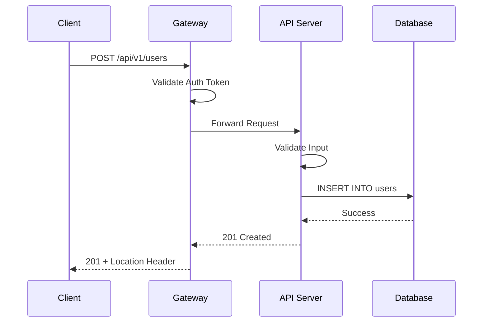
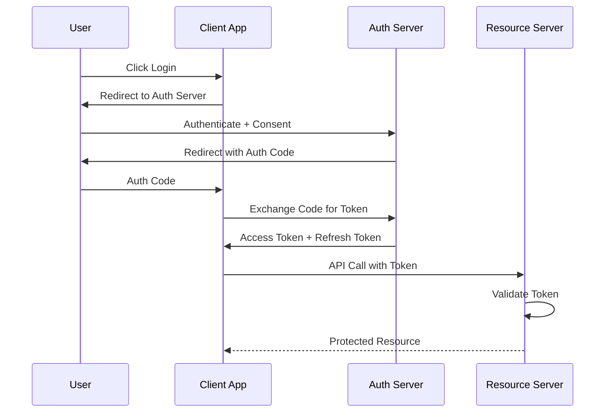

# API Design — Complete Interview Preparation Guide

---

## Table of Contents

1. [Introduction](#1-introduction)
2. [Learning Roadmap](#2-learning-roadmap)
3. [Theory Notes](#3-theory-notes)
4. [Key Concepts](#4-key-concepts)
5. [Interview Questions & Answers](#5-interview-questions--answers)
6. [Hands-on Practice](#6-hands-on-practice)
7. [FAANG Interview Questions](#7-faang-interview-questions)
8. [Common Mistakes to Avoid](#8-common-mistakes-to-avoid)
9. [Best Practices](#9-best-practices)
10. [Cheat Sheet](#10-cheat-sheet)
11. [Flash Cards](#11-flash-cards)
12. [Mind Map](#12-mind-map)
13. [Mermaid Diagrams](#13-mermaid-diagrams)
14. [Code Examples](#14-code-examples)
15. [Projects & Ideas](#15-projects--ideas)
16. [Resources](#16-resources)
117. [Interview Preparation Checklist](#117-interview-preparation-checklist)
118. [Revision Notes](#118-revision-notes)
119. [Mock Interview Questions](#119-mock-interview-questions)
120. [Difficulty Rating](#120-difficulty-rating)
121. [Summary](#121-summary)

---

## 1. Introduction

API (Application Programming Interface) Design is the process of defining how software components communicate. Good API design enables developers to build integrations efficiently, ensures consistency across services, and provides a contract between producers and consumers. API design is critical for backend engineers, architects, and anyone building or consuming web services.

### Why API Design Matters

- **Developer experience** — APIs are products; DX matters
- **Integration** — Enable communication between systems
- **Scalability** — Well-designed APIs scale naturally
- **Maintainability** — Clear contracts reduce breaking changes
- **Interview relevance** — Core topic for system design

### API Types

| Type | Protocol | Use Case |
|------|----------|----------|
| REST | HTTP | Web APIs, CRUD operations |
| GraphQL | HTTP | Flexible data fetching |
| gRPC | HTTP/2 | Internal microservices |
| WebSocket | TCP | Real-time bidirectional |
| SOAP | HTTP/XML | Enterprise systems |
| Webhook | HTTP | Event-driven notifications |

---

## 2. Learning Roadmap

### Phase 1: REST Fundamentals (Week 1)
- Understand HTTP methods and status codes
- Learn RESTful URL design
- Practice request/response formatting
- Study content negotiation

### Phase 2: API Design Patterns (Week 2)
- Pagination (offset, cursor)
- Filtering, sorting, searching
- Versioning strategies
- Error handling patterns

### Phase 3: Authentication & Security (Week 3)
- API keys, OAuth 2.0, JWT
- Rate limiting and throttling
- Input validation
- CORS and security headers

### Phase 4: Advanced Topics (Week 4)
- GraphQL fundamentals
- gRPC basics
- API documentation (OpenAPI/Swagger)
- API testing strategies

---

## 3. Theory Notes

### 3.1 REST Principles

**REST (Representational State Transfer):**
1. **Client-Server** — Separation of concerns
2. **Stateless** — Each request contains all needed information
3. **Cacheable** — Responses must define cacheability
4. **Uniform Interface** — Consistent resource identification
5. **Layered System** — Client can't tell if connected to end server
6. **Code on Demand** (optional) — Server can extend client functionality

**HTTP Methods:**
| Method | Purpose | Idempotent | Safe | Body |
|--------|---------|------------|------|------|
| GET | Retrieve resource | Yes | Yes | No |
| POST | Create resource | No | No | Yes |
| PUT | Replace resource | Yes | No | Yes |
| PATCH | Partial update | No* | No | Yes |
| DELETE | Remove resource | Yes | No | No |
| HEAD | Get metadata | Yes | Yes | No |
| OPTIONS | Get allowed methods | Yes | Yes | No |

*PATCH can be idempotent depending on implementation

### 3.2 URL Design

**Good URLs:**
```
GET    /api/v1/users          # List users
GET    /api/v1/users/123      # Get user 123
POST   /api/v1/users          # Create user
PUT    /api/v1/users/123      # Update user 123
DELETE /api/v1/users/123      # Delete user 123
GET    /api/v1/users/123/orders  # List user 123's orders
```

**Rules:**
- Use nouns, not verbs (`/users` not `/getUsers`)
- Use plural nouns (`/users` not `/user`)
- Use HTTP methods for actions
- Nest resources for relationships
- Use query parameters for filtering

### 3.3 Status Codes

**Success (2xx):**
| Code | Meaning | When to Use |
|------|---------|-------------|
| 200 | OK | Successful GET, PUT, PATCH, DELETE |
| 201 | Created | Successful POST that creates resource |
| 202 | Accepted | Request accepted for async processing |
| 204 | No Content | Successful DELETE, no response body |

**Client Error (4xx):**
| Code | Meaning | When to Use |
|------|---------|-------------|
| 400 | Bad Request | Invalid input, validation error |
| 401 | Unauthorized | Authentication required |
| 403 | Forbidden | Authenticated but not authorized |
| 404 | Not Found | Resource doesn't exist |
| 409 | Conflict | Resource already exists |
| 422 | Unprocessable | Valid syntax but semantic errors |
| 429 | Too Many Requests | Rate limit exceeded |

**Server Error (5xx):**
| Code | Meaning | When to Use |
|------|---------|-------------|
| 500 | Internal Server Error | Unexpected server failure |
| 502 | Bad Gateway | Upstream service error |
| 503 | Service Unavailable | Server overloaded or maintenance |
| 504 | Gateway Timeout | Upstream service timeout |

### 3.4 Pagination

**Offset-Based:**
```
GET /api/users?offset=20&limit=10
```
Pros: Simple, familiar. Cons: Inconsistent results with data changes, slow for large offsets.

**Cursor-Based:**
```
GET /api/users?cursor=abc123&limit=10
```
Pros: Consistent, efficient for large datasets. Cons: More complex, can't jump to arbitrary page.

**Keyset:**
```
GET /api/users?created_after=2024-01-01&limit=10
```
Pros: Efficient, no offset drift. Cons: Requires indexed column.

### 3.5 Versioning Strategies

| Strategy | Example | Pros | Cons |
|----------|---------|------|------|
| URI | /v1/users | Explicit, cacheable | URL proliferation |
| Header | Accept: application/vnd.api+json;v=1 | Clean URLs | Hidden complexity |
| Query | /users?version=1 | Simple | Not cacheable |
| Content Negotiation | Content-Type: app/vnd.api.v1+json | RESTful | Complex |

---

## 4. Key Concepts

### 4.1 Authentication Methods

**API Key:**
Simple key passed as header or query parameter. Good for server-to-server. Not secure for client-side.

**OAuth 2.0:**
Delegated authorization framework. Tokens (access + refresh) grant limited access. Flows: Authorization Code, Client Credentials, PKCE.

**JWT (JSON Web Token):**
Self-contained token with encoded claims. Three parts: header.payload.signature. Stateless verification.

**Bearer Token:**
Token sent in Authorization header: `Authorization: Bearer <token>`

### 4.2 Rate Limiting

**Algorithms:**
- **Fixed Window** — X requests per Y seconds (simple, bursty)
- **Sliding Window** — Rolling window (smoother)
- **Token Bucket** — Tokens consumed per request (flexible)
- **Leaky Bucket** — Requests queued at fixed rate (smooth output)

**Headers:**
```
X-RateLimit-Limit: 100
X-RateLimit-Remaining: 42
X-RateLimit-Reset: 1625097600
Retry-After: 30
```

### 4.3 Error Response Format

**RFC 7807 Problem Details:**
```json
{
  "type": "https://api.example.com/errors/validation",
  "title": "Validation Error",
  "status": 422,
  "detail": "The request body contains invalid fields",
  "instance": "/api/v1/users/123",
  "errors": [
    {
      "field": "email",
      "message": "Invalid email format",
      "code": "INVALID_FORMAT"
    }
  ]
}
```

### 4.4 API Documentation

**OpenAPI/Swagger:**
YAML/JSON specification describing API endpoints, request/response schemas, and authentication.

**Key Components:**
- OpenAPI version
- Info (title, version, description)
- Servers
- Paths (endpoints)
- Components (schemas, parameters, responses)
- Security schemes

---

## 5. Interview Questions & Answers

### REST Design

**Q1: Design a REST API for a blog platform.**
**A:**
```
Resources: users, posts, comments, tags

GET    /api/v1/users                # List users
POST   /api/v1/users                # Create user
GET    /api/v1/users/:id            # Get user
PUT    /api/v1/users/:id            # Update user
DELETE /api/v1/users/:id            # Delete user

GET    /api/v1/posts                # List posts (with pagination)
POST   /api/v1/posts                # Create post
GET    /api/v1/posts/:id            # Get post
PATCH  /api/v1/posts/:id            # Update post
DELETE /api/v1/posts/:id            # Delete post
GET    /api/v1/posts/:id/comments   # List post comments
POST   /api/v1/posts/:id/comments   # Add comment

GET    /api/v1/posts?author=123     # Filter by author
GET    /api/v1/posts?tag=python     # Filter by tag
GET    /api/v1/posts?sort=-created  # Sort by created desc
```

**Q2: How do you handle pagination in a REST API?**
**A:** Use cursor-based pagination for consistency:
```json
{
  "data": [...],
  "pagination": {
    "next_cursor": "eyJpZCI6MTIzfQ==",
    "has_more": true,
    "limit": 10
  }
}
```
Response headers: `Link: <url?cursor=...&limit=10>; rel="next"`. For simple cases, offset pagination works: `?page=3&per_page=10`. Always include total count for UI pagination components. Use ETag or Last-Modified for conditional requests.

**Q3: What are idempotency keys and why are they important?**
**A:** An idempotency key is a unique identifier sent with a request to ensure that duplicate requests are processed only once. Important for: (1) Network retries — Client may retry on timeout, (2) Payment processing — Avoid double charges, (3) Create operations — Prevent duplicate resources. Implementation: Client generates UUID, includes in header. Server checks cache/database: if key exists, return cached response; otherwise process request and store result with key. Set TTL (e.g., 24 hours) for cleanup.

**Q4: How do you design an API that supports both synchronous and asynchronous operations?**
**A:** (1) **Synchronous** — For quick operations (<5s): Return result directly with 200/201, (2) **Asynchronous** — For long operations: Return 202 Accepted with job ID, client polls for status:
```
POST /api/reports → 202 {"job_id": "abc", "status": "processing"}
GET /api/jobs/abc → 200 {"status": "completed", "result_url": "..."}
```
(3) **Webhooks** — For real-time notifications: Register callback URL, server POSTs when done, (4) **SSE/WebSocket** — For streaming results, (5) **Polling with backoff** — Client polls with exponential backoff.

**Q5: How do you version a REST API?**
**A:** URI versioning is simplest and most explicit: `/v1/users`, `/v2/users`. Strategy: (1) **Major version** in URI for breaking changes, (2) **Additive changes** don't require versioning (new fields, new endpoints), (3) **Deprecation policy** — Announce deprecation, provide migration guide, support old version for N months, (4) **Headers** — Use Accept header for content negotiation: `Accept: application/vnd.api.v2+json`, (5) **Documentation** — Clearly document what changed in each version.

### Security

**Q6: Explain OAuth 2.0 flow for a web application.**
**A:** Authorization Code flow: (1) Client redirects user to Authorization Server, (2) User authenticates and grants consent, (3) Auth Server redirects back with authorization code, (4) Client exchanges code for access token (+ refresh token), (5) Client uses access token to access protected resources, (6) When token expires, use refresh token to get new access token. PKCE extension for public clients (mobile, SPA) adds code verifier/challenge for security.

**Q7: How do you implement rate limiting?**
**A:** (1) **Identify clients** — By API key, IP address, or user ID, (2) **Choose algorithm** — Token bucket for burst tolerance, sliding window for smooth limiting, (3) **Store state** — Redis for distributed rate limiting, (4) **Return headers** — X-RateLimit-Limit, X-RateLimit-Remaining, X-RateLimit-Reset, (5) **Handle exceeded** — Return 429 Too Many Requests with Retry-After header, (6) **Tiered limits** — Different limits for different API tiers, (7) **Whitelist** — Bypass for trusted partners, (8) **Sliding window log** — Store timestamp of each request; count requests in window.

**Q8: What security headers should an API return?**
**A:** (1) `Strict-Transport-Security` — Force HTTPS, (2) `X-Content-Type-Options: nosniff` — Prevent MIME sniffing, (3) `X-Frame-Options: DENY` — Prevent clickjacking, (4) `Content-Security-Policy` — Restrict resource loading, (5) `X-XSS-Protection: 1` — Enable XSS filter, (6) `Cache-Control: no-store` — Prevent caching sensitive data, (7) `CORS headers` — Control cross-origin access, (8) `Referrer-Policy` — Control referrer information leakage.

### Performance

**Q9: How do you optimize API performance?**
**A:** (1) **Caching** — HTTP caching (ETag, Cache-Control), Redis for computed data, (2) **Pagination** — Never return unbounded results, (3) **Field selection** — `?fields=id,name,email` to reduce payload, (4) **Compression** — gzip/Brotli for responses, (5) **Connection pooling** — Reuse database connections, (6) **CDN** — Cache static responses at edge, (7) **Async processing** — Offload heavy work to background jobs, (8) **Database optimization** — Indexes, query optimization, read replicas, (9) **Batch operations** — Bulk endpoints for multiple items, (10) **HTTP/2** — Multiplexing, header compression.

**Q10: How do you handle API errors consistently?**
**A:** (1) **Standard format** — Use RFC 7807 or consistent custom format, (2) **Error codes** — Machine-readable codes (VALIDATION_ERROR, NOT_FOUND), (3) **Messages** — Human-readable descriptions, (4) **Details** — Field-level errors for validation, (5) **Request ID** — Include for debugging: `X-Request-ID`, (6) **Documentation** — Link to error documentation, (7) **Logging** — Log server-side errors with full context, (8) **Graceful degradation** — Return partial results when possible, (9) **Retry guidance** — Include Retry-After for transient errors.

---

## 6. Hands-on Practice

### Practice 1: Design a REST API

**Design a URL shortener API:**

```yaml
openapi: 3.0.0
info:
  title: URL Shortener API
  version: 1.0.0
paths:
  /urls:
    post:
      summary: Shorten a URL
      requestBody:
        content:
          application/json:
            schema:
              type: object
              required:
                - long_url
              properties:
                long_url:
                  type: string
                  format: uri
                custom_alias:
                  type: string
                expires_at:
                  type: string
                  format: date-time
      responses:
        '201':
          content:
            application/json:
              schema:
                type: object
                properties:
                  id:
                    type: string
                  short_url:
                    type: string
                  long_url:
                    type: string
                  created_at:
                    type: string
                  expires_at:
                    type: string
    get:
      summary: List user's URLs
      parameters:
        - name: cursor
          in: query
          schema:
            type: string
        - name: limit
          in: query
          schema:
            type: integer
            default: 20
      responses:
        '200':
          content:
            application/json:
              schema:
                type: object
                properties:
                  data:
                    type: array
                  pagination:
                    type: object

  /urls/{id}:
    get:
      summary: Get URL details
      responses:
        '200':
          content:
            application/json:
              schema:
                type: object
    delete:
      summary: Delete a URL
      responses:
        '204':
          description: URL deleted

  /{short_code}:
    get:
      summary: Redirect to original URL
      responses:
        '301':
          description: Redirect
        '404':
          description: URL not found
```

### Practice 2: Error Handling Pattern

```python
from dataclasses import dataclass, field
from typing import Optional, List
from enum import Enum


class ErrorCode(Enum):
    VALIDATION_ERROR = "VALIDATION_ERROR"
    NOT_FOUND = "NOT_FOUND"
    UNAUTHORIZED = "UNAUTHORIZED"
    FORBIDDEN = "FORBIDDEN"
    CONFLICT = "CONFLICT"
    RATE_LIMITED = "RATE_LIMITED"
    INTERNAL_ERROR = "INTERNAL_ERROR"


@dataclass
class APIError:
    code: ErrorCode
    message: str
    status: int
    details: Optional[List[dict]] = None
    request_id: Optional[str] = None

    def to_dict(self) -> dict:
        result = {
            "error": {
                "code": self.code.value,
                "message": self.message,
                "status": self.status
            }
        }
        if self.details:
            result["error"]["details"] = self.details
        if self.request_id:
            result["error"]["request_id"] = self.request_id
        return result


@dataclass
class ErrorResponse:
    """Standardized API error responses."""

    @staticmethod
    def validation_error(errors: list, request_id: str = None) -> dict:
        return APIError(
            code=ErrorCode.VALIDATION_ERROR,
            message="The request body contains invalid fields",
            status=422,
            details=errors,
            request_id=request_id
        ).to_dict()

    @staticmethod
    def not_found(resource: str, resource_id: str, request_id: str = None) -> dict:
        return APIError(
            code=ErrorCode.NOT_FOUND,
            message=f"{resource} with id '{resource_id}' not found",
            status=404,
            request_id=request_id
        ).to_dict()

    @staticmethod
    def unauthorized(message: str = "Authentication required") -> dict:
        return APIError(
            code=ErrorCode.UNAUTHORIZED,
            message=message,
            status=401
        ).to_dict()

    @staticmethod
    def rate_limited(retry_after: int) -> dict:
        return APIError(
            code=ErrorCode.RATE_LIMITED,
            message=f"Rate limit exceeded. Retry after {retry_after} seconds",
            status=429
        ).to_dict()


# Usage
print(ErrorResponse.validation_error([
    {"field": "email", "message": "Invalid email format", "code": "INVALID_FORMAT"},
    {"field": "name", "message": "Required field", "code": "REQUIRED"}
], request_id="req_abc123"))
```

---

## 7. FAANG Interview Questions

### Google

**Q: Design a rate limiting system for a public API.**
**A:** (1) **Architecture** — Distributed rate limiter using Redis, (2) **Algorithm** — Token bucket per API key for burst tolerance, (3) **Key identification** — By API key with fallback to IP, (4) **Limits** — Tiered: Free (100/hr), Pro (10K/hr), Enterprise (custom), (5) **Storage** — Redis with TTL for window cleanup, (6) **Consistency** — Use Lua scripts for atomic operations, (7) **Headers** — Always return limit/remaining/reset headers, (8) **Graceful degradation** — Return 429 with Retry-After, not connection drops, (9) **Monitoring** — Track rate limit hits per key for abuse detection, (10) **Whitelisting** — Bypass for internal services and partners.

### Amazon

**Q: How would you design an API gateway for microservices?**
**A:** (1) **Routing** — Map external paths to internal services, (2) **Authentication** — Verify JWT/API keys at gateway, (3) **Rate limiting** — Global and per-service limits, (4) **Request transformation** — Protocol translation, header manipulation, (5) **Response aggregation** — Combine multiple service responses, (6) **Circuit breaker** — Prevent cascade failures, (7) **Caching** — Cache responses at gateway level, (8) **Logging** — Centralized request/response logging, (9) **Versioning** — Route to different service versions, (10) **Monitoring** — Metrics for latency, errors, traffic per service. Tools: Kong, AWS API Gateway, Envoy.

### Meta

**Q: How do you design an API that handles file uploads efficiently?**
**A:** (1) **Presigned URLs** — Generate upload URL; client uploads directly to storage (S3), (2) **Chunked upload** — Split large files; upload in parallel; resume on failure, (3) **Multipart** — For small files (<10MB), multipart form upload through API, (4) **Progress tracking** — Return upload ID; client polls for progress, (5) **Content validation** — Validate file type and size at upload endpoint, (6) **Metadata** — Separate metadata from file data; store metadata in DB, (7) **Tus protocol** — Resumable upload protocol for reliability, (8) **CDN** — Serve uploaded files through CDN, (9) **Virus scanning** — Async scan after upload; notify when ready, (10) **Storage tiering** — Hot/warm/cold storage based on access patterns.

---

## 8. Common Mistakes to Avoid

| Mistake | Problem | Solution |
|---------|---------|----------|
| Using verbs in URLs | Not RESTful | Use HTTP methods instead |
| Returning 200 for errors | Confuses clients | Use appropriate status codes |
| No pagination | Returns unbounded data | Always paginate collections |
| Exposing internal IDs | Security risk | Use opaque identifiers |
| Inconsistent error formats | Hard to parse | Standardize error responses |
| No versioning | Breaking changes break clients | Version from day one |

---

## 9. Best Practices

1. **Design for the consumer** — Think about DX first
2. **Use consistent naming** — camelCase or snake_case, stick to one
3. **Document everything** — Use OpenAPI/Swagger
4. **Version from day one** — Even before you think you need it
5. **Validate inputs** — Reject invalid data early
6. **Use proper status codes** — Not everything is 200 or 500
7. **Implement idempotency** — For critical operations
8. **Log requests** — Include request IDs for debugging

---

## 10. Cheat Sheet

```
API DESIGN CHEAT SHEET
═══════════════════════

HTTP METHODS
────────────
GET    — Read (safe, idempotent)
POST   — Create (not idempotent)
PUT    — Full update (idempotent)
PATCH  — Partial update
DELETE — Remove (idempotent)

STATUS CODES
────────────
200 OK              201 Created
202 Accepted        204 No Content
400 Bad Request     401 Unauthorized
403 Forbidden       404 Not Found
409 Conflict        422 Unprocessable
429 Too Many        500 Server Error
502 Bad Gateway     503 Unavailable

URL DESIGN
──────────
/api/v1/users          — List users
/api/v1/users/123      — Get user 123
/api/v1/users/123/orders — User's orders

PAGINATION
──────────
Offset: ?page=3&per_page=10
Cursor:  ?cursor=abc&limit=10

RATE LIMITING HEADERS
─────────────────────
X-RateLimit-Limit: 100
X-RateLimit-Remaining: 42
X-RateLimit-Reset: 1625097600
Retry-After: 30

ERROR FORMAT (RFC 7807)
───────────────────────
{
  "type": "...",
  "title": "...",
  "status": 422,
  "detail": "...",
  "instance": "..."
}
```

---

## 11. Flash Cards

**Card 1:** What makes an API RESTful?
→ Client-server, stateless, cacheable, uniform interface, layered system.

**Card 2:** What is the difference between PUT and PATCH?
→ PUT replaces entire resource; PATCH applies partial update.

**Card 3:** What is idempotency?
→ Making duplicate requests produce the same result as a single request.

**Card 4:** What is the difference between 401 and 403?
→ 401: Not authenticated; 403: Authenticated but not authorized.

**Card 5:** What is cursor-based pagination?
→ Using a cursor (opaque token) to mark position, more stable than offset.

**Card 6:** What is OAuth 2.0?
→ Delegated authorization framework using access/refresh tokens.

**Card 7:** What is rate limiting?
→ Restricting number of requests per time window per client.

**Card 8:** What is a webhook?
→ HTTP callback triggered by events; server POSTs to registered URL.

**Card 9:** What is the 202 status code?
→ Accepted; request received for async processing, not yet complete.

**Card 10:** What is OpenAPI/Swagger?
→ Specification format for describing REST API endpoints and schemas.

---

## 12. Mind Map

```
API Design
│
├─── REST
│    ├─── HTTP Methods
│    ├─── Status Codes
│    ├─── URL Design
│    ├─── Pagination
│    ├─── Versioning
│    └─── Content Negotiation
│
├─── Security
│    ├─── Authentication
│    │    ├─── API Keys
│    │    ├─── OAuth 2.0
│    │    └─── JWT
│    ├─── Authorization
│    │    ├─── RBAC
│    │    └─── ABAC
│    ├─── Rate Limiting
│    └─── Input Validation
│
├─── Performance
│    ├─── Caching
│    ├─── Compression
│    ├─── Connection Pooling
│    └─── CDN
│
├─── Documentation
│    ├─── OpenAPI/Swagger
│    ├─── API Reference
│    └─── SDKs
│
├─── Other Protocols
│    ├─── GraphQL
│    ├─── gRPC
│    ├─── WebSocket
│    └─── Webhook
│
└─── Tools
     ├─── Postman
     ├─── Swagger UI
     ├─── API Gateway
     └─── Load Balancer
```

---

## 13. Mermaid Diagrams

### REST API Request Flow



### OAuth 2.0 Authorization Code Flow



---

## 14. Code Examples

See Hands-on Practice section for API design examples and error handling patterns.

---

## 15. Projects & Ideas

| # | Project | Description | Difficulty | Tools |
|---|---------|-------------|------------|-------|
| 1 | REST API | Build a CRUD API for a blog | ⭐⭐ | Express, Flask |
| 2 | API Gateway | Simple API gateway with routing | ⭐⭐⭐⭐ | Node.js, Go |
| 3 | Rate Limiter | Distributed rate limiting with Redis | ⭐⭐⭐ | Redis, Python |
| 4 | Swagger Documentation | Auto-generate API docs | ⭐⭐ | OpenAPI, Swagger UI |
| 5 | GraphQL API | Build a GraphQL server | ⭐⭐⭐ | Apollo, Hasura |
| 6 | Webhook System | Event-driven webhook delivery | ⭐⭐⭐⭐ | Go, Redis |
| 7 | API Testing Suite | Automated API test framework | ⭐⭐⭐ | pytest, Jest |
| 8 | Auth Service | OAuth 2.0 implementation | ⭐⭐⭐⭐⭐ | Node.js, Passport |

---

## 16. Resources

### Books
- **"REST API Design Rulebook"** by Mark Massé
- **"Designing Web APIs"** by Brenda Jin
- **"Building Microservices"** by Sam Newman

### Tools
- **Postman** — API testing and development
- **Swagger/OpenAPI** — API specification
- **Insomnia** — REST/GraphQL client

---

## 17. Interview Preparation Checklist

### REST Fundamentals
- [ ] Know all HTTP methods and their semantics
- [ ] Understand status codes and when to use each
- [ ] Design RESTful URLs for CRUD operations
- [ ] Implement pagination (offset and cursor)

### Security
- [ ] Understand OAuth 2.0 flows
- [ ] Implement JWT authentication
- [ ] Design rate limiting strategies
- [ ] Know common security headers

### Best Practices
- [ ] Use consistent error formats
- [ ] Version APIs from day one
- [ ] Document with OpenAPI
- [ ] Implement idempotency for critical operations

---

## 18. Revision Notes

### HTTP Methods Quick Reference

| Method | Body | Idempotent | Safe | Cacheable |
|--------|------|------------|------|-----------|
| GET | No | Yes | Yes | Yes |
| POST | Yes | No | No | Sometimes |
| PUT | Yes | Yes | No | No |
| PATCH | Yes | No* | No | No |
| DELETE | No | Yes | No | No |

### Error Response Template

```json
{
  "error": {
    "code": "VALIDATION_ERROR",
    "message": "Invalid request body",
    "status": 422,
    "details": [...],
    "request_id": "req_abc123"
  }
}
```

---

## 19. Mock Interview Questions

**Q1:** Design a REST API for a ride-sharing application.

**Q2:** How would you handle versioning when you need to rename a field?

**Q3:** Explain the OAuth 2.0 authorization code flow.

**Q4:** How do you implement rate limiting in a distributed system?

**Q5:** Design an API for a real-time chat application.

**Q6:** How do you handle API backward compatibility?

**Q7:** What are the trade-offs between REST and GraphQL?

**Q8:** Design an API key management system.

---

## 20. Difficulty Rating

| Topic | Difficulty | Time to Master | Priority |
|-------|-----------|----------------|----------|
| REST Basics | ⭐ | 3-5 days | Critical |
| Status Codes | ⭐ | 2-3 days | Critical |
| URL Design | ⭐⭐ | 1 week | High |
| Pagination | ⭐⭐ | 1 week | High |
| Authentication | ⭐⭐⭐⭐ | 3 weeks | High |
| Rate Limiting | ⭐⭐⭐ | 2 weeks | Medium |
| GraphQL | ⭐⭐⭐ | 2 weeks | Medium |
| gRPC | ⭐⭐⭐⭐ | 3 weeks | Low |

**Overall Interview Difficulty:** ⭐⭐⭐ (Moderate)

---

## 21. Summary

API design is a critical skill for building scalable, maintainable systems. Key concepts include RESTful design principles, proper HTTP method usage, consistent error handling, pagination strategies, authentication/authorization, and rate limiting. Good API design prioritizes developer experience while ensuring security and performance.

### Key Takeaways

1. **REST is about resources** — Use nouns, not verbs, in URLs
2. **HTTP methods have semantics** — Use them correctly
3. **Status codes communicate meaning** — Don't return 200 for errors
4. **Pagination is essential** — Never return unbounded results
5. **Security from day one** — Auth, rate limiting, input validation
6. **Version APIs early** — Breaking changes need versioning
7. **Document everything** — OpenAPI/Swagger for API contracts
8. **Idempotency prevents duplicates** — Critical for financial operations

---

> **Pro Tip:** API design interviews test your ability to think about developer experience, security, and scalability simultaneously. Always ask clarifying questions about the consumers, scale requirements, and security needs before designing.