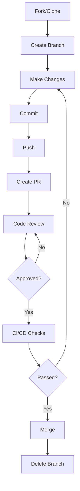
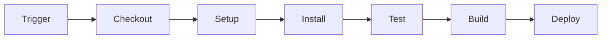
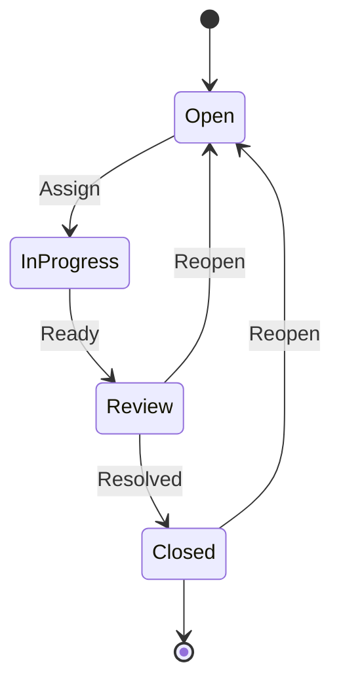

# GitHub - Complete Interview Preparation Guide

## Introduction

GitHub is a web-based platform for version control and collaboration using Git. It provides hosting for software development projects, tools for code review, project management, and CI/CD through GitHub Actions. GitHub is the world's largest software development platform with over 100 million developers.

GitHub extends Git with features like pull requests, issues, wikis, GitHub Actions, and social coding features. It's essential for modern software development collaboration and is deeply integrated into many development workflows.

Understanding GitHub's features and best practices is crucial for developers, as it's the primary platform for open-source contribution and team collaboration.

---

## Learning Roadmap

### Week 1: GitHub Fundamentals
- Repository creation and management
- README and documentation
- Issues and labels
- Pull requests basics
- Forking repositories

### Week 2: Collaboration Features
- Code review process
- Branch protection rules
- Team management
- Discussions
- Wiki and documentation

### Week 3: GitHub Actions
- Workflow syntax
- Creating custom actions
- CI/CD pipelines
- Matrix builds
- Secrets and environment variables

### Week 4: Project Management
- GitHub Projects (Kanban boards)
- Milestones
- Labels and milestones
- Project automation
- Roadmaps

### Week 5: Advanced Features
- GitHub Pages
- GitHub Packages
- GitHub Copilot
- GitHub API
- Security features (Dependabot, code scanning)

### Week 6: Best Practices and Open Source
- Open source contribution workflow
- Repository maintenance
- Community health files
- GitHub for enterprises
- GitHub Advanced Security

---

## Theory Notes

### Pull Request Workflow
1. Fork repository (for open source) or create branch
2. Make changes and commit
3. Push to remote
4. Create pull request
5. Code review and discussions
6. CI/CD checks pass
7. Merge (squash, rebase, or merge commit)
8. Delete branch

### Branch Protection Rules
- Require pull request reviews
- Require status checks (CI/CD)
- Require signed commits
- Require linear history
- Require conversation resolution
- Require code owner approval

### GitHub Actions Concepts
- **Workflow**: Automated process defined in YAML
- **Job**: Group of steps running on same runner
- **Step**: Individual task in a job
- **Action**: Reusable unit of workflow logic
- **Runner**: Server executing workflow

### Issue and PR Management
- **Issues**: Track bugs, features, tasks
- **Labels**: Categorize issues and PRs
- **Milestones**: Group issues for releases
- **Assignees**: Responsible team members
- **Projects**: Kanban-style boards

### GitHub Pages
- Static website hosting from repository
- Custom domain support
- Jekyll integration
- GitHub Actions for deployment
- Free hosting for open source

---

## Key Concepts

### Repository Management
1. **README**: Project documentation and overview
2. **LICENSE**: Legal usage terms
3. **CONTRIBUTING**: Contribution guidelines
4. **CODE_OF_CONDUCT**: Community standards
5. **SECURITY**: Security policy and reporting

### Pull Request Features
1. **Code Review**: Inline comments and suggestions
2. **Status Checks**: CI/CD pipeline results
3. **Merge Strategies**: Merge commit, squash, rebase
4. **Draft PRs**: Work-in-progress pull requests
5. **Auto-merge**: Merge when checks pass

### GitHub Actions
1. **Triggers**: push, pull_request, schedule, workflow_dispatch
2. **Jobs**: Parallel or sequential execution
3. **Steps**: Commands or actions
4. **Matrix**: Multiple configurations
5. **Artifacts**: Build outputs storage

### Security Features
1. **Dependabot**: Automated dependency updates
2. **Code Scanning**: Automated security analysis
3. **Secret Scanning**: Detect exposed secrets
4. **Security Advisories**: Vulnerability reporting
5. **SBOM**: Software Bill of Materials

### Collaboration Tools
1. **Teams**: Group organization members
2. **CODEOWNERS**: Automatic review assignments
3. **Discussions**: Community conversations
4. **Wiki**: Project documentation
5. **Projects**: Task management boards

---

## FAQ (20+ Q&A)

### Q1: What is the difference between fork and clone?
**A:** Clone creates local copy of repository. Fork creates server-side copy under your GitHub account. Fork is for contributing to others' projects; clone is for local development.

### Q2: What is a pull request?
**A:** Proposed changes to a repository, requesting review and merge. Enables code review, discussion, and automated checks before merging.

### Q3: What are GitHub Actions?
**A:** CI/CD platform for automating workflows. Define workflows in YAML, triggered by events. Build, test, deploy, and more.

### Q4: What is the difference between merge, squash, and rebase?
**A:** Merge: Creates merge commit preserving all history. Squash: Combines all commits into single commit. Rebase: Rewrites history for linear sequence.

### Q5: What are branch protection rules?
**A:** Settings preventing direct pushes to branches. Require PRs, reviews, status checks, and other requirements.

### Q6: What is CODEOWNERS?
**A:** File specifying code owners for repository paths. Automatically assigns reviewers to pull requests affecting owned code.

### Q7: What is Dependabot?
**A:** GitHub service that automatically creates PRs for dependency updates. Keeps dependencies secure and up-to-date.

### Q8: What are GitHub Actions secrets?
**A:** Encrypted variables for sensitive data (API keys, tokens). Available to workflows, hidden from logs.

### Q9: What is the difference between issues and projects?
**A:** Issues track individual tasks or bugs. Projects are Kanban boards organizing issues and PRs.

### Q10: What is GitHub Pages?
**A:** Static website hosting from repository. Supports Jekyll, custom domains, and GitHub Actions deployment.

### Q11: What is GitHub Copilot?
**A:** AI pair programmer suggesting code completions. Integrates with IDEs, helps write code faster.

### Q12: What are GitHub Packages?
**A:** Package hosting service for software packages. Supports npm, Maven, NuGet, RubyGems, Docker.

### Q13: What is the GitHub API?
**A:** REST and GraphQL APIs for programmatic access to GitHub features. Automate workflows, integrate with tools.

### Q14: What is a GitHub Marketplace?
**A:** Platform for finding and purchasing tools that integrate with GitHub. Actions, apps, and services.

### Q15: What are GitHub Projects?
**A:** Kanban-style project management. Organize issues and PRs into columns, track progress.

### Q16: What is the difference between public and private repositories?
**A:** Public: Visible to everyone on GitHub. Private: Visible only to repository collaborators.

### Q17: What is GitHub Advanced Security?
**A:** Security features including code scanning, secret scanning, and dependency review. Available for GitHub Enterprise.

### Q18: What is a GitHub Gist?
**A:** Simple way to share code, notes, and snippets. Public or secret, supports versioning.

### Q19: What is GitHub Sponsors?
**A:** Platform for financially supporting open source developers and projects.

### Q20: What is the difference between GitHub and GitLab?
**A:** GitHub: Microsoft-owned, largest developer platform. GitLab: DevOps platform with built-in CI/CD. Both offer similar features with different interfaces.

### Q21: What is a GitHub Discussion?
**A:** Forum-style conversations within repositories. For questions, ideas, and community conversations.

### Q22: What is GitHub's social features?
**A:** Stars (bookmarking), watching (notifications), following (users), sponsoring (financial support).

---

## Hands-on Practice

### Lab 1: Create Repository with Best Practices
```bash
# Create repository with README, LICENSE, .gitignore
# After creation, clone locally
git clone https://github.com/username/repo-name.git
cd repo-name

# Create directory structure
mkdir -p src tests docs .github/workflows

# Create README.md
echo "# Project Name\n\nDescription of the project" > README.md

# Create LICENSE
echo "MIT License" > LICENSE

# Create .gitignore
cat > .gitignore << 'EOF'
# Dependencies
node_modules/
vendor/

# Build
dist/
build/

# IDE
.vscode/
.idea/

# OS
.DS_Store
Thumbs.db
EOF

# Push to GitHub
git add .
git commit -m "Initial project setup"
git push origin main
```

### Lab 2: Pull Request Workflow
```bash
# Create feature branch
git checkout -b feature/add-login

# Make changes
echo "Login functionality" > src/login.js

# Commit and push
git add .
git commit -m "feat(auth): add login page"
git push origin feature/add-login

# Create PR using GitHub CLI
gh pr create \
  --title "Add login functionality" \
  --body "Implements user authentication" \
  --reviewer teammate1,teammate2
```

### Lab 3: GitHub Actions Workflow
```yaml
# .github/workflows/ci.yml
name: CI/CD Pipeline

on:
  push:
    branches: [main, develop]
  pull_request:
    branches: [main]

jobs:
  test:
    runs-on: ubuntu-latest
    
    strategy:
      matrix:
        node-version: [16.x, 18.x, 20.x]
    
    steps:
      - uses: actions/checkout@v4
      
      - name: Use Node.js ${{ matrix.node-version }}
        uses: actions/setup-node@v4
        with:
          node-version: ${{ matrix.node-version }}
          cache: 'npm'
      
      - name: Install dependencies
        run: npm ci
      
      - name: Run tests
        run: npm test
      
      - name: Run linting
        run: npm run lint
      
      - name: Build
        run: npm run build
      
      - name: Upload coverage
        uses: codecov/codecov-action@v3
        with:
          file: ./coverage/lcov.info
```

### Lab 4: GitHub Actions with Deployment
```yaml
# .github/workflows/deploy.yml
name: Deploy

on:
  push:
    branches: [main]

jobs:
  deploy:
    runs-on: ubuntu-latest
    
    steps:
      - uses: actions/checkout@v4
      
      - name: Setup Node.js
        uses: actions/setup-node@v4
        with:
          node-version: '20'
      
      - name: Install and build
        run: |
          npm ci
          npm run build
      
      - name: Deploy to GitHub Pages
        uses: peaceiris/actions-gh-pages@v3
        with:
          github_token: ${{ secrets.GITHUB_TOKEN }}
          publish_dir: ./dist
```

### Lab 5: Issue Templates
```yaml
# .github/ISSUE_TEMPLATE/bug_report.yml
name: Bug Report
description: Report a bug
labels: ["bug", "triage"]
body:
  - type: textarea
    id: description
    attributes:
      label: Describe the bug
      description: A clear description of what the bug is
    validations:
      required: true
  - type: textarea
    id: reproduction
    attributes:
      label: To reproduce
      description: Steps to reproduce the behavior
    validations:
      required: true
  - type: textarea
    id: expected
    attributes:
      label: Expected behavior
      description: What you expected to happen
    validations:
      required: true
  - type: dropdown
    id: version
    attributes:
      label: Version
      options:
        - "1.0.0"
        - "0.9.0"
        - "0.8.0"
    validations:
      required: true
```

---

## FAANG Questions

### Amazon/Facebook Level
1. **Design a code review process for a large engineering team.**
   - Pull request requirements
   - Reviewer assignment (CODEOWNERS)
   - Required approvals
   - Status checks
   - Merge strategy

2. **How would you implement CI/CD using GitHub Actions?**
   - Workflow triggers
   - Matrix builds for multiple environments
   - Secret management
   - Caching strategies
   - Deployment automation

3. **Design a GitHub organization structure for 100 repositories.**
   - Team hierarchy
   - Repository naming conventions
   - Branch protection rules
   - Permissions management
   - Audit and compliance

### Google/Microsoft Level
4. **How would you migrate from another platform to GitHub?**
   - Repository migration
   - Pull request and issue migration
   - CI/CD pipeline migration
   - Team and permission migration
   - Training and documentation

5. **Design a GitHub Actions workflow for monorepo.**
   - Path-based triggers
   - Matrix builds
   - Reusable workflows
   - Caching strategies
   - Deployment per service

### Netflix/Apple Level
6. **How would you implement GitOps using GitHub Actions?**
   - Automated deployments on push
   - Multi-environment promotion
   - Rollback procedures
   - Secret management
   - Monitoring and alerting

---

## Common Mistakes

1. **Not writing good commit messages** - Vague or non-descriptive messages making history hard to understand.

2. **Ignoring PR reviews** - Merging without proper code review.

3. **Not using branch protection** - Allowing direct pushes to main branch.

4. **Hard-coding secrets in workflows** - Storing sensitive data in YAML files instead of secrets.

5. **Large pull requests** - Not breaking work into smaller, reviewable pieces.

6. **Not writing documentation** - Missing README, contributing guidelines, or API documentation.

7. **Ignoring CI/CD failures** - Not addressing failing checks before merging.

8. **Poor repository organization** - Not following naming conventions or directory structure.

9. **Not using GitHub Projects** - Missing out on project management features.

10. **Ignoring security alerts** - Not addressing Dependabot alerts or security advisories.

---

## Best Practices

### Repository Management
- Write comprehensive README
- Add LICENSE file
- Create CONTRIBUTING.md
- Use .gitignore
- Set up branch protection

### Pull Requests
- Keep PRs small and focused
- Write descriptive titles and descriptions
- Add relevant labels
- Request appropriate reviewers
- Address review comments

### GitHub Actions
- Use caching for dependencies
- Implement matrix builds
- Use reusable workflows
- Store secrets properly
- Monitor workflow runs

### Collaboration
- Use issue templates
- Create discussion forums
- Set up CODEOWNERS
- Use labels consistently
- Maintain project boards

### Security
- Enable Dependabot
- Implement secret scanning
- Use code scanning
- Review security advisories
- Implement access controls

---

## Cheat Sheet

### GitHub CLI Commands
```bash
# Repository
gh repo create name --public/--private
gh repo clone owner/repo
gh repo view

# Pull Requests
gh pr create --title "Title" --body "Description"
gh pr list
gh pr checkout number
gh pr merge number

# Issues
gh issue create --title "Title" --body "Description"
gh issue list
gh issue close number

# Actions
gh run list
gh run view run-id
gh workflow run name

# Releases
gh release create tag --title "Release" --notes "Notes"
gh release list
```

### GitHub Actions Common Workflows
```yaml
# Checkout
- uses: actions/checkout@v4

# Setup Node.js
- uses: actions/setup-node@v4
  with:
    node-version: '20'
    cache: 'npm'

# Cache dependencies
- uses: actions/cache@v3
  with:
    path: ~/.npm
    key: ${{ runner.os }}-npm-${{ hashFiles('**/package-lock.json') }}

# Upload artifacts
- uses: actions/upload-artifact@v3
  with:
    name: build
    path: dist/

# Download artifacts
- uses: actions/download-artifact@v3
  with:
    name: build
```

### Issue and PR Templates
```yaml
# Issue Template
name: Bug Report
about: Report a bug
title: '[BUG] '
labels: bug
assignees: ''

# PR Template
## Description
Brief description of changes

## Type of Change
- [ ] Bug fix
- [ ] New feature
- [ ] Breaking change

## Testing
- [ ] Unit tests pass
- [ ] Integration tests pass
- [ ] Manual testing completed
```

---

## Flash Cards (20)

**Card 1**: What is GitHub?
Web-based platform for version control and collaboration using Git.

**Card 2**: What is a pull request?
Proposed changes to a repository, requesting review and merge.

**Card 3**: What is forking?
Creating server-side copy of repository under your GitHub account.

**Card 4**: What are GitHub Actions?
CI/CD platform for automating workflows defined in YAML.

**Card 5**: What is branch protection?
Rules preventing direct pushes to branches, requiring PRs and reviews.

**Card 6**: What is CODEOWNERS?
File specifying code owners for automatic review assignment.

**Card 7**: What is Dependabot?
Service automatically creating PRs for dependency updates.

**Card 8**: What are GitHub secrets?
Encrypted variables for sensitive data in workflows.

**Card 9**: What is GitHub Pages?
Static website hosting from repository.

**Card 10**: What is GitHub Copilot?
AI pair programmer suggesting code completions.

**Card 11**: What are GitHub Packages?
Package hosting service for software packages.

**Card 12**: What is GitHub Projects?
Kanban-style project management boards.

**Card 13**: What are GitHub Discussions?
Forum-style conversations within repositories.

**Card 14**: What is a GitHub Gist?
Simple way to share code snippets and notes.

**Card 15**: What is the GitHub API?
REST and GraphQL APIs for programmatic access.

**Card 16**: What is GitHub Marketplace?
Platform for finding and purchasing GitHub integrations.

**Card 17**: What is GitHub Sponsors?
Platform for financially supporting open source projects.

**Card 18**: What is GitHub Advanced Security?
Security features including code and secret scanning.

**Card 19**: What are GitHub Releases?
Packaged software releases with binaries and release notes.

**Card 20**: What is GitHub's social coding?
Stars, watchers, followers, and community features.

---

## Mind Map

```
GitHub
├── Repository Management
│   ├── README
│   ├── LICENSE
│   ├── .gitignore
│   ├── CONTRIBUTING
│   └── SECURITY
├── Collaboration
│   ├── Pull Requests
│   ├── Code Review
│   ├── Issues
│   ├── Discussions
│   └── Wiki
├── GitHub Actions
│   ├── Workflows
│   ├── Jobs
│   ├── Steps
│   ├── Actions
│   └── Runners
├── Project Management
│   ├── Projects
│   ├── Milestones
│   ├── Labels
│   └── Roadmaps
├── Security
│   ├── Dependabot
│   ├── Code Scanning
│   ├── Secret Scanning
│   └── Security Advisories
└── Advanced
    ├── GitHub Pages
    ├── GitHub Packages
    ├── GitHub Copilot
    └── GitHub API
```

---

## Mermaid Diagrams

### Pull Request Flow


### GitHub Actions Workflow


### Issue Lifecycle


---

## Code Examples

### GitHub Actions - Complete CI/CD
```yaml
# .github/workflows/ci-cd.yml
name: CI/CD

on:
  push:
    branches: [main, develop]
  pull_request:
    branches: [main]

env:
  REGISTRY: ghcr.io
  IMAGE_NAME: ${{ github.repository }}

jobs:
  test:
    runs-on: ubuntu-latest
    
    strategy:
      matrix:
        node-version: [18.x, 20.x]
    
    steps:
      - uses: actions/checkout@v4
      
      - name: Setup Node.js
        uses: actions/setup-node@v4
        with:
          node-version: ${{ matrix.node-version }}
          cache: 'npm'
      
      - name: Install dependencies
        run: npm ci
      
      - name: Run tests
        run: npm test -- --coverage
      
      - name: Upload coverage
        uses: codecov/codecov-action@v3
        if: matrix.node-version == '20.x'

  build:
    needs: test
    runs-on: ubuntu-latest
    if: github.event_name == 'push'
    
    permissions:
      contents: read
      packages: write
    
    steps:
      - uses: actions/checkout@v4
      
      - name: Log in to Container Registry
        uses: docker/login-action@v2
        with:
          registry: ${{ env.REGISTRY }}
          username: ${{ github.actor }}
          password: ${{ secrets.GITHUB_TOKEN }}
      
      - name: Extract metadata
        id: meta
        uses: docker/metadata-action@v4
        with:
          images: ${{ env.REGISTRY }}/${{ env.IMAGE_NAME }}
          tags: |
            type=ref,event=branch
            type=sha,prefix=
      
      - name: Build and push
        uses: docker/build-push-action@v4
        with:
          context: .
          push: true
          tags: ${{ steps.meta.outputs.tags }}
          labels: ${{ steps.meta.outputs.labels }}

  deploy:
    needs: build
    runs-on: ubuntu-latest
    if: github.ref == 'refs/heads/main'
    environment: production
    
    steps:
      - uses: actions/checkout@v4
      
      - name: Deploy to production
        run: |
          echo "Deploying to production..."
          # kubectl apply -f k8s/
```

### GitHub API Script
```python
import requests
import json

class GitHubAPI:
    def __init__(self, token):
        self.base_url = "https://api.github.com"
        self.headers = {
            "Authorization": f"token {token}",
            "Accept": "application/vnd.github.v3+json"
        }
    
    def get_repository(self, owner, repo):
        response = requests.get(
            f"{self.base_url}/repos/{owner}/{repo}",
            headers=self.headers
        )
        return response.json()
    
    def create_issue(self, owner, repo, title, body):
        response = requests.post(
            f"{self.base_url}/repos/{owner}/{repo}/issues",
            headers=self.headers,
            json={
                "title": title,
                "body": body
            }
        )
        return response.json()
    
    def list_pull_requests(self, owner, repo, state="open"):
        response = requests.get(
            f"{self.base_url}/repos/{owner}/{repo}/pulls",
            headers=self.headers,
            params={"state": state}
        )
        return response.json()

# Usage
github = GitHubAPI("your-token")
repo = github.get_repository("owner", "repo")
issues = github.create_issue("owner", "repo", "Bug", "Description")
```

---

## Projects

### Project 1: Open Source Repository
Create a well-maintained open source project:
- Comprehensive README
- Contributing guidelines
- Issue and PR templates
- GitHub Actions CI/CD
- Documentation

### Project 2: GitHub Actions Marketplace Action
Build a reusable GitHub Action:
- Action definition (action.yml)
- Documentation
- Examples
- Testing workflow
- Versioning strategy

### Project 3: GitHub Organization Setup
Set up a GitHub organization:
- Team structure
- Repository templates
- Branch protection rules
- CODEOWNERS files
- Security policies

---

## Resources

### Official Documentation
- [GitHub Docs](https://docs.github.com/)
- [GitHub Actions](https://docs.github.com/en/actions)
- [GitHub API](https://docs.github.com/en/rest)
- [GitHub Security](https://docs.github.com/en/security)

### Learning Platforms
- GitHub Learning Lab
- GitHub Skills
- All GitHub training courses

### Tools
- **GitHub CLI**: Command-line interface
- **GitHub Desktop**: GUI client
- **GitHub Codespaces**: Cloud development environments
- **GitHub Copilot**: AI pair programming

### Community
- GitHub Community
- GitHubponsors
- GitHub Education
- GitHub for Open Source

---

## Checklist

- [ ] Create GitHub account
- [ ] Set up Git configuration
- [ ] Create repositories with best practices
- [ ] Understand pull request workflow
- [ ] Implement GitHub Actions CI/CD
- [ ] Set up branch protection rules
- [ ] Use GitHub Projects for management
- [ ] Configure Dependabot
- [ ] Set up GitHub Pages
- [ ] Use GitHub API
- [ ] Contribute to open source
- [ ] Implement security best practices
- [ ] Prepare for interviews

---

## Mock Interviews

### Scenario 1: Developer
**Interviewer**: "Describe your code review process on GitHub."

**Key Points to Cover**:
- Pull request creation
- Reviewer assignment
- Code review best practices
- Status checks
- Merge strategy

### Scenario 2: DevOps Engineer
**Interviewer**: "How would you set up CI/CD for a Node.js application using GitHub Actions?"

**Key Points to Cover**:
- Workflow triggers
- Testing matrix
- Build and test steps
- Deployment strategy
- Secret management

### Scenario 3: Tech Lead
**Interviewer**: "Design a GitHub organization structure for a growing startup."

**Key Points to Cover**:
- Team hierarchy
- Repository structure
- Permissions management
- Branch protection
- Security policies

---

## Difficulty Rating

| Topic | Difficulty | Time to Learn |
|-------|------------|---------------|
| GitHub Basics | ⭐ | 1 week |
| Pull Requests | ⭐⭐ | 1-2 weeks |
| GitHub Actions | ⭐⭐⭐ | 2-3 weeks |
| Branch Protection | ⭐⭐ | 1 week |
| Project Management | ⭐⭐ | 1-2 weeks |
| GitHub API | ⭐⭐⭐ | 2-3 weeks |
| Security Features | ⭐⭐⭐ | 2-3 weeks |
| Advanced Features | ⭐⭐⭐⭐ | 3-4 weeks |

---

## Summary

GitHub is the world's leading development platform. Key areas for interviews include:

1. **Collaboration**: Pull requests, code review, issues
2. **GitHub Actions**: CI/CD automation
3. **Project Management**: Projects, milestones, labels
4. **Security**: Dependabot, code scanning, secret scanning
5. **Advanced Features**: Pages, Packages, Copilot, API
6. **Best Practices**: Documentation, templates, automation

Mastering GitHub prepares you for collaborative software development and open source contribution.
