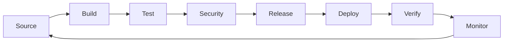
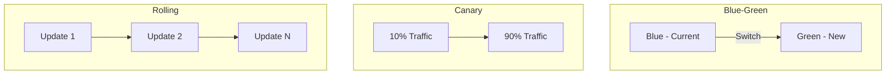
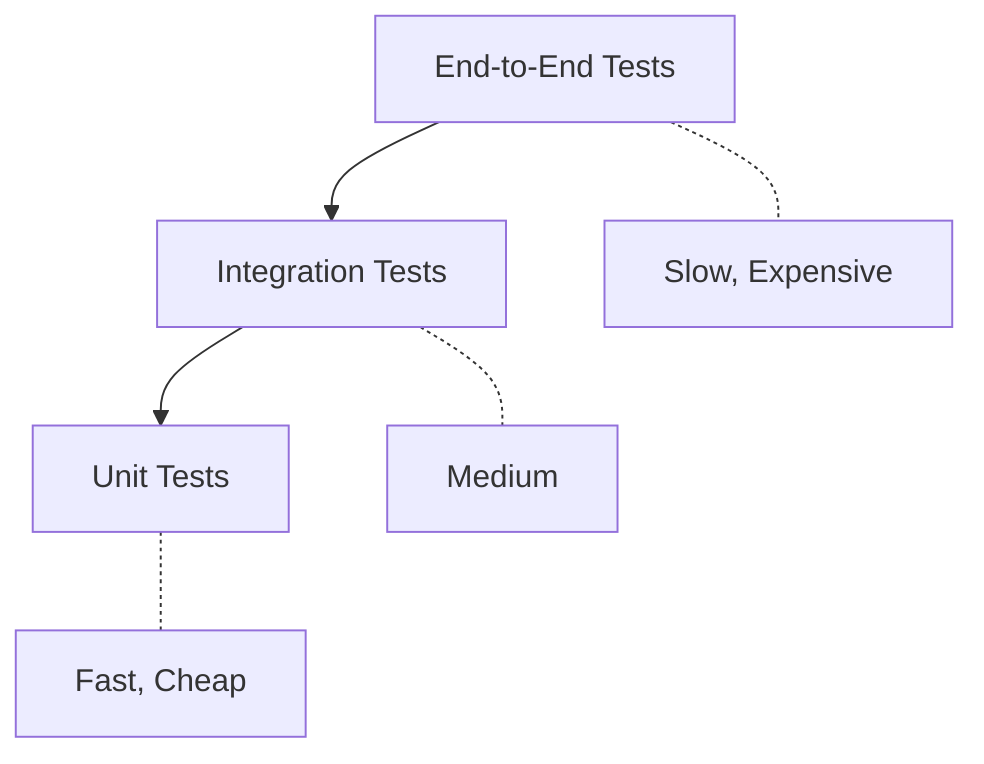

# CI/CD - Complete Interview Preparation Guide

## Introduction

Continuous Integration and Continuous Delivery/Deployment (CI/CD) is a set of practices that automate the software delivery process. CI involves frequently integrating code changes into a shared repository, while CD ensures code is always in a deployable state and can be deployed to production automatically.

CI/CD pipelines reduce manual errors, provide feedback to developers, and enable faster release cycles. Modern CI/CD encompasses building, testing, security scanning, deployment, and monitoring throughout the software lifecycle.

Understanding CI/CD is essential for DevOps engineers, as it's the backbone of modern software delivery practices used by organizations of all sizes.

---

## Learning Roadmap

### Week 1: CI/CD Fundamentals
- Continuous Integration concepts
- Continuous Delivery vs Continuous Deployment
- Pipeline stages and design
- Build automation
- Test automation

### Week 2: Build Systems
- Build tools (Maven, Gradle, npm, Make)
- Artifact management
- Dependency management
- Build optimization
- Caching strategies

### Week 3: Testing in CI/CD
- Unit testing
- Integration testing
- End-to-end testing
- Security testing
- Test automation frameworks

### Week 4: Deployment Strategies
- Blue-green deployments
- Canary releases
- Rolling updates
- Feature flags
- Rollback strategies

### Week 5: CI/CD Tools
- Jenkins
- GitHub Actions
- GitLab CI/CD
- CircleCI
- Travis CI
- Cloud-based CI/CD

### Week 6: Advanced Topics
- GitOps workflows
- Progressive delivery
- CI/CD security
- Monitoring and observability
- CI/CD at scale

---

## Theory Notes

### CI/CD Pipeline Stages
1. **Source**: Version control, code review
2. **Build**: Compile code, resolve dependencies
3. **Test**: Unit, integration, E2E tests
4. **Security**: SAST, DAST, dependency scanning
5. **Release**: Versioning, artifact creation
6. **Deploy**: Environment provisioning, deployment
7. **Verify**: Smoke tests, health checks
8. **Monitor**: Logging, metrics, alerting

### Deployment Strategies
| Strategy | Downtime | Rollback | Risk | Complexity |
|----------|----------|----------|------|------------|
| Blue-Green | Zero | Instant | Low | Medium |
| Canary | Zero | Easy | Low | High |
| Rolling | Zero | Moderate | Medium | Low |
| Recreate | Yes | Slow | High | Low |
| Feature Flags | Zero | Instant | Low | Medium |

### CI/CD Maturity Model
1. **Level 0**: Manual builds and deployments
2. **Level 1**: Automated builds, manual deployments
3. **Level 2**: CI/CD for some applications
4. **Level 3**: CI/CD for all applications
5. **Level 4**: Advanced CI/CD with GitOps and progressive delivery

### Key Metrics
- **Lead Time**: Time from commit to production
- **Deployment Frequency**: How often code is deployed
- **Change Failure Rate**: Percentage of failed deployments
- **MTTR**: Mean time to recovery from failures
- **Pipeline Duration**: Time for pipeline to complete

---

## Key Concepts

### Continuous Integration
1. **Frequent Commits**: Multiple commits per day
2. **Automated Builds**: Build on every commit
3. **Automated Tests**: Run tests on every build
4. **Fast Feedback**: Notify developers quickly
5. **Fix Broken Builds**: Prioritize fixing CI failures

### Continuous Delivery
1. **Deployable Artifact**: Always in releasable state
2. **Automated Deployment**: One-click deployment
3. **Environment Provisioning**: Automated infrastructure
4. **Release Approval**: Manual approval before production
5. **Rollback Capability**: Quick rollback procedures

### Continuous Deployment
1. **Automatic Release**: Every change goes to production
2. **No Manual Gates**: Fully automated pipeline
3. **Feature Flags**: Decouple deployment from release
4. **Monitoring**: Detect issues quickly
5. **Rapid Iteration**: Fast feedback loop

### Build Automation
1. **Dependency Resolution**: Download required libraries
2. **Compilation**: Build source code
3. **Artifact Creation**: Package for deployment
4. **Version Management**: Semantic versioning
5. **Caching**: Speed up subsequent builds

### Test Automation
1. **Unit Tests**: Test individual components
2. **Integration Tests**: Test component interactions
3. **End-to-End Tests**: Test complete workflows
4. **Performance Tests**: Test under load
5. **Security Tests**: Identify vulnerabilities

---

## FAQ (20+ Q&A)

### Q1: What is the difference between Continuous Delivery and Continuous Deployment?
**A:** Continuous Delivery: Code is always in deployable state; deployment to production requires manual approval. Continuous Deployment: Every change that passes tests is automatically deployed to production.

### Q2: What is a CI/CD pipeline?
**A:** Automated workflow that takes code from version control through build, test, and deployment stages. Ensures code quality and automates the release process.

### Q3: What is blue-green deployment?
**A:** Deployment strategy maintaining two identical environments. Traffic switches from blue (current) to green (new) after verification. Enables instant rollback.

### Q4: What is canary deployment?
**A:** Gradually rolling out changes to a small subset of users before full deployment. Allows monitoring for issues before affecting all users.

### Q5: What is a feature flag?
**A:** Toggle to enable/disable features without deploying code. Allows gradual rollouts, A/B testing, and instant feature disabling.

### Q6: What is GitOps?
**A:** Operational framework using Git as single source of truth for declarative infrastructure and applications. Changes via pull requests, automated reconciliation.

### Q7: What is the difference between SAST and DAST?
**A:** SAST: Static Application Security Testing analyzes source code. DAST: Dynamic Application Security Testing analyzes running application.

### Q8: What is artifact management?
**A:** Storing, versioning, and distributing build outputs (binaries, packages, Docker images). Examples: JFrog Artifactory, Nexus, GitHub Packages.

### Q9: What is pipeline as code?
**A:** Defining CI/CD pipelines in version-controlled files (Jenkinsfile, .github/workflows). Enables version control, review, and reuse of pipeline configurations.

### Q10: What is the difference between polling and webhooks?
**A:** Polling: CI/CD server checks for changes periodically. Webhooks: Server notifies CI/CD of changes immediately. Webhooks are more efficient.

### Q11: What is infrastructure as code in CI/CD?
**A:** Managing infrastructure through code (Terraform, CloudFormation). Enables reproducible environments and automated provisioning in CI/CD pipelines.

### Q12: What is shift-left testing?
**A:** Moving testing earlier in development lifecycle. Instead of testing before release, tests run throughout development, catching issues sooner.

### Q13: What is a deployment strategy?
**A:** Approach for releasing new versions to production. Common strategies: blue-green, canary, rolling, feature flags.

### Q14: What is rollback strategy?
**A:** Plan for reverting to previous version if deployment fails. Strategies: instant rollback (blue-green), gradual (canary), database migration considerations.

### Q15: What is smoke testing?
**A:** Basic tests run after deployment to verify critical functionality works. Quick validation before full testing.

### Q16: What is pipeline orchestration?
**A:** Coordinating multiple pipelines, managing dependencies, and sequencing deployments across services.

### Q17: What is CI/CD security?
**A:** Integrating security practices into CI/CD pipeline. Includes SAST, DAST, dependency scanning, secret detection, and container scanning.

### Q18: What is progressive delivery?
**A:** Extension of continuous delivery with fine-grained control over deployment. Combines canary, feature flags, and automated rollbacks.

### Q19: What is a CI/CD tool?
**A:** Software automating CI/CD processes. Examples: Jenkins, GitHub Actions, GitLab CI/CD, CircleCI, Travis CI.

### Q20: What is pipeline visualization?
**A:** Tools and dashboards showing pipeline status, stages, and history. Helps teams understand deployment status and identify issues.

### Q21: What is deployment automation?
**A:** Automating the process of releasing software to environments. Includes infrastructure provisioning, configuration, and application deployment.

### Q22: What is CI/CD at scale?
**A:** Implementing CI/CD for large organizations with many teams, services, and repositories. Requires standardization, shared pipelines, and governance.

---

## Hands-on Practice

### Lab 1: GitHub Actions Pipeline
```yaml
# .github/workflows/ci.yml
name: CI/CD Pipeline

on:
  push:
    branches: [main]
  pull_request:
    branches: [main]

jobs:
  build-test:
    runs-on: ubuntu-latest
    
    steps:
      - uses: actions/checkout@v4
      
      - name: Setup Node.js
        uses: actions/setup-node@v4
        with:
          node-version: '20'
          cache: 'npm'
      
      - name: Install dependencies
        run: npm ci
      
      - name: Run tests
        run: npm test
      
      - name: Build
        run: npm run build
      
      - name: Upload artifact
        uses: actions/upload-artifact@v4
        with:
          name: build
          path: dist/

  deploy:
    needs: build-test
    runs-on: ubuntu-latest
    if: github.ref == 'refs/heads/main'
    
    steps:
      - name: Download artifact
        uses: actions/download-artifact@v4
        with:
          name: build
          path: dist/
      
      - name: Deploy
        run: echo "Deploying to production..."
```

### Lab 2: Jenkins Pipeline
```groovy
pipeline {
    agent any
    
    stages {
        stage('Build') {
            steps {
                sh 'mvn clean package'
            }
        }
        
        stage('Test') {
            parallel {
                stage('Unit Tests') {
                    steps {
                        sh 'mvn test'
                    }
                }
                stage('Integration Tests') {
                    steps {
                        sh 'mvn verify -Pintegration'
                    }
                }
            }
        }
        
        stage('Security Scan') {
            steps {
                sh 'mvn dependency-check:check'
            }
        }
        
        stage('Deploy to Staging') {
            steps {
                sh 'kubectl apply -f k8s/staging'
            }
        }
        
        stage('Deploy to Production') {
            input {
                message 'Deploy to production?'
            }
            steps {
                sh 'kubectl apply -f k8s/production'
            }
        }
    }
    
    post {
        always {
            cleanWs()
        }
    }
}
```

### Lab 3: Blue-Green Deployment Script
```bash
#!/bin/bash

# Blue-Green Deployment Script

APP_NAME="my-app"
BLUE_PORT=8080
GREEN_PORT=8081

# Determine current active environment
ACTIVE_ENV=$(curl -s http://localhost/active-env)
echo "Current active environment: $ACTIVE_ENV"

if [ "$ACTIVE_ENV" = "blue" ]; then
    NEW_ENV="green"
    NEW_PORT=$GREEN_PORT
else
    NEW_ENV="blue"
    NEW_PORT=$BLUE_PORT
fi

echo "Deploying to $NEW_ENV environment..."

# Deploy to new environment
docker-compose -f docker-compose.$NEW_ENV.yml up -d

# Run smoke tests
echo "Running smoke tests..."
sleep 10

if curl -f http://localhost:$NEW_PORT/health; then
    echo "Smoke tests passed"
    
    # Switch traffic
    echo "Switching traffic to $NEW_ENV..."
    # Update load balancer or DNS
    
    # Update Nginx config
    sed -i "s/upstream app {.*}/upstream app { server localhost:$NEW_PORT; }/" /etc/nginx/conf.d/app.conf
    nginx -s reload
    
    echo "Deployment successful!"
else
    echo "Smoke tests failed"
    docker-compose -f docker-compose.$NEW_ENV.yml down
    echo "Deployment failed, rolled back"
    exit 1
fi
```

### Lab 4: Canary Deployment with Kubernetes
```yaml
# canary-deployment.yaml
apiVersion: v1
kind: Service
metadata:
  name: my-app
spec:
  selector:
    app: my-app
  ports:
    - port: 80
      targetPort: 8080
---
apiVersion: apps/v1
kind: Deployment
metadata:
  name: my-app-stable
spec:
  replicas: 9
  selector:
    matchLabels:
      app: my-app
      track: stable
  template:
    metadata:
      labels:
        app: my-app
        track: stable
    spec:
      containers:
        - name: my-app
          image: my-app:1.0
---
apiVersion: apps/v1
kind: Deployment
metadata:
  name: my-app-canary
spec:
  replicas: 1
  selector:
    matchLabels:
      app: my-app
      track: canary
  template:
    metadata:
      labels:
        app: my-app
        track: canary
    spec:
      containers:
        - name: my-app
          image: my-app:2.0
```

---

## FAANG Questions

### Amazon/Facebook Level
1. **Design a CI/CD pipeline for a microservices application with 50 services.**
   - Independent pipelines per service
   - Shared pipeline templates
   - Parallel builds and tests
   - Integration testing strategy
   - Deployment coordination

2. **How would you implement zero-downtime deployments?**
   - Blue-green or canary strategy
   - Health checks and readiness probes
   - Database migration handling
   - Rollback procedures
   - Feature flags for decoupling

3. **Design a CI/CD strategy for a monorepo.**
   - Path-based triggers
   - Independent builds per service
   - Shared dependencies management
   - Release coordination
   - Testing strategy

### Google/Microsoft Level
4. **How would you optimize a slow CI/CD pipeline?**
   - Analyze bottlenecks
   - Implement parallel execution
   - Cache dependencies
   - Optimize Docker builds
   - Use faster runners

5. **Design a GitOps workflow for Kubernetes deployments.**
   - Git repository as source of truth
   - ArgoCD or Flux for reconciliation
   - Multi-environment promotion
   - Secret management
   - Rollback procedures

### Netflix/Apple Level
6. **How would you implement progressive delivery?**
   - Canary deployments with metrics
   - Feature flags for gradual rollout
   - Automated rollback on failure
   - A/B testing integration
   - Monitoring and alerting

---

## Common Mistakes

1. **Skipping tests in CI** - Not running tests on every commit, leading to broken builds.

2. **Manual deployments** - Performing deployments manually instead of automating.

3. **No rollback strategy** - Not planning for deployment failures.

4. **Ignoring security** - Not scanning for vulnerabilities in CI/CD pipeline.

5. **Slow pipelines** - Not optimizing build and test times.

6. **No monitoring** - Deploying without observability, leading to blind spots.

7. **Hard-coded configurations** - Not using environment variables or configuration management.

8. **No approval gates** - Deploying to production without review or approval.

9. **Ignoring flaky tests** - Not addressing unreliable tests that break builds.

10. **Poor artifact management** - Not properly versioning and storing build artifacts.

---

## Best Practices

### Pipeline Design
- Keep pipelines fast (under 10 minutes ideal)
- Run tests in parallel
- Use meaningful stage names
- Implement proper error handling
- Cache dependencies

### Testing
- Implement test pyramid (more unit, less E2E)
- Run tests in isolated environments
- Use test data management
- Mock external dependencies
- Address flaky tests immediately

### Security
- Scan for vulnerabilities in pipeline
- Use secrets management
- Implement signed commits
- Audit pipeline access
- Regular security reviews

### Deployment
- Use infrastructure as code
- Implement health checks
- Plan rollback procedures
- Use feature flags
- Monitor deployments

### Monitoring
- Implement deployment tracking
- Monitor application health
- Alert on failures
- Track pipeline metrics
- Review and optimize regularly

---

## Cheat Sheet

### CI/CD Pipeline Checklist
- [ ] Source code checkout
- [ ] Dependency installation
- [ ] Code compilation
- [ ] Unit tests
- [ ] Integration tests
- [ ] Security scanning
- [ ] Code quality analysis
- [ ] Artifact creation
- [ ] Deployment to staging
- [ ] Smoke tests
- [ ] Approval gate
- [ ] Deployment to production
- [ ] Post-deployment verification

### Deployment Commands
```bash
# Docker deployment
docker build -t myapp:1.0 .
docker run -d -p 8080:80 myapp:1.0

# Kubernetes deployment
kubectl apply -f deployment.yaml
kubectl rollout status deployment/myapp
kubectl rollout undo deployment/myapp

# Blue-Green
./deploy.sh blue-green

# Canary
kubectl apply -f canary.yaml
```

### Common CI/CD Tools
| Tool | Type | Key Features |
|------|------|--------------|
| Jenkins | Self-hosted | Extensible, plugin ecosystem |
| GitHub Actions | Cloud | Native GitHub integration |
| GitLab CI/CD | Self-hosted/Cloud | Integrated with GitLab |
| CircleCI | Cloud | Fast execution, Docker support |
| Travis CI | Cloud | Simple configuration |

---

## Flash Cards (20)

**Card 1**: What is Continuous Integration?
Frequently integrating code changes into shared repository with automated builds and tests.

**Card 2**: What is Continuous Delivery?
Automating software release process so code is always in deployable state.

**Card 3**: What is Continuous Deployment?
Every change that passes tests is automatically deployed to production.

**Card 4**: What is a CI/CD pipeline?
Automated workflow taking code from version control through build, test, and deployment.

**Card 5**: What is blue-green deployment?
Maintaining two identical environments and switching traffic after verification.

**Card 6**: What is canary deployment?
Gradually rolling out changes to small subset of users before full deployment.

**Card 7**: What is a feature flag?
Toggle enabling/disabling features without deploying code.

**Card 8**: What is GitOps?
Using Git as single source of truth for declarative infrastructure and applications.

**Card 9**: What is SAST?
Static Application Security Testing analyzing source code for vulnerabilities.

**Card 10**: What is DAST?
Dynamic Application Security Testing analyzing running application.

**Card 11**: What is artifact management?
Storing, versioning, and distributing build outputs.

**Card 12**: What is pipeline as code?
Defining CI/CD pipelines in version-controlled files.

**Card 13**: What is shift-left testing?
Moving testing earlier in development lifecycle.

**Card 14**: What is a deployment strategy?
Approach for releasing new versions to production.

**Card 15**: What is rollback strategy?
Plan for reverting to previous version if deployment fails.

**Card 16**: What is smoke testing?
Basic tests run after deployment to verify critical functionality.

**Card 17**: What is progressive delivery?
Extension of CD with fine-grained deployment control.

**Card 18**: What is deployment automation?
Automating the process of releasing software to environments.

**Card 19**: What is CI/CD security?
Integrating security practices into CI/CD pipeline.

**Card 20**: What is pipeline visualization?
Tools showing pipeline status, stages, and history.

---

## Mind Map

```
CI/CD
├── Continuous Integration
│   ├── Source Control
│   ├── Build Automation
│   ├── Test Automation
│   └── Fast Feedback
├── Continuous Delivery
│   ├── Deployable Artifacts
│   ├── Environment Provisioning
│   ├── Release Approval
│   └── Rollback Capability
├── Continuous Deployment
│   ├── Automatic Release
│   ├── Feature Flags
│   ├── Monitoring
│   └── Rapid Iteration
├── Deployment Strategies
│   ├── Blue-Green
│   ├── Canary
│   ├── Rolling
│   └── Feature Flags
├── Testing
│   ├── Unit Tests
│   ├── Integration Tests
│   ├── E2E Tests
│   └── Security Tests
└── Tools
    ├── Jenkins
    ├── GitHub Actions
    ├── GitLab CI/CD
    └── CircleCI
```

---

## Mermaid Diagrams

### CI/CD Pipeline Flow


### Deployment Strategies


### Test Pyramid


---

## Code Examples

### GitHub Actions - Reusable Workflow
```yaml
# .github/workflows/reusable-deploy.yml
name: Reusable Deploy

on:
  workflow_call:
    inputs:
      environment:
        required: true
        type: string
      image-tag:
        required: true
        type: string
    secrets:
      DEPLOY_TOKEN:
        required: true

jobs:
  deploy:
    runs-on: ubuntu-latest
    environment: ${{ inputs.environment }}
    
    steps:
      - name: Checkout
        uses: actions/checkout@v4
      
      - name: Configure AWS credentials
        uses: aws-actions/configure-aws-credentials@v4
        with:
          role-to-assume: ${{ secrets.DEPLOY_TOKEN }}
          aws-region: us-east-1
      
      - name: Deploy to ${{ inputs.environment }}
        run: |
          echo "Deploying ${{ inputs.image-tag }} to ${{ inputs.environment }}"
          # kubectl set image deployment/myapp myapp=${{ inputs.image-tag }}

# .github/workflows/main.yml
name: Main Pipeline

on:
  push:
    branches: [main]

jobs:
  build:
    runs-on: ubuntu-latest
    steps:
      - uses: actions/checkout@v4
      - run: npm ci && npm run build
  
  deploy-staging:
    needs: build
    uses: ./.github/workflows/reusable-deploy.yml
    with:
      environment: staging
      image-tag: ${{ github.sha }}
    secrets:
      DEPLOY_TOKEN: ${{ secrets.STAGING_DEPLOY_TOKEN }}
  
  deploy-production:
    needs: deploy-staging
    uses: ./.github/workflows/reusable-deploy.yml
    with:
      environment: production
      image-tag: ${{ github.sha }}
    secrets:
      DEPLOY_TOKEN: ${{ secrets.PRODUCTION_DEPLOY_TOKEN }}
```

### Jenkins Shared Library
```groovy
// vars/standardPipeline.groovy
def call(Map config = [:]) {
    pipeline {
        agent any
        
        parameters {
            choice(
                name: 'ENVIRONMENT',
                choices: ['dev', 'staging', 'production'],
                description: 'Target environment'
            )
        }
        
        stages {
            stage('Build') {
                steps {
                    script {
                        if (config.buildCommand) {
                            sh config.buildCommand
                        } else {
                            sh 'mvn clean package'
                        }
                    }
                }
            }
            
            stage('Test') {
                parallel {
                    stage('Unit Tests') {
                        steps {
                            sh 'mvn test'
                        }
                    }
                    stage('Integration Tests') {
                        steps {
                            sh 'mvn verify -Pintegration'
                        }
                    }
                }
            }
            
            stage('Deploy') {
                steps {
                    script {
                        if (params.ENVIRONMENT == 'production') {
                            input message: 'Deploy to production?'
                        }
                        sh "deploy.sh ${params.ENVIRONMENT}"
                    }
                }
            }
        }
        
        post {
            always {
                cleanWs()
            }
        }
    }
}
```

---

## Projects

### Project 1: Complete CI/CD Pipeline
Build a production-ready pipeline:
- Multi-stage pipeline
- Parallel testing
- Security scanning
- Deployment automation
- Monitoring integration

### Project 2: Blue-Green Deployment
Implement zero-downtime deployment:
- Environment provisioning
- Traffic switching
- Health checks
- Rollback procedures
- Monitoring

### Project 3: GitOps Workflow
Implement GitOps with ArgoCD:
- Git repository structure
- ArgoCD configuration
- Multi-environment promotion
- Secret management
- Rollback strategy

---

## Resources

### Official Documentation
- [CI/CD Guide](https://www.redhat.com/en/topics/devops/what-is-ci-cd)
- [GitHub Actions](https://docs.github.com/en/actions)
- [Jenkins Documentation](https://www.jenkins.io/doc/)
- [GitLab CI/CD](https://docs.gitlab.com/ee/ci/)

### Learning Platforms
- Coursera CI/CD courses
- Plurish DevOps courses
- A Cloud Guru CI/CD content

### Tools
- **CI/CD**: Jenkins, GitHub Actions, GitLab CI/CD
- **Deployment**: ArgoCD, Spinnaker, Flux
- **Artifact**: JFrog Artifactory, Nexus
- **Security**: Snyk, SonarQube, Checkmarx

---

## Checklist

- [ ] Understand CI/CD concepts
- [ ] Implement CI pipeline
- [ ] Set up CD pipeline
- [ ] Use deployment strategies
- [ ] Implement security scanning
- [ ] Configure monitoring
- [ ] Practice with tools
- [ ] Understand GitOps
- [ ] Implement rollback strategies
- [ ] Optimize pipeline performance

---

## Mock Interviews

### Scenario 1: DevOps Engineer
**Interviewer**: "Design a CI/CD pipeline for a microservices application."

**Key Points to Cover**:
- Independent pipelines per service
- Shared pipeline templates
- Parallel builds and tests
- Deployment coordination
- Monitoring and rollback

### Scenario 2: Release Manager
**Interviewer**: "How would you implement zero-downtime deployments?"

**Key Points to Cover**:
- Blue-green or canary strategy
- Health checks and readiness probes
- Database migration handling
- Rollback procedures
- Feature flags

### Scenario 3: Platform Engineer
**Interviewer**: "Design a GitOps workflow for Kubernetes deployments."

**Key Points to Cover**:
- Git repository structure
- ArgoCD or Flux configuration
- Multi-environment promotion
- Secret management
- Monitoring and alerting

---

## Difficulty Rating

| Topic | Difficulty | Time to Learn |
|-------|------------|---------------|
| CI/CD Concepts | ⭐ | 1 week |
| Build Systems | ⭐⭐ | 1-2 weeks |
| Test Automation | ⭐⭐⭐ | 2-3 weeks |
| Deployment Strategies | ⭐⭐⭐ | 2-3 weeks |
| CI/CD Tools | ⭐⭐⭐ | 2-3 weeks |
| GitOps | ⭐⭐⭐⭐ | 3-4 weeks |
| Progressive Delivery | ⭐⭐⭐⭐ | 3-4 weeks |
| CI/CD at Scale | ⭐⭐⭐⭐⭐ | 4-6 weeks |

---

## Summary

CI/CD is fundamental to modern software delivery. Key areas for interviews include:

1. **Concepts**: Understanding CI, CD, and pipeline design
2. **Deployment Strategies**: Blue-green, canary, rolling deployments
3. **Testing**: Test automation and test pyramid
4. **Security**: Integrating security into pipelines
5. **GitOps**: Using Git for deployment automation
6. **Monitoring**: Observability and alerting
7. **Optimization**: Improving pipeline performance
8. **Tools**: Jenkins, GitHub Actions, GitLab CI/CD

Mastering CI/CD prepares you for DevOps and release management roles.
