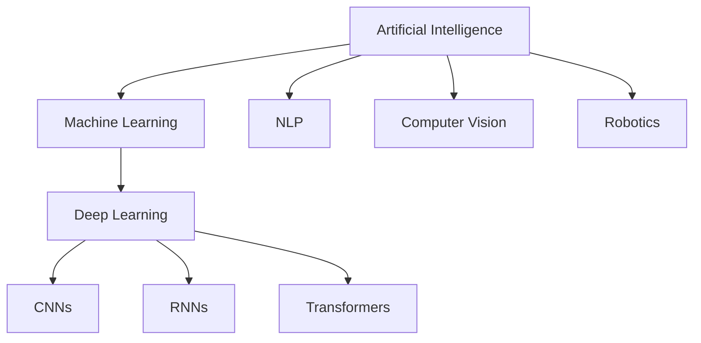
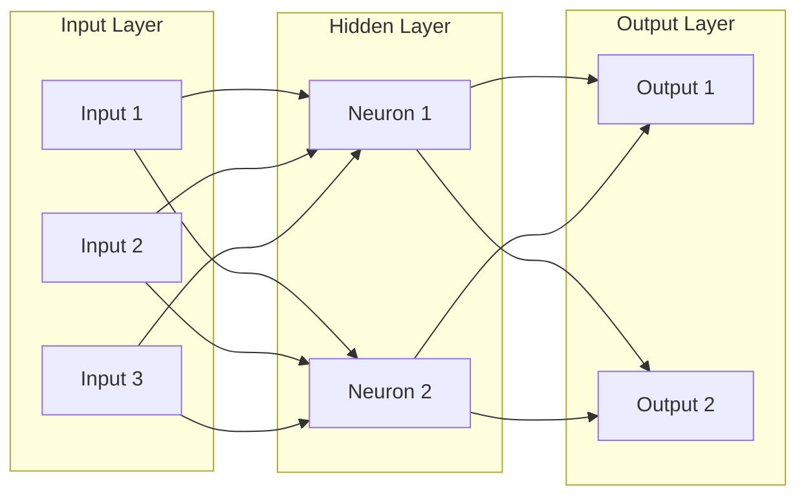
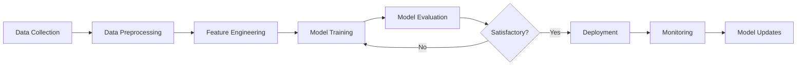

# Artificial Intelligence - Complete Interview Preparation Guide

## Introduction

Artificial Intelligence (AI) is a field of computer science focused on creating systems capable of performing tasks that typically require human intelligence. These tasks include learning, reasoning, problem-solving, perception, and language understanding.

AI encompasses various subfields including machine learning, deep learning, natural language processing, computer vision, and robotics. Modern AI has revolutionized industries from healthcare to finance, and understanding AI fundamentals is increasingly important for technical interviews.

This guide covers AI fundamentals through practical applications, preparing you for roles in AI/ML engineering, data science, and software development.

---

## Learning Roadmap

### Week 1: AI Fundamentals
- What is AI and its history
- Types of AI (narrow, general, super)
- AI applications and use cases
- Ethics in AI
- AI vs machine learning vs deep learning

### Week 2: Search Algorithms
- Problem-solving agents
- Uninformed search (BFS, DFS)
- Informed search (A*, greedy)
- Adversarial search (minimax)
- Constraint satisfaction

### Week 3: Machine Learning Basics
- Supervised vs unsupervised learning
- Regression and classification
- Model evaluation metrics
- Overfitting and underfitting
- Feature engineering

### Week 4: Neural Networks
- Perceptrons and networks
- Activation functions
- Backpropagation
- Convolutional Neural Networks (CNNs)
- Recurrent Neural Networks (RNNs)

### Week 5: Natural Language Processing
- Text processing basics
- Sentiment analysis
- Named entity recognition
- Language models
- Transformers and BERT

### Week 6: Practical Applications
- Computer vision overview
- Recommendation systems
- Reinforcement learning basics
- AI project workflow
- Deployment considerations

---

## Theory Notes

### Types of AI
1. **Narrow AI (Weak AI)**: Designed for specific task (Siri, chess programs)
2. **General AI (Strong AI)**: Human-level intelligence across all domains (hypothetical)
3. **Super AI**: Exceeds human intelligence (theoretical)

### AI Subfields
- **Machine Learning**: Learning from data
- **Deep Learning**: Neural networks with many layers
- **Natural Language Processing**: Understanding human language
- **Computer Vision**: Interpreting visual information
- **Robotics**: Physical agents interacting with environment
- **Expert Systems**: Rule-based decision making

### Search Algorithms
- **BFS (Breadth-First Search)**: Explores all neighbors at current depth
- **DFS (Depth-First Search)**: Explores as far as possible along each branch
- **A* Search**: Uses heuristic to guide search (optimal if heuristic is admissible)
- **Minimax**: Game tree search for two-player games

### Machine Learning Concepts
- **Supervised Learning**: Learning from labeled data
- **Unsupervised Learning**: Finding patterns in unlabeled data
- **Reinforcement Learning**: Learning through trial and error with rewards

### Neural Network Basics
- **Perceptron**: Single neuron computing weighted sum
- **Activation Function**: Non-linear transformation (ReLU, sigmoid, tanh)
- **Backpropagation**: Algorithm for training neural networks
- **Gradient Descent**: Optimization algorithm for minimizing loss

---

## Key Concepts

### Search and Problem Solving
1. **State Space**: All possible configurations
2. **Initial State**: Starting configuration
3. **Actions**: Possible moves from a state
4. **Transition Model**: Result of taking action
5. **Goal Test**: Check if state is goal
6. **Path Cost**: Cost of solution path

### Machine Learning
1. **Features**: Input variables
2. **Labels**: Output variables (supervised)
3. **Training Set**: Data for learning
4. **Test Set**: Data for evaluation
5. **Model**: Learned function mapping inputs to outputs
6. **Loss Function**: Measures prediction error

### Neural Networks
1. **Layers**: Input, hidden, output
2. **Weights**: Connection strengths
3. **Bias**: Offset term
4. **Forward Pass**: Computing outputs
5. **Backward Pass**: Computing gradients
6. **Learning Rate**: Step size for updates

### NLP
1. **Tokenization**: Splitting text into tokens
2. **Embedding**: Vector representation of tokens
3. **Attention**: Mechanism for focusing on relevant parts
4. **Transformer**: Architecture using self-attention
5. **Language Model**: Predicting next token

### Computer Vision
1. **Image Classification**: Categorizing images
2. **Object Detection**: Locating objects in images
3. **Semantic Segmentation**: Pixel-level classification
4. **Feature Extraction**: Identifying important patterns
5. **Transfer Learning**: Using pre-trained models

---

## FAQ (20+ Q&A)

### Q1: What is the difference between AI, ML, and Deep Learning?
**A:** AI is the broad field of creating intelligent systems. ML is a subset of AI where systems learn from data. Deep Learning is a subset of ML using neural networks with many layers.

### Q2: What is supervised vs unsupervised learning?
**A:** Supervised: Learning from labeled data (input-output pairs). Unsupervised: Finding patterns in unlabeled data (clustering, dimensionality reduction).

### Q3: What is overfitting?
**A:** Model performs well on training data but poorly on new data. Caused by model being too complex or training too long. Prevented by regularization, cross-validation, more data.

### Q4: What is a neural network?
**A:** Computing system inspired by biological neurons. Contains layers of interconnected nodes (neurons) that process information using weights and activation functions.

### Q5: What is backpropagation?
**A:** Algorithm for training neural networks. Computes gradients of loss function with respect to weights, then updates weights to minimize loss.

### Q6: What is a CNN?
**A:** Convolutional Neural Network for processing grid-like data (images). Uses convolutional layers to automatically learn spatial hierarchies of features.

### Q7: What is an RNN?
**A:** Recurrent Neural Network for sequential data. Has connections that form directed cycles, allowing it to maintain hidden state across time steps.

### Q8: What is the attention mechanism?
**A:** Mechanism allowing models to focus on relevant parts of input. Key component of Transformers, enabling better handling of long sequences.

### Q9: What is a Transformer?
**A:** Neural network architecture using self-attention instead of recurrence. Basis for BERT, GPT, and other large language models.

### Q10: What is transfer learning?
**A:** Using a pre-trained model as starting point for new task. Reduces training time and data requirements.

### Q11: What is gradient descent?
**A:** Optimization algorithm that iteratively adjusts parameters to minimize loss. Variants: batch, stochastic, mini-batch.

### Q12: What is a loss function?
**A:** Function measuring difference between predictions and true values. Common: MSE (regression), cross-entropy (classification).

### Q13: What is A* search?
**A:** Informed search algorithm using heuristic function. Optimal if heuristic is admissible (never overestimates).

### Q14: What is minimax?
**A:** Algorithm for two-player games. Assumes opponent plays optimally, maximizing minimum gain.

### Q15: What is regularization?
**A:** Techniques to prevent overfitting (L1, L2, dropout). Adds penalty for model complexity.

### Q16: What is feature engineering?
**A:** Creating input features from raw data. Includes scaling, encoding, and creating new features.

### Q17: What is a GAN?
**A:** Generative Adversarial Network with generator and discriminator. Generator creates fake data; discriminator detects fakes.

### Q18: What is reinforcement learning?
**A:** Learning through trial and error with rewards/penalties. Agent learns policy to maximize cumulative reward.

### Q19: What is a language model?
**A:** Model predicting probability of word sequences. Used for text generation, completion, and understanding.

### Q20: What is BERT?
**A:** Bidirectional Encoder Representations from Transformers. Pre-trained language model for NLP tasks.

### Q21: What is computer vision?
**A:** Field enabling computers to interpret visual information from images and videos.

### Q22: What is an AI ethic?
**A:** Principles guiding responsible AI development: fairness, accountability, transparency, and privacy.

---

## Hands-on Practice

### Lab 1: A* Search Implementation
```python
import heapq

def a_star(start, goal, graph, heuristic):
    open_set = [(0, start)]
    came_from = {}
    g_score = {start: 0}
    f_score = {start: heuristic(start, goal)}
    
    while open_set:
        _, current = heapq.heappop(open_set)
        
        if current == goal:
            return reconstruct_path(came_from, current)
        
        for neighbor, cost in graph[current].items():
            tentative_g = g_score[current] + cost
            
            if tentative_g < g_score.get(neighbor, float('inf')):
                came_from[neighbor] = current
                g_score[neighbor] = tentative_g
                f_score[neighbor] = tentative_g + heuristic(neighbor, goal)
                heapq.heappush(open_set, (f_score[neighbor], neighbor))
    
    return None

def reconstruct_path(came_from, current):
    path = [current]
    while current in came_from:
        current = came_from[current]
        path.append(current)
    return path[::-1]
```

### Lab 2: Neural Network from Scratch
```python
import numpy as np

class NeuralNetwork:
    def __init__(self, layers):
        self.layers = layers
        self.weights = []
        self.biases = []
        
        for i in range(len(layers) - 1):
            self.weights.append(np.random.randn(layers[i], layers[i+1]) * 0.01)
            self.biases.append(np.zeros((1, layers[i+1])))
    
    def sigmoid(self, x):
        return 1 / (1 + np.exp(-np.clip(x, -250, 250)))
    
    def sigmoid_derivative(self, x):
        return x * (1 - x)
    
    def forward(self, X):
        self.activations = [X]
        
        for i in range(len(self.weights)):
            z = np.dot(self.activations[-1], self.weights[i]) + self.biases[i]
            a = self.sigmoid(z)
            self.activations.append(a)
        
        return self.activations[-1]
    
    def backward(self, X, y, output, learning_rate=0.1):
        m = X.shape[0]
        delta = (output - y) * self.sigmoid_derivative(output)
        
        for i in range(len(self.weights) - 1, -1, -1):
            self.weights[i] -= learning_rate * np.dot(self.activations[i].T, delta) / m
            self.biases[i] -= learning_rate * np.sum(delta, axis=0, keepdims=True) / m
            
            if i > 0:
                delta = np.dot(delta, self.weights[i].T) * self.sigmoid_derivative(self.activations[i])
    
    def train(self, X, y, epochs=1000, learning_rate=0.1):
        for _ in range(epochs):
            output = self.forward(X)
            self.backward(X, y, output, learning_rate)
```

### Lab 3: Sentiment Analysis with BERT
```python
from transformers import pipeline

# Load pre-trained sentiment analysis model
classifier = pipeline("sentiment-analysis")

# Analyze text
result = classifier("I love this product! It's amazing.")
print(result)  # [{'label': 'POSITIVE', 'score': 0.9998}]

result = classifier("This is terrible. Worst experience ever.")
print(result)  # [{'label': 'NEGATIVE', 'score': 0.9994}]
```

### Lab 4: Image Classification with CNN
```python
import tensorflow as tf
from tensorflow.keras import layers, models

# Build CNN model
model = models.Sequential([
    layers.Conv2D(32, (3, 3), activation='relu', input_shape=(28, 28, 1)),
    layers.MaxPooling2D((2, 2)),
    layers.Conv2D(64, (3, 3), activation='relu'),
    layers.MaxPooling2D((2, 2)),
    layers.Conv2D(64, (3, 3), activation='relu'),
    layers.Flatten(),
    layers.Dense(64, activation='relu'),
    layers.Dense(10, activation='softmax')
])

model.compile(optimizer='adam',
              loss='sparse_categorical_crossentropy',
              metrics=['accuracy'])

# Load and preprocess data
(x_train, y_train), (x_test, y_test) = tf.keras.datasets.mnist.load_data()
x_train = x_train.reshape(-1, 28, 28, 1) / 255.0
x_test = x_test.reshape(-1, 28, 28, 1) / 255.0

# Train model
model.fit(x_train, y_train, epochs=5, validation_split=0.1)

# Evaluate
test_loss, test_acc = model.evaluate(x_test, y_test)
print(f"Test accuracy: {test_acc}")
```

### Lab 5: Recommendation System
```python
import numpy as np
from sklearn.metrics.pairwise import cosine_similarity

class CollaborativeFiltering:
    def __init__(self, ratings):
        self.ratings = ratings
        self.user_similarity = cosine_similarity(ratings)
    
    def predict(self, user_id, item_id):
        similar_users = self.user_similarity[user_id]
        item_ratings = self.ratings[:, item_id]
        
        # Weighted average of similar users' ratings
        numerator = np.sum(similar_users * item_ratings)
        denominator = np.sum(np.abs(similar_users))
        
        if denominator == 0:
            return 0
        return numerator / denominator
```

---

## FAANG Questions

### Amazon/Facebook Level
1. **Design a search autocomplete system.**
   - Trie data structure for prefix matching
   - Ranking based on frequency
   - Caching popular queries
   - Real-time updates
   - Consider: Latency, scalability, freshness

2. **How would you build a recommendation system?**
   - Collaborative filtering
   - Content-based filtering
   - Hybrid approach
   - Cold start problem
   - Consider: Scalability, diversity, novelty

3. **Design a spam detection system.**
   - Feature extraction
   - Classification model
   - Real-time processing
   - Feedback loop
   - Consider: Precision, recall, false positives

### Google/Microsoft Level
4. **How would you implement A* search for a real-world application?**
   - State space design
   - Heuristic function
   - Optimization techniques
   - Memory management
   - Consider: Optimality, completeness

5. **Design a neural network for image classification.**
   - Architecture selection (CNN)
   - Data preprocessing
   - Training strategy
   - Hyperparameter tuning
   - Consider: Accuracy, efficiency, deployment

### Netflix/Apple Level
6. **How would you build a content moderation system?**
   - Multi-modal analysis (text, image, video)
   - Classification models
   - Human-in-the-loop
   - Real-time processing
   - Consider: Accuracy, latency, scalability

---

## Common Mistakes

1. **Ignoring data quality** - Training models on poor quality data leads to poor performance.

2. **Overfitting** - Model performs well on training data but poorly on new data.

3. **Not validating models** - Deploying without proper evaluation metrics.

4. **Ignoring bias** - Models perpetuating biases in training data.

5. **Poor feature engineering** - Not creating relevant features from raw data.

6. **Ignoring edge cases** - Not handling unusual inputs or scenarios.

7. **Not monitoring models** - Deploying without monitoring for drift or degradation.

8. **Using wrong metrics** - Optimizing for wrong objective (accuracy vs F1-score).

9. **Ignoring scalability** - Building models that don't scale to production.

10. **Not considering ethics** - Deploying AI without considering ethical implications.

---

## Best Practices

### Data
- Ensure data quality and completeness
- Handle missing values appropriately
- Balance datasets for classification
- Use data augmentation when needed
- Maintain proper train/validation/test splits

### Model Development
- Start with simple baselines
- Use cross-validation for evaluation
- Regularize to prevent overfitting
- Tune hyperparameters systematically
- Document model decisions

### Deployment
- Package models for reproducibility
- Implement monitoring for drift
- Plan for model updates
- Consider latency requirements
- Implement fallback strategies

### Ethics
- Audit for bias and fairness
- Ensure transparency and explainability
- Protect user privacy
- Consider societal impact
- Follow responsible AI principles

---

## Cheat Sheet

### Search Algorithms
```python
# BFS
from collections import deque

def bfs(graph, start):
    visited = set()
    queue = deque([start])
    
    while queue:
        node = queue.popleft()
        if node not in visited:
            visited.add(node)
            queue.extend(graph[node] - visited)
    
    return visited

# A* Search
def a_star(start, goal, graph, heuristic):
    open_set = [(0, start)]
    came_from = {}
    g_score = {start: 0}
    
    while open_set:
        _, current = heapq.heappop(open_set)
        
        if current == goal:
            return reconstruct_path(came_from, current)
        
        for neighbor, cost in graph[current].items():
            tentative_g = g_score[current] + cost
            
            if tentative_g < g_score.get(neighbor, float('inf')):
                came_from[neighbor] = current
                g_score[neighbor] = tentative_g
                f_score = tentative_g + heuristic(neighbor, goal)
                heapq.heappush(open_set, (f_score, neighbor))
    
    return None
```

### Neural Network Training
```python
# Training loop
def train(model, train_loader, criterion, optimizer, epochs):
    for epoch in range(epochs):
        model.train()
        for batch in train_loader:
            inputs, targets = batch
            
            # Forward pass
            outputs = model(inputs)
            loss = criterion(outputs, targets)
            
            # Backward pass
            optimizer.zero_grad()
            loss.backward()
            optimizer.step()
        
        # Validation
        model.eval()
        with torch.no_grad():
            val_loss = evaluate(model, val_loader, criterion)
        
        print(f"Epoch {epoch+1}, Loss: {loss.item():.4f}, Val Loss: {val_loss:.4f}")
```

### Evaluation Metrics
```python
from sklearn.metrics import accuracy_score, precision_score, recall_score, f1_score

# Classification metrics
accuracy = accuracy_score(y_true, y_pred)
precision = precision_score(y_true, y_pred, average='weighted')
recall = recall_score(y_true, y_pred, average='weighted')
f1 = f1_score(y_true, y_pred, average='weighted')

# Confusion matrix
from sklearn.metrics import confusion_matrix
cm = confusion_matrix(y_true, y_pred)
```

---

## Flash Cards (20)

**Card 1**: What is Artificial Intelligence?
Field of creating systems capable of performing tasks requiring human intelligence.

**Card 2**: What is Machine Learning?
Subset of AI where systems learn from data without explicit programming.

**Card 3**: What is Deep Learning?
Subset of ML using neural networks with many layers.

**Card 4**: What is supervised learning?
Learning from labeled data (input-output pairs).

**Card 5**: What is unsupervised learning?
Finding patterns in unlabeled data.

**Card 6**: What is overfitting?
Model performs well on training data but poorly on new data.

**Card 7**: What is a neural network?
Computing system with layers of interconnected nodes processing information.

**Card 8**: What is backpropagation?
Algorithm for training neural networks by computing gradients.

**Card 9**: What is CNN?
Convolutional Neural Network for processing grid-like data like images.

**Card 10**: What is RNN?
Recurrent Neural Network for sequential data with memory.

**Card 11**: What is attention mechanism?
Mechanism allowing models to focus on relevant input parts.

**Card 12**: What is a Transformer?
Neural network architecture using self-attention for sequence processing.

**Card 13**: What is transfer learning?
Using pre-trained model as starting point for new task.

**Card 14**: What is gradient descent?
Optimization algorithm minimizing loss by adjusting parameters.

**Card 15**: What is A* search?
Informed search algorithm using heuristic for optimal pathfinding.

**Card 16**: What is minimax?
Algorithm for two-player game tree search assuming optimal play.

**Card 17**: What is NLP?
Natural Language Processing - enabling computers to understand human language.

**Card 18**: What is computer vision?
Field enabling computers to interpret visual information.

**Card 19**: What is reinforcement learning?
Learning through trial and error with rewards and penalties.

**Card 20**: What is a GAN?
Generative Adversarial Network creating realistic synthetic data.

---

## Mind Map

```
Artificial Intelligence
├── Search Algorithms
│   ├── BFS/DFS
│   ├── A* Search
│   ├── Minimax
│   └── Constraint Satisfaction
├── Machine Learning
│   ├── Supervised Learning
│   │   ├── Regression
│   │   └── Classification
│   ├── Unsupervised Learning
│   │   ├── Clustering
│   │   └── Dimensionality Reduction
│   └── Reinforcement Learning
├── Neural Networks
│   ├── Perceptrons
│   ├── CNNs
│   ├── RNNs
│   └── Transformers
├── NLP
│   ├── Tokenization
│   ├── Word Embeddings
│   ├── Language Models
│   └── Transformers
├── Computer Vision
│   ├── Image Classification
│   ├── Object Detection
│   └── Semantic Segmentation
└── Ethics
    ├── Fairness
    ├── Transparency
    └── Privacy
```

---

## Mermaid Diagrams

### AI/ML/Deep Learning Relationship


### Neural Network Architecture


### Model Training Pipeline


---

## Code Examples

### Minimax Algorithm
```python
def minimax(board, depth, is_maximizing):
    if check_winner(board, 'X'):
        return -10 + depth
    if check_winner(board, 'O'):
        return 10 - depth
    if is_board_full(board):
        return 0
    
    if is_maximizing:
        best_score = -float('inf')
        for move in get_possible_moves(board):
            board[move] = 'O'
            score = minimax(board, depth + 1, False)
            board[move] = None
            best_score = max(score, best_score)
        return best_score
    else:
        best_score = float('inf')
        for move in get_possible_moves(board):
            board[move] = 'X'
            score = minimax(board, depth + 1, True)
            board[move] = None
            best_score = min(score, best_score)
        return best_score
```

### Simple Linear Regression
```python
import numpy as np

class LinearRegression:
    def __init__(self, learning_rate=0.01, epochs=1000):
        self.learning_rate = learning_rate
        self.epochs = epochs
        self.weights = None
        self.bias = None
    
    def fit(self, X, y):
        n_samples, n_features = X.shape
        self.weights = np.zeros(n_features)
        self.bias = 0
        
        for _ in range(self.epochs):
            y_pred = np.dot(X, self.weights) + self.bias
            
            dw = (1 / n_samples) * np.dot(X.T, (y_pred - y))
            db = (1 / n_samples) * np.sum(y_pred - y)
            
            self.weights -= self.learning_rate * dw
            self.bias -= self.learning_rate * db
    
    def predict(self, X):
        return np.dot(X, self.weights) + self.bias
```

### Text Classification with Transformers
```python
from transformers import pipeline, AutoModelForSequenceClassification, AutoTokenizer
from transformers import Trainer, TrainingArguments
import torch

# Load pre-trained model
model_name = "bert-base-uncased"
model = AutoModelForSequenceClassification.from_pretrained(model_name, num_labels=2)
tokenizer = AutoTokenizer.from_pretrained(model_name)

# Tokenize data
def tokenize_function(examples):
    return tokenizer(examples["text"], padding="max_length", truncation=True)

# Training arguments
training_args = TrainingArguments(
    output_dir="./results",
    num_train_epochs=3,
    per_device_train_batch_size=16,
    per_device_eval_batch_size=64,
    warmup_steps=500,
    weight_decay=0.01,
    logging_dir="./logs",
)

# Trainer
trainer = Trainer(
    model=model,
    args=training_args,
    train_dataset=train_dataset,
    eval_dataset=eval_dataset,
)

trainer.train()
```

---

## Projects

### Project 1: Search Algorithm Visualizer
Build interactive visualization:
- BFS, DFS, A* implementations
- Visual maze/pathfinding
- Step-by-step animation
- Performance comparison

### Project 2: Image Classifier
Build image classification system:
- CNN architecture
- Data augmentation
- Transfer learning
- Web interface for predictions

### Project 3: Chatbot
Build conversational AI:
- Intent recognition
- Entity extraction
- Response generation
- Context management
- Integration with messaging platforms

---

## Resources

### Official Documentation
- [TensorFlow](https://www.tensorflow.org/docs)
- [PyTorch](https://pytorch.org/docs/)
- [Scikit-learn](https://scikit-learn.org/stable/documentation.html)
- [Hugging Face](https://huggingface.co/docs)

### Books
- "Artificial Intelligence: A Modern Approach" by Russell & Norvig
- "Deep Learning" by Goodfellow, Bengio, Courville
- "Hands-On Machine Learning" by Aurélien Géron

### Learning Platforms
- Coursera ML Specialization
- fast.ai courses
- Stanford CS229 (Machine Learning)
- Deep Learning Specialization

### Practice
- Kaggle competitions
- LeetCode ML problems
- HackerRank AI challenges

---

## Checklist

- [ ] Understand AI fundamentals
- [ ] Implement search algorithms (BFS, DFS, A*)
- [ ] Learn minimax algorithm
- [ ] Understand machine learning basics
- [ ] Build neural network from scratch
- [ ] Learn about CNNs and RNNs
- [ ] Understand transformers and attention
- [ ] Practice with NLP tasks
- [ ] Explore computer vision
- [ ] Complete AI projects

---

## Mock Interviews

### Scenario 1: AI Engineer
**Interviewer**: "Design a search autocomplete system."

**Key Points to Cover**:
- Trie data structure
- Prefix matching
- Ranking by frequency
- Caching strategies
- Real-time updates

### Scenario 2: ML Engineer
**Interviewer**: "How would you build a recommendation system?"

**Key Points to Cover**:
- Collaborative filtering
- Content-based filtering
- Cold start problem
- Scalability considerations
- Evaluation metrics

### Scenario 3: Data Scientist
**Interviewer**: "Explain how you would approach a classification problem."

**Key Points to Cover**:
- Data exploration
- Feature engineering
- Model selection
- Cross-validation
- Metric selection

---

## Difficulty Rating

| Topic | Difficulty | Time to Learn |
|-------|------------|---------------|
| AI Fundamentals | ⭐ | 1 week |
| Search Algorithms | ⭐⭐ | 1-2 weeks |
| Machine Learning Basics | ⭐⭐⭐ | 2-3 weeks |
| Neural Networks | ⭐⭐⭐⭐ | 3-4 weeks |
| CNNs | ⭐⭐⭐⭐ | 3-4 weeks |
| RNNs | ⭐⭐⭐⭐ | 3-4 weeks |
| Transformers | ⭐⭐⭐⭐⭐ | 4-6 weeks |
| NLP | ⭐⭐⭐⭐ | 3-4 weeks |
| Computer Vision | ⭐⭐⭐⭐ | 3-4 weeks |

---

## Summary

Artificial Intelligence is transforming technology and industries. Key areas for interviews include:

1. **Search Algorithms**: BFS, DFS, A*, Minimax
2. **Machine Learning**: Supervised, unsupervised, reinforcement learning
3. **Neural Networks**: Architecture, training, optimization
4. **Deep Learning**: CNNs, RNNs, Transformers
5. **NLP**: Language models, attention, BERT
6. **Computer Vision**: Image classification, object detection
7. **Ethics**: Fairness, transparency, privacy
8. **Practical Applications**: Building and deploying AI systems

Understanding AI fundamentals prepares you for roles in AI/ML engineering and data science.
