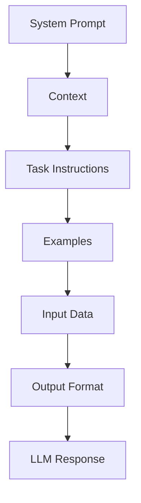
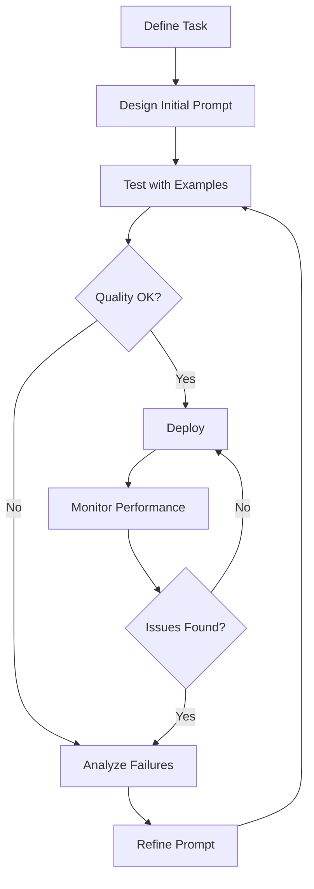

# 67 - Prompt Engineering: Interview Preparation Guide

## Table of Contents
- [Introduction](#introduction)
- [Learning Roadmap](#learning-roadmap)
- [Theory Notes](#theory-notes)
- [Key Concepts](#key-concepts)
- [FAQ (30+ Q&A)](#faq-30-qa)
- [Hands-on Practice](#hands-on-practice)
- [FAANG Questions](#faang-questions)
- [Common Mistakes](#common-mistakes)
- [Best Practices](#best-practices)
- [Cheat Sheet](#cheat-sheet)
- [Flash Cards (30)](#flash-cards-30)
- [Mind Map](#mind-map)
- [Mermaid Diagrams](#mermaid-diagrams)
- [Code Examples](#code-examples)
- [Projects](#projects)
- [Resources](#resources)
- [Checklist](#checklist)
- [Revision Plans](#revision-plans)
- [Mock Interviews](#mock-interviews)
- [Difficulty Rating](#difficulty-rating)
- [Summary](#summary)

---

## Introduction

Prompt engineering is the art and science of designing effective inputs for large language models to produce desired outputs. As LLMs have become central to AI applications, prompt engineering has emerged as a critical skill for AI engineers, product designers, and anyone working with generative AI.

Prompt engineering goes beyond simple question asking. It encompasses structured techniques for controlling model behavior, managing context, ensuring output quality, and optimizing for specific tasks. Effective prompts can dramatically improve LLM performance without any model modification.

Key aspects of prompt engineering:
- **Instruction Design**: Crafting clear, specific instructions
- **Context Management**: Providing relevant background information
- **Output Control**: Defining expected format, style, and constraints
- **Few-shot Learning**: Demonstrating desired behavior with examples
- **Chain-of-Thought**: Guiding step-by-step reasoning
- **Safety Guardrails**: Preventing harmful or incorrect outputs

---

## Learning Roadmap

### Phase 1: Fundamentals (Week 1-2)
- Basic prompt structures
- Zero-shot vs few-shot prompting
- Role/system prompting
- Output format control
- Temperature and sampling parameters

### Phase 2: Advanced Techniques (Week 3-4)
- Chain-of-thought (CoT) prompting
- Tree-of-thought (ToT) prompting
- Self-consistency
- ReAct (Reasoning + Acting)
- Prompt chaining

### Phase 3: System Design (Week 5-6)
- System prompts and personas
- Template design and management
- Prompt versioning and testing
- Safety and guardrails
- Multilingual prompting

### Phase 4: Optimization (Week 7-8)
- Prompt optimization algorithms
- A/B testing prompts
- Evaluation frameworks
- Cost optimization
- Latency optimization

### Phase 5: Applications (Week 9-12)
- Code generation prompts
- Data extraction prompts
- Creative writing prompts
- Classification prompts
- Multi-modal prompts
- Agent prompts

---

## Theory Notes

### Prompt Structure
A well-structured prompt typically includes:
1. **Context/Role**: Sets the persona and background
2. **Task**: Clear description of what to do
3. **Instructions**: Specific guidelines and constraints
4. **Input/Data**: The content to work with
5. **Output format**: Expected response structure
6. **Examples**: Demonstrations of desired behavior

### Zero-Shot Prompting
Providing the task description without examples:
"Classify this text as positive, negative, or neutral: 'The product was okay but shipping was slow.'"

Relies on the model's pre-trained knowledge. Works well for common tasks but struggles with specific requirements.

### Few-Shot Prompting
Including examples in the prompt to demonstrate desired behavior:
"Classify these texts:
Text: 'Love it!' -> Positive
Text: 'Terrible experience' -> Negative
Text: 'It was fine' -> ?"

More reliable than zero-shot but consumes context tokens. Typically 2-5 examples are sufficient.

### Chain-of-Thought (CoT)
Asking the model to show reasoning steps before giving final answers:
"Let me think step by step:
1. First, I need to identify...
2. Then, I should consider...
3. Finally, based on..."

Significantly improves performance on math, logic, and complex reasoning tasks. Works better with larger models.

### Tree-of-Thought (ToT)
Exploring multiple reasoning paths and evaluating each:
"Let me consider different approaches:
Approach A: ... (evaluation: ...)
Approach B: ... (evaluation: ...)
The best approach is..."

More thorough but expensive. Use for complex problems requiring exploration.

### Self-Consistency
Generating multiple responses and taking the majority vote. Improves reliability by reducing variance in individual responses. Effective for tasks with definitive answers.

### ReAct (Reasoning + Acting)
Combining reasoning traces with tool use:
"Thought: I need to look up...
Action: search('query')
Observation: [result]
Thought: Based on this...
Answer: ..."

Foundation for LLM agents that can use external tools.

### Prompt Chaining
Breaking complex tasks into a sequence of simpler prompts, where each step's output feeds into the next:
1. Step 1: Extract key information
2. Step 2: Analyze extracted information
3. Step 3: Generate response based on analysis

### System Prompts
Special instructions that define the model's behavior, persona, and constraints:
"You are a helpful assistant specializing in medical information. Always recommend consulting a healthcare professional. Never provide specific diagnoses."

### Prompt Injection and Defense
Prompt injection occurs when user inputs override system instructions. Defenses include:
- Input sanitization and validation
- Separating system and user messages
- Output filtering for unexpected content
- Using delimiters to clearly mark input boundaries
- Instruction hierarchy (system > user > input)

### Meta-Prompting
Using prompts to generate or optimize other prompts. Automated prompt optimization uses LLMs to evaluate and improve prompt variations. DSPy framework enables programmatic prompt optimization.

---

## Key Concepts

| Concept | Description |
|---------|-------------|
| Zero-shot | No examples, just task description |
| Few-shot | Including examples in the prompt |
| Chain-of-Thought | Step-by-step reasoning before answers |
| Tree-of-Thought | Exploring multiple reasoning paths |
| Self-Consistency | Majority vote over multiple responses |
| ReAct | Combining reasoning with tool use |
| System Prompt | Instructions defining model behavior |
| Temperature | Controls randomness (0=deterministic) |
| Top-p | Nucleus sampling threshold |
| Prompt Template | Reusable prompt structure with variables |
| Prompt Injection | Malicious input overriding system instructions |
| Meta-Prompting | Using prompts to generate/optimize prompts |

---

## FAQ (30+ Q&A)

### Q1: What is prompt engineering?
**A:** Designing effective inputs for LLMs to produce desired outputs. Includes structuring instructions, providing examples, controlling output format, and managing context. Critical skill for working with generative AI.

### Q2: What is the difference between zero-shot and few-shot?
**A:** Zero-shot provides only the task description. Few-shot includes examples demonstrating desired input-output pairs. Few-shot is more reliable for specific tasks but uses more context tokens.

### Q3: What is chain-of-thought prompting?
**A:** Asking the model to show step-by-step reasoning before giving final answers. Improves performance on math, logic, and complex reasoning. Works by making the model's reasoning explicit.

### Q4: How do you control output format?
**A:** Specify format in instructions (JSON, markdown, bullet points), provide format examples, use system prompts to enforce structure, and use post-processing to validate/extract structured outputs.

### Q5: What is the role of temperature?
**A:** Controls randomness in generation. Temperature=0: deterministic (factual tasks). Temperature=0.7: balanced (general use). Temperature=1.2: creative (brainstorming). Default is typically 0.7.

### Q6: What is a system prompt?
**A:** Special instructions defining the model's role, behavior, and constraints. Set before user messages. Defines persona, tone, topics to avoid, and behavioral guidelines. Critical for consistent output.

### Q7: How do you handle hallucination through prompting?
**A:** Instruct to only use provided context, ask to cite sources, request acknowledging uncertainty, use phrases like "if you don't know, say so", and provide relevant context explicitly.

### Q8: What is prompt chaining?
**A:** Breaking complex tasks into sequential simpler prompts. Each step processes and outputs to the next. Reduces complexity per prompt, allows intermediate validation, and improves reliability.

### Q9: What is self-consistency?
**A:** Generating multiple responses (with temperature > 0) and selecting the most common answer. Improves reliability by averaging out individual response variance. Effective for tasks with definitive answers.

### Q10: How do you handle long context?
**A:** Place most important information at the beginning or end (recency bias). Use clear section markers. Summarize lengthy content. Structure with headers and bullet points for scannability.

### Q11: What is ReAct prompting?
**A:** Combining Reasoning and Acting in prompts. Model thinks about what to do, takes an action (tool call), observes results, and continues. Foundation for LLM agents with tool use.

### Q12: How do you optimize prompts for cost?
**A:** Use concise language, remove unnecessary context, batch similar queries, use smaller models for simple tasks, cache frequent prompts, and chain prompts instead of putting everything in one.

### Q13: What is a prompt template?
**A:** A reusable prompt structure with variable placeholders. Enables consistent prompting with dynamic content. Example: "Analyze the following {document_type}: {content}"

### Q14: How do you handle multilingual prompting?
**A:** Specify target language explicitly, provide examples in target language, use multilingual models, and consider cultural context. Be aware that non-English performance may vary.

### Q15: What is tree-of-thought prompting?
**A:** Exploring multiple reasoning branches simultaneously, evaluating each path, and selecting the best. More thorough than CoT but uses more tokens. Use for complex multi-step problems.

### Q16: How do you ensure consistent output quality?
**A:** Use few-shot examples, specify output format explicitly, provide quality criteria, implement output validation, and use system prompts for consistent behavior.

### Q17: What is prompt injection and how to prevent it?
**A:** Users trying to override system prompts through crafted inputs. Prevention: input validation, separating system/user messages, output filtering, and monitoring for unusual outputs.

### Q18: How do you test prompts?
**A:** Create test suites with diverse inputs, measure task-specific metrics, use evaluation frameworks (promptfoo, deepeval), A/B test variations, and track performance over time.

### Q19: What is the difference between prompt engineering and fine-tuning?
**A:** Prompt engineering works through input design without model changes. Fine-tuning updates model weights. Prompt engineering is faster, cheaper, and reversible. Fine-tuning is better for consistent behavior changes.

### Q20: How do you handle ambiguous queries?
**A:** Ask clarifying questions, provide conditional responses ("if X, then Y"), cover multiple interpretations, and set expectations about ambiguity handling in system prompts.

### Q21: What is prompt engineering for code generation?
**A:** Providing clear specifications, input/output examples, constraints, and language requirements. Include edge cases, error handling expectations, and code style guidelines.

### Q22: What is dynamic prompting?
**A:** Adapting prompts based on context, user history, or query characteristics. Routes different queries to different prompt templates. Enables personalized and context-aware LLM interactions.

### Q23: What is constitutional AI prompting?
**A:** Designing prompts that include ethical principles and guidelines. The model self-critiques and revises outputs based on constitutional principles. Used for safety alignment.

### Q24: What is prompt compression?
**A:** Reducing prompt length while preserving essential information. Techniques: summarization, removal of redundant context, using abbreviations, and selective context inclusion. Reduces cost and latency.

### Q25: What is structured output prompting?
**A:** Designing prompts that produce JSON, XML, or other structured formats. Uses explicit format specifications, schema definitions, and examples. Critical for programmatic LLM integration.

### Q26: What are prompt prefixes/suffixes?
**A:** Adding fixed text before (prefix) or after (suffix) the user input. Prefix sets context/instructions, suffix adds constraints. Enables consistent behavior across different inputs.

### Q27: What is iterative prompt refinement?
**A:** Progressively improving prompts through testing and feedback. Start simple, test on diverse inputs, identify failure modes, adjust instructions, and repeat. Systematic approach to prompt optimization.

### Q28: What is prompt cascading?
**A:** Using the output of one prompt as input to another in a pipeline. Each prompt handles a sub-task. Enables complex workflows while keeping individual prompts simple and focused.

### Q29: What is few-shot placement strategy?
**A:** Where examples are placed in the prompt matters. Put them after instructions, before the actual input. Use diverse examples covering edge cases. Order can affect performance.

### Q30: How do you handle model-specific prompt differences?
**A:** Different models respond differently to the same prompt. GPT models work well with natural language instructions. Claude prefers XML-structured prompts. Test and adapt prompts per model.

---

## Hands-on Practice

### Basic Prompt Templates
```python
# Zero-shot classification
zero_shot = """Classify the following text into one of these categories:
Positive, Negative, Neutral

Text: {text}
Category:"""

# Few-shot classification
few_shot = """Classify texts into Positive, Negative, or Neutral.

Text: "I love this product!" -> Positive
Text: "Terrible service" -> Negative
Text: "It's okay I guess" -> Neutral

Text: "{text}" ->"""

# Chain-of-thought
cot = """Question: {question}

Let me think step by step:
"""

# Structured output
structured = """Analyze the following review and extract:
- Sentiment (positive/negative/neutral)
- Key topics (list)
- Confidence score (0-1)

Review: {review}

Return as JSON:"""
```

### System Prompt Design
```python
system_prompt = """You are a senior software engineer specializing in Python.

Rules:
1. Always provide clean, well-documented code
2. Follow PEP 8 style guidelines
3. Include error handling where appropriate
4. Explain your reasoning before code
5. If unsure about requirements, ask for clarification
6. Never execute code that could be harmful

When reviewing code:
- Focus on correctness, readability, and performance
- Suggest improvements with explanations
- Highlight potential bugs and security issues"""
```

### Prompt Chaining
```python
# Step 1: Extract information
extract_prompt = """Extract key entities from this text:
{text}

Return as a list of entities with their types."""

# Step 2: Analyze
analyze_prompt = """Given these entities: {entities}
And this context: {context}
Analyze their relationships."""

# Step 3: Generate response
response_prompt = """Based on this analysis: {analysis}
Generate a comprehensive summary."""
```

---

## FAANG Questions

1. **Google**: Design a prompt engineering framework for a search autocomplete system. How do you handle different query types?
2. **Meta**: How would you build a prompt evaluation pipeline for content moderation at scale?
3. **Amazon**: Design a multi-language prompt template system for a global customer support chatbot.
4. **Apple**: How would you optimize prompts for on-device LLMs with limited context windows?
5. **OpenAI**: Design a prompt that makes GPT explain its confidence levels and uncertainty.
6. **Google**: How would you build a system that automatically improves prompts based on user feedback?
7. **Meta**: Design a prompt injection defense system for a public-facing chatbot.
8. **Amazon**: How would you A/B test different prompt strategies for product recommendation?
9. **Anthropic**: Design prompts that ensure consistent, safe outputs across diverse queries.
10. **Google**: Build a prompt optimization system that reduces token usage while maintaining quality.
11. **Meta**: Design a prompt template system for content generation across different formats and styles.
12. **Amazon**: Build a prompt versioning system with rollback capabilities for production LLM applications.

---

## Common Mistakes

1. Being too vague in instructions
2. Overloading single prompts with too many tasks
3. Not providing enough examples for few-shot
4. Ignoring output format specification
5. Not considering edge cases in prompts
6. Using overly complex prompts when simple works
7. Not testing prompts with diverse inputs
8. Ignoring token limits and context windows
9. Not version-controlling prompts
10. Skipping evaluation of prompt effectiveness
11. Not considering cost implications of prompt length
12. Ignoring model-specific prompt differences

---

## Best Practices

1. Start simple, add complexity only as needed
2. Provide clear, specific instructions
3. Use few-shot examples for consistency
4. Specify output format explicitly
5. Test with diverse inputs including edge cases
6. Version control all prompts
7. Document prompt design decisions
8. Measure prompt performance quantitatively
9. Use system prompts for consistent behavior
10. Consider token costs vs quality tradeoffs
11. Implement prompt validation
12. Build evaluation pipelines for ongoing quality

---

## Cheat Sheet

### Prompting Techniques
| Technique | When to Use | Token Cost |
|-----------|-------------|------------|
| Zero-shot | Simple, common tasks | Low |
| Few-shot | Specific format/style needed | Medium |
| Chain-of-Thought | Reasoning, math, logic | High |
| Tree-of-Thought | Complex multi-path problems | Very High |
| Self-Consistency | Tasks with definitive answers | High (multiple) |
| ReAct | Tasks requiring tools/actions | Medium |

### Temperature Guide
| Value | Behavior | Use Case |
|-------|----------|----------|
| 0 | Deterministic | Factual QA, code |
| 0.3 | Focused | Summarization |
| 0.7 | Balanced | General chat |
| 1.0 | Creative | Brainstorming |
| 1.5 | Very random | Creative writing |

### Output Format Templates
```
# JSON
Return as valid JSON: {{"key": "value"}}

# Markdown
## Section
- Bullet points

# CSV
column1, column2, column3
```

### Model-Specific Tips
| Model | Tip |
|-------|-----|
| GPT-4 | Works well with natural language instructions |
| Claude | Prefers XML-structured prompts |
| LLaMA | Benefits from clear system/user separation |
| Mistral | Good with few-shot examples |

---

## Flash Cards (30)

**Card 1:** Q: What is zero-shot prompting? A: Providing task description without examples, relying on model's pre-trained knowledge.

**Card 2:** Q: What is few-shot prompting? A: Including 2-5 input-output examples to demonstrate desired behavior.

**Card 3:** Q: What is chain-of-thought? A: Asking model to show step-by-step reasoning before giving answers.

**Card 4:** Q: What is a system prompt? A: Instructions defining model's role, behavior, and constraints before conversation.

**Card 5:** Q: What is temperature? A: Parameter controlling randomness; 0=deterministic, higher=more random.

**Card 6:** Q: What is prompt injection? A: Malicious inputs designed to override system prompts or safety rules.

**Card 7:** Q: What is ReAct? A: Combining Reasoning and Acting in prompts for tool-using agents.

**Card 8:** Q: What is self-consistency? A: Generating multiple responses and taking majority vote for reliability.

**Card 9:** Q: What is tree-of-thought? A: Exploring multiple reasoning paths and evaluating each for complex problems.

**Card 10:** Q: What is prompt chaining? A: Breaking complex tasks into sequential simpler prompts.

**Card 11:** Q: What is a prompt template? A: Reusable prompt structure with variable placeholders for dynamic content.

**Card 12:** Q: What is top-p sampling? A: Nucleus sampling limiting to smallest token set exceeding probability p.

**Card 13:** Q: How to reduce hallucination? A: Provide context, ask to cite sources, request acknowledging uncertainty.

**Card 14:** Q: What is output format control? A: Specifying JSON, markdown, or other structures in prompts.

**Card 15:** Q: What is prompt optimization? A: Iteratively improving prompts for better performance and efficiency.

**Card 16:** Q: What is dynamic prompting? A: Adapting prompts based on context, query type, or user history.

**Card 17:** Q: What is role prompting? A: Assigning a specific persona/expertise to the model for better responses.

**Card 18:** Q: What is grounding in prompts? A: Providing factual context to anchor model responses in reality.

**Card 19:** Q: What is prompt A/B testing? A: Comparing prompt variations with real users to measure effectiveness.

**Card 20:** Q: What is token-efficient prompting? A: Using concise language and structure to minimize token usage.

**Card 21:** Q: What is prompt cascading? A: Using output of one prompt as input to another in a pipeline.

**Card 22:** Q: What is constitutional AI prompting? A: Including ethical principles in prompts for safe, aligned outputs.

**Card 23:** Q: What is prompt compression? A: Reducing prompt length while preserving essential information.

**Card 24:** Q: What is structured output prompting? A: Designing prompts that produce JSON or other structured formats.

**Card 25:** Q: What is iterative prompt refinement? A: Progressively improving prompts through testing and feedback.

**Card 26:** Q: What is meta-prompting? A: Using prompts to generate or optimize other prompts automatically.

**Card 27:** Q: What is prompt injection defense? A: Input validation, message separation, and output filtering techniques.

**Card 28:** Q: What is few-shot placement? A: Where examples are placed in the prompt affects model performance.

**Card 29:** Q: What is prompt versioning? A: Tracking prompt changes with version control for reproducibility.

**Card 30:** Q: What is prompt evaluation? A: Systematically measuring prompt performance across diverse test cases.

---

## Mind Map

```
Prompt Engineering
├── Techniques
│   ├── Zero-shot
│   ├── Few-shot
│   ├── Chain-of-Thought
│   ├── Tree-of-Thought
│   ├── Self-Consistency
│   └── ReAct
├── Structure
│   ├── System Prompt
│   ├── Context
│   ├── Instructions
│   ├── Examples
│   └── Output Format
├── Optimization
│   ├── Token Efficiency
│   ├── Temperature Tuning
│   ├── A/B Testing
│   └── Cost Management
├── Safety
│   ├── Prompt Injection
│   ├── Guardrails
│   └── Content Filtering
└── Applications
    ├── Code Generation
    ├── Data Extraction
    ├── Classification
    └── Creative Writing
```

---

## Mermaid Diagrams

### Prompt Structure


### Chain-of-Thought Flow


### Prompt Engineering Workflow


---

## Code Examples

### Prompt Evaluation Framework
```python
import json

class PromptEvaluator:
    def __init__(self, llm, test_cases):
        self.llm = llm
        self.test_cases = test_cases

    def evaluate(self, prompt_template, metric="accuracy"):
        results = []
        for test in self.test_cases:
            prompt = prompt_template.format(**test["inputs"])
            response = self.llm.generate(prompt)
            results.append({
                "expected": test["expected"],
                "got": response,
                "correct": self._check(response, test["expected"])
            })
        accuracy = sum(r["correct"] for r in results) / len(results)
        return {"accuracy": accuracy, "details": results}

    def _check(self, response, expected):
        return expected.lower() in response.lower()
```

### Dynamic Prompt Router
```python
class PromptRouter:
    def __init__(self):
        self.templates = {
            "factual": "Answer factually: {query}",
            "creative": "Write creatively: {query}",
            "technical": "Explain technically: {query}"
        }

    def route(self, query):
        if any(w in query.lower() for w in ["what", "when", "who"]):
            return self.templates["factual"]
        elif any(w in query.lower() for w in ["write", "create", "imagine"]):
            return self.templates["creative"]
        return self.templates["technical"]
```

---

## Projects

1. **Prompt Library**: Build a versioned, searchable prompt management system
2. **Evaluation Pipeline**: Automated prompt testing with diverse test cases
3. **Multi-modal Prompts**: Design prompts for text+image understanding
4. **Code Assistant**: Prompt system for code generation and review
5. **Chatbot with Guardrails**: System prompt design for safe, consistent responses
6. **Prompt Optimizer**: Build system that automatically improves prompts
7. **Domain-Specific Prompts**: Create specialized prompts for legal/medical/financial domains

---

## Resources

- **Guides**: OpenAI Prompt Engineering Guide, Anthropic Prompt Engineering
- **Tools**: Promptfoo, LangSmith, Braintrust
- **Papers**: "Chain-of-Thought Prompting", "Tree of Thoughts", "ReAct"
- **Courses**: DeepLearning.AI ChatGPT Prompt Engineering
- **Frameworks**: DSPy, PromptFlow, LangSmith

---

## Checklist

- [ ] Zero-shot and few-shot prompting
- [ ] Chain-of-thought and tree-of-thought
- [ ] System prompt design
- [ ] Output format control
- [ ] Temperature and sampling tuning
- [ ] Prompt chaining
- [ ] Self-consistency and ReAct
- [ ] Prompt testing and evaluation
- [ ] Cost optimization
- [ ] Safety and injection prevention
- [ ] Application-specific prompting
- [ ] Prompt versioning and management
- [ ] Model-specific prompt adaptation
- [ ] Structured output generation

---

## Revision Plans

### 2-Week Plan
- Week 1: Fundamentals, core techniques, structure
- Week 2: Advanced techniques, system design, optimization

### Daily (30 min)
- 10 min: Flash cards
- 10 min: Practice prompt design
- 10 min: Read guides and papers

---

## Mock Interviews

1. Design a prompt system for content moderation at scale
2. How would you handle prompt injection in a public chatbot?
3. Design a few-shot prompt for complex classification task
4. How would you optimize prompts for cost while maintaining quality?
5. Build a prompt evaluation pipeline
6. Design system prompts for different LLM providers
7. How would you handle multilingual prompt engineering?

---

## Difficulty Rating

| Topic | Difficulty | Frequency |
|-------|-----------|-----------|
| Basic Prompting | Easy | Very High |
| Few-shot Design | Easy-Medium | Very High |
| Chain-of-Thought | Medium | High |
| System Prompts | Medium | Very High |
| Safety/Guardrails | Medium | High |
| Evaluation | Medium | High |
| Optimization | Medium | Medium |
| Multi-modal | Hard | Medium |

**Overall: Easy-Medium | Preparation: 2-4 weeks**

---

## Summary

Prompt engineering is the essential skill for effectively using LLMs. Master the techniques from basic zero-shot through advanced CoT and ReAct patterns. Focus on clear instruction design, proper output formatting, and systematic evaluation. The best prompts are concise, specific, tested with diverse inputs, and version controlled. As LLMs evolve, prompt engineering continues to be critical for translating human intent into model behavior.

---

## Deep Dive: Technique Comparison

### Prompting Technique Selection
| Technique | Token Cost | Accuracy | Speed | When to Use |
|-----------|-----------|----------|-------|-------------|
| Zero-shot | Low | Medium | Fast | Simple, common tasks |
| Few-shot (2-3) | Medium | High | Fast | Format-specific tasks |
| Few-shot (5+) | High | Higher | Medium | Complex classification |
| Chain-of-Thought | High | Very High | Slow | Math, logic, reasoning |
| Tree-of-Thought | Very High | Highest | Very Slow | Multi-path problems |
| Self-Consistency | N×High | Very High | N×Slow | Definitive answers |
| ReAct | Medium | High | Medium | Tool-using tasks |

### System Prompt Design Patterns

#### Pattern 1: Role-Based
```
You are [ROLE] with [EXPERTISE].
When [SITUATION], you [BEHAVIOR].
Always [CONSTRAINTS].
Never [RESTRICTIONS].
```

#### Pattern 2: Task-Oriented
```
TASK: [Clear description]
INPUT: [What you'll receive]
OUTPUT: [Expected format]
EXAMPLES: [If needed]
CONSTRAINTS: [Rules to follow]
```

#### Pattern 3: Chain-of-Thought
```
Question: [Question]
Let me think step by step:
1. First, I need to [step 1]
2. Then, I should [step 2]
3. Finally, based on [step 3]
Answer: [Final answer]
```

### Output Format Control Patterns
| Format | Prompt Pattern | Use Case |
|--------|---------------|----------|
| JSON | "Return as JSON with keys: {schema}" | API integration |
| Markdown | "Format as markdown with headers" | Documentation |
| CSV | "Return as CSV with columns: ..." | Data extraction |
| List | "Return as bulleted list" | Summarization |
| Table | "Format as markdown table" | Comparison |
| XML | "Return as XML with tags: ..." | Structured data |

### Temperature and Sampling Guide
| Task | Temperature | Top-p | Top-k | Best Model |
|------|------------|-------|-------|------------|
| Factual QA | 0 | 1.0 | 1 | GPT-4, Claude |
| Code generation | 0-0.2 | 0.95 | 40 | GPT-4, Claude |
| Summarization | 0.3-0.5 | 0.9 | 50 | GPT-4, Claude |
| Translation | 0 | 1.0 | 1 | GPT-4, DeepL |
| Creative writing | 0.7-1.0 | 0.9 | 100 | Claude, GPT-4 |
| Brainstorming | 0.8-1.2 | 0.95 | - | Claude, GPT-4 |
| Classification | 0 | 1.0 | 1 | Any |

### Common Prompt Patterns by Task

#### Data Extraction
```
Extract the following information from the text:
- Person names
- Organizations
- Dates
- Locations

Text: {text}

Return as JSON array with keys: name, type, value
```

#### Classification
```
Classify the following text into one of these categories:
{categories}

Rules:
- Choose exactly one category
- If uncertain, choose the most likely one
- Consider the overall sentiment/tone

Text: {text}

Category:
```

#### Code Review
```
Review the following code for:
1. Bugs or errors
2. Performance issues
3. Security vulnerabilities
4. Code style improvements

Code:
```{language}
{code}
```

Provide specific, actionable feedback.
```

### Prompt Injection Prevention
| Defense | Implementation | Effectiveness |
|---------|---------------|---------------|
| Input delimiters | Wrap user input in XML tags | High |
| Instruction hierarchy | System > User > Input priority | High |
| Output filtering | Check for unexpected content | Medium |
| Input validation | Reject suspicious patterns | Medium |
| Separate system/user messages | Use API message roles | High |
| Content classifiers | Detect injection attempts | Medium |

---

## Prompt Engineering Deep Dive

### Model-Specific Prompting
| Model Family | Strengths | Best Prompt Style | Notes |
|-------------|-----------|------------------|-------|
| GPT-4 | Reasoning, instruction following | Detailed system prompts | Strong at complex tasks |
| GPT-4o | Multimodal, speed | Visual + text prompts | Fast, good for real-time |
| Claude 3.5 | Safety, long context | Conversational, detailed | 200K context window |
| LLaMA 3 | Open-source, fast | Instruction-tuned format | Good for fine-tuning |
| Mistral | Efficiency, fast | Compact prompts | Good cost/performance |
| Gemini 1.5 | Multimodal, 1M context | Long document prompts | Best for long-form |

### Prompt Engineering for Specific Industries
| Industry | Prompt Strategy | Key Considerations |
|----------|----------------|-------------------|
| Healthcare | Strict factual prompts, cite sources | No medical advice, accuracy |
| Legal | Document analysis, precedent citation | Precision, jurisdiction |
| Finance | Quantitative analysis, risk assessment | Regulatory compliance |
| Education | Adaptive difficulty, Socratic method | Age-appropriate |
| Marketing | Creative generation, A/B testing | Brand consistency |
| Code | Specification-driven, test-first | Security, best practices |

### Advanced Prompting Patterns
| Pattern | Description | Use Case |
|---------|-------------|----------|
| Tree of Thought | Explore multiple reasoning branches | Complex problem solving |
| Skeleton of Thought | Outline first, then flesh out | Structured writing |
| Directory of Thought | Directory-style reasoning | Multi-faceted analysis |
| Graph of Thought | Non-linear reasoning with dependencies | Complex interdependencies |
| Self-ask | Model asks itself questions | Multi-step reasoning |
| Least-to-Most | Break into subproblems, solve incrementally | Hierarchical problems |

### Prompt Optimization Workflow
1. **Baseline**: Write initial prompt, test on sample inputs
2. **Analyze failures**: Identify what went wrong and why
3. **Iterate**: Modify prompt based on failure patterns
4. **Test on edge cases**: Try unusual inputs, adversarial attempts
5. **Measure metrics**: Accuracy, latency, cost, consistency
6. **A/B test**: Compare prompt versions on larger dataset
7. **Document**: Record what works and what doesn't
8. **Monitor**: Track performance in production over time

### Common Prompt Engineering Interview Scenarios
| Scenario | Approach | Key Considerations |
|----------|----------|-------------------|
| Build a chatbot | System prompt + conversation management | Persona consistency |
| Content generation | Structured templates + quality checks | Brand voice |
| Data extraction | Few-shot with structured output | Schema validation |
| Code review | Expert persona + checklist prompts | Security, best practices |
| Translation | Language-specific prompts + quality metrics | Cultural context |
| Summarization | Length control + key point extraction | Information preservation |
| Classification | Clear labels + decision criteria | Edge cases |

---

## Interview Quick Reference Card

### Top 10 Prompt Engineering Interview Questions
1. **Zero-shot vs few-shot**: Zero-shot uses task description only; few-shot includes examples
2. **Chain-of-thought**: Step-by-step reasoning before answers, improves math/logic
3. **System prompt**: Defines model role, behavior, constraints before conversation
4. **Temperature control**: 0=deterministic, 0.7=balanced, 1.0+=creative
5. **Output format**: Specify JSON/markdown in prompt, use few-shot examples
6. **Prompt injection**: Users overriding system prompts; prevent with delimiters and validation
7. **Prompt chaining**: Break complex tasks into sequential simpler prompts
8. **Self-consistency**: Multiple responses + majority vote for reliability
9. **Token optimization**: Concise language, remove redundancy, batch similar queries
10. **Evaluation**: Create test suites, measure metrics, A/B test variations

### Prompt Engineering Checklist
- [ ] Clear task description
- [ ] Appropriate technique (zero/few-shot, CoT)
- [ ] Output format specified
- [ ] Examples provided (if few-shot)
- [ ] Edge cases considered
- [ ] Token budget managed
- [ ] Tested with diverse inputs
- [ ] Version controlled
- [ ] Safety/injection prevention
- [ ] Cost-optimized

### Model-Specific Prompt Tips
| Model | Best Practice |
|-------|--------------|
| GPT-4 | Natural language instructions work well |
| Claude | XML structure improves instruction following |
| LLaMA | Clear system/user separation essential |
| Mistral | Few-shot examples very effective |
| Gemini | Multi-modal prompts for image understanding |

### Key Prompt Formulas
- **Few-shot examples**: 2-5 examples typically sufficient
- **CoT steps**: 3-5 reasoning steps optimal
- **Max prompt length**: 80% of context window (leave room for response)
- **Temperature for consistency**: 0-0.3 for factual, 0.7-1.0 for creative
- **Top-p default**: 0.9 for balanced diversity
