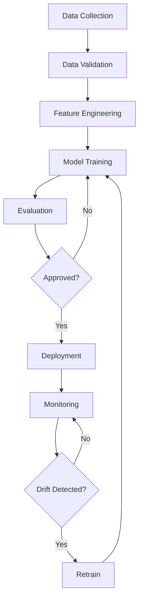
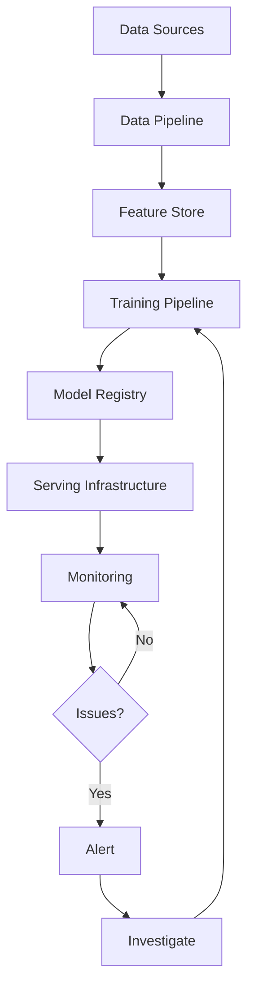
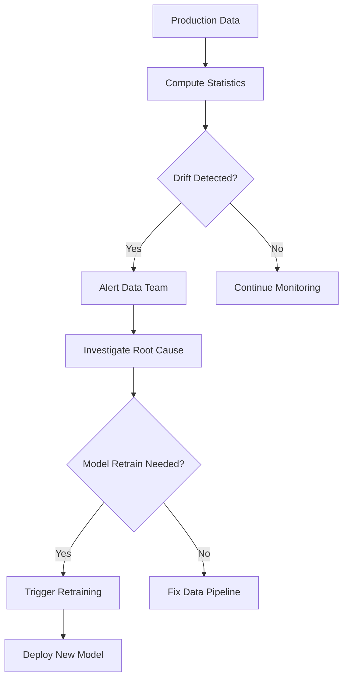

# 69 - MLOps: Interview Preparation Guide

## Table of Contents
- [Introduction](#introduction)
- [Learning Roadmap](#learning-roadmap)
- [Theory Notes](#theory-notes)
- [Key Concepts](#key-concepts)
- [FAQ (30+ Q&A)](#faq-30-qa)
- [Hands-on Practice](#hands-on-practice)
- [FAANG Questions](#faang-questions)
- [Common Mistakes](#common-mistakes)
- [Best Practices](#best-practices)
- [Cheat Sheet](#cheat-sheet)
- [Flash Cards (30)](#flash-cards-30)
- [Mind Map](#mind-map)
- [Mermaid Diagrams](#mermaid-diagrams)
- [Code Examples](#code-examples)
- [Projects](#projects)
- [Resources](#resources)
- [Checklist](#checklist)
- [Revision Plans](#revision-plans)
- [Mock Interviews](#mock-interviews)
- [Difficulty Rating](#difficulty-rating)
- [Summary](#summary)

---

## Introduction

MLOps (Machine Learning Operations) is the practice of deploying, monitoring, and maintaining ML models in production. It bridges the gap between ML development and production operations, ensuring models are reliable, reproducible, and scalable. MLOps encompasses the entire ML lifecycle from data collection to model monitoring.

As ML moves from research to production, MLOps has become critical for organizations. It addresses challenges like reproducibility, versioning, monitoring, and automation that are essential for real-world ML systems.

Key MLOps principles:
- **Reproducibility**: Every experiment can be exactly reproduced
- **Automation**: Minimize manual steps in ML pipelines
- **Monitoring**: Continuously track model and data health
- **Versioning**: Track all artifacts (data, code, models, config)
- **Collaboration**: Enable team-based ML development
- **Scalability**: Handle growing data and model complexity

---

## Learning Roadmap

### Phase 1: Foundations (Week 1-2)
- ML lifecycle understanding
- Version control (Git, DVC)
- Experiment tracking (MLflow, W&B)
- Reproducibility principles

### Phase 2: Data and Feature Management (Week 3-4)
- Data versioning
- Feature stores (Feast)
- Data validation (Great Expectations)
- Data pipelines (Airflow, Kubeflow)

### Phase 3: Model Training and Management (Week 5-6)
- Training pipelines
- Model registry
- Hyperparameter tuning (Optuna)
- Distributed training

### Phase 4: Deployment (Week 7-8)
- Model serving (TF Serving, Triton, BentoML)
- Real-time vs batch inference
- A/B testing for ML
- Edge deployment

### Phase 5: Monitoring and Operations (Week 9-12)
- Model monitoring (data drift, concept drift)
- Alerting and incident response
- Retraining strategies
- CI/CD for ML

---

## Theory Notes

### ML Lifecycle
1. **Data**: Collection, validation, preprocessing
2. **Training**: Model development, experiment tracking
3. **Evaluation**: Testing, validation, approval
4. **Deployment**: Serving, A/B testing, rollout
5. **Monitoring**: Performance tracking, drift detection
6. **Iteration**: Retraining, updating, improving

### Experiment Tracking
Recording all parameters, metrics, and artifacts for each training run:
- Hyperparameters (learning rate, batch size, architecture)
- Metrics (accuracy, loss, F1)
- Artifacts (model weights, data splits, code versions)
- Environment (library versions, GPU info)

### Model Versioning
Tracking model iterations with metadata:
- Training data version
- Code version
- Hyperparameters
- Performance metrics
- Deployment status

### Feature Stores
Centralized repository for features used in ML:
- Feature definitions and transformations
- Online serving (low-latency feature retrieval)
- Offline training (batch feature computation)
- Feature sharing across teams

### Data Drift
Change in input data distribution over time:
- **Feature drift**: Distribution of individual features changes
- **Label drift**: Distribution of target variable changes
- **Covariance drift**: Relationships between features change

### Concept Drift
Change in the relationship between input features and target variable:
- The same inputs produce different outputs over time
- Model becomes less accurate even with similar data distribution
- Requires retraining on new data

### ML CI/CD
Automating ML pipeline:
- **CI**: Code testing, data validation, model testing
- **CD**: Model deployment, A/B testing, rollback
- **CT (Continuous Training)**: Automated retraining on new data

### Model Serving
Deploying models for inference:
- **Real-time**: Low-latency API serving (REST/gRPC)
- **Batch**: Periodic bulk predictions
- **Edge**: On-device inference
- **Streaming**: Real-time prediction on data streams

### Model Optimization for Serving
- **Quantization**: Reduce model precision (FP32 to INT8/INT4)
- **Pruning**: Remove unnecessary weights/neurons
- **Knowledge Distillation**: Train smaller model to mimic larger
- **ONNX Conversion**: Standard format for optimized inference
- **TensorRT**: NVIDIA's inference optimizer

### Data Pipeline Patterns
- **Batch Processing**: Periodic ETL jobs (Spark, Airflow)
- **Stream Processing**: Real-time data (Kafka, Flink)
- **Micro-batching**: Small batch real-time (Spark Streaming)
- **Change Data Capture**: Detecting and propagating data changes

---

## Key Concepts

| Concept | Description |
|---------|-------------|
| Experiment Tracking | Recording all training parameters and results |
| Model Registry | Centralized model storage with versioning |
| Feature Store | Shared feature repository for training and serving |
| Data Drift | Change in input data distribution over time |
| Concept Drift | Change in input-output relationship |
| A/B Testing | Comparing model versions with live traffic |
| CI/CD for ML | Automated testing and deployment of ML systems |
| Model Monitoring | Tracking model performance in production |
| Data Validation | Checking data quality and consistency |
| Reproducibility | Ability to recreate exact results |
| Canary Deployment | Gradual rollout to small traffic percentage |
| Shadow Deployment | Running new model alongside current without serving |

---

## FAQ (30+ Q&A)

### Q1: What is MLOps?
**A:** Practices for deploying, monitoring, and maintaining ML models in production. Bridges ML development and operations, ensuring reliability, reproducibility, and scalability of ML systems.

### Q2: Why is MLOps important?
**A:** Most ML models fail in production due to poor deployment practices, lack of monitoring, and non-reproducible experiments. MLOps addresses these challenges systematically.

### Q3: What is experiment tracking?
**A:** Recording all parameters, metrics, and artifacts from training runs. Enables comparison, reproducibility, and understanding of what worked. Tools: MLflow, Weights & Biases, Neptune.

### Q4: What is a feature store?
**A:** Centralized repository for feature definitions and values. Enables feature sharing, consistent computation for training and serving, and reduces feature engineering duplication.

### Q5: What is data drift?
**A:** Change in input data distribution over time. Detected by monitoring feature distributions, statistics, and model performance. Triggers retraining or data pipeline investigation.

### Q6: What is concept drift?
**A:** Change in the relationship between features and target. The same inputs produce different outputs. More challenging than data drift as it requires new labeled data to detect.

### Q7: How do you deploy ML models?
**A:** Options: REST API (FastAPI, Flask), containerized serving (Docker + K8s), managed services (SageMaker, Vertex AI), batch processing (Spark), edge deployment (TensorFlow Lite).

### Q8: What is A/B testing for ML?
**A:** Routing a percentage of traffic to a new model version to compare performance with the current model. Measures real-world impact before full rollout.

### Q9: What is model monitoring?
**A:** Continuously tracking model performance metrics, data quality, and drift indicators. Includes latency, throughput, prediction distribution, error rates, and feature statistics.

### Q10: What is the difference between CI/CD and MLOps?
**A:** CI/CD focuses on code deployment. MLOps extends this to data, models, and experiments. MLOps includes additional concerns like data validation, model testing, and drift monitoring.

### Q11: How do you version ML models?
**A:** Track: model weights, training data, code, hyperparameters, and metrics. Use model registries (MLflow, SageMaker Model Registry). Tag versions with deployment status.

### Q12: What is a training pipeline?
**A:** Automated sequence of steps: data loading, preprocessing, feature engineering, training, evaluation, and model registration. Ensures reproducibility and enables automation.

### Q13: How do you handle failed deployments?
**A:** Automated rollback to previous version, alerting on errors, staged rollouts (canary deployment), health checks, and incident response procedures.

### Q14: What is batch vs real-time inference?
**A:** Batch: periodic bulk predictions (e.g., nightly recommendations). Real-time: on-demand predictions with low latency (e.g., search ranking). Choose based on latency requirements.

### Q15: What is data validation?
**A:** Checking data quality: schema validation, statistical tests, missing value checks, outlier detection, and distribution monitoring. Tools: Great Expectations, TFX Data Validation.

### Q16: How do you reduce ML model latency?
**A:** Model optimization (quantization, pruning), efficient serving frameworks (Triton), batching requests, caching, hardware acceleration (GPU/TPU), and model distillation.

### Q17: What is canary deployment?
**A:** Gradually rolling out a new model version to a small percentage of traffic, monitoring for issues, then increasing percentage. Reduces risk of problematic deployments.

### Q18: What is ML observability?
**A:** Comprehensive monitoring of ML systems: model performance, data quality, infrastructure health, and business metrics. Enables debugging and understanding of production behavior.

### Q19: How do you automate retraining?
**A:** Monitor drift metrics, trigger retraining when thresholds exceeded, validate new model, deploy if better. Schedule-based or event-based. Tools: Kubeflow Pipelines, Airflow.

### Q20: What is infrastructure as code for MLOps?
**A:** Defining ML infrastructure (clusters, pipelines, services) through code. Enables reproducible environments, version-controlled infrastructure, and automated provisioning.

### Q21: What is a model card?
**A:** Documentation describing model details: intended use, training data, performance metrics, limitations, ethical considerations, and evaluation results. Promotes transparency.

### Q22: What is shadow deployment?
**A:** Running a new model alongside the current one, processing the same traffic but not serving results. Used to evaluate new model performance without affecting users.

### Q23: What is DVC (Data Version Control)?
**A:** Version control system for ML projects tracking data, models, and experiments alongside Git. Stores data in remote storage while keeping Git for code and metadata.

### Q24: What is MLflow?
**A:** Open-source platform for ML lifecycle management. Provides experiment tracking, model registry, model serving, and pipeline orchestration. Works with any ML framework.

### Q25: What is feature engineering in production?
**A:** Computing features consistently for both training and serving. Feature stores ensure same transformations are applied. Critical for avoiding training-serving skew.

### Q26: What is training-serving skew?
**A:** Difference between how features are computed during training vs serving. Causes model performance degradation. Prevented by using same code/feature store for both.

### Q27: What is a model registry?
**A:** Centralized repository storing model versions with metadata (metrics, params, data version). Manages model lifecycle stages (staging, production, archived). Tools: MLflow, SageMaker.

### Q28: What is online vs offline evaluation?
**A:** Offline evaluates on held-out test data before deployment. Online evaluates on live traffic (A/B testing, shadow deployment). Both needed for comprehensive evaluation.

### Q29: What is ML pipeline orchestration?
**A:** Managing workflow execution: scheduling, dependency management, parallel execution, error handling, and monitoring. Tools: Airflow, Kubeflow Pipelines, Prefect, Dagster.

### Q30: What is cost optimization in MLOps?
**A:** Reducing infrastructure and compute costs: right-sizing instances, using spot instances, auto-scaling, model optimization, efficient batching, and resource monitoring.

---

## Hands-on Practice

### MLflow Experiment Tracking
```python
import mlflow
import mlflow.sklearn
from sklearn.ensemble import RandomForestClassifier
from sklearn.metrics import accuracy_score

mlflow.set_experiment("my_experiment")

with mlflow.start_run():
    params = {"n_estimators": 100, "max_depth": 10}
    model = RandomForestClassifier(**params)
    model.fit(X_train, y_train)
    y_pred = model.predict(X_test)
    accuracy = accuracy_score(y_test, y_pred)

    mlflow.log_params(params)
    mlflow.log_metric("accuracy", accuracy)
    mlflow.sklearn.log_model(model, "model")
```

### Data Drift Detection
```python
from scipy.stats import ks_2samp
import numpy as np

def detect_drift(reference_data, current_data, threshold=0.05):
    drift_report = {}
    for column in reference_data.columns:
        stat, p_value = ks_2samp(
            reference_data[column].dropna(),
            current_data[column].dropna()
        )
        drift_report[column] = {
            "statistic": stat,
            "p_value": p_value,
            "drift_detected": p_value < threshold
        }
    return drift_report
```

### Simple Model Serving
```python
from fastapi import FastAPI
import joblib
import numpy as np

app = FastAPI()
model = joblib.load("model.pkl")

@app.post("/predict")
async def predict(features: list):
    prediction = model.predict(np.array(features).reshape(1, -1))
    return {"prediction": prediction.tolist()}
```

---

## FAANG Questions

1. **Google**: Design an ML platform serving 1000 models with auto-scaling. How do you manage it?
2. **Meta**: Build a feature store handling 10B features with sub-millisecond latency.
3. **Amazon**: Design a real-time fraud detection system with MLOps best practices.
4. **Netflix**: Build a model monitoring system detecting drift across 100+ models.
5. **Uber**: Design an ML pipeline for dynamic pricing with continuous retraining.
6. **Google**: How would you implement A/B testing for ML models at scale?
7. **Meta**: Design a model serving system with 99.99% availability.
8. **Amazon**: Build an automated ML pipeline from data validation to deployment.
9. **Apple**: Design privacy-preserving MLOps for on-device models.
10. **Netflix**: How would you handle model rollback when a new model performs poorly?
11. **Google**: Design an ML platform that supports both training and inference at scale.
12. **Meta**: Build a monitoring system that detects and alerts on model performance degradation.

---

## Common Mistakes

1. Not tracking experiments (non-reproducible results)
2. Skipping data validation in pipelines
3. No monitoring after deployment
4. Manual deployments (error-prone, slow)
5. Not versioning data and models together
6. Ignoring model latency in production
7. No A/B testing before full rollout
8. Not planning for model retraining
9. Missing fallback strategies for model failures
10. Ignoring infrastructure costs
11. Not implementing proper access controls
12. Skipping model documentation

---

## Best Practices

1. Track all experiments systematically
2. Version data, code, and models together
3. Automate training and deployment pipelines
4. Implement comprehensive monitoring
5. Use feature stores for consistency
6. Test models before deployment
7. Implement A/B testing for model comparison
8. Plan for retraining from day one
9. Document models with model cards
10. Use infrastructure as code
11. Implement proper alerting
12. Design for failure with rollback strategies

---

## Cheat Sheet

### MLOps Tools
| Category | Tools |
|----------|-------|
| Experiment Tracking | MLflow, W&B, Neptune |
| Feature Store | Feast, Tecton, Hopsworks |
| Pipeline | Kubeflow, Airflow, Prefect |
| Model Serving | TF Serving, Triton, BentoML |
| Monitoring | Evidently, Whylabs, Arize |
| Data Validation | Great Expectations, TFX |

### Monitoring Metrics
| Metric | What to Monitor |
|--------|----------------|
| Latency | P50, P95, P99 response times |
| Throughput | Requests per second |
| Error Rate | Failed predictions, exceptions |
| Data Drift | Feature distribution changes |
| Performance | Accuracy, F1, AUC over time |

### Deployment Strategies
| Strategy | Risk Level | Rollback Speed |
|----------|-----------|----------------|
| Blue-Green | Low | Instant |
| Canary | Low | Fast |
| Shadow | None | N/A |
| Rolling | Medium | Slow |

---

## Flash Cards (30)

**Card 1:** Q: What is MLOps? A: Practices for deploying, monitoring, and maintaining ML models in production.

**Card 2:** Q: What is experiment tracking? A: Recording all parameters, metrics, and artifacts from training runs.

**Card 3:** Q: What is a feature store? A: Centralized repository for feature definitions and values across teams.

**Card 4:** Q: What is data drift? A: Change in input data distribution over time in production.

**Card 5:** Q: What is concept drift? A: Change in the relationship between input features and target variable.

**Card 6:** Q: What is MLflow? A: Open-source platform for experiment tracking, model registry, and deployment.

**Card 7:** Q: What is A/B testing for ML? A: Comparing model versions with live traffic to measure impact.

**Card 8:** Q: What is a model registry? A: Centralized storage for model versions with metadata and stage management.

**Card 9:** Q: What is batch inference? A: Periodic bulk predictions processed in batches, not real-time.

**Card 10:** Q: What is real-time serving? A: Low-latency API serving for on-demand predictions.

**Card 11:** Q: What is data validation? A: Checking data quality, schema, and statistical properties.

**Card 12:** Q: What is a training pipeline? A: Automated sequence of data prep, training, evaluation, and registration.

**Card 13:** Q: What is canary deployment? A: Gradually rolling out new model to small traffic percentage.

**Card 14:** Q: What is CI/CD for ML? A: Automated testing and deployment of ML code, data, and models.

**Card 15:** Q: What is a model card? A: Documentation of model details, performance, limitations, and ethics.

**Card 16:** Q: What is shadow deployment? A: Running new model alongside current one without serving results.

**Card 17:** Q: What is Great Expectations? A: Data validation framework for checking data quality and consistency.

**Card 18:** Q: What is Kubeflow? A: ML toolkit for Kubernetes enabling portable ML workflows.

**Card 19:** Q: What is feature engineering in production? A: Computing and serving features consistently for training and inference.

**Card 20:** Q: What is ML observability? A: Comprehensive monitoring of ML systems including model, data, and infrastructure.

**Card 21:** Q: What is DVC? A: Data Version Control for tracking data, models, and experiments alongside Git.

**Card 22:** Q: What is training-serving skew? A: Feature computation differences between training and serving causing degradation.

**Card 23:** Q: What is online evaluation? A: Evaluating model performance on live traffic through A/B testing.

**Card 24:** Q: What is offline evaluation? A: Evaluating model on held-out test data before deployment.

**Card 25:** Q: What is pipeline orchestration? A: Managing workflow execution, scheduling, and error handling.

**Card 26:** Q: What is model optimization? A: Quantization, pruning, distillation for faster inference.

**Card 27:** Q: What is auto-scaling? A: Automatically adjusting compute resources based on demand.

**Card 28:** Q: What is rollback? A: Reverting to previous model version when issues detected.

**Card 29:** Q: What is infrastructure as code? A: Defining infrastructure through version-controlled code files.

**Card 30:** Q: What is incident response for ML? A: Procedures for handling model failures, drift, and performance issues.

---

## Mind Map

```
MLOps
├── Data
│   ├── Validation
│   ├── Versioning
│   └── Feature Store
├── Training
│   ├── Experiment Tracking
│   ├── Pipelines
│   └── Model Registry
├── Deployment
│   ├── Real-time Serving
│   ├── Batch Inference
│   ├── A/B Testing
│   └── Edge Deployment
├── Monitoring
│   ├── Data Drift
│   ├── Concept Drift
│   ├── Performance
│   └── Alerting
└── Operations
    ├── CI/CD
    ├── Retraining
    └── Incident Response
```

---

## Mermaid Diagrams

### ML Lifecycle


### CI/CD for ML


### MLOps Architecture


### Drift Detection Flow


---

## Code Examples

### DVC Pipeline
```yaml
# dvc.yaml
stages:
  prepare:
    cmd: python src/prepare.py
    deps:
      - src/prepare.py
      - data/raw
    outs:
      - data/prepared

  train:
    cmd: python src/train.py
    deps:
      - src/train.py
      - data/prepared
    params:
      - params.yaml:train
    outs:
      - model.pkl
    metrics:
      - metrics.json:cache=false
```

### Evidently Monitoring
```python
from evidently.report import Report
from evidently.metric_preset import DataDriftPreset

report = Report(metrics=[DataDriftPreset()])
report.run(
    reference_data=reference_df,
    current_data=current_df
)
report.save_html("drift_report.html")
```

### FastAPI Model Serving
```python
from fastapi import FastAPI, HTTPException
from pydantic import BaseModel
import joblib
import numpy as np

app = FastAPI()
model = joblib.load("model.pkl")

class PredictionRequest(BaseModel):
    features: list[float]

class PredictionResponse(BaseModel):
    prediction: int
    confidence: float

@app.post("/predict", response_model=PredictionResponse)
async def predict(request: PredictionRequest):
    try:
        features = np.array(request.features).reshape(1, -1)
        prediction = model.predict(features)[0]
        confidence = max(model.predict_proba(features)[0])
        return PredictionResponse(
            prediction=int(prediction),
            confidence=float(confidence)
        )
    except Exception as e:
        raise HTTPException(status_code=400, detail=str(e))
```

---

## Projects

1. **ML Pipeline**: End-to-end training pipeline with DVC and MLflow
2. **Model Serving**: Deploy model with FastAPI + Docker + monitoring
3. **Drift Detection**: Build automated drift monitoring system
4. **Feature Store**: Implement feature store with Feast
5. **A/B Testing**: Set up model comparison framework
6. **CI/CD Pipeline**: Build automated ML deployment pipeline
7. **Monitoring Dashboard**: Create ML monitoring visualization

---

## Resources

- **Books**: "Designing Machine Learning Systems" (Chip Huyen)
- **Courses**: Made With ML, Full Stack Deep Learning
- **Tools**: MLflow, Kubeflow, Feast, Evidently, DVC
- **Platforms**: SageMaker, Vertex AI, Azure ML
- **Papers**: "Hidden Technical Debt in ML Systems", MLOps whitepapers

---

## Checklist

- [ ] ML lifecycle understanding
- [ ] Experiment tracking (MLflow, W&B)
- [ ] Data and model versioning
- [ ] Feature stores
- [ ] Training pipelines
- [ ] Model serving
- [ ] A/B testing
- [ ] Data and concept drift monitoring
- [ ] CI/CD for ML
- [ ] Incident response
- [ ] Model optimization for serving
- [ ] Data validation
- [ ] Pipeline orchestration
- [ ] Cost optimization

---

## Revision Plans

### 2-Week Plan
- Week 1: Foundations, experiment tracking, pipelines
- Week 2: Deployment, monitoring, production operations

### Daily (30 min)
- 10 min: Flash cards
- 10 min: Code practice
- 10 min: Read papers/tutorials

---

## Mock Interviews

1. Design an ML platform serving 1000 models with auto-scaling
2. How would you detect and handle concept drift?
3. Build a feature store for a large-scale recommendation system
4. Design an A/B testing framework for ML models
5. How would you implement CI/CD for an ML pipeline?
6. Design a monitoring system for ML model performance
7. How would you handle model rollback in production?

---

## Difficulty Rating

| Topic | Difficulty | Frequency |
|-------|-----------|-----------|
| Experiment Tracking | Easy | Very High |
| Data Validation | Medium | High |
| Model Serving | Medium | Very High |
| Drift Detection | Medium | High |
| CI/CD for ML | Hard | High |
| Feature Stores | Medium | Medium |
| A/B Testing | Medium | High |
| Cost Optimization | Hard | Medium |

**Overall: Medium | Preparation: 4-6 weeks**

---

## Summary

MLOps is essential for taking ML models from prototype to production. Master experiment tracking, pipeline automation, model serving, and monitoring. Understand drift detection and retraining strategies. The key is building reliable, reproducible, and scalable ML systems that deliver consistent value in production.

---

## Deep Dive: MLOps Tool Comparison

### MLOps Platform Comparison
| Platform | Type | Strengths | Best For |
|----------|------|-----------|----------|
| MLflow | Open-source | Experiment tracking, model registry | Small-medium teams |
| Kubeflow | Open-source | Kubernetes-native pipelines | Large-scale on K8s |
| SageMaker | Managed (AWS) | End-to-end, auto-scaling | AWS shops |
| Vertex AI | Managed (GCP) | AutoML, pipelines | GCP shops |
| Azure ML | Managed (Azure) | Enterprise, compliance | Azure shops |
| W&B | SaaS | Best experiment tracking | Research teams |
| DVC | Open-source | Git-like data versioning | Data-heavy projects |

### Feature Store Comparison
| Store | Type | Latency | Scalability | Best For |
|-------|------|---------|-------------|----------|
| Feast | Open-source | Low | Horizontal | Self-hosted |
| Tecton | Managed | Very Low | Very High | Enterprise |
| Hopsworks | Open-source/Managed | Low | High | Feature platform |
| SageMaker Feature Store | Managed | Very Low | Very High | AWS native |

### Model Serving Comparison
| Framework | Type | Latency | Throughput | Best For |
|-----------|------|---------|------------|----------|
| TF Serving | Open-source | Low | High | TensorFlow models |
| Triton | Open-source | Very Low | Very High | Multi-framework |
| BentoML | Open-source | Low | High | Python models |
| vLLM | Open-source | Low | Very High | LLM serving |
| SageMaker | Managed | Low | Auto-scale | AWS production |
| TorchServe | Open-source | Low | High | PyTorch models |

### Monitoring Tool Comparison
| Tool | Type | Features | Best For |
|------|------|----------|----------|
| Evidently | Open-source | Drift, quality, reports | Data monitoring |
| Whylabs | SaaS | Monitoring platform | Production monitoring |
| Arize | SaaS | Observability, tracing | Enterprise monitoring |
| Fiddler | SaaS | Explainability, monitoring | Regulated industries |
| Prometheus+Grafana | Open-source | Infrastructure metrics | System monitoring |

### Data Validation Comparison
| Tool | Type | Features | Best For |
|------|------|----------|----------|
| Great Expectations | Open-source | Data quality, profiling | Data pipelines |
| TFX Data Validation | Open-source | Schema, statistics | TensorFlow pipelines |
| Pandera | Open-source | DataFrame validation | Pandas/Polars |
| Soda | Open-source/Managed | Data quality testing | SQL pipelines |

---

## Deep Dive: Deployment Strategies

### Deployment Strategy Comparison
| Strategy | Downtime | Risk | Rollback | Cost | Complexity |
|----------|---------|------|----------|------|------------|
| Blue-Green | Zero | Low | Instant | 2x infra | Medium |
| Canary | Zero | Very Low | Fast | 1.1x infra | Medium |
| Rolling | Brief | Medium | Slow | 1x infra | Low |
| Shadow | Zero | None | N/A | 2x infra | High |
| A/B Test | Zero | Low | Fast | 1.5x infra | Medium |

### Model Serving Architecture Patterns
| Pattern | Latency | Throughput | Complexity | Best For |
|---------|---------|------------|-----------|----------|
| Single model API | Low | Medium | Low | Simple apps |
| Multi-model ensemble | Medium | Low | Medium | High accuracy |
| Model router | Low | High | Medium | Multi-model |
| Batch prediction | High (async) | Very High | Low | Offline processing |
| Streaming | Low | High | High | Real-time data |

### CI/CD Pipeline for ML
| Stage | Tools | What to Test |
|-------|-------|-------------|
| Code | Git, pre-commit | Linting, formatting |
| Data | Great Expectations | Schema, quality, drift |
| Training | MLflow, W&B | Reproducibility, metrics |
| Model | Custom tests | Accuracy, latency, fairness |
| Integration | Docker, K8s | End-to-end pipeline |
| Deployment | Terraform, Helm | Infrastructure correctness |
| Monitoring | Evidently, alerts | Performance, drift |

---

## MLOps Deep Dive

### MLOps Architecture Reference
| Component | Tools | Purpose |
|-----------|-------|---------|
| Data Ingestion | Apache Airflow, Prefect | Schedule and orchestrate data pipelines |
| Data Validation | Great Expectations, TFX | Ensure data quality and schema compliance |
| Feature Store | Feast, Tecton | Store and serve features consistently |
| Experiment Tracking | MLflow, W&B | Log experiments, compare results |
| Model Training | Kubeflow, SageMaker | Scalable training pipelines |
| Model Registry | MLflow Model Registry | Version and manage models |
| Model Serving | Triton, BentoML, TFServing | Deploy models for inference |
| Model Monitoring | Evidently, Whylabs | Track performance and drift |
| CI/CD | GitHub Actions, Jenkins | Automate testing and deployment |
| Infrastructure | Terraform, Kubernetes | Manage cloud resources |

### Model Monitoring Deep Dive
| Metric | What It Measures | How to Detect | Action |
|--------|-----------------|---------------|--------|
| Data Drift | Input distribution change | KS test, PSI | Retrain model |
| Concept Drift | Relationship change | Performance metrics | Retrain with new labels |
| Prediction Drift | Output distribution change | Statistical tests | Investigate inputs |
| Latency | Response time | Percentile tracking | Optimize model |
| Throughput | Requests per second | Load monitoring | Scale infrastructure |
| Error Rate | Failed predictions | Error logs | Debug and fix |
| Resource Usage | CPU/GPU/Memory | Infrastructure metrics | Scale resources |
| Cost | Dollar per prediction | Billing analysis | Optimize efficiency |

### CI/CD Pipeline for ML Deep Dive
| Stage | What to Test | Tools | Failure Action |
|-------|-------------|-------|----------------|
| Code Quality | Linting, formatting, type checking | ESLint, Black, mypy | Block merge |
| Unit Tests | Component functionality | pytest, unittest | Block merge |
| Data Validation | Schema, quality, freshness | Great Expectations | Block pipeline |
| Model Validation | Accuracy, latency, fairness | Custom tests | Block deployment |
| Integration Tests | End-to-end pipeline | Test suite | Block deployment |
| Security Scan | Vulnerabilities, secrets | Snyk, Trivy | Block deployment |
| Performance Test | Load, stress testing | Locust, k6 | Block deployment |
| Canary Deploy | Small traffic percentage | Istio, Argo Rollouts | Rollback if metrics degrade |

### Feature Store Operations
| Operation | Description | Implementation |
|-----------|-------------|---------------|
| Feature Registration | Define and version features | Feature store API |
| Feature Computation | Batch or real-time feature generation | Spark, Flink, Lambda |
| Feature Serving | Low-latency feature retrieval | Online store (Redis) |
| Feature Monitoring | Track feature quality and drift | Statistics, alerts |
| Feature Sharing | Reuse features across teams | Centralized store |

### Common MLOps Interview Scenarios
| Scenario | Approach | Key Considerations |
|----------|----------|-------------------|
| Model retraining | Scheduled (weekly) + event-driven (drift) | Cost, freshness |
| A/B testing | 50/50 traffic split, statistical significance | Sample size, duration |
| Multi-model serving | Model router, dynamic loading | Latency, cost |
| Feature pipeline | Batch + streaming hybrid | Consistency, freshness |
| Model rollback | Shadow deployment → canary → full | Zero downtime |
| Data quality | Great Expectations + alerts | Schema, freshness |
| Cost optimization | Spot instances, auto-scaling, caching | Availability |

---

## Interview Quick Reference Card

### Top 10 MLOps Interview Questions
1. **MLOps lifecycle**: Data → Training → Evaluation → Deployment → Monitoring → Retraining
2. **Experiment tracking**: Record params, metrics, artifacts for reproducibility
3. **Feature store**: Centralized feature repository for training-serving consistency
4. **Data drift**: Change in input data distribution; detect with statistical tests
5. **Concept drift**: Change in input-output relationship; requires retraining
6. **A/B testing**: Route traffic to compare model versions in production
7. **Canary deployment**: Gradual rollout to small percentage, monitor, then expand
8. **Model monitoring**: Track latency, throughput, accuracy, drift in production
9. **CI/CD for ML**: Automated testing and deployment of data, code, and models
10. **Retraining strategy**: Event-driven (drift) or schedule-based, validate before deploy

### MLOps Maturity Model
| Level | Characteristics | Manual/Automated |
|-------|----------------|------------------|
| Level 0 | No pipeline, manual steps | Fully manual |
| Level 1 | ML pipeline, experiment tracking | Semi-automated |
| Level 2 | CI/CD, automated retraining | Mostly automated |
| Level 3 | Full MLOps, monitoring, auto-scaling | Fully automated |

### MLOps Checklist
- [ ] Experiment tracking (MLflow, W&B)
- [ ] Data versioning (DVC)
- [ ] Feature store (Feast)
- [ ] Training pipeline (Kubeflow, Airflow)
- [ ] Model registry (MLflow)
- [ ] Model serving (Triton, BentoML)
- [ ] A/B testing framework
- [ ] Drift detection (Evidently)
- [ ] CI/CD pipeline
- [ ] Monitoring dashboard (Grafana)
- [ ] Alerting system
- [ ] Rollback strategy
- [ ] Model documentation (model cards)
- [ ] Cost monitoring

### Key MLOps Formulas
- **Drift detection (PSI)**: sum((P_i - Q_i) * log(P_i / Q_i)) where P=production, Q=reference
- **Latency percentiles**: P50 (median), P95, P99, P999
- **Throughput**: requests / second
- **Error rate**: failed_requests / total_requests
- **Model decay**: (baseline_metric - current_metric) / baseline_metric
- **Cost per prediction**: total_cost / total_predictions
