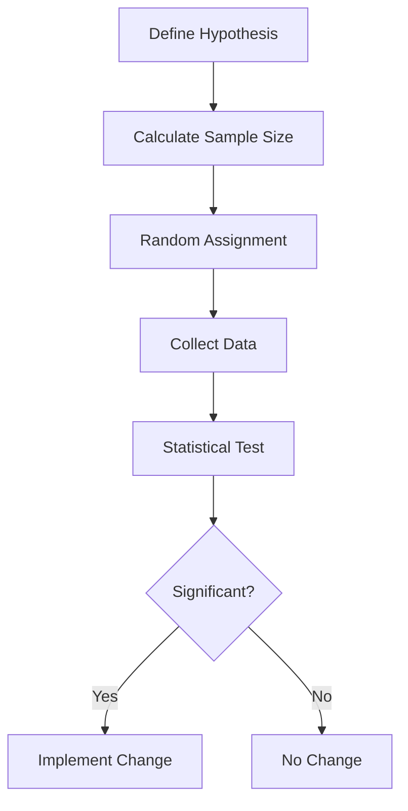
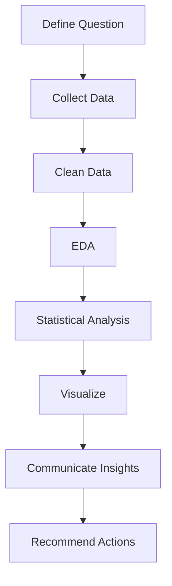
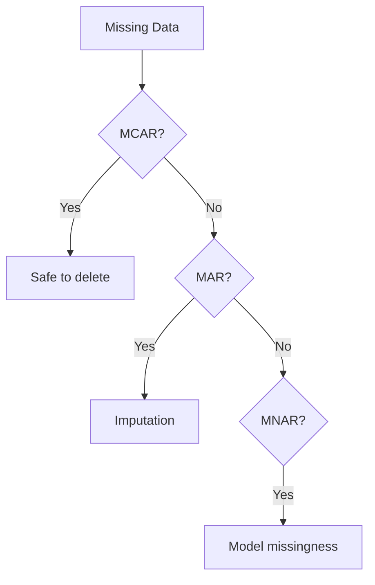

# 70 - Data Analytics: Interview Preparation Guide

## Table of Contents
- [Introduction](#introduction)
- [Learning Roadmap](#learning-roadmap)
- [Theory Notes](#theory-notes)
- [Key Concepts](#key-concepts)
- [FAQ (35+ Q&A)](#faq-35-qa)
- [Hands-on Practice](#hands-on-practice)
- [FAANG Questions](#faang-questions)
- [Common Mistakes](#common-mistakes)
- [Best Practices](#best-practices)
- [Cheat Sheet](#cheat-sheet)
- [Flash Cards (30)](#flash-cards-30)
- [Mind Map](#mind-map)
- [Mermaid Diagrams](#mermaid-diagrams)
- [Code Examples](#code-examples)
- [Projects](#projects)
- [Resources](#resources)
- [Checklist](#checklist)
- [Revision Plans](#revision-plans)
- [Mock Interviews](#mock-interviews)
- [Difficulty Rating](#difficulty-rating)
- [Summary](#summary)

---

## Introduction

Data Analytics is the process of examining datasets to draw conclusions, identify patterns, and support decision-making. It encompasses exploratory data analysis, statistical testing, visualization, and communicating insights to stakeholders. Data analysts bridge raw data and business decisions, transforming numbers into actionable insights.

Data analytics roles are common across all industries. Interview questions typically test SQL proficiency, statistical knowledge, analytical thinking, and ability to communicate findings clearly.

The data analytics field continues to grow rapidly, with increasing demand for professionals who can extract meaningful insights from complex datasets. Whether you are analyzing customer behavior, optimizing business processes, or building data-driven strategies, the fundamental skills of data analytics remain consistent: ask the right questions, collect and clean data, analyze rigorously, and communicate clearly.

---

## Learning Roadmap

### Phase 1: Foundations (Week 1-2)
- SQL (queries, joins, window functions)
- Excel/Google Sheets mastery
- Basic statistics
- Data types and structures

### Phase 2: Analysis Techniques (Week 3-4)
- Exploratory Data Analysis (EDA)
- Descriptive statistics
- Data visualization principles
- Correlation analysis

### Phase 3: Statistical Methods (Week 5-6)
- Hypothesis testing
- A/B testing
- Confidence intervals
- Regression basics

### Phase 4: Business Analytics (Week 7-8)
- KPI definition and tracking
- Cohort analysis
- Funnel analysis
- Metrics frameworks (AARRR, North Star)

### Phase 5: Advanced (Week 9-12)
- Advanced SQL (CTEs, pivots)
- Dashboard design
- Storytelling with data
- Product analytics
- Experimentation design

---

## Theory Notes

### Exploratory Data Analysis (EDA)
Systematic approach to understanding data:
1. **Univariate analysis**: Distribution of single variables (histograms, box plots)
2. **Bivariate analysis**: Relationships between two variables (scatter plots, cross-tabs)
3. **Multivariate analysis**: Patterns across multiple variables
4. **Data quality checks**: Missing values, outliers, duplicates, inconsistencies

### Key Statistical Concepts

**Mean, Median, Mode**: Central tendency measures. Mean is sensitive to outliers; median is robust.

**Standard Deviation**: Measures spread around the mean. Higher SD = more variability.

**Percentiles**: Value below which a percentage of data falls. P50 = median, P95 = 95th percentile.

**Normal Distribution**: Bell-shaped, symmetric. Many natural phenomena follow it. Mean = median = mode.

**Skewness**: Measure of asymmetry. Positive skew = long right tail. Negative skew = long left tail.

### Hypothesis Testing
1. **Null Hypothesis (H0)**: Default assumption (no effect/difference)
2. **Alternative Hypothesis (H1)**: What you're trying to prove
3. **p-value**: Probability of observing results if H0 is true
4. **Significance level (alpha)**: Threshold for rejecting H0 (typically 0.05)
5. **Decision**: If p-value < alpha, reject H0

**Type I Error**: False positive (rejecting true H0)
**Type II Error**: False negative (failing to reject false H0)

### A/B Testing
Statistical experiment comparing two versions:
- Randomly assign users to control (A) or treatment (B)
- Measure key metrics for both groups
- Use statistical tests to determine if difference is significant
- Key considerations: sample size, duration, novelty effects, multiple comparisons

### Cohort Analysis
Grouping users by shared characteristic (signup date, acquisition channel) and tracking behavior over time. Reveals retention patterns, lifecycle trends, and segment differences.

### Funnel Analysis
Tracking user progression through a sequence of steps:
- Registration -> Activation -> Purchase -> Retention
- Identify drop-off points and conversion rates
- Optimize each step to improve overall conversion

### Metrics Frameworks
- **AARRR** (Pirate Metrics): Acquisition, Activation, Retention, Revenue, Referral
- **North Star Metric**: Single metric capturing core product value
- **HEART Framework**: Happiness, Engagement, Adoption, Retention, Task success

### Data Cleaning
Data cleaning typically consumes 60-80% of an analyst's time. Key steps:
1. Handle missing values (deletion, imputation, flagging)
2. Remove duplicate records
3. Fix structural errors (typos, inconsistent naming)
4. Handle outliers (detect with IQR or z-scores, decide to keep/remove/cap)
5. Validate data types and formats
6. Standardize units and formats

### Data Storytelling
Translating data findings into a compelling narrative:
1. **Context**: What is the business problem?
2. **Insight**: What did the data reveal?
3. **Recommendation**: What should we do about it?
4. **Impact**: What is the expected business value?

---

## Key Concepts

| Concept | Description |
|---------|-------------|
| EDA | Systematic exploration of data before modeling |
| p-value | Probability of observing results assuming null hypothesis is true |
| Confidence Interval | Range likely containing true parameter value |
| Statistical Significance | Result unlikely due to random chance |
| Effect Size | Magnitude of difference between groups |
| Sample Size | Number of observations in analysis |
| Selection Bias | Non-random sampling affecting results |
| Simpson's Paradox | Trend appearing in groups but reversing in aggregate |
| Correlation vs Causation | Association doesn't imply causation |
| Survivorship Bias | Focusing on survivors, ignoring failures |
| Data Lake | Raw storage of all data types at any scale |
| Data Warehouse | Structured, processed data optimized for queries |
| ETL | Extract, Transform, Load - data pipeline process |
| Dimensionality Reduction | Reducing number of variables while preserving information |

---

## FAQ (35+ Q&A)

### Q1: What is the difference between exploratory and confirmatory analysis?
**A:** EDA discovers patterns and generates hypotheses from data. Confirmatory analysis tests specific hypotheses using statistical methods. EDA is open-ended; confirmatory follows pre-specified procedures.

### Q2: When do you use mean vs median?
**A:** Use mean for symmetric distributions without outliers. Use median for skewed distributions or data with outliers, as it's robust to extreme values.

### Q3: What is a p-value?
**A:** The probability of observing results at least as extreme as the data, assuming the null hypothesis is true. A small p-value (< 0.05) suggests the observed effect is unlikely due to chance alone.

### Q4: What is the difference between correlation and causation?
**A:** Correlation measures association between variables. Causation means one variable causes changes in another. Correlation can arise from confounding variables, reverse causation, or coincidence. A/B testing establishes causation.

### Q5: How do you handle missing data?
**A:** Options: deletion (listwise, pairwise), imputation (mean, median, mode, KNN, regression), indicator variables, or using algorithms that handle missing data natively. Choice depends on missingness mechanism (MCAR, MAR, MNAR).

### Q6: What is Simpson's Paradox?
**A:** A trend that appears in separate groups but reverses when groups are combined. Caused by confounding variables. Example: Treatment appears worse overall but better within each subgroup.

### Q7: How do you calculate sample size for A/B testing?
**A:** Depends on: minimum detectable effect, significance level (alpha), power (1-beta), and baseline conversion rate. Use power analysis formulas or calculators (typically 1000+ per variant).

### Q8: What is the difference between Type I and Type II errors?
**A:** Type I (false positive): rejecting a true null hypothesis. Type II (false negative): failing to reject a false null hypothesis. Trade-off controlled by significance level and sample size.

### Q9: What is statistical power?
**A:** Probability of correctly rejecting a false null hypothesis (detecting a real effect). Higher power = lower chance of Type II error. Typically want power >= 0.80.

### Q10: What is multiple comparisons problem?
**A:** Testing many hypotheses increases chance of false positives. Correction methods: Bonferroni (conservative), Benjamini-Hochberg (FDR control), or pre-registering primary analysis.

### Q11: What is a confidence interval?
**A:** Range likely containing the true population parameter. A 95% CI means 95% of such intervals from repeated samples would contain the true value. Narrower CI = more precise estimate.

### Q12: What is cohort analysis?
**A:** Grouping users by shared characteristics (signup date, acquisition source) and tracking their behavior over time. Reveals retention patterns, lifecycle trends, and segment differences.

### Q13: What is funnel analysis?
**A:** Tracking user progression through sequential steps. Identifies conversion rates and drop-off points. Used to optimize user journeys (registration -> activation -> purchase).

### Q14: How do you define good KPIs?
**A:** Specific, measurable, actionable, relevant, and time-bound. Should tie to business objectives, be trackable over time, and ideally be leading indicators of success.

### Q15: What is survival analysis?
**A:** Analyzing time-to-event data (churn, equipment failure). Key tools: Kaplan-Meier curves, Cox proportional hazards model. Answers "how long until X happens?"

### Q16: What is the difference between descriptive and inferential statistics?
**A:** Descriptive summarizes observed data (mean, median, charts). Inferential draws conclusions about populations from samples (hypothesis tests, confidence intervals).

### Q17: How do you communicate data insights?
**A:** Start with the key insight, provide context, show supporting evidence with clear visualizations, discuss implications, and recommend actions. Tailor to audience technical level.

### Q18: What is regression analysis?
**A:** Modeling relationship between dependent and independent variables. Simple linear: one predictor. Multiple linear: multiple predictors. Used for prediction and understanding relationships.

### Q19: What is selection bias?
**A:** Systematic error from non-random sampling. Different groups aren't comparable. Can invalidate A/B tests if randomization fails. Mitigation: proper randomization, stratification.

### Q20: What is a good dashboard?
**A:** Clear purpose, key metrics prominently displayed, visualizations appropriate for data type, actionable insights, minimal clutter, and tells a story. Should answer the main questions at a glance.

### Q21: What is time series analysis?
**A:** Analyzing data points collected over time. Identifies trends, seasonality, and cyclical patterns. Tools: moving averages, exponential smoothing, ARIMA. Used for forecasting.

### Q22: What is the difference between BI and data analytics?
**A:** BI focuses on reporting and dashboards for monitoring metrics. Data analytics is broader, including statistical analysis, A/B testing, and deeper investigation. BI tells what happened; analytics explores why.

### Q23: What is a data pipeline?
**A:** Automated series of steps that move and transform data from source to destination. Components: extraction, transformation, loading, scheduling, monitoring. Tools: Airflow, dbt, Spark.

### Q24: What is dimensionality reduction?
**A:** Techniques reducing number of variables while preserving important information. PCA (principal component analysis) is most common. Used for visualization, noise reduction, and improving model performance.

### Q25: What is the difference between population and sample?
**A:** Population is the entire group you want to draw conclusions about. Sample is a subset actually observed. We use sample statistics to estimate population parameters, accounting for sampling error.

### Q26: What is multicollinearity?
**A:** High correlation between independent variables in regression. Makes coefficient estimates unstable. Detected via VIF (Variance Inflation Factor). Solutions: remove variables, PCA, or regularization.

### Q27: What is a leading vs lagging indicator?
**A:** Leading indicators predict future outcomes (website visits predict sales). Lagging indicators confirm past outcomes (monthly revenue). Good dashboards include both types.

### Q28: What is data normalization?
**A:** Scaling data to a common range. Methods: min-max scaling (0-1), z-score standardization (mean 0, std 1), log transformation. Important for machine learning and comparing variables with different units.

### Q29: What is the curse of dimensionality?
**A:** As number of features increases, data becomes sparse and distances between points become less meaningful. Affects clustering, nearest neighbor, and visualization. Solution: dimensionality reduction.

### Q30: What is an insight vs a finding?
**A:** A finding is an observation from data (revenue decreased 10%). An insight explains why and what it means (revenue decreased 10% because competitor launched cheaper alternative, requiring pricing response).

### Q31: How do you prioritize which analyses to run?
**A:** Consider business impact, urgency, data availability, and effort required. Use an impact-effort matrix. Focus on analyses that directly inform decisions. Communicate trade-offs to stakeholders.

### Q32: What is data governance?
**A:** Policies and processes ensuring data quality, privacy, security, and compliance. Includes data ownership, access controls, data dictionaries, lineage tracking, and regulatory compliance (GDPR, CCPA).

### Q33: What is the difference between structured and unstructured data?
**A:** Structured data has fixed format (databases, spreadsheets). Unstructured data lacks predefined format (text, images, videos). Semi-structured has some organization (JSON, XML). Different tools handle each type.

### Q34: What is survivorship bias?
**A:** Focusing on entities that passed some selection process while ignoring those that did not. Example: analyzing only successful companies without failed ones leads to wrong conclusions about success factors.

### Q35: What is a data dictionary?
**A:** Documentation describing each data field: name, type, description, valid values, source, and relationships. Essential for data quality, onboarding, and ensuring consistent interpretation across teams.

---

## Hands-on Practice

### SQL Window Functions
```sql
-- Running total
SELECT date, revenue,
       SUM(revenue) OVER (ORDER BY date) as running_total
FROM sales;

-- Rank by revenue
SELECT product, revenue,
       RANK() OVER (ORDER BY revenue DESC) as rank
FROM product_sales;

-- Month-over-month growth
SELECT month, revenue,
       LAG(revenue) OVER (ORDER BY month) as prev_month,
       (revenue - LAG(revenue) OVER (ORDER BY month)) /
       LAG(revenue) OVER (ORDER BY month) * 100 as growth_pct
FROM monthly_revenue;

-- Percentile calculation
SELECT user_id, session_duration,
       NTILE(10) OVER (ORDER BY session_duration) as decile
FROM user_sessions;

-- Cumulative distribution
SELECT score,
       CUME_DIST() OVER (ORDER BY score) as cumulative_pct
FROM test_results;
```

### Cohort Analysis in Python
```python
import pandas as pd

def cohort_analysis(df, cohort_col, date_col, metric_col):
    df['cohort'] = df.groupby(cohort_col)[date_col].transform('min')
    df['period'] = ((df[date_col] - df['cohort']).dt.days / 30).astype(int)

    cohort_data = df.groupby(['cohort', 'period'])[metric_col].mean()
    cohort_pivot = cohort_data.unstack(0)

    retention = cohort_pivot.divide(cohort_pivot.iloc[0], axis=1)
    return retention

def cohort_retention_matrix(df, user_col, date_col):
    df['signup_month'] = df[date_col].dt.to_period('M')
    df['activity_month'] = df[date_col].dt.to_period('M')
    df['cohort_period'] = (df['activity_month'] - df['signup_month']).apply(lambda x: x.n)

    cohort_data = df.groupby(['signup_month', 'cohort_period'])[user_col].nunique()
    cohort_matrix = cohort_data.unstack(0)
    return cohort_matrix
```

### A/B Test Analysis
```python
from scipy import stats
import numpy as np

def ab_test_analysis(control, treatment, alpha=0.05):
    t_stat, p_value = stats.ttest_ind(control, treatment)

    control_mean = np.mean(control)
    treatment_mean = np.mean(treatment)
    lift = (treatment_mean - control_mean) / control_mean * 100

    return {
        "control_mean": control_mean,
        "treatment_mean": treatment_mean,
        "lift": lift,
        "p_value": p_value,
        "significant": p_value < alpha
    }

def sample_size_calculator(baseline_rate, mde, alpha=0.05, power=0.80):
    from scipy.stats import norm
    z_alpha = norm.ppf(1 - alpha/2)
    z_beta = norm.ppf(power)
    p1 = baseline_rate
    p2 = baseline_rate * (1 + mde)
    p_avg = (p1 + p2) / 2
    n = ((z_alpha * np.sqrt(2 * p_avg * (1 - p_avg)) +
          z_beta * np.sqrt(p1*(1-p1) + p2*(1-p2))) / (p2 - p1)) ** 2
    return int(np.ceil(n))
```

### Funnel Analysis in SQL
```sql
-- Conversion funnel
SELECT
    step,
    COUNT(DISTINCT user_id) as users,
    ROUND(COUNT(DISTINCT user_id) * 100.0 /
          FIRST_VALUE(COUNT(DISTINCT user_id)) OVER (ORDER BY step), 2) as conversion_rate
FROM (
    SELECT user_id, 'visit' as step, 1 as step_order FROM page_views
    UNION ALL
    SELECT user_id, 'signup' as step, 2 as step_order FROM signups
    UNION ALL
    SELECT user_id, 'purchase' as step, 3 as step_order FROM purchases
) funnel
GROUP BY step, step_order
ORDER BY step_order;
```

### Rolling Average Calculation
```python
import pandas as pd

def rolling_metrics(df, date_col, value_col, windows=[7, 30, 90]):
    df = df.sort_values(date_col)
    for w in windows:
        df[f'rolling_{w}d_avg'] = df[value_col].rolling(window=w, min_periods=1).mean()
        df[f'rolling_{w}d_sum'] = df[value_col].rolling(window=w, min_periods=1).sum()
    return df

def exponential_moving_average(df, value_col, span=30):
    df['ema'] = df[value_col].ewm(span=span, adjust=False).mean()
    return df
```

---

## FAANG Questions

1. **Google**: You notice a 20% drop in daily active users. Walk through your investigation process.
2. **Meta**: Design metrics for Instagram Stories. How would you measure success?
3. **Amazon**: Analyze customer purchase patterns. How do you identify churn risk?
4. **Netflix**: Design an A/B testing framework for recommendation algorithm changes.
5. **Uber**: How would you measure the impact of a new pricing model?
6. **Google**: You're launching a new feature. How do you define and measure its success?
7. **Meta**: Build a funnel analysis for Facebook Marketplace listing creation.
8. **Amazon**: Analyze why a product's conversion rate dropped after a website redesign.
9. **Netflix**: Design cohort analysis for subscriber retention by sign-up month.
10. **Uber**: How would you calculate the ROI of a marketing campaign?
11. **Google**: A product manager says the new feature increased engagement by 15%. How do you validate this?
12. **Meta**: How would you design an experiment for a feature with network effects?
13. **Amazon**: Build a customer lifetime value prediction model. What data would you use?
14. **Netflix**: How would you analyze content performance across different regions?
15. **Uber**: Design a metric system for driver quality. What KPIs would you track?

---

## Common Mistakes

1. Confusing correlation with causation
2. Not checking data quality before analysis
3. Using wrong statistical test
4. Ignoring sample size requirements
5. Cherry-picking data to support conclusions
6. Not accounting for seasonality in time series
7. Drawing conclusions from too-small samples
8. Ignoring confounding variables
9. Over-complicating visualizations
10. Not validating assumptions of statistical tests
11. Reporting p-values without effect sizes
12. Not considering practical significance alongside statistical significance
13. Forgetting to check for multiple comparisons
14. Using mean for skewed distributions
15. Not documenting analysis assumptions and limitations

---

## Best Practices

1. Always check data quality first
2. Visualize before calculating
3. State assumptions explicitly
4. Use appropriate statistical tests
5. Report confidence intervals, not just point estimates
6. Consider practical significance, not just statistical
7. Document analysis decisions
8. Communicate clearly to non-technical stakeholders
9. Validate findings with multiple approaches
10. Be transparent about limitations
11. Use reproducible analysis workflows
12. Automate repetitive analyses
13. Build data dictionaries for complex datasets
14. Version control your analysis code
15. Conduct peer reviews of analyses

---

## Cheat Sheet

### Statistical Tests Guide
| Test | Use Case | Data Type |
|------|----------|-----------|
| t-test | Compare 2 means | Continuous |
| Chi-square | Test independence | Categorical |
| ANOVA | Compare 3+ means | Continuous |
| Mann-Whitney | Compare 2 groups (non-parametric) | Ordinal/continuous |
| Fisher's exact | Small sample categorical | Categorical |
| Wilcoxon signed-rank | Paired non-parametric | Ordinal/continuous |
| Kruskal-Wallis | Compare 3+ groups (non-parametric) | Ordinal/continuous |

### SQL Key Functions
```
Window: ROW_NUMBER, RANK, DENSE_RANK, LAG, LEAD, SUM OVER
Aggregation: COUNT, SUM, AVG, MIN, MAX, GROUP BY
Filtering: WHERE, HAVING
Joining: INNER, LEFT, RIGHT, FULL, CROSS
CTEs: WITH ... AS (SELECT ...)
Pivoting: CASE WHEN + GROUP BY
String: CONCAT, SUBSTRING, TRIM, LOWER, UPPER
Date: DATE_TRUNC, EXTRACT, DATE_DIFF
```

### Visualization Selection
| Data Type | Best Chart |
|-----------|-----------|
| Trend over time | Line chart |
| Comparison | Bar chart |
| Distribution | Histogram, box plot |
| Relationship | Scatter plot |
| Composition | Stacked bar, pie (small categories) |
| Geographic | Map visualization |
| Part of whole (few) | Pie chart |
| Part of whole (many) | Treemap |
| Ranking | Horizontal bar chart |
| Correlation heatmap | Heatmap |

### Common Analysis Patterns
| Pattern | Description |
|---------|-------------|
| Period-over-period | Compare current vs previous period |
| Year-over-year | Compare same period last year |
| Rolling average | Smooth time series with moving window |
| Cumulative sum | Running total over time |
| Percentile ranking | Rank within distribution |
| Contribution analysis | What drives a metric change |

---

## Flash Cards (30)

**Card 1:** Q: What is EDA? A: Exploratory Data Analysis, systematic data examination before formal modeling.

**Card 2:** Q: Mean vs median? A: Mean for symmetric data; median for skewed data or data with outliers.

**Card 3:** Q: What is a p-value? A: Probability of observed results assuming null hypothesis is true.

**Card 4:** Q: Correlation vs causation? A: Correlation is association; causation requires controlled experiments.

**Card 5:** Q: What is A/B testing? A: Randomized experiment comparing two versions to measure impact.

**Card 6:** Q: What is a confidence interval? A: Range likely containing true parameter value (e.g., 95% CI).

**Card 7:** Q: Type I vs Type II error? A: Type I = false positive; Type II = false negative.

**Card 8:** Q: What is cohort analysis? A: Tracking behavior of user groups sharing characteristics over time.

**Card 9:** Q: What is funnel analysis? A: Tracking user progression through sequential steps to find drop-offs.

**Card 10:** Q: What is Simpson's Paradox? A: Trend in groups reversing when combined due to confounders.

**Card 11:** Q: What is sample size? A: Number of observations; affects statistical power and precision.

**Card 12:** Q: What is statistical power? A: Probability of detecting a real effect (1 - Type II error rate).

**Card 13:** Q: What is selection bias? A: Systematic error from non-random sampling affecting comparisons.

**Card 14:** Q: What is a KPI? A: Key Performance Indicator, measurable metric tied to business objectives.

**Card 15:** Q: What is regression? A: Modeling relationship between dependent and independent variables.

**Card 16:** Q: What is survival analysis? A: Analyzing time-to-event data like churn or failure times.

**Card 17:** Q: What is the multiple comparisons problem? A: Testing many hypotheses increases false positive rate.

**Card 18:** Q: What is a good dashboard? A: Clear purpose, key metrics prominent, actionable, minimal clutter.

**Card 19:** Q: What is descriptive vs inferential stats? A: Descriptive summarizes data; inferential draws population conclusions.

**Card 20:** Q: What is BI? A: Business Intelligence, tools for reporting, dashboards, and data monitoring.

**Card 21:** Q: What is a data pipeline? A: Automated steps moving and transforming data from source to destination.

**Card 22:** Q: What is dimensionality reduction? A: Reducing variables while preserving information (e.g., PCA).

**Card 23:** Q: What is multicollinearity? A: High correlation between independent variables destabilizing regression.

**Card 24:** Q: What is data normalization? A: Scaling data to common range for comparison or modeling.

**Card 25:** Q: Leading vs lagging indicator? A: Leading predicts future; lagging confirms past.

**Card 26:** Q: What is survivorship bias? A: Focusing on survivors, ignoring failures, leading to wrong conclusions.

**Card 27:** Q: What is a data dictionary? A: Documentation describing data fields, types, and relationships.

**Card 28:** Q: What is data governance? A: Policies ensuring data quality, privacy, security, and compliance.

**Card 29:** Q: What is structured vs unstructured data? A: Structured = fixed format; unstructured = no predefined format.

**Card 30:** Q: What is an insight vs finding? A: Finding is an observation; insight explains why and recommends action.

---

## Mind Map

```
Data Analytics
├── Foundations
│   ├── SQL
│   ├── Excel
│   └── Statistics
├── Analysis
│   ├── EDA
│   ├── Descriptive Stats
│   └── Visualization
├── Statistical Methods
│   ├── Hypothesis Testing
│   ├── A/B Testing
│   └── Regression
├── Business Analytics
│   ├── KPIs
│   ├── Cohort Analysis
│   ├── Funnel Analysis
│   └── Metrics Frameworks
├── Communication
│   ├── Dashboards
│   ├── Storytelling
│   └── Presentations
└── Data Engineering
    ├── Data Pipelines
    ├── ETL/ELT
    └── Data Quality
```

---

## Mermaid Diagrams

### A/B Testing Flow


### Data Analysis Process


### Missing Data Handling Decision


---

## Code Examples

### SQL CTE for Complex Analysis
```sql
WITH monthly_metrics AS (
    SELECT
        DATE_TRUNC('month', order_date) as month,
        COUNT(DISTINCT user_id) as active_users,
        COUNT(*) as total_orders,
        SUM(revenue) as revenue
    FROM orders
    WHERE order_date >= '2024-01-01'
    GROUP BY 1
),
growth_calc AS (
    SELECT *,
        LAG(revenue) OVER (ORDER BY month) as prev_revenue,
        (revenue - LAG(revenue) OVER (ORDER BY month)) /
        LAG(revenue) OVER (ORDER BY month) * 100 as revenue_growth_pct
    FROM monthly_metrics
)
SELECT * FROM growth_calc ORDER BY month;
```

### Python EDA Template
```python
import pandas as pd
import numpy as np
import matplotlib.pyplot as plt
import seaborn as sns

def eda_report(df):
    print("Shape:", df.shape)
    print("\nData Types:")
    print(df.dtypes)
    print("\nMissing Values:")
    print(df.isnull().sum())
    print("\nDescriptive Stats:")
    print(df.describe())
    print("\nDuplicates:", df.duplicated().sum())

    numeric_cols = df.select_dtypes(include=[np.number]).columns
    for col in numeric_cols:
        skew = df[col].skew()
        print(f"\n{col}: skewness={skew:.2f}, "
              f"range=[{df[col].min():.2f}, {df[col].max():.2f}]")
```

### Correlation Analysis
```python
def correlation_analysis(df, threshold=0.7):
    corr_matrix = df.corr()
    high_corr = []
    for i in range(len(corr_matrix.columns)):
        for j in range(i):
            if abs(corr_matrix.iloc[i, j]) > threshold:
                high_corr.append({
                    'var1': corr_matrix.columns[i],
                    'var2': corr_matrix.columns[j],
                    'correlation': corr_matrix.iloc[i, j]
                })
    return pd.DataFrame(high_corr)

def correlation_with_target(df, target_col):
    correlations = df.corr()[target_col].drop(target_col)
    return correlations.sort_values(ascending=False)
```

### Outlier Detection
```python
def detect_outliers_iqr(df, column):
    Q1 = df[column].quantile(0.25)
    Q3 = df[column].quantile(0.75)
    IQR = Q3 - Q1
    lower = Q1 - 1.5 * IQR
    upper = Q3 + 1.5 * IQR
    return df[(df[column] < lower) | (df[column] > upper)]

def detect_outliers_zscore(df, column, threshold=3):
    z_scores = np.abs((df[column] - df[column].mean()) / df[column].std())
    return df[z_scores > threshold]
```

---

## Projects

1. **Sales Dashboard**: Build interactive dashboard with KPIs and trends
2. **A/B Test Analysis**: Analyze experiment results with statistical rigor
3. **Customer Segmentation**: Use clustering to identify customer segments
4. **Churn Analysis**: Build model predicting customer churn
5. **Marketing Attribution**: Analyze channel effectiveness
6. **Survey Analysis**: Design, collect, and analyze survey data
7. **Financial Analysis**: Revenue decomposition and trend analysis
8. **Geographic Analysis**: Regional performance comparison with maps

---

## Resources

- **Books**: "Storytelling with Data" (Nussbaumer), "Practical Statistics" (Bruce), "Python for Data Analysis" (McKinney)
- **Courses**: Google Data Analytics Certificate, IBM Data Analyst, DataCamp Data Analyst
- **Tools**: SQL, Python (pandas, matplotlib, seaborn), Excel, Tableau/Power BI
- **Practice**: Kaggle datasets, LeetCode SQL, StrataScratch, HackerRank SQL
- **Communities**: Reddit r/dataanalysis, Kaggle, Towards Data Science
- **Certifications**: Google Data Analytics, IBM Data Analyst, Microsoft Power BI

---

## Checklist

- [ ] SQL proficiency (joins, window functions, CTEs)
- [ ] Descriptive statistics
- [ ] Data visualization principles
- [ ] Hypothesis testing
- [ ] A/B testing design and analysis
- [ ] Cohort analysis
- [ ] Funnel analysis
- [ ] KPI definition and tracking
- [ ] Dashboard design
- [ ] Data storytelling
- [ ] Python/R for analysis
- [ ] Data cleaning and preprocessing
- [ ] Correlation and regression analysis
- [ ] Outlier detection and handling
- [ ] Data normalization techniques
- [ ] Time series basics

---

## Revision Plans

### Week 1: Foundations
- SQL practice (2 hours/day)
- Excel advanced functions
- Statistics basics review

### Week 2: Analysis
- EDA practice on real datasets
- Python pandas for data manipulation
- Visualization with matplotlib/seaborn

### Week 3: Statistical Methods
- Hypothesis testing practice
- A/B testing scenarios
- Confidence intervals

### Week 4: Business Analytics
- KPI frameworks
- Cohort and funnel analysis
- Dashboard design practice

### Final Week: Integration
- Mock interviews
- Portfolio project review
- FAANG question practice

---

## Mock Interviews

### Round 1: SQL & Statistics
1. Write a query to find the top 10% of customers by revenue
2. Explain the difference between Type I and Type II errors
3. How would you design an A/B test for a new checkout flow?

### Round 2: Business Analysis
1. Monthly active users dropped 15%. Walk through your investigation
2. How would you measure the success of a new recommendation feature?
3. Design a cohort analysis for a subscription product

### Round 3: Communication
1. Present your analysis of a given dataset to a non-technical stakeholder
2. How would you explain statistical significance to a product manager?
3. What dashboard would you build for CEO-level visibility?

---

## Difficulty Rating

| Topic | Difficulty | Frequency |
|-------|-----------|-----------|
| SQL Queries | Medium | Very High |
| Statistics | Medium-High | High |
| A/B Testing | Medium | High |
| Cohort Analysis | Medium | Medium |
| Dashboard Design | Medium | Medium |
| Data Cleaning | Medium | Very High |
| Storytelling | Hard | High |
| Python/R | Medium | High |

---

## Summary

Data analytics interviews test SQL skills, statistical knowledge, analytical thinking, and business acumen. Master SQL (especially window functions), understand hypothesis testing and A/B testing, and practice communicating insights clearly. The ability to translate data into actionable business recommendations is what separates good analysts from great ones. Build a portfolio of analyses demonstrating end-to-end analytical capability from data cleaning through insight delivery.
