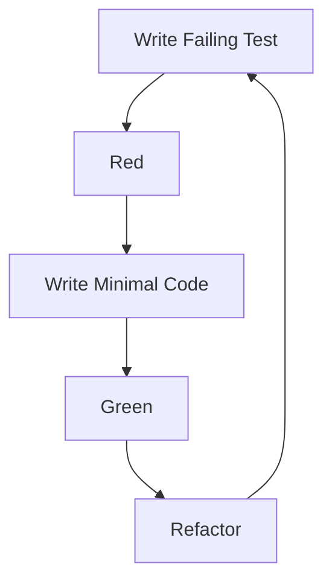
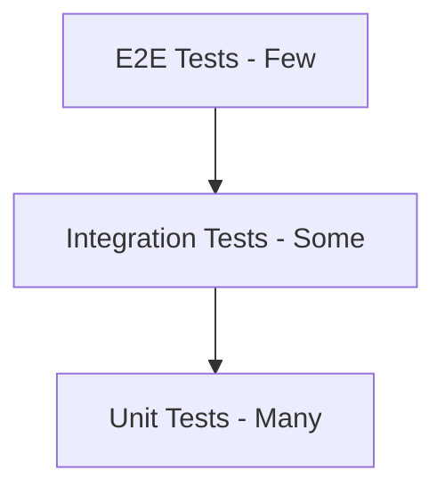
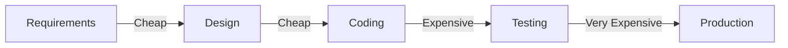

# 79 - Software Testing: Interview Preparation Guide

## Table of Contents
- [Introduction](#introduction)
- [Learning Roadmap](#learning-roadmap)
- [Theory Notes](#theory-notes)
- [Key Concepts](#key-concepts)
- [FAQ (35+ Q&A)](#faq-35-qa)
- [Hands-on Practice](#hands-on-practice)
- [FAANG Questions](#faang-questions)
- [Common Mistakes](#common-mistakes)
- [Best Practices](#best-practices)
- [Cheat Sheet](#cheat-sheet)
- [Flash Cards (30)](#flash-cards-30)
- [Mind Map](#mind-map)
- [Mermaid Diagrams](#mermaid-diagrams)
- [Code Examples](#code-examples)
- [Projects](#projects)
- [Resources](#resources)
- [Checklist](#checklist)
- [Revision Plans](#revision-plans)
- [Mock Interviews](#mock-interviews)
- [Difficulty Rating](#difficulty-rating)
- [Summary](#summary)

---

## Introduction

Software Testing is the process of evaluating software to identify defects and ensure it meets requirements. It encompasses various testing levels, types, and methodologies. Strong testing skills ensure software reliability, performance, and user satisfaction.

Testing is not just about finding bugs; it is about preventing them. Understanding testing principles, methodologies, and best practices is essential for all software engineers, not just QA professionals.

A quality-focused mindset permeates the entire software development lifecycle. From writing unit tests alongside code to conducting thorough system testing before release, testing is a continuous activity that ensures software delivers value reliably.

---

## Learning Roadmap

### Phase 1: Testing Fundamentals (Week 1-2)
- Testing principles and philosophy
- Testing levels (unit, integration, system, acceptance)
- Testing types (functional, non-functional)
- Test case design

### Phase 2: Unit Testing (Week 3-4)
- Unit testing frameworks (JUnit, pytest, Jest)
- Test-Driven Development (TDD)
- Mocking and stubbing
- Code coverage

### Phase 3: Integration and System Testing (Week 5-6)
- Integration testing strategies
- System testing
- Acceptance testing
- End-to-end testing

### Phase 4: Advanced Testing (Week 7-8)
- Behavior-Driven Development (BDD)
- Performance testing basics
- Security testing basics
- Test automation strategy

### Phase 5: Quality Engineering (Week 9-12)
- Quality metrics and measurement
- Risk-based testing
- Test management
- Continuous testing
- Test architecture

---

## Theory Notes

### Testing Principles
1. **Exhaustive testing is impossible**: Test risk-based, not everything
2. **Defect clustering**: Most bugs found in few modules (Pareto principle)
3. **Pesticide paradox**: Repeating same tests finds fewer bugs over time
4. **Testing shows presence, not absence**: Testing proves bugs exist, not that they don't
5. **Context-dependent**: Testing approach varies by project
6. **Fallacy of independence**: Developers should test their own code
7. **Early testing**: Find bugs earlier when they are cheaper to fix

### Testing Levels
- **Unit Testing**: Test individual functions/methods in isolation
- **Integration Testing**: Test interactions between components
- **System Testing**: Test complete system against requirements
- **Acceptance Testing**: Verify system meets business requirements (UAT)

### Testing Types
**Functional**: Does the software do what it should?
- Unit, integration, system, acceptance, regression, smoke, sanity

**Non-Functional**: How well does it perform?
- Performance, load, stress, security, usability, accessibility, compatibility

### Test-Driven Development (TDD)
Red-Green-Refactor cycle:
1. **Red**: Write failing test for new functionality
2. **Green**: Write minimal code to make test pass
3. **Refactor**: Improve code while keeping tests green

Benefits: Better design, fewer defects, living documentation, confidence in refactoring.

### Behavior-Driven Development (BDD)
Writing tests in natural language (Given/When/Then):
```
Given I am on the login page
When I enter valid credentials
And I click login
Then I should see the dashboard
```
Bridges business and technical teams. Tests serve as living documentation.

### Mocking and Stubbing
- **Mock**: Verifies that specific methods are called with specific arguments
- **Stub**: Returns predefined responses without verification
- **Fake**: Simplified working implementation (in-memory database)
- **Spy**: Records calls for later verification

### Code Coverage
Percentage of code exercised by tests:
- **Line coverage**: Percentage of lines executed
- **Branch coverage**: Percentage of branches (if/else) executed
- **Function coverage**: Percentage of functions called
- Aim for meaningful coverage, not just high numbers

### Risk-Based Testing
Prioritizing testing effort based on:
- Business impact of failure
- Likelihood of defects
- Technical complexity
- Change frequency
- Customer-facing nature

### Testing Pyramid
```
         /\
        /E2E\      (Few, slow, expensive)
       /------\
      /Integra-\   (Some, medium)
     /----------\
    /    Unit    \  (Many, fast, cheap)
   /--------------\
```

### Mutation Testing
Introducing small code changes (mutants) to evaluate test quality:
- Each mutant represents a potential bug
- If tests catch the mutant, they are effective
- Mutation score = caught mutants / total mutants
- High mutation score means tests are thorough

### Exploratory Testing
Simultaneous learning, test design, and execution:
- No predefined scripts
- Tester explores the application freely
- Requires domain knowledge and creativity
- Finds issues scripted tests miss
- Complements automated testing

---

## Key Concepts

| Concept | Description |
|---------|-------------|
| TDD | Test-First development with Red-Green-Refactor |
| BDD | Given/When/Then natural language tests |
| Mock | Object simulating dependencies for testing |
| Stub | Predefined responses replacing real dependencies |
| Coverage | Percentage of code exercised by tests |
| Regression | Ensuring changes do not break existing functionality |
| Smoke Test | Quick verification of basic functionality |
| Sanity Test | Focused testing after minor changes |
| Test Doubles | Generic term for mocks, stubs, fakes |
| Shift Left | Testing earlier in development lifecycle |
| Mutation Testing | Introducing code changes to test test quality |
| Boundary Value | Testing at input range edges |
| Equivalence Partition | Dividing inputs into groups treated identically |

---

## FAQ (35+ Q&A)

### Q1: What is the difference between unit and integration tests?
**A:** Unit tests test individual components in isolation with mocked dependencies. Integration tests test interactions between real components. Unit tests are fast and numerous; integration tests are slower and fewer.

### Q2: What is TDD?
**A:** Test-Driven Development: write failing test first (Red), write code to pass (Green), refactor. Produces better design, fewer bugs, and living documentation. Requires discipline but improves code quality.

### Q3: What is the difference between a mock and a stub?
**A:** A stub provides predefined responses. A mock verifies that specific interactions occur. Stubs are state-based; mocks are behavior-based. Both isolate tests from dependencies.

### Q4: What is BDD?
**A:** Behavior-Driven Development writes tests in Given/When/Then format using natural language. Bridges technical and business teams. Tests serve as living documentation. Tools: Cucumber, SpecFlow.

### Q5: What is test coverage?
**A:** Percentage of code exercised by tests. Types: line, branch, function coverage. High coverage is good but does not guarantee quality. Aim for meaningful coverage of critical paths.

### Q6: What is regression testing?
**A:** Re-running existing tests after changes to ensure nothing is broken. Critical for maintaining quality as codebase grows. Automated regression testing is a key benefit of test automation.

### Q7: What is the test pyramid?
**A:** Strategy with many unit tests (fast, cheap), some integration tests, and few E2E tests (slow, expensive). Ensures fast feedback and comprehensive coverage without over-investing in slow tests.

### Q8: What is smoke testing?
**A:** Quick tests verifying basic critical functionality after deployment. If smoke tests fail, no further testing needed. Example: application starts, login works, key pages load.

### Q9: What is a test case?
**A:** Set of conditions, inputs, and expected results for a specific test. Includes: objective, preconditions, steps, expected results, and actual results. Foundation of systematic testing.

### Q10: What is the difference between verification and validation?
**A:** Verification: Are we building the product right? (meeting specifications). Validation: Are we building the right product? (meeting user needs). Both are essential.

### Q11: What is white-box vs black-box testing?
**A:** White-box: tests with knowledge of internal code structure. Black-box: tests without knowledge of internals, based on requirements. White-box for unit testing; black-box for system testing.

### Q12: What is exploratory testing?
**A:** Simultaneous learning, test design, and execution. Testers explore the application freely to find issues not covered by scripted tests. Requires skill and domain knowledge.

### Q13: What is boundary value analysis?
**A:** Testing at boundaries of input ranges where defects are most likely. If valid range is 1-100, test 0, 1, 2, 99, 100, 101. Errors often occur at edges.

### Q14: What is equivalence partitioning?
**A:** Dividing inputs into groups expected to be treated the same. Test one value from each partition instead of all values. Reduces test count while maintaining coverage.

### Q15: What is mutation testing?
**A:** Introducing small changes (mutations) to code and checking if tests detect them. Measures test quality, not just coverage. High mutation score means tests effectively detect changes.

### Q16: What is test-driven development Red-Green-Refactor?
**A:** Red: write failing test. Green: write minimal code to pass. Refactor: improve code. Cycle repeats for each feature. Produces clean, tested code incrementally.

### Q17: What is acceptance testing?
**A:** Testing whether system meets business requirements and is acceptable for delivery. Can be manual (UAT by business users) or automated (acceptance tests). Last testing level before release.

### Q18: What is continuous testing?
**A:** Running tests automatically throughout development lifecycle (CI/CD). Tests execute on every commit, providing rapid feedback. Shift-left approach catching bugs early.

### Q19: What is a test fixture?
**A:** Fixed state/data used as baseline for tests. Includes setup (create test data, start services) and teardown (cleanup). Ensures consistent test execution. JUnit: @Before/@After. pytest: fixtures.

### Q20: What is pair testing?
**A:** Two people testing together: one operates, one observes and thinks. Combines perspectives for better coverage. Knowledge sharing and mentoring opportunity.

### Q21: What is the difference between sanity and smoke testing?
**A:** Smoke testing: broad verification that critical paths work after deployment. Sanity testing: focused verification that specific changes work correctly. Smoke is first; sanity is after bug fixes.

### Q22: What is test-driven design?
**A:** Software design approach where tests drive the design of code. Produces loosely coupled, highly testable code. Tests define interfaces before implementation. Complements TDD.

### Q23: What is a code coverage threshold?
**A:** Minimum percentage of code that must be covered by tests. Enforced in CI/CD pipelines. Common thresholds: 80% line coverage. Balance between coverage goals and test quality.

### Q24: What is property-based testing?
**A:** Testing approach where properties (invariants) are defined and the framework generates test cases. Finds edge cases that example-based tests miss. Tools: Hypothesis (Python), QuickCheck.

### Q25: What is contract testing?
**A:** Verifying that API provider and consumer agree on interface. Ensures services communicate correctly without full integration testing. Important for microservices.

### Q26: What is the testing diamond?
**A:** Alternative to test pyramid emphasizing more integration tests. Suitable for microservices where integration testing provides more value. More integration, fewer unit tests.

### Q27: What is the difference between test-first and test-along?
**A:** Test-first: write tests before implementation (TDD). Test-along: write tests alongside or shortly after implementation. Test-first produces better design; test-along is more practical in some contexts.

### Q28: What is a test strategy?
**A:** High-level document defining testing approach: what to test, how to test, when to test, who tests, and what tools to use. Aligns testing with project goals and risk profile.

### Q29: What is a test plan?
**A:** Detailed document specifying test scope, schedule, resources, and activities. Defines test cases, environment requirements, entry/exit criteria, and risk mitigation.

### Q30: What is the difference between QA and QC?
**A:** Quality Assurance: process-focused, preventing defects through process improvement. Quality Control: product-focused, finding defects through testing. QA is proactive; QC is reactive.

### Q31: What is a defect life cycle?
**A:** States a defect moves through: New, Assigned, Open, Fixed, Verified, Closed. May also include Deferred, Reopened. Tracks defect resolution from discovery to closure.

### Q32: What is test traceability?
**A:** Mapping between requirements, test cases, and defects. Ensures all requirements are tested and defects are linked to requirements. Maintains quality coverage visibility.

### Q33: What is shift-left testing?
**A:** Moving testing earlier in development lifecycle. Involves developers in testing, automating tests from the start, and catching defects earlier when they are cheaper to fix.

### Q34: What is the difference between functional and non-functional requirements?
**A:** Functional: what the system should do (features, behavior). Non-functional: how well the system should perform (performance, security, usability). Both need testing.

### Q35: What is test management?
**A:** Organizing and controlling testing activities: planning, designing tests, executing, tracking defects, reporting. Tools: TestRail, Zephyr, qTest. Ensures systematic quality assurance.

---

## Hands-on Practice

### Unit Testing (pytest)
```python
import pytest

def add(a, b):
    return a + b

def test_add_positive():
    assert add(2, 3) == 5

def test_add_negative():
    assert add(-1, -1) == -2

def test_add_zero():
    assert add(5, 0) == 5

@pytest.mark.parametrize("a,b,expected", [
    (1, 2, 3),
    (-1, 1, 0),
    (0, 0, 0),
])
def test_add_parametrized(a, b, expected):
    assert add(a, b) == expected
```

### TDD Example
```python
# Red: Write failing test
def test_string_reversal():
    assert reverse("hello") == "olleh"

# Green: Write minimal code
def reverse(s):
    return s[::-1]

# Refactor: (already clean)

# Red: Another failing test
def test_empty_string():
    assert reverse("") == ""
# Green: Already passes (edge case covered)
```

### Mocking Example
```python
from unittest.mock import Mock, patch

def get_user_data(user_id):
    response = api_call(f"/users/{user_id}")
    return response.json()

# Test with mock
@patch('__main__.api_call')
def test_get_user_data(mock_api):
    mock_api.return_value.json.return_value = {"name": "John"}
    result = get_user_data(1)
    mock_api.assert_called_once_with("/users/1")
    assert result == {"name": "John"}
```

### BDD Style Test
```gherkin
Feature: User Login

  Scenario: Successful login
    Given I am on the login page
    When I enter username "admin"
    And I enter password "password123"
    And I click the login button
    Then I should be redirected to the dashboard
    And I should see "Welcome, Admin"

  Scenario: Failed login
    Given I am on the login page
    When I enter username "admin"
    And I enter password "wrong"
    And I click the login button
    Then I should see "Invalid credentials"
```

### Boundary Value Analysis
```python
def validate_age(age):
    if age < 0 or age > 150:
        raise ValueError("Invalid age")
    return True

# Boundary value tests
def test_age_boundaries():
    assert validate_age(0) == True       # Lower boundary
    assert validate_age(1) == True       # Just above lower
    assert validate_age(150) == True     # Upper boundary
    assert validate_age(149) == True     # Just below upper

def test_age_invalid():
    with pytest.raises(ValueError):
        validate_age(-1)                 # Below lower
    with pytest.raises(ValueError):
        validate_age(151)               # Above upper
```

---

## FAANG Questions

1. **Google**: How would you test a search engine? What types of tests would you write?
2. **Microsoft**: Design a testing strategy for a microservices architecture.
3. **Amazon**: How would you implement TDD for a complex distributed system?
4. **Meta**: Write test cases for a Facebook News Feed ranking algorithm.
5. **Google**: How would you test a real-time collaborative editing system?
6. **Microsoft**: Design a test strategy ensuring 99.99% uptime.
7. **Amazon**: How would you test an API that handles 10,000 requests/second?
8. **Meta**: Write test cases for a chat application's message delivery system.
9. **Google**: How would you test machine learning model predictions?
10. **Netflix**: Design a testing strategy for a recommendation engine.

---

## Common Mistakes

1. Testing after coding instead of before (TDD)
2. Writing tests that are too tightly coupled to implementation
3. Ignoring edge cases and error paths
4. Testing implementation details instead of behavior
5. Not maintaining tests
6. High test coverage but low-quality tests
7. Skipping integration testing
8. Not testing non-functional requirements
9. Over-reliance on manual testing
10. Not involving developers in testing
11. Writing tests without clear assertions
12. Ignoring test readability
13. Not using test doubles appropriately
14. Skipping test data cleanup
15. Not considering test performance

---

## Best Practices

1. Follow the testing pyramid
2. Practice TDD when possible
3. Write tests before fixing bugs (test proves the bug)
4. Keep tests simple and focused
5. Use meaningful test names
6. Test edge cases and error paths
7. Mock external dependencies
8. Maintain tests as production code
9. Review test code in PRs
10. Measure and track test metrics
11. Practice BDD for business-critical features
12. Continuously improve test strategy
13. Use parametrized tests for data-driven scenarios
14. Implement proper test fixtures and teardown
15. Shift testing left in development lifecycle

---

## Cheat Sheet

### Test Types Guide
| Type | What | When | Speed |
|------|------|------|-------|
| Unit | Individual functions | During development | Fast |
| Integration | Component interactions | After unit tests | Medium |
| System | Complete system | After integration | Slow |
| Acceptance | Business requirements | Before release | Slow |
| Regression | Existing functionality | After changes | Varies |
| Smoke | Critical paths | After deployment | Fast |
| Sanity | Specific changes | After bug fixes | Medium |
| Performance | Speed/scalability | Before release | Slow |

### Testing Techniques
| Technique | Input Strategy |
|-----------|---------------|
| Boundary Value | Test at range edges |
| Equivalence Partition | Test one from each group |
| Decision Table | All condition combinations |
| State Transition | All state changes |
| Pairwise | All parameter combinations |
| Error Guessing | Based on experience |

### Key Testing Formulas
| Metric | Formula |
|--------|---------|
| Coverage | (Lines tested / Total lines) * 100 |
| Defect Density | Defects / KLOC |
| Pass Rate | (Passed tests / Total tests) * 100 |
| Defect Removal Efficiency | (Defects found pre-release / Total defects) * 100 |
| Mean Time to Detection | Total detection time / Number of defects |

---

## Flash Cards (30)

**Card 1:** Q: Testing principle 1? A: Exhaustive testing is impossible; test based on risk.

**Card 2:** Q: What is TDD? A: Test-First development: Red (fail), Green (pass), Refactor.

**Card 3:** Q: Mock vs stub? A: Mock verifies interactions; stub provides predefined responses.

**Card 4:** Q: Test pyramid? A: Many unit, some integration, few E2E tests.

**Card 5:** Q: What is BDD? A: Given/When/Then natural language test format.

**Card 6:** Q: Code coverage? A: Percentage of code exercised by tests.

**Card 7:** Q: Regression testing? A: Re-running tests to ensure changes do not break existing features.

**Card 8:** Q: Smoke vs sanity? A: Smoke = basic functionality; Sanity = focused after minor changes.

**Card 9:** Q: White-box vs black-box? A: White-box knows internals; black-box tests from user perspective.

**Card 10:** Q: What is boundary value analysis? A: Testing at input range edges where defects cluster.

**Card 11:** Q: Equivalence partitioning? A: Dividing inputs into groups treated identically.

**Card 12:** Q: What is a test fixture? A: Fixed state/data used as baseline for consistent testing.

**Card 13:** Q: Verification vs validation? A: Verification = right product built; Validation = right product for users.

**Card 14:** Q: Continuous testing? A: Running tests automatically throughout development lifecycle.

**Card 15:** Q: What is mutation testing? A: Introducing code mutations to test if tests detect them.

**Card 16:** Q: What is exploratory testing? A: Simultaneous learning, design, and execution without scripts.

**Card 17:** Q: What is acceptance testing? A: Verifying system meets business requirements before delivery.

**Card 18:** Q: What is test doubles? A: Generic term for mocks, stubs, fakes, spies.

**Card 19:** Q: What is shift-left? A: Testing earlier in development lifecycle for earlier bug detection.

**Card 20:** Q: What is pair testing? A: Two people testing together combining perspectives.

**Card 21:** Q: What is property-based testing? A: Testing properties with auto-generated test cases.

**Card 22:** Q: What is defect life cycle? A: States: New, Assigned, Open, Fixed, Verified, Closed.

**Card 23:** Q: QA vs QC? A: QA = process-focused prevention; QC = product-focused detection.

**Card 24:** Q: What is test traceability? A: Mapping between requirements, tests, and defects.

**Card 25:** Q: What is test management? A: Organizing and controlling testing activities and artifacts.

**Card 26:** Q: What is contract testing? A: Verifying API agreements between services.

**Card 27:** Q: What is the testing diamond? A: Alternative to pyramid with more integration tests.

**Card 28:** Q: What is test-first design? A: Tests drive code design, producing testable architecture.

**Card 29:** Q: What is code coverage threshold? A: Minimum coverage percentage enforced in CI/CD.

**Card 30:** Q: What is a test strategy? A: High-level document defining testing approach and scope.

---

## Mind Map

```
Testing
├── Levels
│   ├── Unit
│   ├── Integration
│   ├── System
│   └── Acceptance
├── Types
│   ├── Functional
│   ├── Non-Functional
│   ├── Regression
│   └── Smoke/Sanity
├── Methodologies
│   ├── TDD
│   ├── BDD
│   └── Exploratory
├── Techniques
│   ├── Boundary Value
│   ├── Equivalence Partition
│   └── Pairwise
├── Test Doubles
│   ├── Mocks
│   ├── Stubs
│   ├── Fakes
│   └── Spies
└── Strategy
    ├── Test Pyramid
    ├── Risk-Based
    └── Coverage Goals
```

---

## Mermaid Diagrams

### TDD Cycle


### Testing Pyramid


### Defect Detection Cost


---

## Projects

1. **Test Suite**: Write comprehensive tests for existing open-source project
2. **TDD Project**: Build feature using pure TDD methodology
3. **BDD Framework**: Set up Cucumber/SpecFlow for a web application
4. **Test Coverage**: Achieve 90%+ meaningful coverage for a codebase
5. **Mutation Testing**: Implement mutation testing and improve test quality
6. **Property-Based Tests**: Implement property-based testing with Hypothesis
7. **Test Framework**: Build custom test framework from scratch
8. **Performance Tests**: Implement load testing for a web application

---

## Resources

- **Books**: "Test Driven Development" (Kent Beck), "xUnit Test Patterns" (Gerard Meszaros), "Working Effectively with Legacy Code" (Michael Feathers)
- **Courses**: TDD courses on Udemy, Testing practices on Coursera
- **Tools**: pytest, JUnit, Jest, Mockito, Cucumber, Hypothesis
- **Practice**: katas (Bowling, Password, Money), Codewars
- **YouTube**: Testing Show, Test Guild
- **Community**: Ministry of Testing, r/QualityAssurance

---

## Checklist

- [ ] Testing principles
- [ ] Testing levels and types
- [ ] TDD methodology
- [ ] BDD with Given/When/Then
- [ ] Mocking and stubbing
- [ ] Test coverage understanding
- [ ] Test case design techniques
- [ ] Test doubles (mock, stub, fake)
- [ ] Test fixture setup/teardown
- [ ] Risk-based testing
- [ ] Test automation strategy
- [ ] Mutation testing awareness
- [ ] Property-based testing awareness
- [ ] Test management practices
- [ ] Continuous testing in CI/CD

---

## Revision Plans

### Week 1-2: Foundations
- Testing principles and philosophy
- Testing levels and types
- Test case design techniques

### Week 3-4: Unit Testing
- Frameworks (pytest, JUnit, Jest)
- TDD methodology
- Mocking and stubbing

### Week 5-6: Integration/System
- Integration testing strategies
- System and acceptance testing
- E2E testing

### Week 7-8: Advanced
- BDD with Cucumber
- Performance testing basics
- Mutation testing

### Final Week: Strategy
- Test strategy development
- Quality metrics
- Mock interviews

---

## Mock Interviews

### Round 1: Concepts
1. Explain the testing pyramid and its rationale
2. What is the difference between TDD and BDD?
3. When would you use a mock vs a stub?

### Round 2: Design
1. How would you test a search engine?
2. Write test cases for a login page
3. Design a test strategy for microservices

### Round 3: Strategy
1. A team has 100% code coverage but many production bugs. What is wrong?
2. How would you improve testing in a legacy codebase?
3. Design a testing strategy ensuring 99.99% uptime

---

## Difficulty Rating

| Topic | Difficulty | Frequency |
|-------|-----------|-----------|
| Testing Principles | Easy | Very High |
| Unit Testing | Medium | Very High |
| TDD | Medium | High |
| Mocking | Medium | High |
| Integration Testing | Medium | High |
| BDD | Medium | Medium |
| Test Coverage | Easy-Medium | High |
| Test Strategy | Medium-High | Medium |
| Mutation Testing | Hard | Growing |
| Property-Based Testing | Hard | Growing |

---

## Summary

Software testing interviews test understanding of testing principles, methodologies (TDD, BDD), and practical testing skills. Master unit testing, understand the test pyramid, know when and how to mock, and be able to design comprehensive test strategies. Testing is a mindset: think about edge cases, failure modes, and user scenarios. The best developers write tests as naturally as they write code. Understanding both the technical and strategic aspects of testing demonstrates comprehensive quality engineering expertise.
