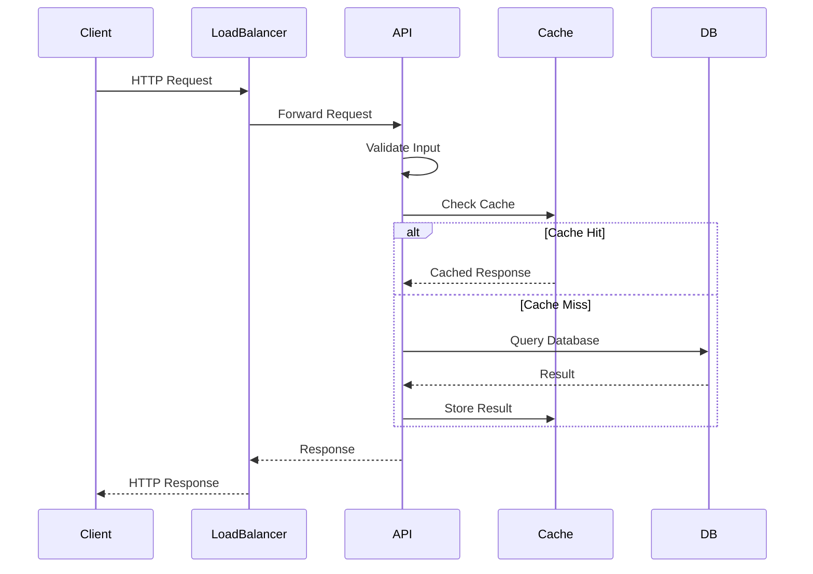
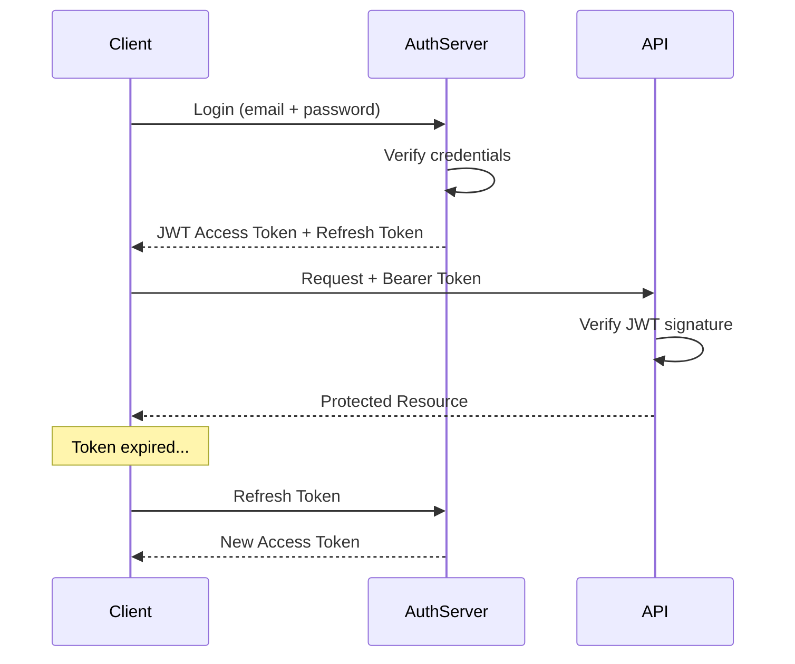
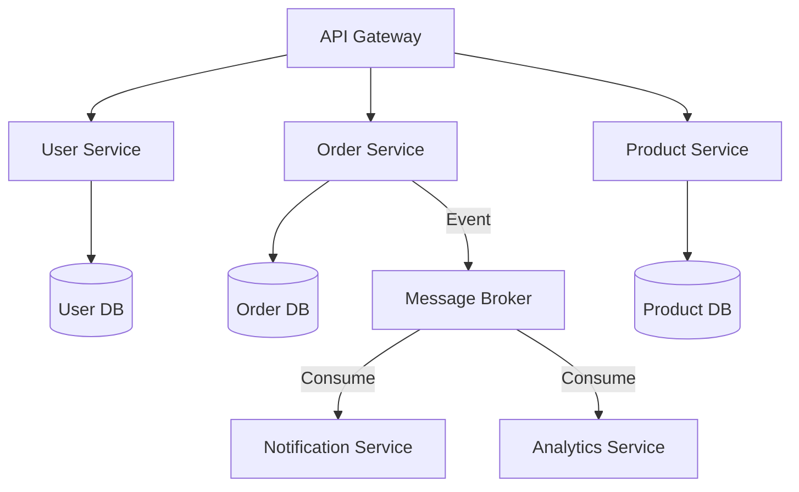
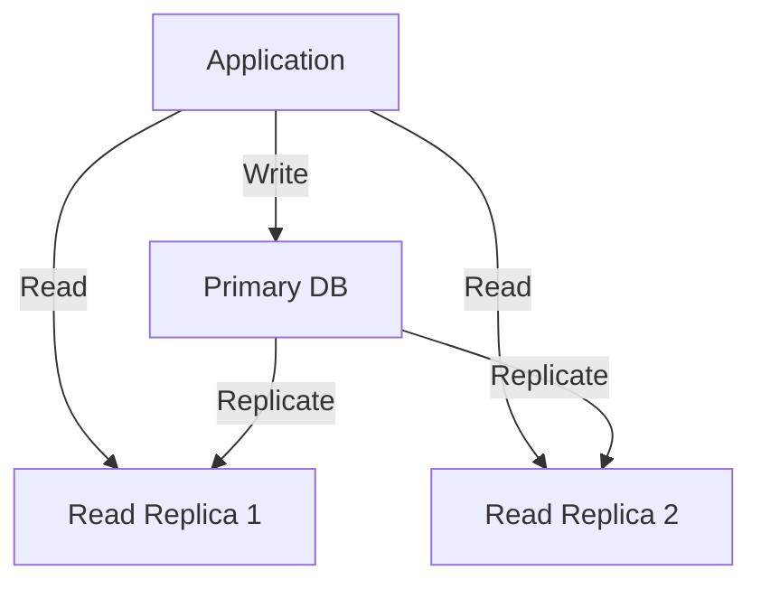

# 82 - Backend Development

## Introduction

Backend development is the server-side of software applications — the engine room that handles data storage, business logic, authentication, API design, and everything that happens behind the scenes. A strong backend engineer understands distributed systems, database design, security, scalability, and the trade-offs between different architectural approaches.

This guide covers REST APIs, GraphQL, authentication/authorization, database design, caching, message queues, background jobs, rate limiting, logging, microservices basics, and common backend interview questions. Whether you're building a monolithic API or designing a distributed microservices architecture, these concepts are universal.

---

## Learning Roadmap

### Phase 1: Foundations (Weeks 1-4)
- HTTP protocol and methods (GET, POST, PUT, PATCH, DELETE)
- RESTful API design principles
- Status codes and error handling
- SQL fundamentals (SELECT, JOIN, subqueries, indexes)
- Basic authentication (API keys, Basic Auth)
- Command line and Linux basics

### Phase 2: Core Skills (Weeks 5-8)
- Database design (normalization, relationships, indexing)
- ORM usage (SQLAlchemy, Prisma, Hibernate)
- JWT and OAuth 2.0
- Input validation and sanitization
- File upload handling
- Unit and integration testing

### Phase 3: Scalability (Weeks 9-12)
- Caching strategies (Redis, Memcached)
- Database optimization (query optimization, connection pooling)
- Message queues (RabbitMQ, Kafka, SQS)
- Rate limiting and throttling
- Load balancing
- Horizontal vs vertical scaling

### Phase 4: Architecture (Weeks 13-16)
- Microservices vs monolith
- API gateway patterns
- Event-driven architecture
- Domain-Driven Design (DDD)
- Observability (logging, metrics, tracing)
- CI/CD for backend services

---

## Theory Notes

### REST API Design

#### REST Principles
- **Stateless**: Each request contains all information needed to process it
- **Client-Server**: Separation of concerns between UI and data storage
- **Cacheable**: Responses should indicate cacheability
- **Uniform Interface**: Consistent resource identification and manipulation
- **Layered System**: Architecture composed of hierarchical layers

#### Resource Naming
```
GET    /api/v1/users              — List users
POST   /api/v1/users              — Create user
GET    /api/v1/users/:id          — Get user
PUT    /api/v1/users/:id          — Update user (full)
PATCH  /api/v1/users/:id          — Update user (partial)
DELETE /api/v1/users/:id          — Delete user
GET    /api/v1/users/:id/posts    — Get user's posts
POST   /api/v1/users/:id/posts    — Create post for user
```

#### Status Codes
```
2xx Success:
  200 OK                    — Request succeeded
  201 Created               — Resource created
  204 No Content            — Success, no response body
  202 Accepted              — Async operation accepted

3xx Redirection:
  301 Moved Permanently     — Resource moved permanently
  304 Not Modified          — Use cached version

4xx Client Error:
  400 Bad Request           — Invalid request body/params
  401 Unauthorized          — Authentication required
  403 Forbidden             — Authenticated but not authorized
  404 Not Found             — Resource doesn't exist
  409 Conflict              — Resource state conflict
  422 Unprocessable Entity  — Validation error
  429 Too Many Requests     — Rate limit exceeded

5xx Server Error:
  500 Internal Server Error — Unhandled server error
  502 Bad Gateway           — Upstream service error
  503 Service Unavailable   — Server temporarily down
```

### GraphQL

#### Schema Definition
```graphql
type User {
  id: ID!
  name: String!
  email: String!
  posts: [Post!]!
  createdAt: DateTime!
}

type Post {
  id: ID!
  title: String!
  content: String!
  author: User!
  comments: [Comment!]!
  published: Boolean!
}

type Query {
  user(id: ID!): User
  users(limit: Int, offset: Int): [User!]!
  post(id: ID!): Post
}

type Mutation {
  createUser(input: CreateUserInput!): User!
  updateUser(id: ID!, input: UpdateUserInput!): User!
  deletePost(id: ID!): Boolean!
}

input CreateUserInput {
  name: String!
  email: String!
}
```

#### REST vs GraphQL
| Aspect | REST | GraphQL |
|--------|------|---------|
| Endpoints | Multiple endpoints | Single endpoint |
| Data fetching | Fixed structure per endpoint | Client specifies exact fields |
| Over-fetching | Common | Eliminated |
| Under-fetching | Common (N+1 problem) | Eliminated |
| Caching | HTTP caching built-in | Requires custom caching |
| File uploads | Native support | Requires additional setup |
| Learning curve | Lower | Higher |
| Versioning | URL versioning (v1, v2) | Schema evolution |

### Authentication & Authorization

#### JWT (JSON Web Tokens)
```
Header.Payload.Signature

Header: { "alg": "HS256", "typ": "JWT" }
Payload: { "sub": "1234567890", "name": "John", "exp": 1716239022 }
Signature: HMAC-SHA256(base64(header) + "." + base64(payload), secret)
```

#### OAuth 2.0 Flows
- **Authorization Code**: Server-side apps (most secure)
- **Authorization Code + PKCE**: SPAs and mobile apps
- **Client Credentials**: Machine-to-machine
- **Device Code**: Smart TVs, IoT devices
- **Implicit**: Deprecated (use PKCE instead)

#### Password Hashing
- Use **bcrypt** or **Argon2** (never MD5, SHA-256 for passwords)
- Include salt automatically (bcrypt handles this)
- Use appropriate cost factor (bcrypt: 12+ rounds)

### Database Design

#### Normalization
- **1NF**: Each column contains atomic values; no repeating groups
- **2NF**: In 1NF + no partial dependencies (all non-key columns depend on entire primary key)
- **3NF**: In 2NF + no transitive dependencies (non-key columns don't depend on each other)

#### Indexing
```sql
-- B-tree index (default, good for equality and range)
CREATE INDEX idx_users_email ON users(email);

-- Composite index (order matters!)
CREATE INDEX idx_posts_author_date ON posts(author_id, created_at DESC);

-- Partial index (index only subset of rows)
CREATE INDEX idx_active_users ON users(email) WHERE active = true;

-- Covering index (includes all columns needed by a query)
CREATE INDEX idx_covering ON users(email, name) INCLUDE (avatar_url);
```

#### Query Optimization
- Use `EXPLAIN ANALYZE` to understand query plans
- Avoid SELECT * — only select needed columns
- Add indexes for columns in WHERE, JOIN, and ORDER BY
- Use LIMIT for pagination
- Avoid N+1 queries (use JOIN or eager loading)
- Use connection pooling

### Caching

#### Caching Strategies
- **Cache-Aside (Lazy Loading)**: App checks cache first, falls back to DB
- **Write-Through**: Write to cache and DB simultaneously
- **Write-Behind (Write-Back)**: Write to cache, async write to DB
- **Read-Through**: Cache fetches from DB on miss

#### Redis Use Cases
- Session storage
- Rate limiting counters
- Leaderboards (Sorted Sets)
- Real-time pub/sub
- Job queues
- Caching hot data
- Distributed locks

### Message Queues

#### When to Use
- Decoupling services
- Async processing (email, image processing)
- Load leveling (handle traffic spikes)
- Event sourcing
- Work distribution

#### Patterns
- **Point-to-Point**: One message processed by one consumer
- **Pub/Sub**: One message broadcast to multiple consumers
- **Request-Reply**: Correlated request/response messages
- **Dead Letter Queue**: Messages that fail processing

### Rate Limiting

#### Algorithms
- **Fixed Window**: Count requests in fixed time periods
- **Sliding Window Log**: Timestamp-based, most accurate
- **Sliding Window Counter**: Hybrid approach
- **Token Bucket**: Tokens added at fixed rate, consumed per request
- **Leaky Bucket**: Requests processed at constant rate

### Background Jobs

#### Job Types
- **Immediate**: Process as soon as possible
- **Delayed**: Process after a specified delay
- **Scheduled**: Process at specific times (cron-like)
- **Recurring**: Repeat on a schedule

#### Failure Handling
- Retry with exponential backoff
- Dead letter queues for permanently failed jobs
- Idempotency keys for safe retries
- Circuit breakers for dependent services

---

## Key Concepts

### API Design Patterns

#### Pagination
```json
// Cursor-based (preferred for large datasets)
{
  "data": [...],
  "pagination": {
    "next_cursor": "eyJpZCI6MTAwfQ==",
    "has_more": true
  }
}

// Offset-based (simpler but less performant)
{
  "data": [...],
  "pagination": {
    "page": 2,
    "per_page": 20,
    "total": 1500,
    "total_pages": 75
  }
}
```

#### Versioning
```
/api/v1/users           — URL versioning (most common)
/api/users (Accept: application/vnd.myapp.v1+json) — Header versioning
```

#### Error Response Format
```json
{
  "error": {
    "code": "VALIDATION_ERROR",
    "message": "Invalid input data",
    "details": [
      {
        "field": "email",
        "message": "Must be a valid email address"
      },
      {
        "field": "password",
        "message": "Must be at least 8 characters"
      }
    ],
    "request_id": "req_abc123"
  }
}
```

### Database Connection Pooling
Connection pooling reuses database connections instead of creating new ones for each request, reducing overhead:
- **min_connections**: Minimum idle connections
- **max_connections**: Maximum total connections
- **idle_timeout**: Close idle connections after this time
- **connection_timeout**: Max time to wait for a connection

### Health Checks
```json
// Liveness check — is the service running?
GET /health/live → 200 OK

// Readiness check — is the service ready to handle requests?
GET /health/ready → 200 OK or 503 Service Unavailable

// Detailed health
GET /health → {
  "status": "healthy",
  "database": "connected",
  "cache": "connected",
  "uptime": 86400
}
```

---

## FAQ (20+ Q&A)

### Q1: What is the difference between authentication and authorization?
**A:** Authentication verifies identity (who you are). Authorization determines permissions (what you can do). Authentication happens first; authorization uses the authenticated identity to control access.

### Q2: What is the N+1 query problem?
**A:** N+1 occurs when you fetch a list of N items, then make N additional queries for related data. For example, fetching 100 posts then 100 separate queries for each post's author. Solution: use JOINs, eager loading, or data loaders.

### Q3: What is the CAP theorem?
**A:** CAP theorem states a distributed system can guarantee only two of three properties: **Consistency** (every read gets latest write), **Availability** (every request gets a response), **Partition Tolerance** (system works despite network failures). In practice, partition tolerance is required, so systems choose between CP and AP.

### Q4: What is idempotency and why does it matter in APIs?
**A:** An idempotent operation produces the same result regardless of how many times it's called. PUT and DELETE should be idempotent. This matters because clients may retry failed requests, and the server must handle duplicates gracefully.

### Q5: What is the difference between SQL and NoSQL databases?
**A:** SQL databases are relational with fixed schemas, ACID transactions, and JOIN support. NoSQL databases are non-relational with flexible schemas, horizontal scaling, and eventual consistency. Use SQL for complex queries and transactions; NoSQL for flexibility and scale.

### Q6: What is connection pooling?
**A:** Connection pooling maintains a pool of reusable database connections. Instead of opening/closing a connection per request (expensive), the application borrows and returns connections from the pool. This reduces latency and database load.

### Q7: What is eventual consistency?
**A:** Eventual consistency means that after a write, all replicas will eventually converge to the same value, but reads may temporarily return stale data. It's a trade-off for higher availability and partition tolerance in distributed systems.

### Q8: What is a circuit breaker pattern?
**A:** A circuit breaker monitors calls to an external service. When failures exceed a threshold, the circuit "opens" and subsequent calls fail fast without hitting the service. After a timeout, the circuit "half-opens" to test if the service has recovered.

### Q9: What is the difference between REST and GraphQL?
**A:** REST uses multiple endpoints with fixed data structures. GraphQL uses a single endpoint where clients specify exactly what data they need. REST is simpler; GraphQL eliminates over-fetching and under-fetching but adds complexity.

### Q10: What is database sharding?
**A:** Sharding horizontally partitions data across multiple database servers. Each shard contains a subset of data. It enables scaling beyond a single server but adds complexity for joins, transactions, and rebalancing.

### Q11: What is the purpose of a load balancer?
**A:** A load balancer distributes incoming requests across multiple servers. It improves availability, scalability, and fault tolerance. Algorithms include round-robin, least connections, IP hash, and weighted distribution.

### Q12: What is a reverse proxy?
**A:** A reverse proxy sits between clients and servers, forwarding client requests to appropriate backend servers. Benefits: SSL termination, caching, compression, rate limiting, and hiding backend server details.

### Q13: What is a microservices architecture?
**A:** Microservices decompose a monolithic application into small, independent services that communicate via APIs or messages. Each service owns its data and can be developed, deployed, and scaled independently.

### Q14: What is a monolith and when is it appropriate?
**A:** A monolith is a single, unified application where all components run as one unit. It's appropriate for small teams, early-stage products, and applications with tightly coupled functionality. Monoliths are simpler to develop, test, and deploy initially.

### Q15: What is event-driven architecture?
**A:** Event-driven architecture uses events (state changes) to trigger communication between services. Services produce events to a message broker; other services consume and react to events. This decouples services and enables asynchronous processing.

### Q16: What is database replication?
**A:** Replication copies data from one database (primary) to one or more replicas. Read replicas distribute read load, provide redundancy, and can serve geographically distributed users. Common patterns: primary-replica, multi-primary, and chain replication.

### Q17: What is ACID in databases?
**A:** **Atomicity**: Transaction is all-or-nothing. **Consistency**: Transaction moves DB from one valid state to another. **Isolation**: Concurrent transactions don't interfere. **Durability**: Committed data survives crashes. ACID ensures reliable transactions.

### Q18: What is the difference between horizontal and vertical scaling?
**A:** Vertical scaling (scale up) adds more resources to a single server. Horizontal scaling (scale out) adds more servers. Vertical is simpler but has limits; horizontal is more complex but has better theoretical limits.

### Q19: What is a service mesh?
**A:** A service mesh provides infrastructure-level communication between microservices. It handles service discovery, load balancing, encryption, observability, and retry logic without application code changes. Examples: Istio, Linkerd.

### Q20: What is observability?
**A:** Observability is the ability to understand a system's internal state from its external outputs. The three pillars are: **Logs** (discrete events), **Metrics** (numerical measurements), and **Traces** (request flow across services).

---

## Hands-on Practice

### Practice Projects

#### 1. REST API with Authentication (Easy)
- User registration and login
- JWT token generation and validation
- CRUD endpoints for a resource
- Input validation
- **Skills**: HTTP, JWT, database basics

#### 2. URL Shortener (Medium)
- Shorten URLs and redirect
- Analytics (click count, geographic data)
- Rate limiting
- Custom aliases
- **Skills**: Hashing, database design, rate limiting, caching

#### 3. Task Queue System (Medium-Hard)
- Submit async jobs via API
- Job status tracking
- Worker processes
- Retry logic and dead letter queue
- **Skills**: Message queues, background processing, error handling

#### 4. Real-time Chat API (Hard)
- WebSocket connections
- Room management
- Message persistence
- Typing indicators
- **Skills**: WebSockets, real-time systems, Redis pub/sub

### Code Snippets

#### Express.js REST API
```javascript
const express = require('express');
const jwt = require('jsonwebtoken');
const bcrypt = require('bcrypt');
const { body, validationResult } = require('express-validator');

const app = express();
app.use(express.json());

// Auth middleware
const authenticate = (req, res, next) => {
  const token = req.headers.authorization?.split(' ')[1];
  if (!token) return res.status(401).json({ error: 'Token required' });

  try {
    req.user = jwt.verify(token, process.env.JWT_SECRET);
    next();
  } catch {
    res.status(401).json({ error: 'Invalid token' });
  }
};

// Validation
const validateUser = [
  body('email').isEmail().normalizeEmail(),
  body('password').isLength({ min: 8 }).matches(/^(?=.*[A-Za-z])(?=.*\d)/),
  body('name').trim().isLength({ min: 2, max: 100 }),
];

// Register
app.post('/api/v1/users', validateUser, async (req, res) => {
  const errors = validationResult(req);
  if (!errors.isEmpty()) {
    return res.status(422).json({ error: { details: errors.array() } });
  }

  const { email, password, name } = req.body;
  const hashedPassword = await bcrypt.hash(password, 12);

  const user = await db.users.create({
    data: { email, password: hashedPassword, name }
  });

  const token = jwt.sign(
    { sub: user.id, email: user.email },
    process.env.JWT_SECRET,
    { expiresIn: '24h' }
  );

  res.status(201).json({ user: { id: user.id, email, name }, token });
});

// List users with pagination
app.get('/api/v1/users', authenticate, async (req, res) => {
  const { limit = 20, cursor } = req.query;
  const users = await db.users.findMany({
    take: parseInt(limit),
    skip: cursor ? 1 : 0,
    cursor: cursor ? { id: cursor } : undefined,
    orderBy: { created_at: 'desc' }
  });

  res.json({
    data: users,
    pagination: {
      next_cursor: users.length === parseInt(limit) ? users[users.length - 1].id : null,
      has_more: users.length === parseInt(limit)
    }
  });
});

app.listen(3000);
```

#### FastAPI (Python) REST API
```python
from fastapi import FastAPI, Depends, HTTPException, Query
from fastapi.security import HTTPBearer, HTTPAuthorizationCredentials
from pydantic import BaseModel, EmailStr
from typing import Optional
import jwt
from datetime import datetime

app = FastAPI()
security = HTTPBearer()

# Models
class UserCreate(BaseModel):
    email: EmailStr
    password: str
    name: str

class UserResponse(BaseModel):
    id: str
    email: str
    name: str
    created_at: datetime

class PaginatedResponse(BaseModel):
    data: list
    next_cursor: Optional[str]
    has_more: bool

# Auth dependency
async def get_current_user(credentials: HTTPAuthorizationCredentials = Depends(security)):
    try:
        payload = jwt.decode(credentials.credentials, SECRET_KEY, algorithms=["HS256"])
        return payload
    except jwt.InvalidTokenError:
        raise HTTPException(status_code=401, detail="Invalid token")

# Routes
@app.post("/api/v1/users", response_model=UserResponse, status_code=201)
async def create_user(user: UserCreate):
    existing = await db.users.find_one(where={"email": user.email})
    if existing:
        raise HTTPException(status_code=409, detail="Email already registered")

    hashed = bcrypt.hashpw(user.password.encode(), bcrypt.gensalt(rounds=12))
    created = await db.users.create(data={
        "email": user.email,
        "password": hashed.decode(),
        "name": user.name
    })
    return created

@app.get("/api/v1/users", response_model=PaginatedResponse)
async def list_users(
    limit: int = Query(20, le=100),
    cursor: Optional[str] = None,
    user=Depends(get_current_user)
):
    query = {}
    if cursor:
        query["id"] = {"gt": cursor}

    users = await db.users.find_many(
        where=query,
        order={"created_at": "desc"},
        take=limit + 1
    )

    has_more = len(users) > limit
    users = users[:limit]

    return PaginatedResponse(
        data=users,
        next_cursor=users[-1].id if has_more else None,
        has_more=has_more
    )
```

---

## FAANG Questions

### Google
1. Design a URL shortener like bit.ly. How would you handle 100M+ URLs, custom aliases, and analytics?
2. Design a distributed rate limiter that works across multiple server instances.
3. How would you design a real-time collaborative document editor? Consider conflict resolution and offline support.

### Meta
4. Design Facebook's News Feed API. How would you handle fan-out, ranking, and real-time updates?
5. Design a social graph service that stores friendship relationships and supports friend-of-friend queries.
6. How would you design Facebook Messenger's backend? Consider message ordering, delivery guarantees, and group chats.

### Amazon
7. Design Amazon's product catalog API. How would you handle search, filtering, inventory, and pricing?
8. Design a distributed task scheduler that handles millions of recurring jobs.
9. How would you design AWS SQS-like message queue? Consider exactly-once delivery and dead letter queues.

### Apple
10. Design iCloud's photo sync service. How would you handle conflict resolution, storage, and bandwidth optimization?
11. Design Apple Maps' routing API. How would you handle real-time traffic data and route optimization?

### Microsoft
12. Design Azure's key-value storage service. How would you handle consistency, durability, and partitioning?
13. Design a distributed configuration service like Azure App Configuration.

### Netflix
14. Design Netflix's video streaming API. How would you handle adaptive bitrate, CDN selection, and DRM?
15. Design Netflix's recommendation engine API. How would you serve personalized recommendations at scale?

---

## Common Mistakes

1. **Over-fetching data**: Returning entire objects when only a few fields are needed
2. **Ignoring rate limiting**: APIs without rate limits are vulnerable to abuse
3. **N+1 queries**: Fetching related data in loops instead of using JOINs
4. **No input validation**: Trusting client input without validation
5. **Hardcoded secrets**: Storing API keys and passwords in source code
6. **Ignoring error handling**: Not providing meaningful error responses
7. **No pagination**: Returning unlimited results in list endpoints
8. **Ignoring security headers**: Missing CORS, CSP, HSTS headers
9. **Synchronous processing**: Doing slow operations synchronously in request handlers
10. **No database indexing**: Missing indexes on frequently queried columns
11. **Overusing ORMs**: Complex queries that need raw SQL
12. **Ignoring logging**: No structured logging for debugging

---

## Best Practices

### API Design
- Use nouns for resources, HTTP methods for actions
- Version your APIs (/api/v1/)
- Use consistent error response format
- Implement proper pagination for list endpoints
- Use HATEOAS for discoverability
- Document with OpenAPI/Swagger
- Support content negotiation (JSON, XML)

### Database
- Design for your query patterns (not just data structure)
- Add indexes for frequently queried columns
- Use connection pooling
- Implement database migrations (version-controlled schema changes)
- Use read replicas for read-heavy workloads
- Monitor slow queries and optimize them
- Implement proper backup strategies

### Security
- Hash passwords with bcrypt/Argon2
- Use HTTPS everywhere
- Implement rate limiting
- Validate and sanitize all input
- Use parameterized queries (prevent SQL injection)
- Implement CORS properly
- Rotate secrets regularly
- Log security events

### Performance
- Cache aggressively at multiple levels
- Use async processing for slow operations
- Implement circuit breakers for external services
- Monitor and optimize database queries
- Use CDN for static assets
- Compress responses (gzip/brotli)
- Minimize round trips

---

## Cheat Sheet

### HTTP Methods
```
GET     — Read resource (safe, idempotent)
POST    — Create resource (not idempotent)
PUT     — Replace resource (idempotent)
PATCH   — Partial update
DELETE  — Remove resource (idempotent)
HEAD    — Same as GET but no body
OPTIONS — Allowed methods
```

### Status Codes Quick Reference
```
200 OK | 201 Created | 204 No Content
400 Bad Request | 401 Unauthorized | 403 Forbidden
404 Not Found | 409 Conflict | 422 Validation Error
429 Rate Limited | 500 Server Error | 503 Unavailable
```

### Database Query Optimization
```
EXPLAIN ANALYZE SELECT ...     — Analyze query plan
CREATE INDEX idx_name ON table(col)  — Add index
SELECT col1, col2 FROM ...    — Avoid SELECT *
WHERE col = ? AND col2 > ?    — Use indexed columns
ORDER BY indexed_col           — Match index order
LIMIT N OFFSET M               — Pagination
```

### Redis Commands
```
GET/SET key value              — Basic operations
EXPIRE key seconds             — Set TTL
INCR key                       — Atomic increment (rate limiting)
LPUSH/RPUSH                    — Queue operations
SADD/SMEMBERS                  — Set operations
HSET/HGET                      — Hash operations
ZADD/ZRANGE                    — Sorted set (leaderboards)
```

---

## Flash Cards (20)

### Card 1
**Q:** What is the difference between PUT and PATCH?
**A:** PUT replaces the entire resource with the request body (full update). PATCH applies partial modifications to the resource. PUT is idempotent; PATCH may or may not be depending on implementation.

### Card 2
**Q:** What is a JWT and what are its parts?
**A:** JWT (JSON Web Token) has three parts: Header (algorithm and type), Payload (claims/data), and Signature (verification). It's a stateless authentication mechanism where the server signs and clients verify tokens.

### Card 3
**Q:** What is connection pooling and why is it important?
**A:** Connection pooling maintains reusable database connections. Creating connections is expensive. Pooling reduces overhead, limits concurrent connections, and improves performance under load.

### Card 4
**Q:** What is the difference between SQL JOIN types?
**A:** INNER JOIN returns matching rows from both tables. LEFT JOIN returns all left rows plus matching right rows. RIGHT JOIN returns all right rows plus matching left. FULL JOIN returns all rows from both.

### Card 5
**Q:** What is a database index?
**A:** A database index is a data structure (usually B-tree) that improves query speed by allowing fast lookups without scanning entire tables. Trade-off: indexes speed up reads but slow down writes and use storage.

### Card 6
**Q:** What is a REST API?
**A:** REST (Representational State Transfer) is an architectural style for APIs using HTTP methods (GET, POST, PUT, DELETE) on resources identified by URLs. Key principles: statelessness, uniform interface, and resource-based.

### Card 7
**Q:** What is rate limiting?
**A:** Rate limiting restricts the number of API requests a client can make within a time period. It prevents abuse, ensures fair usage, and protects backend services from overload.

### Card 8
**Q:** What is the difference between synchronous and asynchronous processing?
**A:** Synchronous processing waits for completion before continuing (blocking). Asynchronous processing allows other work to continue while waiting (non-blocking). Use async for slow operations like email sending or file processing.

### Card 9
**Q:** What is a message queue?
**A:** A message queue is middleware that enables async communication between services. Producers send messages; consumers receive and process them. Benefits: decoupling, load leveling, fault tolerance, and scalability.

### Card 10
**Q:** What is database normalization?
**A:** Normalization organizes data to reduce redundancy and improve integrity. 1NF: atomic values. 2NF: no partial dependencies. 3NF: no transitive dependencies. Higher normal forms reduce anomalies but may require more JOINs.

### Card 11
**Q:** What is a circuit breaker?
**A:** A circuit breaker monitors failures to an external service. When failures exceed a threshold, it "opens" and fails fast. After a cooldown, it "half-opens" to test recovery. Prevents cascading failures.

### Card 12
**Q:** What is CORS?
**A:** CORS (Cross-Origin Resource Sharing) is a browser security mechanism. The server must send headers to allow cross-origin requests. Without CORS headers, browsers block requests from different origins.

### Card 13
**Q:** What is idempotency in APIs?
**A:** Idempotency means making the same request multiple times produces the same result. PUT and DELETE should be idempotent. This is critical because clients may retry failed requests without knowing if they succeeded.

### Card 14
**Q:** What is the CAP theorem?
**A:** CAP theorem states distributed systems can guarantee only 2 of 3: Consistency (all nodes see same data), Availability (every request gets response), Partition Tolerance (works despite network failures). In practice, systems choose CP or AP.

### Card 15
**Q:** What is a health check endpoint?
**A:** A health check endpoint reports a service's status. Liveness checks verify the service is running. Readiness checks verify it can handle requests. Load balancers and orchestrators use health checks for routing decisions.

### Card 16
**Q:** What is the difference between authentication and authorization?
**A:** Authentication confirms identity (who are you?). Authorization determines permissions (what can you do?). AuthN before AuthZ. JWT contains identity claims; role-based access controls permissions.

### Card 17
**Q:** What is cursor-based pagination?
**A:** Cursor pagination uses a pointer (cursor) to mark the position in a dataset. More efficient than offset pagination for large datasets because it doesn't require skipping rows. Uses WHERE clause instead of OFFSET.

### Card 18
**Q:** What is database sharding?
**A:** Sharding distributes data across multiple database servers. Each shard holds a subset of data. Enables horizontal scaling but adds complexity for queries, transactions, and data rebalancing.

### Card 19
**Q:** What is the difference between caching strategies?
**A:** Cache-aside: app checks cache, falls back to DB. Write-through: write to cache and DB simultaneously. Write-behind: write to cache, async to DB. Cache-aside is most common; write-through ensures consistency.

### Card 20
**Q:** What is structured logging?
**A:** Structured logging outputs logs in a machine-readable format (JSON) with consistent fields (timestamp, level, message, request_id, user_id). It enables efficient searching, filtering, and analysis in log aggregation systems.

---

## Mind Map

```
Backend Development
├── APIs
│   ├── REST
│   │   ├── Resource naming
│   │   ├── HTTP methods
│   │   ├── Status codes
│   │   ├── Pagination
│   │   └── Versioning
│   ├── GraphQL
│   │   ├── Schema definition
│   │   ├── Queries & Mutations
│   │   ├── Resolvers
│   │   └── Subscriptions
│   └── gRPC
│       ├── Protocol Buffers
│       ├── Streaming
│       └── Service definitions
├── Authentication
│   ├── JWT
│   ├── OAuth 2.0
│   ├── Session-based
│   ├── API Keys
│   └── Password hashing (bcrypt, Argon2)
├── Database
│   ├── SQL (PostgreSQL, MySQL)
│   ├── NoSQL (MongoDB, DynamoDB)
│   ├── Caching (Redis, Memcached)
│   ├── Indexing
│   ├── Sharding & Replication
│   └── Connection Pooling
├── Scalability
│   ├── Load Balancing
│   ├── Horizontal Scaling
│   ├── Caching Layers
│   ├── CDN
│   └── Database Optimization
├── Messaging
│   ├── RabbitMQ
│   ├── Kafka
│   ├── SQS/SNS
│   ├── Pub/Sub Pattern
│   └── Event Sourcing
├── Security
│   ├── HTTPS/TLS
│   ├── CORS/CSP
│   ├── Rate Limiting
│   ├── Input Validation
│   ├── SQL Injection Prevention
│   └── Secret Management
├── Architecture
│   ├── Monolith
│   ├── Microservices
│   ├── Serverless
│   ├── Event-Driven
│   └── Domain-Driven Design
└── Observability
    ├── Logging
    ├── Metrics
    ├── Tracing
    ├── Alerting
    └── Dashboards
```

---

## Mermaid Diagrams

### REST API Request Lifecycle


### Authentication Flow (JWT)


### Microservices Communication


### Database Replication


---

## Code Examples

### Rate Limiter (Token Bucket)
```python
import time
from threading import Lock

class TokenBucket:
    def __init__(self, capacity: int, refill_rate: float):
        self.capacity = capacity
        self.tokens = capacity
        self.refill_rate = refill_rate  # tokens per second
        self.last_refill = time.time()
        self.lock = Lock()

    def consume(self, tokens: int = 1) -> bool:
        with self.lock:
            self._refill()
            if self.tokens >= tokens:
                self.tokens -= tokens
                return True
            return False

    def _refill(self):
        now = time.time()
        elapsed = now - self.last_refill
        new_tokens = elapsed * self.refill_rate
        self.tokens = min(self.capacity, self.tokens + new_tokens)
        self.last_refill = now

# Usage
limiter = TokenBucket(capacity=100, refill_rate=10)  # 100 burst, 10/sec sustained

@app.middleware("http")
async def rate_limit_middleware(request: Request, call_next):
    client_ip = request.client.host
    if not rate_limiters[client_ip].consume():
        return JSONResponse(status_code=429, content={"error": "Rate limit exceeded"})
    return await call_next(request)
```

### Database Migration Example
```sql
-- V001: Create users table
CREATE TABLE users (
    id UUID PRIMARY KEY DEFAULT gen_random_uuid(),
    email VARCHAR(255) UNIQUE NOT NULL,
    name VARCHAR(100) NOT NULL,
    password_hash VARCHAR(255) NOT NULL,
    created_at TIMESTAMP DEFAULT NOW(),
    updated_at TIMESTAMP DEFAULT NOW()
);

CREATE INDEX idx_users_email ON users(email);
CREATE INDEX idx_users_created_at ON users(created_at);

-- V002: Add avatar column
ALTER TABLE users ADD COLUMN avatar_url TEXT;

-- V003: Create posts table
CREATE TABLE posts (
    id UUID PRIMARY KEY DEFAULT gen_random_uuid(),
    author_id UUID REFERENCES users(id) ON DELETE CASCADE,
    title VARCHAR(200) NOT NULL,
    content TEXT,
    published BOOLEAN DEFAULT FALSE,
    created_at TIMESTAMP DEFAULT NOW()
);

CREATE INDEX idx_posts_author ON posts(author_id);
CREATE INDEX idx_posts_published ON posts(published, created_at DESC);
```

---

## Projects

### Project 1: Blog API (Medium)
- CRUD for posts and comments
- User authentication with JWT
- Pagination and filtering
- **Skills**: REST design, authentication, database

### Project 2: URL Shortener (Medium)
- URL shortening with analytics
- Custom aliases
- Rate limiting
- Cache layer
- **Skills**: Hashing, caching, rate limiting

### Project 3: Real-time Notification System (Hard)
- WebSocket connections
- Push notifications
- Message queue integration
- **Skills**: Real-time systems, message queues, scaling

### Project 4: E-commerce Backend (Expert)
- Product catalog with search
- Order management
- Payment processing
- Inventory tracking
- **Skills**: Complex business logic, transactions, distributed systems

---

## Resources

### Documentation
- [REST API Design Best Practices](https://restfulapi.net)
- [GraphQL Official](https://graphql.org)
- [JWT.io](https://jwt.io)
- [OWASP Top 10](https://owasp.org/www-project-top-ten/)

### Books
- *Designing Data-Intensive Applications* by Martin Kleppmann
- *System Design Interview* by Alex Xu
- *Building Microservices* by Sam Newman
- *Database Internals* by Alex Petrov

### Practice
- [Build REST APIs](https://realworld.io)
- [LeetCode System Design](https://leetcode.com)
- [HackerRank API Design](https://hackerrank.com)

---

## Checklist

### Before Your Backend Interview
- [ ] Can design RESTful APIs with proper naming and status codes
- [ ] Understand JWT authentication flow end-to-end
- [ ] Can explain database indexing and query optimization
- [ ] Know caching strategies and when to use Redis
- [ ] Understand message queues and when to use them
- [ ] Can design for horizontal scaling
- [ ] Know common security vulnerabilities and mitigations
- [ ] Can explain CAP theorem and consistency models
- [ ] Understand database sharding and replication
- [ ] Can discuss microservices trade-offs vs monolith
- [ ] Familiar with observability (logs, metrics, traces)
- [ ] Can implement rate limiting
- [ ] Understand connection pooling
- [ ] Know health check patterns
- [ ] Can design error response formats

---

## Difficulty Rating

| Topic | Difficulty | Interview Frequency |
|-------|-----------|-------------------|
| REST API Design | ★★☆☆☆ | Very High |
| JWT Authentication | ★★★☆☆ | Very High |
| Database Design | ★★★☆☆ | Very High |
| SQL Queries | ★★★☆☆ | Very High |
| Caching | ★★★☆☆ | High |
| Rate Limiting | ★★★☆☆ | High |
| Message Queues | ★★★★☆ | Medium |
| Microservices | ★★★★☆ | Medium |
| CAP Theorem | ★★★★☆ | Medium |
| Sharding | ★★★★★ | Medium |
| System Design | ★★★★★ | Very High |
| GraphQL | ★★★☆☆ | Medium |
| gRPC | ★★★★☆ | Low-Medium |

---

## Summary

Backend development is the backbone of software systems. Key takeaways:

1. **API design is communication** — clear, consistent, well-documented APIs are essential
2. **Security is not optional** — authentication, authorization, input validation, and encryption
3. **Database design drives performance** — proper indexing and query optimization are critical
4. **Caching is your best friend** — but invalidation is hard (one of the two hardest things in CS)
5. **Scale requires trade-offs** — consistency vs availability, simplicity vs flexibility
6. **Observability enables debugging** — logs, metrics, and traces are your eyes into production
7. **Async processing is powerful** — message queues enable decoupling and resilience
8. **Test everything** — unit tests, integration tests, and load tests
9. **Design for failure** — circuit breakers, retries, graceful degradation
10. **Keep it simple** — start with a monolith, extract services when you have a real need
