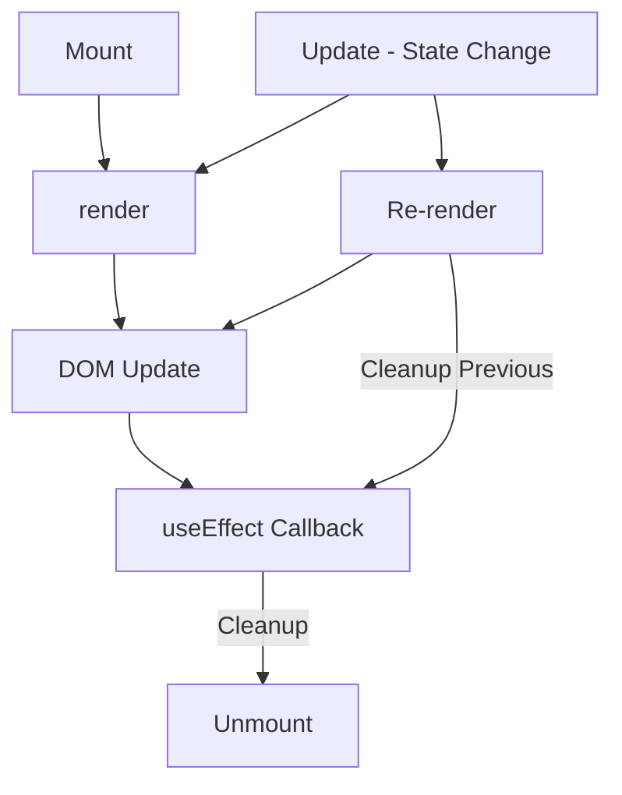
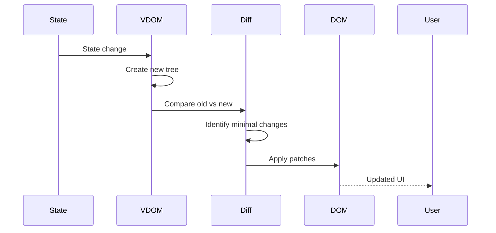
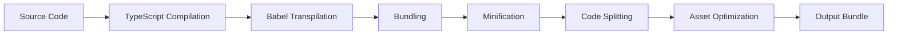
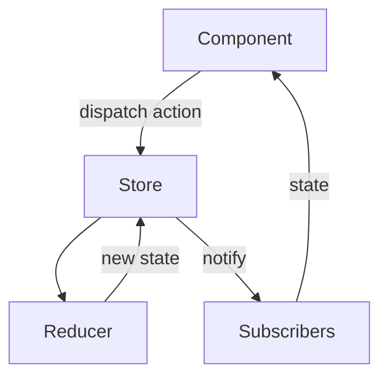

# 83 - Frontend Development

## Introduction

Frontend development is the art and science of building user interfaces that users see and interact with. It encompasses HTML, CSS, JavaScript, and modern frameworks like React, Vue, and Angular. Frontend engineers must balance visual design, performance, accessibility, cross-browser compatibility, and developer experience to deliver exceptional user experiences.

This guide covers React/Vue/Angular fundamentals, state management, component design, performance optimization, testing, build tools, CSS-in-JS, accessibility, and common frontend interview questions. Frontend engineering has evolved from simple HTML pages to complex applications requiring sophisticated architecture, tooling, and optimization strategies.

---

## Learning Roadmap

### Phase 1: Foundations (Weeks 1-4)
- HTML5 and semantic markup
- CSS3 (Flexbox, Grid, animations)
- JavaScript fundamentals (ES6+)
- DOM manipulation
- Responsive design
- Browser DevTools

### Phase 2: Framework Basics (Weeks 5-8)
- React, Vue, or Angular fundamentals
- Component-based architecture
- State management basics
- Routing (React Router, Vue Router, Angular Router)
- Forms and validation
- API integration

### Phase 3: Intermediate (Weeks 9-12)
- Advanced state management (Redux, Pinia, NgRx)
- Performance optimization
- Testing (Jest, React Testing Library, Cypress)
- Build tools (Vite, webpack, esbuild)
- TypeScript
- CSS-in-JS and utility-first CSS

### Phase 4: Advanced (Weeks 13-16)
- Server-side rendering (Next.js, Nuxt)
- Micro-frontends
- Design systems
- Accessibility (a11y) deep dive
- Web performance profiling
- Advanced patterns (compound components, render props, HOCs)

---

## Theory Notes

### React Fundamentals

#### Component Lifecycle (Functional Components with Hooks)
```jsx
import { useState, useEffect, useRef, useMemo, useCallback } from 'react';

function UserProfile({ userId }) {
  const [user, setUser] = useState(null);
  const [loading, setLoading] = useState(true);
  const abortRef = useRef(new AbortController());

  // Mount / Update / Cleanup
  useEffect(() => {
    const controller = new AbortController();
    abortRef.current = controller;

    async function fetchUser() {
      try {
        const res = await fetch(`/api/users/${userId}`, {
          signal: controller.signal
        });
        const data = await res.json();
        setUser(data);
      } catch (err) {
        if (err.name !== 'AbortError') {
          console.error(err);
        }
      } finally {
        setLoading(false);
      }
    }

    fetchUser();

    return () => controller.abort(); // Cleanup on unmount or userId change
  }, [userId]); // Re-run when userId changes

  const fullName = useMemo(() => {
    return user ? `${user.firstName} ${user.lastName}` : '';
  }, [user]);

  if (loading) return <Spinner />;
  if (!user) return <NotFound />;
  return <h1>{fullName}</h1>;
}
```

#### React Hooks
```jsx
// useState - local component state
const [count, setCount] = useState(0);

// useEffect - side effects
useEffect(() => { /* effect */ }, [deps]); // runs after render
useEffect(() => { /* effect */ return cleanup; }, [deps]);

// useRef - mutable reference
const inputRef = useRef(null);
inputRef.current.focus();

// useMemo - memoize expensive computations
const memoized = useMemo(() => expensiveCalc(a, b), [a, b]);

// useCallback - memoize functions
const handler = useCallback(() => { doSomething(id); }, [id]);

// useReducer - complex state logic
const [state, dispatch] = useReducer(reducer, initialState);
dispatch({ type: 'INCREMENT' });

// useContext - consume context
const theme = useContext(ThemeContext);

// Custom Hook
function useLocalStorage(key, initialValue) {
  const [value, setValue] = useState(() => {
    const stored = localStorage.getItem(key);
    return stored ? JSON.parse(stored) : initialValue;
  });

  useEffect(() => {
    localStorage.setItem(key, JSON.stringify(value));
  }, [key, value]);

  return [value, setValue];
}
```

### Vue Fundamentals

#### Vue 3 Composition API
```vue
<script setup>
import { ref, computed, onMounted, watch } from 'vue';
import { useRoute } from 'vue-router';
import { useUserStore } from '@/stores/user';

const route = useRoute();
const userStore = useUserStore();
const searchQuery = ref('');
const loading = ref(false);

// Computed properties
const filteredUsers = computed(() => {
  return userStore.users.filter(u =>
    u.name.toLowerCase().includes(searchQuery.value.toLowerCase())
  );
});

// Watchers
watch(searchQuery, async (newQuery) => {
  if (newQuery.length > 2) {
    loading.value = true;
    await userStore.searchUsers(newQuery);
    loading.value = false;
  }
});

// Lifecycle
onMounted(() => {
  userStore.fetchUsers();
});
</script>

<template>
  <div>
    <input v-model="searchQuery" placeholder="Search..." />
    <ul v-if="!loading">
      <li v-for="user in filteredUsers" :key="user.id">
        {{ user.name }}
      </li>
    </ul>
    <Spinner v-else />
  </div>
</template>
```

### Angular Fundamentals

#### Component with Dependency Injection
```typescript
import { Component, OnInit, inject } from '@angular/core';
import { ActivatedRoute } from '@angular/router';
import { UserService } from '../services/user.service';
import { Observable } from 'rxjs';

@Component({
  selector: 'app-user-profile',
  template: `
    <div *ngIf="user$ | async as user; else loading">
      <h1>{{ user.name }}</h1>
      <p>{{ user.email }}</p>
    </div>
    <ng-template #loading>
      <app-spinner />
    </ng-template>
  `
})
export class UserProfileComponent implements OnInit {
  private userService = inject(UserService);
  private route = inject(ActivatedRoute);
  user$!: Observable<User>;

  ngOnInit() {
    const id = this.route.snapshot.paramMap.get('id');
    this.user$ = this.userService.getUser(id!);
  }
}
```

### State Management Patterns

#### Redux Toolkit (React)
```javascript
import { createSlice, createAsyncThunk } from '@reduxjs/toolkit';

// Async thunk
export const fetchUsers = createAsyncThunk(
  'users/fetch',
  async (_, { rejectWithValue }) => {
    try {
      const response = await fetch('/api/users');
      if (!response.ok) throw new Error('Failed to fetch');
      return await response.json();
    } catch (err) {
      return rejectWithValue(err.message);
    }
  }
);

// Slice
const usersSlice = createSlice({
  name: 'users',
  initialState: {
    items: [],
    loading: false,
    error: null,
  },
  reducers: {
    addUser: (state, action) => {
      state.items.push(action.payload);
    },
    removeUser: (state, action) => {
      state.items = state.items.filter(u => u.id !== action.payload);
    },
  },
  extraReducers: (builder) => {
    builder
      .addCase(fetchUsers.pending, (state) => {
        state.loading = true;
        state.error = null;
      })
      .addCase(fetchUsers.fulfilled, (state, action) => {
        state.loading = false;
        state.items = action.payload;
      })
      .addCase(fetchUsers.rejected, (state, action) => {
        state.loading = false;
        state.error = action.payload;
      });
  },
});

export const { addUser, removeUser } = usersSlice.actions;
export default usersSlice.reducer;
```

---

## Key Concepts

### Component Design Patterns

#### Compound Components
```jsx
// Parent manages shared state
function Tabs({ children, defaultTab }) {
  const [activeTab, setActiveTab] = useState(defaultTab);

  return (
    <TabsContext.Provider value={{ activeTab, setActiveTab }}>
      <div className="tabs">{children}</div>
    </TabsContext.Provider>
  );
}

// Children consume context
function TabList({ children }) {
  return <div role="tablist">{children}</div>;
}

function Tab({ value, children }) {
  const { activeTab, setActiveTab } = useContext(TabsContext);
  return (
    <button
      role="tab"
      aria-selected={activeTab === value}
      onClick={() => setActiveTab(value)}
    >
      {children}
    </button>
  );
}

function TabPanel({ value, children }) {
  const { activeTab } = useContext(TabsContext);
  if (activeTab !== value) return null;
  return <div role="tabpanel">{children}</div>;
}

// Usage
<Tabs defaultTab="overview">
  <TabList>
    <Tab value="overview">Overview</Tab>
    <Tab value="details">Details</Tab>
  </TabList>
  <TabPanel value="overview">Overview content</TabPanel>
  <TabPanel value="details">Details content</TabPanel>
</Tabs>
```

#### Render Props Pattern
```jsx
function MouseTracker({ render }) {
  const [position, setPosition] = useState({ x: 0, y: 0 });

  return (
    <div
      onMouseMove={(e) => setPosition({ x: e.clientX, y: e.clientY })}
      style={{ height: '100vh' }}
    >
      {render(position)}
    </div>
  );
}

// Usage
<MouseTracker render={({ x, y }) => (
  <p>Mouse is at ({x}, {y})</p>
)} />
```

### Performance Optimization

#### Memoization
```jsx
// React.memo - prevent unnecessary re-renders
const ExpensiveList = React.memo(({ items, onItemClick }) => {
  return items.map(item => (
    <ExpensiveItem key={item.id} item={item} onClick={onItemClick} />
  ));
});

// useMemo - cache expensive computations
const sortedItems = useMemo(() => {
  return items.sort((a, b) => a.name.localeCompare(b.name));
}, [items]);

// useCallback - cache function references
const handleClick = useCallback((id) => {
  setSelected(id);
}, []);
```

#### Code Splitting
```jsx
// Lazy loading with React.lazy
const Dashboard = React.lazy(() => import('./Dashboard'));
const Settings = React.lazy(() => import('./Settings'));

function App() {
  return (
    <Suspense fallback={<LoadingSpinner />}>
      <Routes>
        <Route path="/dashboard" element={<Dashboard />} />
        <Route path="/settings" element={<Settings />} />
      </Routes>
    </Suspense>
  );
}
```

### CSS-in-JS and Utility CSS

#### Styled Components
```jsx
const StyledButton = styled.button`
  background: ${({ primary }) => primary ? '#3498db' : '#95a5a6'};
  color: white;
  padding: 0.75rem 1.5rem;
  border: none;
  border-radius: 4px;
  cursor: pointer;

  &:hover {
    opacity: 0.9;
  }

  @media (max-width: 768px) {
    padding: 0.5rem 1rem;
  }
`;
```

#### Tailwind CSS
```html
<button class="bg-blue-500 hover:bg-blue-600 text-white font-medium
               py-2 px-4 rounded transition-colors duration-200
               md:py-3 md:px-6">
  Click me
</button>
```

### Testing

#### React Testing Library
```jsx
import { render, screen, waitFor } from '@testing-library/react';
import userEvent from '@testing-library/user-event';
import { rest } from 'msw';
import { setupServer } from 'msw/node';

const server = setupServer(
  rest.get('/api/users', (req, res, ctx) => {
    return res(ctx.json([
      { id: 1, name: 'John Doe' },
      { id: 2, name: 'Jane Smith' },
    ]));
  })
);

beforeAll(() => server.listen());
afterEach(() => server.resetHandlers());
afterAll(() => server.close());

test('renders user list', async () => {
  render(<UserList />);

  expect(screen.getByText('Loading...')).toBeInTheDocument();

  await waitFor(() => {
    expect(screen.getByText('John Doe')).toBeInTheDocument();
    expect(screen.getByText('Jane Smith')).toBeInTheDocument();
  });
});

test('filters users by search', async () => {
  const user = userEvent.setup();
  render(<UserList />);

  await screen.findByText('John Doe');

  const searchInput = screen.getByPlaceholderText('Search...');
  await user.type(searchInput, 'John');

  expect(screen.getByText('John Doe')).toBeInTheDocument();
  expect(screen.queryByText('Jane Smith')).not.toBeInTheDocument();
});
```

---

## FAQ (20+ Q&A)

### Q1: What is the difference between React, Vue, and Angular?
**A:** React is a library focused on UI with a large ecosystem. Vue is a progressive framework with gentle learning curve. Angular is a full framework with TypeScript, dependency injection, and RxJS. React is most popular; Angular is enterprise-focused; Vue balances both.

### Q2: What is the virtual DOM?
**A:** The virtual DOM is a lightweight JavaScript representation of the real DOM. When state changes, a new virtual tree is diffed with the previous one, and only minimal actual DOM updates are applied. It improves performance by reducing expensive DOM operations.

### Q3: What is prop drilling?
**A:** Prop drilling is passing props through multiple component layers to reach a deeply nested component. It makes code harder to maintain. Solutions: Context API, state management libraries (Redux, Zustand), or composition patterns.

### Q4: What is the difference between controlled and uncontrolled components?
**A:** Controlled components have their value managed by React state (form state is the source of truth). Uncontrolled components manage their own state internally using refs. Controlled = React controls; Uncontrolled = DOM controls.

### Q5: What is React.memo and when should you use it?
**A:** `React.memo` is a higher-order component that prevents re-renders if props haven't changed (shallow comparison). Use it for expensive child components that receive the same props frequently. Don't use it everywhere — measure first.

### Q6: What are React keys and why are they important?
**A:** Keys help React identify which items have changed, added, or removed in lists. They must be unique and stable among siblings. Using array indices as keys is only safe if the list order never changes. Bad keys cause performance issues and bugs.

### Q7: What is the useEffect cleanup function?
**A:** The cleanup function runs before the component unmounts and before the effect re-runs. Use it for cleanup: cancelling subscriptions, aborting fetch requests, clearing timers. It prevents memory leaks.

### Q8: What is the difference between useMemo and useCallback?
**A:** `useMemo` memoizes a computed value (returns the result). `useCallback` memoizes a function (returns the function reference). Use `useMemo` for expensive calculations; `useCallback` when passing callbacks to memoized children.

### Q9: What is server-side rendering (SSR)?
**A:** SSR renders React/Vue components on the server, sending fully rendered HTML to the client. Benefits: faster initial load, better SEO, works without JavaScript. Frameworks: Next.js (React), Nuxt (Vue), Angular Universal.

### Q10: What is hydration in SSR?
**A:** Hydration is when the client-side JavaScript takes over the server-rendered HTML, making it interactive. React/Vue attaches event listeners and restores component state. Mismatches between server and client HTML cause warnings.

### Q11: What is CSS Modules?
**A:** CSS Modules scope class names to the component where they're imported, preventing naming conflicts. Classes are locally scoped by default (`.button` becomes `.ComponentName_button__xyz123`). Import as an object: `styles.button`.

### Q12: What is the Intersection Observer API?
**A:** Intersection Observer detects when an element enters or exits the viewport or a scrollable container. Common uses: infinite scrolling, lazy loading, scroll animations, and ad visibility tracking. More performant than scroll event listeners.

### Q13: What is the difference between `==` and `===`?
**A:** `==` performs type coercion before comparison (loose equality). `===` checks value AND type (strict equality). Always use `===` to avoid unexpected behavior like `0 == ""` being true.

### Q14: What is the difference between `map()` and `forEach()`?
**A:** `map()` returns a new array with transformed elements. `forEach()` executes a function for each element and returns `undefined`. Use `map` when you need a new array; use `forEach` for side effects.

### Q15: What is the difference between Redux and Context API?
**A:** Context API is for infrequently changing global data (theme, auth). Redux is for complex state with many updates, middleware, time-travel debugging, and predictable state transitions. Redux has more boilerplate but better tooling.

### Q16: What are custom hooks?
**A:** Custom hooks are functions that extract reusable logic from components. They follow the `use` prefix convention and can call other hooks. They share stateful logic without changing the component hierarchy.

### Q17: What is the `forwardRef` API?
**A:** `forwardRef` lets a component forward a ref to a child component. Useful when a parent needs direct access to a child's DOM element (e.g., focusing an input). Most components shouldn't need it.

### Q18: What is the difference between React Suspense and Lazy Loading?
**A:** `React.lazy` dynamically imports a component when it's first rendered. `Suspense` provides a fallback UI while lazy components load. They work together: `Suspense` catches the "promise" thrown by `lazy` components.

### Q19: What is Storybook?
**A:** Storybook is a tool for developing UI components in isolation. You write "stories" that show components in different states. It helps with visual testing, documentation, and component library development.

### Q20: What is the difference between a SPA and MPA?
**A:** SPA (Single Page Application) loads one HTML page and dynamically updates content via JavaScript. MPA (Multi-Page Application) loads a new HTML page for each navigation. SPAs have better UX; MPAs are simpler and better for SEO without SSR.

### Q21: What are React Portals?
**A:** Portals render children into a different DOM node outside the parent component hierarchy. Useful for modals, tooltips, and dropdowns that need to escape overflow hidden or stacking context issues.

### Q22: What is the `key` prop's role in reconciliation?
**A:** During reconciliation, React uses keys to match old children with new children in a list. Without stable keys, React may re-mount components unnecessarily. With correct keys, React reorders and reuses existing DOM nodes efficiently.

---

## Hands-on Practice

### Practice Projects

#### 1. Todo App with State Management (Easy)
- Add, edit, delete, and complete tasks
- Filter by status (all, active, completed)
- Local storage persistence
- **Skills**: Components, state, effects, forms

#### 2. Dashboard with Charts (Medium)
- Multiple chart types (bar, line, pie)
- Date range filtering
- Responsive grid layout
- Dark mode toggle
- **Skills**: Data visualization, responsive design, theming

#### 3. E-commerce Product Page (Medium-Hard)
- Product gallery with zoom
- Size/color selection
- Add to cart with quantity
- Reviews with pagination
- **Skills**: Complex state, animations, image handling

#### 4. Real-time Dashboard (Hard)
- WebSocket connections
- Live data updates
- Performance optimization with virtualization
- **Skills**: WebSockets, performance, state management

### Code Snippets

#### Custom Hook: useFetch
```jsx
function useFetch(url, options = {}) {
  const [data, setData] = useState(null);
  const [loading, setLoading] = useState(true);
  const [error, setError] = useState(null);

  useEffect(() => {
    const controller = new AbortController();

    async function fetchData() {
      try {
        setLoading(true);
        setError(null);
        const res = await fetch(url, { ...options, signal: controller.signal });
        if (!res.ok) throw new Error(`HTTP ${res.status}`);
        const json = await res.json();
        setData(json);
      } catch (err) {
        if (err.name !== 'AbortError') {
          setError(err.message);
        }
      } finally {
        setLoading(false);
      }
    }

    fetchData();
    return () => controller.abort();
  }, [url]);

  return { data, loading, error };
}

// Usage
function UserList() {
  const { data: users, loading, error } = useFetch('/api/users');

  if (loading) return <Spinner />;
  if (error) return <ErrorMessage message={error} />;
  return (
    <ul>
      {users.map(user => <li key={user.id}>{user.name}</li>)}
    </ul>
  );
}
```

#### Virtualized List
```jsx
import { FixedSizeList as List } from 'react-window';
import AutoSizer from 'react-virtualized-auto-sizer';

function VirtualizedList({ items }) {
  const Row = ({ index, style }) => (
    <div style={style} className="list-item">
      {items[index].name}
    </div>
  );

  return (
    <AutoSizer>
      {({ height, width }) => (
        <List
          height={height}
          width={width}
          itemCount={items.length}
          itemSize={50}
        >
          {Row}
        </List>
      )}
    </AutoSizer>
  );
}
```

---

## FAANG Questions

### Google
1. Design a Google Search autocomplete component. How would you handle debouncing, caching, keyboard navigation, and accessibility?
2. Build a collaborative whiteboard. How would you handle real-time drawing, undo/redo, and state synchronization?

### Meta
3. Design Facebook's photo viewer. How would you handle image preloading, gestures, comments overlay, and memory management?
4. Build an infinite scroll feed with dynamic ad insertion and real-time updates.

### Amazon
5. Design Amazon's product page with A/B testing support. How would you handle dynamic content, personalization, and performance?
6. Build a shopping cart that syncs across tabs using BroadcastChannel API.

### Apple
7. Design iCloud.com's photo gallery. How would you handle virtualization, gestures, and responsive layout?
8. Build a rich text editor with formatting toolbar and markdown support.

### Microsoft
9. Design Microsoft Teams' chat interface. How would you handle message virtualization, reactions, and real-time typing indicators?
10. Build a Kanban board with drag-and-drop across columns.

### Netflix
11. Design Netflix's row-based browsing experience. How would you handle horizontal scrolling, preview on hover, and lazy loading?
12. Build a video player with custom controls, picture-in-picture, and subtitle support.

---

## Common Mistakes

1. **Not memoizing expensive computations**: `useMemo` for expensive calculations prevents recalculation on every render
2. **Missing dependency arrays**: `useEffect` without proper dependencies runs every render
3. **Not using keys properly**: Array indices as keys cause bugs when list order changes
4. **Over-using state**: Derived values should be computed, not stored as separate state
5. **Not cleaning up effects**: Subscriptions and timers leak memory without cleanup
6. **Prop drilling deep**: Use Context or state management for deeply shared data
7. **Blocking the main thread**: Heavy computation in render blocks UI
8. **Not optimizing images**: Large unoptimized images hurt performance
9. **Ignoring accessibility**: Missing ARIA labels, keyboard navigation, color contrast
10. **Not testing edge cases**: Loading, error, empty states should all be tested
11. **Over-engineering**: Not every component needs Redux, HOCs, or render props
12. **Bundle size bloat**: Importing entire libraries for single functions

---

## Best Practices

### Component Design
- Keep components small and focused (single responsibility)
- Lift state up when siblings need to share data
- Use composition over inheritance
- Extract reusable logic into custom hooks
- Prefer controlled components for forms
- Use TypeScript for type safety

### Performance
- Measure before optimizing (React DevTools Profiler)
- Use `React.memo` for expensive components that receive stable props
- Code-split routes and heavy components
- Lazy load images and below-fold content
- Avoid inline functions in JSX (use `useCallback`)
- Debounce expensive event handlers

### Testing
- Test user behavior, not implementation details
- Use `data-testid` for test selectors (not CSS classes)
- Mock API calls with MSW (Mock Service Worker)
- Test accessibility with axe-core
- Write integration tests for user flows

### Accessibility
- Use semantic HTML elements
- Add ARIA labels where native semantics are insufficient
- Ensure keyboard navigation works
- Maintain color contrast (4.5:1 ratio)
- Test with screen readers
- Provide focus indicators

### Code Quality
- Use ESLint and Prettier for consistent code style
- Write self-documenting code with meaningful names
- Keep files small and focused
- Use TypeScript for large projects
- Code review every PR
- Document complex patterns in comments or Storybook

---

## Cheat Sheet

### React Hooks Quick Reference
```
useState          — Local component state
useEffect         — Side effects (mount, update, cleanup)
useContext        — Consume context values
useRef            — Mutable DOM reference
useMemo           — Memoize computed values
useCallback       — Memoize function references
useReducer        — Complex state logic
useLayoutEffect   — Synchronous side effects
useImperativeHandle — Customize ref value
useDeferredValue  — Defer non-urgent updates
useTransition     — Mark non-urgent state updates
useId             — Generate unique IDs
```

### CSS Selectors Specificity
```
!important                    — 1,0,0,0,0,0
Inline style (style="")       — 0,1,0,0,0
ID (#id)                      — 0,0,1,0,0
Class / Attribute / Pseudo    — 0,0,0,1,0
Element / Pseudo-element      — 0,0,0,0,1
* (universal)                 — 0,0,0,0,0
```

### JavaScript Array Methods
```
map()      — Transform each element
filter()   — Keep matching elements
reduce()   — Accumulate into single value
find()     — First matching element
some()     — Any match?
every()    — All match?
flat()     — Flatten nested arrays
sort()     — Sort in place
slice()    — Extract portion
```

### Event Handling
```
onClick      — Mouse click
onDoubleClick — Double click
onChange     — Input value change
onSubmit     — Form submission
onKeyDown    — Key pressed down
onKeyUp      — Key released
onFocus      — Element receives focus
onBlur       — Element loses focus
onScroll     — Scroll event
onMouseEnter — Mouse enters element
onMouseLeave — Mouse leaves element
```

---

## Flash Cards (20)

### Card 1
**Q:** What is the purpose of the `key` prop in React lists?
**A:** Keys help React identify which items changed, were added, or removed. They enable efficient DOM reordering and prevent unnecessary re-renders. Use unique, stable IDs — never array indices for dynamic lists.

### Card 2
**Q:** What is the difference between `useEffect` and `useLayoutEffect`?
**A:** `useEffect` runs asynchronously after the browser paints. `useLayoutEffect` runs synchronously before the browser paints. Use `useLayoutEffect` only when you need to measure or mutate the DOM before the user sees it.

### Card 3
**Q:** What is prop drilling and how do you avoid it?
**A:** Prop drilling is passing props through multiple component layers. Avoid it using React Context, state management (Redux, Zustand), or composition (render props, children pattern).

### Card 4
**Q:** What is the difference between a controlled and uncontrolled form input?
**A:** Controlled: React state controls the input value via `value` and `onChange`. Uncontrolled: DOM manages its own state via `defaultValue` and `ref`. Controlled = React is the source of truth.

### Card 5
**Q:** What is React.memo?
**A:** `React.memo` is a higher-order component that prevents re-rendering if props haven't changed (shallow comparison). Use for expensive child components that receive stable props frequently.

### Card 6
**Q:** What is the Virtual DOM diffing algorithm?
**A:** React's reconciler compares the new virtual DOM tree with the previous one, identifies minimal changes, and applies only those changes to the real DOM. It uses a O(n) heuristic based on element type and key.

### Card 7
**Q:** What is a closure in JavaScript?
**A:** A closure is a function that remembers variables from its lexical scope even when executed outside that scope. Every function in JavaScript forms a closure over its enclosing scope.

### Card 8
**Q:** What is `React.Suspense`?
**A:** Suspense shows a fallback UI while waiting for asynchronous children (lazy-loaded components, data fetching). It catches promises thrown by children and renders the fallback until resolved.

### Card 9
**Q:** What is the difference between `useState` and `useReducer`?
**A:** `useState` is for simple state values. `useReducer` is for complex state logic involving multiple sub-values or when the next state depends on the previous one. Reducer = pure function of state + action.

### Card 10
**Q:** What is code splitting?
**A:** Code splitting divides your bundle into smaller chunks loaded on demand. In React: `React.lazy()` + `Suspense`. In webpack: dynamic `import()`. Reduces initial load time by only loading what's needed.

### Card 11
**Q:** What is the useEffect cleanup function?
**A:** The return function in useEffect runs before the component unmounts and before the effect re-runs. Use it for cleanup: aborting fetch, removing event listeners, clearing timers.

### Card 12
**Q:** What is `forwardRef` in React?
**A:** `forwardRef` lets a parent component receive a ref to a child's DOM element. Useful when you need direct DOM access (focusing an input, measuring dimensions) from a parent.

### Card 13
**Q:** What is the difference between `map()` and `forEach()`?
**A:** `map()` returns a new array with transformed elements. `forEach()` executes a side effect per element and returns `undefined`. Use `map` for transformations; `forEach` for side effects.

### Card 14
**Q:** What is Vue's reactivity system?
**A:** Vue 3 uses JavaScript Proxies for reactivity. When you access reactive state, Vue tracks dependencies. When state changes, only dependent components re-render. No explicit mutation methods needed.

### Card 15
**Q:** What is Angular's change detection strategy?
**A:** Angular checks for changes in component trees on every event. `OnPush` strategy checks only when `@Input` references change, reducing unnecessary checks. Use `ChangeDetectionStrategy.OnPush` for performance.

### Card 16
**Q:** What is a higher-order component (HOC)?
**A:** A HOC is a function that takes a component and returns a new component with enhanced behavior. Examples: `React.memo`, `withRouter`, `connect` (Redux). Consider hooks as a simpler alternative.

### Card 17
**Q:** What is the difference between server-side rendering and static site generation?
**A:** SSR renders on every request (dynamic, personalized). SSG generates HTML at build time (fastest, static). ISR (Incremental Static Regeneration) combines both: static with periodic regeneration. Next.js supports all three.

### Card 18
**Q:** What is CSS-in-JS?
**A:** CSS-in-JS writes CSS in JavaScript, enabling dynamic styling, scoped classes, and component-level encapsulation. Examples: styled-components, Emotion, Stitches. Trade-off: runtime performance overhead vs development experience.

### Card 19
**Q:** What is the `useId` hook?
**A:** `useId` generates a unique, stable ID for accessibility attributes (aria-labelledby, htmlFor). It works with SSR and avoids hydration mismatches. One hook per component generates multiple IDs.

### Card 20
**Q:** What is the Intersection Observer API?
**A:** Intersection Observer detects when elements enter/exit the viewport asynchronously. Used for lazy loading, infinite scroll, scroll animations, and ad visibility. More performant than scroll event listeners.

---

## Mind Map

```
Frontend Development
├── Frameworks
│   ├── React
│   │   ├── Components (Function, Class)
│   │   ├── Hooks (useState, useEffect, useRef, etc.)
│   │   ├── Context API
│   │   ├── React Router
│   │   └── Next.js (SSR, SSG)
│   ├── Vue
│   │   ├── Options API / Composition API
│   │   ├── Reactivity (Proxy)
│   │   ├── Vue Router
│   │   ├── Pinia (State)
│   │   └── Nuxt.js (SSR)
│   └── Angular
│       ├── Components & Directives
│       ├── Services & DI
│       ├── RxJS (Observables)
│       ├── Angular Router
│       └── Angular CLI
├── State Management
│   ├── Local State (useState)
│   ├── Context API
│   ├── Redux / Redux Toolkit
│   ├── Zustand / Jotai
│   ├── Pinia (Vue)
│   └── NgRx (Angular)
├── Styling
│   ├── CSS Modules
│   ├── Styled Components / Emotion
│   ├── Tailwind CSS
│   ├── Sass/SCSS
│   └── CSS-in-JS
├── Testing
│   ├── Jest (Unit)
│   ├── React Testing Library
│   ├── Cypress / Playwright (E2E)
│   ├── Vitest
│   └── Storybook (Visual)
├── Performance
│   ├── Code Splitting
│   ├── Lazy Loading
│   ├── Memoization (memo, useMemo, useCallback)
│   ├── Virtualization
│   ├── Image Optimization
│   └── Bundle Analysis
├── Build Tools
│   ├── Vite
│   ├── webpack
│   ├── esbuild / SWC
│   ├── Turbopack
│   └── Babel / TypeScript
├── Accessibility
│   ├── Semantic HTML
│   ├── ARIA Attributes
│   ├── Keyboard Navigation
│   ├── Color Contrast
│   └── Screen Readers
└── Type Safety
    ├── TypeScript
    ├── PropTypes (deprecated)
    └── Flow (deprecated)
```

---

## Mermaid Diagrams

### React Component Lifecycle


### Virtual DOM Diffing


### Frontend Build Pipeline


### State Management Flow (Redux)


---

## Code Examples

### Complete React Form with Validation
```jsx
import { useState } from 'react';

function RegistrationForm() {
  const [formData, setFormData] = useState({
    name: '',
    email: '',
    password: '',
    confirmPassword: ''
  });
  const [errors, setErrors] = useState({});

  const validate = () => {
    const newErrors = {};

    if (!formData.name.trim()) newErrors.name = 'Name is required';
    if (!formData.email.match(/^[^\s@]+@[^\s@]+\.[^\s@]+$/)) {
      newErrors.email = 'Invalid email';
    }
    if (formData.password.length < 8) {
      newErrors.password = 'Password must be at least 8 characters';
    }
    if (formData.password !== formData.confirmPassword) {
      newErrors.confirmPassword = 'Passwords do not match';
    }

    setErrors(newErrors);
    return Object.keys(newErrors).length === 0;
  };

  const handleSubmit = async (e) => {
    e.preventDefault();
    if (!validate()) return;

    try {
      const res = await fetch('/api/register', {
        method: 'POST',
        headers: { 'Content-Type': 'application/json' },
        body: JSON.stringify(formData),
      });
      if (!res.ok) throw new Error('Registration failed');
      // Handle success
    } catch (err) {
      setErrors({ form: err.message });
    }
  };

  return (
    <form onSubmit={handleSubmit} noValidate>
      <div className="field">
        <label htmlFor="name">Name</label>
        <input
          id="name"
          type="text"
          value={formData.name}
          onChange={(e) => setFormData({ ...formData, name: e.target.value })}
          className={errors.name ? 'error' : ''}
          aria-invalid={!!errors.name}
          aria-describedby={errors.name ? 'name-error' : undefined}
        />
        {errors.name && <span id="name-error" className="error">{errors.name}</span>}
      </div>
      {/* Similar fields for email, password, confirmPassword */}
      <button type="submit">Register</button>
      {errors.form && <div className="error-banner">{errors.form}</div>}
    </form>
  );
}
```

### Vue 3 Composition API Component
```vue
<script setup>
import { ref, computed, onMounted } from 'vue';

const todos = ref([]);
const newTodo = ref('');
const filter = ref('all');

const filteredTodos = computed(() => {
  switch (filter.value) {
    case 'active': return todos.value.filter(t => !t.done);
    case 'completed': return todos.value.filter(t => t.done);
    default: return todos.value;
  }
});

const stats = computed(() => ({
  total: todos.value.length,
  active: todos.value.filter(t => !t.done).length,
  completed: todos.value.filter(t => t.done).length,
}));

function addTodo() {
  if (!newTodo.value.trim()) return;
  todos.value.push({
    id: Date.now(),
    text: newTodo.value.trim(),
    done: false,
  });
  newTodo.value = '';
}

function removeTodo(id) {
  todos.value = todos.value.filter(t => t.id !== id);
}

onMounted(async () => {
  const res = await fetch('/api/todos');
  todos.value = await res.json();
});
</script>

<template>
  <div class="todo-app">
    <form @submit.prevent="addTodo">
      <input v-model="newTodo" placeholder="What needs to be done?" />
      <button type="submit">Add</button>
    </form>

    <div class="filters">
      <button :class="{ active: filter === 'all' }" @click="filter = 'all'">
        All ({{ stats.total }})
      </button>
      <button :class="{ active: filter === 'active' }" @click="filter = 'active'">
        Active ({{ stats.active }})
      </button>
      <button :class="{ active: filter === 'completed' }" @click="filter = 'completed'">
        Completed ({{ stats.completed }})
      </button>
    </div>

    <ul>
      <li v-for="todo in filteredTodos" :key="todo.id">
        <input type="checkbox" v-model="todo.done" />
        <span :class="{ done: todo.done }">{{ todo.text }}</span>
        <button @click="removeTodo(todo.id)">Delete</button>
      </li>
    </ul>
  </div>
</template>
```

---

## Projects

### Project 1: Personal Dashboard (Easy-Medium)
- Weather widget, clock, bookmarks
- Local storage for preferences
- Responsive grid layout
- Dark mode
- **Skills**: Components, hooks, responsive design

### Project 2: Kanban Board (Medium)
- Drag and drop columns/cards
- Local storage persistence
- Swimlanes and labels
- **Skills**: DnD API, complex state, drag-and-drop

### Project 3: Code Editor (Medium-Hard)
- Syntax highlighting
- Line numbers
- File tree
- Find and replace
- **Skills**: CodeMirror/Monaco, complex state, performance

### Project 4: E-commerce Platform (Hard)
- Product catalog with search/filter
- Shopping cart
- Checkout flow
- User authentication
- **Skills**: Full stack, state management, routing, forms

---

## Resources

### Documentation
- [React Docs](https://react.dev)
- [Vue Docs](https://vuejs.org)
- [Angular Docs](https://angular.dev)
- [MDN Web Docs](https://developer.mozilla.org)

### Learning
- [Frontend Masters](https://frontendmasters.com)
- [Egghead.io](https://egghead.io)
- [JavaScript.info](https://javascript.info)
- [CSS-Tricks](https://css-tricks.com)

### Practice
- [Frontend Mentor](https://frontendmentor.io)
- [CSS Battle](https://cssbattle.dev)
- [JavaScript30](https://javascript30.com)
- [LeetCode (Frontend)](https://leetcode.com)

---

## Checklist

### Before Your Frontend Interview
- [ ] Can build a component from scratch
- [ ] Understand React hooks thoroughly (useState, useEffect, useRef, useMemo, useCallback)
- [ ] Know the difference between controlled and uncontrolled components
- [ ] Can explain state management approaches and trade-offs
- [ ] Understand virtual DOM and reconciliation
- [ ] Can implement responsive layouts with CSS Grid/Flexbox
- [ ] Know testing approaches (unit, integration, E2E)
- [ ] Understand performance optimization techniques
- [ ] Can explain code splitting and lazy loading
- [ ] Familiar with TypeScript basics
- [ ] Know accessibility best practices
- [ ] Can design component APIs (props, composition)
- [ ] Understand build tools and module bundling
- [ ] Familiar with CSS-in-JS and utility CSS
- [ ] Can discuss trade-offs between frameworks

---

## Difficulty Rating

| Topic | Difficulty | Interview Frequency |
|-------|-----------|-------------------|
| React Components & JSX | ★★☆☆☆ | Very High |
| React Hooks | ★★★☆☆ | Very High |
| State Management | ★★★☆☆ | Very High |
| Component Design Patterns | ★★★★☆ | High |
| Performance Optimization | ★★★★☆ | High |
| Testing | ★★★☆☆ | High |
| TypeScript | ★★★☆☆ | High |
| CSS Layout (Grid/Flexbox) | ★★★☆☆ | Very High |
| Accessibility | ★★★☆☆ | Medium |
| Build Tools | ★★★★☆ | Medium |
| Server-Side Rendering | ★★★★☆ | Medium |
| Micro-Frontends | ★★★★★ | Low |
| Design Systems | ★★★★☆ | Medium |

---

## Summary

Frontend development combines creativity with engineering precision. Key takeaways:

1. **Component thinking is essential** — break UIs into small, composable, reusable pieces
2. **State management is the core challenge** — know when to use local state, context, or a state library
3. **Performance requires measurement** — use React DevTools Profiler, Lighthouse, and browser tools
4. **Testing is part of the workflow** — test user behavior, not implementation details
5. **Accessibility is not optional** — build inclusive interfaces from the start
6. **TypeScript prevents bugs** — type safety pays dividends in large codebases
7. **Framework choice matters less than fundamentals** — React, Vue, and Angular share core concepts
8. **CSS skills are undervalued** — Grid, Flexbox, and responsive design are critical
9. **Build tools evolve rapidly** — Vite and esbuild are the modern standard
10. **User experience drives everything** — technical excellence should serve the user
