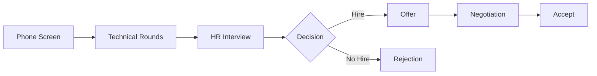
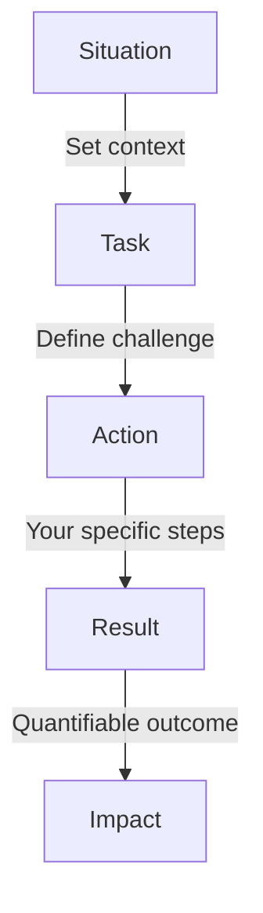
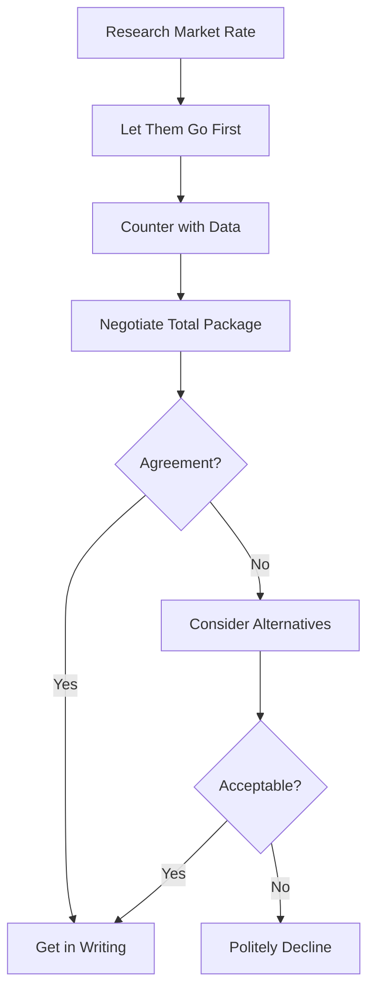

# 85 - HR Interview

## Introduction

The HR interview (also called behavioral, cultural fit, or soft skills round) evaluates who you are beyond your technical abilities. It assesses your personality, communication skills, cultural fit, career motivations, and how you handle workplace situations. Many candidates with excellent technical skills fail at this stage because they underestimate its importance.

HR interviews typically happen as the final round after technical interviews. The interviewer wants to understand: Are you a good cultural fit? Will you stay long-term? How do you handle conflict? What motivates you? Can you communicate effectively? This guide covers common HR questions, behavioral responses using the STAR method, salary negotiation, company culture fit, and strategies for making a strong impression.

---

## Learning Roadmap

### Phase 1: Self-Reflection (Days 1-2)
- Identify your strengths and weaknesses
- Clarify career goals and motivations
- Research the company's culture and values
- Prepare your "story bank" of experiences

### Phase 2: Question Preparation (Days 3-5)
- Prepare answers for 20+ common HR questions
- Practice STAR method responses
- Prepare questions to ask the interviewer
- Research salary benchmarks

### Phase 3: Mock Practice (Days 6-7)
- Practice with a friend or mentor
- Record yourself answering questions
- Work on body language and tone
- Review and refine your answers

---

## Theory Notes

### The STAR Method for Behavioral Questions
The STAR method structures your responses with specific examples:
- **Situation**: Set the context (where, when, what was happening)
- **Task**: Describe your responsibility or the challenge
- **Action**: Explain the specific steps YOU took (not the team)
- **Result**: Share the outcome, ideally with quantifiable results

### What HR Interviewers Evaluate

| Dimension | What They Look For |
|-----------|-------------------|
| **Communication** | Clear, concise, structured responses |
| **Self-Awareness** | Honest assessment of strengths/weaknesses |
| **Motivation** | Genuine interest in the company and role |
| **Teamwork** | Ability to collaborate and support others |
| **Conflict Resolution** | Mature approach to disagreements |
| **Growth Mindset** | Willingness to learn and adapt |
| **Cultural Fit** | Alignment with company values |
| **Reliability** | Track record of commitment and follow-through |

### Common HR Questions Categories
1. **Tell me about yourself** — Your professional story
2. **Why this company?** — Research and genuine interest
3. **Strengths/Weaknesses** — Self-awareness and growth
4. **Conflict resolution** — Interpersonal skills
5. **Failure and challenge** — Resilience and learning
6. **Career goals** — Ambition and alignment
7. **Salary expectations** — Market awareness and negotiation
8. **Teamwork examples** — Collaboration ability
9. **Leadership examples** — Initiative and influence
10. **Why should we hire you?** — Value proposition

---

## Key Concepts

### Crafting Your "Tell Me About Yourself" Answer
Structure your answer in 3 parts:
1. **Past**: Brief background and relevant experience
2. **Present**: Current role and key achievements
3. **Future**: Why you're excited about this opportunity

Keep it to 90 seconds. Focus on professional highlights. Don't reveal personal information unnecessarily.

### Salary Negotiation Framework
1. **Research**: Use Glassdoor, Levels.fyi, Payscale to know market rates
2. **Let them go first**: Ask about their budget/compensation range
3. **Consider total compensation**: Base, bonus, equity, benefits, PTO
4. **Anchor high**: Start with your ideal number, not minimum acceptable
5. **Justify with data**: Reference market rates and your unique value
6. **Be willing to walk away**: Have alternatives to strengthen your position
7. **Get it in writing**: Verbal offers should be confirmed in writing

### Cultural Fit Indicators
- **Mission alignment**: Do you believe in what the company does?
- **Values alignment**: Do their values match yours?
- **Work style**: Do you prefer the pace and structure?
- **Growth opportunity**: Can you grow in this role?
- **Team dynamics**: Would you enjoy working with this team?

---

## FAQ (20+ Q&A)

### Q1: Tell me about yourself.
**A:** "I'm a software engineer with 5 years of experience building web applications. Currently, I'm at [Company] where I lead a team of 4 engineers building a real-time data pipeline that processes 10M events daily. Before that, I was at [Company] where I built microservices using Node.js and PostgreSQL. I'm passionate about building scalable systems and I'm excited about [Company]'s mission to [specific mission]. I'm looking for an opportunity where I can apply my distributed systems experience while continuing to grow as a technical leader."

### Q2: Why do you want to work here?
**A:** Research the company thoroughly. Mention specific products, recent news, or values that resonate with you. Connect your skills to their needs. "I've been following [Company]'s work in [specific area] and I'm impressed by [specific achievement]. Your focus on [value from their careers page] aligns with my belief that [personal value]. My experience in [relevant skill] would let me contribute immediately to [specific team/project]."

### Q3: What are your strengths?
**A:** Pick 2-3 strengths that are relevant to the role. Support each with a brief example. "My strongest strength is breaking down complex problems. At my last job, I was tasked with reducing API response times from 2 seconds to under 200ms. I systematically profiled the system, identified N+1 queries and missing indexes, and implemented caching, bringing the average response time to 150ms."

### Q4: What is your greatest weakness?
**A:** Choose a real weakness, show self-awareness, and demonstrate improvement. Avoid cliches ("I'm a perfectionist") or fatal flaws ("I struggle with deadlines"). "I used to struggle with delegating tasks because I wanted to ensure quality. I recognized this was limiting my team's growth, so I started assigning ownership of specific features to team members, providing clear expectations, and being available for guidance rather than doing it myself. My team's velocity increased by 40% as a result."

### Q5: Describe a time you had a conflict with a coworker.
**A:** Use STAR method. Focus on resolution, not blame. "In my previous role, a colleague and I disagreed on the database design for a new feature. I believed we needed normalization for data integrity; they preferred denormalization for query performance. I suggested we both prototype our approaches with realistic data volumes. After benchmarking, we found a hybrid approach that normalized core entities but added materialized views for common queries. We delivered the feature with both data integrity and performance."

### Q6: Why are you leaving your current job?
**A:** Stay positive. Never badmouth your current employer. Focus on growth. "I've learned a lot at my current company and I'm grateful for the experience. However, I've reached a point where I'm looking for new challenges that align with my growth goals in [specific area]. [Company] offers the opportunity to work on [specific challenge] at a scale that would help me grow."

### Q7: Where do you see yourself in 5 years?
**A:** Show ambition aligned with the company's growth. "In 5 years, I see myself having grown into a senior technical leadership role where I'm architecting systems that serve millions of users. I'm particularly interested in [specific technical area the company works in], and I'd love to be a thought leader in that space while mentoring the next generation of engineers."

### Q8: What motivates you?
**A:** Connect your motivation to the role and company. "I'm motivated by building products that make a real difference in people's lives. At [Company], I'd be working on [specific product] that [impact]. I'm also motivated by continuous learning — I thrive in environments where I'm constantly challenged to grow my skills."

### Q9: How do you handle pressure and tight deadlines?
**A:** Give a specific example. "When faced with tight deadlines, I break the work into smaller, prioritized tasks. During a recent product launch, we had two weeks to deliver a critical feature. I created a detailed task breakdown, communicated daily progress to stakeholders, and identified the minimum viable feature set. We delivered on time, and the feature handled 50K users in its first week."

### Q10: What is your salary expectation?
**A:** Research market rates first. "Based on my research of similar roles in [location/industry] and considering my experience with [relevant skills], I'm looking for a range of $X to $Y. However, I'm flexible and more focused on the total compensation package, including growth opportunities and the impact I can make."

### Q11: How do you handle failure?
**A:** Show accountability, learning, and growth. "In my previous role, I deployed a code change that caused a 30-minute service outage. I immediately rolled back the change, communicated with stakeholders, and led the post-mortem. I identified that our testing pipeline didn't catch a race condition. I then implemented chaos engineering practices and added specific test cases, and we haven't had a similar incident since."

### Q12: Tell me about a time you showed leadership.
**A:** Leadership isn't just about titles. "Even though I wasn't a team lead, I noticed our onboarding process was outdated and confusing for new hires. I took the initiative to document our entire development workflow, created interactive tutorials, and organized weekly onboarding sessions. This reduced new hire ramp-up time from 3 weeks to 1 week, and the documentation became a company resource."

### Q13: How do you prioritize your work?
**A:** Show structured thinking. "I use a framework based on impact and urgency. I start each week by identifying my top 3 priorities based on business impact. I use time-blocking for deep work and batch similar tasks together. When unexpected requests come in, I evaluate whether they're more important than my current priorities and communicate transparently about trade-offs."

### Q14: What do you do outside of work?
**A:** Show well-roundedness. Mention hobbies that demonstrate positive qualities. "I'm an avid open-source contributor — I maintain a small but popular npm package for data validation. I also enjoy rock climbing, which has taught me problem-solving and risk assessment under pressure. On weekends, I volunteer teaching coding to underprivileged students."

### Q15: Do you have any questions for us?
**A:** Always have thoughtful questions. Ask about:
- Team structure and dynamics
- Technical challenges the team is facing
- Growth and learning opportunities
- Product roadmap and your potential impact
- Company culture and values in practice
- What success looks like in the first 90 days

### Q16: How do you handle receiving negative feedback?
**A:** Show maturity and growth mindset. "I actively seek feedback because I know it's essential for growth. When my manager once told me that my code reviews were coming across as overly critical, I reflected on my approach. I started framing suggestions as questions, leading with positives, and offering to pair on improvements. My team's code review satisfaction scores improved significantly."

### Q17: What makes you unique compared to other candidates?
**A:** Combine your technical depth with soft skills. "What sets me apart is my ability to bridge technical complexity with business outcomes. At my last company, I not only built the data pipeline but also created a dashboard that let the marketing team independently analyze campaign performance, reducing their dependency on engineering by 80%."

### Q18: How do you work with people from different backgrounds?
**A:** Show inclusion and adaptability. "I've worked with teams across 4 time zones and 5 nationalities. I've learned to be mindful of communication styles — being more explicit in written communication, respecting different holiday schedules, and making sure remote team members have equal voice in meetings. I believe diverse perspectives lead to better solutions."

### Q19: What is your approach to learning new technologies?
**A:** Show structured learning habits. "I follow a cycle: learn the fundamentals, build a small project, then dive deep. When I needed to learn Kubernetes, I first completed a course, then containerized our application, and eventually led the migration to production. I also stay current through tech blogs, podcasts, and monthly study groups with colleagues."

### Q20: When can you start?
**A:** Be honest about your timeline. "I'd need to give my current employer two weeks' notice, as I want to ensure a proper handoff. I could also potentially start earlier if needed for critical onboarding. What's your ideal start date?"

---

## Hands-on Practice

### Mock Interview Exercises

#### Exercise 1: Story Bank Development
Write 8-10 STAR stories covering these themes:
1. A time you solved a difficult technical problem
2. A time you worked under pressure
3. A time you helped a colleague grow
4. A time you failed and what you learned
5. A time you disagreed with a decision
6. A time you took initiative
7. A time you had to learn something quickly
8. A time you managed competing priorities

#### Exercise 2: Company Research
For each company you're interviewing with, document:
- Company mission and values
- Recent news or achievements
- Products and their impact
- Team you'd be working with
- Specific role requirements
- Growth trajectory

#### Exercise 3: Mock Interview Recording
- Record yourself answering 5 common HR questions
- Review for filler words, pace, clarity, and confidence
- Practice until answers feel natural, not rehearsed

---

## FAANG-Specific HR Questions

### Google
- "Tell me about a time you had to influence without authority."
- "How do you handle ambiguity in project requirements?"
- "Describe a time you had to make a decision with incomplete information."

### Meta
- "Tell me about a time you moved fast and broke something."
- "How do you balance speed with quality?"
- "Describe a time you had to pivot quickly."

### Amazon (Leadership Principles)
- "Tell me about a time you simplified something complex." (Invent and Simplify)
- "Describe a time you went above and beyond." (Customer Obsession)
- "Tell me about a time you were right but had to follow a different direction." (Bias for Action)

### Apple
- "How do you maintain attention to detail in your work?"
- "Tell me about a time you pushed for a better user experience."
- "How do you handle working under secrecy constraints?"

### Microsoft
- "How do you help others succeed?"
- "Tell me about a time you had to make a tough trade-off."
- "How do you stay current with technology trends?"

---

## Common Mistakes

1. **Badmouthing previous employers**: Never speak negatively about past companies or colleagues
2. **Being too vague**: Use specific examples, not generalizations
3. **Not researching the company**: Shows lack of genuine interest
4. **Rigidity on salary**: Be flexible and consider total compensation
5. **No questions for the interviewer**: Always have thoughtful questions prepared
6. **Over-rehearsing**: Sound natural, not robotic
7. **Being too humble**: Own your achievements confidently
8. **Interrupting the interviewer**: Listen fully before responding
9. **Lying or exaggerating**: Inconsistencies will be caught
10. **Neglecting body language**: Eye contact, posture, and tone matter

---

## Best Practices

### Before the Interview
- Research the company deeply (products, culture, news, competitors)
- Prepare 8-10 STAR stories
- Practice answers out loud (not just in your head)
- Prepare 5+ thoughtful questions for the interviewer
- Review the job description and map your experience to each requirement
- Plan your outfit and route (or video setup for virtual)

### During the Interview
- Listen actively — don't just wait to speak
- Ask clarifying questions if needed
- Use specific examples, not hypotheticals
- Show enthusiasm without being over-the-top
- Be honest about gaps or weaknesses
- Take a moment to think before answering tough questions

### After the Interview
- Send a thank-you email within 24 hours
- Reference specific topics from the conversation
- Reiterate your interest in the role
- Follow up if you haven't heard back within the stated timeline

---

## Cheat Sheet

### STAR Method Template
```
SITUATION: "In my role at [Company], [context of what was happening]"
TASK: "I was responsible for [specific challenge/responsibility]"
ACTION: "I [specific actions you took, using I not we]"
RESULT: "The result was [quantifiable outcome]. This led to [broader impact]"
```

### Common Weakness Examples (Honest & Growth-Oriented)
```
- Delegation → Now I assign ownership and provide guidance
- Public speaking → Joined Toastmasters, now present at meetups
- Overthinking → Time-box decisions, seek input faster
- Saying yes too much → Now I evaluate capacity before committing
- Avoiding conflict → Now I address issues early and directly
```

### Questions to Ask HR
```
- What does a typical day look like for someone in this role?
- What are the biggest challenges facing the team right now?
- How do you measure success in this position?
- What does the onboarding process look like?
- What are the growth opportunities for this role?
- How does the company support professional development?
- What's the team culture like?
- What's the next step in the process?
```

---

## Flash Cards (20)

### Card 1
**Q:** How do you answer "Tell me about yourself"?
**A:** Use Past-Present-Future: Briefly cover your relevant background, current role with key achievements, and why you're excited about this specific opportunity. Keep it under 90 seconds.

### Card 2
**Q:** What is the STAR method?
**A:** STAR = Situation (context), Task (your responsibility), Action (what YOU did), Result (outcome with metrics). It structures behavioral interview responses with specific examples.

### Card 3
**Q:** How should you answer "What is your greatest weakness"?
**A:** Choose a real weakness, explain how you recognized it, describe specific steps you've taken to improve, and share measurable progress. Avoid cliches like "I'm a perfectionist."

### Card 4
**Q:** What should you never say when asked why you're leaving?
**A:** Never badmouth your current employer, colleagues, or company. Focus on what you're moving toward, not what you're running from. Frame it as seeking growth and new challenges.

### Card 5
**Q:** How should you approach salary negotiation?
**A:** Research market rates, let them state a range first, consider total compensation (not just base salary), anchor with your ideal number, justify with data, and get the final offer in writing.

### Card 6
**Q:** What questions should you ask at the end of an HR interview?
**A:** Ask about team dynamics, growth opportunities, what success looks like, the day-to-day, company culture, and next steps. Avoid asking about salary/benefits in the first interview.

### Card 7
**Q:** How do you demonstrate cultural fit?
**A:** Research the company's values and mission. Share examples that align with their culture. Show genuine enthusiasm for their products and mission. Ask questions that show you care about the work environment.

### Card 8
**Q:** What is the best way to handle a question you don't know the answer to?
**A:** Be honest. Say "I don't have experience with that specific situation, but here's how I would approach it..." or "That's a great question — let me think about that for a moment." Never make up an answer.

### Card 9
**Q:** How do you show that you're a team player?
**A:** Give specific examples of helping colleagues, mentoring juniors, collaborating on solutions, and prioritizing team success over individual recognition. Use "we" appropriately but describe YOUR contributions.

### Card 10
**Q:** What is a good way to prepare for HR interviews?
**A:** Write 8-10 STAR stories covering different competencies. Research the company. Practice with a friend. Record yourself. Prepare questions. Review the job description and map your experience to each requirement.

### Card 11
**Q:** How do you handle a question about handling pressure?
**A:** Give a specific example of working under a tight deadline. Describe your prioritization approach, how you communicated with stakeholders, and the positive outcome. Show composure and structured thinking.

### Card 12
**Q:** What should your thank-you email include?
**A:** Thank the interviewer, reference a specific topic from the conversation, reiterate your interest in the role, briefly reinforce why you're a good fit, and keep it concise (3-4 paragraphs).

### Card 13
**Q:** How do you answer "Where do you see yourself in 5 years"?
**A:** Show ambition aligned with the company's growth. Mention wanting to deepen expertise in relevant areas, take on leadership responsibilities, and contribute to the company's mission at a larger scale.

### Card 14
**Q:** How should you handle a behavioral question about failure?
**A:** Take ownership (no blaming), describe what happened honestly, explain what you learned, and describe how you've changed your approach since. Show growth and accountability.

### Card 15
**Q:** What is the difference between HR and hiring manager interviews?
**A:** HR focuses on cultural fit, communication, and soft skills. Hiring managers focus more on technical depth, team dynamics, and role-specific fit. Prepare different stories for each.

### Card 16
**Q:** How do you demonstrate self-awareness?
**A:** Be honest about your strengths and weaknesses. Give specific examples. Show you've received feedback and acted on it. Demonstrate understanding of your work style and how you collaborate with others.

### Card 17
**Q:** How should you handle unexpected or curveball questions?
**A:** Take a moment to think. Break the question into parts. If you need to, say "That's an interesting question — let me take a moment to think about it." Don't rush to fill silence.

### Card 18
**Q:** What makes a strong "Why should we hire you" answer?
**A:** Combine your relevant experience, specific skills they need, and genuine enthusiasm for the role. Reference specific requirements from the job description and show how your experience maps to each.

### Card 19
**Q:** How do you handle questions about gaps in your resume?
**A:** Be honest about the gap. If you were learning, mention specific skills you acquired. If you were dealing with personal matters, you can keep it brief. Focus on what you did during the gap and how you're ready to contribute now.

### Card 20
**Q:** What is the best way to end an HR interview?
**A:** Express genuine enthusiasm for the role and company. Ask about next steps and timeline. Thank the interviewer for their time. Send a thoughtful follow-up email within 24 hours.

---

## Mind Map

```
HR Interview
├── Common Questions
│   ├── Tell me about yourself
│   ├── Why this company?
│   ├── Why should we hire you?
│   ├── Strengths and weaknesses
│   ├── Where do you see yourself in 5 years?
│   ├── Why are you leaving?
│   └── Salary expectations
├── Behavioral Questions (STAR Method)
│   ├── Conflict resolution
│   ├── Failure and learning
│   ├── Leadership and initiative
│   ├── Teamwork and collaboration
│   ├── Working under pressure
│   └── Handling ambiguity
├── Preparation
│   ├── Company research
│   ├── Story bank (8-10 stories)
│   ├── Mock interviews
│   ├── Questions for interviewer
│   └── Salary research
├── Communication
│   ├── Clear and concise
│   ├── Specific examples
│   ├── Positive framing
│   ├── Active listening
│   └── Body language
├── Salary Negotiation
│   ├── Market research
│   ├── Total compensation
│   ├── Anchoring
│   ├── Getting it in writing
│   └── Alternatives (benefits, PTO, equity)
└── After the Interview
    ├── Thank you email
    ├── Follow up
    └── Reflect and learn
```

---

## Mermaid Diagrams

### HR Interview Process Flow


### STAR Method Response Structure


### Salary Negotiation Flow


---

## Code Examples

### STAR Story Bank Template (Markdown)

```markdown
## Story 1: Difficult Technical Problem
**S**: At Company X, our checkout API was timing out during peak hours,
     affecting 20% of transactions.
**T**: I was responsible for diagnosing and fixing the performance issue
     within 2 weeks.
**R**: I profiled the API, identified N+1 queries and missing indexes,
     implemented Redis caching, and added connection pooling.
**R**: Response time dropped from 3s to 200ms. Zero timeouts in the
     following 3 months. Revenue impact: $500K annually.

## Story 2: Handling Conflict
**S**: During sprint planning, two senior engineers disagreed on the
     approach for a new feature — microservices vs monolith.
**T**: As the tech lead, I needed to facilitate a decision that the
     team could commit to.
**R**: I set up a 1-hour session where each engineer presented their
     approach with pros/cons. I asked probing questions to identify
     the core concerns. We decided on a modular monolith with
     clear service boundaries for future extraction.
**R**: The feature launched on time. The modular design allowed us to
     extract two services 6 months later with minimal refactoring.

## Story 3: Failure and Learning
**S**: I deployed a code change that introduced a race condition,
     causing a 30-minute production outage affecting 10K users.
**T**: I was responsible for the deployment and needed to take
     ownership of the incident.
**R**: I immediately rolled back, communicated with stakeholders,
     and led the post-mortem. I identified gaps in our testing
     and implemented chaos engineering practices.
**R**: The incident led to 40 new test cases, a chaos engineering
     program, and zero similar outages in 18 months.
```

---

## Projects

### Project 1: Personal Brand Document
- Write your professional bio (200 words)
- List 10 key achievements with metrics
- Document 8 STAR stories
- Create your "elevator pitch"
- **Skills**: Self-reflection, narrative building

### Project 2: Company Research Pack
For 3 target companies, research and document:
- Mission and values
- Recent news and achievements
- Team structure
- Product roadmap
- Key challenges
- **Skills**: Research, genuine interest demonstration

### Project 3: Mock Interview Practice
- Record 5 video mock interviews
- Practice with a friend acting as interviewer
- Get feedback on clarity, confidence, and content
- Refine answers based on feedback
- **Skills**: Communication, self-presentation

---

## Resources

### Books
- *Cracking the PM Interview* by Gayle McDowell (relevant for behavioral sections)
- *Never Split the Difference* by Chris Voss (negotiation)
- *The STAR Method: Behavioral Interview Prep*
- *What Color Is Your Parachute?* by Richard Bolles (career guidance)
- *Influence* by Robert Cialdini (persuasion and communication)

### Online
- [Glassdoor](https://glassdoor.com) — Company reviews and salary data
- [Levels.fyi](https://levels.fyi) — Compensation data for tech companies
- [Interviewing.io](https://interviewing.io) — Mock interview platform
- [Big Interview](https://biginterview.com) — Practice behavioral questions
- [Pramp](https://pramp.com) — Free peer mock interviews
- [Blind](https://teamblind.com) — Anonymous employee discussions

---

## Advanced Topics

### Handling Multiple Offers

#### Strategy
1. **Be transparent**: Let each company know you have other offers
2. **Don't bluff**: Only mention real offers
3. **Compare total compensation**: Base + bonus + equity + benefits
4. **Consider non-monetary factors**: Growth, culture, work-life balance
5. **Set deadlines**: "I have until Friday to decide"
6. **Negotiate respectfully**: Don't pit companies against each other aggressively

#### Offer Comparison Template
```
Company A: $X base + Y% bonus + $Z equity + benefits
Company B: $X base + Y% bonus + $Z equity + benefits
Company C: $X base + Y% bonus + $Z equity + benefits

Non-monetary factors:
- Growth opportunity: A > B > C
- Culture fit: B > A > C
- Technical challenge: A = C > B
- Location/remote: B = C > A
```

### Body Language in Virtual HR Interviews

#### Do's
- Look at the camera (not the screen) for eye contact
- Use a clean, professional background
- Ensure good lighting on your face
- Sit upright and maintain open posture
- Smile and nod naturally
- Use hand gestures within camera frame

#### Don'ts
- Don't read from notes visibly
- Don't fidget or look around the room
- Don't have notifications audible
- Don't eat or drink during the interview
- Don't have the camera too low (looking down)
- Don't use a distracting virtual background

### Handling Curveball Questions

#### Common Curveball Questions
1. "If you were an animal, what would you be and why?"
2. "How many tennis balls fit in this room?"
3. "What would your best friend say is your biggest flaw?"
4. "If you could have dinner with anyone, living or dead, who?"
5. "Rate your communication skills from 1-10."

#### Response Strategy
- Take a moment to think (silence is okay)
- There's no "right" answer — they're testing thinking process
- Be authentic but thoughtful
- Show creativity and reasoning
- Connect back to professional qualities if possible

### Understanding Red Flags HR Looks For

#### Resume Red Flags
- Frequent job changes (< 1 year) without explanation
- Employment gaps without context
- Vague descriptions of responsibilities
- No quantifiable achievements
- Inconsistent formatting or typos

#### Interview Red Flags
- Badmouthing previous employers
- Inability to provide specific examples
- Inconsistent stories across rounds
- Lack of questions for the interviewer
- Unrealistic salary expectations
- Poor body language or low energy

### The Follow-Up Process

#### Thank-You Email Template
```
Subject: Thank You — [Role] Interview

Hi [Interviewer Name],

Thank you for taking the time to speak with me today about the
[Role] position at [Company]. I enjoyed learning about [specific
topic discussed].

Our conversation reinforced my excitement about [specific aspect
of the role/company]. I believe my experience in [relevant skill]
would allow me to [contribute to specific project/goal].

I look forward to hearing about the next steps. Please don't
hesitate to reach out if you need any additional information.

Best regards,
[Your Name]
```

#### Follow-Up Timeline
- Day 0: Send thank-you email within 24 hours
- Day 3-5: If no response, send a brief check-in
- Day 7-10: Follow up again if still no response
- Day 14+: Consider the opportunity may have been filled
- Always be professional, never desperate

### Building Your Personal Brand for HR Rounds

#### LinkedIn Optimization
- Professional headline beyond current title
- Detailed summary with career narrative
- Quantified achievements in experience section
- Skills endorsed by colleagues
- Recommendations from managers
- Active engagement with industry content

#### Online Presence
- Clean social media profiles
- Professional GitHub with quality contributions
- Technical blog or articles
- Speaking engagements or meetup participation
- Open-source contributions

### Dealing with HR Interview Anxiety

#### Pre-Interview Rituals
- Prepare the night before (outfit, documents, route)
- Arrive 10-15 minutes early
- Review your key stories one last time
- Do breathing exercises (4-7-8 technique)
- Power pose for 2 minutes in private

#### During Interview
- Remember: HR interviews are conversations, not interrogations
- It's okay to pause before answering
- If you need a moment, say "That's a great question — let me think about that"
- Focus on the interviewer, not your anxiety
- Remember: they want you to succeed

### Industry-Specific HR Considerations

#### Tech Companies
- Emphasize technical projects and impact
- Show learning agility and adaptability
- Discuss collaboration with cross-functional teams
- Demonstrate understanding of product development cycles

#### Finance/Banking
- Highlight compliance and regulatory awareness
- Emphasize attention to detail and accuracy
- Discuss risk management experience
- Show understanding of financial products

#### Consulting
- Emphasize client-facing experience
- Discuss structured problem-solving
- Show ability to work in ambiguous situations
- Demonstrate presentation and communication skills

---

## Checklist

### Before Your HR Interview
- [ ] Researched company mission, values, and recent news
- [ ] Prepared 8-10 STAR stories covering different themes
- [ ] Practiced "Tell me about yourself" (under 90 seconds)
- [ ] Prepared honest answers for strengths/weaknesses
- [ ] Researched salary range for the role
- [ ] Prepared 5+ questions to ask the interviewer
- [ ] Reviewed job description and mapped experience
- [ ] Practiced with a friend or recorded yourself
- [ ] Planned outfit and logistics
- [ ] Sent confirmation email

---

## Difficulty Rating

| Topic | Difficulty | Interview Frequency |
|-------|-----------|-------------------|
| Tell Me About Yourself | ★★☆☆☆ | Very High |
| Strengths/Weaknesses | ★★☆☆☆ | Very High |
| Why This Company | ★★☆☆☆ | Very High |
| STAR Method Responses | ★★★☆☆ | Very High |
| Salary Negotiation | ★★★★☆ | High |
| Conflict Resolution | ★★★☆☆ | High |
| Failure Stories | ★★★☆☆ | High |
| Leadership Examples | ★★★☆☆ | High |
| Curveball Questions | ★★★★☆ | Medium |
| Cultural Fit | ★★☆☆☆ | High |

---

## Summary

The HR interview evaluates your soft skills, cultural fit, and self-awareness. Key takeaways:

1. **Prepare thoroughly** — research the company, prepare STAR stories, practice out loud
2. **Be genuine** — authenticity resonates more than rehearsed perfection
3. **Use the STAR method** — structure makes your answers memorable and convincing
4. **Show self-awareness** — honest strengths and weaknesses demonstrate maturity
5. **Connect to the company** — show genuine interest in their mission and role
6. **Own your failures** — taking responsibility shows accountability and growth
7. **Ask thoughtful questions** — shows genuine interest and critical thinking
8. **Negotiate with data** — know your market value and consider total compensation
9. **Follow up** — a thoughtful thank-you email leaves a lasting impression
10. **Be yourself** — the right cultural fit means you'd actually enjoy working there
