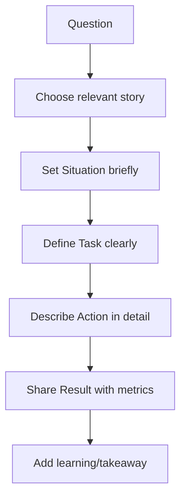
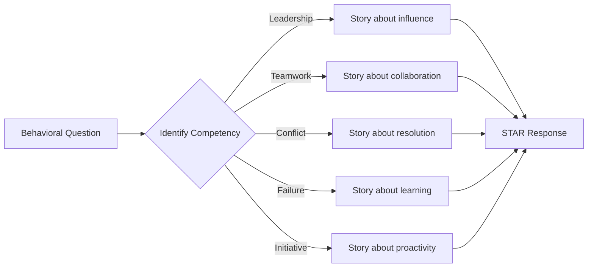
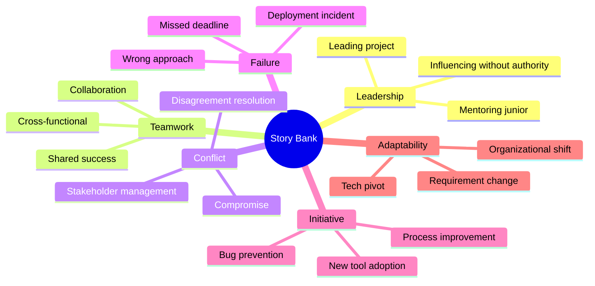

# 86 - Behavioral Interview

## Introduction

Behavioral interviews assess how you've handled real workplace situations in the past, based on the principle that past behavior predicts future behavior. Unlike technical interviews that test specific skills, behavioral interviews evaluate your soft skills, decision-making process, interpersonal abilities, and alignment with company values.

This guide covers the STAR method deep dive, leadership, teamwork, conflict resolution, failure/challenge stories, time management, initiative, adaptability, and common behavioral questions with sample answers. Behavioral questions often carry equal or greater weight than technical questions in hiring decisions — especially for senior and leadership roles.

---

## Learning Roadmap

### Phase 1: Foundation (Days 1-3)
- Master the STAR method framework
- Identify key competencies companies evaluate
- Begin building your story bank
- Reflect on past experiences across different themes

### Phase 2: Story Development (Days 4-6)
- Write 12-15 detailed STAR stories
- Cover leadership, teamwork, conflict, failure, initiative, adaptability
- Quantify results wherever possible
- Practice telling stories concisely (2-3 minutes each)

### Phase 3: Practice (Days 7-10)
- Conduct mock interviews with a partner
- Practice adapting stories to different questions
- Work on delivery: pace, clarity, confidence
- Record and review yourself

---

## Theory Notes

### The STAR Method Deep Dive

#### Situation (20% of time)
Set the context briefly. Include:
- Where you were working
- What project or initiative was happening
- The relevant background

Keep it brief — the interviewer doesn't need a novel.

#### Task (15% of time)
Define your specific responsibility:
- What challenge or problem did you face?
- What was expected of you?
- What constraints did you have?

Focus on YOUR task, not the team's general situation.

#### Action (45% of time)
This is the most important part. Describe:
- What YOU specifically did (not "we")
- Your thought process and reasoning
- Steps you took in order
- Skills you applied
- Challenges you overcame along the way

Use "I" statements, not "we" statements.

#### Result (20% of time)
Share the outcome with specifics:
- Quantifiable metrics (%, $, time saved, users affected)
- What you learned
- How it impacted the team or organization
- Long-term effects if applicable

### Competency Framework

Companies typically evaluate these behavioral competencies:

| Competency | What They're Assessing |
|------------|----------------------|
| Leadership | Can you influence and guide others? |
| Teamwork | Can you collaborate effectively? |
| Conflict Resolution | Can you navigate disagreements? |
| Problem-Solving | Can you analyze and solve complex issues? |
| Initiative | Do you proactively identify and solve problems? |
| Adaptability | Can you handle change and uncertainty? |
| Communication | Can you convey ideas clearly? |
| Accountability | Do you take ownership of outcomes? |
| Growth Mindset | Do you learn from feedback and failures? |
| Time Management | Can you prioritize and meet deadlines? |

### Common Question Patterns
1. **Tell me about a time when...** — Direct behavioral question
2. **Give me an example of...** — Specific instance
3. **How do you handle...** — Approach and philosophy
4. **Describe a situation where...** — Context-driven
5. **What would you do if...** — Hypothetical (less common)

---

## Key Concepts

### Building Your Story Bank

Aim for 12-15 stories that cover these themes:

1. **Leadership without authority** — Influencing outcomes without direct control
2. **Conflict resolution** — Navigating disagreements constructively
3. **Failure and learning** — Taking responsibility and growing
4. **Working under pressure** — Meeting tight deadlines
5. **Team collaboration** — Achieving results with others
6. **Initiative** — Going beyond your role
7. **Difficult decision** — Making tough choices with incomplete information
8. **Mentoring/growth** — Helping others develop
9. **Innovation** — Finding creative solutions
10. **Cross-functional work** — Working with different teams
11. **Scope change** — Adapting to shifting requirements
12. **Customer/user focus** — Prioritizing user needs

### Adapting Stories to Different Questions

One good story can answer multiple questions. Example:

**Story**: You refactored a critical legacy system.

- **Leadership**: "I proposed the refactor and convinced stakeholders..."
- **Initiative**: "I noticed the system was causing frequent outages, so I..."
- **Technical depth**: "I designed a migration strategy that..."
- **Teamwork**: "I organized knowledge-sharing sessions to onboard the team..."

### Quantifying Results

Always try to include metrics:
- **Revenue**: "Increased revenue by 15%"
- **Performance**: "Reduced API response time from 2s to 200ms"
- **Efficiency**: "Cut deployment time from 2 hours to 15 minutes"
- **Quality**: "Reduced production bugs by 60%"
- **Scale**: "Handled 10x traffic during product launch"
- **Users**: "Improved user retention by 25%"
- **Cost**: "Saved $200K annually through optimization"

---

## FAQ (20+ Q&A)

### Q1: How long should a behavioral answer be?
**A:** Aim for 2-3 minutes. The STAR method helps keep you concise. The Action portion should be the longest (about 45% of your answer). If you're going over 4 minutes, you're likely providing too much context or going off on tangents.

### Q2: What if I don't have a perfect example for the question?
**A:** Use your closest example and be transparent. "While I haven't faced that exact situation, here's a similar experience..." or "In my personal project, I encountered..." You can also use academic or volunteer experiences.

### Q3: Should I use "we" or "I" in my answers?
**A:** Primarily use "I" — the interviewer is assessing YOU, not your team. Use "we" to acknowledge team contributions, but always follow with what YOU specifically did. "We decided to..." followed by "I was responsible for implementing..."

### Q4: How do I handle a question I genuinely can't answer?
**A:** Be honest. "I haven't encountered that specific situation, but here's how I would approach it..." or "That's a great question. Let me think about the closest example I have..." The interviewer values honesty over fabricated stories.

### Q5: Can I use the same story for different questions?
**A:** Absolutely. Most strong stories can be adapted to answer 3-5 different questions by emphasizing different aspects. Just make sure you're not giving the exact same answer every time.

### Q6: How do I prepare for "Why should we hire you?"
**A:** Combine your relevant experience with the specific requirements of the role. Reference the job description and show how your skills map directly to their needs. End with your genuine enthusiasm for the opportunity.

### Q7: What if my story doesn't have a perfect outcome?
**A:** You can still use it if you learned something valuable. Focus on what you would do differently, what you learned, and how you've applied that learning. Growth stories are powerful.

### Q8: How do I prepare for follow-up questions?
**A:** Be ready for "Tell me more about..." or "What would you have done differently?" For each story, prepare to dive deeper into any aspect. Think about alternative approaches you considered.

### Q9: Should I mention my company names?
**A:** Yes, naming your previous companies adds credibility. However, if you're under NDA or concerned about confidentiality, you can describe the company type ("a Series B fintech startup" or "a Fortune 500 retail company").

### Q10: How do I handle questions about weaknesses?
**A:** Choose a real weakness (not a disguised strength). Show self-awareness, describe specific steps you've taken to improve, and share measurable progress. Avoid weaknesses that are critical to the role.

### Q11: What's the best way to practice?
**A:** Record yourself answering questions, practice with a friend, use mock interview platforms, and review your answers. Practice until the STAR structure feels natural, not robotic.

### Q12: How do I handle a question about disagreement with my manager?
**A:** Be respectful and professional. Focus on the process of resolving the disagreement, not the content. Show you can advocate for your position while respecting authority. "I shared my concerns with data, my manager considered them, and we found a compromise."

### Q13: How do I talk about a failure without looking bad?
**A:** Take full responsibility (no blaming). Focus on what you learned and how you've changed. Show the concrete steps you've taken since the failure. Interviewers want to see accountability and growth.

### Q14: Can I use personal experiences?
**A:** Professional experiences are preferred, but personal or volunteer experiences are acceptable if relevant. What matters is the behavior and lesson, not the context.

### Q15: How do I answer "Tell me about a time you went above and beyond?"
**A:** Describe a situation where you did more than expected. Show initiative, extra effort, and the positive impact. "I noticed our onboarding documentation was outdated. I spent 3 weekends rewriting it, reducing new hire ramp-up time from 3 weeks to 1 week."

### Q16: What if I had a role with less responsibility than the one I'm applying for?
**A:** Focus on the behaviors and skills you demonstrated, regardless of title. Leadership isn't about titles — it's about influence and impact. "Even though I wasn't a team lead, I organized code reviews and mentored two junior developers."

### Q17: How do I answer "How do you handle stress?"
**A:** Give a specific example of working under pressure. Describe your coping strategies (prioritization, communication, taking breaks). Show that you maintain quality and composure under stress.

### Q18: How should I prepare for Amazon's Leadership Principles questions?
**A:** Amazon has 16 leadership principles. Prepare 2-3 stories for each principle. Use their format: "Tell me about a time when you [action related to leadership principle]."

### Q19: What if the interviewer seems disengaged?
**A:** Stay focused and deliver your answer clearly. Don't try to compensate by talking more. Keep answers concise. After your answer, ask a clarifying question to re-engage.

### Q20: How do I handle a question about a topic I'm not comfortable discussing?
**A:** You can redirect. "I haven't had that specific experience, but here's a related example..." You're never obligated to share personal information beyond what you're comfortable with.

---

## Hands-on Practice

### Exercise 1: Story Development
For each theme below, write a complete STAR story:

**Theme**: Conflict Resolution
**Situation**: At my previous company, two senior engineers disagreed on the architectural approach for a new payment system.
**Task**: As the technical lead, I needed to facilitate a decision that both engineers could commit to.
**Action**: I scheduled a meeting where each presented their approach with pros/cons. I asked probing questions about scalability, maintenance cost, and timeline. I identified common ground and proposed a hybrid approach.
**Result**: Both engineers agreed on the hybrid solution. The system launched on time, handled $2M in monthly transactions, and was later used as a reference architecture for the company.

### Exercise 2: Question-Story Mapping
Map your stories to common questions:
- Tell me about a time you had to make a difficult decision
- Describe a situation where you had to persuade others
- Give me an example of when you failed
- How do you handle competing priorities?
- Tell me about a time you showed leadership

### Exercise 3: Time Your Answers
Practice telling each story in under 3 minutes. Use a timer. If you're going over, cut context and focus on the Action and Result.

---

## FAANG Behavioral Questions

### Google
1. Tell me about a time you had to influence without authority.
2. Describe a time you worked on a cross-functional team with conflicting priorities.
3. How do you handle ambiguity in requirements?
4. Tell me about a time you improved a process that others accepted as "good enough."

### Meta
5. Move fast and tell me about a time you had to balance speed with quality.
6. Describe a time you had to make a decision that was unpopular but correct.
7. How do you handle situations where you disagree with the team direction?
8. Tell me about a time you showed boldness in your approach.

### Amazon
9. Tell me about a time you simplified a complex process. (Invent and Simplify)
10. Describe when you took ownership of something outside your job description. (Ownership)
11. Tell me about a time you delivered results despite constraints. (Deliver Results)
12. How have you developed your team members? (Develop the Best)

### Apple
13. Tell me about a time you pushed for a higher standard of quality.
14. Describe a situation where you had to maintain confidentiality.
15. How do you handle working on multiple projects simultaneously?

### Microsoft
16. Tell me about a time you helped a colleague succeed.
17. Describe a time you had to make a trade-off between competing priorities.
18. How do you stay current with technology trends?

### Netflix
19. Tell me about a time you made a decision that wasn't popular but was right.
20. How do you handle situations where you disagree with leadership?

---

## Common Mistakes

1. **No specific example**: Speaking in generalities instead of concrete situations
2. **Taking too long**: Going over 4 minutes on a single answer
3. **Using "we" excessively**: Hiding your individual contribution
4. **Blaming others**: Not taking responsibility for outcomes
5. **No quantifiable results**: Missing the impact of your actions
6. **Negative tone**: Speaking poorly about former colleagues or companies
7. **Over-rehearsing**: Sounding robotic or scripted
8. **Not answering the question**: Going on tangents
9. **Missing the "why"**: Not explaining your reasoning
10. **Forgetting the "learning"**: Not mentioning what you gained from the experience

---

## Best Practices

### Story Selection
- Choose stories with clear, positive outcomes
- Include quantifiable results wherever possible
- Show a range of competencies across your stories
- Have stories from different roles and companies
- Include some recent stories (within last 2-3 years)

### Delivery
- Speak clearly and at a moderate pace
- Use natural language, not memorized scripts
- Maintain eye contact (or look at the camera in virtual)
- Show enthusiasm for your work
- Pause briefly before answering to gather thoughts

### Follow-Up Questions
- Be prepared to dive deeper into any part of your story
- Have alternative approaches ready if asked "What would you do differently?"
- Be ready to discuss what you'd do now with what you've learned

---

## Cheat Sheet

### STAR Method Template
```
SITUATION (30 sec):
"In my role at [Company], [brief context of the situation]"

TASK (20 sec):
"I was responsible for [specific challenge or goal]"

ACTION (60-90 sec):
"First, I [step 1]. Then, I [step 2]. I also [step 3].
When [obstacle], I [how I handled it].
I used [skill/tool] to [specific action]"

RESULT (30 sec):
"As a result, [quantifiable outcome]. This led to [broader impact].
I learned [lesson or growth]"
```

### Power Phrases for Behavioral Answers
```
"I took initiative to..."
"I analyzed the situation by..."
"I collaborated with... to..."
"I implemented a solution that..."
"I communicated my approach by..."
"I measured success through..."
"The outcome was..."
"I learned that..."
```

### Question Categories and Sample Stories
```
Leadership:      "I proposed..." + influence + outcome
Teamwork:        "I collaborated with..." + shared goal + result
Conflict:        "I disagreed with..." + resolution process + outcome
Failure:         "I failed when..." + responsibility + learning + improvement
Initiative:      "I noticed..." + self-started action + impact
Pressure:        "We had a tight deadline..." + prioritization + delivery
Adaptability:    "When the requirements changed..." + adjustment + success
Mentoring:       "I helped [person] grow..." + specific actions + their outcome
```

---

## Flash Cards (20)

### Card 1
**Q:** What does STAR stand for?
**A:** Situation (context), Task (your responsibility), Action (what YOU did), Result (outcome with metrics). It's the framework for structuring behavioral interview responses.

### Card 2
**Q:** How long should a behavioral answer be?
**A:** 2-3 minutes. The Action portion should take the longest (45%). If you're over 4 minutes, you're providing too much context or going off-topic.

### Card 3
**Q:** Why is the "Action" part the most important?
**A:** It's where you describe YOUR specific contributions, reasoning, and skills. The interviewer is assessing you, not your team. Use "I" not "we."

### Card 4
**Q:** How do you handle a question about failure?
**A:** Take responsibility, describe what happened, explain what you learned, and show specific steps you've taken to improve. Growth is more important than the failure itself.

### Card 5
**Q:** What if you don't have a perfect example for a question?
**A:** Use your closest example and be transparent. "While I haven't faced that exact situation, here's a related experience..." Honesty is valued over fabrication.

### Card 6
**Q:** How many STAR stories should you prepare?
**A:** Prepare 12-15 stories that cover leadership, teamwork, conflict, failure, initiative, adaptability, and time management. Most stories can answer 3-5 different questions.

### Card 7
**Q:** Should you use "I" or "we" in answers?
**A:** Primarily "I" — the interviewer is assessing you. Use "we" to acknowledge team contributions but follow with "I specifically [did what]."

### Card 8
**Q:** How do you quantify results when you don't have numbers?
**A:** Use qualitative outcomes: "The process was adopted team-wide," "Reduced complaints by half," or "Received positive feedback from leadership." Numbers are preferred but not always available.

### Card 9
**Q:** What is the most common behavioral interview mistake?
**A:** Speaking in generalities instead of specific examples. "I'm a good team player" is weak; "I collaborated with the design team to launch feature X, resulting in Y" is strong.

### Card 10
**Q:** How do you handle "Tell me about a time you disagreed with your manager"?
**A:** Be respectful, focus on the resolution process, not the disagreement. "I shared my data-backed concerns, my manager considered them, and we found a compromise that..."

### Card 11
**Q:** What should you do before a behavioral interview?
**A:** Review your story bank, practice delivering stories in 2-3 minutes, research the company's values, prepare questions, and get a good night's sleep.

### Card 12
**Q:** How do you answer "Why should we hire you?" without arrogance?
**A:** Connect your specific experience to their specific needs. Reference the job description. Show genuine enthusiasm. "Based on your requirements for X and Y, my experience with Z directly addresses those needs."

### Card 13
**Q:** What is the difference between behavioral and situational questions?
**A:** Behavioral: "Tell me about a time when..." (past experience). Situational: "What would you do if..." (hypothetical). Behavioral carries more weight because past behavior predicts future behavior.

### Card 14
**Q:** How do you handle a question about a topic you're uncomfortable with?
**A:** Redirect to a related experience you're comfortable discussing. "I haven't had that specific experience, but here's a related example..." You control what you share.

### Card 15
**Q:** Can you prepare for curveball behavioral questions?
**A:** Have diverse stories covering many themes. Focus on transferable experiences. Take a moment to think before answering. "That's an interesting question — let me think about the closest example I have."

### Card 16
**Q:** How do you show leadership when you don't have a leadership title?
**A:** Demonstrate influence, initiative, and impact. "I noticed [problem], proposed a solution, got buy-in, and led the implementation — even though it wasn't my formal responsibility."

### Card 17
**Q:** What makes a behavioral answer memorable?
**A:** Specificity, quantifiable results, and genuine emotion. "I saved the company $200K" is more memorable than "I helped optimize costs." Show passion for your work.

### Card 18
**Q:** How do you handle "How do you handle stress?" without giving a hypothetical answer?
**A:** Give a specific example of working under pressure. Describe your prioritization approach, how you communicated, and the positive outcome. Show composure and structured thinking.

### Card 19
**Q:** What if you had a very short tenure at a company?
**A:** Focus on what you accomplished in the time you were there. If the departure was amicable, briefly mention the reason. Focus on your growth and contributions.

### Card 20
**Q:** How should you end your behavioral interview responses?
**A:** End with the impact/result and a brief lesson learned. "This experience taught me the importance of [learning], and I've applied it to [subsequent situation]."

---

## Mind Map

```
Behavioral Interview
├── STAR Method
│   ├── Situation — Set context (30 sec)
│   ├── Task — Your responsibility (20 sec)
│   ├── Action — YOUR specific steps (60-90 sec)
│   └── Result — Outcome + metrics (30 sec)
├── Key Competencies
│   ├── Leadership
│   ├── Teamwork
│   ├── Conflict Resolution
│   ├── Initiative
│   ├── Adaptability
│   ├── Time Management
│   └── Growth Mindset
├── Story Bank (12-15 stories)
│   ├── Leadership examples
│   ├── Teamwork examples
│   ├── Conflict resolution
│   ├── Failure and learning
│   ├── Initiative examples
│   └── Adaptability examples
├── Common Questions
│   ├── Tell me about yourself
│   ├── Why this company?
│   ├── Strengths/weaknesses
│   ├── Failure stories
│   ├── Leadership examples
│   └── Why should we hire you?
├── Delivery
│   ├── Clear and concise
│   ├── Specific examples
│   ├── Quantified results
│   ├── Positive framing
│   └── Natural conversation
└── Preparation
    ├── Story development
    ├── Mock interviews
    ├── Company research
    ├── Question mapping
    └── Self-review
```

---

## Mermaid Diagrams

### STAR Method Response Flow


### Behavioral Competency Matrix


### Story Bank Coverage Map


---

## Code Examples

### Story Bank Document (Markdown)

```markdown
# My Behavioral Story Bank

## 1. Leadership: Leading Without Authority
**S**: As a mid-level engineer at Company X, our team lacked coding standards.
**T**: I wanted to establish consistent practices without formal authority.
**A**: I created a lightweight coding guidelines document, shared it for
    feedback, incorporated suggestions, and organized bi-weekly code
    review sessions. I also set up automated linting.
**R**: Code review time decreased 30%. New onboarding time reduced from
    2 weeks to 1 week. The guidelines were adopted org-wide.

## 2. Conflict: Architectural Disagreement
**S**: Two senior engineers disagreed on database choice for a new service.
**T**: As tech lead, I needed to facilitate a decision.
**A**: I created a comparison matrix evaluating performance, cost, team
    familiarity, and migration complexity. We discussed trade-offs
    in a structured meeting.
**R**: We chose PostgreSQL. The service launched on time and the decision
    framework became a template for future architecture decisions.

## 3. Failure: Production Incident
**S**: I deployed code that caused a 30-minute outage affecting 10K users.
**T**: I needed to own the incident and prevent recurrence.
**A**: I rolled back immediately, communicated with stakeholders, led
    the post-mortem, and implemented chaos engineering practices.
**R**: Zero similar outages in 18 months. The incident led to 40 new
    test cases and a reliability improvement program.

## 4. Initiative: Process Improvement
**S**: Our deployment process took 2 hours and was error-prone.
**T**: I noticed this was blocking the team's velocity.
**A**: I researched CI/CD best practices, proposed a pipeline design,
    got buy-in, and implemented GitHub Actions with automated
    testing and deployment.
**R**: Deployment time reduced to 15 minutes. Error rate dropped 90%.
    The pipeline became a model for other teams.

## 5. Adaptability: Requirement Pivot
**S**: Mid-sprint, the product team changed requirements for a critical feature.
**T**: I needed to re-plan the sprint without losing stakeholder trust.
**A**: I quickly assessed scope changes, identified what could be
    delivered vs deferred, communicated the plan, and reorganized
    the team's priorities.
**R**: Delivered the MVP on time. The adapted feature was well-received
    and the deferred items were prioritized for the next sprint.
```

---

## Projects

### Project 1: Personal Story Bank
- Write 12-15 STAR stories covering all key competencies
- Include quantifiable results in each story
- Practice telling each story in 2-3 minutes
- **Skills**: Self-reflection, narrative building

### Project 2: Mock Interview Series
- Conduct 3+ mock behavioral interviews
- Get feedback from different interviewers
- Record and review yourself
- Refine stories based on feedback
- **Skills**: Communication, delivery, confidence

### Project 3: Company-Specific Preparation
- For each target company, map stories to their values
- Research their interview process and common questions
- Prepare company-specific answers
- **Skills**: Research, tailoring, strategic preparation

---

## Resources

### Books
- *Cracking the Coding Interview* by Gayle McDowell (behavioral section)
- *The STAR Interview* by Misha Yurchenko
- *Never Split the Difference* by Chris Voss
- *How to Win Friends and Influence People* by Dale Carnegie

### Practice
- [interviewing.io](https://interviewing.io) — Mock behavioral interviews
- [Big Interview](https://biginterview.com) — Practice platform
- [Pramp](https://pramp.com) — Free peer mock interviews

---

## Checklist

### Before Your Behavioral Interview
- [ ] Written 12-15 STAR stories covering all competencies
- [ ] Practiced each story in under 3 minutes
- [ ] Can adapt stories to different questions
- [ ] Have quantified results for each story
- [ ] Researched company values and culture
- [ ] Practiced with a mock interviewer
- [ ] Recorded and reviewed myself
- [ ] Prepared questions to ask the interviewer
- [ ] Reviewed job description and mapped experience
- [ ] Got a good night's sleep

---

## Difficulty Rating

| Topic | Difficulty | Interview Frequency |
|-------|-----------|-------------------|
| STAR Method | ★★☆☆☆ | Very High |
| Leadership Stories | ★★★☆☆ | Very High |
| Conflict Resolution | ★★★☆☆ | Very High |
| Failure Stories | ★★★☆☆ | Very High |
| Initiative Examples | ★★★☆☆ | High |
| Time Management | ★★☆☆☆ | High |
| Adaptability | ★★★☆☆ | High |
| Teamwork Stories | ★★☆☆☆ | Very High |
| Curveball Questions | ★★★★☆ | Medium |
| Company-Specific | ★★★☆☆ | High |

---

## Summary

Behavioral interviews assess your past behavior to predict future performance. Key takeaways:

1. **The STAR method is your framework** — it structures responses and keeps you concise
2. **Specificity wins** — concrete examples beat generalizations every time
3. **Quantify results** — numbers make your impact memorable and credible
4. **Use "I" not "we"** — the interviewer is assessing YOU
5. **Own your failures** — accountability and growth matter more than perfection
6. **Prepare 12-15 stories** — they cover all competencies and can be adapted
7. **Practice delivery** — natural conversation, not memorized scripts
8. **Research the company** — tailor your stories to their values
9. **Show genuine enthusiasm** — passion for your work is contagious
10. **Follow up** — a thoughtful thank-you email leaves a lasting impression
