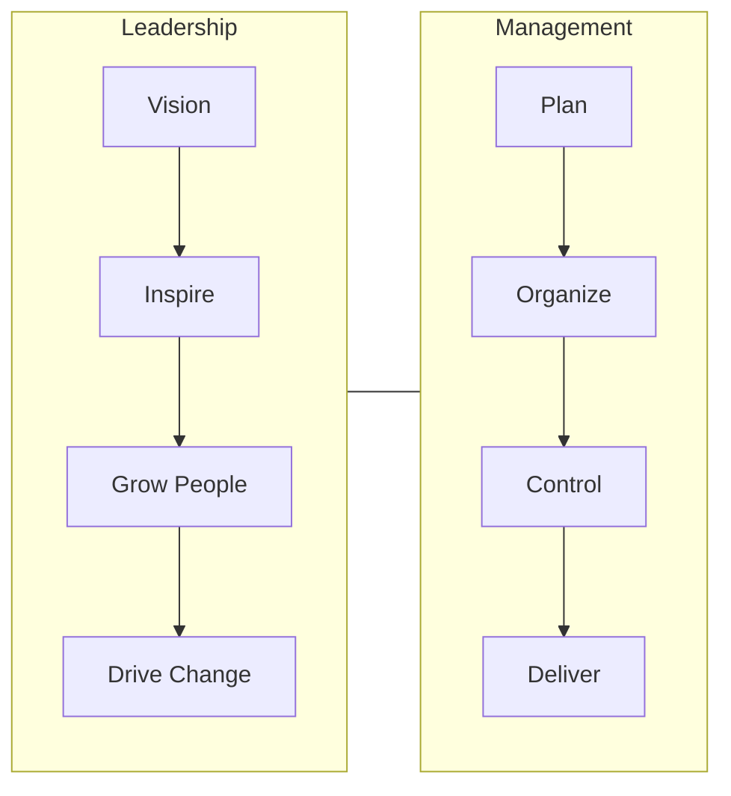
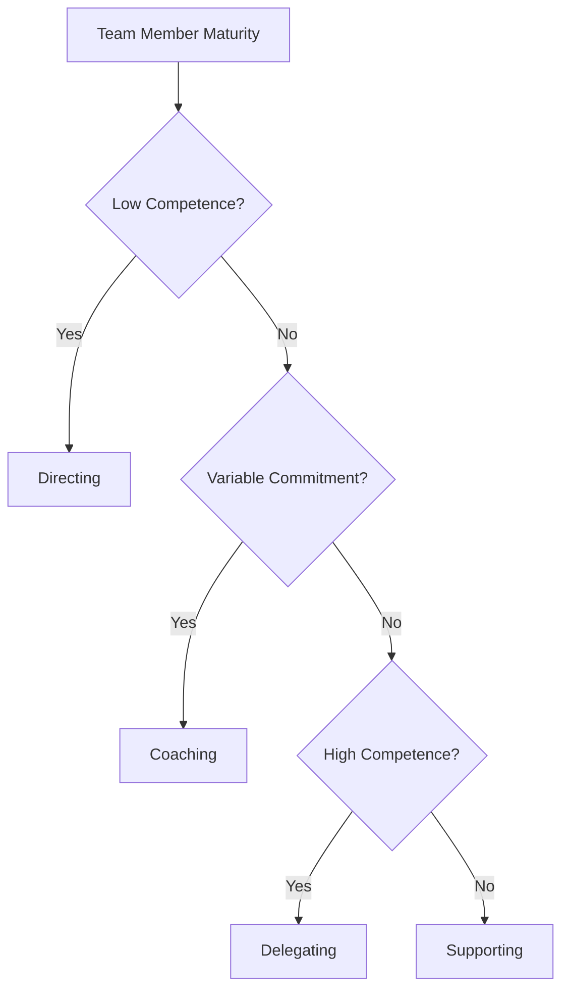
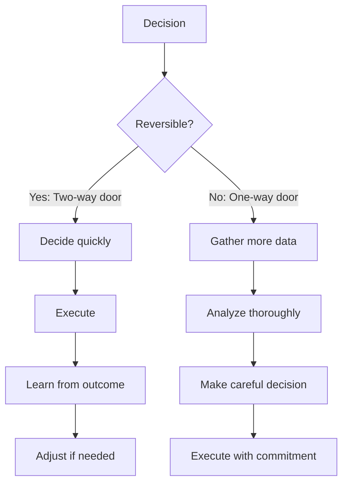

# 88 - Leadership

## Introduction

Leadership in tech isn't about titles — it's about influence, decision-making, and empowering others to do their best work. Whether you're a senior engineer mentoring juniors, a tech lead driving architectural decisions, or an engineering manager building teams, leadership principles are essential for career growth and interview success.

This guide covers Amazon's Leadership Principles, Google's leadership attributes, management vs leadership, situational leadership, servant leadership, technical leadership, conflict resolution, and decision-making frameworks. Leadership questions are common at every level, and demonstrating strong leadership potential is often the differentiator between good and great candidates.

---

## Learning Roadmap

### Phase 1: Foundation (Days 1-3)
- Learn Amazon's 16 Leadership Principles
- Understand different leadership styles
- Identify your natural leadership tendencies
- Begin reflecting on leadership experiences

### Phase 2: Story Development (Days 4-6)
- Write 15+ leadership-focused STAR stories
- Map stories to leadership principles
- Practice articulating leadership decisions
- Prepare for leadership interview questions

### Phase 3: Advanced Practice (Days 7-10)
- Conduct mock leadership interviews
- Practice situational leadership scenarios
- Develop your leadership philosophy
- Refine answers for senior/management roles

---

## Theory Notes

### Amazon's 16 Leadership Principles

1. **Customer Obsession** — Start with the customer and work backwards
2. **Ownership** — Think long-term; act on behalf of the entire company
3. **Invent and Simplify** — Innovate and find ways to simplify
4. **Are Right, A Lot** — Strong judgment and good instincts
5. **Learn and Be Curious** — Never stop learning
6. **Hire and Develop the Best** — Raise the performance bar
7. **Insist on the Highest Standards** — Relentlessly high standards
8. **Think Big** — Create and communicate a bold direction
9. **Bias for Action** — Speed matters in business
10. **Frugality** — Accomplish more with less
11. **Earn Trust** — Listen attentively, speak candidly
12. **Dive Deep** — Stay connected to details
13. **Have Backbone; Disagree and Commit** — Challenge decisions respectfully
14. **Deliver Results** — Focus on key inputs and deliver with quality

### Management vs Leadership

| Aspect | Management | Leadership |
|--------|-----------|------------|
| Focus | Processes and systems | People and vision |
| Power | Authority-based | Influence-based |
| Goal | Efficiency and order | Change and growth |
| Approach | Plan and organize | Inspire and motivate |
| Timeframe | Short to medium term | Long term |
| Risk | Minimize risk | Take calculated risks |
| Questions | How and when? | What and why? |

Great leaders often combine both — managing processes while inspiring people.

### Leadership Styles

#### Situational Leadership
Adapt your style based on the team member's maturity and the situation:

| Maturity Level | Leadership Style | Approach |
|---------------|-----------------|----------|
| Low competence, high commitment | Directing | Tell them what to do |
| Some competence, low commitment | Coaching | Explain decisions, solicit input |
| High competence, variable commitment | Supporting | Facilitate and support decisions |
| High competence, high commitment | Delegating | Turn over responsibility |

#### Servant Leadership
Leader serves the team by:
- Removing obstacles and blockers
- Providing resources and support
- Protecting the team from distractions
- Creating an environment for success
- Developing team members' skills

#### Technical Leadership
Technical leaders:
- Set technical direction and architecture standards
- Mentor engineers on best practices
- Drive technical debt reduction
- Evaluate and adopt new technologies
- Make build-vs-buy decisions
- Balance technical excellence with business needs

### Decision-Making Frameworks

#### DACI Framework
- **D**river: Person who drives the decision to completion
- **A**pprover: Person who makes the final decision
- **C**ontributors: People who provide input
- **I**nformed: People who need to know the outcome

#### RAPID Framework
- **R**ecommend: Propose a course of action
- **A**gree: Must agree before proceeding
- **P**erform: Execute the decision
- **I**nput: Provide information
- **D**ecide: Make the final call

#### One-Way vs Two-Way Door Decisions
- **One-way door**: Irreversible decisions. Take time, gather data, be thorough.
- **Two-way door**: Reversible decisions. Make them quickly, learn from outcomes.

---

## Key Concepts

### Leadership Without Authority
You don't need a title to lead. Ways to demonstrate leadership:
- Propose solutions to problems you notice
- Mentor junior team members
- Drive adoption of best practices
- Facilitate knowledge sharing
- Take ownership of cross-cutting concerns
- Influence decisions with data and reasoning

### Building Trust
- **Consistency**: Do what you say you'll do
- **Transparency**: Share information openly
- **Competence**: Demonstrate expertise
- **Vulnerability**: Admit mistakes and ask for help
- **Empathy**: Understand others' perspectives
- **Follow-through**: Complete what you start

### Giving Effective Feedback
- **Specific**: Address behavior, not personality
- **Timely**: Give feedback close to the event
- **Balanced**: Include positive and constructive
- **Actionable**: Suggest concrete improvements
- **Private**: Negative feedback one-on-one
- **Regular**: Make it a habit, not an event

### Handling Conflict as a Leader
1. Address issues early — don't let them fester
2. Listen to all perspectives
3. Focus on interests, not positions
4. Find common ground
5. Make a decision if consensus isn't possible
6. Communicate the decision and rationale
7. Follow up to ensure resolution

---

## FAQ (20+ Q&A)

### Q1: What is the difference between a manager and a leader?
**A:** A manager focuses on processes, efficiency, and execution. A leader focuses on vision, inspiration, and people. The best professionals combine both — managing processes while inspiring growth. You can lead without a title.

### Q2: How do I answer leadership questions without a leadership title?
**A:** Focus on influence, initiative, and impact. "Even though I wasn't a team lead, I organized code reviews, mentored two junior developers, and proposed the architecture for a critical feature." Leadership is behavior, not title.

### Q3: What is servant leadership?
**A:** Servant leadership means the leader's primary role is to serve the team — removing obstacles, providing resources, protecting from distractions, and creating an environment for success. It's about empowering others, not commanding.

### Q4: How do I handle a situation where I disagree with my manager?
**A:** Present your concerns with data and reasoning. Respectfully disagree. If the decision goes against your recommendation, commit fully. "I shared my analysis, my manager considered it, and when they decided differently, I implemented the decision with full commitment."

### Q5: What is situational leadership?
**A:** Situational leadership adapts your style based on the team member's competence and commitment. New employees need directing; experienced employees need delegating. Effective leaders flex their approach.

### Q6: How do I demonstrate ownership in my current role?
**A:** Think beyond your immediate tasks. Take responsibility for outcomes, not just activities. Follow through on commitments. Proactively identify and solve problems. Communicate proactively about risks and progress.

### Q7: How do I balance technical depth with leadership responsibilities?
**A:** Stay technically current through code reviews, architecture discussions, and hands-on projects. Delegate operational tasks. Focus your technical time on high-impact decisions and mentoring.

### Q8: What is "disagree and commit"?
**A:** You respectfully voice your disagreement with data and reasoning. Once a decision is made, you commit fully and execute without undermining the decision. It's about honest dissent followed by unified execution.

### Q9: How do I handle a team member who is underperforming?
**A:** 1) Have a private conversation to understand the situation. 2) Set clear expectations and support plan. 3) Provide regular feedback and resources. 4) If no improvement, escalate appropriately. Focus on the behavior, not the person.

### Q10: How do I build trust with a new team?
**A:** Listen before speaking. Learn the team's context and history. Follow through on small commitments first. Be transparent about what you know and don't know. Show competence through quick wins. Be consistent.

### Q11: What is the best way to give negative feedback?
**A:** Be specific about the behavior, not the person. Use the SBI model: Situation, Behavior, Impact. Offer suggestions for improvement. Follow up to support growth. Do it privately and with empathy.

### Q12: How do I make decisions with incomplete information?
**A:** Use the "one-way vs two-way door" framework. For two-way doors (reversible), decide quickly and learn. For one-way doors (irreversible), gather more data. Document assumptions and revisit if they prove wrong.

### Q13: How do I demonstrate "Think Big"?
**A:** Propose bold initiatives that align with company strategy. Connect daily work to larger vision. Challenge incremental thinking. Present innovative solutions that could transform processes or products.

### Q14: What is "Bias for Action"?
**A:** Speed matters. Make decisions with 70% of the information you wish you had. Calculated risk-taking is better than analysis paralysis. Learn from mistakes quickly. Bias for action doesn't mean being reckless.

### Q15: How do I handle a crisis as a leader?
**A:** 1) Stay calm. 2) Communicate transparently. 3) Focus on what you can control. 4) Make quick decisions. 5) Support your team. 6) Conduct a post-mortem. 7) Implement changes to prevent recurrence.

### Q16: How do I develop other leaders?
**A:** Delegate challenging work. Provide stretch opportunities. Give honest feedback. Mentor on leadership principles, not just technical skills. Create space for them to make decisions and learn from mistakes.

### Q17: What is "Earn Trust"?
**A:** Listen attentively, speak candidly, and treat others respectfully. Admit mistakes. Be vulnerable about what you don't know. Follow through consistently. Trust is built through actions over time.

### Q18: How do I handle competing priorities from different stakeholders?
**A:** Understand each stakeholder's goals and constraints. Find common ground. Make trade-offs transparent. Use data to support prioritization decisions. Communicate clearly about what's being deferred and why.

### Q19: What is "Dive Deep"?
**A:** Stay connected to details. Review metrics regularly. Understand the root cause, not just symptoms. Don't rely solely on summaries — verify. Leaders who dive deep make better decisions.

### Q20: How do I show "Hire and Develop the Best"?
**A:** Participate actively in hiring. Set high standards. Invest in mentoring. Create development plans. Recognize and reward high performance. Address underperformance promptly. Build a team culture of growth.

---

## Hands-on Practice

### Practice Exercise 1: Leadership Principle Mapping

Map your stories to Amazon's Leadership Principles:

| Leadership Principle | My Story | Outcome |
|---------------------|----------|---------|
| Customer Obsession | [story] | [result] |
| Ownership | [story] | [result] |
| Invent and Simplify | [story] | [result] |
| Are Right, A Lot | [story] | [result] |
| Deliver Results | [story] | [result] |

### Practice Exercise 2: Situational Leadership Scenarios

**Scenario 1**: A junior developer is struggling with a complex task.
**Approach**: Directing — provide clear instructions, check in frequently.

**Scenario 2**: A senior engineer has a different technical approach than you.
**Approach**: Supporting — discuss trade-offs, let them have input, support their decision if reasonable.

**Scenario 3**: A team member consistently underperforms.
**Approach**: Coaching — understand root cause, provide support, set clear expectations.

### Practice Exercise 3: Decision-Making Practice

Practice the "one-way vs two-way door" framework:
- Should we adopt this new database? (One-way — hard to change)
- Should we try this testing framework on one project? (Two-way — easy to revert)
- Should we hire this candidate? (Two-way within probation, one-way after)

---

## FAANG Behavioral Questions

### Amazon (Leadership Principles)
1. Tell me about a time you went above and beyond for a customer. (Customer Obsession)
2. Describe a time you took ownership of something outside your role. (Ownership)
3. Tell me about when you had to make a decision quickly with limited data. (Bias for Action)
4. How have you raised the bar in your team's quality? (Insist on the Highest Standards)
5. Tell me about a time you simplified a complex process. (Invent and Simplify)

### Google
6. Tell me about a time you had to influence without authority.
7. How do you help your team make decisions?
8. Describe a time you set a bold direction for your team.

### Meta
9. Tell me about a time you had to move fast and make a tough call.
10. How do you balance building for scale vs shipping quickly?

### Apple
11. How do you push for higher quality standards?
12. Tell me about a time you paid extreme attention to detail.

### Microsoft
13. How do you help others succeed?
14. Tell me about a time you had to make a difficult trade-off.

---

## Common Mistakes

1. **Confusing management with leadership**: Leadership is influence, not authority
2. **Not taking ownership**: Blaming others or circumstances
3. **Being indecisive**: Over-analyzing reversible decisions
4. **Ignoring team dynamics**: Focusing only on tasks, not people
5. **Not giving feedback**: Avoiding difficult conversations
6. **Micromanaging**: Not trusting your team
7. **Not admitting mistakes**: Trying to appear infallible
8. **Ignoring stakeholder communication**: Not keeping people informed
9. **Focusing only on technical**: Neglecting people and process
10. **Not developing others**: Hoarding knowledge instead of sharing

---

## Best Practices

### For Technical Leaders
- Set clear technical direction and standards
- Mentor engineers regularly
- Drive technical debt reduction
- Balance innovation with reliability
- Make build-vs-buy decisions thoughtfully
- Stay technically current

### For All Leaders
- Communicate vision and goals clearly
- Give regular, specific feedback
- Create psychological safety
- Recognize and celebrate achievements
- Address conflicts early
- Lead by example
- Invest in developing others

---

## Cheat Sheet

### Amazon Leadership Principles (16)
```
Customer Obsession     — Start with the customer
Ownership              — Think long-term, act on behalf of company
Invent and Simplify    — Innovate and find ways to simplify
Are Right, A Lot       — Strong judgment and good instincts
Learn and Be Curious   — Never stop learning
Hire and Develop Best  — Raise the performance bar
Insist on High Standards — Relentlessly high standards
Think Big              — Create and communicate bold direction
Bias for Action        — Speed matters
Frugality              — Accomplish more with less
Earn Trust             — Listen, speak candidly, treat respectfully
Dive Deep              — Stay connected to details
Have Backbone          — Challenge decisions respectfully
Deliver Results        — Focus on key inputs
```

### Decision-Making Quick Reference
```
One-way door (irreversible):  Take time, gather data, be thorough
Two-way door (reversible):    Decide quickly, learn from outcomes
70% information:              Good enough to decide
Disagree and commit:          Voice disagreement, then execute fully
```

---

## Flash Cards (20)

### Card 1
**Q:** What is the difference between management and leadership?
**A:** Management focuses on processes and efficiency. Leadership focuses on vision and people. You can lead without a title and manage without leading.

### Card 2
**Q:** What is servant leadership?
**A:** The leader's primary role is to serve the team — removing obstacles, providing resources, and creating an environment for success. It's about empowering, not commanding.

### Card 3
**Q:** What is "disagree and commit"?
**A:** Respectfully voice your disagreement with data. Once a decision is made, commit fully and execute. It's about honest dissent followed by unified action.

### Card 4
**Q:** What is "bias for action"?
**A:** Make decisions with 70% of information. Speed matters. Calculated risk-taking beats analysis paralysis. Learn from mistakes quickly.

### Card 5
**Q:** How do you lead without a formal title?
**A:** Through influence, initiative, and impact. Propose solutions, mentor others, drive best practices, take ownership, and influence decisions with data.

### Card 6
**Q:** What is situational leadership?
**A:** Adapting your leadership style based on the team member's competence and commitment. New employees need direction; experienced employees need delegation.

### Card 7
**Q:** What is the DACI decision framework?
**A:** Driver (drives to completion), Approver (makes final decision), Contributors (provide input), Informed (need to know outcome).

### Card 8
**Q:** How do you give effective negative feedback?
**A:** Be specific about behavior, not personality. Use SBI: Situation, Behavior, Impact. Be timely, private, and offer actionable suggestions.

### Card 9
**Q:** How do you build trust with a new team?
**A:** Listen first. Learn context. Follow through on small commitments. Be transparent. Show competence. Be consistent over time.

### Card 10
**Q:** What is "customer obsession"?
**A:** Starting with the customer and working backwards. Prioritizing customer needs over competitor focus. Acting on behalf of the customer even when inconvenient.

### Card 11
**Q:** How do you handle a team member who is underperforming?
**A:** Have a private conversation, understand root cause, set clear expectations, provide support, follow up. Focus on behavior, not person.

### Card 12
**Q:** What is "think big"?
**A:** Creating and communicating a bold direction. Challenging incremental thinking. Proposing initiatives that could transform processes or products.

### Card 13
**Q:** How do you handle competing priorities?
**A:** Understand each stakeholder's goals, find common ground, make trade-offs transparent, use data for prioritization, communicate about deferrals.

### Card 14
**Q:** What is "earn trust"?
**A:** Listen attentively, speak candidly, treat others respectfully. Admit mistakes. Be vulnerable. Follow through consistently. Trust is built through actions.

### Card 15
**Q:** How do you develop other leaders?
**A:** Delegate challenging work, provide stretch opportunities, give honest feedback, mentor on leadership principles, create space for decision-making.

### Card 16
**Q:** What is "dive deep"?
**A:** Stay connected to details. Review metrics. Understand root causes. Don't rely solely on summaries. Leaders who dive deep make better decisions.

### Card 17
**Q:** How do you handle a crisis?
**A:** Stay calm, communicate transparently, focus on what you control, make quick decisions, support your team, conduct post-mortem, implement changes.

### Card 18
**Q:** What is "insist on the highest standards"?
**A:** Setting and maintaining relentlessly high standards. Continuously raising the bar. Never settling for "good enough."

### Card 19
**Q:** How do you balance technical depth with leadership?
**A:** Stay current through code reviews and architecture discussions. Delegate operational tasks. Focus technical time on high-impact decisions.

### Card 20
**Q:** What makes an effective leader?
**A:** Vision, empathy, communication, accountability, decision-making, and developing others. The best leaders serve their teams and create environments for success.

---

## Mind Map

```
Leadership
├── Leadership Styles
│   ├── Situational (adapt to context)
│   ├── Servant (serve the team)
│   ├── Technical (set technical direction)
│   └── Transformational (inspire change)
├── Amazon Leadership Principles
│   ├── Customer Obsession
│   ├── Ownership
│   ├── Invent and Simplify
│   ├── Are Right, A Lot
│   ├── Hire and Develop Best
│   ├── Insist on High Standards
│   ├── Think Big
│   ├── Bias for Action
│   ├── Earn Trust
│   ├── Dive Deep
│   ├── Have Backbone
│   └── Deliver Results
├── Decision-Making
│   ├── DACI Framework
│   ├── One-way vs Two-way doors
│   ├── 70% information rule
│   └── Disagree and commit
├── Key Skills
│   ├── Communication
│   ├── Conflict Resolution
│   ├── Feedback
│   ├── Mentoring
│   ├── Trust Building
│   └── Stakeholder Management
└── Practices
    ├── Lead by example
    ├── Invest in people
    ├── Communicate vision
    ├── Address conflicts early
    └── Celebrate achievements
```

---

## Mermaid Diagrams

### Leadership vs Management


### Situational Leadership Model


### One-Way vs Two-Way Door


---

## Code Examples

### Leadership Philosophy Document

```markdown
# My Leadership Philosophy

## Core Beliefs
1. **People first**: Great outcomes come from empowered, supported teams
2. **Transparency**: Share context so people can make good decisions
3. **Growth mindset**: Mistakes are learning opportunities
4. **Ownership**: Take responsibility for outcomes, not just activities
5. **Simplicity**: Choose simple solutions over complex ones

## How I Lead
- I listen before speaking
- I give context, not just instructions
- I delegate outcomes, not tasks
- I give regular, specific feedback
- I celebrate wins and learn from failures

## Decision-Making Approach
- Use "one-way vs two-way door" framework
- Decide two-way doors quickly
- Gather data for one-way doors
- Communicate the "why" behind decisions
- Commit fully once decided

## How I Develop Others
- Assign stretch projects
- Provide mentoring and coaching
- Create psychological safety
- Recognize achievements publicly
- Give honest, constructive feedback
```

### Leadership Scenario Practice

```markdown
## Scenario 1: Junior Developer Struggling
**Situation**: A junior developer has been struggling with a complex task for 3 days.
**Approach**: Directing + Coaching
**Actions**:
1. Have a private conversation to understand the blocker
2. Break the task into smaller, manageable pieces
3. Pair program on the first piece
4. Set daily check-ins for progress
5. Celebrate small wins to build confidence

## Scenario 2: Architectural Disagreement
**Situation**: Two senior engineers disagree on a technical approach.
**Approach**: Supporting + Facilitating
**Actions**:
1. Meet with each engineer individually
2. Create a comparison matrix
3. Facilitate a structured discussion
4. Help them find common ground
5. Make a decision if consensus fails
6. Ensure both commit fully

## Scenario 3: Crisis Delivery
**Situation**: Critical deadline in 1 week with scope changes.
**Approach**: Directing + Decisive
**Actions**:
1. Triage scope changes (must-have vs nice-to-have)
2. Communicate trade-offs to stakeholders
3. Reassign resources to critical path
4. Daily standups for progress tracking
5. Celebrate delivery, then address burnout
```

---

## Projects

### Project 1: Leadership Philosophy
- Write your leadership philosophy (1 page)
- Identify your top 3 leadership values
- Create a personal leadership development plan
- **Skills**: Self-reflection, goal setting

### Project 2: Leadership Story Bank
- Write 15 STAR stories mapped to leadership principles
- Practice articulating each story
- Get feedback from a mentor
- **Skills**: Narrative building, communication

### Project 3: Mentorship Practice
- Mentor a junior developer for 4 weeks
- Create a development plan for them
- Track their progress and your learning
- **Skills**: Mentoring, coaching, people development

---

## Resources

### Books
- *The Five Dysfunctions of a Team* by Patrick Lencioni
- *Dare to Lead* by Brené Brown
- *Turn the Ship Around!* by L. David Marquet
- *The Making of a Manager* by Julie Zhuo
- *Leaders Eat Last* by Simon Sinek

### Online
- [Amazon Leadership Principles](https://amazon.jobs/en/principles)
- [Harvard Business Review Leadership](https://hbr.org/topic/leadership)
- [First Round Review](https://review.firstround.com)

---

## Checklist

### Leadership Interview Preparation
- [ ] Learned Amazon's 16 Leadership Principles
- [ ] Written 15 STAR stories mapped to leadership principles
- [ ] Developed personal leadership philosophy
- [ ] Practiced articulating leadership decisions
- [ ] Can demonstrate leadership without a title
- [ ] Prepared for situational leadership scenarios
- [ ] Practiced giving and receiving feedback
- [ ] Can discuss conflict resolution approaches
- [ ] Prepared questions about team culture
- [ ] Conducted mock leadership interviews

---

## Difficulty Rating

| Topic | Difficulty | Interview Frequency |
|-------|-----------|-------------------|
| Amazon Leadership Principles | ★★☆☆☆ | Very High |
| Leadership Without Authority | ★★★☆☆ | Very High |
| Decision-Making Frameworks | ★★★☆☆ | High |
| Situational Leadership | ★★★☆☆ | Medium |
| Conflict Resolution | ★★★☆☆ | Very High |
| Servant Leadership | ★★☆☆☆ | Medium |
| Technical Leadership | ★★★★☆ | High |
| Building Trust | ★★☆☆☆ | High |

---

## Summary

Leadership is about influence, decision-making, and empowering others. Key takeaways:

1. **Leadership isn't about titles** — you can lead from any position
2. **Know the principles** — Amazon's LPs are the industry standard
3. **Build trust through actions** — consistency, transparency, and follow-through
4. **Adapt your style** — situational leadership matches approach to context
5. **Make decisions effectively** — use frameworks, don't over-analyze reversible decisions
6. **Develop others** — the best leaders create more leaders
7. **Communicate clearly** — vision, context, and feedback
8. **Take ownership** — responsibility for outcomes, not just activities
9. **Serve your team** — remove obstacles and create environments for success
10. **Lead by example** — your behavior sets the standard for the team
