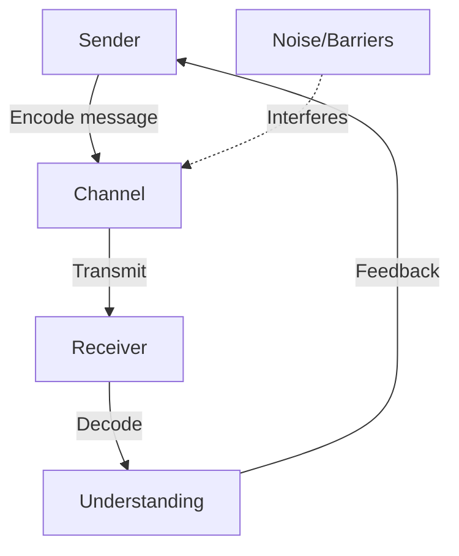
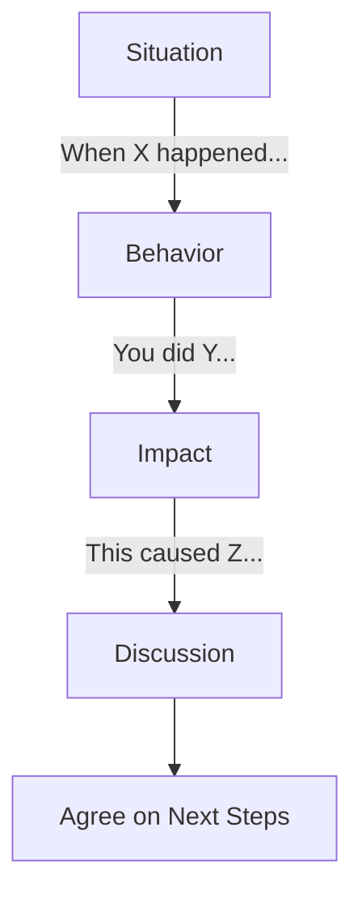
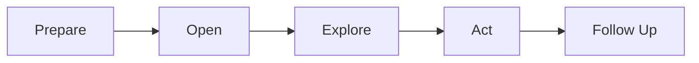

# 89 - Communication Skills

## Introduction

Communication is the most universally valued skill in professional settings. Whether you're explaining a complex technical concept to a non-technical stakeholder, writing documentation, presenting to leadership, or collaborating with your team, effective communication determines your impact. Strong communicators are promoted faster, resolve conflicts more easily, and build stronger relationships.

This guide covers active listening, clear articulation, written communication, presentation skills, non-verbal communication, cross-cultural communication, remote communication best practices, and handling difficult conversations. Communication isn't just about talking — it's about ensuring your message is understood and creating space for others to be heard.

---

## Learning Roadmap

### Phase 1: Foundations (Days 1-3)
- Practice active listening in daily conversations
- Learn to structure thoughts before speaking
- Write clear, concise emails and messages
- Understand non-verbal communication basics

### Phase 2: Development (Days 4-7)
- Practice explaining technical concepts to non-technical people
- Learn to give and receive feedback constructively
- Practice presentation skills
- Develop written communication templates

### Phase 3: Mastery (Days 8-14)
- Handle difficult conversations with confidence
- Practice cross-cultural communication
- Master virtual meeting communication
- Build a personal communication style guide

---

## Theory Notes

### Active Listening
Active listening means fully concentrating on what the speaker is saying, rather than just waiting to respond:

1. **Give full attention**: Put away devices, make eye contact
2. **Show you're listening**: Nod, use verbal affirmations ("I see", "Go on")
3. **Paraphrase**: "So what you're saying is..."
4. **Ask clarifying questions**: "Can you elaborate on...?"
5. **Withhold judgment**: Listen without planning your rebuttal
6. **Respond thoughtfully**: Take a moment before responding

### The Pyramid Principle
For clear communication, lead with the conclusion:
```
1. Start with the recommendation/conclusion
2. Provide supporting arguments
3. Give details and evidence last
```

Example:
"Instead of: 'We analyzed the data, considered alternatives, and found that...'
Say: 'I recommend we use PostgreSQL. Here's why: it supports our
query patterns, handles our scale, and the team has expertise.'"

### Written Communication

#### Email Best Practices
- **Subject line**: Clear, specific, action-oriented
- **Opening**: State the purpose immediately
- **Body**: Short paragraphs, bullet points for multiple items
- **Closing**: Clear call to action with deadline
- **Tone**: Professional but not robotic

#### Slack/Teams Communication
- Use threads to keep conversations organized
- Be concise — read messages before sending
- Use appropriate channels for topics
- Don't @everyone unless truly necessary
- Use reactions for quick acknowledgments

### Non-Verbal Communication
- **Eye contact**: Shows engagement and confidence
- **Posture**: Open, upright posture conveys confidence
- **Gestures**: Purposeful hand movements emphasize points
- **Facial expressions**: Match your message
- **Tone of voice**: Conveys emotion and emphasis
- **Space**: Respect personal space in conversations

### Handling Difficult Conversations

#### The SBI Feedback Model
- **S**ituation: Describe the specific situation
- **B**ehavior: Describe the observable behavior
- **I**mpact: Explain the impact on you or the team

Example: "In yesterday's standup (situation), you interrupted Sarah three times while she was presenting her update (behavior). This made her hesitant to share and the team missed important context (impact)."

#### Difficult Conversation Framework
1. **Prepare**: Know your goal and desired outcome
2. **Open**: State the purpose calmly
3. **Explore**: Listen to the other perspective
4. **Act**: Agree on next steps
5. **Follow up**: Confirm agreements

---

## Key Concepts

### Cross-Cultural Communication
- Be aware of different communication styles (direct vs indirect)
- Avoid idioms and jargon with non-native speakers
- Be patient with language differences
- Respect different attitudes toward hierarchy
- Adapt to different feedback cultures (direct vs subtle)
- Learn basic greetings in colleagues' languages

### Remote Communication Best Practices
- **Over-communicate** in written form (context is lost without body language)
- **Default to video** for important discussions
- **Document decisions** in writing after meetings
- **Use async communication** when possible (respect time zones)
- **Be explicit** about expectations and deadlines
- **Check in regularly** with remote team members

### Presentation Skills
1. **Know your audience**: Tailor content and language
2. **Structure clearly**: Opening, key points, conclusion
3. **Use visuals**: Slides support, not replace, your message
4. **Tell stories**: Narrative makes data memorable
5. **Practice**: Rehearse timing and transitions
6. **Engage**: Ask questions, read the room
7. **Handle Q&A**: Listen fully, answer concisely, follow up

### Technical Communication
- **Explain the "why" before the "how"**
- **Use analogies** to connect to familiar concepts
- **Avoid jargon** when talking to non-technical stakeholders
- **Use diagrams** to illustrate architecture and flows
- **Write documentation** that's readable and maintainable
- **Lead with impact**, not implementation details

---

## FAQ (20+ Q&A)

### Q1: How do I explain a complex technical concept to a non-technical person?
**A:** Start with the problem it solves, use an analogy they understand, avoid jargon, use visuals if possible. "Think of a load balancer like a restaurant host — it distributes guests to available tables so no one server gets overwhelmed."

### Q2: How do I give feedback without hurting feelings?
**A:** Use the SBI model: Situation, Behavior, Impact. Be specific, not general. Focus on the behavior, not the person. Offer suggestions for improvement. Be timely and private.

### Q3: How do I handle a disagreement in a meeting?
**A:** Listen fully, acknowledge their perspective, present your view with data, find common ground. "I see your point about X. I'm thinking about Y because of Z. Can we find an approach that addresses both?"

### Q4: How do I communicate effectively in a remote team?
**A:** Over-communicate in writing, be explicit about expectations, document decisions, default to video for complex topics, and check in regularly with team members.

### Q5: How do I improve my presentation skills?
**A:** Practice regularly, record yourself, start with small audiences, structure your talk clearly, use stories, and focus on the audience's needs, not your nervousness.

### Q6: How do I say "no" professionally?
**A:** Acknowledge the request, explain your constraints, offer alternatives if possible. "I appreciate you thinking of me for this. Right now, I'm focused on [priority] and can't give this the attention it deserves. Could we revisit this next month, or would [alternative] work?"

### Q7: How do I handle interrupting in meetings?
**A:** For yourself: pause before responding, notice when others are speaking. For others: "I'd love to hear the rest of what you were saying" or "Hold on, let's let Sarah finish her thought."

### Q8: How do I write better documentation?
**A:** Start with the user's goal, use clear headings, include code examples, add diagrams, keep it updated, and write for your future self. Good documentation is searchable and scannable.

### Q9: How do I manage up — communicating with my manager?
**A:** Lead with the conclusion, provide options not problems, respect their time, be honest about risks, and proactively share progress. "Here's the update: we're on track. One risk I want to flag is..."

### Q10: How do I handle a difficult conversation with a colleague?
**A:** Prepare your points, choose a private setting, use "I" statements, listen to their perspective, focus on the issue not the person, and agree on next steps.

### Q11: How do I communicate across time zones?
**A:** Use async communication as default, document decisions, record meetings, rotate meeting times for fairness, and be explicit about deadlines with timezone context.

### Q12: How do I improve my listening skills?
**A:** Practice giving full attention, don't plan your response while listening, paraphrase what you heard, ask clarifying questions, and be comfortable with silence.

### Q13: How do I handle presenting bad news?
**A:** Be direct and honest, provide context, explain what you're doing about it, and outline next steps. Avoid burying bad news or sugarcoating it.

### Q14: How do I run effective meetings?
**A:** Have a clear agenda, start and end on time, invite only necessary people, assign a note-taker, end with clear action items, and follow up in writing.

### Q15: How do I communicate technical trade-offs to business stakeholders?
**A:** Frame in business terms: cost, time, risk, and impact. Present options with pros/cons. Let them make the decision. "Option A is faster but less scalable; Option B takes longer but handles 10x growth."

### Q16: How do I handle a feedback session where I disagree?
**A:** Listen fully, ask clarifying questions, present your perspective with examples, find areas of agreement, and be willing to compromise. "I see your point. Let me share my perspective on that specific situation."

### Q17: How do I write better emails?
**A:** State the purpose in the first line, use bullet points for multiple items, include clear call-to-actions, and keep it concise. If it's longer than 5 paragraphs, consider a meeting instead.

### Q18: How do I handle presenting to senior leadership?
**A:** Be concise (they're busy), lead with the ask or conclusion, know your data, anticipate questions, and have a clear recommendation. "I need a decision on X by Friday. Here's my recommendation..."

### Q19: How do I handle a teammate who doesn't communicate well?
**A:** Talk to them privately, give specific examples, explain the impact, and offer suggestions. "I've noticed updates are sometimes missed. Could we try [specific improvement]?"

### Q20: How do I prepare for an interview presentation?
**A:** Know your audience, structure clearly, practice timing, prepare for questions, have backup slides for deep dives, and rehearse with a friend.

---

## Hands-on Practice

### Practice Exercise 1: Technical Explanation
Explain the following to a non-technical person:
- What a database index is
- How caching works
- What an API is
- What cloud computing means

### Practice Exercise 2: Feedback Practice
Give feedback to a friend using the SBI model:
- **Situation**: In our meeting this morning
- **Behavior**: You presented the data clearly with good visuals
- **Impact**: It helped the team understand the problem and decide quickly

### Practice Exercise 3: Difficult Conversation Role Play
Practice handling these scenarios:
- A colleague missed a deadline that affected your work
- You disagree with your manager's technical decision
- A team member's code quality needs improvement

---

## FAANG Communication Questions

### Google
1. Tell me about a time you had to explain a complex technical concept to a non-technical audience.
2. Describe a situation where miscommunication caused a problem.

### Meta
3. How do you ensure alignment across teams with different priorities?
4. Tell me about a time you had to deliver difficult feedback.

### Amazon
5. How do you communicate with stakeholders who disagree with your approach?
6. Describe a time when clear communication prevented a problem.

### Apple
7. How do you present technical proposals to leadership?
8. Tell me about a time you had to communicate a technical limitation to a product manager.

### Microsoft
9. How do you facilitate cross-team collaboration?
10. Describe your approach to writing technical documentation.

---

## Common Mistakes

1. **Not listening**: Planning your response instead of hearing the other person
2. **Using too much jargon**: alienating non-technical audiences
3. **Being vague**: not being specific enough in messages
4. **Avoiding difficult conversations**: letting issues fester
5. **Not documenting**: forgetting to write down decisions and agreements
6. **Over-communicating**: sending too many messages, creating noise
7. **Not adapting style**: using the same approach for everyone
8. **Interrupting**: not letting others finish their thoughts
9. **Assuming understanding**: not checking if the message was received
10. **Poor written communication**: long, unclear emails

---

## Best Practices

### Speaking
- Think before you speak
- Lead with the conclusion
- Be concise — respect people's time
- Use stories to make points memorable
- Match your tone to the audience
- Pause for emphasis
- Avoid filler words ("um", "like", "you know")
- Mirror the energy level of your audience
- Use the "headline" technique: state the key point first
- Practice vocal warm-ups before important conversations

### Writing
- Edit ruthlessly — shorter is better
- Use active voice
- Break up long paragraphs
- Use bullet points for lists
- Include clear calls to action
- Proofread before sending
- Read your message aloud before hitting send
- Use formatting (bold, headers) for scannability
- Keep subject lines under 8 words
- Follow the "one email, one ask" principle

### Listening
- Give full attention
- Don't interrupt
- Paraphrase to confirm understanding
- Ask clarifying questions
- Be comfortable with silence
- Listen for what's not being said
- Take brief notes during important conversations
- Avoid multitasking during conversations
- Put your phone away during meetings
- Practice "looping" — repeat back what you heard

### Presenting
- Know your audience
- Structure clearly
- Practice multiple times
- Use visuals to support, not replace
- Engage with questions
- Handle Q&A with confidence
- Arrive early to test equipment
- Have a backup of your slides
- Use transitions between sections
- End with a clear call to action

---

## Cheat Sheet

### Communication Frameworks
```
Pyramid Principle:     Conclusion → Supporting Arguments → Details
SBI Feedback:          Situation → Behavior → Impact
STAR Method:           Situation → Task → Action → Result
Clear Writing:         Purpose → Key Points → Call to Action
Difficult Conversations: Prepare → Open → Explore → Act → Follow Up
```

### Email Template
```
Subject: [Action Required/Info] — [Topic]

Hi [Name],

[Purpose sentence — why you're writing]

[Key details — use bullets]

[Call to action with deadline]

[Closing]
```

### Active Listening Checklist
```
□ Giving full attention
□ Making eye contact
□ Not interrupting
□ Paraphrasing
□ Asking clarifying questions
□ Withholding judgment
□ Responding thoughtfully
```

---

## Flash Cards (20)

### Card 1
**Q:** What is active listening?
**A:** Fully concentrating on the speaker, showing engagement (nodding, eye contact), paraphrasing to confirm understanding, asking clarifying questions, and withholding judgment until they finish.

### Card 2
**Q:** What is the Pyramid Principle?
**A:** Lead with the conclusion, then provide supporting arguments, then details. It ensures your message is clear and respects the audience's time.

### Card 3
**Q:** What is the SBI feedback model?
**A:** Situation (specific context), Behavior (observable action), Impact (effect on you/team). It provides specific, actionable feedback without being personal.

### Card 4
**Q:** How do you explain technical concepts to non-technical people?
**A:** Start with the problem it solves, use familiar analogies, avoid jargon, use visuals, and check for understanding.

### Card 5
**Q:** What are the keys to effective remote communication?
**A:** Over-communicate in writing, be explicit about expectations, document decisions, default to video for complex topics, and respect time zones.

### Card 6
**Q:** How do you say "no" professionally?
**A:** Acknowledge the request, explain constraints, offer alternatives. "I appreciate this. Right now I'm focused on X. Can we revisit next month or would Y work?"

### Card 7
**Q:** What makes a good email?
**A:** Clear subject line, purpose in first line, bullet points for details, specific call-to-action with deadline, and concise writing.

### Card 8
**Q:** How do you handle a disagreement in a meeting?
**A:** Listen fully, acknowledge their perspective, present your view with data, find common ground. "I see your point about X. I'm considering Y because of Z."

### Card 9
**Q:** How do you present to senior leadership?
**A:** Be concise, lead with the ask/conclusion, know your data, anticipate questions, and have a clear recommendation with options.

### Card 10
**Q:** What is cross-cultural communication?
**A:** Being aware of different communication styles, avoiding idioms with non-native speakers, respecting hierarchy differences, and adapting to different feedback cultures.

### Card 11
**Q:** How do you handle a difficult conversation?
**A:** Prepare your points, choose a private setting, use "I" statements, listen to their perspective, focus on the issue, and agree on next steps.

### Card 12
**Q:** How do you run effective meetings?
**A:** Clear agenda, start/end on time, right people invited, assign note-taker, end with action items, follow up in writing.

### Card 13
**Q:** What is "managing up"?
**A:** Communicating effectively with your manager — leading with conclusions, providing options not problems, respecting their time, being honest about risks.

### Card 14
**Q:** How do you write better documentation?
**A:** Start with the user's goal, use clear headings, include examples, add diagrams, keep it updated, write for your future self.

### Card 15
**Q:** How do you communicate technical trade-offs?
**A:** Frame in business terms (cost, time, risk, impact), present options with pros/cons, let stakeholders decide.

### Card 16
**Q:** How do you handle presenting bad news?
**A:** Be direct and honest, provide context, explain your response, outline next steps. Don't bury or sugarcoat bad news.

### Card 17
**Q:** What are the non-verbal communication cues?
**A:** Eye contact (engagement), posture (confidence), gestures (emphasis), facial expressions (empathy), tone (emotion), and space (respect).

### Card 18
**Q:** How do you improve listening skills?
**A:** Give full attention, don't plan response while listening, paraphrase, ask clarifying questions, be comfortable with silence.

### Card 19
**Q:** How do you handle a teammate who doesn't communicate well?
**A:** Talk privately, give specific examples, explain impact, offer suggestions for improvement.

### Card 20
**Q:** How do you document decisions in meetings?
**A:** Assign a note-taker, capture key decisions and action items, share notes within 24 hours, include who is responsible and by when.

---

## Mind Map

```
Communication Skills
├── Active Listening
│   ├── Full attention
│   ├── Paraphrasing
│   ├── Clarifying questions
│   └── Withholding judgment
├── Speaking
│   ├── Pyramid principle
│   ├── Clear structure
│   ├── Stories and analogies
│   └── Appropriate tone
├── Writing
│   ├── Concise emails
│   ├── Documentation
│   ├── Slack/Teams
│   └── Technical writing
├── Presenting
│   ├── Structure
│   ├── Visuals
│   ├── Practice
│   └── Q&A handling
├── Difficult Conversations
│   ├── SBI model
│   ├── "I" statements
│   ├── Private setting
│   └── Action agreements
├── Remote Communication
│   ├── Async-first
│   ├── Written clarity
│   ├── Video for complex topics
│   └── Time zone respect
└── Cross-Cultural
    ├── Direct vs indirect styles
    ├── Language awareness
    ├── Hierarchy sensitivity
    └── Adaptation
```

---

## Mermaid Diagrams

### Communication Flow


### SBI Feedback Model


### Difficult Conversation Framework


---

## Projects

### Project 1: Communication Style Guide
- Document your communication preferences
- Create templates for common emails
- Build a personal style guide
- **Skills**: Self-awareness, documentation

### Project 2: Presentation Practice
- Prepare and deliver a 10-minute technical presentation
- Record and review yourself
- Get feedback from 3 people
- **Skills**: Presentation, public speaking

### Project 3: Cross-Team Communication
- Facilitate a meeting between two teams with different priorities
- Document decisions and follow up
- Practice managing up and down
- **Skills**: Facilitation, stakeholder management

---

## Advanced Communication Scenarios

### Scenario 1: Explaining Technical Debt to Non-Technical Stakeholders

**The Challenge:** Your product manager wants to know why you can't ship a feature faster.

**Approach:**
1. Use an analogy: "Technical debt is like a house with a leaky foundation. We can keep building floors, but eventually the whole structure is at risk."
2. Quantify the impact: "Currently, 30% of our sprint capacity goes to fixing issues caused by outdated code."
3. Present the investment: "If we spend 2 sprints on refactoring, we'll reclaim 30% of capacity going forward."
4. Give options: "We can do a quick fix now (2 days, temporary) or a proper fix (1 week, permanent)."

### Scenario 2: Delivering Bad News About a Project Delay

**The Challenge:** You need to tell leadership that your team will miss a deadline.

**Approach:**
1. Lead with the facts: "We'll need an additional 2 weeks to deliver the feature."
2. Explain why: "We discovered a scalability issue that would cause outages at 10x our current load."
3. Show the plan: "Here's what we're doing to address it and the revised timeline."
4. Discuss impact: "This affects the marketing launch by 2 weeks. Here's how we can mitigate."
5. Prevent future issues: "Here's what we're changing in our process to catch these earlier."

### Scenario 3: Giving Critical Feedback to a Peer

**The Challenge:** A colleague's code quality is declining and it's affecting the team.

**Approach (SBI Model):**
- Situation: "Over the past sprint, I've reviewed 4 of your PRs."
- Behavior: "I noticed they contained multiple edge case bugs and lacked test coverage."
- Impact: "This has required rework and slowed down the release."
- Solution: "Would it help to pair on the next feature? I can share some patterns that might help."

### Scenario 4: Navigating a Disagreement in a Design Review

**The Challenge:** Two engineers strongly disagree on an architecture approach.

**Approach:**
1. Let both sides present fully
2. Identify the core technical concern behind each position
3. Find where they agree (usually more than expected)
4. Propose a evaluation criteria: "Let's compare both approaches on scalability, maintainability, and implementation time."
5. Suggest a time-boxed proof of concept if needed
6. Make a decision if consensus isn't possible, with clear rationale

### Scenario 5: Communicating Across Engineering and Product

**The Challenge:** Product wants a feature that's technically complex; engineering wants to simplify.

**Approach:**
1. Translate technical constraints into business impact
2. Present options with clear trade-offs:
   - Option A: Full feature (6 weeks) — meets all requirements
   - Option B: Simplified version (2 weeks) — covers 80% of use cases
   - Option C: Phased approach (2 weeks + 4 weeks) — deliver core, then enhance
3. Let product make an informed decision
4. Document the decision and rationale

---

## Communication Anti-Patterns

### The "Wall of Text"
**Problem:** Sending long, dense messages that no one reads.
**Fix:** One idea per paragraph. Use headers. Bold key points. Keep under 200 words.

### The "Passive-Aggressive" Message
**Problem:** "Per my last email..." or "As I already mentioned..."
**Fix:** State the facts directly. "Following up on my previous message about X. Here's the key point: Y."

### The "Meeting That Should Have Been an Email"
**Problem:** Scheduling meetings for updates that don't need discussion.
**Fix:** Send a written update first. Only schedule if discussion is needed.

### The "Echo Chamber"
**Problem:** Only communicating with people who agree with you.
**Fix:** Seek diverse perspectives. Invite dissenting opinions. Ask "What are we missing?"

### The "Over-Promiser"
**Problem:** Saying yes to everything, then missing commitments.
**Fix:** Before committing, say "Let me check my capacity and get back to you." Be realistic.

### The "Feedback Avoider"
**Problem:** Never giving constructive feedback until it's a crisis.
**Fix:** Give feedback early and regularly. Small corrections prevent big problems.

---

## Communication Frameworks Deep Dive

### The Minto Pyramid (Advanced)
1. Start with the answer/conclusion
2. Group supporting arguments
3. Each group has its own sub-arguments
4. Arrange logically (deductive or inductive)
5. Use SCQA: Situation, Complication, Question, Answer

### The SCQA Framework
```
Situation:  "Our team deploys 50 times per week."
Complication: "But our error rate has increased by 15%."
Question:   "How do we maintain velocity while improving quality?"
Answer:     "Implement automated quality gates in the CI/CD pipeline."
```

### The MECE Principle (Mutually Exclusive, Collectively Exhaustive)
- When presenting options, make them:
  - **Mutually Exclusive**: No overlap between options
  - **Collectively Exhaustive**: All possible options covered
- Example: "We can hire, outsource, or automate" (covers all options)

### The Five Whys (Root Cause Analysis)
1. "Why did the deployment fail?" — "Because tests failed."
2. "Why did tests fail?" — "Because of a config change."
3. "Why wasn't it caught?" — "Because we don't test config changes."
4. "Why don't we test config changes?" — "Because it wasn't in the process."
5. "Why wasn't it in the process?" — "Because we never considered it."
**Root cause:** Incomplete deployment checklist.

### The Situation-Behavior-Impact (SBI) Advanced Example
```
Situation:  "During yesterday's architecture review..."
Behavior:   "You presented three alternatives with detailed trade-off analysis..."
Impact:     "It helped the team make a confident decision in 30 minutes instead of
             the usual 2-hour debate. This is exactly the kind of leadership that
             elevates our decision-making process."
```

---

## Communication Metrics and Self-Assessment

### Self-Assessment Questionnaire
Rate yourself 1-5 on each:

1. I can explain complex technical concepts to non-technical audiences
2. I write clear, concise emails that get responses
3. I actively listen without planning my response
4. I give feedback that is specific and actionable
5. I handle difficult conversations without avoiding them
6. I present confidently to groups of 10+
7. I communicate effectively in written form (docs, Slack, email)
8. I adapt my communication style to different audiences
9. I document decisions and follow up on action items
10. I manage cross-timezone communication effectively

**Scoring:**
- 40-50: Strong communicator — focus on fine-tuning
- 30-39: Good communicator — identify specific weak areas
- 20-29: Developing communicator — practice daily
- Below 20: Focus on fundamentals first

### Common Communication Metrics in Teams
- **Response time**: How quickly do you respond to messages?
- **Meeting effectiveness**: Do your meetings end with clear actions?
- **Documentation quality**: Can others understand your docs without asking?
- **Feedback frequency**: How often do you give/receive constructive feedback?
- **Conflict resolution speed**: How quickly are disagreements resolved?

---
- [ ] Can explain technical concepts to non-technical people
- [ ] Practice active listening in daily conversations
- [ ] Write clear, concise emails
- [ ] Give constructive feedback using SBI model
- [ ] Handle difficult conversations with confidence
- [ ] Present to groups effectively
- [ ] Communicate effectively in remote settings
- [ ] Adapt communication style to different audiences
- [ ] Document decisions and follow up
- [ ] Manage across time zones

---

## Difficulty Rating

| Topic | Difficulty | Interview Frequency |
|-------|-----------|-------------------|
| Active Listening | ★★☆☆☆ | High |
| Clear Articulation | ★★☆☆☆ | Very High |
| Written Communication | ★★☆☆☆ | High |
| Presentation Skills | ★★★☆☆ | Medium |
| Difficult Conversations | ★★★★☆ | High |
| Cross-Cultural | ★★★☆☆ | Medium |
| Remote Communication | ★★☆☆☆ | High |
| Technical Communication | ★★★☆☆ | Very High |

---

## Summary

Communication is the foundation of professional success. Key takeaways:

1. **Listen more than you speak** — active listening is the most underrated skill
2. **Lead with the conclusion** — respect people's time with the Pyramid Principle
3. **Be specific** — vague communication creates confusion and misalignment
4. **Adapt your style** — different audiences need different approaches
5. **Write well** — clear writing reflects clear thinking
6. **Handle difficult conversations early** — issues don't resolve themselves
7. **Document decisions** — written agreements prevent misunderstandings
8. **Over-communicate remotely** — context is lost without body language
9. **Practice regularly** — communication is a skill that improves with practice
10. **Seek feedback** — ask others how you can communicate better
