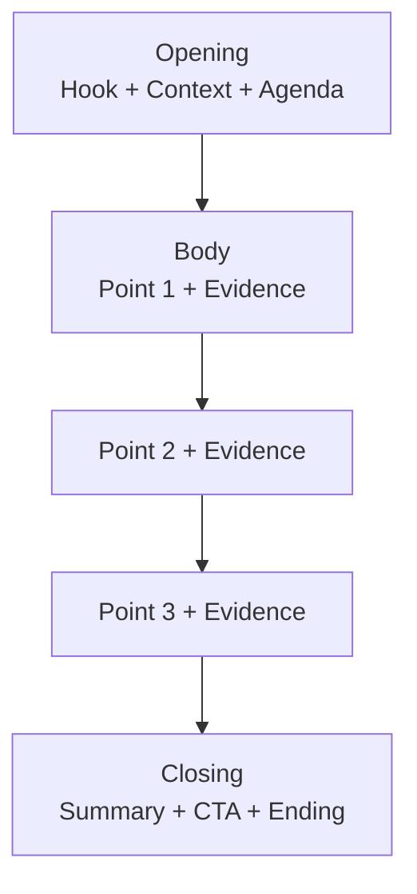
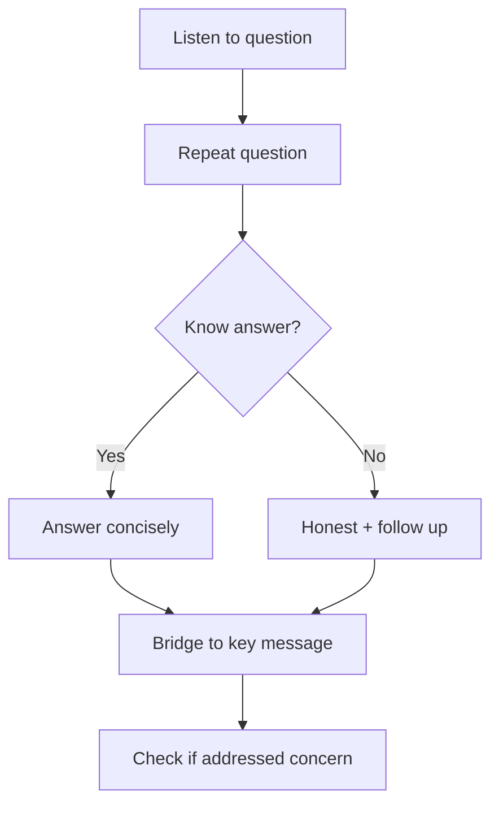
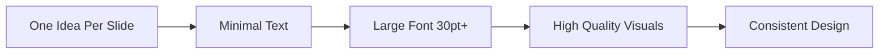

# 91 - Presentation Skills

## Introduction

Presentation skills are essential for technical professionals — from explaining architecture to stakeholders, pitching ideas to leadership, presenting at conferences, or defending project proposals. A great presentation combines clear structure, engaging delivery, strong visuals, and confident Q&A handling.

This guide covers presentation structure, slide design, storytelling, handling Q&A, virtual presentations, public speaking techniques, nervousness management, visual aids, and common presentation interview formats. Strong presentation skills differentiate senior engineers who can influence from those who can only execute.

---

## Learning Roadmap

### Phase 1: Foundation (Days 1-3)
- Learn presentation structure frameworks
- Study slide design principles
- Understand storytelling techniques
- Practice basic delivery skills

### Phase 2: Development (Days 4-7)
- Create a sample technical presentation
- Practice delivery with feedback
- Work on handling Q&A
- Develop virtual presentation skills

### Phase 3: Mastery (Days 8-14)
- Present to different audiences
- Handle difficult questions
- Manage nervousness
- Refine visual aids

---

## Theory Notes

### Presentation Structure

#### The 3-Act Structure
1. **Opening** (10%): Hook, context, agenda
2. **Body** (80%): Key points with evidence, stories, and examples
3. **Closing** (10%): Summary, call to action, memorable ending

#### Problem-Solution Framework
1. State the problem clearly
2. Explain why it matters
3. Present your solution
4. Show evidence it works
5. Outline next steps

### Slide Design Principles

#### The 10-20-30 Rule (Guy Kawasaki)
- **10 slides** maximum
- **20 minutes** maximum presentation time
- **30-point font** minimum

#### Slide Design Do's
- One idea per slide
- Use high-quality visuals
- Keep text minimal (6-8 lines max)
- Use consistent fonts and colors
- Use whitespace effectively
- End slides with a question or key takeaway

#### Slide Design Don'ts
- Don't read slides word-for-word
- Don't use clip art or low-quality images
- Don't use more than 3 fonts
- Don't overload with bullet points
- Don't use tiny text
- Don't use distracting animations

### Storytelling in Presentations

#### The STAR Storytelling Framework
- **S**et the scene: Context and challenge
- **T**ension: What was at stake
- **A**ction: What you did
- **R**esolution: The outcome and lesson

#### Making Data Memable
- Don't just show numbers — tell the story behind them
- Use comparisons: "This is equivalent to..."
- Visualize data with appropriate charts
- Highlight the one key insight

### Handling Q&A

#### Effective Q&A Strategies
1. **Listen fully** — don't interrupt the questioner
2. **Repeat the question** — ensures everyone heard it
3. **Answer concisely** — don't ramble
4. **Bridge back** — connect your answer to your key message
5. **If you don't know** — say so honestly and follow up later
6. **Handle hostile questions** — stay calm, acknowledge, respond with facts

#### Difficult Questions
- **"I don't have that data"**: "Great question. I don't have that specific number, but based on [related data]..."
- **"I disagree"**: "I understand your concern. Here's my reasoning..."
- **"Why didn't you do X?"**: "That's a valid alternative. We chose Y because..."

---

## Key Concepts

### Nervousness Management

#### Before the Presentation
- **Prepare thoroughly**: Know your material cold
- **Practice multiple times**: In front of a mirror, friends, or record yourself
- **Visit the venue**: Familiarize yourself with the space
- **Breathing exercises**: Deep breaths to calm nerves
- **Power posing**: Stand confidently for 2 minutes before presenting

#### During the Presentation
- **Focus on the message**, not yourself
- **Make eye contact** with friendly faces
- **Move purposefully** — don't pace or stand still
- **Use pauses** — silence is powerful
- **Channel nervous energy** into enthusiasm

### Virtual Presentation Skills

#### Setup
- Good lighting (face the light source)
- Clean, professional background
- Stable internet connection
- Camera at eye level
- Test audio and slides before starting

#### Delivery
- Look at the camera, not the screen
- Speak slightly slower than in-person
- Use polls and questions to engage
- Monitor chat for questions
- Share screen only when presenting content

### Public Speaking Techniques

#### Voice Modulation
- **Volume**: Vary for emphasis
- **Pace**: Slow down for key points
- **Pitch**: Use variation to maintain interest
- **Pauses**: Use for emphasis and transitions

#### Movement
- Move with purpose (don't pace)
- Use the stage to mark different sections
- Step toward the audience for emphasis
- Use hand gestures to illustrate points

---

## FAQ (20+ Q&A)

### Q1: How do I structure a technical presentation?
**A:** Start with the problem/context, present your approach/solution, show results/evidence, discuss trade-offs, and end with next steps. Keep technical depth appropriate for your audience.

### Q2: How many slides should I prepare?
**A:** Aim for 1 slide per minute of presentation. For a 20-minute presentation, prepare 15-20 slides. Quality over quantity — one powerful slide beats five busy ones.

### Q3: How do I handle nervousness?
**A:** Prepare thoroughly, practice multiple times, arrive early, take deep breaths, focus on the message, and remember that the audience wants you to succeed.

### Q4: What if I get a hostile question?
**A:** Stay calm, acknowledge their concern, respond with facts, and don't get defensive. "That's a valid concern. Here's how we addressed it..."

### Q5: Should I read from my slides?
**A:** Never. Slides support your message, not replace it. You should know your material well enough to present without reading.

### Q6: How do I make data interesting?
**A:** Tell the story behind the numbers. Use comparisons ("equivalent to..."). Visualize with appropriate charts. Highlight the one key insight.

### Q7: How do I engage the audience?
**A:** Ask questions, use polls, tell stories, make eye contact, vary your voice, and move purposefully. Engagement is about connection, not performance.

### Q8: What's the best way to handle "I don't know"?
**A:** Be honest. "I don't have that specific data, but here's what I know..." Then follow up after the presentation. Honesty builds trust.

### Q9: How do I end a presentation memorably?
**A:** Summarize key points, state a clear call to action, and end with a thought-provoking statement or question. Don't just trail off.

### Q10: How do I present to senior leadership?
**A:** Be concise, lead with the ask/conclusion, know your data, anticipate questions, and have clear recommendations. They're busy — respect their time.

### Q11: How do I handle a technical deep-dive in Q&A?
**A:** Answer briefly, offer to go deeper offline. "That's a great question — let me give a brief overview and I'm happy to dive deeper after the session."

### Q12: How do I present bad news?
**A:** Be direct, provide context, explain your response, and outline next steps. Don't bury bad news or sugarcoat it.

### Q13: How do I practice effectively?
**A:** Record yourself, present to friends, practice with a timer, review your recordings, and get feedback. Practice until the flow feels natural.

### Q14: How do I handle technical difficulties?
**A:** Stay calm, have backup plans (printed slides, offline version), and engage the audience while resolving. "While we fix this, let me continue with..."

### Q15: How do I make slides accessible?
**A:** Use high contrast colors, large fonts, alt text for images, avoid relying solely on color to convey information, and provide materials in advance.

### Q16: How do I handle a time constraint?
**A:** Know your priority points. Have a "core" version (10 min) and "extended" version (20 min). Always be ready to skip to conclusions.

### Q17: What's the best way to present architecture?
**A:** Start with a high-level diagram, then drill into components, explain data flow, discuss trade-offs, and show metrics. Use consistent diagram styles.

### Q18: How do I handle virtual presentations?
**A:** Look at the camera, speak slightly slower, use polls/questions to engage, monitor chat, and test setup beforehand.

### Q19: How do I present data effectively?
**A:** Choose the right chart type, highlight the key insight, use comparisons, label clearly, and tell the story behind the data.

### Q20: How do I improve my presentation skills?
**A:** Practice regularly, seek feedback, watch great presenters, join Toastmasters, record yourself, and present at every opportunity.

---

## Presentation Formats in Technical Interviews

### Architecture Presentation
**Format:** Present a system design you've built or proposed (15-30 min)
**Focus:** Technical depth, trade-offs, decision-making process
**Tips:**
- Start with high-level architecture, then drill down
- Explain WHY you made specific choices
- Discuss what you'd do differently with hindsight
- Show awareness of scale and limitations

### Project Demo
**Format:** Demo a project or feature you've built (10-20 min)
**Focus:** Technical implementation, problem-solving, impact
**Tips:**
- Start with the problem, not the code
- Show the demo working, then explain the implementation
- Highlight interesting technical challenges
- Discuss metrics and impact

### Technical Proposal
**Format:** Propose a technical solution to a business problem (20-30 min)
**Focus:** Analysis, options, recommendation, implementation plan
**Tips:**
- Define the problem clearly before proposing solutions
- Present multiple options with trade-offs
- Show a phased implementation plan
- Address risks and mitigation strategies

### Team Tech Talk
**Format:** Teach something to your team (30-60 min)
**Focus:** Knowledge sharing, clarity, engagement
**Tips:**
- Know your audience's skill level
- Use live examples or demos
- Provide takeaways (slides, code, references)
- Leave time for questions

### Conference Talk (Advanced)
**Format:** Present at meetups or conferences (20-45 min)
**Focus:** Storytelling, audience engagement, expertise
**Tips:**
- Tell a story, not just technical facts
- Include real-world lessons and failures
- Make it interactive when possible
- Practice extensively beforehand

---

## Slide Design Deep Dive

### Color Psychology in Presentations
- **Blue**: Trust, professionalism (great for corporate)
- **Green**: Growth, innovation (great for sustainability/health)
- **Red**: Urgency, passion (use sparingly for emphasis)
- **Gray/Black**: Sophistication, authority
- **White**: Clarity, simplicity (use for backgrounds)

### Typography Rules
- **Headings**: Sans-serif (Arial, Helvetica, Calibri), 36-44pt
- **Body text**: Sans-serif, 24-28pt
- **Code**: Monospace (Consolas, Fira Code), 18-22pt
- **Maximum 2 font families** per presentation
- **Consistent alignment** throughout

### Data Visualization Best Practices
| Data Type | Best Chart | Avoid |
|-----------|-----------|-------|
| Comparison | Bar chart | Pie chart (many categories) |
| Trend over time | Line chart | Bar chart |
| Proportion | Pie chart (≤5 items) | 3D charts |
| Distribution | Histogram | Line chart |
| Relationship | Scatter plot | Pie chart |
| Part of whole | Stacked bar | Multiple pie charts |

### The "Assertion-Evidence" Slide Design
Instead of bullet-point slides, use:
1. **Assertion**: A clear headline that states the key point
2. **Evidence**: Visual data that supports the assertion

**Example:**
- Bad slide title: "Performance Results"
- Good slide title: "API latency decreased by 75% after optimization"

### Presentation Accessibility
- Use high contrast (WCAG AA minimum)
- Don't rely solely on color to convey information
- Add alt text to images
- Use large fonts (24pt minimum)
- Provide materials in advance when possible
- Speak clearly and at moderate pace

---

## Best Practices

### Before Presenting
- Know your audience and their knowledge level
- Structure your talk clearly (Opening → Body → Closing)
- Practice multiple times with a timer
- Prepare for common questions
- Test all technology and setup
- Arrive early to get comfortable

### During Presenting
- Start with a hook (question, story, or surprising fact)
- Make eye contact around the room
- Use vocal variety (pace, volume, pitch)
- Move with purpose
- Use pauses for emphasis
- Watch the audience for cues

### After Presenting
- Send follow-up materials if promised
- Reflect on what worked and what didn't
- Get feedback from trusted colleagues
- Document lessons learned

---

## Cheat Sheet

### Presentation Structure
```
Opening (10%):
  Hook → Context → Agenda

Body (80%):
  Point 1 → Evidence → Transition
  Point 2 → Evidence → Transition
  Point 3 → Evidence → Transition

Closing (10%):
  Summary → Call to Action → Memorable Ending
```

### Slide Design Checklist
```
□ One idea per slide
□ Minimal text (6-8 lines max)
□ 30pt+ font size
□ High-quality visuals
□ Consistent fonts/colors
□ Readable from back of room
□ Clear data visualization
□ No clip art or low-quality images
```

### Q&A Response Template
```
1. Listen to full question
2. Repeat/paraphrase the question
3. Answer concisely
4. Bridge back to key message
5. Ask if that addressed their concern
```

---

## Flash Cards (20)

### Card 1
**Q:** What is the 10-20-30 rule?
**A:** 10 slides, 20 minutes, 30-point font minimum. Guy Kawasaki's framework for concise, impactful presentations.

### Card 2
**Q:** How should you end a presentation?
**A:** Summarize key points, state a clear call to action, and end with a thought-provoking statement. Don't just trail off.

### Card 3
**Q:** How do you handle nervousness before presenting?
**A:** Prepare thoroughly, practice multiple times, arrive early, take deep breaths, focus on the message, and remember the audience wants you to succeed.

### Card 4
**Q:** What is the best way to start a presentation?
**A:** With a hook — a question, surprising fact, brief story, or provocative statement. Then provide context and outline what you'll cover.

### Card 5
**Q:** Should you read from your slides?
**A:** Never. Slides support your message. Know your material well enough to present without reading. Your slides are for the audience, not you.

### Card 6
**Q:** How do you make data interesting?
**A:** Tell the story behind the numbers. Use comparisons, appropriate visualizations, and highlight the one key insight. Data without narrative is forgettable.

### Card 7
**Q:** How do you handle a hostile question?
**A:** Stay calm, acknowledge the concern, respond with facts, don't get defensive. "That's a valid concern. Here's how we addressed it..."

### Card 8
**Q:** What is the Problem-Solution framework?
**A:** State the problem clearly → Explain why it matters → Present your solution → Show evidence → Outline next steps. Great for technical proposals.

### Card 9
**Q:** How do you engage a virtual audience?
**A:** Look at the camera, use polls/questions, speak slightly slower, monitor chat, and test your setup beforehand.

### Card 10
**Q:** How many slides per minute of presentation?
**A:** Roughly 1 slide per minute. For a 20-minute talk, prepare 15-20 slides. Quality over quantity.

### Card 11
**Q:** How do you handle "I don't know" in Q&A?
**A:** Be honest. "I don't have that specific data, but here's what I know..." Then follow up afterward. Honesty builds trust.

### Card 12
**Q:** What makes a good presentation hook?
**A:** A question, surprising statistic, brief story, or provocative statement that grabs attention and relates to your topic.

### Card 13
**Q:** How do you present to senior leadership?
**A:** Be concise, lead with the ask/conclusion, know your data, anticipate questions, have clear recommendations. Respect their time.

### Card 14
**Q:** What is the STAR storytelling framework for presentations?
**A:** Set the scene, build tension, describe action, show resolution. Makes technical content memorable through narrative.

### Card 15
**Q:** How do you handle a technical deep-dive in Q&A?
**A:** Answer briefly, offer to go deeper offline. "Great question — brief overview now, happy to dive deeper after the session."

### Card 16
**Q:** How do you handle technical difficulties?
**A:** Stay calm, have backup plans, engage the audience while resolving. "While we fix this, let me continue with..."

### Card 17
**Q:** What is the best chart type for comparisons?
**A:** Bar charts. Use line charts for trends, pie charts for proportions (few categories), and scatter plots for correlations.

### Card 18
**Q:** How do you practice effectively?
**A:** Record yourself, present to friends, use a timer, review recordings, get feedback, and practice until the flow is natural.

### Card 19
**Q:** How do you handle time constraints?
**A:** Know your priority points. Have a core version (10 min) and extended version (20 min). Always be ready to jump to conclusions.

### Card 20
**Q:** How do you improve presentation skills?
**A:** Practice regularly, seek feedback, watch great presenters, join Toastmasters, record yourself, and present at every opportunity.

### Card 21
**Q:** What is the Assertion-Evidence slide design?
**A:** Instead of bullet points, use a clear headline (assertion) and visual data (evidence) that supports it. More engaging and memorable.

### Card 22
**Q:** How do you present code in interviews?
**A:** Start with high-level approach, walk through a test case, discuss complexity, mention alternatives. Don't read code line-by-line.

### Card 23
**Q:** What should you do 5 minutes before presenting?
**A:** Use the 4-7-8 breathing technique, review your opening lines, check your posture, find friendly faces in the audience.

### Card 24
**Q:** How do you present architecture decisions?
**A:** State the problem, present options considered, explain your choice, discuss trade-offs, show the diagram, outline implementation.

### Card 25
**Q:** What is the "So What?" framework for metrics?
**A:** State the metric improvement, explain why it matters, show business impact, and quantify the scale of improvement.

---

## Mind Map

```
Presentation Skills
├── Structure
│   ├── 3-Act (Opening, Body, Closing)
│   ├── Problem-Solution
│   └── Pyramid Principle
├── Slide Design
│   ├── 10-20-30 Rule
│   ├── One idea per slide
│   ├── Minimal text
│   └── High-quality visuals
├── Storytelling
│   ├── STAR framework
│   ├── Data narrative
│   └── Memorable endings
├── Delivery
│   ├── Voice modulation
│   ├── Movement
│   ├── Eye contact
│   └── Pauses
├── Q&A
│   ├── Listen fully
│   ├── Repeat question
│   ├── Answer concisely
│   └── Bridge back
├── Virtual
│   ├── Camera setup
│   ├── Engagement tools
│   └── Tech testing
└── Nervousness
    ├── Preparation
    ├── Practice
    ├── Breathing
    └── Focus on message
```

---

## Mermaid Diagrams

### Presentation Structure


### Q&A Response Flow


### Slide Design Principles


---

## Projects

### Project 1: Technical Presentation
- Prepare a 15-minute technical presentation
- Include architecture diagrams and data
- Practice 3+ times
- Present to a group and get feedback
- **Skills**: Structure, delivery, visuals

### Project 2: Presentation Portfolio
- Record 3 different presentations
- Get feedback from colleagues
- Review and refine
- Document lessons learned
- **Skills**: Self-assessment, improvement

### Project 3: Q&A Practice
- Practice handling difficult questions
- Role-play hostile Q&A scenarios
- Develop strategies for "I don't know"
- **Skills**: Confidence, adaptability

### Project 4: Presentation Analysis
- Watch 3 TED Talks or tech conference talks
- Analyze their structure, delivery, and slide design
- Note what works and what doesn't
- Apply learnings to your own presentations
- **Skills**: Critical analysis, learning from others

### Project 5: Whiteboard Architecture Presentation
- Practice presenting a system design on a whiteboard
- Focus on clear diagrams and logical flow
- Time yourself for 15 minutes
- Get feedback on clarity and organization
- **Skills**: Technical communication, diagramming

---

## Presentation Anxiety Management Deep Dive

### The Science of Presentation Anxiety
- Affects 75% of people (glossophobia)
- Caused by perceived social threat (judgment from others)
- Symptoms: racing heart, dry mouth, shaky voice, blank mind
- Can be managed with preparation and technique

### Pre-Presentation Breathing Technique (4-7-8)
1. Breathe in through nose for 4 seconds
2. Hold for 7 seconds
3. Exhale through mouth for 8 seconds
4. Repeat 4 times
5. Do this 5 minutes before presenting

### Cognitive Reframing
Instead of: "I'm nervous"
Try: "I'm excited" (anxiety and excitement are physiologically similar)

Instead of: "They'll judge me"
Try: "They want me to succeed"

Instead of: "I might fail"
Try: "I've prepared well and I know my material"

### Physical Preparation
- Exercise the morning of your presentation
- Avoid heavy caffeine (increases anxiety)
- Eat a light meal (not empty or full)
- Wear comfortable, professional clothing
- Arrive early to familiarize yourself with the space

### During-Presentation Anchors
- Find 2-3 friendly faces in the audience
- Focus on them when you feel anxious
- Use the "pause and breathe" technique between sections
- If you lose your place, take a drink of water and glance at notes
- Remember: the audience doesn't know your script

---

## Technical Presentation Specifics

### Presenting Architecture Decisions
**Framework:**
1. State the problem being solved
2. Present 2-3 options considered
3. Explain why you chose the winner
4. Discuss trade-offs honestly
5. Show the resulting architecture diagram
6. Outline migration/implementation plan

### Presenting Code in Interviews
**Best practices:**
- Start with the high-level approach, not line-by-line
- Name variables and functions clearly (self-documenting)
- Walk through a test case manually
- Discuss time and space complexity
- Mention alternative approaches
- Be ready to modify based on feedback

### Presenting Metrics and Impact
**The "So What?" Framework:**
1. What metric did you improve? "API latency decreased by 75%"
2. Why does it matter? "Users experience faster page loads"
3. What's the business impact? "10% increase in conversion rate"
4. What's the scale? "Across 2M daily active users"

---

---

## Checklist

### Presentation Preparation
- [ ] Structured with clear Opening/Body/Closing
- [ ] Slides designed with minimal text
- [ ] Practiced 3+ times with timer
- [ ] Prepared for common Q&A
- [ ] Tested technology and setup
- [ ] Know your audience
- [ ] Have backup plans
- [ ] Prepared follow-up materials
- [ ] Arrived early to get comfortable
- [ ] Reviewed feedback from past presentations

---

## Difficulty Rating

| Topic | Difficulty | Interview Frequency |
|-------|-----------|-------------------|
| Presentation Structure | ★★☆☆☆ | Medium |
| Slide Design | ★★☆☆☆ | Medium |
| Delivery | ★★★☆☆ | Medium |
| Q&A Handling | ★★★☆☆ | High |
| Virtual Presentations | ★★★☆☆ | High |
| Nervousness Management | ★★★☆☆ | Medium |
| Storytelling | ★★★★☆ | Medium |

---

## Summary

Presentation skills are essential for influencing and leading in tech. Key takeaways:

1. **Structure is everything** — Opening, Body, Closing with clear transitions
2. **Slides support, not replace** — you are the presentation
3. **Tell stories** — narrative makes technical content memorable
4. **Practice repeatedly** — natural delivery comes from preparation
5. **Handle Q&A with confidence** — listen, answer concisely, bridge back
6. **Manage nervousness** — preparation is the best antidote
7. **Know your audience** — tailor depth and language
8. **Visuals matter** — use data visualization effectively
9. **Virtual needs different skills** — camera, engagement, testing
10. **Always have a call to action** — end with clear next steps
