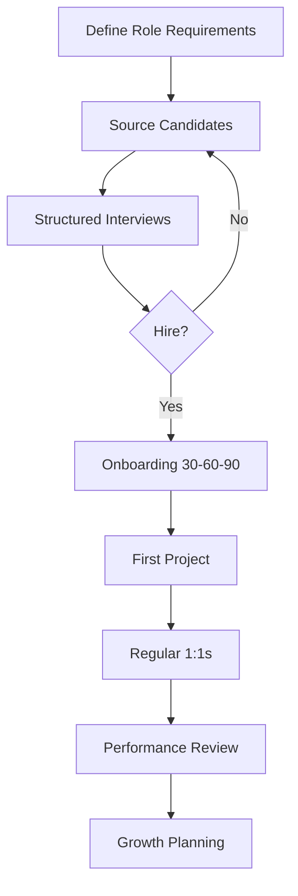
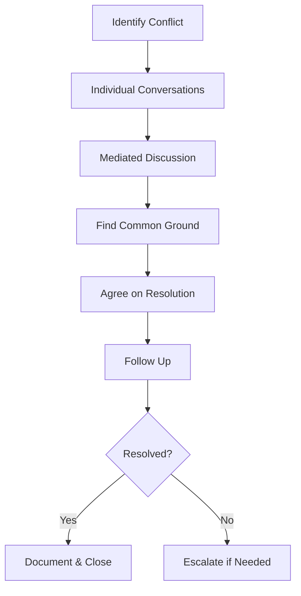
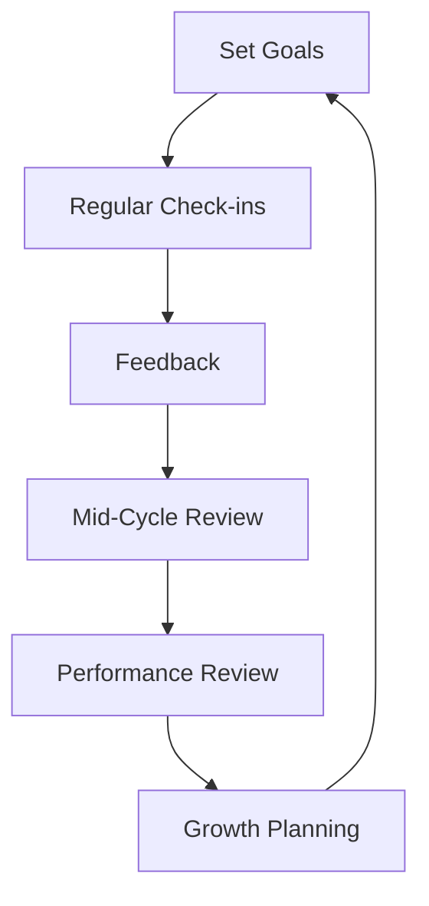
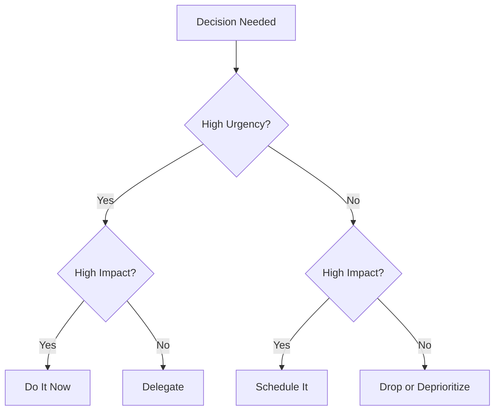

# 93 - Managerial Round

## Introduction

The managerial round evaluates your ability to lead teams, manage projects, resolve conflicts, and think strategically. It's common for senior engineering roles, tech lead positions, and engineering management tracks. Unlike technical rounds that test coding ability, managerial rounds assess your leadership philosophy, people management skills, and business thinking.

This guide covers management philosophy, team building, project management, conflict resolution, performance management, strategic thinking, resource allocation, and stakeholder management.

---

## Learning Roadmap

### Phase 1: Self-Assessment (Days 1-3)
- Define your management philosophy
- Identify your leadership strengths and areas for growth
- Reflect on past management/leadership experiences
- Research management frameworks

### Phase 2: Story Development (Days 4-6)
- Write 15+ management-focused STAR stories
- Cover team building, conflict, performance, strategy
- Practice articulating management decisions
- Prepare for common managerial questions

### Phase 3: Interview Prep (Days 7-10)
- Conduct mock managerial interviews
- Practice situational leadership scenarios
- Develop your management pitch
- Prepare questions for the interviewer

---

## Theory Notes

### Management Philosophy

#### Core Management Principles
1. **People first**: Great outcomes come from empowered, supported teams
2. **Clear expectations**: Everyone knows what success looks like
3. **Regular feedback**: Don't wait for performance reviews
4. **Trust and autonomy**: Hire good people and let them do their jobs
5. **Continuous improvement**: Regular retrospectives and learning

### Team Building

#### Hiring Framework
1. **Define the role**: Skills, experience, and cultural fit
2. **Structured interviews**: Consistent questions across candidates
3. **Technical assessment**: Evaluate skills objectively
4. **Culture fit**: Values alignment and team dynamics
5. **Diverse perspectives**: Different backgrounds lead to better solutions

#### Onboarding Best Practices
- First week: introductions, setup, documentation
- First month: small wins, mentor assignment, clear expectations
- First quarter: ownership of features, performance check-in
- Ongoing: regular 1:1s, feedback, growth planning

### Project Management

#### Agile Principles
- **Individuals and interactions** over processes and tools
- **Working software** over comprehensive documentation
- **Customer collaboration** over contract negotiation
- **Responding to change** over following a plan

#### Delivery Framework
1. **Planning**: Define scope, estimate, prioritize
2. **Execution**: Sprint cycles, daily standups, demos
3. **Monitoring**: Track progress, identify risks, adjust
4. **Delivery**: Deploy, measure, iterate

### Conflict Resolution

#### Thomas-Kilmann Model
| Style | When to Use |
|-------|------------|
| **Competing**: Quick decisions, emergencies |
| **Collaborating**: Important issues, both perspectives matter |
| **Compromising**: Time pressure, equal power |
| **Avoiding**: Trivial issues, emotions too high |
| **Accommodating**: Issue matters more to other party |

### Performance Management

#### Feedback Framework (SBI + Impact)
- **Situation**: Specific context
- **Behavior**: Observable action
- **Impact**: Effect on team/project
- **Discussion**: How to improve

#### Performance Review Elements
- Achievements against goals
- Technical growth
- Leadership and collaboration
- Areas for improvement
- Career development goals

---

## Key Concepts

### Strategic Thinking
- Connect daily work to company strategy
- Identify technical investments that enable business growth
- Balance short-term delivery with long-term architecture
- Anticipate scaling challenges
- Make build-vs-buy decisions

### Resource Allocation
- Balance team capacity with business priorities
- Protect team from context-switching
- Identify and remove blockers
- Plan for hiring and growth
- Manage technical debt allocation

### Stakeholder Management
- Map stakeholders by power and interest
- Communicate proactively with each group
- Translate between technical and business languages
- Manage expectations through regular updates
- Handle competing priorities diplomatically

---

## FAQ (25+ Q&A)

### Q1: What is your management philosophy?
**A:** "I believe in hiring smart people, setting clear expectations, and creating an environment where they can do their best work. I focus on removing obstacles, providing regular feedback, and connecting daily work to meaningful goals. I balance autonomy with accountability."

### Q2: How do you handle an underperforming team member?
**A:** 1) Have a private conversation to understand root cause. 2) Set clear, measurable expectations. 3) Provide support and resources. 4) Follow up regularly. 5) If no improvement, escalate with documentation.

### Q3: How do you prioritize competing projects?
**A:** Align with business objectives, assess impact and urgency, consider team capacity, communicate trade-offs transparently, and use a framework like RICE (Reach, Impact, Confidence, Effort).

### Q4: How do you handle a conflict between two team members?
**A:** Listen to both perspectives privately, facilitate a mediated conversation if needed, focus on interests not positions, and help find common ground. Document agreements.

### Q5: How do you balance technical debt with feature work?
**A:** Allocate a percentage of each sprint to tech debt (e.g., 20%). Track tech debt items. Prioritize based on impact on velocity and reliability. Communicate the business case for tech debt investment.

### Q6: How do you build a high-performing team?
**A:** Hire for both skills and culture. Set clear expectations. Create psychological safety. Give regular feedback. Celebrate wins. Invest in growth. Remove blockers.

### Q7: How do you handle scope changes mid-project?
**A:** Assess impact, communicate trade-offs, prioritize with stakeholders, adjust timeline if needed, and document changes through a formal process.

### Q8: How do you keep your team motivated?
**A:** Connect work to meaningful outcomes, provide growth opportunities, recognize achievements, protect from unnecessary stress, and maintain work-life balance.

### Q9: How do you make technical decisions?
**A:** Gather input from the team, evaluate trade-offs (cost, time, risk, scalability), consider long-term implications, document decisions and rationale, and commit fully once decided.

### Q10: How do you handle tight deadlines?
**A:** Prioritize ruthlessly, communicate what will and won't be delivered, protect the team from crunch, and negotiate scope if necessary. Focus on MVP.

### Q11: How do you give negative feedback?
**A:** Private setting, specific examples using SBI model, focus on behavior not personality, provide suggestions for improvement, follow up to support growth.

### Q12: How do you handle a team member who wants to leave?
**A:** Understand their reasons, see if the situation can be improved, support their decision if it's right for them, ensure knowledge transfer, and maintain the relationship.

### Q13: How do you manage up — communicating with leadership?
**A:** Lead with conclusions, provide options not problems, be transparent about risks, proactively share progress, and respect their time.

### Q14: How do you handle a project that's behind schedule?
**A:** Assess root cause, communicate early, re-scope if needed, get additional resources if possible, and focus on delivering the most critical parts first.

### Q15: How do you foster innovation?
**A:** Create time for exploration (hackathons, 20% time), encourage experimentation, accept failure as learning, celebrate creative solutions, and stay curious.

### Q16: How do you handle a team member who disagrees with a technical decision?
**A:** Listen to their reasoning, share your rationale, present data if available, and if they still disagree, explain the "disagree and commit" principle.

### Q17: How do you measure team performance?
**A:** Delivery velocity, code quality, team satisfaction, incident rates, and business impact. Balance quantitative metrics with qualitative feedback.

### Q18: How do you handle remote team management?
**A:** Over-communicate, document decisions, use async communication, build relationships deliberately, and create inclusive meeting practices.

### Q19: How do you handle a reorganization?
**A:** Communicate openly, support the team through transition, focus on what you can control, and help team members find their path in the new structure.

### Q20: How do you balance being a manager and a technical leader?
**A:** Stay technically current through code reviews and architecture discussions. Delegate operational tasks. Focus technical time on high-impact decisions and mentoring.

### Q21: How do you handle a team member who consistently misses deadlines?
**A:** First, investigate root causes — are estimates unrealistic, are there blockers, or is it a skill gap? Have a private conversation to understand what's happening. Set clear expectations with realistic timelines. Provide support or training if needed. If it persists, document and escalate with a performance improvement plan.

### Q22: How do you handle competing priorities from different stakeholders?
**A:** Map the stakeholder interests, assess business impact of each priority, negotiate trade-offs with data, communicate decisions transparently, and ensure alignment through written agreements. Never say yes to everything — be honest about trade-offs.

### Q23: How do you approach a team member who is brilliant but toxic?
**A:** Address the behavior directly using specific examples (SBI model), explain the impact on team morale and productivity, set clear expectations for change, provide support if needed, and be willing to make tough decisions if the behavior doesn't change. No individual is worth more than team health.

### Q24: How do you handle a team that has lost trust in leadership?
**A:** Start with transparency — acknowledge what went wrong. Create safe spaces for honest feedback. Follow through on commitments, no matter how small. Celebrate quick wins to rebuild momentum. Be patient — trust is rebuilt through consistent actions over time, not words.

### Q25: How do you approach building a team from scratch?
**A:** Define the team's mission and charter first. Hire for complementary skills and shared values. Establish norms, rituals, and communication practices early. Invest heavily in onboarding. Create psychological safety from day one. Celebrate early wins to build momentum.

---

## Common Mistakes

1. **Avoiding difficult conversations**: Issues don't resolve themselves
2. **Micromanaging**: Not trusting your team
3. **Not giving feedback**: Waiting for formal reviews
4. **Ignoring team morale**: Focusing only on delivery
5. **Poor communication**: Not keeping stakeholders informed
6. **Playing favorites**: Not treating team members fairly
7. **Taking credit**: Not recognizing team contributions
8. **Not developing others**: Focusing only on tasks, not growth
9. **Being indecisive**: Not making timely decisions
10. **Ignoring technical debt**: Only focusing on features

---

## Practice Scenarios

### Scenario 1: The Overloaded Team
**Situation:** Your team has three high-priority projects due within the same month. Team morale is dropping, people are working overtime, and quality is slipping.

**Your approach:**
1. Assess each project's actual deadline flexibility
2. Rank by business impact using RICE scoring
3. Negotiate with stakeholders on what can slip
4. Communicate the plan clearly to the team
5. Monitor for burnout and adjust as needed

**Key takeaway:** Protecting your team from unreasonable demands is a core management responsibility. Saying "no" or "not now" is part of the job.

### Scenario 2: The High Performer Who Wants a Promotion
**Situation:** A strong engineer on your team is frustrated and wants a promotion. They've been in their role for 18 months and feel they've outgrown it.

**Your approach:**
1. Acknowledge their contributions and frustration
2. Define clear promotion criteria and where they stand
3. Create a development plan with specific milestones
4. Set a realistic timeline for re-evaluation
5. If promotion isn't possible, explore other growth paths

**Key takeaway:** High performers leave when they feel stuck. Transparency about expectations and timelines prevents attrition.

### Scenario 3: The Cross-Team Conflict
**Situation:** Your team and another team have conflicting priorities. The other team's lead keeps pulling your engineers onto their projects without your approval.

**Your approach:**
1. Have a direct conversation with the other lead
2. Establish clear protocols for cross-team requests
3. Escalate to shared leadership if needed
4. Document agreements on how future conflicts are resolved
5. Build a relationship to prevent recurrence

**Key takeaway:** Cross-team conflicts are usually systemic, not personal. Fix the process, not just the symptom.

### Scenario 4: The Failed Deployment
**Situation:** A critical deployment failed in production, causing a 2-hour outage. The team is stressed, finger-pointing has started, and stakeholders are demanding answers.

**Your approach:**
1. Focus on recovery first, blame second
2. Lead a blameless post-mortem within 48 hours
3. Identify root cause and systemic fixes
4. Communicate transparently with stakeholders
5. Implement process changes to prevent recurrence

**Key takeaway:** How you handle failure defines your team culture. Blameless post-mortems create psychological safety and drive real improvement.

---

## Cheat Sheet

### Management Frameworks
```
Thomas-Kilmann:  Competing, Collaborating, Compromising, Avoiding, Accommodating
RICE Scoring:    Reach × Impact × Confidence / Effort
SBI Feedback:    Situation → Behavior → Impact
OKR Framework:   Objective → Key Results → Metrics
1:1 Template:    Wins → Challenges → Growth → Feedback → Action Items
```

### 1:1 Meeting Template
```
1. Personal check-in (2 min)
2. Wins and accomplishments (5 min)
3. Challenges and blockers (5 min)
4. Feedback (双向) (5 min)
5. Career growth and development (5 min)
6. Action items and next steps (3 min)
```

### Decision-Making Framework
```
High Urgency + High Impact:    Do it now
High Urgency + Low Impact:     Delegate
Low Urgency + High Impact:     Schedule it
Low Urgency + Low Impact:      Drop it
```

### Delegation Matrix
```
                    High Capability    Low Capability
High Motivation:   Delegate fully     Coach & empower
Low Motivation:    Engage & inspire   Manage closely
```

---

## Flash Cards (25)

### Card 1
**Q:** What is your management philosophy?
**A:** Hire smart people, set clear expectations, create an environment for success, provide regular feedback, and connect work to meaningful outcomes.

### Card 2
**Q:** How do you handle an underperforming team member?
**A:** Private conversation → understand root cause → set clear expectations → provide support → follow up → escalate if no improvement.

### Card 3
**Q:** How do you balance technical debt and features?
**A:** Allocate sprint capacity (e.g., 20%), track debt items, prioritize by impact, communicate business case for investment.

### Card 4
**Q:** How do you handle conflicting priorities?
**A:** Align with business objectives, assess impact/urgency, consider capacity, communicate trade-offs transparently.

### Card 5
**Q:** How do you build a high-performing team?
**A:** Hire for skills + culture, set clear expectations, create psychological safety, give regular feedback, invest in growth.

### Card 6
**Q:** How do you handle a team conflict?
**A:** Listen to both sides, facilitate mediated conversation, focus on interests not positions, find common ground.

### Card 7
**Q:** How do you measure team performance?
**A:** Delivery velocity, code quality, team satisfaction, incident rates, business impact. Balance metrics with qualitative feedback.

### Card 8
**Q:** How do you give negative feedback?
**A:** Private setting, SBI model, behavior not personality, suggestions for improvement, follow up.

### Card 9
**Q:** How do you handle tight deadlines?
**A:** Prioritize ruthlessly, communicate trade-offs, protect team from crunch, negotiate scope, focus on MVP.

### Card 10
**Q:** How do you manage up?
**A:** Lead with conclusions, provide options, be transparent about risks, proactively share progress.

### Card 11
**Q:** How do you handle a project behind schedule?
**A:** Assess root cause, communicate early, re-scope, get resources, focus on critical path.

### Card 12
**Q:** How do you foster innovation?
**A:** Time for exploration, encourage experimentation, accept failure as learning, celebrate creative solutions.

### Card 13
**Q:** How do you handle remote team management?
**A:** Over-communicate, document decisions, use async, build relationships deliberately, inclusive meetings.

### Card 14
**Q:** How do you make technical decisions?
**A:** Gather team input, evaluate trade-offs, consider long-term, document rationale, commit fully.

### Card 15
**Q:** How do you keep the team motivated?
**A:** Connect to meaningful outcomes, provide growth, recognize achievements, protect from stress.

### Card 16
**Q:** What is the Thomas-Kilmann model?
**A:** Five conflict styles: Competing, Collaborating, Compromising, Avoiding, Accommodating. Choose based on situation.

### Card 17
**Q:** How do you handle scope changes?
**A:** Assess impact, communicate trade-offs, prioritize with stakeholders, document through formal process.

### Card 18
**Q:** How do you balance management and technical leadership?
**A:** Stay current through code reviews, delegate operational tasks, focus technical time on high-impact decisions.

### Card 19
**Q:** How do you handle a team member who wants to leave?
**A:** Understand reasons, see if situation can improve, support their decision, ensure knowledge transfer.

### Card 20
**Q:** What makes a good manager?
**A:** Clear expectations, regular feedback, trust and autonomy, removing obstacles, developing people, and connecting work to purpose.

### Card 21
**Q:** How do you handle a brilliant but toxic team member?
**A:** Address behavior directly with SBI, explain impact, set expectations, support change, be willing to make tough decisions if behavior persists.

### Card 22
**Q:** How do you rebuild team trust after leadership failures?
**A:** Acknowledge failures openly, create safe feedback spaces, follow through on small commitments, celebrate quick wins, be patient.

### Card 23
**Q:** How do you approach building a team from scratch?
**A:** Define mission and charter, hire for complementary skills and shared values, establish norms early, invest in onboarding, celebrate early wins.

### Card 24
**Q:** How do you handle a failed deployment?
**A:** Focus on recovery first, lead blameless post-mortem, identify root cause, communicate transparently, implement process changes.

### Card 25
**Q:** How do you prioritize when everything is urgent?
**A:** Use impact/urgency matrix, negotiate with stakeholders, communicate trade-offs, protect team capacity, be willing to say no.

---

## Difficulty Rating

| Topic | Difficulty | Interview Frequency |
|-------|-----------|-------------------|
| Management Philosophy | ★★☆☆☆ | Very High |
| Team Building | ★★★☆☆ | High |
| Conflict Resolution | ★★★☆☆ | Very High |
| Performance Management | ★★★☆☆ | High |
| Strategic Thinking | ★★★★☆ | Medium |
| Resource Allocation | ★★★☆☆ | Medium |
| Stakeholder Management | ★★★★☆ | High |
| Project Delivery | ★★★☆☆ | Very High |
| Hiring Decisions | ★★★☆☆ | High |
| 1:1 Effectiveness | ★★☆☆☆ | Very High |

---

## Code Examples

### 1:1 Meeting Template
```markdown
# Weekly 1:1 — [Team Member Name] — [Date]

## Personal Check-in (2 min)
- How are you doing? How's your week been?

## Wins & Accomplishments (5 min)
- What went well this week?
- Any wins you want to celebrate?

## Challenges & Blockers (5 min)
- What's getting in your way?
- How can I help remove blockers?

## Feedback (5 min)
- [Give specific feedback using SBI model]
- [Ask for feedback on your management]

## Career Growth & Development (5 min)
- How are you feeling about your growth areas?
- Any learning opportunities you want to pursue?

## Action Items (3 min)
- [ ] Action 1 — Owner — Due date
- [ ] Action 2 — Owner — Due date
```

### Performance Review Template
```markdown
# Performance Review — [Name] — [Period]

## Achievements
- [Goal 1]: [Status] — [Evidence]
- [Goal 2]: [Status] — [Evidence]
- [Goal 3]: [Status] — [Evidence]

## Technical Growth
- Skills developed: [list]
- Areas for improvement: [list]

## Leadership & Collaboration
- Examples of leadership: [list]
- Team contributions: [list]

## Areas for Improvement
1. [Area]: [Specific behavior] → [Expected behavior]
2. [Area]: [Specific behavior] → [Expected behavior]

## Career Development Goals
- Short-term (6 months): [goal]
- Long-term (1-2 years): [goal]

## Support Needed
- From manager: [list]
- From team: [list]
- Training/courses: [list]
```

### Conflict Resolution Process
```markdown
# Conflict Resolution Framework

## Step 1: Acknowledge
- "I've noticed some tension between you and [Name] about [topic].
   I'd like to help resolve this."

## Step 2: Individual Conversations
- Meet with each person separately
- Listen without judgment
- Understand their perspective
- Identify common ground

## Step 3: Mediated Discussion
- Bring both parties together
- Set ground rules (no interruptions, respectful language)
- Each person shares their perspective
- Focus on interests, not positions

## Step 4: Find Common Ground
- "It sounds like you both agree on [X]. You disagree on [Y].
   Let's focus on how to handle [Y]."

## Step 5: Agree on Resolution
- Both parties agree on specific actions
- Document the agreement
- Set a follow-up date to check in

## Step 6: Follow Up
- Check in after 1-2 weeks
- Ensure the resolution is working
- Address any new issues
```

### Sprint Planning Template
```markdown
# Sprint Planning — [Sprint #] — [Date]

## Sprint Goal
[One sentence describing what we want to achieve]

## Capacity
- Team members: [list]
- Available days: [total]
- Sprint velocity (avg): [number]

## Prioritized Backlog
| # | Story | Priority | Estimate | Owner |
|---|-------|----------|----------|-------|
| 1 | [Story] | P0 | 3 days | [Name] |
| 2 | [Story] | P0 | 5 days | [Name] |
| 3 | [Story] | P1 | 2 days | [Name] |

## Risks & Dependencies
- [Risk 1]: [Mitigation]
- [Dependency 1]: [Owner] — [Status]

## Definition of Done
- [ ] Code reviewed
- [ ] Tests passing
- [ ] Documentation updated
- [ ] Deployed to staging
```

### Team Health Check Survey
```markdown
# Team Health Check — [Sprint/Quarter]

Rate each area 1-5 (1=Strongly Disagree, 5=Strongly Agree)

## Delivery
- We deliver on our commitments: ___
- We have a sustainable pace: ___
- Our estimation is accurate: ___

## Technical Excellence
- We maintain high code quality: ___
- We address technical debt regularly: ___
- Our architecture supports our needs: ___

## Collaboration
- We communicate effectively: ___
- We resolve conflicts constructively: ___
- Everyone's voice is heard: ___

## Growth
- We have opportunities to learn: ___
- We receive regular feedback: ___
- We're growing professionally: ___

## Culture
- We have psychological safety: ___
- We celebrate achievements: ___
- We have a positive work environment: ___

## Open Comments
[Anything else you'd like to share]
```

### Hiring Scorecard
```markdown
# Interview Scorecard — [Candidate Name] — [Role]

## Interviewer: [Your Name] — [Date]

### Technical Skills (1-5)
- Coding ability: ___
- System design: ___
- Problem solving: ___
- Technical communication: ___

### Behavioral (1-5)
- Leadership examples: ___
- Teamwork: ___
- Conflict resolution: ___
- Learning mindset: ___

### Culture Fit (1-5)
- Values alignment: ___
- Communication style: ___
- Work ethic: ___
- Growth potential: ___

### Overall Assessment
- Strong Hire / Hire / No Hire / Strong No Hire

### Key Strengths
1. [Strength]
2. [Strength]
3. [Strength]

### Concerns
1. [Concern]
2. [Concern]

### Recommendation
[Your recommendation with reasoning]
```

---

## Mermaid Diagrams

### Team Building Process


### Conflict Resolution Flow


### Performance Management Cycle


### Decision-Making Framework


---

## Resources

### Books
- *The Making of a Manager* by Julie Zhuo
- *High Output Management* by Andrew Grove
- *Radical Candor* by Kim Scott
- *The Manager's Path* by Camille Fournier
- *An Elegant Puzzle* by Will Larson
- *Turn the Ship Around* by L. David Marquet
- *Drive* by Daniel Pink
- *Crucial Conversations* by Patterson, Grenny, McMillan, Switzler

### Online
- [Rands Leadership Blog](https://randsinrepose.com)
- [Will Larson's Blog](https://lethain.com)
- [First Round Review](https://review.firstround.com)
- [Engineering Manager Resources](https://github.com/ryanburgess/manager)
- [Lara Hogan's Blog](https://larahogan.me)
- [Julie Zhuo's Blog](https://juliezhuo.com)

### Podcasts
- *The Engineering Manager Podcast*
- *StaffEng Podcast*
- *Rands in Reprise*
- *An Elegant Puzzle (audiobook)*

---

## Summary

Managerial rounds assess your ability to lead, manage, and think strategically. Key takeaways:

1. **People first** — great outcomes come from empowered teams
2. **Clear expectations** — everyone knows what success looks like
3. **Regular feedback** — don't wait for formal reviews
4. **Handle conflicts early** — issues don't resolve themselves
5. **Balance delivery and quality** — allocate for tech debt
6. **Communicate proactively** — don't wait for stakeholders to ask
7. **Develop your team** — invest in their growth
8. **Make decisions** — be decisive with incomplete information
9. **Measure what matters** — balance metrics with qualitative feedback
10. **Be authentic** — your management style should be genuine
